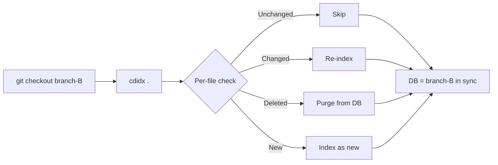
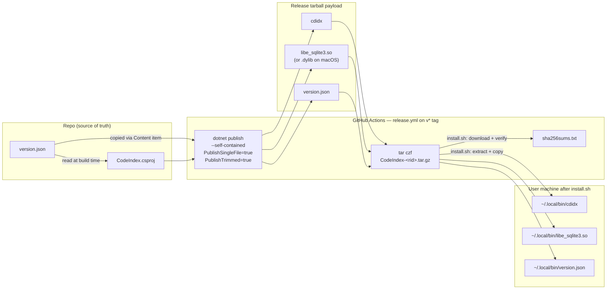
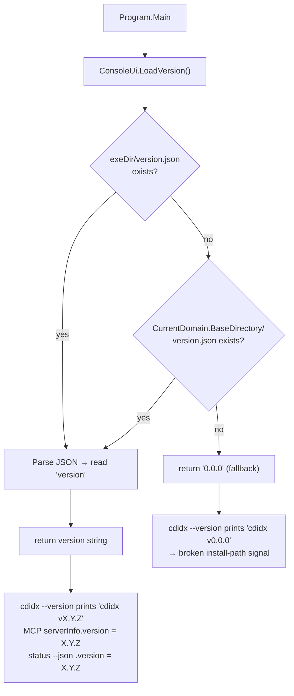
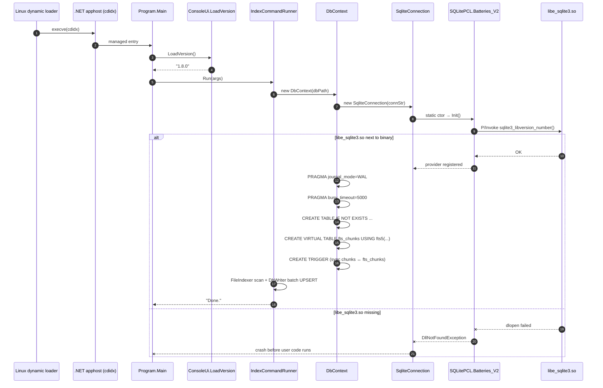
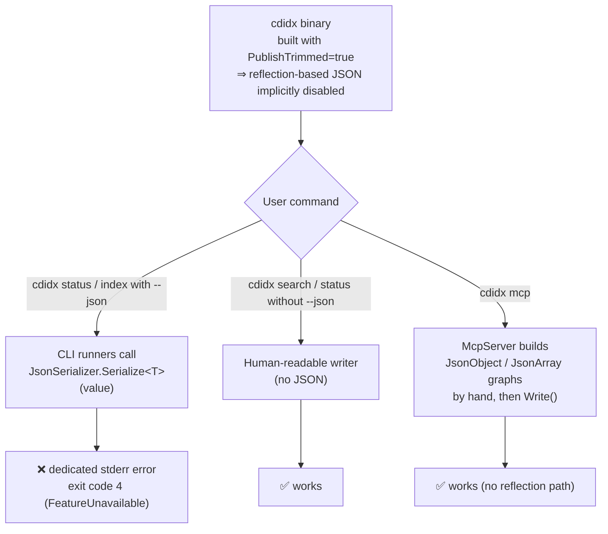
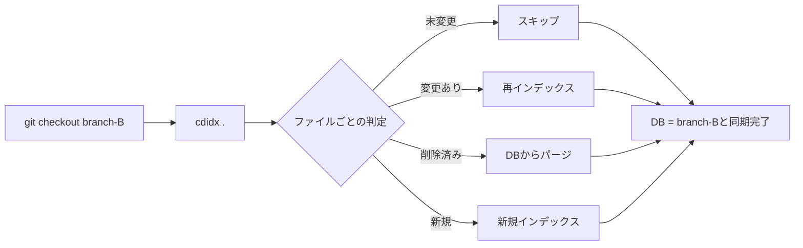
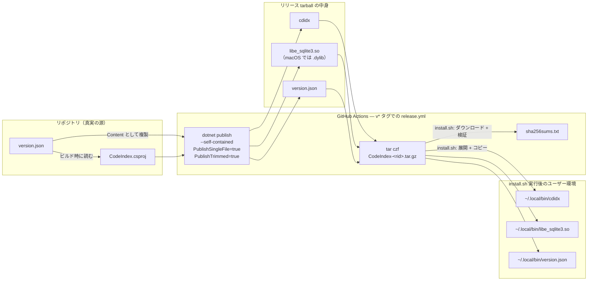
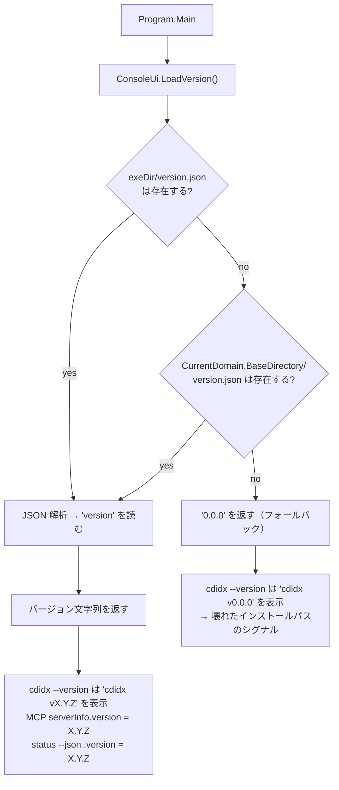
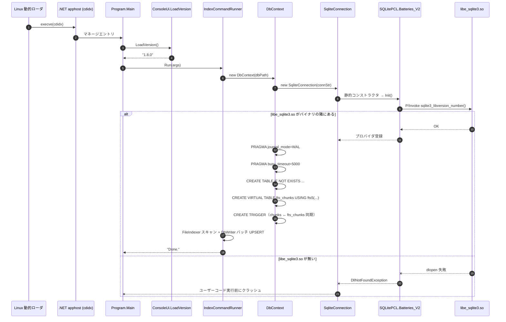
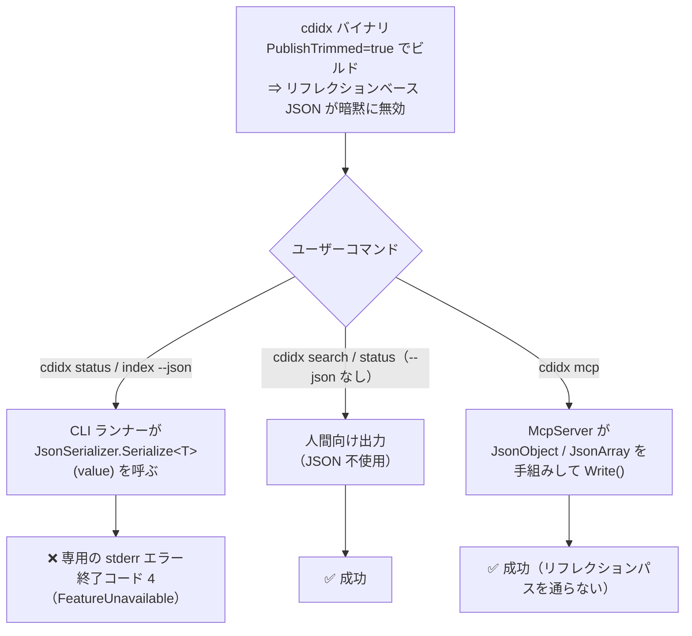

# Developer Guide

> **[日本語版はこちら / Japanese version](#開発者ガイド)**

## Build & Test

```bash
dotnet build
dotnet test
dotnet run --project src/CodeIndex -- <command> [options]
```

For test suite structure, shared helpers, and test-writing conventions, see [TESTING_GUIDE.md](TESTING_GUIDE.md).

## Architecture

```
src/CodeIndex/
  Program.cs                  — Thin CLI entry point and command routing
  Cli/
    CommandExitCodes.cs       — Shared process exit codes
    ConsoleUi.cs              — Spinner, progress bar, banner, easter egg, version, usage text
    DbPathResolver.cs         — Resolve default index DB paths and query-time project roots for explicit `--db` values
    GitHelper.cs              — Git helpers: diff-tree for --commits, worktree-aware common dir resolution
    GlobalToolLog.cs          — Best-effort persistent stderr/lifecycle log for distributed installs, with 30-file retention
    IndexCommandRunner.cs     — Index command execution, ignore-aware update/full-scan flows, backfill-fold upgrade path
    QueryCommandRunner.cs     — Search/definition/references/callers/callees/symbols/files/find/excerpt/map/inspect/outline/status execution and query arg parsing
    SearchSnippetFormatter.cs — Match-centered search snippet formatting for human/JSON output
    WorkspaceMetadataEnricher.cs — Enrich status/map/inspect with project root, git HEAD, dirty flag
  Database/
    DbContext.cs              — SQLite connection, WAL mode, schema init
    DbWriter.cs               — UPSERT, batch insert, stale file purge, FTS cleanup, reference writes
    DbReader.cs               — FTS search, definition/reference/caller/callee lookup, symbol lookup, in-file literal find, excerpt reconstruction, outline, inspect bundles, file listing, status, file-level deps
    LineWidthFormatter.cs     — Shared single-line payload clamp helper used by find/references/excerpt/inspect and MCP counterparts to keep focused tokens visible while shrinking long lines
    RepoMapBuilder.cs         — Repo-level overview builder (map): file stats, entrypoint scoring, module grouping
  Indexer/
    FileIndexer.cs            — Directory scan, shared path filtering for full/update runs, built-in skip lists plus `.gitignore` / `.cdidxignore`, extension/file-name/shebang language detection, FileRecord building
    ChunkSplitter.cs          — 80-line chunks with 10-line overlap
    SymbolExtractor.cs        — Hybrid symbol extraction: compiled regexes for most languages, plus a lightweight JS/TS lexer/state machine for class-body methods, scope filtering, and range resolution
    ReferenceExtractor.cs     — Regex-based call/reference extraction, including type-position `type_reference` edges plus a depth-aware fallback for nested-generic call sites (31 languages with graph queries)
  Mcp/
    McpServer.cs              — MCP server (stdin/stdout JSON-RPC 2.0 for AI coding tools; includes batch_query)
  Models/
    FileRecord.cs             — File metadata DTO
    ChunkRecord.cs            — Chunk DTO
    SymbolRecord.cs           — Symbol DTO
    ReferenceRecord.cs        — Reference DTO
tests/CodeIndex.Tests/
  ChunkSplitterTests.cs       — ChunkSplitter tests
  ReferenceExtractorTests.cs  — ReferenceExtractor tests
  SymbolExtractorTests.cs     — SymbolExtractor tests
  FileIndexerTests.cs         — FileIndexer tests
  DatabaseTests.cs            — DbContext/DbWriter integration tests
  DbReaderTests.cs            — DbReader query tests
  McpServerTests.cs           — MCP server tests
  GitHelperTests.cs           — Git helper tests
  ConsoleUiTests.cs           — Console output and help text tests
  DbPathResolverTests.cs      — DB path resolution tests
  IndexCommandRunnerTests.cs  — Index command integration tests
  QueryCommandRunnerTests.cs  — Query CLI integration tests
  SearchSnippetFormatterTests.cs — Search snippet formatting tests
  WorkspaceMetadataEnricherTests.cs — Workspace metadata tests
  TestProjectHelper.cs        — Shared helper for temp indexed projects
  TestConsoleLock.cs           — Shared lock for console-redirecting tests
```

### Indexing pipeline

```
Directory scan / shared path filter (built-in skip lists + `.gitignore` / `.cdidxignore`) → Language detection → File read (UTF-8)
  → UPSERT file record
  → Split into chunks (80 lines, 10-line overlap)
  → Extract symbols via regex
  → Extract lightweight references via regex
  → Batch insert chunks + symbols + references (500 per transaction)
  → Populate FTS5 index
```

Scoped `--files` / `--commits` refreshes reuse the same path filter as full scans. If a commit-scoped refresh includes `.gitignore` or `.cdidxignore` changes, `IndexCommandRunner` falls back to a full scan so newly ignored files are purged safely. Malformed ignore lines are reported as scan errors and skipped instead of aborting the whole run.

## Database schema

### Tables

```sql
-- File metadata
files (
    id          INTEGER PRIMARY KEY AUTOINCREMENT,
    path        TEXT NOT NULL UNIQUE,       -- relative path from project root
    lang        TEXT,                        -- detected language (e.g. "python")
    size        INTEGER,                    -- file size in bytes
    lines       INTEGER,                    -- line count
    checksum    TEXT,                        -- SHA256 of raw file bytes
    modified    DATETIME,                   -- file modification time (UTC)
    indexed_at  DATETIME DEFAULT CURRENT_TIMESTAMP
)

-- Content chunks for full-text search
chunks (
    id          INTEGER PRIMARY KEY AUTOINCREMENT,
    file_id     INTEGER NOT NULL REFERENCES files(id) ON DELETE CASCADE,
    chunk_index INTEGER NOT NULL,           -- 0-based chunk position
    start_line  INTEGER,                    -- 1-based start line
    end_line    INTEGER,                    -- 1-based end line (inclusive)
    content     TEXT,
    UNIQUE(file_id, chunk_index)
)

-- Extracted symbols (functions, classes, imports, namespaces)
symbols (
    id              INTEGER PRIMARY KEY AUTOINCREMENT,
    file_id         INTEGER NOT NULL REFERENCES files(id) ON DELETE CASCADE,
    kind            TEXT,                    -- "function", "class", "import", "namespace", ...
    name            TEXT,
    line            INTEGER,                 -- 1-based anchor line
    start_line      INTEGER,                 -- definition start line
    end_line        INTEGER,                 -- definition end line
    body_start_line INTEGER,                 -- body start line when known
    body_end_line   INTEGER,                 -- body end line when known
    signature       TEXT,                    -- trimmed declaration/signature line
    container_kind  TEXT,
    container_name  TEXT,
    container_qualified_name TEXT,           -- qualified enclosing path (namespace/type stack)
    family_key      TEXT,                    -- authoritative cross-file family key when known
    visibility      TEXT,
    return_type     TEXT
)

-- Indexed references such as call sites
symbol_references (
    id              INTEGER PRIMARY KEY AUTOINCREMENT,
    file_id         INTEGER NOT NULL REFERENCES files(id) ON DELETE CASCADE,
    symbol_name     TEXT,                    -- referenced symbol name
    reference_kind  TEXT,                    -- "call", "instantiate", "subscribe", "attribute", "annotation", "type_reference"
    line            INTEGER,                 -- 1-based line number
    column_number   INTEGER,                 -- 1-based column number
    context         TEXT,                    -- trimmed source line
    container_kind  TEXT,
    container_name  TEXT
)

-- FTS5 virtual table mirroring chunks.content
fts_chunks USING fts5(content, content='chunks', content_rowid='id')

-- Query-semantic readiness metadata
codeindex_meta (
    key         TEXT PRIMARY KEY NOT NULL,
    value       TEXT
)
```

### Indexes

```sql
idx_files_lang      ON files(lang)
idx_files_modified  ON files(modified)
-- idx_files_path is not needed: the UNIQUE constraint on path creates an implicit index
idx_chunks_file     ON chunks(file_id)
idx_symbols_name    ON symbols(name)
idx_symbols_file    ON symbols(file_id)
idx_symbol_refs_name      ON symbol_references(symbol_name)
idx_symbol_refs_file      ON symbol_references(file_id)
idx_symbol_refs_container ON symbol_references(container_name)
```

### FTS5 sync triggers

```sql
-- Keep fts_chunks in sync with chunks table automatically
fts_chunks_ai   AFTER INSERT ON chunks  -- insert into FTS
fts_chunks_ad   AFTER DELETE ON chunks  -- delete from FTS
fts_chunks_au   AFTER UPDATE ON chunks  -- delete old + insert new in FTS
```

### Entity-Relationship

```
files 1──N chunks 1──1 fts_chunks (content mirror)
files 1──N symbols
files 1──N symbol_references
```

## Why a database instead of grep?

On small projects, `grep` works fine. But as a codebase grows to tens of thousands of files, `grep` becomes a bottleneck — especially when an AI agent calls it repeatedly. cdidx solves this by **reading every file once at index time** and building a search structure so that queries never need to touch the original files again.

`grep -r "keyword" .` performs a brute-force linear scan: it opens every file, reads every line, and checks for a match. The tenth search costs the same as the first. cdidx shifts the expensive work to a one-time indexing step, and subsequent searches are cheap lookups into the pre-built database.

| Factor | `grep -r` | cdidx (SQLite FTS5) |
|---|---|---|
| **Search algorithm** | Linear scan of every file, every time | Token lookup in inverted index |
| **Repeated searches** | Same full cost each time | Near-instant after initial index |
| **Startup cost** | None | One-time indexing (incremental updates after) |
| **What is stored** | Nothing — reads files on the fly | Source text in chunks + inverted index of tokens |
| **Structured queries** | Text matching only | Filter by language, path, symbol kind, line range |
| **Symbol awareness** | None — just raw text | Knows function/class/import names and locations |
| **AI token cost** | Returns raw lines — noisy, high token usage | Returns precise chunks with file path and line numbers |

### When to use which

| Scenario | Recommended |
|---|---|
| Quick one-off search in a small project | `grep` |
| Repeated searches across a large codebase | **cdidx** |
| AI agent performing multiple code lookups | **cdidx** |
| Finding all usages of a function by name | **cdidx** (`symbols` table) |
| Searching binary files or non-code content | `grep` |

## Why SQLite?

Given that a database is the right approach, why SQLite specifically rather than PostgreSQL, DuckDB, LiteDB, or a dedicated search engine like Tantivy?

**The short answer: SQLite is the only option that keeps cdidx a zero-configuration, single-file CLI tool with exactly one production dependency.**

### Alternatives considered

| Alternative | Strength | Why it doesn't fit cdidx |
|---|---|---|
| **PostgreSQL / MySQL** | Concurrency, scalability, advanced FTS | Requires a running server. Users would need to install and manage a database before using cdidx — this destroys the `dotnet tool install -g cdidx` experience. |
| **DuckDB** | Fast analytical (OLAP) queries, columnar storage | No built-in full-text search. cdidx's workload is OLTP (insert + keyword search), not analytics. .NET bindings are less mature than `Microsoft.Data.Sqlite`. |
| **LiteDB** | .NET-native embedded NoSQL, schema-free | No FTS. The relational structure of symbols → references → callers/callees is a natural fit for SQL joins, not document queries. |
| **Tantivy / Lucene** | Purpose-built full-text search with superior ranking | Handles only the search side. Relational data (symbols, references, file metadata) would need a separate store, creating a two-storage sync problem. |
| **Vector DBs** (Qdrant, Chroma) | Semantic / embedding-based search | Requires an embedding model (adds a large dependency or API calls). Keyword and structural queries are weak. Could complement SQLite in the future but cannot replace it. |

### What makes SQLite the right fit

1. **Zero configuration** — No server process, no connection strings, no ports. `cdidx index .` just works.
2. **Single-file database** — The entire index lives in `.cdidx/codeindex.db`. Copy, delete, or move it like any file.
3. **Cross-platform** — Identical behavior on Windows, macOS, and Linux without platform-specific setup.
4. **One production NuGet dependency** — `Microsoft.Data.Sqlite` is the only production/runtime dependency in `src/CodeIndex`. Test-only packages may still exist in `tests/CodeIndex.Tests/`, but they do not ship with the product and do not weaken that rule. This minimizes supply-chain risk and binary size.
5. **FTS5 built-in** — Full-text search is a native SQLite extension with inverted indexes, phrase queries, and ranking — no external search engine required.
6. **Relational + FTS in one engine** — Symbols, references, chunks, and file metadata live alongside the FTS index in the same database. Joins, triggers, and transactions keep everything consistent without cross-system synchronization.
7. **WAL mode** — Write-Ahead Logging allows concurrent reads during indexing and supports the MCP server serving queries while a background index runs.
8. **Incremental by nature** — SQLite transactions, `ON CONFLICT DO UPDATE`, and timestamp comparison make incremental indexing straightforward.

### When SQLite would not be enough

- **Massive monorepos (1M+ files):** SQLite's single-writer model could become a bottleneck. Sharding by project (cdidx already uses per-project databases) mitigates this, but true parallel writes would need a server database.
- **Semantic search:** Embedding-based similarity search would benefit from a vector index. The `sqlite-vec` extension could add this without leaving SQLite, or a hybrid architecture (SQLite + external vector store) could be considered.

For the current use case — a local CLI tool that indexes a single project for keyword search and symbol navigation — SQLite hits the sweet spot of simplicity, performance, and capability.

## FTS5 full-text search

[FTS5](https://www.sqlite.org/fts5.html) (Full-Text Search 5) is a SQLite extension that provides an **inverted index** for full-text search: it maps each token (word) to a list of documents containing it, enabling O(1) lookups by keyword rather than scanning every row.

FTS5 works through a **virtual table** — a table that looks and behaves like a normal SQLite table but stores its data in a specialized format optimized for text search.

### What is an inverted index?

An inverted index maps each word (token) to the list of documents (or rows) that contain it — like the index at the back of a textbook.

For example, suppose three chunks contain the following code:

| Chunk ID | Content (simplified) |
|---|---|
| 1 | `handleRequest(ctx)` |
| 2 | `sendResponse(ctx)` |
| 3 | `handleRequest(req); sendResponse(res)` |

The inverted index built by FTS5 would look like:

| Token | Chunk IDs |
|---|---|
| `handleRequest` | 1, 3 |
| `sendResponse` | 2, 3 |
| `ctx` | 1, 2 |
| `req` | 3 |
| `res` | 3 |

When you search for `handleRequest`, FTS5 reads the entry for that token and immediately returns chunk IDs `{1, 3}` — no scanning required.

### How it differs from B-tree indexes

A B-tree (balanced tree) is the default index structure in SQLite. It organizes values in a sorted, tree-shaped hierarchy — similar to how a phone book is sorted alphabetically:

```
            [go | python]
           /      |       \
    [csharp]  [java, kotlin]  [rust, typescript]
```

B-tree indexes are good for exact matches (`WHERE lang = 'csharp'`), range queries (`WHERE modified > '2025-01-01'`), and sorting. However, they cannot efficiently answer "which rows contain the word `handleRequest` somewhere in a text column?" — that requires FTS5.

| | B-tree index | FTS5 inverted index |
|---|---|---|
| **Use case** | Exact match, range, prefix on a single column | Natural language keyword search across text |
| **Lookup** | `WHERE path = 'foo.py'` | `WHERE fts_chunks MATCH 'authenticate'` |
| **Structure** | Sorted tree of column values | Token → document ID posting lists |
| **Ranking** | N/A (returns exact matches) | BM25 relevance scoring |
| **Used on** | `path`, `lang`, `modified`, `file_id`, `name` | `chunks.content` (code text) |

These two index types complement each other. A typical query might use FTS5 to find matching chunks and then use B-tree indexes to filter by language or file path.

### The `fts_chunks` virtual table

```sql
CREATE VIRTUAL TABLE IF NOT EXISTS fts_chunks USING fts5(
    content,
    content='chunks',
    content_rowid='id'
);
```

| Parameter | Meaning |
|---|---|
| `USING fts5(...)` | Use the FTS5 engine to manage this virtual table |
| `content` | The column to index — corresponds to `chunks.content` (the actual code text) |
| `content='chunks'` | **External-content table** — `fts_chunks` does not store a copy of the text. It references `chunks`. |
| `content_rowid='id'` | The `rowid` of each FTS5 entry matches `chunks.id` for direct row lookup |

### Content sync

`fts_chunks` is a **content-external** FTS5 table (`content='chunks'`). It does not store the original text; instead, it points to `chunks.id` via `content_rowid`. This avoids doubling storage. cdidx keeps the FTS index in sync via database triggers (`fts_chunks_ai`, `fts_chunks_ad`, `fts_chunks_au`) that fire on insert, delete, and update of the `chunks` table.

### Query syntax

FTS5 supports advanced query syntax:

```sql
-- Single term
WHERE fts_chunks MATCH 'authenticate'

-- Phrase (exact sequence)
WHERE fts_chunks MATCH '"handle request"'

-- Boolean operators
WHERE fts_chunks MATCH 'auth AND token'
WHERE fts_chunks MATCH 'auth OR login'
WHERE fts_chunks MATCH 'auth NOT oauth'

-- Prefix search
WHERE fts_chunks MATCH 'auth*'

-- Column filter (only one column here, but useful in multi-column FTS)
WHERE fts_chunks MATCH 'content:authenticate'
```

### How the search works

When you run:
```sql
SELECT f.path, c.start_line, c.content
FROM fts_chunks fc
JOIN chunks c ON c.id = fc.rowid
JOIN files f ON f.id = c.file_id
WHERE fts_chunks MATCH 'handleRequest'
LIMIT 20;
```

1. FTS5 looks up `handleRequest` in its inverted index → gets a list of matching chunk `rowid`s directly
2. Joins back to `chunks` to get the 80-line code block with start/end line numbers
3. Joins to `files` to get the file path and language

No files are opened. No directories are scanned. The entire search runs inside SQLite.

## Chunking strategy

Files are split into **80-line chunks with 10-line overlap**. The overlap ensures that a symbol definition or code block spanning a chunk boundary will appear in full in at least one chunk.

```
Lines   1-80   → Chunk 0
Lines  71-150  → Chunk 1  (10-line overlap with chunk 0)
Lines 141-220  → Chunk 2  (10-line overlap with chunk 1)
...
```

The step size is `80 - 10 = 70` lines. A file with N lines produces `ceil((N - 80) / 70) + 1` chunks (minimum 1).

## Symbol extraction

Most languages still use **compiled regex patterns**, matched one line at a time for functions, classes, and sometimes imports. JavaScript and TypeScript add a lightweight lexer/state machine on top of the regex pass for cases that line-oriented regex cannot handle reliably, such as class-body bare methods, computed and modifier-prefixed methods, scope-aware synthetic class expressions, and JS/TS-specific range resolution. HTML uses a dedicated character-level state machine instead of the regex pattern loop — it walks tag openers, quoted/unquoted attribute values (including multi-line values), and masks `<script>`/`<style>`/`<textarea>`/`<title>` bodies plus `<!-- ... -->` comments so attribute-lookalike strings inside those regions do not leak phantom symbols. Named capture groups still extract identifiers for the regex-driven paths.

Supported symbol kinds by language (33 languages with symbol extraction):

| Language | function | class | struct | interface | enum | property | event/delegate | import | Graph |
|---|---|---|---|---|---|---|---|---|:---:|
| Python | def, async def | class | -- | -- | -- | @property | -- | from/import | yes |
| JavaScript | function, arrow, methods (including same-line keyword/modifier-named methods, default arguments, computed names, `#private`, generator, `async *`) | class, export default class, same-line sibling/statement-prefixed public classes, class expressions, multiline/parenthesized/CommonJS class exports | -- | -- | -- | -- | -- | import...from | yes |
| TypeScript | function, arrow, methods (including generic and same-line object/conditional/function-return methods, default arguments, computed names, `#private`, generator, `async *`) | class, export default class, anonymous default `abstract class`, `export = class`, same-line sibling/statement-prefixed public classes, class expressions, multiline/parenthesized class expressions, type | -- | interface | enum, const enum | -- | -- | import...from | yes |
| C# | methods, ctors, explicit-interface impls (including qualifiers with multi-argument generics like `IMap<string, int>.GetCount`, nullable type arguments like `IFoo<string?>.NullableArg`, array type arguments like `IFoo<int[]>.ArrayArg`, and generic-over-tuple return types such as `Task<(int, string)>`, `Dictionary<string, (int x, int y)>`, `IEnumerable<(string Key, int Value)>`, and `List<(int, int)> IFoo.GetList()`), and indexers (including `ref` / `ref readonly` returns, pointer / function-pointer returns such as `int*` / `void**` / `delegate*<int, int>` / `int*[]`, and tuple returns with trailing `[]` / `?` / `[,]` / `[][]` suffixes such as `(int, int)[]` / `(int, int)?` / `(int, int)[][]` / `(int, int)[,]`; guards named-argument labels only before qualified call expressions; allows `global::` / alias-qualified return types and spaced generic type tokens; attribute-stripper blanks out multi-section attributes such as `[Obsolete, Conditional("DEBUG")]` and `[Fact, Trait("cat","io")]` so trailing attribute names are not leaked as phantom `function` symbols; LINQ query-expression contextual keywords such as `from` / `where` / `select` / `orderby` / `group` / `join` / `let` / `into` / `on` / `equals` / `ascending` / `descending` / `by` are excluded from the return-type position so continuation lines like `where Validator.Check(x)` / `select Mapper.Convert(x)` / `orderby Math.Abs(x)` do not emit phantom `function` symbols for the qualified member name; field-like `function` rows for `const` / `static readonly` are column-gated to real type bodies so method-local declarations such as `const string content = "hello";` do not leak as symbols, and qualified-member rows also reject operator/contextual return-type tails such as `elapsed <` before call-site expressions like `TimeSpan.FromSeconds(...)` while preserving real verbatim-identifier return types such as `public @new Make()`; modifier order is free, so visibility may appear at any position in the modifier sequence on every C# row — type declarations (`abstract public class`, `sealed public class`, `readonly public struct`, `ref public struct`, `partial public interface`, `abstract public record class`), `const` fields (`new public const int X = 1;`, `public new const int X = 1;`), `static readonly` fields (`readonly public static int E = 6;`), methods (`static public int F() => 0;`), properties (`static public int P { get; set; }`), indexers (`static public int this[int i] => 0;`), events, delegates, operator / conversion-operator overloads (including C# 11 `static abstract` / `abstract static` interface operator members such as `static abstract T operator +(T a, T b);` / `abstract static T operator -(T a, T b);` / `static abstract implicit operator T(int x);` / `abstract static explicit operator int(T t);` — both modifier orders are accepted on both binary/unary operator rows and conversion operator rows so generic-math interfaces such as `System.Numerics.INumber<TSelf>` / `IAdditionOperators` / `IComparisonOperators` are captured), constructors (`unsafe public S(int* p) {}`, `extern public S(int x);`, with a positional negative lookahead that rejects lines whose matching `)` is followed by an identifier + `{` / `(` / `=>` (with optional `?` / `[]` / `[,]` / whitespaced tuple suffixes such as `) []` / `) ?` / `)  ?` in between, factored into a shared `CSharpTupleSuffixPattern` constant consumed by both `CSharpTypePattern` and the ctor lookahead so the two stay in lock-step) — the exact shape of a property or expression-bodied method with a modifier keyword, so contextual / reserved keywords like `partial` / `required` / `readonly` / `async` / `sealed` / `virtual` / `override` / `abstract` / `new` / `file` / `static` cannot be captured as the constructor name when the method / property regex upstream fails — e.g. `public required (int, int) R1 { get; init; }` and `public required (int, int) [] R4 { get; init; }` previously emitted a phantom `function required` row; multi-line ctor signatures, `extern` ctors ending in `;`, expression-bodied ctors, `: base(...)` / `: this(...)` initializers, and tuple-parameter ctors are all unaffected), and static constructors (`unsafe static S()`) — `unsafe` / `extern` are also accepted as free-order modifiers on the property / indexer / event / constructor / static-constructor rows, `static` / `readonly` may be interleaved with `new` in any order (e.g. `readonly new static`, `new readonly static`), C# inheritance modifiers `virtual` / `override` / `abstract` / `sealed` / `new` are accepted as free-order modifiers on event declarations (`abstract public event E;`, `sealed public override event E;`), and `partial` is accepted as a free-order modifier on event and indexer declarations so C# 13 partial indexer members (`public partial int this[int i] { get; }`, expression-body and block-body declaration / implementation pairs across partial class fragments) and C# 14 field-like / accessor-based partial events (`public partial event System.Action X;`, `public partial event System.Action<string> OnLog { add { } remove { } }`) are captured instead of silently dropped, and the `file` file-scoped type modifier plus nested `new` are accepted on `interface` and `delegate` rows (`file interface I {}`, `file delegate int D(int x);`)), operators stored as `operator +` / `operator checked +` / `operator checked -` (including unary, binary, and other C# 11 user-defined checked operators), conversion operators stored as `implicit operator decimal` / `explicit operator Money` / `explicit operator checked int` (including `unsafe` / `extern` forms and function-pointer target types), indexers normalized to `Item`, const, static readonly, enum members, #region, finalizers | class, record (wrapped headers preserve base list and `where` clauses in `symbols.signature`, including C# 12 primary constructor parameter lists) | struct, record struct, ref struct (wrapped headers preserve base list and `where` clauses in signature) | interface (wrapped headers preserve base list and `where` clauses in signature) | enum (wrapped headers preserve `: underlyingType` in signature) | property, partial property, expression-bodied, `ref` / `ref readonly` properties, pointer properties, tuple-array / nullable-tuple properties, explicit-interface property implementations (both brace-body `int IThing.Value { get; set; }` and expression-body `string IThing.Name => "x";`, including generic interface qualifiers like `IBucket<int>.Items` and multi-argument generic qualifiers like `IMap<string, int>.PairCount`), record primary components, plain fields (instance, readonly, volatile, plain static, with or without initializer, multi-line declarations that wrap before `;` — including parenthesized / constructor-call initializers such as `= new(\n    () => 42);` and object / collection initializers such as `= new() { ... };` / `= new Dictionary<...> { ... };` — declarator lists such as `int _x, _y;` — one symbol per declarator — and function-pointer fields such as `delegate*<int, void> Callback;` / `delegate* unmanaged[Cdecl]<int, int> _op;`) | event, explicit-interface event implementations (`event EventHandler IFoo.Evt { add { } remove { } }`, including same-line / next-line accessor blocks and generic qualifiers such as `IMap<string, int>.Evt3`), delegate (including spaced generic type tokens and pointer returns) | using, using alias, extern alias | yes |
| Go | func, methods | type alias | struct | interface | -- | -- | -- | import | yes |
| Rust | fn, macro_rules!, const, static | impl, type alias | struct, union | trait | enum | -- | -- | use | yes |
| Java | methods (including same-line leading annotations, lexer-aware annotation arguments such as `@Label(")")` and `@SuppressWarnings({"unchecked"})`, compact constructors in both same-line and Allman-style brace layouts, same-line brace-bodied siblings, and same-line enum-constant-body methods), static final, enum members (body-scoped scanner that tracks strings/chars/comments/text blocks and stops at the first top-level `;`, so method calls like `\tRED();` outside the enum body are not captured; enum constants with anonymous bodies retain body ranges so nested overrides and same-line body-local methods attach to the enum-member container) | class, record, sealed, @interface | -- | interface | enum | record primary components | -- | import | yes |
| Kotlin | fun, extension fun | class, object, companion (anonymous companions normalize to `Companion`), data/sealed/value class | -- | interface | enum class | val/var | -- | import | yes |
| Ruby | def, Rails DSL | class, module | -- | -- | -- | attr_accessor/reader/writer | -- | require | yes |
| C | functions | -- | struct | -- | enum | -- | -- | #include | yes |
| C++ | functions | class | struct | -- | enum, enum class | -- | -- | #include | yes |
| PHP | function, const | class | -- | interface, trait | enum | -- | -- | use, require/include | yes |
| Swift | func | class, actor | struct | protocol | enum | -- | -- | import | yes |
| Dart | functions | class, mixin, extension | -- | -- | enum | -- | -- | import | yes |
| Scala | def | class, object | -- | trait | enum | -- | -- | import | yes |
| Elixir | def, defp | defmodule | -- | defprotocol | -- | -- | -- | import, alias, use, require | yes |
| Shell | function declarations | -- | -- | -- | -- | -- | -- | -- | -- |
| SQL | PROCEDURE/PROC, FUNCTION, TRIGGER, PARTITION FUNCTION | TABLE, VIEW, INDEX, TYPE, TYPE BODY, PACKAGE, PACKAGE BODY, SEQUENCE, DOMAIN, SYNONYM, DATABASE, DATABASE LINK, LOGIN, USER, ROLE, CERTIFICATE, DIRECTORY, CONTEXT, PROFILE, PARTITION SCHEME, FULLTEXT CATALOG | -- | -- | enum (`CREATE TYPE ... AS ENUM`) | -- | -- | EXTENSION | yes |
| Terraform | variable, output, locals | resource, data, module | -- | -- | -- | -- | -- | -- | -- |
| Protobuf | rpc | message, service | -- | -- | enum | -- | -- | import | -- |
| GraphQL | query, mutation, subscription | type, union, scalar, input | -- | interface | enum | -- | -- | -- | -- |
| Gradle | task, def | -- | -- | -- | -- | -- | -- | apply plugin, id | -- |
| Makefile | targets | -- | -- | -- | -- | -- | -- | -- | -- |
| Dockerfile | named stages (AS) | base images (FROM) | -- | -- | -- | -- | -- | -- | -- |
| Lua | function, local function | -- | -- | -- | -- | -- | -- | require | yes |
| R | name <- function() | -- | -- | -- | -- | -- | -- | library, require | -- |
| Haskell | type signatures (name ::) | data, newtype, type, instance | -- | class (typeclass) | -- | -- | -- | import | -- |
| F# | let, let rec | type, module | -- | -- | -- | -- | -- | open | yes |
| VB.NET | Sub, Function | Class, Module, Partial Class | Structure, Partial Structure | Interface, Partial Interface | Enum | Property | Event | Namespace, Imports | yes |
| Zig | fn, pub fn, test | union, error | struct | -- | enum | -- | -- | @import | -- |
| PowerShell | function, filter | class | -- | -- | enum | -- | -- | Import-Module, using module | -- |
| CSS/SCSS | @mixin, @keyframes, `@font-face` (`font-family`), #id | `.class`, `:root`, pseudo/attribute selectors, `%placeholder` | -- | -- | -- | `$variable`, `--custom-property` | -- | `@import`, `@use` | -- |
| Batch | labels (`:name`, `:name.sub`), goto/call targets (reserved `:EOF` excluded) | -- | -- | -- | -- | `set VAR=`, `set /a VAR=` (also `VAR+=`, `VAR-=`, `VAR*=`, `VAR/=`, `VAR%=`, `VAR&=`, `VAR^=`, `VAR\|=`, `VAR<<=`, `VAR>>=`), `set /p VAR=`, `set "VAR=..."`, `@set VAR=`, `if ... set VAR=`, same-line multi-statement forms `set A=1 & set B=2`, `( set X=1 )`, `if ... ( set P=1 ) else set Q=2`, `for ... do set VAR=` (`rem` / `::` comment lines still excluded) | -- | -- | -- |
| HTML | -- | custom Web Component tag names from a dedicated tag-structure state machine (opening tags containing a hyphen, e.g. `<my-button>` / `<app-sidebar>`; reserved SVG/MathML hyphenated tags like `font-face` / `color-profile` / `annotation-xml` are excluded) | -- | -- | -- | `id="..."` / `id='...'` attributes (state machine walks tag openers, quoted/unquoted values, multi-line quoted values, and only accepts the `id` attribute — so `data-id=` / `aria-*id=` / `xml:id=` are ignored structurally rather than by regex lookbehind) | -- | external `<script src="...">` and `<link href="...">` (raw-text bodies of `<script>` / `<style>` / `<textarea>` / `<title>` and `<!-- ... -->` comments are masked so attribute-lookalike strings inside them do not leak phantom symbols) | -- |

For C#, the `Graph = yes` column applies to callable/reference extraction and event subscriptions. Nested generic constructor calls like `new Dictionary<string, List<int>>()` and C# generic method calls like `Helper.DoWork<List<int>>()` use the same graph path via a depth-aware fallback, so the outer callee/constructor target still participates in `references` / `callers` / `callees` / `impact`. C# type-position edges also include `is`, `is not`, `as`, and switch type patterns such as `case Point:`, `case Point when value != null:`, `case ILogger logger:`, `case Base _:`, `case Point { X: 0, Y: 0 }:`, `case Point(var x, var y):`, `case Point or null:`, `case not Point:`, `case Probe.Point or null:`, `case not Probe.Point:`, `case global::Probe.Point or null:`, `case N2.Color.Red r:`, `case Outer.Red or Outer.Blue:`, and `case Color.Red or Point:`. When a logical pattern contains multiple genuine type heads, every genuine head contributes its own `type_reference` row, so later heads such as `Shape` in `case Point or Shape:` or `Blue` in `case Outer.Red or Outer.Blue:` stay visible to `references`, `inspect`, and `impact`. List patterns such as `case List<int> [_, ..]:` likewise keep the leading type as a `type_reference`. Verbatim pattern variables like `case Foo @or:` / `case Foo @when:` / `case Foo @and:` also keep the enclosing `Foo` type dependency, and escaped type names such as `value is @not`, `case @default:`, and `typeof(@default)` still emit normalized `type_reference` rows (`not` / `default`) instead of being mistaken for bare pattern tokens or type-keyword false positives. Cross-file `using static` imports are now also honored on the read path for pattern-position results, so imported constant/member patterns like `using static Probe.Color; value is Red or Blue;`, `case Red:`, and `case Red or Blue:` do not leak phantom `type_reference` rows for `Red` / `Blue`, while genuine type heads such as `Point` in `case Red or Point:` remain visible. That read-path suppression now also defers to real same-name type candidates in the active C# scope, uses the unclamped raw line text instead of the display-width-limited preview, includes project-wide `global using static ...;` / `global using Namespace;` directives declared in other files, ignores `using Alias = ...;` when building the unqualified namespace-import rescue set, treats active `using Red = Some.Type;` aliases as real same-name type candidates for suppression purposes, and same-file extractor suppression mirrors that rule for enclosing type scopes plus same-file `using Namespace;` imports, so `value is Red` and `typeof(Red)` stay visible when `Red` is an actual in-scope or containing-type-local type instead of being erased just because `using static` imported an enum member with the same short name. Count-only read paths for this suppression also stream raw rows instead of constructing preview-ready `ReferenceResult` objects. Constant/member labels and bare constant patterns such as `x is not null`, `x is default`, `case default:`, `value is Color.Red or Color.Blue`, `case Color.Red:`, `case Color.Red or Namespace.Color.Blue:`, and `case ErrorCodes.NotFound or ErrorCodes.Forbidden:` stay on their non-type reference path and must not produce `type_reference` rows. Verbatim identifiers such as `@class`, `@return`, and `@if` are accepted on C# declaration-name and call/instantiate paths, and stored symbol/reference names are normalized to the semantic identifier without the leading `@` even when the stored name is a qualified namespace/import/container path (`Outer.@class` → `Outer.class`) or a conversion-operator target type (`implicit operator List<@class>` → `implicit operator List<class>`), so lookup and graph matching stay spelling-agnostic. Qualified enum-member accesses such as `Nested.A` and `Outer.First.None` are also indexed, and their reference rows inherit the narrowest enclosing owner that symbol extraction can recover (for example a property or method instead of only the enclosing class). `unused` is still a separate limitation: it currently marks scopes containing C# enum members as degraded because those enum members remain excluded there, while enum declarations may still be false positives.

SQL also emits `namespace` symbols for `CREATE SCHEMA`, but the summary table above does not have a dedicated namespace column.

Additionally, 12 languages are detected and indexed as raw text without symbol extraction: cmake, dockerignore, editorconfig, gitignore, json, justfile, markdown, svelte, toml, vue, xml, yaml.

VB.NET container patterns use `RegexOptions.IgnoreCase` plus `VisualBasicEnd`-based range tracking, so `Partial` spelling differences and multi-file type families still receive stable definition ranges and hotspot-family metadata.

Regex-based extraction is intentionally simple. Speed and portability are prioritized over AST-level accuracy.

## Incremental indexing

By default, cdidx compares each file's `modified` timestamp (UTC) against the stored value in the database. If unchanged, the file is skipped entirely.

When a file is re-indexed:
1. Old chunks and symbols for that file are deleted (FTS entries are cleaned up automatically by triggers)
2. The file record is upserted (`INSERT ... ON CONFLICT DO UPDATE`, preserving the row ID)
3. New chunks and symbols are inserted (FTS entries are populated automatically by triggers)

### Stale file purge

Before indexing begins, cdidx queries all file paths from the database and checks each against the filesystem. Files that no longer exist on disk (e.g., after a branch switch or deletion) are removed along with their chunks and symbols.

| Situation | What happens |
|---|---|
| File unchanged across branches | Skipped (instant) |
| File content changed | Re-indexed |
| File deleted after checkout | Purged from DB |
| File added after checkout | Indexed as new |



### Partial update mode

Use `--commits` or `--files` to update only specific files instead of scanning the entire project:

```bash
cdidx ./myproject --commits abc123 def456   # files changed in these commits
cdidx ./myproject --files src/app.cs        # specific files only
```

`--commits` uses `git diff-tree --no-commit-id -r --name-only` to resolve changed file paths.

## AI integration

For the CLAUDE.md template (ready-to-copy code search rules for AI agents), see the [AI Integration](README.md#ai-integration) section in README.

### Output format

Query commands (`search`, `definition`, `references`, `callers`, `callees`, `symbols`, `files`, `excerpt`, `map`, `inspect`) default to **human-readable output**. Use `--json` for JSON lines output (one JSON object per line), designed for easy parsing by AI agents.

`references` already prefixes each human-readable row with `reference_kind`, and `callers` now does the same for its grouped caller rows while keeping JSON output unchanged. This lets terminal users distinguish `call` / `instantiate` / `subscribe` without re-running the command with `--json`.

MCP tool calls return structured JSON in `structuredContent` plus a short summary in `content`, so clients can consume typed data directly.

`search`, `definition`, `references`, `callers`, `callees`, `symbols`, and `files` also share path-aware narrowing via `--path`, repeatable `--exclude-path`, and `--exclude-tests`. The read layer ranks source files ahead of tests and docs, and `search` further boosts exact symbol-name and path matches so AI clients are more likely to land on implementation files first.

`search --json` and MCP `search` project full chunks into compact match-centered snippets with `chunk_start_line`, `chunk_end_line`, `snippet_start_line`, `snippet_end_line`, `snippet`, `match_lines`, `highlights`, `context_before`, `context_after`, and `truncated_line_count`. `--snippet-lines` caps the snippet length up front (default: 8, max: 20), and `--max-line-width` (CLI) / `maxLineWidth` (MCP) clamps each individual snippet line around the first match token via the shared `LineWidthFormatter.ClampLine` contract used by `find` / `references` / `excerpt` / `inspect` (default: 512, max: 4096) so a single match inside a minified / transpiled / generated single-line file no longer returns hundreds of KB per hit. Clamped lines surface `...(+N)...` markers inside the snippet and expose `highlights[].truncated` and `highlights[].original_line_length` so AI clients can detect clamping.

`inspect` and MCP `analyze_symbol` bundle the primary definition, nearby symbols from the same file, references, callers, callees, file metadata, workspace freshness/git metadata, and graph-support metadata into one response. This is intended for symbol-oriented AI workflows that would otherwise need several back-to-back calls. Call graph sections remain language-aware: for unsupported languages, clients can now distinguish "unsupported" from "no hits" via `graphSupported` / `graphSupportReason`, and should prefer `search` instead of assuming graph data will exist.

The direct MCP graph tools (`references`, `callers`, `callees`) also emit `graphLanguage`, `graphSupported`, and `graphSupportReason` when a language filter is supplied, so unsupported-language queries do not look identical to zero-hit supported-language queries.

```json
{"path":"src/auth.py","lang":"python","chunk_start_line":1,"chunk_end_line":80,"snippet_start_line":1,"snippet_end_line":6,"snippet":"def authenticate(user):\n    token = issue_token(user)\n    return token","match_lines":[2],"highlights":[{"line":2,"text":"    token = issue_token(user)","terms":["token"]}],"context_before":1,"context_after":3,"score":-1.5}
```

## Release Workflow

The version string has a single source of truth: `version.json` at the repository root.

### Version flow

1. **Build time.** `src/CodeIndex/CodeIndex.csproj` reads `version.json` and sets `<Version>`, so the NuGet package and self-contained binaries are stamped automatically.
2. **Runtime.** The same project file copies `version.json` next to the published binary. `ConsoleUi.LoadVersion()` reads it from `AppContext.BaseDirectory`, which keeps `cdidx --version`, MCP `serverInfo.version`, and `status --json` aligned.
3. **Install time.** `install.sh` places `version.json` beside `cdidx` and the native SQLite library. If it is missing, `cdidx --version` falls back to `v0.0.0`.

There are no version constants in C#. Outside `version.json`, the only expected version strings are release headings and compare links in `CHANGELOG.md`.

### Maintainer checklist

The version numbers below use `1.9.0` only as an example. Replace them with the version you are actually releasing.

0. **Triage every unmerged branch and open PR before bumping the version.**
   Run `git fetch --all --prune`, then list all unmerged branches with `git branch -a --no-merged main` and all open PRs with `gh pr list --state open --limit 1000`. Do not pre-filter by branch name. For each entry, either merge it before release or explicitly note in the release PR description why it is deferred.
1. Update `version.json` to the new version (for example `"version": "1.9.0"`).
2. Promote `[Unreleased]` to `[1.9.0] - YYYY-MM-DD` in both the English and Japanese sections of `CHANGELOG.md`, and leave a fresh empty `[Unreleased]` section above it.
3. If the release in this example is `1.9.0`, update the compare links at the bottom of `CHANGELOG.md` to:
   `[Unreleased]: .../compare/v1.9.0...HEAD`
   `[1.9.0]: .../compare/v1.8.0...v1.9.0`
4. Commit the version bump.
5. Tag the commit `v1.9.0` and push the tag in the same example release. `.github/workflows/release.yml` triggers on `v*` tags and builds the per-platform tarballs plus the NuGet package.
6. After the release is published, run the one-liner installer on a clean machine and verify `cdidx --version` prints the released version before announcing it.

If a clean install reports `cdidx v0.0.0`, treat it as a release regression: either the tarball did not bundle `version.json`, or `install.sh` did not copy it next to the binary. Use `CLOUD_BOOTSTRAP_PROMPT.md` for the clean-install smoke path.

## AI Feedback Implementation

The `suggest_improvement` MCP tool allows AI agents to report gaps or errors.

### Source files

| File | Purpose |
|------|---------|
| [`src/CodeIndex/Models/SuggestionRecord.cs`](src/CodeIndex/Models/SuggestionRecord.cs) | Suggestion data model (DTO) |
| [`src/CodeIndex/Cli/SuggestionStore.cs`](src/CodeIndex/Cli/SuggestionStore.cs) | Local JSON storage with SHA256 dedup |
| [`src/CodeIndex/Cli/SourceCodeDetector.cs`](src/CodeIndex/Cli/SourceCodeDetector.cs) | Heuristic source code leak prevention |
| [`src/CodeIndex/Cli/GitHubIssueReporter.cs`](src/CodeIndex/Cli/GitHubIssueReporter.cs) | GitHub Issues API client (best-effort) |
| [`src/CodeIndex/Mcp/McpToolHandlers.cs`](src/CodeIndex/Mcp/McpToolHandlers.cs) | `ExecuteSuggestImprovement` handler |
| [`src/CodeIndex/Mcp/McpToolDefinitions.cs`](src/CodeIndex/Mcp/McpToolDefinitions.cs) | Tool schema definition |

### What is sent (when GitHub token is configured)

- Category (one of 8 fixed values: `symbol_extraction`, `reference_extraction`, `search_ranking`, `language_support`, `output_format`, `crash_report`, `unexpected_error`, `other`)
- Language name (e.g. `typescript`)
- Description text (natural language, validated by SourceCodeDetector)
- Context text (natural language, validated by SourceCodeDetector)
- cdidx version string
- SHA256 suggestion hash (for deduplication)

### What is NOT included in the payload by design

- File paths from the user's project
- Any data from the indexed SQLite database
- Any data from `.cdidx/codeindex.db`
- Operating system or environment information

### Heuristic source code guard (not a security boundary)

The description and context fields pass through `SourceCodeDetector` before storage and optional GitHub submission. This heuristic rejects common pasted code patterns (multi-line blocks, fenced code, import runs, function definitions) but intentionally allows short inline code examples so gap descriptions remain useful. It is **not a security boundary** — a determined agent could bypass it. The guard is a best-effort filter to catch accidental code inclusion, not a guarantee that no code-like text will ever be transmitted.

### SourceCodeDetector design

`SourceCodeDetector` uses five independent heuristics to reject text that looks like pasted source code. Each heuristic is implemented as a clearly named private method with detailed comments explaining what it detects and why. The class is designed for readability: anyone reviewing the open-source code can verify the detection logic and confirm that no source code passes through.

The detector intentionally allows short inline code examples (e.g. `` `const foo = () => {}` ``) and only rejects multi-line code blocks. False negatives (missing some code) are acceptable; false positives (rejecting valid descriptions) are not.

## Exit codes

See [Exit codes](README.md#exit-codes) in README.

## Design decisions

- **No ORM** — Raw `Microsoft.Data.Sqlite` with parameterized queries. Keeps dependencies minimal and control explicit.
- **Batch commits** — 500 records per transaction for write performance. Reduces fsync overhead.
- **WAL mode + busy_timeout** — Write-Ahead Logging for concurrent read/write access and crash safety. 5-second busy timeout avoids immediate SQLITE_BUSY errors.
- **Content-external FTS5 with triggers** — Avoids doubling storage by pointing to `chunks` table instead of storing a copy. Database triggers keep the FTS index in sync automatically.
- **Git-style ignore awareness** — `FileIndexer` keeps the always-on `SkipDirs` / `SkipFiles` baseline for non-repo directories, then layers user `.gitignore` and optional `.cdidxignore` rules directory-by-directory while scanning. Git-managed workspaces resolve case-sensitivity from `core.ignorecase` instead of an OS-name heuristic, even when the indexed project root is a subdirectory inside the repository; repo-root and other ancestor `.gitignore` files above that subdirectory are preloaded before scanning, while non-Git trees fall back to a best-effort filesystem probe. `--commits` also normalizes Git's repository-root-relative paths back to the indexed project root before update-mode filtering, and `**` is only treated specially in Git's path-form globstar cases. Unreadable ignore files fail closed for that directory scope so full scans skip the subtree and scoped refreshes avoid mutating the index with incomplete rules. Last-match-wins negation allows users to keep secrets, generated code, fixtures, and build output out of the index without changing cdidx defaults for non-Git trees.
- **Literal-safe search by default** — Search uses token-by-token quoting by default to avoid FTS syntax errors. Raw FTS5 syntax is opt-in via `--fts` or MCP `rawQuery`.
- **Path-aware narrowing and ranking** — `search`, `definition`, `references`, `callers`, `callees`, `symbols`, and `files` share path include/exclude filters plus `--exclude-tests`. Read queries prefer source files over tests/docs, and full-text search boosts exact symbol-name and path matches to surface likely implementation files first.
- **Compact search snippets for AI** — `search --json` and MCP `search` return match-centered snippets with explicit snippet ranges, match lines, highlights, context counts, and a `truncated_line_count` summary instead of whole chunks. `--snippet-lines` lets clients trade recall for smaller payloads, and `--max-line-width` (CLI) / `maxLineWidth` (MCP) routes each snippet line through the same `LineWidthFormatter.ClampLine` contract used by `find` / `references` / `excerpt` / `inspect` so hits inside minified / transpiled / generated single-line files no longer return hundreds of KB per result; clamped lines carry `...(+N)...` markers and `highlights[].truncated` / `highlights[].original_line_length`.
- **Repo map for first-pass orientation** — `map` aggregates languages, modules, top files, file hot spots, and likely entrypoints from indexed data so AI clients can decide where to look before issuing precise queries. Entrypoint inference now falls back to known top-level entry files when symbol extraction does not produce an explicit `Main`-style symbol.
- **Freshness metadata for trust decisions** — `status` exposes whole-workspace freshness and git state, plus hotspot-family trust metadata (`hotspot_family_ready`, `hotspot_family_degraded_reason`) so AI clients can tell up front whether duplicate-name hotspot families are authoritative. `cdidx index` JSON/human readiness output also surfaces `hotspot_family_ready`, keeping the post-index readiness summary aligned with `status`. `map` keeps `indexed_at` / `latest_modified` scoped to the filtered result set and also exposes `workspace_indexed_at` / `workspace_latest_modified` for whole-workspace freshness. `inspect` mirrors those whole-workspace timestamps and git fields so symbol-oriented AI flows can make trust decisions without a separate `status` call. `files` exposes per-file checksum plus modified/indexed timestamps. File-column migrations are applied opportunistically for older DBs, and read paths are designed to avoid crashing if in-place migration is unavailable. CLI and MCP zero-result JSON responses for `search`, `files`, `symbols`, `definition`, `references`, `callers`, `callees`, `deps`, `unused`, `hotspots`, and `impact` include `indexed_file_count`, `indexed_at`, and `freshness_available`. `indexed_at:null` with `freshness_available=true` means the index is empty, while `freshness_available=false` means a legacy/read-only DB could not expose freshness timestamps and `freshness_degraded_reason` explains why.
- **Folded-key upgrade without reparse** — `backfill-fold` and MCP `backfill_fold` recompute `name_folded` / `*_folded` directly from existing DB rows, then stamp `FoldReadyFlag` once verification confirms no required folded values remain NULL. This gives AI clients and users a low-cost upgrade path from pre-#86 DBs without re-reading every source file, and it also rewrites all folded rows when `fold_key_version` is missing or mismatched so future `NameFold.Version` bumps cannot silently restamp stale keys.
- **Bundled symbol analysis** — `inspect` and MCP `analyze_symbol` return definition, nearby symbols, references, callers, callees, file metadata, workspace trust metadata, and graph-support metadata in one request so AI clients can answer common symbol questions with fewer round-trips.
- **Language-aware reference extraction** — `references`, `callers`, `callees`, and `impact` are backed by an indexed reference table built only for languages where regex-based call/reference extraction is meaningful (30 of 46 languages). Unsupported languages intentionally fall back to text search instead of returning low-confidence pseudo-graph data. When a language is removed from graph support, `PurgeUnsupportedReferences` deletes its stale `symbol_references` rows on the next indexing run, and graph read paths additionally filter by supported languages to prevent stale edges from surviving between index runs. Shell is intentionally excluded because its command-style invocations (`foo arg1 arg2`) cannot be detected by the parenthesized-call regex. **Nested generic call sites**: C#/Java constructor calls like `new Dictionary<string, List<int>>()` and C# generic method calls like `Helper.DoWork<List<int>>()` are recovered by a depth-aware fallback scanner so the outer target still reaches the reference table even though the flat regex fast-path cannot balance `>>`. **Constructor chain calls**: C# `: this(...)` / `: base(...)` initializers and Java `this(...)` / `super(...)` first-statement calls are detected separately from the generic call regex and rewritten so the reference target is the real constructor (enclosing class/record for `this`, the parsed base type from the class signature for `base` / `super`). Cross-line C# initializers are attributed to the owning constructor rather than the enclosing class. Base-type parsing strips generics, record primary-ctor args, `where` constraints, and `global::` / dotted namespace qualifiers; Java `super.method()` stays a normal method call. **Type-position dependency edges**: C#/Java base lists, declaration types, generic constraints, `throws`, `is`/`as`/`instanceof`, and C# XML-doc `cref` sites are indexed as `type_reference` rows so `references` / `impact` can see compile-time rename dependencies without polluting the default dynamic call graph exposed by `callers` / `callees`. C# XML-doc `cref` extraction is limited to real `///` doc-comment lines, so ordinary `//` / `////` comments that merely mention `<see cref="..."/>` do not leak phantom dependencies. On the C# read path, `using static` constant-pattern suppression is token-aware around `is` / `case`, reconstructs a small indexed multi-line window when the anchor lives on a previous line, and keeps trivia-bearing forms such as `value is/*comment*/Red`, `value is\n    Red or Blue`, and `case\tRed:` filtered. Same-name type rescue also honors `file` visibility so file-local types only rescue references from the same physical file; inherited protected/public/internal nested types from real base classes rescue derived-class pattern heads only after the base reference is normalized through active type and namespace aliases, and alias-expanded constructed generic bases are canonicalized again before containing-type lookup so `AliasBase = Probe.Base<int>` resolves the same way as `Probe.Base`; implemented interfaces do not contribute inherited nested-type rescue; and same-file `using Namespace;`, project-wide `global using Namespace;`, and active type aliases all participate in the rescue set. The extractor deliberately leaves ambiguous unqualified `using static` heads such as `value is Red` in the DB, because file-local parsing alone cannot know whether another file in the same namespace declares the real `Red` type; the workspace-aware read path is responsible for suppressing the pure constant-only cases.
- **Transitive impact analysis** — `impact` and MCP `impact_analysis` compute the transitive caller chain of a symbol using BFS. Design constraints refined through adversarial review: caller matching uses case-insensitive exact match (`lower() = lower()`) to avoid both substring expansion and case-sensitivity brittleness; symbol names are pre-resolved through definitions with exact-case preference; the read path filters to graph-supported languages to prevent stale edges from removed languages; the definition set used for heuristic fallback must also respect active `--lang` / `--path` / `--exclude-path` / `--exclude-tests` filters and graph-supported languages so out-of-scope or unsupported duplicates do not suppress in-scope hints; fallback eligibility is keyed off class-like definitions only, so same-name namespace/import siblings do not block a single resolved class / struct / interface target, while pure non-callable `namespace` / `import` queries surface `non_callable_symbol_kind` guidance; heuristic file-level hints still return a successful result and encode their non-authoritative status via `impact_mode`, `heuristic`, `hint_count`, and `truncated`; `count` / `file_count` now describe the visible returned set while `confirmed_count` / `confirmed_file_count` preserve symbol-level caller totals for heuristic-success payloads, and `impact --json --count` uses the same `*_count` field names as the full payload; to reduce general-name collisions, a file only qualifies for type fallback if it both references one of the candidate member names and also exposes same-file structured type evidence through indexed symbol metadata such as signatures or return types, rather than raw comment/string text matches; that signature evidence path is Unicode-aware so fullwidth/accented identifiers are tokenized consistently with exact-name resolution; hint `reference_count` reflects the real number of matching reference rows while the symbol list stays deduplicated; only multiple class-like definitions are treated as fallback ambiguity, even when they share one file; and `PurgeUnsupportedReferences` runs in all three indexing paths (CLI full scan, CLI update mode, MCP index).
- **Hybrid symbol extraction** — No AST parsers and no heavyweight language-specific dependencies. Most languages still use compiled regex patterns, while JavaScript/TypeScript add a lightweight lexer/state machine for class-body method extraction, private-scope filtering, synthetic class-expression binding detection, and JS/TS-specific range resolution that regex alone could not handle reliably. The trade-off still favors speed and portability over full parser accuracy, but the index stores richer symbol metadata such as definition ranges, optional body ranges, signatures, enclosing symbols, qualified container paths, authoritative family keys, visibility, and return types when the language patterns or JS/TS state machine can infer them. Visual Basic patterns also treat `Namespace ... End Namespace` as a real container and allow implicit-visibility declarations plus leading modifiers (`Shared`, `Overrides`, `Partial`, etc.), so VB projects expose the same top-level orientation and member coverage that other class-based languages already get. Visual Basic container patterns use case-insensitive `VisualBasicEnd` range tracking so cross-file partial families still get stable body ranges and can participate in hotspot-family grouping. **Pattern externalization**: Language patterns are currently defined inline in `SymbolExtractor.cs` using compiled `Regex` objects. This keeps the extraction pipeline self-contained and allows compile-time validation, but means adding a new language requires a code change and rebuild. A future iteration could externalize patterns to JSON/TOML files (loaded at startup), which would lower the barrier for community contributions and enable hot-reload during development. The trade-off is losing compile-time safety and slightly increasing startup cost. If externalized, patterns should include: language name, kind (function/class/import/namespace), regex string, body style (brace/indent/ruby-end/none), and optional capture group names for visibility and return type.
- **Authoritative hotspot-family trust** — `hotspots` only promotes duplicate-name families back to codebase-wide counts when the persisted `symbols.container_qualified_name` / `symbols.family_key` were produced under the current per-language `hotspot_family_version_*` contract. These readiness stamps and marker fingerprints live in `codeindex_meta`, so legacy, mixed, or partially refreshed DBs degrade explicitly instead of silently reusing stale cross-file family identities.
- **Human-readable default** — All commands default to human-readable output. `--json` for AI/machine consumption.
- **Structured MCP responses** — MCP tool calls return typed JSON in `structuredContent` and keep `content` concise for compatibility.
- **MCP tool annotations** — All tools emit `annotations` with `readOnlyHint`, `destructiveHint`, `idempotentHint`, and `openWorldHint` per the MCP spec, so AI clients can auto-approve safe read-only queries.
- **MCP server instructions** — The `initialize` response includes an `instructions` string with tool-selection guidance so AI clients can choose the right tool on first connection.
- **Backward-compatible symbol schema** — Opening an older DB with a newer binary auto-adds missing symbol columns when possible, including hotspot-family metadata such as `container_qualified_name` and `family_key`. If a read path cannot migrate the DB in place, symbol queries fall back to the legacy column set instead of crashing.
- **Manual arg parsing** — `System.CommandLine` was removed to reduce dependencies. Simple switch-based parsing.
- **SHA256 checksums** — Computed from raw file bytes and stored per file. Used as a fallback for change detection when timestamps differ (e.g. after `git checkout`).
- **UTF-8 with fallback** — Invalid UTF-8 bytes are replaced with U+FFFD rather than failing the entire file.
- **Worktree-aware git exclude** — `.cdidx/` is auto-added to `.git/info/exclude`. In a worktree, `.git` is a file (not a directory), so the worktree root has no `.git/info/exclude`. `GitHelper.ResolveGitCommonDir()` chases references to find the shared `.git/`:

  ```
  # Normal repo — .git is a directory
  /projects/my-app/                   ← project root
  ├── 📂 .git/                        ← directory
  │   └── 📂 info/
  │       └── exclude                 ← write here
  └── 📂 .cdidx/
      └── codeindex.db

  # Worktree — .git is a file
  /projects/my-app/                   ← main repo
  └── 📂 .git/                        ← shared git dir
      ├── 📂 info/
      │   └── exclude                 ← write here
      └── 📂 worktrees/
          └── 📂 feature-branch/
              └── commondir           ← contains "../.."

  /projects/my-app-feature/           ← worktree root
  ├── .git                            ← FILE: "gitdir: /projects/my-app/.git/worktrees/feature-branch"
  └── 📂 .cdidx/
      └── codeindex.db
  ```

  Resolution: read `.git` file → parse `gitdir:` → read `commondir` file at that path → resolve `../..` relative to `feature-branch/` dir (`feature-branch/` → `..` → `worktrees/` → `..` → `.git/`) → write `info/exclude`.

- **Cross-compiled linux-arm64 without runtime smoke test** — The `release.yml` workflow cross-compiles `linux-arm64` on an x64 runner (`dotnet publish -r linux-arm64 --self-contained`). Tests are skipped because the runner cannot execute ARM binaries natively. Ideally, a QEMU-based smoke test (`cdidx --version`) would run before publishing, but GitHub Actions free-tier runners do not include QEMU or ARM runners. Adding a QEMU setup step is possible but increases CI complexity and wall-clock time for every release. .NET's cross-compilation is an officially supported and widely used feature, so the risk of a broken artifact is low in practice. If ARM-specific failures are reported in the future, adding `docker run --platform linux/arm64` with QEMU should be the first mitigation step.

## Cloud Claude Code bootstrap (no .NET SDK)

> **Maintainers / forkers only** — see [MAINTAINERS.md](MAINTAINERS.md). End users can skip this section.

This section explains — in detail — the mechanism by which a cloud AI coding
session (for example Claude Code or OpenAI Codex) that follows
[CLOUD_BOOTSTRAP_PROMPT.md](CLOUD_BOOTSTRAP_PROMPT.md) ends up with a working
`cdidx` binary plus a working SQLite runtime, even though the container has no
.NET SDK installed. Understanding each layer matters because every regression
in the install path is invisible to anyone who can just run `dotnet build` —
the cloud session is the canary for the published release experience.

The bootstrap prompt now documents three cloud-specific installer knobs that
matter for maintainers. `CDIDX_GITHUB_BASE_URL` and
`CDIDX_GITHUB_API_BASE_URL` let restricted-egress sessions swap the release
download host and latest-release API host independently. The built-in
`--self-test-local-mirror` path is intentionally isolated from the real
`~/.local/bin` install unless a non-empty `CDIDX_INSTALL_DIR` is provided. When
a non-empty `CDIDX_INSTALL_DIR` *is* provided, the self-test now refuses to run
against risky targets — well-known system paths (`/usr/local/bin`, `/usr/bin`,
`/opt/homebrew/bin`, `/opt/local/bin`), `$HOME/.local/bin`, and any directory
that already contains a `cdidx` executable — because the mock payload only
responds to `--version` and would silently cripple a real install. Unset
`CDIDX_INSTALL_DIR` to fall back to the isolated temp dir, or pass
`--self-test-allow-overwrite` on the CLI when you genuinely need to inspect
the mock layout in place. The escape hatch is intentionally CLI-only — a
`SELF_TEST_ALLOW_OVERWRITE=1` value inherited from the caller's environment
is ignored, so a stale env var in the user's shell or CI cannot silently
reintroduce the bypass. The self-test also still requires `python3` plus
permission to bind a loopback listener on
`127.0.0.1`; some sandboxes forbid that outright, in which case the self-test
must run in a less-restricted shell or against a pre-hosted mirror.

For pre-release validation beyond the mock self-test, `install.sh
--reinstall-real <version>` downloads and installs the requested release tag
into an isolated `/tmp/cdidx-reinstall-real.XXXXXX` dir, runs `cdidx --version`
and verifies the reported version matches the requested tag, then builds a
tiny scratch Python project in `/tmp/cdidx-reinstall-scratch.XXXXXX` and runs
`cdidx . --db <scratch>/.cdidx/codeindex.db` followed by
`cdidx search greet --db <...>` against it and confirms the match payload
surfaces the scratch symbol. Human-readable output is used on purpose:
trimmed release builds fail fast with exit code 4 on `--json`, so a validation
mode that asked for `--json` would never succeed against a real release. This
exercises the real indexing path (symbol extraction, native SQLite load, FTS5)
on the freshly-downloaded binary — `--self-test-local-mirror` only stubs
`--version` and would miss those regressions. `CDIDX_INSTALL_DIR` is
intentionally ignored by `--reinstall-real` so a broken build can never
clobber a working real install, and both temp dirs are cleaned up on normal
exit and on failure via `trap`.

For post-install troubleshooting on "silent" hosts that swallow terminal
stderr, distributed/non-development executions also mirror stderr plus minimal
lifecycle breadcrumbs to a per-user daily log. The log path is
`%LOCALAPPDATA%\cdidx\logs\` on Windows, `~/Library/Logs/cdidx/` on macOS,
and `$XDG_STATE_HOME/cdidx/logs/` (or `~/.local/state/cdidx/logs/`) on Linux.
The file name is `stderr-YYYYMMDD.log`, and the logger keeps only the newest
30 daily files. Repository-local development runs from `src/CodeIndex/bin/...`
and `tests/.../bin/...` are excluded by default so ordinary build/test cycles
do not accumulate persistent logs. Set `CDIDX_DISABLE_PERSISTENT_LOG=1` to opt
out entirely, or `CDIDX_GLOBAL_TOOL_LOG_DIR` to redirect the log directory
during testing or packaging.

### The moving parts

Four artifacts have to end up in three correct places for `cdidx` to work:

| Artifact | Origin | Final location | Required by |
| --- | --- | --- | --- |
| `cdidx` (self-contained single-file binary) | `dotnet publish -r <rid> --self-contained -p:PublishSingleFile=true -p:PublishTrimmed=true` in `release.yml` | `$HOME/.local/bin/cdidx` | User's `PATH` |
| `libe_sqlite3.so` (Linux) / `libe_sqlite3.dylib` (macOS) | Native asset from the `Microsoft.Data.Sqlite` (SQLitePCLRaw) NuGet, copied into the publish output | `$HOME/.local/bin/` (next to the binary) | `SqliteConnection` static ctor → P/Invoke |
| `version.json` | Repo root; `CodeIndex.csproj` copies it to the publish output as a `Content` item | `$HOME/.local/bin/` (next to the binary) | `ConsoleUi.LoadVersion()` via `AppContext.BaseDirectory` |
| `sha256sums.txt` | `release.yml` computes it after packaging | Downloaded to a temp dir during install, not kept | `install.sh` integrity check |

The first three are packaged into `CodeIndex-<rid>.tar.gz` by
`release.yml`. A clean install has to reproduce that layout on the user's
machine. Miss any of the runtime files and one of the symptoms in the
diagnostic table below appears.



### Phase 1 — The one-liner download

Command (from the prompt):

```bash
curl -fsSL https://raw.githubusercontent.com/Widthdom/CodeIndex/main/install.sh | bash
```

What `install.sh` does, in order (see `install.sh`):

1. **Detect platform.** `uname -s` / `uname -m` are normalized to the
   `<os>-<arch>` RID the release workflow publishes (`linux-x64`,
   `linux-arm64`, `osx-arm64`, `win-x64`). Alpine / musl is rejected up
   front with an actionable error because the self-contained binary
   links against glibc. `osx-x64` is rejected because the release matrix
   does not ship that RID.
2. **Detect existing install first.** If `INSTALL_DIR/cdidx` already
   exists, the installer caches its parsed `--version` output before any
   network work so later version-selection and repair decisions can
   distinguish a healthy match from an older or incomplete install.
3. **Resolve version.** With an explicit argument, the installer accepts
   either the `v`-prefixed or bare form (`v1.8.0` or `1.8.0`). With no
   argument, it calls the GitHub API
   (`/repos/Widthdom/CodeIndex/releases/latest`), prefers `jq` when
   available for `tag_name` parsing, and falls back to the existing
   `grep` + `sed` extraction for portability. The installer then compares
   that latest release tag to any healthy existing install and skips the
   download only when the installed version already matches the latest
   tag. Broken `v0.0.0` installs or installs missing required adjacent
   assets are treated as reinstall targets instead of idempotent
   successes. HTTP
   failures are classified explicitly (`403` rate limit vs `404` vs
   `5xx` vs real curl network errors) instead of collapsing everything
   into a generic “check your network connection” message.
4. **Reinstall or switch when an explicit version is requested.** A
   no-argument rerun still targets the latest release, but an explicit
   target version always proceeds into reinstall/switch logic.
   Same-version explicit requests force a reinstall, while broken
   `v0.0.0` installs or same-version installs missing required assets
   are also treated as replacements, which is the desired behaviour.
5. **Download.** Fetches `CodeIndex-<rid>.tar.gz` and `sha256sums.txt`
   into a `mktemp -d` directory trap-cleaned on exit.
6. **Verify.** Computes SHA256 via `sha256sum` / `shasum` / `openssl`
   (whichever is present) and compares against the signed checksum file.
   A mismatch aborts before any file is placed into `INSTALL_DIR`.
7. **Extract into a dedicated subdirectory.** `tar xzf … -C
   ${tmpdir}/extract` so the unpacked payload does not mix with the
   downloaded archive or checksum file.
8. **Validate the full extracted payload before copying anything.**
   Requires `cdidx`, `version.json`, and the platform-specific native
   SQLite library (`libe_sqlite3.so` on Linux, `libe_sqlite3.dylib` on
   macOS) to all be present in the extracted tarball. Missing files
   abort before touching `INSTALL_DIR`, so a healthy install is not
   replaced by a partial payload.
9. **Stage and swap binary/runtime assets together.** After the
   validation above succeeds, the installer copies `cdidx` plus the
   required adjacent runtime assets into a staging directory under
   `INSTALL_DIR`, marks the staged binary executable, then renames the
   existing files into a backup directory and promotes the staged assets
   into place with runtime assets first and the binary last. If any
   promotion step fails, the installer rolls back from the backup so a
   healthy install is not left half-updated. This prevents a
   “successful” install that would later crash with `v0.0.0` or
   `DllNotFoundException`.
10. **PATH guidance.** If `INSTALL_DIR` is not on `PATH`, emit the
   shell-specific snippet (`bashrc` / `zshrc` / `fish_add_path`).

After a successful run, `ls $HOME/.local/bin/` shows `cdidx`,
`libe_sqlite3.so` (on Linux), and `version.json` side-by-side. Any other
layout is a bug.

```mermaid
sequenceDiagram
    autonumber
    participant U as User shell
    participant S as install.sh
    participant API as api.github.com
    participant GH as github.com/releases
    participant TMP as mktemp -d
    participant FS as ~/.local/bin
    U->>S: curl | bash
    S->>S: detect_platform (uname)
    Note over S: reject musl / osx-x64 early
    S->>FS: inspect existing cdidx --version
    alt no explicit version
        S->>API: GET /releases/latest
        API-->>S: tag_name (e.g. v1.8.0 — actual value per GitHub Releases)
        alt healthy existing install already matches latest
            S-->>U: exit 0 after latest-version comparison
        else upgrade or repair needed
            S->>FS: switch/reinstall to resolved latest version
        end
    else explicit version requested
        S->>S: normalize explicit version
        S->>FS: same version still proceeds into reinstall
    end
    S->>TMP: mkdir, trap cleanup
    S->>GH: GET CodeIndex-&lt;rid&gt;.tar.gz
    S->>GH: GET sha256sums.txt
    S->>S: sha256sum / shasum / openssl verify
    S->>TMP: tar xzf -C extract/
    S->>S: validate cdidx + required assets in extract/
    S->>FS: copy required files into .cdidx-stage.*
    S->>FS: chmod +x staged cdidx
    S->>FS: mv existing files into .cdidx-backup.*
    alt backup move fails
        S->>FS: restore already-backed-up files
        S-->>U: abort before replacing current install
    else backup complete
        S->>FS: mv staged runtime assets into place
        S->>FS: mv staged cdidx last
        alt promotion move fails
            S->>FS: remove newly promoted files
            S->>FS: restore backed-up files
            S-->>U: rollback and abort
        else success
            S-->>U: "Installed cdidx to ~/.local/bin/cdidx"
        end
    end
```

### Phase 2 — First invocation: `cdidx --version`

`Program.cs:12` calls `ConsoleUi.LoadVersion()` as the very first line of
`Main`. That method (`src/CodeIndex/Cli/ConsoleUi.cs:268-285`) does:

1. `AppContext.BaseDirectory` — for a single-file self-contained
   executable on Linux this resolves to the directory containing the
   extracted `cdidx` binary (.NET's single-file host extracts to a temp
   location but exposes the *apphost* directory — i.e. `~/.local/bin/` —
   through `AppContext.BaseDirectory`).
2. `Path.Combine(exeDir, "version.json")`. If present, parse JSON and
   return the `version` string.
3. Fallback: try `AppDomain.CurrentDomain.BaseDirectory`.
4. Final fallback: return the literal string `"0.0.0"`.

If the installer forgot to place `version.json` next to the binary,
`--version` prints `cdidx v0.0.0` — which is not just cosmetic. The same
string is used in the MCP `serverInfo.version` and in
`status --json`'s `version` field, so AI clients see a nonsense version
too. This is the most visible way a broken install path surfaces.



### Phase 3 — First SQLite-touching command: `cdidx .` (index)

This exercises the entire stack end-to-end.

1. **Binary boots.** The self-contained host resolves the managed
   entrypoint (`Program.Main`).
2. **CLI routing.** `Program.cs` dispatches to
   `IndexCommandRunner.Run(args, jsonOptions)`.
3. **DB path resolution.** `DbPathResolver` computes
   `<projectPath>/.cdidx/codeindex.db` unless `--db` overrides it, and
   creates the `.cdidx/` directory. The same helper also resolves
   query-time workspace roots for `status` / `map` / `inspect`:
   implicit queries without `--db` trust the default `.cdidx/codeindex.db`
   sibling path for the current workspace, while explicit `--db` values
   fall back to `codeindex_meta.indexed_project_root` when present and
   otherwise leave `project_root` / `git_head` / `git_is_dirty` unset on
   legacy DBs that have no stored root metadata, even when the explicit
   path itself looks like `.../.cdidx/codeindex.db`.
4. **Open SQLite.** `IndexCommandRunner` constructs
   `new DbContext(dbPath)`, which calls `new SqliteConnection(...)`.
   **This is when the native library is resolved.** `SqliteConnection`'s
   static ctor calls `SQLitePCL.Batteries_V2.Init()`, which invokes
   `sqlite3_libversion_number()` on `SQLite3Provider_e_sqlite3`, which
   P/Invokes into `e_sqlite3`. The .NET dynamic loader on Linux searches
   in this order (see the error message if it fails):
   - `${apphost_dir}/libe_sqlite3.so`
   - `${apphost_dir}/e_sqlite3.so` (and the non-`lib`-prefixed variants)
   - Then the OS's normal `dlopen` search path (`/lib`, `/usr/lib`, etc.)
   Because the self-contained publish bundles `libe_sqlite3.so` into the
   publish output, the release tarball ships it, and the fixed
   `install.sh` copies it alongside the binary, the very first probe
   succeeds. If it is missing, `DllNotFoundException: Unable to load
   shared library 'e_sqlite3'` is thrown at `SqliteConnection`
   construction and **the process terminates before any user code runs**.
5. **Schema init.** `DbContext.ctor` runs `PRAGMA journal_mode=WAL`,
   `PRAGMA busy_timeout=5000`, and the `CREATE TABLE IF NOT EXISTS` /
   `CREATE VIRTUAL TABLE IF NOT EXISTS fts_chunks USING fts5 (…)` /
   trigger DDL. A successful run proves that the native library is not
   just loadable but is a working SQLite build with FTS5 compiled in
   (SQLitePCLRaw's bundled build always has FTS5).
6. **Scan + write.** `FileIndexer` walks the project tree, reads files,
   detects languages, splits into chunks, extracts symbols and
   references, and `DbWriter` batches UPSERTs (500 per transaction).
   Progress is rendered via `ConsoleUi.SetProgressTheme()`.
7. **FTS optimize.** After the write is committed,
   `INSERT INTO fts_chunks(fts_chunks) VALUES('optimize')` runs.
8. **Print summary.** `Files / Chunks / Symbols / Refs / Elapsed`.

Seeing `Done.` means every prior step — native load, SQLite init, WAL
setup, FTS5 availability, trigger sync, batch write path — succeeded.



### Phase 4 — SQLite read path: `cdidx status`, `cdidx search`

`cdidx status` runs `DbReader.GetStatus(...)`, which issues a small set
of `SELECT COUNT(*)` / `SELECT … GROUP BY` queries against `files`,
`chunks`, `symbols`, `symbol_references`. It proves the read path
(including the opportunistic read-only schema migration in
`TryMigrateForRead`) works.

`cdidx search "<query>" --path install.sh --snippet-lines 4` goes
through `DbSearchReader`. It:

1. Token-quotes the user query to make it FTS-safe (unless `--fts`).
2. Runs `SELECT … FROM fts_chunks JOIN chunks …` with path filters.
3. `SearchSnippetFormatter.Format` rebuilds compact match-centred
   snippets with highlights.

A successful snippet proves the FTS5 virtual table, the content-sync
triggers, and snippet assembly via `SearchSnippetFormatter` all line up.

### Phase 5 — The MCP path: `cdidx mcp`

Piping `{"jsonrpc":"2.0","id":1,"method":"initialize","params":{}}` into
`cdidx mcp` exercises a different code path:

- `McpServer` owns stdin/stdout and parses JSON-RPC 2.0 frames.
- Response construction is **hand-rolled** via
  `System.Text.Json.Nodes.JsonObject` / `JsonArray`, not
  `JsonSerializer.Serialize<T>(...)`. That is why the MCP path keeps
  working even when the trimmed binary has reflection-based
  serialization disabled.
- The `initialize` response returns `protocolVersion`, `capabilities`,
  `serverInfo.name`, `serverInfo.version` (read via
  `ConsoleUi.LoadVersion()` — the same `version.json` source), and the
  long `instructions` string that guides AI clients on tool selection.

Because MCP uses a distinct serialization strategy, it is the most
robust smoke test for "is the binary runnable at all?" — it stresses
the .NET host, `Program.Main`, CLI routing, and
`ConsoleUi.LoadVersion()`, but not SQLite. (MCP tool *calls* like
`search` do hit SQLite; `initialize` alone does not.)

### Why published `--json` currently fails fast (and MCP does not)

`release.yml` builds with `-p:PublishTrimmed=true`. In .NET 8, trimming
sets `JsonSerializerIsReflectionEnabledByDefault=false` implicitly. Any
call to `JsonSerializer.Serialize<T>(...)` without a source-generated
`JsonTypeInfo<T>` throws `InvalidOperationException: Reflection-based
serialization has been disabled for this application`. The CLI
`--json` paths in `IndexCommandRunner` / `QueryCommandRunner` use
reflection-based serialization today, so the published trimmed binary
cannot honor CLI `--json`. The current user-visible behavior is a
dedicated stderr message plus exit code `4` (`FeatureUnavailable`)
instead of a misleading `database error`. The MCP path does not — it
manually builds `JsonObject` graphs and writes them — so it is
unaffected. A full fix for CLI JSON still requires either disabling
`PublishTrimmed`, setting `JsonSerializerIsReflectionEnabledByDefault=true`
in the `.csproj`, or adding source-generated `JsonSerializerContext`
classes for the serialized DTOs.



### Diagnostic table: symptom → cause → fix

| Symptom | Root cause | Fix |
| --- | --- | --- |
| `cdidx --version` prints `cdidx v0.0.0` | `version.json` not next to the binary in `$HOME/.local/bin/` | Re-run the fixed `install.sh`; verify `ls $HOME/.local/bin/version.json` exists |
| `DllNotFoundException: Unable to load shared library 'e_sqlite3'` on any command | `libe_sqlite3.so` (or `.dylib`) not next to the binary | Re-run the fixed `install.sh`; verify `ls $HOME/.local/bin/libe_sqlite3.*` exists |
| `install.sh` error: `musl-based Linux (e.g. Alpine) is not supported` | Container uses musl libc | Switch to a glibc-based image (debian/ubuntu) or install via `dotnet tool install -g cdidx` in an environment with the SDK |
| `install.sh` error: `macOS x86_64 (Intel) binaries are not published` | Intel Mac hitting `osx-x64` RID | Run under Rosetta 2 with `osx-arm64`, or use `dotnet tool install -g cdidx` |
| `install.sh` error: `Checksum mismatch!` | Tarball tampered with or transport corrupted | Retry; if persistent, check the `sha256sums.txt` and the tarball on the release page |
| `Error: --json is not available on this trimmed build.` | `PublishTrimmed` + reflection-based `JsonSerializer` on the self-contained release | Current fail-fast behavior. Use the default human-readable output, the MCP server, or the NuGet/global-tool build until a source-gen or publish-configuration fix ships |
| `cdidx status` shows `Files: 0` on a repo that clearly has files | Index DB never built, or pointing at the wrong `--db` | Run `cdidx <projectPath>` first; verify `.cdidx/codeindex.db` exists |
| Every command shows `index fresh` but results are obviously stale | You indexed a different working copy | Re-run `cdidx . --commits HEAD` or `cdidx . --files <paths>` |
| The host swallowed stderr and the user only knows "cdidx did not work" | The shell or launcher captured/discarded terminal stderr | Inspect the daily persistent stderr log in the per-user `cdidx/logs/` directory (`stderr-YYYYMMDD.log`); disable with `CDIDX_DISABLE_PERSISTENT_LOG=1` only when you intentionally do not want breadcrumbs |

### Why this matters

The cloud session is the only environment in the development loop that
cannot fall back to `dotnet build`. A broken install path would be
invisible to anyone with an SDK — they would just rebuild. The
bootstrap prompt, the smoke tests, and this section exist so that any
regression in the user-facing install flow is caught by the next person
who opens a cloud session, not by a real user after release.

## Coding conventions

- Comments are bilingual (English / Japanese), e.g. `// Enable WAL mode / WALモードを有効化`
- Documentation (README, CHANGELOG) is structured: English first, then Japanese.
- No unnecessary production packages. Test-only packages are allowed when they clearly improve the harness and stay scoped to `tests/CodeIndex.Tests/`; they do not relax the production dependency rule.

---

<a id="開発者ガイド"></a>
# 開発者ガイド

## ビルド・テスト

```bash
dotnet build
dotnet test
dotnet run --project src/CodeIndex -- <command> [options]
```

テストスイートの構成、共有ヘルパー、テスト作法については [TESTING_GUIDE.md](TESTING_GUIDE.md) を参照してください。

## アーキテクチャ

```
src/CodeIndex/
  Program.cs                  — 薄いCLIエントリポイントとコマンドルーティング
  Cli/
    CommandExitCodes.cs       — 共通のプロセス終了コード
    ConsoleUi.cs              — スピナー、プログレスバー、バナー、イースターエッグ、バージョン、使い方
    DbPathResolver.cs         — index時の既定DBパスと、explicit `--db` の query 時プロジェクトルート解決
    GitHelper.cs              — --commitsオプション用のgit diff-treeヘルパー
    IndexCommandRunner.cs     — indexコマンド実行、ignore-aware な更新/フルスキャンフロー、backfill-fold アップグレード経路
    QueryCommandRunner.cs     — search/definition/references/callers/callees/symbols/files/find/excerpt/map/inspect/outline/status実行とクエリ引数解析
    SearchSnippetFormatter.cs — 人間向け/JSON向けの一致中心検索スニペット整形
    WorkspaceMetadataEnricher.cs — status/map/inspectにプロジェクトルート・git HEAD・dirty flagを付加
  Database/
    DbContext.cs              — SQLite接続、WALモード、スキーマ初期化
    DbWriter.cs               — UPSERT、バッチ挿入、古いファイルのパージ、FTSクリーンアップ、参照書き込み
    DbReader.cs               — FTS検索、定義/参照/caller/callee検索、シンボル検索、既知ファイル内 literal find、抜粋再構成、アウトライン、inspect向け集約、ファイル一覧、ステータス
    LineWidthFormatter.cs     — find/references/excerpt/inspect と MCP 側の長い単一行クランプを共有し、注目トークンを残したまま行幅を縮めるヘルパー
    RepoMapBuilder.cs         — リポジトリ俯瞰ビルダー（map）: ファイル統計、エントリポイント採点、モジュールグループ化
  Indexer/
    FileIndexer.cs            — ディレクトリ走査、フル/更新で共有されるパスフィルタ、組み込みスキップと `.gitignore` / `.cdidxignore`、拡張子・ファイル名・shebang による言語検出、FileRecord構築
    ChunkSplitter.cs          — 80行チャンク（10行重複）
    SymbolExtractor.cs        — ハイブリッドなシンボル抽出（大半はコンパイル済み正規表現、JS/TS は class body method・scope filtering・range 解決向けの軽量 lexer / state machine を追加、HTML はタグ構造を理解した文字単位 state machine で属性値・raw-text 本体・コメントをマスク）
    ReferenceExtractor.cs     — 対応言語向けの正規表現ベース参照抽出（型位置の `type_reference` エッジと nested generic 呼び出し向け depth-aware fallback を含む）
  Mcp/
    McpServer.cs              — MCPサーバー（AIツール向けstdin/stdout JSON-RPC 2.0）
  Models/
    FileRecord.cs             — ファイルメタデータDTO
    ChunkRecord.cs            — チャンクDTO
    SymbolRecord.cs           — シンボルDTO
    ReferenceRecord.cs        — 参照DTO
tests/CodeIndex.Tests/
  ChunkSplitterTests.cs       — ChunkSplitterテスト
  ReferenceExtractorTests.cs  — ReferenceExtractorテスト
  SymbolExtractorTests.cs     — SymbolExtractorテスト
  FileIndexerTests.cs         — FileIndexerテスト
  DatabaseTests.cs            — DbContext/DbWriter統合テスト
  DbReaderTests.cs            — DbReaderクエリテスト
  McpServerTests.cs           — MCPサーバーテスト
  GitHelperTests.cs           — Gitヘルパーテスト
  ConsoleUiTests.cs           — コンソール出力・ヘルプテキストテスト
  DbPathResolverTests.cs      — DBパス解決テスト
  IndexCommandRunnerTests.cs  — indexコマンド統合テスト
  QueryCommandRunnerTests.cs  — クエリCLI統合テスト
  SearchSnippetFormatterTests.cs — 検索スニペット整形テスト
  WorkspaceMetadataEnricherTests.cs — ワークスペースメタデータテスト
  TestProjectHelper.cs        — 一時インデックスプロジェクト作成用共有ヘルパー
  TestConsoleLock.cs           — コンソールリダイレクトテスト用共有ロック
```

### インデックスパイプライン

```
ディレクトリ走査 / 共有パスフィルタ（組み込みスキップ + `.gitignore` / `.cdidxignore`）→ 言語検出 → ファイル読み込み（UTF-8）
  → ファイルレコードUPSERT
  → チャンク分割（80行、10行重複）
  → 正規表現でシンボル抽出
  → 正規表現で軽量参照を抽出
  → チャンク＋シンボル＋参照をバッチ挿入（1トランザクション500件）
  → FTS5インデックス反映
```

`--files` / `--commits` の部分更新も、フルスキャンと同じパスフィルタを再利用する。commit 単位更新に `.gitignore` または `.cdidxignore` の変更が含まれる場合、`IndexCommandRunner` は newly ignored file を安全に purge するため自動でフルスキャンへフォールバックする。malformed な ignore 行は走査エラーとして報告し、その行だけをスキップして index 全体は継続する。

## データベーススキーマ

### テーブル

```sql
-- ファイルメタデータ
files (
    id          INTEGER PRIMARY KEY AUTOINCREMENT,
    path        TEXT NOT NULL UNIQUE,       -- プロジェクトルートからの相対パス
    lang        TEXT,                        -- 検出された言語（例: "python"）
    size        INTEGER,                    -- ファイルサイズ（バイト）
    lines       INTEGER,                    -- 行数
    checksum    TEXT,                        -- ファイルraw bytesのSHA256
    modified    DATETIME,                   -- ファイル更新日時（UTC）
    indexed_at  DATETIME DEFAULT CURRENT_TIMESTAMP
)

-- 全文検索用コンテンツチャンク
chunks (
    id          INTEGER PRIMARY KEY AUTOINCREMENT,
    file_id     INTEGER NOT NULL REFERENCES files(id) ON DELETE CASCADE,
    chunk_index INTEGER NOT NULL,           -- 0始まりのチャンク位置
    start_line  INTEGER,                    -- 1始まりの開始行
    end_line    INTEGER,                    -- 1始まりの終了行（含む）
    content     TEXT,
    UNIQUE(file_id, chunk_index)
)

-- 抽出されたシンボル（関数、クラス、インポート、名前空間など）
symbols (
    id              INTEGER PRIMARY KEY AUTOINCREMENT,
    file_id         INTEGER NOT NULL REFERENCES files(id) ON DELETE CASCADE,
    kind            TEXT,                    -- "function"、"class"、"import"、"namespace" など
    name            TEXT,
    line            INTEGER,                 -- 1始まりのアンカー行
    start_line      INTEGER,                 -- 定義開始行
    end_line        INTEGER,                 -- 定義終了行
    body_start_line INTEGER,                 -- 分かる場合の本体開始行
    body_end_line   INTEGER,                 -- 分かる場合の本体終了行
    signature       TEXT,                    -- trim済みの宣言/シグネチャ行
    container_kind  TEXT,
    container_name  TEXT,
    container_qualified_name TEXT,           -- 修飾付きの親コンテナ経路
    family_key      TEXT,                    -- 判定できる場合の正式なファイル横断グループキー
    visibility      TEXT,
    return_type     TEXT
)

-- 呼び出し箇所などのインデックス済み参照
symbol_references (
    id              INTEGER PRIMARY KEY AUTOINCREMENT,
    file_id         INTEGER NOT NULL REFERENCES files(id) ON DELETE CASCADE,
    symbol_name     TEXT,                    -- 参照先シンボル名
    reference_kind  TEXT,                    -- "call", "instantiate", "subscribe", "attribute", "annotation", "type_reference"
    line            INTEGER,                 -- 1始まりの行番号
    column_number   INTEGER,                 -- 1始まりの列番号
    context         TEXT,                    -- trim済みソース行
    container_kind  TEXT,
    container_name  TEXT
)

-- chunks.contentをミラーするFTS5仮想テーブル
fts_chunks USING fts5(content, content='chunks', content_rowid='id')

-- クエリ意味論の readiness メタデータ
codeindex_meta (
    key         TEXT PRIMARY KEY NOT NULL,
    value       TEXT
)
```

### インデックス

```sql
idx_files_lang      ON files(lang)
idx_files_modified  ON files(modified)
-- idx_files_path は不要: path の UNIQUE 制約が暗黙的にインデックスを作成済み
idx_chunks_file     ON chunks(file_id)
idx_symbols_name    ON symbols(name)
idx_symbols_file    ON symbols(file_id)
idx_symbol_refs_name      ON symbol_references(symbol_name)
idx_symbol_refs_file      ON symbol_references(file_id)
idx_symbol_refs_container ON symbol_references(container_name)
```

### FTS5同期トリガー

```sql
-- chunksテーブルとfts_chunksを自動的に同期するトリガー
fts_chunks_ai   AFTER INSERT ON chunks  -- FTSに挿入
fts_chunks_ad   AFTER DELETE ON chunks  -- FTSから削除
fts_chunks_au   AFTER UPDATE ON chunks  -- 旧エントリ削除＋新エントリ挿入
```

### エンティティ関連図

```
files 1──N chunks 1──1 fts_chunks（コンテンツミラー）
files 1──N symbols
files 1──N symbol_references
```

## なぜgrepではなくデータベースなのか？

小規模プロジェクトなら `grep` で十分です。しかしファイルが数万規模になると `grep` はボトルネックになります。特にAIエージェントが繰り返し検索を実行するケースで顕著です。cdidxは**すべてのファイルを一度だけ読み込んで検索用の構造を構築する**ことで、以降の検索で元のファイルを一切開かずに済むようにします。

`grep -r "keyword" .` は力任せの線形スキャンです。毎回すべてのファイルを開き、すべての行を読み、マッチを確認します。10回目の検索でも1回目と同じコストです。cdidxは重い処理を一度きりのインデックス作成ステップに集約し、以降の検索は事前構築されたデータベースへの軽い参照で済みます。

| 比較項目 | `grep -r` | cdidx（SQLite FTS5） |
|---|---|---|
| **検索アルゴリズム** | 毎回全ファイルを線形スキャン | 転置インデックスでのトークン参照 |
| **繰り返し検索** | 毎回同じフルコスト | 初回インデックス後はほぼ即時 |
| **初期コスト** | なし | 一度きりのインデックス作成（以降はインクリメンタル更新） |
| **保存内容** | なし — 毎回ファイルを読み込み | チャンク化されたソーステキスト＋トークンの転置インデックス |
| **構造化クエリ** | テキストマッチのみ | 言語、パス、シンボル種別、行範囲でフィルタ可能 |
| **シンボル認識** | なし — 生テキストのみ | 関数・クラス・インポート名と位置を認識 |
| **AIトークンコスト** | 生の行を返す — ノイズが多くトークン消費大 | ファイルパスと行番号付きの正確なチャンクを返す |

### 使い分け

| シナリオ | 推奨 |
|---|---|
| 小規模プロジェクトでの一回きりの検索 | `grep` |
| 大規模コードベースでの繰り返し検索 | **cdidx** |
| AIエージェントによる複数回のコード検索 | **cdidx** |
| 関数名で全使用箇所を検索 | **cdidx**（`symbols`テーブル） |
| バイナリファイルや非コードコンテンツの検索 | `grep` |

## なぜSQLiteなのか？

データベースが正しいアプローチだとして、なぜPostgreSQL、DuckDB、LiteDB、Tantivy等の専用検索エンジンではなくSQLiteなのか？

**端的に言えば、cdidxを「設定ゼロ・単一ファイル・本番依存1個」のCLIツールとして維持できるのはSQLiteだけだからです。**

### 検討した代替案

| 代替案 | 強み | cdidxに適さない理由 |
|---|---|---|
| **PostgreSQL / MySQL** | 並行性、スケーラビリティ、高度なFTS | サーバープロセスが必須。cdidxを使う前にDBのインストールと管理が必要になり、`dotnet tool install -g cdidx` で即使える体験が壊れる。 |
| **DuckDB** | 高速な分析（OLAP）クエリ、カラムナストレージ | 全文検索が未搭載。cdidxのワークロードはOLTP（挿入＋キーワード検索）であり分析ではない。.NETバインディングも `Microsoft.Data.Sqlite` ほど成熟していない。 |
| **LiteDB** | .NETネイティブの組み込みNoSQL、スキーマフリー | FTSなし。symbols → references → callers/callees のリレーショナル構造はSQLのJOINが自然であり、ドキュメントクエリでは扱いにくい。 |
| **Tantivy / Lucene** | 全文検索専用で高精度なランキング | 検索のみを扱う。リレーショナルデータ（シンボル、参照、ファイルメタデータ）には別のストレージが必要になり、2ストレージの同期問題が発生する。 |
| **ベクトルDB** (Qdrant, Chroma) | セマンティック/埋め込みベース検索 | 埋め込みモデルが必要（大きな依存やAPI呼び出しが増える）。キーワード検索や構造化クエリが弱い。将来SQLiteを補完する可能性はあるが、置き換えはできない。 |

### SQLiteが最適な理由

1. **設定不要** — サーバープロセス、接続文字列、ポート設定が一切不要。`cdidx index .` だけで動く。
2. **単一ファイルDB** — インデックス全体が `.cdidx/codeindex.db` に収まる。コピー、削除、移動が通常のファイル操作で完結。
3. **クロスプラットフォーム** — Windows、macOS、Linuxで同一の動作。プラットフォーム固有のセットアップ不要。
4. **本番 NuGet 依存は1個だけ** — `src/CodeIndex` の production/runtime 依存は `Microsoft.Data.Sqlite` だけである。`tests/CodeIndex.Tests/` には test-only package が存在しうるが、出荷物には含まれず、このルールも緩めない。これによりサプライチェーンリスクとバイナリサイズを最小化できる。
5. **FTS5が組み込み** — 全文検索は転置インデックス、フレーズクエリ、ランキングを備えたSQLiteネイティブ拡張。外部検索エンジン不要。
6. **リレーショナル＋FTSが1エンジンで完結** — シンボル、参照、チャンク、ファイルメタデータがFTSインデックスと同じDB内に共存。JOIN、トリガー、トランザクションでクロスシステム同期なしに整合性を維持。
7. **WALモード** — Write-Ahead Loggingによりインデックス中も並行読み取りが可能。MCPサーバーがバックグラウンドインデックス中にクエリを返すケースを支える。
8. **インクリメンタル更新に適した基盤** — SQLiteのトランザクション、`ON CONFLICT DO UPDATE`、タイムスタンプ比較でインクリメンタルインデックスを自然に実現。

### SQLiteでは足りなくなるケース

- **超大規模monorepo（100万ファイル超）:** SQLiteのsingle-writerモデルがボトルネックになりうる。プロジェクト単位のDB分割（cdidxは既にプロジェクト別DB）で緩和できるが、真の並列書き込みにはサーバーDBが必要。
- **セマンティック検索:** 埋め込みベースの類似検索にはベクトルインデックスが有利。`sqlite-vec` 拡張でSQLiteを離れずに対応する方法か、ハイブリッド構成（SQLite＋外部ベクトルストア）を検討できる。

現在のユースケース — 単一プロジェクトをキーワード検索とシンボルナビゲーション用にインデックスするローカルCLIツール — において、SQLiteはシンプルさ・パフォーマンス・機能のバランスが最適です。

## FTS5 全文検索

[FTS5](https://www.sqlite.org/fts5.html)（Full-Text Search 5）はSQLiteの拡張で、全文検索用の**転置インデックス**を提供します。各トークン（単語）からそれを含むドキュメントのリストへのマッピングを構築し、全行スキャンではなくO(1)のキーワード検索を実現します。

FTS5は**仮想テーブル**で動作します。通常のSQLiteテーブルと同じように見え、`SELECT`やJOINが可能ですが、テキスト検索に最適化された特殊な形式でデータを格納します。

### 転置インデックスとは？

転置インデックスは、各単語（トークン）からそれを含むドキュメント（行）のリストへのマッピングです。教科書の巻末索引のようなものです。

例えば、3つのチャンクに以下のコードが含まれるとします:

| チャンクID | 内容（簡略化） |
|---|---|
| 1 | `handleRequest(ctx)` |
| 2 | `sendResponse(ctx)` |
| 3 | `handleRequest(req); sendResponse(res)` |

FTS5が構築する転置インデックス:

| トークン | チャンクID |
|---|---|
| `handleRequest` | 1, 3 |
| `sendResponse` | 2, 3 |
| `ctx` | 1, 2 |
| `req` | 3 |
| `res` | 3 |

`handleRequest` で検索すると、FTS5はそのトークンのエントリを読み、チャンクID `{1, 3}` を即座に返します。スキャンは不要です。

### B-treeインデックスとの違い

B-tree（平衡木）はSQLiteのデフォルトのインデックス構造です。値をソート済みのツリー型階層に整理します:

```
            [go | python]
           /      |       \
    [csharp]  [java, kotlin]  [rust, typescript]
```

B-treeインデックスは完全一致（`WHERE lang = 'csharp'`）、範囲クエリ（`WHERE modified > '2025-01-01'`）、ソートに適しています。しかし「テキストカラムのどこかに `handleRequest` という単語を含む行はどれか？」には効率的に答えられません。FTS5が必要です。

| | B-treeインデックス | FTS5転置インデックス |
|---|---|---|
| **用途** | 単一カラムの完全一致・範囲・前方一致 | テキスト全体に対する自然言語キーワード検索 |
| **検索例** | `WHERE path = 'foo.py'` | `WHERE fts_chunks MATCH 'authenticate'` |
| **構造** | カラム値のソート済みツリー | トークン → ドキュメントIDのポスティングリスト |
| **ランキング** | なし（完全一致を返す） | BM25関連度スコアリング |
| **使用対象** | `path`, `lang`, `modified`, `file_id`, `name` | `chunks.content`（コードテキスト） |

この2種類のインデックスは相互補完的です。典型的なクエリではFTS5でマッチするチャンクを見つけ、B-treeインデックスで言語やファイルパスでフィルタします。

### `fts_chunks` 仮想テーブル

```sql
CREATE VIRTUAL TABLE IF NOT EXISTS fts_chunks USING fts5(
    content,
    content='chunks',
    content_rowid='id'
);
```

| パラメータ | 意味 |
|---|---|
| `USING fts5(...)` | FTS5エンジンでこの仮想テーブルを管理 |
| `content` | インデックス対象のカラム — `chunks.content`（コード本文）に対応 |
| `content='chunks'` | **外部コンテンツテーブル** — `fts_chunks`はテキストのコピーを保存せず`chunks`を参照 |
| `content_rowid='id'` | 各FTS5エントリの`rowid`が`chunks.id`に一致し、直接行参照が可能 |

### コンテンツ同期

`fts_chunks`は**コンテンツ外部参照型**のFTS5テーブル（`content='chunks'`）です。元のテキストを保存せず、`content_rowid`で`chunks.id`を参照します。これによりストレージの倍増を回避しています。cdidxはデータベーストリガー（`fts_chunks_ai`、`fts_chunks_ad`、`fts_chunks_au`）でFTSインデックスを自動的に同期します。

### クエリ構文

FTS5は高度なクエリ構文をサポートしています:

```sql
-- 単一語句
WHERE fts_chunks MATCH 'authenticate'

-- フレーズ（完全一致の語順）
WHERE fts_chunks MATCH '"handle request"'

-- ブール演算子
WHERE fts_chunks MATCH 'auth AND token'
WHERE fts_chunks MATCH 'auth OR login'
WHERE fts_chunks MATCH 'auth NOT oauth'

-- 前方一致検索
WHERE fts_chunks MATCH 'auth*'

-- カラムフィルタ（ここでは1カラムだが、複数カラムFTSで有用）
WHERE fts_chunks MATCH 'content:authenticate'
```

### 検索の仕組み

以下のクエリを実行すると:
```sql
SELECT f.path, c.start_line, c.content
FROM fts_chunks fc
JOIN chunks c ON c.id = fc.rowid
JOIN files f ON f.id = c.file_id
WHERE fts_chunks MATCH 'handleRequest'
LIMIT 20;
```

1. FTS5が転置インデックスで `handleRequest` を参照 → マッチするチャンクの`rowid`リストを直接取得
2. `chunks`テーブルにJOINして80行のコードブロックと行番号を取得
3. `files`テーブルにJOINしてファイルパスと言語を取得

ファイルを開くことも、ディレクトリを走査することもありません。検索全体がSQLite内部で完結します。

## チャンク分割戦略

ファイルは**80行のチャンクに10行の重複**で分割されます。重複により、チャンク境界をまたぐシンボル定義やコードブロックが少なくとも1つのチャンクに完全に含まれます。

```
1-80行    → チャンク0
71-150行  → チャンク1（チャンク0と10行重複）
141-220行 → チャンク2（チャンク1と10行重複）
...
```

ステップサイズは `80 - 10 = 70` 行です。N行のファイルは `ceil((N - 80) / 70) + 1` 個のチャンクを生成します（最小1個）。

## シンボル抽出

大半の言語では、今も **コンパイル済み正規表現パターン**を1行ずつ適用して関数、クラス、場合によってはインポートを抽出します。一方で JavaScript / TypeScript には、行単位の正規表現だけでは安定して扱えない class body の bare method、computed / modifier 付き method、scope-aware な synthetic class expression、JS/TS 専用の range 解決を補うため、軽量な lexer / state machine を追加しています。HTML は汎用の正規表現ループを使わず、専用の文字単位 state machine でタグ構造を走査し、引用符付き/なし属性値（複数行の引用符付き値を含む）と `<script>` / `<style>` / `<textarea>` / `<title>` の raw-text 本体、`<!-- ... -->` コメントをマスクして、属性名に似た本体内文字列から phantom シンボルが漏れないようにしています。正規表現ベースの経路では引き続き名前付きキャプチャグループで識別子を取得します。

言語別対応シンボル種別（シンボル抽出対応33言語）:

| 言語 | function | class | struct | interface | enum | property | event/delegate | import | Graph |
|---|---|---|---|---|---|---|---|---|:---:|
| Python | def, async def | class | -- | -- | -- | @property | -- | from/import | yes |
| JavaScript | function, アロー, メソッド（同一行の keyword / modifier 名、default 引数、computed、`#private`、generator、`async *` を含む） | class, export default class, 同一行 sibling / statement-prefixed public class, クラス式, 複数行 / parenthesized / CommonJS クラス export | -- | -- | -- | -- | -- | import...from | yes |
| TypeScript | function, アロー, メソッド（generic / 同一行 object-return / conditional / function-return、default 引数、computed、`#private`、generator、`async *` を含む） | class, export default class, 匿名 default `abstract class`, `export = class`, 同一行 sibling / statement-prefixed public class, 複数行 / parenthesized クラス式, type | -- | interface | enum, const enum | -- | -- | import...from | yes |
| C# | メソッド, コンストラクタ, explicit-interface 実装（`IMap<string, int>.GetCount` のような多引数 generic 修飾子、`IFoo<string?>.NullableArg` のような nullable 型引数修飾子、`IFoo<int[]>.ArrayArg` のような配列型引数修飾子、さらに `Task<(int, string)>`、`Dictionary<string, (int x, int y)>`、`IEnumerable<(string Key, int Value)>`、`List<(int, int)> IFoo.GetList()` のような generic-over-tuple 戻り値型にも対応）, インデクサ（`ref` / `ref readonly` 戻り値、`int*` / `void**` / `delegate*<int, int>` / `int*[]` のようなポインタ / 関数ポインタ戻り値、`(int, int)[]` / `(int, int)?` / `(int, int)[][]` / `(int, int)[,]` のような末尾サフィックス付き tuple 戻り値にも対応。qualified call expression の直前にある named-argument label だけを除外し、`global::` / alias-qualified な戻り値型と、スペースを含む generic 型トークンを許可。属性ストリッパは `[Obsolete, Conditional("DEBUG")]` や `[Fact, Trait("cat","io")]` のような複数セクション属性もブランク化して、2 つ目以降の属性名が phantom `function` シンボルとして漏れないようにする。さらに `from` / `where` / `select` / `orderby` / `group` / `join` / `let` / `into` / `on` / `equals` / `ascending` / `descending` / `by` のような LINQ 式 contextual keyword は戻り値型位置から除外し、`where Validator.Check(x)` / `select Mapper.Convert(x)` / `orderby Math.Abs(x)` のような continuation 行が qualified member 名を phantom `function` シンボルとして出さないようにする。加えて `const` / `static readonly` の field-like `function` 行は実際の type body にだけ列単位で許可するため、`const string content = "hello";` のようなメソッド内宣言はシンボルへ漏れない。qualified member 行も `elapsed <` のような演算子 / contextual suffix で終わる戻り値断片を拒否しつつ、`public @new Make()` のような本物の verbatim identifier 戻り値型は保持するため、`TimeSpan.FromSeconds(...)` のような call-site 引数から phantom `function` が出ないまま合法宣言は抽出される。さらに修飾子順序は自由で、visibility を修飾子列の任意位置に置いてよい。型宣言（`abstract public class`、`sealed public class`、`readonly public struct`、`ref public struct`、`partial public interface`、`abstract public record class`）、`const` フィールド（`new public const int X = 1;`、`public new const int X = 1;`）、`static readonly` フィールド（`readonly public static int E = 6;`）、メソッド（`static public int F() => 0;`）、プロパティ（`static public int P { get; set; }`）、インデクサ（`static public int this[int i] => 0;`）、イベント、デリゲート、演算子 / 変換演算子オーバーロード（C# 11 の `static abstract` / `abstract static` interface 演算子メンバも含む。例: `static abstract T operator +(T a, T b);` / `abstract static T operator -(T a, T b);` / `static abstract implicit operator T(int x);` / `abstract static explicit operator int(T t);`。両方の修飾子順を二項 / 単項演算子行と変換演算子行の双方で受けるため、`System.Numerics.INumber<TSelf>` / `IAdditionOperators` / `IComparisonOperators` のような generic-math interface も捕捉される）、コンストラクタ（`unsafe public S(int* p) {}`、`extern public S(int x);`。コンストラクタ regex の開き括弧直後に位置検査の否定先読みを入れ、「対応する `)` のあとに識別子 + `{` / `(` / `=>`（間に `?` / `[]` / `[,]` / 空白混じりの tuple サフィックスを許容。例: `) []` / `) ?` / `)  ?`。サフィックスのバリエーションは共有定数 `CSharpTupleSuffixPattern` に切り出し、`CSharpTypePattern` と ctor lookahead の双方から参照することで両者の整合を保つ）が続く行」——modifier 付き property や式本体メソッドそのものの形——を ctor 候補から弾く。これにより、上流の method / property regex が失敗した行——たとえば `public required (int, int) R1 { get; init; }` や `public required (int, int) [] R4 { get; init; }` が以前 phantom `function required` を出していたケース——でも、`partial` / `required` / `readonly` / `async` / `sealed` / `virtual` / `override` / `abstract` / `new` / `file` / `static` のような modifier キーワードが ctor 名として拾われない。複数行 ctor シグネチャ、`;` で終わる `extern` ctor、式本体 ctor、`: base(...)` / `: this(...)` 初期化子、tuple パラメータ ctor はすべて影響を受けず引き続き抽出される）、静的コンストラクタ（`unsafe static S()`）のすべてが対象で、`unsafe` / `extern` もプロパティ / インデクサ / イベント / コンストラクタ / 静的コンストラクタ行の自由順序な修飾子として受け付ける。`static` / `readonly` も `new` と任意順に並べられる（例: `readonly new static`、`new readonly static`）。C# の継承修飾子 `virtual` / `override` / `abstract` / `sealed` / `new` も event 宣言行の自由順序修飾子として受け付け（`abstract public event E;`、`sealed public override event E;`）、`partial` は event / indexer 宣言行の自由順序修飾子として受け付けるので、C# 13 の partial indexer（`public partial int this[int i] { get; }`、partial class 断片をまたぐ宣言側と実装側、式本体 / ブロック本体）と C# 14 の field-like / accessor-based partial event（`public partial event System.Action X;`、`public partial event System.Action<string> OnLog { add { } remove { } }`）が silent drop されず捕捉される。file スコープ型修飾子 `file` とネスト隠蔽の `new` は `interface` / `delegate` 行でも受け付ける（`file interface I {}`、`file delegate int D(int x);`））, `operator +` / `operator checked +` / `operator checked -` 形式で保持する演算子（C# 11 のユーザー定義 `operator checked` を単項・二項とも含む）, `implicit operator decimal` / `explicit operator Money` / `explicit operator checked int` 形式で保持する変換演算子（`unsafe` / `extern` 付きと function-pointer target type を含む）, `Item` に正規化するインデクサ, const, static readonly, enum メンバー, #region, ファイナライザ | class, record（折り返されたヘッダでは base list と `where` 句を `symbols.signature` に保持、C# 12 primary constructor パラメータリストも含む） | struct, record struct, ref struct（折り返されたヘッダでは base list と `where` 句を signature に保持） | interface（折り返されたヘッダでは base list と `where` 句を signature に保持） | enum（折り返されたヘッダでは `: underlyingType` を signature に保持） | property, partial property, 式本体, `ref` / `ref readonly` property, ポインタ property, tuple-array / nullable-tuple property, 明示的インターフェースプロパティ実装（ブレース本体の `int IThing.Value { get; set; }` と式本体の `string IThing.Name => "x";` の両形、`IBucket<int>.Items` のような generic interface 修飾子、`IMap<string, int>.PairCount` のような多引数 generic 修飾子も含む）, record primary component, 通常フィールド（instance / readonly / volatile / 通常 static、初期化子の有無を問わず、`;` 前で折り返す multi-line 宣言 — `= new(\n    () => 42);` のような括弧付き / コンストラクタ呼び出し初期化子や `= new() { ... };` / `= new Dictionary<...> { ... };` のようなオブジェクト / コレクション初期化子を含む — `int _x, _y;` のような declarator list — declarator ごとに 1 シンボル — および `delegate*<int, void> Callback;` / `delegate* unmanaged[Cdecl]<int, int> _op;` のような function-pointer フィールド） | event, 明示的インターフェース event 実装（`event EventHandler IFoo.Evt { add { } remove { } }` 形。同一行 / 次行 accessor block と `IMap<string, int>.Evt3` のような generic qualifier を含む）, delegate（generic 型引数内スペースを含む形と、ポインタ戻り値の delegate 宣言も対応） | using, using alias, extern alias | yes |
| Go | func, メソッド | 型エイリアス | struct | interface | -- | -- | -- | import | yes |
| Rust | fn, macro_rules!, const, static | impl, type alias | struct, union | trait | enum | -- | -- | use | yes |
| Java | メソッド（同一行の先頭アノテーション付き、`@Label(")")` や `@SuppressWarnings({"unchecked"})` のような annotation 引数、同一行と Allman スタイル両方の brace 配置を拾う compact constructor、同一行 brace-body sibling、same-line enum 定数 body 内メソッドを含む）, static final, enum メンバー（文字列・char・コメント・text block を追跡する body-scoped scanner で抽出し、最初の top-level `;` で停止するため、enum 本体外の `\tRED();` のようなメソッド呼び出しを誤検出しない。匿名 body を持つ enum 定数は body range も保持し、入れ子の override や same-line body-local method が enum 定数コンテナにぶら下がる） | class, record, sealed, @interface | -- | interface | enum | record primary component | -- | import | yes |
| Kotlin | fun, 拡張関数 | class, object, companion（無名 companion は `Companion` に正規化）, data/sealed/value class | -- | interface | enum class | val/var | -- | import | yes |
| Ruby | def, Rails DSL | class, module | -- | -- | -- | attr_accessor/reader/writer | -- | require | yes |
| C | 関数 | -- | struct | -- | enum | -- | -- | #include | yes |
| C++ | 関数 | class | struct | -- | enum, enum class | -- | -- | #include | yes |
| PHP | function, const | class | -- | interface, trait | enum | -- | -- | use, require/include | yes |
| Swift | func | class, actor | struct | protocol | enum | -- | -- | import | yes |
| Dart | 関数 | class, mixin, extension | -- | -- | enum | -- | -- | import | yes |
| Scala | def | class, object | -- | trait | enum | -- | -- | import | yes |
| Elixir | def, defp | defmodule | -- | defprotocol | -- | -- | -- | import, alias, use, require | yes |
| Shell | 関数宣言 | -- | -- | -- | -- | -- | -- | -- | -- |
| SQL | PROCEDURE/PROC, FUNCTION, TRIGGER, PARTITION FUNCTION | TABLE, VIEW, INDEX, TYPE, TYPE BODY, PACKAGE, PACKAGE BODY, SEQUENCE, DOMAIN, SYNONYM, DATABASE, DATABASE LINK, LOGIN, USER, ROLE, CERTIFICATE, DIRECTORY, CONTEXT, PROFILE, PARTITION SCHEME, FULLTEXT CATALOG | -- | -- | enum (`CREATE TYPE ... AS ENUM`) | -- | -- | EXTENSION | yes |
| Terraform | variable, output, locals | resource, data, module | -- | -- | -- | -- | -- | -- | -- |
| Protobuf | rpc | message, service | -- | -- | enum | -- | -- | import | -- |
| GraphQL | query, mutation, subscription | type, union, scalar, input | -- | interface | enum | -- | -- | -- | -- |
| Gradle | task, def | -- | -- | -- | -- | -- | -- | apply plugin, id | -- |
| Makefile | ターゲット | -- | -- | -- | -- | -- | -- | -- | -- |
| Dockerfile | 名前付きステージ (AS) | ベースイメージ (FROM) | -- | -- | -- | -- | -- | -- | -- |
| Lua | function, local function | -- | -- | -- | -- | -- | -- | require | yes |
| R | name <- function() | -- | -- | -- | -- | -- | -- | library, require | -- |
| Haskell | 型シグネチャ (name ::) | data, newtype, type, instance | -- | class (型クラス) | -- | -- | -- | import | -- |
| F# | let, let rec | type, module | -- | -- | -- | -- | -- | open | yes |
| VB.NET | Sub, Function | Class, Module, Partial Class | Structure, Partial Structure | Interface, Partial Interface | Enum | Property | Event | Namespace, Imports | yes |
| Zig | fn, pub fn, test | union, error | struct | -- | enum | -- | -- | @import | -- |
| PowerShell | function, filter | class | -- | -- | enum | -- | -- | Import-Module, using module | -- |
| CSS/SCSS | @mixin, @keyframes, `@font-face` (`font-family`), #id | `.class`, `:root`, 疑似/属性セレクタ, `%placeholder` | -- | -- | -- | `$variable`, `--custom-property` | -- | `@import`, `@use` | -- |
| Batch | ラベル (`:name`、`:name.sub`)、goto/call の着地点 (予約 `:EOF` は除外) | -- | -- | -- | -- | `set VAR=`、`set /a VAR=` (`VAR+=`、`VAR-=`、`VAR*=`、`VAR/=`、`VAR%=`、`VAR&=`、`VAR^=`、`VAR\|=`、`VAR<<=`、`VAR>>=` も)、`set /p VAR=`、`set "VAR=..."`、`@set VAR=`、`if ... set VAR=`、同一行複数ステートメント形 `set A=1 & set B=2` / `( set X=1 )` / `if ... ( set P=1 ) else set Q=2` / `for ... do set VAR=` (`rem` / `::` コメント行は引き続き除外) | -- | -- | -- |
| HTML | -- | 専用のタグ構造 state machine で抽出するカスタム Web Component のタグ名（ハイフンを含む開始タグ、例: `<my-button>` / `<app-sidebar>`。`font-face` / `color-profile` / `annotation-xml` のような予約済み SVG / MathML のハイフン入りタグは除外） | -- | -- | -- | `id="..."` / `id='...'` 属性（state machine がタグの開始、引用符付き/なし値、複数行の引用符付き値を走査し、`id` 属性のみ採用するため、`data-id=` / `aria-*id=` / `xml:id=` は正規表現の lookbehind ではなく構造的に除外される） | -- | 外部 `<script src="...">` と `<link href="...">`（`<script>` / `<style>` / `<textarea>` / `<title>` の raw-text 本体と `<!-- ... -->` コメントはマスクされ、本体内の属性名に似た文字列から phantom シンボルが漏れない） | -- |

C# の `Graph = yes` は callable/reference extraction と event subscription を指します。`new Dictionary<string, List<int>>()` のような nested generic コンストラクタ呼び出しや `Helper.DoWork<List<int>>()` のような C# generic method call も depth-aware fallback を通して同じ graph 経路に乗るため、外側の callee/constructor target が `references` / `callers` / `callees` / `impact` に残ります。C# の型位置 edge には `is` / `is not` / `as` と switch の型パターン（`case Point:` / `case Point when value != null:` / `case ILogger logger:` / `case Base _:` / `case Point { X: 0, Y: 0 }:` / `case Point(var x, var y):` / `case Point or null:` / `case not Point:` / `case Probe.Point or null:` / `case not Probe.Point:` / `case global::Probe.Point or null:` / `case N2.Color.Red r:` / `case Outer.Red or Outer.Blue:` / `case Color.Red or Point:` など）も含まれます。logical pattern に複数の genuine type head がある場合は、それぞれの genuine head ごとに `type_reference` 行が出るため、`case Point or Shape:` の `Shape` や `case Outer.Red or Outer.Blue:` の `Blue` のような後続 head も `references` / `inspect` / `impact` から見え続けます。`case List<int> [_, ..]:` のような list pattern でも先頭型は `type_reference` として残ります。さらに `case Foo @or:` / `case Foo @when:` / `case Foo @and:` のような verbatim pattern variable でも enclosing `Foo` の型依存は維持され、`value is @not` / `case @default:` / `typeof(@default)` のような escaped type 名も bare token と誤認されず、正規化済み `type_reference` 行 (`not` / `default`) を出します。加えて cross-file の `using static` import も pattern 位置の read path で考慮されるようになり、`using static Probe.Color; value is Red or Blue;`、`case Red:`、`case Red or Blue:` のような imported constant/member pattern は `Red` / `Blue` の phantom `type_reference` 行を漏らさず、`case Red or Point:` の `Point` のような genuine type head は引き続き残ります。この read path 抑止は、active な C# スコープで見える同名の本物の型候補がある場合にはそれを優先し、表示幅で切り詰めた preview ではなく raw line text を見た上で、別ファイルにある project-wide `global using static ...;` / `global using Namespace;` も active import 集合へ加え、`using Alias = ...;` は unqualified namespace import rescue から除外し、active な `using Red = Some.Type;` 型 alias も suppress 回避用の本物の同名型候補として扱い、same-file の extractor 抑止も containing type scope と same-file の `using Namespace;` import まで同じ規則を反映するため、`Red` が実在の in-scope 型や enclosing type 内の local type である `value is Red` / `typeof(Red)` は、同じ短名の enum member が `using static` で入っていても消されません。この suppress 経路の count-only read path も preview-ready な `ReferenceResult` を構築せず raw row を streaming で数えます。一方で `x is not null`、`x is default`、`case default:`、`value is Color.Red or Color.Blue`、`case Color.Red:` / `case Color.Red or Namespace.Color.Blue:` / `case ErrorCodes.NotFound or ErrorCodes.Forbidden:` のような定数/メンバー パターンは非型の参照経路のままで、`type_reference` 行を出してはなりません。`@class` / `@return` / `@if` のような verbatim identifier も C# の宣言名・call/instantiate 経路で受理され、保存される symbol/reference 名は qualified な namespace/import/container path（`Outer.@class` → `Outer.class`）や conversion operator の対象型（`implicit operator List<@class>` → `implicit operator List<class>`）を含めて先頭 `@` を外した意味上の識別子へ正規化されるため、lookup と graph matching は綴りの表記差分に依存しません。`Nested.A` や `Outer.First.None` のような qualified enum-member access も索引され、参照行は symbol extractor が復元できる最も内側の owner（クラス全体ではなく property / method など）を引き継ぎます。一方で `unused` は別の制約がまだ残っており、C# enum member を含む scope はその member が `unused` から除外されるため degraded として扱われ、enum declaration も偽陽性になりうるものとして残ります。

SQL は `CREATE SCHEMA` から `namespace` シンボルも出力しますが、上の要約表には namespace 専用の列がありません。

他に12言語がテキスト検索用に検出されるがシンボル抽出パターンは未対応: cmake, dockerignore, editorconfig, gitignore, json, justfile, markdown, svelte, toml, vue, xml, yaml。

正規表現ベースの抽出は意図的にシンプルです。AST精度よりも速度とポータビリティを優先しています。

## インクリメンタルインデックス

デフォルトでは、cdidxは各ファイルの`modified`タイムスタンプ（UTC）をデータベースの値と比較します。変更がなければファイルは完全にスキップされます。

ファイルが再インデックスされる場合:
1. そのファイルの古いチャンクとシンボルを削除（FTSエントリはトリガーで自動クリーンアップ）
2. ファイルレコードをUPSERT（`INSERT ... ON CONFLICT DO UPDATE`、行IDを保持）
3. 新しいチャンクとシンボルを挿入（FTSエントリはトリガーで自動反映）

### 古いファイルのパージ

インデックス開始前に、cdidxはデータベースの全ファイルパスをクエリし、ファイルシステムと照合します。ディスク上に存在しなくなったファイル（ブランチ切り替えや削除後など）はチャンクやシンボルとともに削除されます。

| 状況 | 動作 |
|---|---|
| ブランチ間でファイル未変更 | スキップ（即時） |
| ファイル内容が変更 | 再インデックス |
| checkout後にファイル削除 | DBからパージ |
| checkout後にファイル追加 | 新規インデックス |



### 部分更新モード

`--commits` や `--files` で、プロジェクト全体をスキャンせずに特定ファイルのみ更新できます:

```bash
cdidx ./myproject --commits abc123 def456   # これらのコミットの変更ファイル
cdidx ./myproject --files src/app.cs        # 特定ファイルのみ
```

`--commits` は `git diff-tree --no-commit-id -r --name-only` で変更ファイルパスを解決します。

VB.NET のコンテナ系パターンは `RegexOptions.IgnoreCase` と `VisualBasicEnd` ベースの範囲追跡を使うため、`Partial` の大小文字差や複数ファイルにまたがる型ファミリーでも、安定した定義範囲と `hotspots` 集計用メタデータを維持できる。

## AI連携

CLAUDE.mdテンプレート（AI向けコード検索ルールのコピペ用）については、READMEの[AIとの連携](README.md#aiとの連携)セクションを参照してください。

### 出力形式

クエリコマンド（`search`、`definition`、`references`、`callers`、`callees`、`symbols`、`files`、`excerpt`、`map`、`inspect`）はデフォルトで**人間向け出力**です。`--json`でJSONライン出力（1行1 JSONオブジェクト）に切り替えでき、AIエージェントが容易にパースできるよう設計されています。

`references` は以前から人間向け出力の各行先頭に `reference_kind` を表示しており、`callers` も grouped caller 行に対して同じタグを出すようになった。これにより端末上でも `call` / `instantiate` / `subscribe` を `--json` なしで見分けられる一方、JSON 出力契約は変わらない。

MCPツール呼び出しは `structuredContent` に構造化JSON、`content` に短い要約を返すため、クライアントは型付きデータを直接利用できます。

`search`、`definition`、`references`、`callers`、`callees`、`symbols`、`files` は `--path`、繰り返し指定できる `--exclude-path`、`--exclude-tests` による絞り込みを共有します。読み取り層は tests や docs より source を優先し、`search` はシンボル名やパスがクエリと正確に一致する候補をさらに上位に出して、AIクライアントが実装ファイルへ早く到達できるようにします。

`search --json` と MCP の `search` は、フルチャンクを `chunk_start_line`、`chunk_end_line`、`snippet_start_line`、`snippet_end_line`、`snippet`、`match_lines`、`highlights`、`context_before`、`context_after`、`truncated_line_count` を持つ軽量スニペットへ投影します。`--snippet-lines` で抜粋長を先に制限でき（デフォルト: 8、最大: 20）、`--max-line-width`（CLI）/ `maxLineWidth`（MCP）は `find` / `references` / `excerpt` / `inspect` と同じ共有 `LineWidthFormatter.ClampLine` 契約（デフォルト: 512、最大: 4096）で各スニペット行を最初のマッチトークン周辺にクランプするため、minified / transpiled / 生成された 1 行ファイル内の 1 ヒットで数百 KB を返さなくなります。クランプされた行はスニペットに `...(+N)...` マーカーが入り、`highlights[].truncated` と `highlights[].original_line_length` で AI クライアントがクランプの有無を検出できます。

`inspect` と MCP の `analyze_symbol` は、主定義、同一ファイル内の近傍シンボル、参照、caller、callee、ファイルメタデータ、さらにワークスペース鮮度/git メタデータと graph 対応メタデータを1レスポンスにまとめます。複数の連続クエリを避けたい AI ワークフロー向けです。call graph 系の節は言語差分を考慮しており、未対応言語では `graphSupported` / `graphSupportReason` によって「未対応」と「ヒットなし」を区別できます。その場合は `search` を優先して使う前提です。

直接の MCP graph ツール（`references`、`callers`、`callees`）も、言語フィルタが指定されている場合は `graphLanguage`、`graphSupported`、`graphSupportReason` を返し、未対応言語クエリが対応言語の 0 件ヒットと同じ見た目にならないようにします。

```json
{"path":"src/auth.py","lang":"python","chunk_start_line":1,"chunk_end_line":80,"snippet_start_line":1,"snippet_end_line":6,"snippet":"def authenticate(user):\n    token = issue_token(user)\n    return token","match_lines":[2],"highlights":[{"line":2,"text":"    token = issue_token(user)","terms":["token"]}],"context_before":1,"context_after":3,"score":-1.5}
```

## リリース手順

バージョン文字列の真実は、リポジトリ直下の `version.json` 1か所だけにある。

### バージョンの流れ

1. **ビルド時。** `src/CodeIndex/CodeIndex.csproj` が `version.json` を読み取り、`<Version>` を設定する。NuGet パッケージと self-contained バイナリは自動で正しいバージョンになる。
2. **実行時。** 同じ project file が `version.json` を publish 済みバイナリの隣へコピーする。`ConsoleUi.LoadVersion()` が `AppContext.BaseDirectory` から読み取るため、`cdidx --version`、MCP `serverInfo.version`、`status --json` の `version` が一致する。
3. **インストール時。** `install.sh` が `cdidx` とネイティブ SQLite ライブラリの隣へ `version.json` を配置する。これが欠けると `cdidx --version` は `v0.0.0` にフォールバックする。

C# 側にバージョン定数は無い。`version.json` の外でバージョン文字列が出てくるのは、`CHANGELOG.md` のリリース見出しと compare リンクだけである。

### メンテナ向けチェックリスト

以下の `1.9.0` はあくまで例です。実際にリリースするバージョン番号へ読み替えてください。

0. **バージョンを上げる前に、未マージブランチと open PR を必ず全件トリアージする。**
   `git fetch --all --prune` を実行し、`git branch -a --no-merged main` で未マージブランチ、`gh pr list --state open --limit 1000` で open PR を列挙する。ブランチ名では事前フィルタしないこと。各項目について、リリース前にマージするか、リリース PR 説明で見送り理由を明記するかを必ず決める。
1. `version.json` を新しいバージョンへ更新する（例: `"version": "1.9.0"`）。
2. `CHANGELOG.md` の英語セクションと日本語セクションの両方で、`[Unreleased]` を `[1.9.0] - YYYY-MM-DD` に昇格し、その上に新しい空の `[Unreleased]` を残す。
3. この例でリリース対象が `1.9.0` なら、`CHANGELOG.md` 末尾の compare リンクを次のように更新する:
   `[Unreleased]: .../compare/v1.9.0...HEAD`
   `[1.9.0]: .../compare/v1.8.0...v1.9.0`
4. バージョンバンプをコミットする。
5. 同じ例なら、コミットに `v1.9.0` タグを付けて push する。`.github/workflows/release.yml` は `v*` タグで起動し、各プラットフォームの tarball と NuGet パッケージをビルドする。
6. リリース公開後、クリーンなマシンでワンライナーインストーラを実行し、`cdidx --version` が公開バージョンを返すことを確認してから告知する。

クリーンインストールで `cdidx v0.0.0` が返る場合は、リリースの不具合として扱うこと。tarball に `version.json` が入っていないか、`install.sh` がそれをバイナリの隣へコピーしていない。クリーンインストールのスモーク経路は `CLOUD_BOOTSTRAP_PROMPT.md` を参照。

## AIフィードバックの実装

`suggest_improvement` MCPツールにより、AIエージェントがギャップやエラーを報告できる。

### ソースファイル

| ファイル | 役割 |
|---------|------|
| [`src/CodeIndex/Models/SuggestionRecord.cs`](src/CodeIndex/Models/SuggestionRecord.cs) | 提案データモデル（DTO） |
| [`src/CodeIndex/Cli/SuggestionStore.cs`](src/CodeIndex/Cli/SuggestionStore.cs) | SHA256重複排除付きのローカルJSON蓄積 |
| [`src/CodeIndex/Cli/SourceCodeDetector.cs`](src/CodeIndex/Cli/SourceCodeDetector.cs) | ヒューリスティックによるソースコード漏洩防止 |
| [`src/CodeIndex/Cli/GitHubIssueReporter.cs`](src/CodeIndex/Cli/GitHubIssueReporter.cs) | GitHub Issues APIクライアント（ベストエフォート） |
| [`src/CodeIndex/Mcp/McpToolHandlers.cs`](src/CodeIndex/Mcp/McpToolHandlers.cs) | `ExecuteSuggestImprovement` ハンドラ |
| [`src/CodeIndex/Mcp/McpToolDefinitions.cs`](src/CodeIndex/Mcp/McpToolDefinitions.cs) | ツールスキーマ定義 |

### 送信されるデータ（GitHubトークン設定時）

- カテゴリ（8つの固定値のいずれか: `symbol_extraction`, `reference_extraction`, `search_ranking`, `language_support`, `output_format`, `crash_report`, `unexpected_error`, `other`）
- 言語名（例: `typescript`）
- 説明テキスト（自然言語、SourceCodeDetectorにより検証済み）
- コンテキストテキスト（自然言語、SourceCodeDetectorにより検証済み）
- cdidx バージョン文字列
- SHA256 提案ハッシュ（重複排除用）

### ペイロードに設計上含まれないもの

- ユーザーのプロジェクトからのファイルパス
- インデックス済み SQLite データベースからのあらゆるデータ
- `.cdidx/codeindex.db` からのあらゆるデータ
- OS やシステム環境の情報

### ヒューリスティックなソースコードガード（セキュリティ境界ではない）

description と context フィールドは、保存およびオプションの GitHub 送信前に `SourceCodeDetector` を通過する。このヒューリスティックは一般的なコードコピペパターン（複数行ブロック、フェンスドコード、import の連打、関数定義）を拒否するが、ギャップの説明として有用な短いインラインコード例は意図的に許容する。これは**セキュリティ境界ではない** — 意図的に回避しようとするエージェントは回避できる。このガードはコードの誤混入を防ぐベストエフォートのフィルタであり、コード的テキストが一切送信されないことの保証ではない。

### SourceCodeDetector の設計

`SourceCodeDetector` は5つの独立したヒューリスティックを使って、コピペされたソースコードに見えるテキストを拒否する。各ヒューリスティックは明確な名前の private メソッドとして実装され、何を検出し、なぜそれがソースコードの兆候なのかを詳細なコメントで説明している。可読性を重視して設計されており、オープンソースのコードをレビューする誰もが検出ロジックを検証し、ソースコードが通過しないことを確認できる。

短いインラインコード例（例: `` `const foo = () => {}` ``）は意図的に許容し、複数行のコードブロックのみを拒否する。偽陰性（一部のコードの見逃し）は許容する。偽陽性（有効な説明の拒否）は許容しない。

## 終了コード

READMEの[終了コード](README.md#終了コード)セクションを参照してください。

## 設計判断

- **ORMなし** — `Microsoft.Data.Sqlite`でパラメータ化クエリを直接使用。依存関係を最小限に、制御を明確に。
- **バッチコミット** — 書き込み性能のため1トランザクション500レコード。fsyncオーバーヘッドを削減。
- **WALモード + busy_timeout** — Write-Ahead Loggingで読み書き同時アクセスとクラッシュ安全性を確保。5秒のbusy_timeoutで即座のSQLITE_BUSYエラーを回避。
- **デフォルトはリテラル安全検索** — 検索は既定でトークンごとに引用してFTS構文エラーを避ける。生のFTS5構文は `--fts` またはMCPの `rawQuery` で明示 opt-in。
- **Git 風 ignore ルール対応** — `FileIndexer` は non-repo ディレクトリ向けに常時有効な `SkipDirs` / `SkipFiles` を維持しつつ、走査時にはユーザーの `.gitignore` と任意の `.cdidxignore` をディレクトリごとに積み上げて適用する。Git 管理下のワークスペースでは大小文字の扱いを OS 名ではなく `core.ignorecase` から解決し、repo 配下の subdirectory を project root にした場合でもその設定を引き継ぐ。さらに repo-root やその途中階層にある ancestor `.gitignore` を preload してから走査し、`--commits` でも Git が返す repo-root 基準の changed path を project root 基準へ正規化してから update filter に通す。Git でないツリーではベストエフォートの filesystem probe にフォールバックする。`**` も Git の path-form globstar の場合だけ特別扱いし、それ以外は通常の single-segment wildcard として扱う。ignore ファイルが読めない場合は、そのディレクトリ範囲を fail-closed で扱い、full scan では subtree を飛ばし、scoped refresh では不完全なルールのまま index を更新しない。後勝ちの negation により、秘密情報、生成コード、fixture、ビルド成果物を index から外しつつ、Git でないツリーに対する cdidx 既定の挙動も崩さない。
- **パス考慮の絞り込みとランキング** — `search`、`definition`、`references`、`callers`、`callees`、`symbols`、`files` はパス include/exclude フィルタと `--exclude-tests` を共有する。読み取りクエリは tests や docs より source を優先し、全文検索はシンボル名やパスの exact match を追加ブーストして、実装ファイルを先に返しやすくする。
- **AI向けの軽量検索スニペット** — `search --json` と MCP の `search` は、チャンク全文ではなく snippet range、match line、highlight、context count、`truncated_line_count` サマリを持つ一致中心スニペットを返す。`--snippet-lines` でペイロード量と文脈量のバランスを取れ、`--max-line-width`（CLI）/ `maxLineWidth`（MCP）は `find` / `references` / `excerpt` / `inspect` と同じ共有 `LineWidthFormatter.ClampLine` 契約で各スニペット行を最初のマッチトークン周辺にクランプするため、minified / transpiled / 生成された 1 行ファイル内の 1 ヒットで数百 KB を返さなくなる。クランプされた行はスニペットに `...(+N)...` マーカーが入り、`highlights[].truncated` と `highlights[].original_line_length` で AI クライアントがクランプを検出できる。
- **初動向けの repo map** — `map` は、インデックス済みデータから言語、モジュール、主要ファイル、ホットスポット、推定エントリポイントを集約し、AIクライアントが精密検索前に見るべき場所を決めやすくする。シンボル抽出が `Main` 系シンボルを出さない場合でも、既知のトップレベル実行ファイルへフォールバックして入口候補を補う。
- **信用判断のための鮮度メタデータ** — `status` はワークスペース全体の鮮度と git 状態を返す。`map` は `indexed_at` / `latest_modified` を絞り込み結果の鮮度として維持しつつ、`workspace_indexed_at` / `workspace_latest_modified` でワークスペース全体の鮮度も返す。`inspect` も同じワークスペース鮮度と git フィールドを返すため、シンボル中心の AI フローで `status` を別途呼ばずに済む。`files` はファイルごとの checksum・modified・indexed timestamp を返す。古いDBに対する file 列の移行は可能なら自動で行い、その場移行できない場合でも読み取り経路がクラッシュしないようにする。CLI と MCP の 0 件 JSON レスポンスは `indexed_file_count`、`indexed_at`、`freshness_available` を含む。`freshness_available=true` で `indexed_at:null` なら空インデックス、`freshness_available=false` なら legacy/read-only DB で鮮度 timestamp を取得できず、理由は `freshness_degraded_reason` に入る。
- **再解析不要の folded-key アップグレード** — `backfill-fold` と MCP `backfill_fold` は、既存 DB 行から `name_folded` / `*_folded` を直接再計算し、必要な folded 値に NULL が残っていないことを検証してから `FoldReadyFlag` を stamp する。これにより、pre-#86 DB から AI クライアントやユーザーが低コストで Unicode `--exact` へ上がれる。さらに `fold_key_version` が未記録または不一致なら全 folded 行を再生成するため、将来の `NameFold.Version` 変更後に古い key を silent に再 stamp してしまうことも防ぐ。
- **まとめて取るシンボル分析** — `inspect` と MCP の `analyze_symbol` は、定義、近傍シンボル、参照、caller、callee、ファイルメタデータ、ワークスペース信頼メタデータ、graph 対応メタデータを1回で返し、AIクライアントが一般的なシンボル調査を少ない往復で終えやすくする。
- **言語考慮の参照抽出** — `references`、`callers`、`callees` は、正規表現ベースの call/reference 抽出が意味を持つ言語だけに対してインデックス化された参照テーブルで支える。未対応言語では、低信頼な疑似グラフ結果を返す代わりにテキスト検索へ戻る前提で設計する。**nested generic 呼び出し**: `new Dictionary<string, List<int>>()` のような C#/Java のコンストラクタ呼び出しと、`Helper.DoWork<List<int>>()` のような C# generic method call は、平坦な regex fast-path で `>>` を釣り合わせられなくても depth-aware fallback scanner で拾い直し、外側 target を参照テーブルへ残す。**コンストラクタ連鎖呼び出し**: C# の `: this(...)` / `: base(...)` イニシャライザと、Java のコンストラクタ本体冒頭文 `this(...)` / `super(...)` は、汎用 call regex とは別に検出し、呼び先が実際のコンストラクタとなるように書き換える（`this` は外側の class/record、`base` / `super` は外側クラスのシグネチャから解析した基底型）。C# のクロス行イニシャライザは外側クラスではなく、そのコンストラクタに紐付ける。基底型の解析は generic 引数、record のプライマリコンストラクタ引数、`where` 制約、`global::` やドット付きの namespace 修飾を剥がす。Java の `super.method()` は通常のメソッド呼び出しのまま扱う。**型位置の依存エッジ**: C#/Java の継承リスト、宣言型、generic 制約、`throws`、`is` / `as` / `instanceof`、および C# XML doc の `cref` は `type_reference` 行として索引し、既定の `callers` / `callees` が見せる動的 call graph を汚さずに、`references` / `impact` から compile-time rename 依存を辿れるようにする。C# XML doc の `cref` 抽出は実際の `///` doc-comment 行だけに限定し、`<see cref="..."/>` を含むだけの通常の `//` / `////` コメントは phantom 依存として扱わない。C# の read path では、`using static` による constant-pattern suppress が `is` / `case` の前後の trivia を考慮してトークン単位で判定され、anchor が前行にある場合はインデックス済みチャンクから小さな複数行コンテキストも再構成するため、`value is/*comment*/Red`、`value is\n    Red or Blue`、`case\tRed:` のような形でも phantom `type_reference` を漏らさない。同名型の rescue も `file` 可視性を尊重し、file-local な型は同じ物理ファイル内の参照だけを救済する。基底クラスから見える protected/public/internal nested type は、基底型参照を active な型 alias / namespace alias 経由まで正規化し、さらに alias 展開後に constructed generic な基底型を再 canonicalize したうえで derived class の pattern head を救済する一方、implemented interface は inherited nested-type rescue に参加しない。さらに same-file `using Namespace;`、project-wide `global using Namespace;`、型 alias も同じ rescue 集合に入る。一方で extractor は file-local な情報だけでは同一 namespace の別ファイルにある実型を判定できないため、`value is Red` のような曖昧な unqualified `using static` head は DB に残し、pure constant-only case の抑止は workspace-aware な read path 側で行う。
- **構造化MCPレスポンス** — MCPツール呼び出しは `structuredContent` に型付きJSONを返し、`content` は互換性のため簡潔に保つ。
- **MCPツールアノテーション** — 全ツールが MCP 仕様に沿った `annotations`（`readOnlyHint`、`destructiveHint`、`idempotentHint`、`openWorldHint`）を返し、AIクライアントが安全な読み取り専用クエリを自動承認できるようにする。
- **MCPサーバー instructions** — `initialize` レスポンスにツール選択ガイダンスの `instructions` 文字列を含め、AIクライアントが初回接続時に適切なツールを選べるようにする。
- **トリガー付きコンテンツ外部参照FTS5** — `chunks`テーブルを参照しコピーを保存しないことでストレージ倍増を回避。データベーストリガーでFTSインデックスを自動同期。
- **ハイブリッドなシンボル抽出** — ASTパーサーも重量級の言語固有依存も追加しない方針。大半の言語はコンパイル済み正規表現で処理し、JavaScript / TypeScript だけは class body の method 抽出、private-scope filtering、synthetic class expression の binding 判定、JS/TS 固有の range 解決など、正規表現だけでは壊れやすい箇所を軽量 lexer / state machine で補う。引き続き精度より速度とポータビリティを優先しつつ、言語パターンや JS/TS state machine から推論できる範囲で定義範囲、本体範囲、シグネチャ、親シンボル、修飾付きコンテナ経路、正式なグループキー、可視性、戻り値型も保存する。Visual Basic では `Namespace ... End Namespace` も実コンテナとして扱い、implicit visibility の宣言や `Shared` / `Overrides` / `Partial` など visibility 以外の先行修飾子も受理するようにしたため、他のクラス系言語と同じようにトップレベル構造とメンバーを取りこぼしにくくなった。Visual Basic のコンテナパターンは `VisualBasicEnd` ベースの範囲追跡を大文字小文字非依存で扱うため、partial 型ファミリーでも安定した本体範囲と `hotspots` 集計用メタデータを維持できる。**パターン外部化**: 言語パターンは現在 `SymbolExtractor.cs` 内にコンパイル済み `Regex` として定義。抽出パイプラインが自己完結し、コンパイル時検証が効くが、言語追加にはコード変更と再ビルドが必要。将来的にはJSON/TOMLファイルに外部化し（起動時読み込み）、コミュニティ貢献の敷居を下げ、開発時のホットリロードも可能にできる。トレードオフはコンパイル時安全性の喪失と起動コストの微増。外部化時のスキーマ: 言語名、種別（function/class/import/namespace）、正規表現文字列、本体スタイル（brace/indent/ruby-end/none）、可視性・戻り値型のキャプチャグループ名。
- **`hotspots` の正式な family trust** — `hotspots` が重名グループをコードベース全体の件数へ昇格させるのは、永続化済み `symbols.container_qualified_name` / `symbols.family_key` が現行の言語別 `hotspot_family_version_*` 契約で生成されたときだけ。readiness stamp と marker fingerprint は `codeindex_meta` に置き、旧形式・混在・部分更新直後の DB は古いファイル横断グループ識別子を黙って再利用せず、明示的に縮退する。
- **人間向けがデフォルト** — 全コマンドのデフォルト出力は人間向け。`--json`でAI/機械向け出力。
- **手動引数解析** — `System.CommandLine`は依存削減のため削除。シンプルなswitch文での解析。
- **後方互換なシンボルスキーマ** — 新しいバイナリで古いDBを開いたときは、可能なら不足するシンボル列を自動追加する。対象には `container_qualified_name` や `family_key` のような `hotspots` 用グループメタデータも含む。読み取り経路でその場移行ができない場合も、シンボル検索は旧カラム構成へフォールバックしてクラッシュを避ける。
- **SHA256チェックサム** — ファイルのraw bytesから算出しファイルごとに保存。タイムスタンプが異なる場合の変更検出フォールバックとして使用（例: `git checkout`後）。
- **UTF-8フォールバック** — 不正なUTF-8バイトはファイル全体を失敗させずU+FFFDに置換。
- **worktree対応のgit exclude** — `.cdidx/`を`.git/info/exclude`に自動追加する。worktreeでは`.git`がディレクトリではなくファイルのため、worktreeルートには`.git/info/exclude`が存在しない。`GitHelper.ResolveGitCommonDir()`で参照を辿り共通`.git/`を見つける:

  ```
  # 通常リポジトリ — .gitがディレクトリ
  /projects/my-app/                   ← プロジェクトルート
  ├── 📂 .git/                        ← ディレクトリ
  │   └── 📂 info/
  │       └── exclude                 ← ここに書き込む
  └── 📂 .cdidx/
      └── codeindex.db

  # worktree — .gitがファイル
  /projects/my-app/                   ← 元リポジトリ
  └── 📂 .git/                        ← 共有gitディレクトリ
      ├── 📂 info/
      │   └── exclude                 ← ここに書き込む
      └── 📂 worktrees/
          └── 📂 feature-branch/
              └── commondir           ← "../.."が入っている（2階層上 = .git/）

  /projects/my-app-feature/           ← worktreeルート
  ├── .git                            ← ファイル: "gitdir: /projects/my-app/.git/worktrees/feature-branch"
  └── 📂 .cdidx/
      └── codeindex.db
  ```

  解決手順: `.git`ファイルを読む → `gitdir:`を解析 → そのパスの`commondir`ファイルを読む → `../..`を`feature-branch/`ディレクトリ起点で解決（`feature-branch/` → `..` → `worktrees/` → `..` → `.git/`）→ `info/exclude`に書き込む。

- **クロスコンパイルの linux-arm64 にランタイムスモークテストがない** — `release.yml` は x64 ランナー上で `linux-arm64` をクロスコンパイルする（`dotnet publish -r linux-arm64 --self-contained`）。ランナーが ARM バイナリをネイティブ実行できないためテストはスキップされる。理想的には QEMU ベースのスモークテスト（`cdidx --version`）をリリース前に実行すべきだが、GitHub Actions の無料枠ランナーには QEMU も ARM ランナーも含まれない。QEMU セットアップステップの追加は可能だが、リリースごとに CI の複雑さと実行時間が増す。.NET のクロスコンパイルは公式サポート機能で広く使われているため、実際に壊れたアーティファクトが出るリスクは低い。将来 ARM 固有の不具合が報告された場合、`docker run --platform linux/arm64` と QEMU の組み合わせが最初の対策となる。

## Cloud AI コーディングハーネス bootstrap（Claude Code / Codex、.NET SDK なし）

> **Maintainer・forker 向け** — 全体の索引は [MAINTAINERS.md](MAINTAINERS.md) を参照。エンドユーザーは読み飛ばして構いません。

このセクションでは、[CLOUD_BOOTSTRAP_PROMPT.md](CLOUD_BOOTSTRAP_PROMPT.md) に従う Cloud AI コーディングセッション（例: Claude Code / OpenAI Codex）が、.NET SDK がインストールされていないコンテナにもかかわらず、動作する `cdidx` バイナリと SQLite ランタイムを手に入れるまでの仕組みを詳述する。インストールパスのリグレッションは `dotnet build` が動く環境では不可視なため、Cloud セッションは公開リリース体験のカナリアとなる（「炭鉱のカナリア」に由来する比喩。ここでいうカナリアはペットとして飼われる小型の鳴鳥で、体が小さく呼吸も速いため人間より遥かに少ない量の有毒ガスで中毒症状を起こす。かつて炭鉱ではこの性質を利用し、人間より先に一酸化炭素などの有毒ガスに反応して鳴き止む・倒れるカナリアを坑内に連れて入り、作業員がまだ気付けない危険を早期に検知する生体センサーとして使っていた。そこから転じて IT では、本番のユーザーが被害を受ける前に異常を真っ先に検知する役割を指す）。各層を理解することが重要である理由はここにある。

bootstrap prompt では、maintainer が押さえるべき cloud 向け installer knob も明示している。`CDIDX_GITHUB_BASE_URL` と `CDIDX_GITHUB_API_BASE_URL` は、egress 制限付きセッションで release download host と latest-release API host を別々に差し替えるためのもの。組み込みの `--self-test-local-mirror` 経路は、非空の `CDIDX_INSTALL_DIR` を与えない限り実 `~/.local/bin` install を汚さないよう隔離されている。非空の `CDIDX_INSTALL_DIR` が *指定されている* ときも、self-test はリスクのある対象 — よく使われるシステムパス（`/usr/local/bin`、`/usr/bin`、`/opt/homebrew/bin`、`/opt/local/bin`）、`$HOME/.local/bin`、そして既に `cdidx` 実体が存在する任意のディレクトリ — への書き込みを拒否して abort する。mock payload は `--version` にしか応答しないため、実インストールが無言で機能不全になるのを防ぐためである。隔離された tempdir に戻すなら `CDIDX_INSTALL_DIR` を unset すればよく、どうしても現地で mock layout を確認したい場合は CLI フラグ `--self-test-allow-overwrite` を渡してガードを解除する。エスケープハッチは意図的に CLI 専用とし、呼び出し側の env に残った `SELF_TEST_ALLOW_OVERWRITE=1` は継承しない（古い env var による silent bypass を防ぐため）。self-test には引き続き `python3` と `127.0.0.1` への loopback listen 権限が必要で、sandbox によっては完全に禁止される。その場合、この self-test はより制約の弱い shell か、事前に用意した mirror に対して実行する必要がある。

mock に頼らないリリース前検証として、`install.sh --reinstall-real <version>` は指定タグを隔離された `/tmp/cdidx-reinstall-real.XXXXXX` にダウンロード・インストールしたうえで、`cdidx --version` を走らせて報告されたバージョンが要求タグと一致することを検証し、さらに `/tmp/cdidx-reinstall-scratch.XXXXXX` に極小の Python プロジェクトを生成して `cdidx . --db <scratch>/.cdidx/codeindex.db` と `cdidx search greet --db <...>` を通し、出力中にスクラッチシンボルが現れることを確認する。出力は人間向けフォーマットを意図的に使う: trimmed release build は `--json` に対して exit code 4 で早期失敗するため、`--json` を要求する検証モードは実リリースでは原理的に成功し得ない。これにより、新しいバイナリの上で実インデックス経路（シンボル抽出、ネイティブ SQLite ロード、FTS5 検索）まで実際に動くかを確認できる。`--self-test-local-mirror` のモックは `--version` しかスタブしないため、インデックスや検索経路の回帰はそちらでは素通りしてしまう。`--reinstall-real` は `CDIDX_INSTALL_DIR` を意図的に無視するので、検証モードで壊れたビルドが実インストールを上書きすることはない。temp インストールディレクトリとスクラッチディレクトリは、正常終了でも失敗でも `trap` によって確実に片付けられる。

"silent host" で端末 stderr が握りつぶされるケースに備えて、配布済み/
常用実行では stderr と最小限のライフサイクル情報をユーザー単位の日次
ログにも複写するようになっている。保存先は Windows では
`%LOCALAPPDATA%\cdidx\logs\`、macOS では `~/Library/Logs/cdidx/`、
Linux では `$XDG_STATE_HOME/cdidx/logs/`（未設定時は
`~/.local/state/cdidx/logs/`）で、ファイル名は `stderr-YYYYMMDD.log`。
保持世代は新しい 30 ファイルまで。通常の開発/テストサイクルで
ワークツリー直下に永続ログが増えないよう、`src/CodeIndex/bin/...`
と `tests/.../bin/...` からのリポジトリ内開発実行は既定で対象外として
いる。完全に無効化したい場合は `CDIDX_DISABLE_PERSISTENT_LOG=1`、
テストやパッケージングで保存先を切り替えたい場合は
`CDIDX_GLOBAL_TOOL_LOG_DIR` を使う。

### 構成要素

`cdidx` が動作するためには、4つのアーティファクトが3つの正しい場所に収まる必要がある:

| アーティファクト | 由来 | 最終配置先 | 必要とする処理 |
| --- | --- | --- | --- |
| `cdidx`（自己完結型シングルファイルバイナリ） | `release.yml` 内の `dotnet publish -r <rid> --self-contained -p:PublishSingleFile=true -p:PublishTrimmed=true` | `$HOME/.local/bin/cdidx` | ユーザーの `PATH` |
| `libe_sqlite3.so`（Linux）/ `libe_sqlite3.dylib`（macOS） | `Microsoft.Data.Sqlite`（SQLitePCLRaw）NuGet のネイティブ資産。publish 出力に同梱される | `$HOME/.local/bin/`（バイナリの隣） | `SqliteConnection` 静的コンストラクタ → P/Invoke |
| `version.json` | リポジトリルート。`CodeIndex.csproj` が `Content` として publish 出力にコピー | `$HOME/.local/bin/`（バイナリの隣） | `AppContext.BaseDirectory` 経由の `ConsoleUi.LoadVersion()` |
| `sha256sums.txt` | `release.yml` がパッケージング後に計算 | インストール中は一時ディレクトリに保持のみ | `install.sh` の整合性チェック |

最初の3つは `release.yml` により `CodeIndex-<rid>.tar.gz` にパッケージされる。クリーンインストールは同じレイアウトをユーザーの環境で再現する必要がある。ランタイムファイルが欠けると、後述の診断表にある症状のいずれかが発生する。



### フェーズ1 — ワンライナーでのダウンロード

ここでいう「ワンライナー」とは、ターミナルにコピー＆ペーストで貼り付けて Enter を押すだけで完結する、1行のシェルコマンドのこと。インストーラをダウンロードして実行する複数ステップを `curl` とパイプ `|` で1行につないでいるためこう呼ぶ（例: `curl -fsSL …/install.sh | bash` は「install.sh を取得 → そのまま bash に流し込んで実行」を1行で行っている）。

プロンプトから実行されるコマンド:

```bash
curl -fsSL https://raw.githubusercontent.com/Widthdom/CodeIndex/main/install.sh | bash
```

`install.sh` が順に行うこと（`install.sh` 参照）:

1. **プラットフォーム検出。** `uname -s` / `uname -m` をリリースワークフローが publish する `<os>-<arch>` RID（`linux-x64`、`linux-arm64`、`osx-arm64`、`win-x64`）に正規化。自己完結型バイナリは glibc にリンクされているため、Alpine / musl は先頭で明示的に拒否する。リリース行列が `osx-x64` を出していないため、こちらも拒否する。
2. **既存インストールを先に検出。** `INSTALL_DIR/cdidx` が既にある場合は、ネットワークへ行く前に `--version` を解釈して保持する。これにより、後続のバージョン選択や repair 判定で「健全な一致」なのか「古い/不完全な install」なのかを区別できる。
3. **バージョン解決。** 明示引数がある場合は `v` プレフィックス付き・無しの両方を受け付ける（`v1.8.0` / `1.8.0`）。引数なしでも GitHub API（`/repos/Widthdom/CodeIndex/releases/latest`）を叩いて latest tag を解決し、`jq` があれば `tag_name` 取得に使い、無ければ portability のため従来どおり `grep` + `sed` にフォールバックする。そのうえで健全な既存 install がその latest tag と一致している場合だけ download を skip する。壊れた `v0.0.0` install や必須隣接資産欠落 install は再インストール対象として扱う。HTTP 失敗も `403` rate limit / `404` / `5xx` / 実際の curl network error を分けて案内する。
4. **明示バージョン指定時は再インストールまたは切り替えに進む。** 引数なし再実行も latest release を対象にするが、明示ターゲット版では、同版でも必ず再インストールへ進み、別版なら切り替えへ進む。壊れた `v0.0.0` install や、同版でも必須資産が欠けている install も置き換え対象として扱う — これは意図した挙動。
5. **ダウンロード。** `CodeIndex-<rid>.tar.gz` と `sha256sums.txt` を `mktemp -d` のディレクトリ（trap で自動クリーンアップ）に取得。
6. **検証。** `sha256sum` / `shasum` / `openssl`（利用可能なもの）で SHA256 を計算し、チェックサムファイルと比較。不一致なら `INSTALL_DIR` に一切ファイルを置かずに中断する。
7. **専用サブディレクトリへ展開。** `tar xzf … -C ${tmpdir}/extract` で、展開物がダウンロード済みアーカイブやチェックサムと混ざらないようにする。
8. **コピー前に展開済み payload 全体を検証。** `cdidx`、`version.json`、OS ごとに必須の native SQLite ライブラリ（Linux は `libe_sqlite3.so`、macOS は `libe_sqlite3.dylib`）がすべて揃っていることを確認する。不足があれば `INSTALL_DIR` に触る前に中断するため、健全な install を部分 payload で壊さない。
9. **staging と swap でバイナリ/隣接資産をまとめて配置。** 上記検証が通ってから、installer は `INSTALL_DIR` 配下の staging ディレクトリへ `cdidx` と必須隣接資産をコピーし、staged binary に `chmod +x` をかける。その後、既存ファイルを backup ディレクトリへ退避し、runtime asset を先に、binary を最後に rename で昇格させる。途中で失敗した場合は backup から rollback するため、健全な install を半更新状態にしない。これにより、見かけ上は成功しても後で `v0.0.0` や `DllNotFoundException` で落ちる半壊れ install を防ぐ。
10. **PATH ガイダンス。** `INSTALL_DIR` が `PATH` に無ければ、シェル別のスニペット（`bashrc` / `zshrc` / `fish_add_path`）を表示する。

成功後は `ls $HOME/.local/bin/` に `cdidx`、`libe_sqlite3.so`（Linux の場合）、`version.json` が並んで見える。それ以外のレイアウトはバグである。

```mermaid
sequenceDiagram
    autonumber
    participant U as ユーザーシェル
    participant S as install.sh
    participant API as api.github.com
    participant GH as github.com/releases
    participant TMP as mktemp -d
    participant FS as ~/.local/bin
    U->>S: curl | bash
    S->>S: detect_platform (uname)
    Note over S: musl / osx-x64 は早期に拒否
    S->>FS: 既存 cdidx --version を確認
    alt 引数なし
        S->>API: GET /releases/latest
        API-->>S: tag_name（例: v1.8.0。実際の値は GitHub Releases による）
        alt 健全な既存 install が latest と一致
            S-->>U: latest 比較後に exit 0
        else upgrade または repair が必要
            S->>FS: 解決した latest 版へ切り替え/再インストール
        end
    else 明示バージョン指定あり
        S->>S: 明示バージョンを正規化
        S->>FS: 同版でも再インストールへ進む
    end
    S->>TMP: mkdir、trap でクリーンアップ
    S->>GH: GET CodeIndex-&lt;rid&gt;.tar.gz
    S->>GH: GET sha256sums.txt
    S->>S: sha256sum / shasum / openssl で検証
    S->>TMP: tar xzf -C extract/
    S->>S: extract/ 内の cdidx と必須資産を検証
    S->>FS: 必須ファイルを .cdidx-stage.* へコピー
    S->>FS: staged cdidx に chmod +x
    S->>FS: 既存ファイルを .cdidx-backup.* へ mv
    alt backup 退避で失敗
        S->>FS: 退避済みファイルだけ元へ戻す
        S-->>U: 既存 install を置き換える前に中断
    else backup 完了
        S->>FS: staged runtime asset を先に昇格
        S->>FS: staged cdidx を最後に昇格
        alt promotion で失敗
            S->>FS: 新しく昇格したファイルだけ削除
            S->>FS: backup から旧ファイルを復元
            S-->>U: rollback して中断
        else success
            S-->>U: "Installed cdidx to ~/.local/bin/cdidx"
        end
    end
```

### フェーズ2 — 初回起動: `cdidx --version`

`Program.cs:12` が `Main` の先頭で `ConsoleUi.LoadVersion()` を呼ぶ。そのメソッド（`src/CodeIndex/Cli/ConsoleUi.cs:268-285`）が行うこと:

1. `AppContext.BaseDirectory` — Linux の単一ファイル自己完結型実行可能ファイルでは、展開された `cdidx` バイナリが置かれたディレクトリに解決される（.NET の単一ファイルホストは一時ディレクトリに展開するが、*apphost* ディレクトリ（`~/.local/bin/`）を `AppContext.BaseDirectory` として公開する）。
2. `Path.Combine(exeDir, "version.json")`。存在すれば JSON を解析し `version` 文字列を返す。
3. フォールバック: `AppDomain.CurrentDomain.BaseDirectory` を試す。
4. 最終フォールバック: リテラル文字列 `"0.0.0"` を返す。

インストーラが `version.json` をバイナリの隣に置き忘れると、`--version` が `cdidx v0.0.0` を返す。これは見た目の問題だけではない。同じ文字列が MCP の `serverInfo.version` や `status --json` の `version` フィールドにも使われるため、AI クライアントまで無意味なバージョンを見ることになる。これが、壊れたインストールパスが最も顕在化しやすい箇所である。



### フェーズ3 — SQLite を最初に呼び出すコマンド: `cdidx .`（index）

これはスタック全体をエンドツーエンドで駆動する。

1. **バイナリ起動。** 自己完結型ホストがマネージエントリポイント（`Program.Main`）を解決。
2. **CLI ルーティング。** `Program.cs` が `IndexCommandRunner.Run(args, jsonOptions)` に振り分け。
3. **DB パス解決。** `DbPathResolver` が `--db` 指定が無い限り `<projectPath>/.cdidx/codeindex.db` を算出し、`.cdidx/` ディレクトリを作成する。同じヘルパーは `status` / `map` / `inspect` の query-time workspace root 解決も担う。`--db` を付けない query は既定の `.cdidx/codeindex.db` sibling path をそのまま正とし、explicit DB は `codeindex_meta.indexed_project_root` を読む。保存済み root metadata を持たない legacy explicit DB は、明示パス自体が `.../.cdidx/codeindex.db` でも `project_root` / `git_head` / `git_is_dirty` を未設定のまま返す。
4. **SQLite オープン。** `IndexCommandRunner` が `new DbContext(dbPath)` を構築し、内部で `new SqliteConnection(...)` が呼ばれる。**ネイティブライブラリの解決はこの時点で行われる。** `SqliteConnection` の静的コンストラクタが `SQLitePCL.Batteries_V2.Init()` を呼び、それが `SQLite3Provider_e_sqlite3` 上で `sqlite3_libversion_number()` を起動し、`e_sqlite3` への P/Invoke に到達する。Linux の .NET 動的ローダは次の順で探す（失敗時のエラーメッセージを参照）:
   - `${apphost_dir}/libe_sqlite3.so`
   - `${apphost_dir}/e_sqlite3.so`（および `lib` プレフィックスなしのバリエーション）
   - 次に OS の通常の `dlopen` 検索パス（`/lib`、`/usr/lib` など）
   自己完結型 publish は `libe_sqlite3.so` を publish 出力に同梱し、リリース tarball に含め、修正後の `install.sh` がバイナリの隣に置くため、最初のプローブで成功する。これが欠けていると、`SqliteConnection` のインスタンス生成時点で `DllNotFoundException: Unable to load shared library 'e_sqlite3'` が送出され、**ユーザーコードが実行される前にプロセスが終了する**。
5. **スキーマ初期化。** `DbContext.ctor` が `PRAGMA journal_mode=WAL`、`PRAGMA busy_timeout=5000`、`CREATE TABLE IF NOT EXISTS` / `CREATE VIRTUAL TABLE IF NOT EXISTS fts_chunks USING fts5 (…)` / トリガー DDL を実行する。成功は、ネイティブライブラリがロードできるだけでなく、FTS5 がビルドに含まれた動作する SQLite であることも証明する（SQLitePCLRaw の同梱ビルドは常に FTS5 有効）。
6. **スキャンと書き込み。** `FileIndexer` がプロジェクトツリーを走査し、ファイルを読み、言語を検出し、チャンク分割し、シンボルと参照を抽出し、`DbWriter` がトランザクションあたり500件ずつ UPSERT する。進捗は `ConsoleUi.SetProgressTheme()` でレンダリング。
7. **FTS optimize。** 書き込みのコミット後、`INSERT INTO fts_chunks(fts_chunks) VALUES('optimize')` を実行。
8. **サマリー表示。** `Files / Chunks / Symbols / Refs / Elapsed`。

`Done.` が見えれば、ネイティブロード、SQLite 初期化、WAL セットアップ、FTS5 利用可能、トリガー同期、バッチ書き込みまで全ての先行ステップが成功したことを意味する。



### フェーズ4 — SQLite 読み取りパス: `cdidx status`、`cdidx search`

`cdidx status` は `DbReader.GetStatus(...)` を実行し、`files`、`chunks`、`symbols`、`symbol_references` に対して少数の `SELECT COUNT(*)` / `SELECT … GROUP BY` を発行する。これで読み取りパス（`TryMigrateForRead` による読み取り時スキーマ移行を含む）が動くことが証明される。

`cdidx search "<query>" --path install.sh --snippet-lines 4` は `DbSearchReader` を通る。順に:

1. ユーザークエリを FTS セーフにするためトークン単位で引用化する（`--fts` 指定時は除く）。
2. パスフィルタ付きで `SELECT … FROM fts_chunks JOIN chunks …` を実行。
3. `SearchSnippetFormatter.Format` が一致中心のコンパクトなスニペットをハイライト付きで再構成する。

スニペットが返れば、FTS5 仮想テーブル、コンテンツ同期トリガー、`SearchSnippetFormatter` によるスニペット整形までが一通り正しく連携していることが確認できる。

### フェーズ5 — MCP パス: `cdidx mcp`

`{"jsonrpc":"2.0","id":1,"method":"initialize","params":{}}` を `cdidx mcp` にパイプすると別のコードパスが走る:

- `McpServer` が stdin/stdout を持ち、JSON-RPC 2.0 フレームを解析する。
- レスポンス構築は `JsonSerializer.Serialize<T>(...)` ではなく、`System.Text.Json.Nodes.JsonObject` / `JsonArray` を**手組み**する。これが、トリミング済みバイナリでリフレクションベースのシリアライズが無効でも MCP パスが動き続ける理由。
- `initialize` レスポンスは `protocolVersion`、`capabilities`、`serverInfo.name`、`serverInfo.version`（`ConsoleUi.LoadVersion()` — `version.json` が源）、および AI クライアントにツール選択を案内する長い `instructions` 文字列を返す。

MCP は独立したシリアライズ戦略（オブジェクトを JSON などの転送形式に変換する方式のこと。CLI の `--json` 側は .NET 標準の `JsonSerializer` に任せる方式、MCP 側は `JsonObject` を手で組み立てる方式と、別の手段を採っている）を採るため、「そもそもバイナリは走るのか?」を確かめる最も頑健なスモークテスト（デプロイや起動直後に行う、基本動作だけを短時間で確認する簡易テストのこと。詳細な正しさではなく「煙が出ていないか＝致命的に壊れていないか」を見るためこの名で呼ばれる）となる — .NET ホスト、`Program.Main`、CLI ルーティング、`ConsoleUi.LoadVersion()` に負荷をかけるが、SQLite には触れない（`search` など MCP の*ツール呼び出し*は SQLite に触れるが、`initialize` 単独では触れない）。

### なぜ公開版の `--json` は現在 fail-fast する（そして MCP はしない）のか

`release.yml` は `-p:PublishTrimmed=true` でビルドする。.NET 8 ではトリミングが暗黙に `JsonSerializerIsReflectionEnabledByDefault=false` を設定する。ソース生成済み `JsonTypeInfo<T>` を持たない `JsonSerializer.Serialize<T>(...)` 呼び出しはすべて `InvalidOperationException: Reflection-based serialization has been disabled for this application` を投げる。`IndexCommandRunner` / `QueryCommandRunner` の CLI `--json` パスは現在リフレクションベースのシリアライズを使うため、公開された trim 済みバイナリでは CLI `--json` を成立させられない。現在のユーザー可視の挙動は、誤解を招く `database error` ではなく、専用の stderr メッセージと終了コード `4`（`FeatureUnavailable`）で fail-fast する形である。MCP パスは `JsonObject` グラフを手で組み立てて書き出しているため影響を受けない。CLI の JSON パスを根本的に直すには、`PublishTrimmed` を無効にする、`.csproj` で `JsonSerializerIsReflectionEnabledByDefault=true` を設定する、シリアライズ対象 DTO に対するソース生成 `JsonSerializerContext` クラスを追加する、のいずれかが必要である。



### 診断表: 症状 → 原因 → 対処

| 症状 | 根本原因 | 対処 |
| --- | --- | --- |
| `cdidx --version` が `cdidx v0.0.0` | `version.json` が `$HOME/.local/bin/` のバイナリの隣に無い | 修正後の `install.sh` を再実行。`ls $HOME/.local/bin/version.json` を確認 |
| 任意のコマンドで `DllNotFoundException: Unable to load shared library 'e_sqlite3'` | `libe_sqlite3.so`（または `.dylib`）がバイナリの隣に無い | 修正後の `install.sh` を再実行。`ls $HOME/.local/bin/libe_sqlite3.*` を確認 |
| `install.sh` のエラー: `musl-based Linux (e.g. Alpine) is not supported` | コンテナが musl libc を使用 | glibc ベース（debian/ubuntu）に切り替えるか、SDK のある環境で `dotnet tool install -g cdidx` を使う |
| `install.sh` のエラー: `macOS x86_64 (Intel) binaries are not published` | Intel Mac が `osx-x64` RID に到達 | Rosetta 2 下で `osx-arm64` を使うか、`dotnet tool install -g cdidx` を使う |
| `install.sh` のエラー: `Checksum mismatch!` | tarball の改ざんまたは転送時破損 | 再実行。それでも起きるならリリースページの `sha256sums.txt` と tarball を確認 |
| `Error: --json is not available on this trimmed build.` | 自己完結リリースの `PublishTrimmed` + リフレクションベース `JsonSerializer` | 現在の fail-fast 挙動。ソース生成または publish 設定修正版が出るまでは、人間向け出力、MCP サーバー、または NuGet グローバルツール版を使う |
| 明らかにファイルのあるリポジトリで `cdidx status` が `Files: 0` | インデックス DB を作っていない、あるいは別の `--db` を指している | 先に `cdidx <projectPath>` を実行。`.cdidx/codeindex.db` の存在を確認 |
| 全コマンドが `index fresh` だが結果は明らかに古い | 別の作業コピーにインデックスを張っている | `cdidx . --commits HEAD` または `cdidx . --files <paths>` を再実行 |
| ホストが stderr を握りつぶし、ユーザーには「cdidx がうまく動かない」だけが見える | シェルやランチャーが端末 stderr を回収または破棄している | ユーザーごとの `cdidx/logs/` 配下にある日次の永続 stderr ログ（`stderr-YYYYMMDD.log`）を確認する。意図的に痕跡を残したくないときだけ `CDIDX_DISABLE_PERSISTENT_LOG=1` で無効化する |

### なぜこれが重要か

Cloud セッションは開発ループの中で `dotnet build` にフォールバックできない唯一の環境である。壊れたインストールパスは、SDK を持つ開発者には可視化されない — ローカルで再ビルドすれば済んでしまうためである。bootstrap プロンプト、スモークテスト、および本セクションを整備しているのは、ユーザー向けインストールフローにおけるリグレッションが、リリース後の実ユーザーではなく、次に Cloud セッションを開いた者によって検出されるようにすることを意図している。

## コーディング規約

- コメントは英日併記（例: `// Enable WAL mode / WALモードを有効化`）
- ドキュメント（README, CHANGELOG）は前半英語、後半日本語の構成。
- 不要な本番パッケージは入れない。test-only package は、テストハーネスの改善に明確に寄与し、`tests/CodeIndex.Tests/` に閉じる限り許容されるが、本番依存ルールを緩めるものではない。
