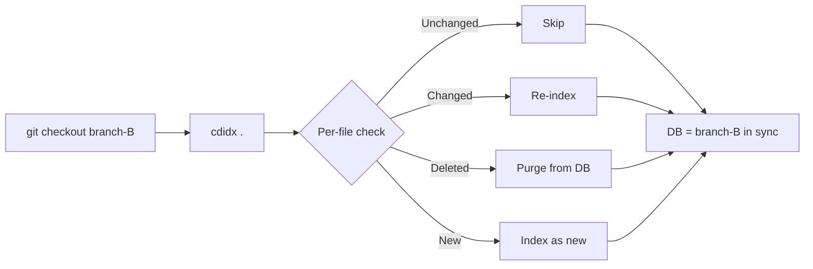
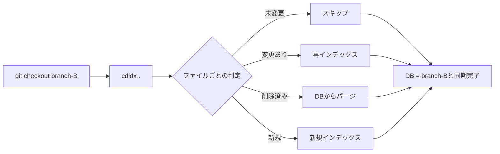

# Developer Guide

> **[日本語版はこちら / Japanese version](#開発者ガイド)**

## Build & Test

```bash
dotnet build
dotnet test
dotnet run --project src/CodeIndex -- <command> [options]
```

For test suite structure, shared helpers, and test-writing conventions, see [TESTING_GUIDE.md](TESTING_GUIDE.md).

## Architecture

```
src/CodeIndex/
  Program.cs                  — Thin CLI entry point and command routing
  Cli/
    CommandExitCodes.cs       — Shared process exit codes
    ConsoleUi.cs              — Spinner, progress bar, banner, easter egg, version, usage text
    DbPathResolver.cs         — Default DB path resolution for index commands
    GitHelper.cs              — Git helpers: diff-tree for --commits, worktree-aware common dir resolution
    IndexCommandRunner.cs     — Index command execution and update/full-scan flows
    QueryCommandRunner.cs     — Search/definition/references/callers/callees/symbols/files/excerpt/map/inspect/status execution and query arg parsing
    SearchSnippetFormatter.cs — Match-centered search snippet formatting for human/JSON output
  Database/
    DbContext.cs              — SQLite connection, WAL mode, schema init
    DbWriter.cs               — UPSERT, batch insert, stale file purge, FTS cleanup, reference writes
    DbReader.cs               — FTS search, definition/reference/caller/callee lookup, symbol lookup, excerpt reconstruction, inspect bundles, file listing, status
  Indexer/
    FileIndexer.cs            — Directory scan, language detection, FileRecord building
    ChunkSplitter.cs          — 80-line chunks with 10-line overlap
    SymbolExtractor.cs        — Regex-based symbol extraction (13 languages)
    ReferenceExtractor.cs     — Regex-based call/reference extraction for supported languages
  Mcp/
    McpServer.cs              — MCP server (stdin/stdout JSON-RPC 2.0 for AI coding tools)
  Models/
    FileRecord.cs             — File metadata DTO
    ChunkRecord.cs            — Chunk DTO
    SymbolRecord.cs           — Symbol DTO
    ReferenceRecord.cs        — Reference DTO
tests/CodeIndex.Tests/
  ChunkSplitterTests.cs       — ChunkSplitter tests
  ReferenceExtractorTests.cs  — ReferenceExtractor tests
  SymbolExtractorTests.cs     — SymbolExtractor tests
  FileIndexerTests.cs         — FileIndexer tests
  DatabaseTests.cs            — DbContext/DbWriter integration tests
  DbReaderTests.cs            — DbReader query tests
  McpServerTests.cs           — MCP server tests
  GitHelperTests.cs           — Git helper tests
```

### Indexing pipeline

```
Directory scan → Language detection → File read (UTF-8)
  → UPSERT file record
  → Split into chunks (80 lines, 10-line overlap)
  → Extract symbols via regex
  → Extract lightweight references via regex
  → Batch insert chunks + symbols + references (500 per transaction)
  → Populate FTS5 index
```

## Database schema

### Tables

```sql
-- File metadata
files (
    id          INTEGER PRIMARY KEY AUTOINCREMENT,
    path        TEXT NOT NULL UNIQUE,       -- relative path from project root
    lang        TEXT,                        -- detected language (e.g. "python")
    size        INTEGER,                    -- file size in bytes
    lines       INTEGER,                    -- line count
    checksum    TEXT,                        -- SHA256 of raw file bytes
    modified    DATETIME,                   -- file modification time (UTC)
    indexed_at  DATETIME DEFAULT CURRENT_TIMESTAMP
)

-- Content chunks for full-text search
chunks (
    id          INTEGER PRIMARY KEY AUTOINCREMENT,
    file_id     INTEGER NOT NULL REFERENCES files(id) ON DELETE CASCADE,
    chunk_index INTEGER NOT NULL,           -- 0-based chunk position
    start_line  INTEGER,                    -- 1-based start line
    end_line    INTEGER,                    -- 1-based end line (inclusive)
    content     TEXT,
    UNIQUE(file_id, chunk_index)
)

-- Extracted symbols (functions, classes, imports, namespaces)
symbols (
    id              INTEGER PRIMARY KEY AUTOINCREMENT,
    file_id         INTEGER NOT NULL REFERENCES files(id) ON DELETE CASCADE,
    kind            TEXT,                    -- "function", "class", "import", "namespace", ...
    name            TEXT,
    line            INTEGER,                 -- 1-based anchor line
    start_line      INTEGER,                 -- definition start line
    end_line        INTEGER,                 -- definition end line
    body_start_line INTEGER,                 -- body start line when known
    body_end_line   INTEGER,                 -- body end line when known
    signature       TEXT,                    -- trimmed declaration/signature line
    container_kind  TEXT,
    container_name  TEXT,
    visibility      TEXT,
    return_type     TEXT
)

-- Indexed references such as call sites
symbol_references (
    id              INTEGER PRIMARY KEY AUTOINCREMENT,
    file_id         INTEGER NOT NULL REFERENCES files(id) ON DELETE CASCADE,
    symbol_name     TEXT,                    -- referenced symbol name
    reference_kind  TEXT,                    -- "call", "instantiate", ...
    line            INTEGER,                 -- 1-based line number
    column_number   INTEGER,                 -- 1-based column number
    context         TEXT,                    -- trimmed source line
    container_kind  TEXT,
    container_name  TEXT
)

-- FTS5 virtual table mirroring chunks.content
fts_chunks USING fts5(content, content='chunks', content_rowid='id')
```

### Indexes

```sql
idx_files_lang      ON files(lang)
idx_files_modified  ON files(modified)
-- idx_files_path is not needed: the UNIQUE constraint on path creates an implicit index
idx_chunks_file     ON chunks(file_id)
idx_symbols_name    ON symbols(name)
idx_symbols_file    ON symbols(file_id)
idx_symbol_refs_name      ON symbol_references(symbol_name)
idx_symbol_refs_file      ON symbol_references(file_id)
idx_symbol_refs_container ON symbol_references(container_name)
```

### FTS5 sync triggers

```sql
-- Keep fts_chunks in sync with chunks table automatically
fts_chunks_ai   AFTER INSERT ON chunks  -- insert into FTS
fts_chunks_ad   AFTER DELETE ON chunks  -- delete from FTS
fts_chunks_au   AFTER UPDATE ON chunks  -- delete old + insert new in FTS
```

### Entity-Relationship

```
files 1──N chunks 1──1 fts_chunks (content mirror)
files 1──N symbols
files 1──N symbol_references
```

## Why a database instead of grep?

On small projects, `grep` works fine. But as a codebase grows to tens of thousands of files, `grep` becomes a bottleneck — especially when an AI agent calls it repeatedly. cdidx solves this by **reading every file once at index time** and building a search structure so that queries never need to touch the original files again.

`grep -r "keyword" .` performs a brute-force linear scan: it opens every file, reads every line, and checks for a match. The tenth search costs the same as the first. cdidx shifts the expensive work to a one-time indexing step, and subsequent searches are cheap lookups into the pre-built database.

| Factor | `grep -r` | cdidx (SQLite FTS5) |
|---|---|---|
| **Search algorithm** | Linear scan of every file, every time | Token lookup in inverted index |
| **Repeated searches** | Same full cost each time | Near-instant after initial index |
| **Startup cost** | None | One-time indexing (incremental updates after) |
| **What is stored** | Nothing — reads files on the fly | Source text in chunks + inverted index of tokens |
| **Structured queries** | Text matching only | Filter by language, path, symbol kind, line range |
| **Symbol awareness** | None — just raw text | Knows function/class/import names and locations |
| **AI token cost** | Returns raw lines — noisy, high token usage | Returns precise chunks with file path and line numbers |

### When to use which

| Scenario | Recommended |
|---|---|
| Quick one-off search in a small project | `grep` |
| Repeated searches across a large codebase | **cdidx** |
| AI agent performing multiple code lookups | **cdidx** |
| Finding all usages of a function by name | **cdidx** (`symbols` table) |
| Searching binary files or non-code content | `grep` |

## FTS5 full-text search

[FTS5](https://www.sqlite.org/fts5.html) (Full-Text Search 5) is a SQLite extension that provides an **inverted index** for full-text search: it maps each token (word) to a list of documents containing it, enabling O(1) lookups by keyword rather than scanning every row.

FTS5 works through a **virtual table** — a table that looks and behaves like a normal SQLite table but stores its data in a specialized format optimized for text search.

### What is an inverted index?

An inverted index maps each word (token) to the list of documents (or rows) that contain it — like the index at the back of a textbook.

For example, suppose three chunks contain the following code:

| Chunk ID | Content (simplified) |
|---|---|
| 1 | `handleRequest(ctx)` |
| 2 | `sendResponse(ctx)` |
| 3 | `handleRequest(req); sendResponse(res)` |

The inverted index built by FTS5 would look like:

| Token | Chunk IDs |
|---|---|
| `handleRequest` | 1, 3 |
| `sendResponse` | 2, 3 |
| `ctx` | 1, 2 |
| `req` | 3 |
| `res` | 3 |

When you search for `handleRequest`, FTS5 reads the entry for that token and immediately returns chunk IDs `{1, 3}` — no scanning required.

### How it differs from B-tree indexes

A B-tree (balanced tree) is the default index structure in SQLite. It organizes values in a sorted, tree-shaped hierarchy — similar to how a phone book is sorted alphabetically:

```
            [go | python]
           /      |       \
    [csharp]  [java, kotlin]  [rust, typescript]
```

B-tree indexes are good for exact matches (`WHERE lang = 'csharp'`), range queries (`WHERE modified > '2025-01-01'`), and sorting. However, they cannot efficiently answer "which rows contain the word `handleRequest` somewhere in a text column?" — that requires FTS5.

| | B-tree index | FTS5 inverted index |
|---|---|---|
| **Use case** | Exact match, range, prefix on a single column | Natural language keyword search across text |
| **Lookup** | `WHERE path = 'foo.py'` | `WHERE fts_chunks MATCH 'authenticate'` |
| **Structure** | Sorted tree of column values | Token → document ID posting lists |
| **Ranking** | N/A (returns exact matches) | BM25 relevance scoring |
| **Used on** | `path`, `lang`, `modified`, `file_id`, `name` | `chunks.content` (code text) |

These two index types complement each other. A typical query might use FTS5 to find matching chunks and then use B-tree indexes to filter by language or file path.

### The `fts_chunks` virtual table

```sql
CREATE VIRTUAL TABLE IF NOT EXISTS fts_chunks USING fts5(
    content,
    content='chunks',
    content_rowid='id'
);
```

| Parameter | Meaning |
|---|---|
| `USING fts5(...)` | Use the FTS5 engine to manage this virtual table |
| `content` | The column to index — corresponds to `chunks.content` (the actual code text) |
| `content='chunks'` | **External-content table** — `fts_chunks` does not store a copy of the text. It references `chunks`. |
| `content_rowid='id'` | The `rowid` of each FTS5 entry matches `chunks.id` for direct row lookup |

### Content sync

`fts_chunks` is a **content-external** FTS5 table (`content='chunks'`). It does not store the original text; instead, it points to `chunks.id` via `content_rowid`. This avoids doubling storage. cdidx keeps the FTS index in sync via database triggers (`fts_chunks_ai`, `fts_chunks_ad`, `fts_chunks_au`) that fire on insert, delete, and update of the `chunks` table.

### Query syntax

FTS5 supports advanced query syntax:

```sql
-- Single term
WHERE fts_chunks MATCH 'authenticate'

-- Phrase (exact sequence)
WHERE fts_chunks MATCH '"handle request"'

-- Boolean operators
WHERE fts_chunks MATCH 'auth AND token'
WHERE fts_chunks MATCH 'auth OR login'
WHERE fts_chunks MATCH 'auth NOT oauth'

-- Prefix search
WHERE fts_chunks MATCH 'auth*'

-- Column filter (only one column here, but useful in multi-column FTS)
WHERE fts_chunks MATCH 'content:authenticate'
```

### How the search works

When you run:
```sql
SELECT f.path, c.start_line, c.content
FROM fts_chunks fc
JOIN chunks c ON c.id = fc.rowid
JOIN files f ON f.id = c.file_id
WHERE fts_chunks MATCH 'handleRequest'
LIMIT 20;
```

1. FTS5 looks up `handleRequest` in its inverted index → gets a list of matching chunk `rowid`s directly
2. Joins back to `chunks` to get the 80-line code block with start/end line numbers
3. Joins to `files` to get the file path and language

No files are opened. No directories are scanned. The entire search runs inside SQLite.

## Chunking strategy

Files are split into **80-line chunks with 10-line overlap**. The overlap ensures that a symbol definition or code block spanning a chunk boundary will appear in full in at least one chunk.

```
Lines   1-80   → Chunk 0
Lines  71-150  → Chunk 1  (10-line overlap with chunk 0)
Lines 141-220  → Chunk 2  (10-line overlap with chunk 1)
...
```

The step size is `80 - 10 = 70` lines. A file with N lines produces `ceil((N - 80) / 70) + 1` chunks (minimum 1).

## Symbol extraction

Symbols are extracted with **compiled regex patterns**, matching one line at a time. Each language has patterns for functions, classes, and sometimes imports. Named capture group `(?<name>\w+)` extracts the identifier.

Supported symbol kinds by language:

| Language | function | class | import |
|---|:---:|:---:|:---:|
| Python | def, async def | class | -- |
| JavaScript | function, const/let/var arrow | class | import...from |
| TypeScript | function, arrow | class, interface, type, enum | import...from |
| C# | methods, constructors | class, interface, enum, record, struct | -- |
| Go | func, methods | type struct/interface | -- |
| Rust | fn | struct, enum, trait, impl | -- |
| Java | methods | class, interface, enum | -- |
| Kotlin | fun | class, interface, enum class, object | -- |
| Ruby | def | class, module | -- |
| C | functions | struct, enum | -- |
| C++ | functions | class, struct, namespace, enum | -- |
| PHP | function | class, interface, trait, enum | -- |
| Swift | func | class, struct, enum, protocol | -- |

Regex-based extraction is intentionally simple. Speed and portability are prioritized over AST-level accuracy.

## Incremental indexing

By default, cdidx compares each file's `modified` timestamp (UTC) against the stored value in the database. If unchanged, the file is skipped entirely.

When a file is re-indexed:
1. Old chunks and symbols for that file are deleted (FTS entries are cleaned up automatically by triggers)
2. The file record is upserted (`INSERT ... ON CONFLICT DO UPDATE`, preserving the row ID)
3. New chunks and symbols are inserted (FTS entries are populated automatically by triggers)

### Stale file purge

Before indexing begins, cdidx queries all file paths from the database and checks each against the filesystem. Files that no longer exist on disk (e.g., after a branch switch or deletion) are removed along with their chunks and symbols.

| Situation | What happens |
|---|---|
| File unchanged across branches | Skipped (instant) |
| File content changed | Re-indexed |
| File deleted after checkout | Purged from DB |
| File added after checkout | Indexed as new |



### Partial update mode

Use `--commits` or `--files` to update only specific files instead of scanning the entire project:

```bash
cdidx ./myproject --commits abc123 def456   # files changed in these commits
cdidx ./myproject --files src/app.cs        # specific files only
```

`--commits` uses `git diff-tree --no-commit-id -r --name-only` to resolve changed file paths.

## AI integration

For the CLAUDE.md template (ready-to-copy code search rules for AI agents), see the [AI Integration](README.md#ai-integration) section in README.

### Output format

Query commands (`search`, `definition`, `references`, `callers`, `callees`, `symbols`, `files`, `excerpt`, `map`, `inspect`) default to **human-readable output**. Use `--json` for JSON lines output (one JSON object per line), designed for easy parsing by AI agents.

MCP tool calls return structured JSON in `structuredContent` plus a short summary in `content`, so clients can consume typed data directly.

`search`, `definition`, `references`, `callers`, `callees`, `symbols`, and `files` also share path-aware narrowing via `--path`, repeatable `--exclude-path`, and `--exclude-tests`. The read layer ranks source files ahead of tests and docs, and `search` further boosts exact symbol-name and path matches so AI clients are more likely to land on implementation files first.

`search --json` and MCP `search` project full chunks into compact match-centered snippets with `chunk_start_line`, `chunk_end_line`, `snippet_start_line`, `snippet_end_line`, `snippet`, `match_lines`, `highlights`, `context_before`, and `context_after`. `--snippet-lines` caps the snippet length up front (default: 8, max: 20).

`inspect` and MCP `analyze_symbol` bundle the primary definition, nearby symbols from the same file, references, callers, callees, file metadata, workspace freshness/git metadata, and graph-support metadata into one response. This is intended for symbol-oriented AI workflows that would otherwise need several back-to-back calls. Call graph sections remain language-aware: for unsupported languages, clients can now distinguish "unsupported" from "no hits" via `graphSupported` / `graphSupportReason`, and should prefer `search` instead of assuming graph data will exist.

The direct MCP graph tools (`references`, `callers`, `callees`) also emit `graphLanguage`, `graphSupported`, and `graphSupportReason` when a language filter is supplied, so unsupported-language queries do not look identical to zero-hit supported-language queries.

```json
{"path":"src/auth.py","lang":"python","chunk_start_line":1,"chunk_end_line":80,"snippet_start_line":1,"snippet_end_line":6,"snippet":"def authenticate(user):\n    token = issue_token(user)\n    return token","match_lines":[2],"highlights":[{"line":2,"text":"    token = issue_token(user)","terms":["token"]}],"context_before":1,"context_after":3,"score":-1.5}
```

## Exit codes

See [Exit codes](README.md#exit-codes) in README.

## Design decisions

- **No ORM** — Raw `Microsoft.Data.Sqlite` with parameterized queries. Keeps dependencies minimal and control explicit.
- **Batch commits** — 500 records per transaction for write performance. Reduces fsync overhead.
- **WAL mode + busy_timeout** — Write-Ahead Logging for concurrent read/write access and crash safety. 5-second busy timeout avoids immediate SQLITE_BUSY errors.
- **Content-external FTS5 with triggers** — Avoids doubling storage by pointing to `chunks` table instead of storing a copy. Database triggers keep the FTS index in sync automatically.
- **Literal-safe search by default** — Search uses token-by-token quoting by default to avoid FTS syntax errors. Raw FTS5 syntax is opt-in via `--fts` or MCP `rawQuery`.
- **Path-aware narrowing and ranking** — `search`, `definition`, `references`, `callers`, `callees`, `symbols`, and `files` share path include/exclude filters plus `--exclude-tests`. Read queries prefer source files over tests/docs, and full-text search boosts exact symbol-name and path matches to surface likely implementation files first.
- **Compact search snippets for AI** — `search --json` and MCP `search` return match-centered snippets with explicit snippet ranges, match lines, highlights, and context counts instead of whole chunks. `--snippet-lines` lets clients trade recall for smaller payloads.
- **Repo map for first-pass orientation** — `map` aggregates languages, modules, top files, file hot spots, and likely entrypoints from indexed data so AI clients can decide where to look before issuing precise queries. Entrypoint inference now falls back to known top-level entry files when symbol extraction does not produce an explicit `Main`-style symbol.
- **Freshness metadata for trust decisions** — `status` exposes whole-workspace freshness and git state. `map` keeps `indexed_at` / `latest_modified` scoped to the filtered result set and also exposes `workspace_indexed_at` / `workspace_latest_modified` for whole-workspace freshness. `inspect` mirrors those whole-workspace timestamps and git fields so symbol-oriented AI flows can make trust decisions without a separate `status` call. `files` exposes per-file checksum plus modified/indexed timestamps. File-column migrations are applied opportunistically for older DBs, and read paths are designed to avoid crashing if in-place migration is unavailable. MCP zero-result responses include `indexed_file_count` and `indexed_at` so AI clients can self-diagnose stale or empty indexes without a separate `status` call.
- **Bundled symbol analysis** — `inspect` and MCP `analyze_symbol` return definition, nearby symbols, references, callers, callees, file metadata, workspace trust metadata, and graph-support metadata in one request so AI clients can answer common symbol questions with fewer round-trips.
- **Language-aware reference extraction** — `references`, `callers`, and `callees` are backed by an indexed reference table built only for languages where regex-based call/reference extraction is meaningful. Unsupported languages intentionally fall back to text search instead of returning low-confidence pseudo-graph data.
- **Regex symbol extraction** — No AST parsers, no language-specific dependencies. Trades accuracy for speed and portability, but stores richer symbol metadata such as definition ranges, optional body ranges, signatures, enclosing symbols, visibility, and return types when the language patterns can infer them.
- **Human-readable default** — All commands default to human-readable output. `--json` for AI/machine consumption.
- **Structured MCP responses** — MCP tool calls return typed JSON in `structuredContent` and keep `content` concise for compatibility.
- **MCP tool annotations** — All tools emit `annotations` with `readOnlyHint`, `destructiveHint`, `idempotentHint`, and `openWorldHint` per the MCP spec, so AI clients can auto-approve safe read-only queries.
- **MCP server instructions** — The `initialize` response includes an `instructions` string with tool-selection guidance so AI clients can choose the right tool on first connection.
- **Backward-compatible symbol schema** — Opening an older DB with a newer binary auto-adds missing symbol columns when possible. If a read path cannot migrate the DB in place, symbol queries fall back to the legacy column set instead of crashing.
- **Manual arg parsing** — `System.CommandLine` was removed to reduce dependencies. Simple switch-based parsing.
- **SHA256 checksums** — Computed from raw file bytes and stored per file. Used as a fallback for change detection when timestamps differ (e.g. after `git checkout`).
- **UTF-8 with fallback** — Invalid UTF-8 bytes are replaced with U+FFFD rather than failing the entire file.
- **Worktree-aware git exclude** — `.cdidx/` is auto-added to `.git/info/exclude`. In a worktree, `.git` is a file (not a directory), so the worktree root has no `.git/info/exclude`. `GitHelper.ResolveGitCommonDir()` chases references to find the shared `.git/`:

  ```
  # Normal repo — .git is a directory
  /projects/my-app/                   ← project root
  ├── 📂 .git/                        ← directory
  │   └── 📂 info/
  │       └── exclude                 ← write here
  └── 📂 .cdidx/
      └── codeindex.db

  # Worktree — .git is a file
  /projects/my-app/                   ← main repo
  └── 📂 .git/                        ← shared git dir
      ├── 📂 info/
      │   └── exclude                 ← write here
      └── 📂 worktrees/
          └── 📂 feature-branch/
              └── commondir           ← contains "../.."

  /projects/my-app-feature/           ← worktree root
  ├── .git                            ← FILE: "gitdir: /projects/my-app/.git/worktrees/feature-branch"
  └── 📂 .cdidx/
      └── codeindex.db
  ```

  Resolution: read `.git` file → parse `gitdir:` → read `commondir` file at that path → resolve `../..` relative to `feature-branch/` dir (`feature-branch/` → `..` → `worktrees/` → `..` → `.git/`) → write `info/exclude`.

## Coding conventions

- Comments are bilingual (English / Japanese), e.g. `// Enable WAL mode / WALモードを有効化`
- Documentation (README, CHANGELOG) is structured: English first, then Japanese.
- No unnecessary packages.

---

<a id="開発者ガイド"></a>
# 開発者ガイド

## ビルド・テスト

```bash
dotnet build
dotnet test
dotnet run --project src/CodeIndex -- <command> [options]
```

テストスイートの構成、共有ヘルパー、テスト作法については [TESTING_GUIDE.md](TESTING_GUIDE.md) を参照してください。

## アーキテクチャ

```
src/CodeIndex/
  Program.cs                  — 薄いCLIエントリポイントとコマンドルーティング
  Cli/
    CommandExitCodes.cs       — 共通のプロセス終了コード
    ConsoleUi.cs              — スピナー、プログレスバー、バナー、イースターエッグ、バージョン、使い方
    DbPathResolver.cs         — indexコマンド用の既定DBパス解決
    GitHelper.cs              — --commitsオプション用のgit diff-treeヘルパー
    IndexCommandRunner.cs     — indexコマンド実行と更新/フルスキャンフロー
    QueryCommandRunner.cs     — search/definition/references/callers/callees/symbols/files/excerpt/map/inspect/status実行とクエリ引数解析
    SearchSnippetFormatter.cs — 人間向け/JSON向けの一致中心検索スニペット整形
  Database/
    DbContext.cs              — SQLite接続、WALモード、スキーマ初期化
    DbWriter.cs               — UPSERT、バッチ挿入、古いファイルのパージ、FTSクリーンアップ、参照書き込み
    DbReader.cs               — FTS検索、定義/参照/caller/callee検索、シンボル検索、抜粋再構成、inspect向け集約、ファイル一覧、ステータス
  Indexer/
    FileIndexer.cs            — ディレクトリ走査、言語検出、FileRecord構築
    ChunkSplitter.cs          — 80行チャンク（10行重複）
    SymbolExtractor.cs        — 正規表現によるシンボル抽出（13言語対応）
    ReferenceExtractor.cs     — 対応言語向けの正規表現ベース参照抽出
  Mcp/
    McpServer.cs              — MCPサーバー（AIツール向けstdin/stdout JSON-RPC 2.0）
  Models/
    FileRecord.cs             — ファイルメタデータDTO
    ChunkRecord.cs            — チャンクDTO
    SymbolRecord.cs           — シンボルDTO
    ReferenceRecord.cs        — 参照DTO
tests/CodeIndex.Tests/
  ChunkSplitterTests.cs       — ChunkSplitterテスト
  ReferenceExtractorTests.cs  — ReferenceExtractorテスト
  SymbolExtractorTests.cs     — SymbolExtractorテスト
  FileIndexerTests.cs         — FileIndexerテスト
  DatabaseTests.cs            — DbContext/DbWriter統合テスト
  DbReaderTests.cs            — DbReaderクエリテスト
  McpServerTests.cs           — MCPサーバーテスト
  GitHelperTests.cs           — Gitヘルパーテスト
```

### インデックスパイプライン

```
ディレクトリ走査 → 言語検出 → ファイル読み込み（UTF-8）
  → ファイルレコードUPSERT
  → チャンク分割（80行、10行重複）
  → 正規表現でシンボル抽出
  → 正規表現で軽量参照を抽出
  → チャンク＋シンボル＋参照をバッチ挿入（1トランザクション500件）
  → FTS5インデックス反映
```

## データベーススキーマ

### テーブル

```sql
-- ファイルメタデータ
files (
    id          INTEGER PRIMARY KEY AUTOINCREMENT,
    path        TEXT NOT NULL UNIQUE,       -- プロジェクトルートからの相対パス
    lang        TEXT,                        -- 検出された言語（例: "python"）
    size        INTEGER,                    -- ファイルサイズ（バイト）
    lines       INTEGER,                    -- 行数
    checksum    TEXT,                        -- ファイルraw bytesのSHA256
    modified    DATETIME,                   -- ファイル更新日時（UTC）
    indexed_at  DATETIME DEFAULT CURRENT_TIMESTAMP
)

-- 全文検索用コンテンツチャンク
chunks (
    id          INTEGER PRIMARY KEY AUTOINCREMENT,
    file_id     INTEGER NOT NULL REFERENCES files(id) ON DELETE CASCADE,
    chunk_index INTEGER NOT NULL,           -- 0始まりのチャンク位置
    start_line  INTEGER,                    -- 1始まりの開始行
    end_line    INTEGER,                    -- 1始まりの終了行（含む）
    content     TEXT,
    UNIQUE(file_id, chunk_index)
)

-- 抽出されたシンボル（関数、クラス、インポート、名前空間など）
symbols (
    id              INTEGER PRIMARY KEY AUTOINCREMENT,
    file_id         INTEGER NOT NULL REFERENCES files(id) ON DELETE CASCADE,
    kind            TEXT,                    -- "function"、"class"、"import"、"namespace" など
    name            TEXT,
    line            INTEGER,                 -- 1始まりのアンカー行
    start_line      INTEGER,                 -- 定義開始行
    end_line        INTEGER,                 -- 定義終了行
    body_start_line INTEGER,                 -- 分かる場合の本体開始行
    body_end_line   INTEGER,                 -- 分かる場合の本体終了行
    signature       TEXT,                    -- trim済みの宣言/シグネチャ行
    container_kind  TEXT,
    container_name  TEXT,
    visibility      TEXT,
    return_type     TEXT
)

-- 呼び出し箇所などのインデックス済み参照
symbol_references (
    id              INTEGER PRIMARY KEY AUTOINCREMENT,
    file_id         INTEGER NOT NULL REFERENCES files(id) ON DELETE CASCADE,
    symbol_name     TEXT,                    -- 参照先シンボル名
    reference_kind  TEXT,                    -- "call", "instantiate" など
    line            INTEGER,                 -- 1始まりの行番号
    column_number   INTEGER,                 -- 1始まりの列番号
    context         TEXT,                    -- trim済みソース行
    container_kind  TEXT,
    container_name  TEXT
)

-- chunks.contentをミラーするFTS5仮想テーブル
fts_chunks USING fts5(content, content='chunks', content_rowid='id')
```

### インデックス

```sql
idx_files_lang      ON files(lang)
idx_files_modified  ON files(modified)
-- idx_files_path は不要: path の UNIQUE 制約が暗黙的にインデックスを作成済み
idx_chunks_file     ON chunks(file_id)
idx_symbols_name    ON symbols(name)
idx_symbols_file    ON symbols(file_id)
idx_symbol_refs_name      ON symbol_references(symbol_name)
idx_symbol_refs_file      ON symbol_references(file_id)
idx_symbol_refs_container ON symbol_references(container_name)
```

### FTS5同期トリガー

```sql
-- chunksテーブルとfts_chunksを自動的に同期するトリガー
fts_chunks_ai   AFTER INSERT ON chunks  -- FTSに挿入
fts_chunks_ad   AFTER DELETE ON chunks  -- FTSから削除
fts_chunks_au   AFTER UPDATE ON chunks  -- 旧エントリ削除＋新エントリ挿入
```

### エンティティ関連図

```
files 1──N chunks 1──1 fts_chunks（コンテンツミラー）
files 1──N symbols
files 1──N symbol_references
```

## なぜgrepではなくデータベースなのか？

小規模プロジェクトなら `grep` で十分です。しかしファイルが数万規模になると `grep` はボトルネックになります。特にAIエージェントが繰り返し検索を実行するケースで顕著です。cdidxは**すべてのファイルを一度だけ読み込んで検索用の構造を構築する**ことで、以降の検索で元のファイルを一切開かずに済むようにします。

`grep -r "keyword" .` は力任せの線形スキャンです。毎回すべてのファイルを開き、すべての行を読み、マッチを確認します。10回目の検索でも1回目と同じコストです。cdidxは重い処理を一度きりのインデックス作成ステップに集約し、以降の検索は事前構築されたデータベースへの軽い参照で済みます。

| 比較項目 | `grep -r` | cdidx（SQLite FTS5） |
|---|---|---|
| **検索アルゴリズム** | 毎回全ファイルを線形スキャン | 転置インデックスでのトークン参照 |
| **繰り返し検索** | 毎回同じフルコスト | 初回インデックス後はほぼ即時 |
| **初期コスト** | なし | 一度きりのインデックス作成（以降はインクリメンタル更新） |
| **保存内容** | なし — 毎回ファイルを読み込み | チャンク化されたソーステキスト＋トークンの転置インデックス |
| **構造化クエリ** | テキストマッチのみ | 言語、パス、シンボル種別、行範囲でフィルタ可能 |
| **シンボル認識** | なし — 生テキストのみ | 関数・クラス・インポート名と位置を認識 |
| **AIトークンコスト** | 生の行を返す — ノイズが多くトークン消費大 | ファイルパスと行番号付きの正確なチャンクを返す |

### 使い分け

| シナリオ | 推奨 |
|---|---|
| 小規模プロジェクトでの一回きりの検索 | `grep` |
| 大規模コードベースでの繰り返し検索 | **cdidx** |
| AIエージェントによる複数回のコード検索 | **cdidx** |
| 関数名で全使用箇所を検索 | **cdidx**（`symbols`テーブル） |
| バイナリファイルや非コードコンテンツの検索 | `grep` |

## FTS5 全文検索

[FTS5](https://www.sqlite.org/fts5.html)（Full-Text Search 5）はSQLiteの拡張で、全文検索用の**転置インデックス**を提供します。各トークン（単語）からそれを含むドキュメントのリストへのマッピングを構築し、全行スキャンではなくO(1)のキーワード検索を実現します。

FTS5は**仮想テーブル**で動作します。通常のSQLiteテーブルと同じように見え、`SELECT`やJOINが可能ですが、テキスト検索に最適化された特殊な形式でデータを格納します。

### 転置インデックスとは？

転置インデックスは、各単語（トークン）からそれを含むドキュメント（行）のリストへのマッピングです。教科書の巻末索引のようなものです。

例えば、3つのチャンクに以下のコードが含まれるとします:

| チャンクID | 内容（簡略化） |
|---|---|
| 1 | `handleRequest(ctx)` |
| 2 | `sendResponse(ctx)` |
| 3 | `handleRequest(req); sendResponse(res)` |

FTS5が構築する転置インデックス:

| トークン | チャンクID |
|---|---|
| `handleRequest` | 1, 3 |
| `sendResponse` | 2, 3 |
| `ctx` | 1, 2 |
| `req` | 3 |
| `res` | 3 |

`handleRequest` で検索すると、FTS5はそのトークンのエントリを読み、チャンクID `{1, 3}` を即座に返します。スキャンは不要です。

### B-treeインデックスとの違い

B-tree（平衡木）はSQLiteのデフォルトのインデックス構造です。値をソート済みのツリー型階層に整理します:

```
            [go | python]
           /      |       \
    [csharp]  [java, kotlin]  [rust, typescript]
```

B-treeインデックスは完全一致（`WHERE lang = 'csharp'`）、範囲クエリ（`WHERE modified > '2025-01-01'`）、ソートに適しています。しかし「テキストカラムのどこかに `handleRequest` という単語を含む行はどれか？」には効率的に答えられません。FTS5が必要です。

| | B-treeインデックス | FTS5転置インデックス |
|---|---|---|
| **用途** | 単一カラムの完全一致・範囲・前方一致 | テキスト全体に対する自然言語キーワード検索 |
| **検索例** | `WHERE path = 'foo.py'` | `WHERE fts_chunks MATCH 'authenticate'` |
| **構造** | カラム値のソート済みツリー | トークン → ドキュメントIDのポスティングリスト |
| **ランキング** | なし（完全一致を返す） | BM25関連度スコアリング |
| **使用対象** | `path`, `lang`, `modified`, `file_id`, `name` | `chunks.content`（コードテキスト） |

この2種類のインデックスは相互補完的です。典型的なクエリではFTS5でマッチするチャンクを見つけ、B-treeインデックスで言語やファイルパスでフィルタします。

### `fts_chunks` 仮想テーブル

```sql
CREATE VIRTUAL TABLE IF NOT EXISTS fts_chunks USING fts5(
    content,
    content='chunks',
    content_rowid='id'
);
```

| パラメータ | 意味 |
|---|---|
| `USING fts5(...)` | FTS5エンジンでこの仮想テーブルを管理 |
| `content` | インデックス対象のカラム — `chunks.content`（コード本文）に対応 |
| `content='chunks'` | **外部コンテンツテーブル** — `fts_chunks`はテキストのコピーを保存せず`chunks`を参照 |
| `content_rowid='id'` | 各FTS5エントリの`rowid`が`chunks.id`に一致し、直接行参照が可能 |

### コンテンツ同期

`fts_chunks`は**コンテンツ外部参照型**のFTS5テーブル（`content='chunks'`）です。元のテキストを保存せず、`content_rowid`で`chunks.id`を参照します。これによりストレージの倍増を回避しています。cdidxはデータベーストリガー（`fts_chunks_ai`、`fts_chunks_ad`、`fts_chunks_au`）でFTSインデックスを自動的に同期します。

### クエリ構文

FTS5は高度なクエリ構文をサポートしています:

```sql
-- 単一語句
WHERE fts_chunks MATCH 'authenticate'

-- フレーズ（完全一致の語順）
WHERE fts_chunks MATCH '"handle request"'

-- ブール演算子
WHERE fts_chunks MATCH 'auth AND token'
WHERE fts_chunks MATCH 'auth OR login'
WHERE fts_chunks MATCH 'auth NOT oauth'

-- 前方一致検索
WHERE fts_chunks MATCH 'auth*'

-- カラムフィルタ（ここでは1カラムだが、複数カラムFTSで有用）
WHERE fts_chunks MATCH 'content:authenticate'
```

### 検索の仕組み

以下のクエリを実行すると:
```sql
SELECT f.path, c.start_line, c.content
FROM fts_chunks fc
JOIN chunks c ON c.id = fc.rowid
JOIN files f ON f.id = c.file_id
WHERE fts_chunks MATCH 'handleRequest'
LIMIT 20;
```

1. FTS5が転置インデックスで `handleRequest` を参照 → マッチするチャンクの`rowid`リストを直接取得
2. `chunks`テーブルにJOINして80行のコードブロックと行番号を取得
3. `files`テーブルにJOINしてファイルパスと言語を取得

ファイルを開くことも、ディレクトリを走査することもありません。検索全体がSQLite内部で完結します。

## チャンク分割戦略

ファイルは**80行のチャンクに10行の重複**で分割されます。重複により、チャンク境界をまたぐシンボル定義やコードブロックが少なくとも1つのチャンクに完全に含まれます。

```
1-80行    → チャンク0
71-150行  → チャンク1（チャンク0と10行重複）
141-220行 → チャンク2（チャンク1と10行重複）
...
```

ステップサイズは `80 - 10 = 70` 行です。N行のファイルは `ceil((N - 80) / 70) + 1` 個のチャンクを生成します（最小1個）。

## シンボル抽出

シンボルは**コンパイル済み正規表現パターン**で1行ずつマッチングして抽出されます。各言語に関数、クラス、場合によってはインポート用のパターンがあります。名前付きキャプチャグループ `(?<name>\w+)` で識別子を取得します。

言語別対応シンボル種別:

| 言語 | function | class | import |
|---|:---:|:---:|:---:|
| Python | def, async def | class | -- |
| JavaScript | function, const/let/var アロー | class | import...from |
| TypeScript | function, アロー | class, interface, type, enum | import...from |
| C# | メソッド, コンストラクタ | class, interface, enum, record, struct | -- |
| Go | func, メソッド | type struct/interface | -- |
| Rust | fn | struct, enum, trait, impl | -- |
| Java | メソッド | class, interface, enum | -- |
| Kotlin | fun | class, interface, enum class, object | -- |
| Ruby | def | class, module | -- |
| C | 関数 | struct, enum | -- |
| C++ | 関数 | class, struct, namespace, enum | -- |
| PHP | function | class, interface, trait, enum | -- |
| Swift | func | class, struct, enum, protocol | -- |

正規表現ベースの抽出は意図的にシンプルです。AST精度よりも速度とポータビリティを優先しています。

## インクリメンタルインデックス

デフォルトでは、cdidxは各ファイルの`modified`タイムスタンプ（UTC）をデータベースの値と比較します。変更がなければファイルは完全にスキップされます。

ファイルが再インデックスされる場合:
1. そのファイルの古いチャンクとシンボルを削除（FTSエントリはトリガーで自動クリーンアップ）
2. ファイルレコードをUPSERT（`INSERT ... ON CONFLICT DO UPDATE`、行IDを保持）
3. 新しいチャンクとシンボルを挿入（FTSエントリはトリガーで自動反映）

### 古いファイルのパージ

インデックス開始前に、cdidxはデータベースの全ファイルパスをクエリし、ファイルシステムと照合します。ディスク上に存在しなくなったファイル（ブランチ切り替えや削除後など）はチャンクやシンボルとともに削除されます。

| 状況 | 動作 |
|---|---|
| ブランチ間でファイル未変更 | スキップ（即時） |
| ファイル内容が変更 | 再インデックス |
| checkout後にファイル削除 | DBからパージ |
| checkout後にファイル追加 | 新規インデックス |



### 部分更新モード

`--commits` や `--files` で、プロジェクト全体をスキャンせずに特定ファイルのみ更新できます:

```bash
cdidx ./myproject --commits abc123 def456   # これらのコミットの変更ファイル
cdidx ./myproject --files src/app.cs        # 特定ファイルのみ
```

`--commits` は `git diff-tree --no-commit-id -r --name-only` で変更ファイルパスを解決します。

## AI連携

CLAUDE.mdテンプレート（AI向けコード検索ルールのコピペ用）については、READMEの[AIとの連携](README.md#aiとの連携)セクションを参照してください。

### 出力形式

クエリコマンド（`search`、`definition`、`references`、`callers`、`callees`、`symbols`、`files`、`excerpt`、`map`、`inspect`）はデフォルトで**人間向け出力**です。`--json`でJSONライン出力（1行1 JSONオブジェクト）に切り替えでき、AIエージェントが容易にパースできるよう設計されています。

MCPツール呼び出しは `structuredContent` に構造化JSON、`content` に短い要約を返すため、クライアントは型付きデータを直接利用できます。

`search`、`definition`、`references`、`callers`、`callees`、`symbols`、`files` は `--path`、繰り返し指定できる `--exclude-path`、`--exclude-tests` による絞り込みを共有します。読み取り層は tests や docs より source を優先し、`search` はシンボル名やパスがクエリと正確に一致する候補をさらに上位に出して、AIクライアントが実装ファイルへ早く到達できるようにします。

`search --json` と MCP の `search` は、フルチャンクを `chunk_start_line`、`chunk_end_line`、`snippet_start_line`、`snippet_end_line`、`snippet`、`match_lines`、`highlights`、`context_before`、`context_after` を持つ軽量スニペットへ投影します。`--snippet-lines` で抜粋長を先に制限できます（デフォルト: 8、最大: 20）。

`inspect` と MCP の `analyze_symbol` は、主定義、同一ファイル内の近傍シンボル、参照、caller、callee、ファイルメタデータ、さらにワークスペース鮮度/git メタデータと graph 対応メタデータを1レスポンスにまとめます。複数の連続クエリを避けたい AI ワークフロー向けです。call graph 系の節は言語差分を考慮しており、未対応言語では `graphSupported` / `graphSupportReason` によって「未対応」と「ヒットなし」を区別できます。その場合は `search` を優先して使う前提です。

直接の MCP graph ツール（`references`、`callers`、`callees`）も、言語フィルタが指定されている場合は `graphLanguage`、`graphSupported`、`graphSupportReason` を返し、未対応言語クエリが対応言語の 0 件ヒットと同じ見た目にならないようにします。

```json
{"path":"src/auth.py","lang":"python","chunk_start_line":1,"chunk_end_line":80,"snippet_start_line":1,"snippet_end_line":6,"snippet":"def authenticate(user):\n    token = issue_token(user)\n    return token","match_lines":[2],"highlights":[{"line":2,"text":"    token = issue_token(user)","terms":["token"]}],"context_before":1,"context_after":3,"score":-1.5}
```

## 終了コード

READMEの[終了コード](README.md#終了コード)セクションを参照してください。

## 設計判断

- **ORMなし** — `Microsoft.Data.Sqlite`でパラメータ化クエリを直接使用。依存関係を最小限に、制御を明確に。
- **バッチコミット** — 書き込み性能のため1トランザクション500レコード。fsyncオーバーヘッドを削減。
- **WALモード + busy_timeout** — Write-Ahead Loggingで読み書き同時アクセスとクラッシュ安全性を確保。5秒のbusy_timeoutで即座のSQLITE_BUSYエラーを回避。
- **デフォルトはリテラル安全検索** — 検索は既定でトークンごとに引用してFTS構文エラーを避ける。生のFTS5構文は `--fts` またはMCPの `rawQuery` で明示 opt-in。
- **パス考慮の絞り込みとランキング** — `search`、`definition`、`references`、`callers`、`callees`、`symbols`、`files` はパス include/exclude フィルタと `--exclude-tests` を共有する。読み取りクエリは tests や docs より source を優先し、全文検索はシンボル名やパスの exact match を追加ブーストして、実装ファイルを先に返しやすくする。
- **AI向けの軽量検索スニペット** — `search --json` と MCP の `search` は、チャンク全文ではなく snippet range、match line、highlight、context count を持つ一致中心スニペットを返す。`--snippet-lines` でペイロード量と文脈量のバランスを取れる。
- **初動向けの repo map** — `map` は、インデックス済みデータから言語、モジュール、主要ファイル、ホットスポット、推定エントリポイントを集約し、AIクライアントが精密検索前に見るべき場所を決めやすくする。シンボル抽出が `Main` 系シンボルを出さない場合でも、既知のトップレベル実行ファイルへフォールバックして入口候補を補う。
- **信用判断のための鮮度メタデータ** — `status` はワークスペース全体の鮮度と git 状態を返す。`map` は `indexed_at` / `latest_modified` を絞り込み結果の鮮度として維持しつつ、`workspace_indexed_at` / `workspace_latest_modified` でワークスペース全体の鮮度も返す。`inspect` も同じワークスペース鮮度と git フィールドを返すため、シンボル中心の AI フローで `status` を別途呼ばずに済む。`files` はファイルごとの checksum・modified・indexed timestamp を返す。古いDBに対する file 列の移行は可能なら自動で行い、その場移行できない場合でも読み取り経路がクラッシュしないようにする。MCP の 0 件レスポンスは `indexed_file_count` と `indexed_at` を含み、AIクライアントが別途 `status` を呼ばなくてもインデックスの古さや空を自己診断できる。
- **まとめて取るシンボル分析** — `inspect` と MCP の `analyze_symbol` は、定義、近傍シンボル、参照、caller、callee、ファイルメタデータ、ワークスペース信頼メタデータ、graph 対応メタデータを1回で返し、AIクライアントが一般的なシンボル調査を少ない往復で終えやすくする。
- **言語考慮の参照抽出** — `references`、`callers`、`callees` は、正規表現ベースの call/reference 抽出が意味を持つ言語だけに対してインデックス化された参照テーブルで支える。未対応言語では、低信頼な疑似グラフ結果を返す代わりにテキスト検索へ戻る前提で設計する。
- **構造化MCPレスポンス** — MCPツール呼び出しは `structuredContent` に型付きJSONを返し、`content` は互換性のため簡潔に保つ。
- **MCPツールアノテーション** — 全ツールが MCP 仕様に沿った `annotations`（`readOnlyHint`、`destructiveHint`、`idempotentHint`、`openWorldHint`）を返し、AIクライアントが安全な読み取り専用クエリを自動承認できるようにする。
- **MCPサーバー instructions** — `initialize` レスポンスにツール選択ガイダンスの `instructions` 文字列を含め、AIクライアントが初回接続時に適切なツールを選べるようにする。
- **トリガー付きコンテンツ外部参照FTS5** — `chunks`テーブルを参照しコピーを保存しないことでストレージ倍増を回避。データベーストリガーでFTSインデックスを自動同期。
- **正規表現シンボル抽出** — ASTパーサーも言語固有の依存関係も不要。精度より速度とポータビリティを優先しつつ、言語パターンから推論できる範囲で定義範囲、本体範囲、シグネチャ、親シンボル、可視性、戻り値型も保存する。
- **人間向けがデフォルト** — 全コマンドのデフォルト出力は人間向け。`--json`でAI/機械向け出力。
- **手動引数解析** — `System.CommandLine`は依存削減のため削除。シンプルなswitch文での解析。
- **後方互換なシンボルスキーマ** — 新しいバイナリで古いDBを開いたときは、可能なら不足するシンボル列を自動追加する。読み取り経路でその場移行ができない場合も、シンボル検索は旧カラム構成へフォールバックしてクラッシュを避ける。
- **SHA256チェックサム** — ファイルのraw bytesから算出しファイルごとに保存。タイムスタンプが異なる場合の変更検出フォールバックとして使用（例: `git checkout`後）。
- **UTF-8フォールバック** — 不正なUTF-8バイトはファイル全体を失敗させずU+FFFDに置換。
- **worktree対応のgit exclude** — `.cdidx/`を`.git/info/exclude`に自動追加する。worktreeでは`.git`がディレクトリではなくファイルのため、worktreeルートには`.git/info/exclude`が存在しない。`GitHelper.ResolveGitCommonDir()`で参照を辿り共通`.git/`を見つける:

  ```
  # 通常リポジトリ — .gitがディレクトリ
  /projects/my-app/                   ← プロジェクトルート
  ├── 📂 .git/                        ← ディレクトリ
  │   └── 📂 info/
  │       └── exclude                 ← ここに書き込む
  └── 📂 .cdidx/
      └── codeindex.db

  # worktree — .gitがファイル
  /projects/my-app/                   ← 元リポジトリ
  └── 📂 .git/                        ← 共有gitディレクトリ
      ├── 📂 info/
      │   └── exclude                 ← ここに書き込む
      └── 📂 worktrees/
          └── 📂 feature-branch/
              └── commondir           ← "../.."が入っている（2階層上 = .git/）

  /projects/my-app-feature/           ← worktreeルート
  ├── .git                            ← ファイル: "gitdir: /projects/my-app/.git/worktrees/feature-branch"
  └── 📂 .cdidx/
      └── codeindex.db
  ```

  解決手順: `.git`ファイルを読む → `gitdir:`を解析 → そのパスの`commondir`ファイルを読む → `../..`を`feature-branch/`ディレクトリ起点で解決（`feature-branch/` → `..` → `worktrees/` → `..` → `.git/`）→ `info/exclude`に書き込む。

## コーディング規約

- コメントは英日併記（例: `// Enable WAL mode / WALモードを有効化`）
- ドキュメント（README, CHANGELOG）は前半英語、後半日本語の構成。
- 不要なパッケージは入れない。
