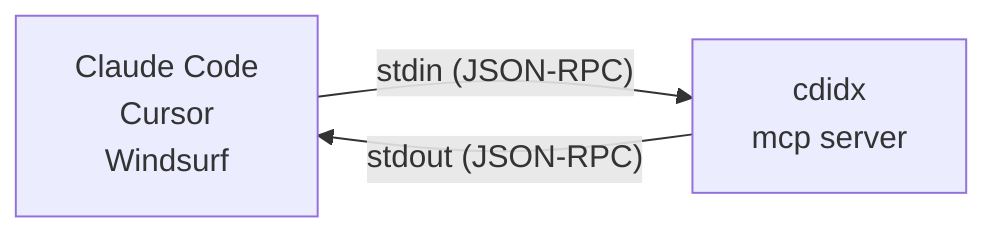

# cdidx

> **[日本語版はこちら / Japanese version](#cdidx日本語)**

[](https://github.com/Widthdom/CodeIndex/actions/workflows/dotnet.yml)
[](https://github.com/Widthdom/CodeIndex/actions/workflows/codeql.yml)
[](https://github.com/Widthdom/CodeIndex/actions/workflows/release.yml)


**The AI-native local code index for terminal and MCP workflows.**

`cdidx` turns a repository into a reusable local search engine: full-text search over SQLite FTS5, symbol lookup, incremental refresh, human-readable CLI output, JSON for agents, and native MCP integration.

```bash
cdidx .                          # Index current directory
cdidx search "authenticate"      # Full-text search
cdidx definition UserService     # Find symbol definitions
cdidx deps --path src/           # File-level dependency graph
cdidx mcp                        # Start MCP server for AI tools
```

46 languages supported. 22 MCP tools. Incremental updates. Zero config.

- **Docs**: [DEVELOPER_GUIDE.md](DEVELOPER_GUIDE.md) for architecture, DB schema, FTS5 internals
- **AI dev contract**: [SELF_IMPROVEMENT.md](SELF_IMPROVEMENT.md)
- **Testing**: [TESTING_GUIDE.md](TESTING_GUIDE.md)

## Why cdidx

Most code search tools optimize for either desktop UI workflows or one-off text scanning in a shell. `cdidx` is built for a different loop: local repositories that need to be searched repeatedly by both humans and AI agents.

- `CLI-first` — designed for terminal workflows, scripts, and automation.
- `AI-native` — `--json` output and MCP structured results are built in, not bolted on.
- `Local-first` — SQLite database lives with the project in `.cdidx/`.
- `Incremental` — refresh only changed files with `--files` or `--commits`.

It is not an IDE replacement or desktop search app. It is a small local search runtime you can script, automate, and hand to AI tools.

Use `rg` when you want a zero-setup one-off scan. Use `cdidx` when the same repository will be searched again and again.

## cdidx vs rg

| | `rg` | `cdidx` |
|---|---|---|
| Best at | One-off text scans | Repeated local code search |
| Setup | None | One-time index build |
| Search model | Reads files every time | Queries a local SQLite FTS5 index |
| Output for automation | Plain text | Human-readable, JSON, and MCP |
| AI integration | Needs parsing | Structured by design |
| Updates after edits | Re-run search | Refresh only changed files |

## 30-Second Quick Start

```bash
# One-liner install (no .NET required)
curl -fsSL https://raw.githubusercontent.com/Widthdom/CodeIndex/main/install.sh | bash
cdidx .
cdidx search "handleRequest"
```

That is the whole loop:

1. `cdidx .` builds or refreshes `.cdidx/codeindex.db`
2. `cdidx search ...` returns results from the local index
3. after edits, refresh with `cdidx . --files path/to/file.cs` or `cdidx . --commits HEAD`

## Installation

### Option A: One-liner install (no .NET required)

Works in containers, CI, and any Linux/macOS environment — no .NET SDK needed.

```bash
curl -fsSL https://raw.githubusercontent.com/Widthdom/CodeIndex/main/install.sh | bash
```

Install a specific version (fetches the installer from that tag to avoid version skew):

```bash
curl -fsSL https://raw.githubusercontent.com/Widthdom/CodeIndex/v1.5.0/install.sh | bash -s -- v1.5.0
```

Supported platforms: `linux-x64`, `linux-arm64`, `osx-arm64` (glibc-based Linux only; Alpine/musl is not supported). Installs to `~/.local/bin` by default (override with `CDIDX_INSTALL_DIR`).

**Dockerfile example:**

```dockerfile
# Install cdidx into /usr/local/bin so it's on PATH immediately
RUN export CDIDX_INSTALL_DIR=/usr/local/bin \
    && curl -fsSL https://raw.githubusercontent.com/Widthdom/CodeIndex/main/install.sh | bash
```

### Option B: NuGet Global Tool

Requires [.NET 8.0 SDK](https://dotnet.microsoft.com/download/dotnet/8.0).

```bash
dotnet tool install -g cdidx
```

That's it. `cdidx` is now available as a command.

#### Upgrade

If you already have cdidx installed, update to the latest version:

```bash
dotnet tool update -g cdidx
```

### Option C: Build from source

Requires [.NET 8.0 SDK](https://dotnet.microsoft.com/download/dotnet/8.0).

```bash
dotnet build src/CodeIndex/CodeIndex.csproj -c Release
dotnet publish src/CodeIndex/CodeIndex.csproj -c Release -o ./publish
```

Then add the binary to your PATH:

**Linux:**

```bash
sudo cp ./publish/cdidx /usr/local/bin/cdidx
```

**macOS:**

```bash
sudo cp ./publish/cdidx /usr/local/bin/cdidx
```

If `/usr/local/bin` is not in your PATH (Apple Silicon default shell):

```bash
echo 'export PATH="/usr/local/bin:$PATH"' >> ~/.zprofile
source ~/.zprofile
```

**Windows:**

```powershell
# PowerShell (run as Administrator)
New-Item -ItemType Directory -Force -Path C:\Tools
Copy-Item .\publish\cdidx.exe C:\Tools\cdidx.exe

# Add to PATH permanently (current user)
$path = [Environment]::GetEnvironmentVariable('Path', 'User')
if ($path -notlike '*C:\Tools*') {
    [Environment]::SetEnvironmentVariable('Path', "$path;C:\Tools", 'User')
}
```

Restart your terminal after adding to PATH.

### Verify

```bash
cdidx --version
```

## Quick Start

### Index a project

```bash
cdidx ./myproject
cdidx ./myproject --rebuild     # full rebuild from scratch
cdidx ./myproject --verbose     # show per-file details
```

By default, `cdidx index` stores the database in `<projectPath>/.cdidx/codeindex.db`, even if you run the command from another directory.

Default output:

```
⠹ Scanning...
  Found 42 files

Indexing...
  ████████████████████░░░░░░░░░░░░  67.0%  [28/42]

Done.

  Files   : 42
  Chunks  : 318
  Symbols : 156
  Skipped : 28 (unchanged)
  Elapsed : 00:00:02
```

With `--verbose`, each file also shows a status tag so you can see exactly what happened:

```
  [OK  ] src/app.cs (12 chunks, 5 symbols)
  [SKIP] src/utils.cs
  [DEL ] src/old.cs
  [ERR ] src/bad.cs: <message>
```

> `[OK  ]` = indexed successfully, `[SKIP]` = unchanged / skipped, `[DEL ]` = deleted from DB (file removed from disk), `[ERR ]` = failed (verbose mode includes stack trace)

This is useful for debugging indexing issues or verifying which files were actually processed.

### Search code

```bash
cdidx search "authenticate"              # full-text search
cdidx search "handleRequest" --lang go   # filter by language
cdidx search "TODO" --limit 50           # more results
cdidx search "auth*" --fts               # raw FTS5 syntax (prefix search)
```

Output:

```
src/Auth/Login.cs:15-30
  public bool Authenticate(string user, string pass)
  {
      var hash = ComputeHash(pass);
      return _store.Verify(user, hash);
  ...

src/Auth/TokenService.cs:42-58
  public string GenerateToken(User user)
  {
      var claims = BuildClaims(user);
      return _jwt.CreateToken(claims);
  ...

(2 results)
```

Human-readable search output is centered around the first matching line when possible, instead of always showing the start of the chunk.

Use `--json` for machine-readable output (AI agents):

```json
{"path":"src/Auth/Login.cs","start_line":15,"end_line":30,"content":"public bool Authenticate(...)...","lang":"csharp","score":12.5}
{"path":"src/Auth/TokenService.cs","lang":"csharp","chunk_start_line":1,"chunk_end_line":80,"snippet_start_line":40,"snippet_end_line":47,"snippet":"if (claims.Count == 0)\\n    throw new InvalidOperationException();\\nreturn GenerateToken(claims);","match_lines":[42,47],"highlights":[{"line":47,"text":"return GenerateToken(claims);","terms":["GenerateToken"]}],"context_before":2,"context_after":3,"score":9.8}
```

### Search symbols (functions, classes, etc.)

```bash
cdidx symbols UserService              # find by name
cdidx symbols --kind class             # all classes
cdidx symbols --kind function --lang python
```

Output:

```
class      UserService                              src/Services/UserService.cs:8-72
function   GetUserById                              src/Services/UserService.cs:24-41
function   CreateUser                               src/Services/UserService.cs:45-61
(3 symbols)
```

With `--json`, symbol results also include definition ranges, optional body ranges, signature text, container symbol, visibility, and return type when the language extractor can infer them:

```json
{"path":"src/Services/UserService.cs","lang":"csharp","kind":"function","name":"GetUserById","line":24,"start_line":24,"end_line":41,"body_start_line":26,"body_end_line":41,"signature":"public async Task<User> GetUserById(int id)","container_kind":"class","container_name":"UserService","visibility":"public","return_type":"Task<User>"}
```

`search`, `definition`, `references`, `callers`, `callees`, `symbols`, and `files` also share repeatable `--path <pattern>` (multiple values are OR'd together), repeatable `--exclude-path <pattern>`, and `--exclude-tests` filters. Search results prefer source files over tests and docs, and `search` boosts files whose symbol names or paths match the query exactly.

`search --json` and MCP `search` return compact match-centered snippets instead of whole chunks. Each result includes `chunk_start_line`, `chunk_end_line`, `snippet_start_line`, `snippet_end_line`, `snippet`, `match_lines`, `highlights`, `context_before`, and `context_after`. Use `--snippet-lines <n>` to shrink or widen the excerpt window (default: 8, max: 20).

### Resolve a definition

```bash
cdidx definition ResolveGitCommonDir
cdidx definition ResolveGitCommonDir --path src/CodeIndex/Cli --exclude-tests
cdidx definition ResolveGitCommonDir --body --json
```

`definition` uses indexed symbol ranges plus chunk reconstruction to return the actual declaration text, and optional body content when the language extractor can infer a body range.

### Inspect one symbol in one round-trip

```bash
cdidx inspect ResolveGitCommonDir --exclude-tests
cdidx inspect ResolveGitCommonDir --exclude-tests --json
```

`inspect` bundles the primary definition, nearby symbols from the same file, references, callers, callees, file metadata, workspace freshness metadata, and call-graph support metadata so AI clients can answer many symbol-oriented questions without chaining several separate commands. When a language is unsupported for `references` / `callers` / `callees`, `inspect --json` now says so explicitly instead of leaving AI clients to infer that from empty arrays.

### Find references, callers, and callees

```bash
cdidx references ResolveGitCommonDir --exclude-tests
cdidx callers ResolveGitCommonDir --exclude-tests --json
cdidx callees AddToGitExclude --exclude-tests
```

These commands use the indexed reference graph and are intended for languages where cdidx already extracts named symbols and call-like references: Python, JavaScript/TypeScript, C#, Go, Rust, Java, Kotlin, Ruby, C/C++, PHP, Swift, Dart, Scala, Elixir, Lua, and VB.NET (18 languages). F# uses space-separated call syntax so graph queries are not supported; use `search` instead. For docs, config, markup, or other unsupported languages, fall back to `search`.

When you pass `--lang` for an unsupported language, human-readable graph commands now say so explicitly, and MCP graph tools expose `graph_language`, `graph_supported`, and `graph_support_reason` alongside the empty result list.

### Outline a single file

```bash
cdidx outline src/CodeIndex/Cli/GitHelper.cs
cdidx outline src/CodeIndex/Cli/GitHelper.cs --json
```

Shows all symbols in a single file ordered by line, with kind, signature, visibility, and container nesting. Lets AI agents understand file structure in one call instead of reading the whole file or chaining `symbols` + `definition`.

### Reconstruct a file excerpt

```bash
cdidx excerpt src/CodeIndex/Cli/GitHelper.cs --start 19 --end 28
cdidx excerpt src/CodeIndex/Cli/GitHelper.cs --start 19 --end 28 --before 3 --after 3 --json
```

### List files

```bash
cdidx files                            # all indexed files
cdidx files --lang csharp              # only C# files
cdidx files --path src/Services --exclude-path Migrations
```

Output:

```
csharp          120 lines  src/Services/UserService.cs
csharp           85 lines  src/Controllers/UserController.cs
csharp           42 lines  src/Models/User.cs
(3 files)
```

### Check status

```bash
cdidx status
```

Output:

```
Files   : 42
Chunks  : 318
Symbols : 156
Refs    : 912
Languages:
  csharp         28
  python         10
  javascript      4
```

### Map the repo before searching

```bash
cdidx map --path src/ --exclude-tests
cdidx map --path src/ --exclude-tests --json
```

`map` gives AI clients a fast repo overview with language breakdowns, module summaries, top files, largest files, symbol-rich files, reference-rich files, and likely entrypoints when heuristics can infer them. Entrypoint heuristics now fall back to known top-level entry files such as `Program.cs` and `main.py` even when the language extractor does not emit a dedicated `Main`-style symbol.

`status --json` and `map --json` also expose freshness metadata. In `map --json`, `indexed_at` / `latest_modified` stay scoped to the filtered result set, while `workspace_indexed_at` / `workspace_latest_modified` mirror whole-workspace freshness so AI clients can tell the difference between "this slice is old" and "the repo is old." `inspect --json` and MCP `analyze_symbol` now expose the same whole-workspace freshness plus `project_root`, `git_head`, and `git_is_dirty`, and also include `graph_language`, `graph_supported`, and `graph_support_reason` so language-aware clients can tell whether empty call-graph sections mean "unsupported" or just "no hits." `files --json` includes per-file `checksum`, `modified`, and `indexed_at` so cached assumptions can be checked at file granularity too.

## Options

| Option | Applies to | Description |
|---|---|---|
| `--db <path>` | All commands | Database file path. `index` defaults to `<projectPath>/.cdidx/codeindex.db`; query commands default to `.cdidx/codeindex.db` in the current directory. |
| `--json` | All commands | JSON output (for AI/machine use) |
| `--limit <n>` | Query commands | Max results (default: 20; `map` uses it per section) |
| `--lang <lang>` | Query commands | Filter by language |
| `--path <pattern>` | `search`, `definition`, `references`, `callers`, `callees`, `symbols`, `files`, `map`, `inspect` | Restrict results to paths containing this text. Repeatable; multiple values are OR'd together |
| `--exclude-path <pattern>` | `search`, `definition`, `references`, `callers`, `callees`, `symbols`, `files`, `map`, `inspect` | Exclude paths containing this text (repeatable) |
| `--exclude-tests` | `search`, `definition`, `references`, `callers`, `callees`, `symbols`, `files`, `map`, `inspect` | Exclude likely test files and prefer production code |
| `--snippet-lines <n>` | `search` | Search snippet length for human-readable output and JSON/MCP snippets (default: 8, max: 20) |
| `--fts` | `search` | Use raw FTS5 query syntax instead of literal-safe quoting |
| `--kind <kind>` | `definition`, `symbols` | Filter by symbol kind (function/class/struct/interface/enum/property/event/delegate/namespace/import) |
| `--body` | `definition`, `inspect` | Include reconstructed body content when the language extractor can infer the body range |
| `--count` | `search`, `definition`, `references`, `callers`, `callees`, `symbols`, `files` | Return only the result count (with `--json`: `{"count": N, "files": M}`) |
| `--start <line>` | `excerpt` | Start line for excerpt reconstruction |
| `--end <line>` | `excerpt` | End line for excerpt reconstruction (defaults to `--start`) |
| `--before <n>` | `excerpt` | Include extra context lines before the requested excerpt |
| `--after <n>` | `excerpt` | Include extra context lines after the requested excerpt |
| `--rebuild` | `index` | Delete existing DB and rebuild |
| `--verbose` | `index` | Show per-file status (`[OK  ]`/`[SKIP]`/`[DEL ]`/`[ERR ]`) |
| `--commits <id...>` | `index` | Update only files changed in specified commits |
| `--files <path...>` | `index` | Update only the specified files |
| `--since <datetime>` | `files` | Filter to files modified since this ISO 8601 timestamp |
| `--no-dedup` | `search` | Disable overlapping-chunk deduplication for raw results |
| `--reverse` | `deps` | Reverse lookup: show files that depend ON the matched path |
| `--top <n>` | Query commands | Alias for `--limit` |

### Exit codes

| Code | Meaning |
|---|---|
| `0` | Success |
| `1` | Usage error (invalid arguments) |
| `2` | Not found (no search results, missing directory) |
| `3` | Database error |

## How it works

cdidx scans your project directory, splits each source file into overlapping chunks, and stores everything in a SQLite database with FTS5 full-text search. Incremental mode (default) first purges database entries for files that no longer exist on disk, then checks each file's last-modified timestamp against the database — only files whose timestamp exactly matches are skipped, and any difference (newer or older) triggers re-indexing. Newly appeared files are indexed as new entries. This means re-indexing after a branch switch only processes the files that actually differ.

## Git integration

`cdidx index` automatically adds `.cdidx/` to `.git/info/exclude`. You don't need to edit `.gitignore`.

`.git/info/exclude` is a standard Git mechanism that works just like `.gitignore`. Many tools use `.git/info/exclude` or store data inside `.git/` to avoid polluting `.gitignore` — git-lfs, git-secret, git-crypt, git-annex, Husky, pre-commit, JetBrains IDEs, VS Code (GitLens), Eclipse, etc.

## Git branch switching

The database reflects the working tree at the time of the last index. After switching branches, simply re-run `cdidx .` — files that no longer exist on disk are purged from the database, newly appeared files are indexed, and existing files are re-indexed only when their timestamp differs. The update is proportional to the number of changed files, not the total project size.

| Situation | What happens |
|---|---|
| File unchanged across branches | Skipped (instant) |
| File content changed | Re-indexed |
| File deleted after checkout | Purged from DB |
| File added after checkout | Indexed as new |

## Supported languages

| Language | Extensions | Symbols |
|---|---|:---:|
| Python | `.py` | yes |
| JavaScript | `.js`, `.jsx` | yes |
| TypeScript | `.ts`, `.tsx` | yes |
| C# | `.cs` | yes |
| Go | `.go` | yes |
| Rust | `.rs` | yes |
| Java | `.java` | yes |
| Kotlin | `.kt` | yes |
| Ruby | `.rb` | yes |
| C | `.c`, `.h` | yes |
| C++ | `.cpp`, `.cc`, `.cxx`, `.hpp`, `.hxx` | yes |
| PHP | `.php` | yes |
| Swift | `.swift` | yes |
| Dart | `.dart` | yes |
| Scala | `.scala`, `.sc` | yes |
| Elixir | `.ex`, `.exs` | yes |
| Lua | `.lua` | yes |
| R | `.r`, `.R` | yes |
| Haskell | `.hs`, `.lhs` | yes |
| F# | `.fs`, `.fsx`, `.fsi` | yes |
| VB.NET | `.vb`, `.vbs` | yes |
| Razor/Blazor | `.cshtml`, `.razor` | yes (as C#) |
| Protobuf | `.proto` | yes |
| GraphQL | `.graphql`, `.gql` | yes |
| Gradle | `.gradle` | yes |
| Makefile | `Makefile` | yes |
| Dockerfile | `Dockerfile` | yes |
| Zig | `.zig` | yes |
| XAML | `.xaml`, `.axaml` | -- |
| MSBuild | `.csproj`, `.fsproj`, `.vbproj`, `.props`, `.targets` | -- |
| Shell | `.sh`, `.bash`, `.zsh`, `.fish` | -- |
| PowerShell | `.ps1` | yes |
| Batch | `.bat`, `.cmd` | -- |
| CMake | `.cmake`, `CMakeLists.txt` | -- |
| SQL | `.sql` | -- |
| Markdown | `.md` | -- |
| YAML | `.yaml`, `.yml` | -- |
| JSON | `.json` | -- |
| TOML | `.toml` | -- |
| HTML | `.html` | -- |
| CSS | `.css`, `.scss` | yes |
| Vue | `.vue` | -- |
| Svelte | `.svelte` | -- |
| Terraform | `.tf` | -- |

All languages are fully searchable via FTS5. Languages with **Symbols = yes** also support structured queries by function/class/import name.

## Prerequisites: sqlite3

AI agents that query the database directly via SQL need the `sqlite3` CLI.

| OS | Status |
|---|---|
| **macOS** | Pre-installed |
| **Linux** | Usually pre-installed. If not: `sudo apt install sqlite3` |
| **Windows** | `winget install SQLite.SQLite` or `scoop install sqlite` |

## AI Integration

cdidx is designed as an AI-friendly code search tool. All query commands support `--json` for JSON lines output, making them easy to parse programmatically. `search`, `definition`, `references`, `callers`, `callees`, `symbols`, `files`, `map`, and `inspect` share path-aware narrowing via `--path`, repeatable `--exclude-path`, and `--exclude-tests`, so AI clients can cut noise before fetching excerpts. `inspect` plus MCP `analyze_symbol` bundle definition, nearby symbols, references, callers, callees, file metadata, whole-workspace trust signals, and call-graph support metadata into one round-trip, while `map` gives a repo-level overview for the first 30 seconds of investigation. `status --json` surfaces whole-workspace freshness metadata, `map --json` distinguishes filtered-scope freshness (`indexed_at`, `latest_modified`) from whole-workspace freshness (`workspace_indexed_at`, `workspace_latest_modified`), and `inspect --json` mirrors those whole-workspace timestamps plus `project_root`, `git_head`, `git_is_dirty`, `graph_language`, `graph_supported`, and `graph_support_reason`. `files --json` exposes per-file checksums plus modified/indexed timestamps. `search --json` plus MCP `search` emit compact match-centered snippets with explicit line metadata instead of whole chunks, and `--snippet-lines` lets callers cap snippet size up front. Call graph data remains language-aware: unsupported languages should use `search` instead of assuming `references`/`callers`/`callees` will be populated. Opening an older database with a newer cdidx version will auto-add missing file/symbol columns and create newer reference tables when possible. If the DB cannot be migrated in place, read paths fall back to the legacy layout instead of crashing.

### Setup: Add to CLAUDE.md

To let AI agents use the generated index, place a `CLAUDE.md` in your project root:

````markdown
# Code Search Rules

This project uses **cdidx** for fast code search via a pre-built SQLite index (`.cdidx/codeindex.db`).
**Query this database** instead of using `find`, `grep`, or `ls -R`.

## Setup

First check if `cdidx` is available:

```bash
cdidx --version
```

**If not found**, install it:

```bash
# No .NET required — downloads a self-contained binary
curl -fsSL https://raw.githubusercontent.com/Widthdom/CodeIndex/main/install.sh | bash
```

Or, if .NET 8+ SDK is available:

```bash
dotnet tool install -g cdidx
```

**If already installed**, update to the latest version:

```bash
# Re-run the installer to upgrade
curl -fsSL https://raw.githubusercontent.com/Widthdom/CodeIndex/main/install.sh | bash
```

If install fails (no network, unsupported platform), skip to the **"Direct SQL queries"** section below — you can query `.cdidx/codeindex.db` directly with `sqlite3`, provided the database was already built. If neither `cdidx` nor `sqlite3` is available, fall back to `rg` (ripgrep), `grep`, `find`, and `cat` for code search.

Before searching, update the index so results are accurate:

```bash
cdidx .   # incremental update (skips unchanged files)
```

## Keeping the index up to date (requires cdidx)

After editing files, update the database so search results stay accurate:

```bash
cdidx . --files path/to/changed_file.cs   # update specific files you modified
cdidx . --commits HEAD                     # update all files changed in the last commit
cdidx . --commits abc123                   # you can also pass a specific commit hash
cdidx .                                    # full incremental update (skips unchanged files)
```

**Rule: whenever you modify source files, run one of the above before your next search.**
If the checkout changed because of `git reset`, `git rebase`, `git commit --amend`, `git switch`, or `git merge`, prefer `cdidx .` so stale files are purged against the current worktree instead of only refreshing commit-local paths.

## Query strategy

- Start with `map` when you need a quick overview of languages, modules, and likely hot spots before issuing symbol or text queries.
- Check `status --json` when freshness matters. Use `indexed_at`, `latest_modified`, `git_head`, and `git_is_dirty` to decide whether you need to re-run `cdidx .` before trusting results. If you already started with `map --json`, treat `indexed_at` / `latest_modified` there as filter-scoped freshness and `workspace_indexed_at` / `workspace_latest_modified` as the whole-workspace view.
- Use `inspect` when you already have a candidate symbol name and want bundled definition/caller/callee/reference context in one round-trip. `inspect --json` also carries `workspace_indexed_at`, `workspace_latest_modified`, `project_root`, `git_head`, and `git_is_dirty` for trust decisions.
- Use `definition` when you need the declaration text for a named symbol, and add `--body` when the implementation body matters.
- Use `references`, `callers`, and `callees` for symbol-aware call graph questions in Python, JavaScript/TypeScript, C#, Go, Rust, Java, Kotlin, Ruby, C/C++, PHP, Swift, Dart, Scala, Elixir, Lua, and VB.NET (18 languages). F# uses space-separated call syntax so graph queries are not supported; use `search` instead.
- Use `symbols` for named code entities in symbol-aware languages (32 languages including Python, JavaScript/TypeScript, C#, Go, Rust, Java, Kotlin, Ruby, C/C++, PHP, Swift, Dart, Scala, F#, VB.NET, Elixir, Lua, R, Haskell, Shell, SQL, Terraform, Protobuf, GraphQL, Gradle, Makefile, Dockerfile, Zig, PowerShell, CSS/SCSS).
- Use `outline` to see the full symbol structure of a single file without reading its content.
- Use `search` for raw text, comments, strings, or languages without structured symbol extraction such as XAML, Markdown, YAML, JSON, TOML, HTML, Vue, Svelte.
- Add `--exclude-tests` unless you are explicitly investigating tests.
- Add `--path <text>` and repeatable `--exclude-path <text>` before broad searches so results stay inside the relevant module.
- Add `--snippet-lines <n>` to `search` when you need tighter JSON output before handing results to another model or tool.
- Use `files` to discover candidate paths, then `excerpt` to fetch only the needed lines instead of opening entire files.
- Use `deps` to understand file-level dependencies — which files reference symbols from other files. Add `--reverse` to find what depends on a given file (impact analysis).
- Use `unused` to find potentially dead code — symbols defined but never referenced (only meaningful for graph-supported languages).
- Use `hotspots` to find the most-referenced symbols — central, high-impact code that changes may affect widely.
- Use `files --since <datetime>` or `search --since <datetime>` to focus on recently modified code.
- Use `--dry-run` with `index` to preview what would be indexed without writing to the database.
- Use `--count` to get result counts before fetching full data (saves tokens for AI agents).
- If you encounter a bug, unexpected behavior, or think of a feature that would improve cdidx, file an issue at https://github.com/Widthdom/CodeIndex/issues describing what happened and the expected behavior.

## CLI (recommended if cdidx is available)

```bash
cdidx map --path src/ --exclude-tests --json
cdidx inspect "Authenticate" --exclude-tests
cdidx search "keyword" --path src/ --exclude-tests --snippet-lines 6
cdidx definition "ClassName" --path src/Services --body
cdidx callers "Authenticate" --lang csharp --exclude-tests
cdidx callees "HandleRequest" --path src/ --exclude-tests
cdidx symbols "ClassName" --lang csharp --exclude-tests
cdidx excerpt src/app.py --start 10 --end 20
cdidx files --lang python --path src/
cdidx status --json
```

## Direct SQL queries (fallback if cdidx is unavailable)

The queries below require `sqlite3`. If it is not installed, suggest the user install it:
- **macOS**: pre-installed
- **Linux**: `sudo apt install sqlite3`
- **Windows**: `winget install SQLite.SQLite` or `scoop install sqlite`

### Full-text search
```sql
SELECT f.path, c.start_line, c.content
FROM fts_chunks fc
JOIN chunks c ON c.id = fc.rowid
JOIN files f ON f.id = c.file_id
WHERE fts_chunks MATCH 'keyword'
LIMIT 20;
```

### Search by function/class name
```sql
SELECT f.path, s.name, s.line
FROM symbols s
JOIN files f ON f.id = s.file_id
WHERE s.kind = 'function' AND s.name LIKE '%keyword%';
```

### Incremental updates for CI / hooks

Instead of re-indexing the entire project, AI agents can update only the files that changed:

```bash
# Update only files changed in specific commits (e.g. in a post-merge hook)
cdidx ./myproject --commits abc123 def456

# Update only specific files (e.g. after saving a file in an editor hook)
cdidx ./myproject --files src/app.cs src/utils.cs
```

These options make it practical to keep the index up-to-date in real time, even on large codebases.
````

### MCP Server (for Claude Code, Cursor, Windsurf, etc.)

cdidx includes a built-in **MCP (Model Context Protocol) server**. MCP is a standard protocol that lets AI coding tools communicate with external programs. When you run `cdidx mcp`, cdidx starts listening on stdin/stdout — your AI tool sends search requests as JSON, and cdidx returns results instantly from the pre-built index.

Tool results include structured JSON in `structuredContent` plus a short text summary in `content`, so AI tools can parse typed data without scraping large text blocks.



**Setup — add to your AI tool's config:**

Claude Code (`.claude/settings.json` or `.mcp.json`):

```json
{
  "mcpServers": {
    "cdidx": {
      "command": "cdidx",
      "args": ["mcp", "--db", ".cdidx/codeindex.db"]
    }
  }
}
```

Cursor (`.cursor/mcp.json`):

```json
{
  "mcpServers": {
    "cdidx": {
      "command": "cdidx",
      "args": ["mcp", "--db", ".cdidx/codeindex.db"]
    }
  }
}
```

Windsurf (`.windsurf/mcp.json`):

```json
{
  "mcpServers": {
    "cdidx": {
      "command": "cdidx",
      "args": ["mcp", "--db", ".cdidx/codeindex.db"]
    }
  }
}
```

GitHub Copilot (VS Code — `.vscode/mcp.json`):

```json
{
  "servers": {
    "cdidx": {
      "type": "stdio",
      "command": "cdidx",
      "args": ["mcp", "--db", ".cdidx/codeindex.db"]
    }
  }
}
```

OpenAI Codex CLI (`codex.json` or `~/.codex/config.json`):

```json
{
  "mcpServers": {
    "cdidx": {
      "command": "cdidx",
      "args": ["mcp", "--db", ".cdidx/codeindex.db"]
    }
  }
}
```

Once configured, the AI can directly call these tools:

| Tool | Description |
|---|---|
| `search` | Full-text search across code chunks |
| `definition` | Reconstruct a symbol declaration and optional body |
| `references` | Find indexed references for supported languages |
| `callers` | List callers for a named symbol in supported languages |
| `callees` | List callees for a named symbol in supported languages |
| `symbols` | Find functions, classes, interfaces, imports, and namespaces by name |
| `files` | List indexed files |
| `excerpt` | Reconstruct a specific line range from indexed chunks |
| `map` | Summarize languages, modules, hotspots, and likely entrypoints |
| `analyze_symbol` | Bundle definition, nearby symbols, references, callers, callees, file metadata, workspace trust metadata, and graph support metadata |
| `outline` | Show all symbols in a single file with line numbers, signatures, and nesting |
| `status` | Database statistics |
| `deps` | File-level dependency edges from the reference graph |
| `impact_analysis` | Compute transitive callers of a symbol (ripple effect of changes) |
| `unused_symbols` | Find symbols defined but never referenced (dead code detection) |
| `symbol_hotspots` | Find most-referenced symbols (high-impact code) |
| `batch_query` | Execute multiple queries in a single call (MCP only, max 10) |
| `validate` | Report encoding issues (U+FFFD, BOM, null bytes, mixed line endings) |
| `languages` | List all supported languages, file extensions, and capabilities |
| `ping` | Lightweight connection check |
| `index` | Index or re-index a project directory |
| `suggest_improvement` | Submit structured improvement suggestions or error reports |

No CLAUDE.md hacks or SQL templates needed — the AI interacts with cdidx natively.

Graph-oriented MCP tools such as `references`, `callers`, and `callees` also return `graph_language`, `graph_supported`, and `graph_support_reason` when a language filter is provided, so clients can distinguish unsupported languages from genuine zero-hit queries.

All MCP tools include `annotations` (`readOnlyHint`, `destructiveHint`, `idempotentHint`, `openWorldHint`) so AI clients can auto-approve safe read-only queries without prompting the user.

### Why cdidx over grep/ripgrep for AI workflows?

| | `grep` / `rg` | `cdidx` |
|---|---|---|
| Output format | Plain text (needs parsing) | JSON lines (machine-ready) |
| Search speed on large repos | Scans every file each time | Pre-built FTS5 index |
| Symbol awareness | None | Functions, classes, imports |
| Incremental update | N/A | `--commits`, `--files` |

### AI Feedback

cdidx includes a `suggest_improvement` MCP tool that AI agents can call when they notice a gap or encounter an error. This works like a lightweight bug report — the AI describes what went wrong in natural language, and the feedback is recorded for the maintainers.

**How it works:**

- When an AI agent calls `suggest_improvement`, the suggestion is saved locally to `.cdidx/suggestions.json`.
- If the user has explicitly set `CDIDX_GITHUB_TOKEN`, the suggestion is also filed as a GitHub Issue on [widthdom/CodeIndex](https://github.com/widthdom/CodeIndex). The generic `GITHUB_TOKEN` is **not** used — this prevents ambient CI tokens from silently publishing. No `CDIDX_GITHUB_TOKEN`, no network request.
- This tool only activates when the AI agent explicitly calls it. It does not run in the background, does not collect data automatically, and does nothing unless invoked.

**What is sent (complete list):**

| Field | Example |
|-------|---------|
| Category | `symbol_extraction`, `crash_report`, etc. (one of 8 fixed values) |
| Language | `typescript`, `rust`, etc. |
| Description | "Arrow functions are not detected as symbols" |
| Context | "Was trying to find all event handlers" |
| cdidx version | `1.4.1` |
| Suggestion hash | SHA256 dedup hash |

**What is guarded against sending:** The description and context fields are validated by [SourceCodeDetector](src/CodeIndex/Cli/SourceCodeDetector.cs) to reject text that looks like pasted source code (multi-line blocks, fenced code, import runs, etc.). This is a heuristic check — it catches common cases but is not a security boundary. Short inline code examples (e.g. `` `const foo = () => {}` ``) are intentionally allowed so that gap descriptions remain useful. File paths from the user's project, database content, and indexed data are never included in the suggestion payload by design — the tool only accepts the four fields listed above. For implementation details, see the [Developer Guide](DEVELOPER_GUIDE.md#ai-feedback-implementation).

## Releasing a new version

> **Maintainers / forkers only** — see [MAINTAINERS.md](MAINTAINERS.md) for the full maintainer index. End users can skip this section.

The version string has a single source of truth: `version.json` at the repo
root. Bumping it is the only code change required for a release.

**How the version flows.**

- **Build time.** `src/CodeIndex/CodeIndex.csproj` reads `version.json` and
  sets `<Version>` from it, so the NuGet package (`cdidx`) and the
  self-contained binary are stamped with the right version automatically.
- **Runtime.** `src/CodeIndex/CodeIndex.csproj` also copies `version.json`
  next to the published binary. `ConsoleUi.LoadVersion()` reads it from
  `AppContext.BaseDirectory` at startup, so `cdidx --version` and the MCP
  `serverInfo.version` / `status --json` `version` fields stay in sync.
- **Install.** `install.sh` places `version.json` in `INSTALL_DIR` alongside
  `cdidx` and the native SQLite library. Without it, `cdidx --version`
  falls back to `v0.0.0`.

**There are no version constants in C#.** Do not search-and-replace version
strings in source files — the only occurrences outside `version.json` are
`CHANGELOG.md` release headings and compare links.

**Release checklist (e.g. 1.8.0 → 1.9.0).**

1. Update `version.json` to the new version (`"version": "1.9.0"`).
2. In `CHANGELOG.md`, promote `[Unreleased]` to `[1.9.0] - YYYY-MM-DD` in
   **both** the English and Japanese sections. Leave a fresh empty
   `[Unreleased]` section above the new version heading.
3. In `CHANGELOG.md`, update the compare links at the bottom of the file:
   - `[Unreleased]: .../compare/v1.9.0...HEAD`
   - `[1.9.0]: .../compare/v1.8.0...v1.9.0`
4. Commit the bump.
5. Tag the commit `v1.9.0` and push the tag — `.github/workflows/release.yml`
   triggers on `v*` tags and builds the per-platform tarballs and the NuGet
   package.
6. After the release is published, run the one-liner installer on a clean
   machine and verify `cdidx --version` prints `v1.9.0` before announcing.

If `cdidx --version` prints `v0.0.0` after installing, the tarball was built
without bundling `version.json`, or `install.sh` is not copying it next to
the binary. See `CLOUD_BOOTSTRAP_PROMPT.md` for the clean-install smoke
test sequence.

## More

- [Developer Guide](DEVELOPER_GUIDE.md) — Architecture, database schema, FTS5 internals, AI integration, design decisions
- [Testing Guide](TESTING_GUIDE.md) — Test suite layout, helper utilities, cross-platform rules, and test maintenance conventions
- [Self-Improvement Loop](SELF_IMPROVEMENT.md) — Ready-to-use operating contract for iterative AI-driven cdidx improvements

---

<a id="cdidx日本語"></a>
# cdidx（日本語）


**ターミナルとMCPワークフローのための、AIネイティブなローカルコードインデックス。**

`cdidx` は、リポジトリを再利用可能なローカル検索エンジンに変えます。SQLite FTS5 による全文検索、シンボル検索、インクリメンタル更新、人間向けCLI出力、AI向けJSON出力、MCP連携をひとつにまとめています。

```bash
cdidx .                          # カレントディレクトリをインデックス
cdidx search "authenticate"      # 全文検索
cdidx definition UserService     # シンボル定義を検索
cdidx deps --path src/           # ファイル間依存グラフ
cdidx mcp                        # AIツール向けMCPサーバー起動
```

46言語対応。21 MCPツール。インクリメンタル更新。設定不要。

- **ドキュメント**: [DEVELOPER_GUIDE.md](DEVELOPER_GUIDE.md) アーキテクチャ、DBスキーマ、FTS5の仕組み
- **AI開発規約**: [SELF_IMPROVEMENT.md](SELF_IMPROVEMENT.md)
- **テストガイド**: [TESTING_GUIDE.md](TESTING_GUIDE.md)

## なぜ cdidx なのか

多くのコード検索ツールは、デスクトップUI中心のワークフローか、シェルでの単発テキスト検索のどちらかに最適化されています。`cdidx` が狙っているのは別のループです。ローカルリポジトリを、人間とAIの両方が何度も検索する前提で設計しています。

- `CLI-first` — ターミナル、スクリプト、自動化向けに設計。
- `AI-native` — `--json` 出力と MCP の構造化結果を標準搭載。
- `Local-first` — SQLite DB はプロジェクト内の `.cdidx/` に配置。
- `Incremental` — `--files` と `--commits` で変更分だけ更新。

IDEの置き換えやデスクトップ検索アプリではありません。スクリプト可能で、自動化できて、AIツールにそのまま渡せる小さなローカル検索ランタイムです。

単発で文字列を掘りたいなら `rg`、同じリポジトリを人間とAIの両方が何度も検索するなら `cdidx` が向いています。

## rg との違い

| | `rg` | `cdidx` |
|---|---|---|
| 得意な用途 | 単発のテキスト走査 | 繰り返し行うローカルコード検索 |
| 初期セットアップ | 不要 | 最初に一度インデックス作成 |
| 検索モデル | 毎回ファイルを読む | ローカルの SQLite FTS5 インデックスを検索 |
| 自動化向け出力 | プレーンテキスト | 人間向け出力、JSON、MCP |
| AI連携 | パースが必要 | 構造化前提 |
| 編集後の更新 | 再検索するだけ | 変更ファイルだけ更新できる |

## 30秒で試す

```bash
# .NET 不要のワンライナーインストール
curl -fsSL https://raw.githubusercontent.com/Widthdom/CodeIndex/main/install.sh | bash
cdidx .
cdidx search "handleRequest"
```

やることはこれだけです:

1. `cdidx .` で `.cdidx/codeindex.db` を作成または更新
2. `cdidx search ...` でローカルインデックスを検索
3. 編集後は `cdidx . --files path/to/file.cs` や `cdidx . --commits HEAD` で差分更新

## インストール

### 方法A: ワンライナーインストール（.NET 不要）

コンテナ、CI、Linux/macOS 環境で .NET SDK なしで使えます。

```bash
curl -fsSL https://raw.githubusercontent.com/Widthdom/CodeIndex/main/install.sh | bash
```

特定バージョンをインストール（バージョンスキューを防ぐため、そのタグからインストーラーを取得）:

```bash
curl -fsSL https://raw.githubusercontent.com/Widthdom/CodeIndex/v1.5.0/install.sh | bash -s -- v1.5.0
```

対応プラットフォーム: `linux-x64`, `linux-arm64`, `osx-arm64`（glibc ベースの Linux のみ。Alpine/musl は非対応）。デフォルトで `~/.local/bin` にインストール（`CDIDX_INSTALL_DIR` で変更可）。

**Dockerfile の例:**

```dockerfile
# /usr/local/bin にインストールして PATH に即反映
RUN export CDIDX_INSTALL_DIR=/usr/local/bin \
    && curl -fsSL https://raw.githubusercontent.com/Widthdom/CodeIndex/main/install.sh | bash
```

### 方法B: NuGet グローバルツール

[.NET 8.0 SDK](https://dotnet.microsoft.com/download/dotnet/8.0) が必要です。

```bash
dotnet tool install -g cdidx
```

これだけです。`cdidx` コマンドがすぐ使えます。

#### アップグレード

すでにインストール済みの場合、最新版に更新できます:

```bash
dotnet tool update -g cdidx
```

### 方法C: ソースからビルド

[.NET 8.0 SDK](https://dotnet.microsoft.com/download/dotnet/8.0) が必要です。

```bash
dotnet build src/CodeIndex/CodeIndex.csproj -c Release
dotnet publish src/CodeIndex/CodeIndex.csproj -c Release -o ./publish
```

ビルド後、バイナリをPATHに追加します:

**Linux:**

```bash
sudo cp ./publish/cdidx /usr/local/bin/cdidx
```

**macOS:**

```bash
sudo cp ./publish/cdidx /usr/local/bin/cdidx
```

`/usr/local/bin` がPATHに含まれていない場合（Apple Siliconのデフォルトシェル）:

```bash
echo 'export PATH="/usr/local/bin:$PATH"' >> ~/.zprofile
source ~/.zprofile
```

**Windows:**

```powershell
# PowerShell（管理者として実行）
New-Item -ItemType Directory -Force -Path C:\Tools
Copy-Item .\publish\cdidx.exe C:\Tools\cdidx.exe

# PATHに永続的に追加（現在のユーザー）
$path = [Environment]::GetEnvironmentVariable('Path', 'User')
if ($path -notlike '*C:\Tools*') {
    [Environment]::SetEnvironmentVariable('Path', "$path;C:\Tools", 'User')
}
```

PATH追加後はターミナルを再起動してください。

### 確認

```bash
cdidx --version
```

## クイックスタート

### プロジェクトをインデックス

```bash
cdidx ./myproject
cdidx ./myproject --rebuild     # 完全再構築
cdidx ./myproject --verbose     # ファイルごとの詳細表示
```

`cdidx index` は、別ディレクトリから実行しても、デフォルトでは `<projectPath>/.cdidx/codeindex.db` にDBを保存します。

デフォルト出力:

```
⠹ Scanning...
  Found 42 files

Indexing...
  ████████████████████░░░░░░░░░░░░  67.0%  [28/42]

Done.

  Files   : 42
  Chunks  : 318
  Symbols : 156
  Skipped : 28 (unchanged)
  Elapsed : 00:00:02
```

`--verbose` を付けると、各ファイルにステータスタグも表示され、何が起きたか一目でわかります:

```
  [OK  ] src/app.cs (12 chunks, 5 symbols)
  [SKIP] src/utils.cs
  [DEL ] src/old.cs
  [ERR ] src/bad.cs: <message>
```

> `[OK  ]` = インデックス成功、`[SKIP]` = 未変更・スキップ、`[DEL ]` = DBから削除（ディスク上のファイルが消えた）、`[ERR ]` = 失敗（verboseではスタックトレースも表示）

インデックスの問題をデバッグしたり、どのファイルが実際に処理されたかを確認するのに便利です。

### コード検索

```bash
cdidx search "authenticate"              # 全文検索
cdidx search "handleRequest" --lang go   # 言語でフィルタ
cdidx search "TODO" --limit 50           # 結果数を増やす
cdidx search "auth*" --fts               # 生のFTS5構文（前方一致検索）
```

出力:

```
src/Auth/Login.cs:15-30
  public bool Authenticate(string user, string pass)
  {
      var hash = ComputeHash(pass);
      return _store.Verify(user, hash);
  ...

src/Auth/TokenService.cs:42-58
  public string GenerateToken(User user)
  {
      var claims = BuildClaims(user);
      return _jwt.CreateToken(claims);
  ...

(2 results)
```

人間向けの検索出力は、可能な限り最初の一致行を中心にスニペットを表示し、常にチャンク先頭だけを出すことはありません。

`--json` でAI/機械向け出力:

```json
{"path":"src/Auth/Login.cs","start_line":15,"end_line":30,"content":"public bool Authenticate(...)...","lang":"csharp","score":12.5}
{"path":"src/Auth/TokenService.cs","start_line":42,"end_line":58,"content":"public string GenerateToken(...)...","lang":"csharp","score":9.8}
```

### シンボル検索（関数、クラスなど）

```bash
cdidx symbols UserService              # 名前で検索
cdidx symbols --kind class             # すべてのクラス
cdidx symbols --kind function --lang python
```

出力:

```
class      UserService                              src/Services/UserService.cs:8-72
function   GetUserById                              src/Services/UserService.cs:24-41
function   CreateUser                               src/Services/UserService.cs:45-61
(3 symbols)
```

`--json` を使うと、シンボル結果には定義範囲、判定できる場合の本体範囲、シグネチャ文字列、親シンボル、可視性、戻り値型も含まれます。

```json
{"path":"src/Services/UserService.cs","lang":"csharp","kind":"function","name":"GetUserById","line":24,"start_line":24,"end_line":41,"body_start_line":26,"body_end_line":41,"signature":"public async Task<User> GetUserById(int id)","container_kind":"class","container_name":"UserService","visibility":"public","return_type":"Task<User>"}
```

`search`、`definition`、`references`、`callers`、`callees`、`symbols`、`files` は共通で繰り返し指定できる `--path <pattern>`（複数値は OR で結合）、繰り返し指定できる `--exclude-path <pattern>`、`--exclude-tests` に対応しています。検索結果は tests や docs より source を優先し、`search` はシンボル名やパスがクエリと正確に一致するファイルを上に出します。

`search --json` と MCP の `search` は、チャンク全文ではなく一致中心の軽量スニペットを返します。各結果には `chunk_start_line`、`chunk_end_line`、`snippet_start_line`、`snippet_end_line`、`snippet`、`match_lines`、`highlights`、`context_before`、`context_after` が含まれます。抜粋の長さは `--snippet-lines <n>` で調整できます（デフォルト: 8、最大: 20）。

### 定義を引く

```bash
cdidx definition ResolveGitCommonDir
cdidx definition ResolveGitCommonDir --path src/CodeIndex/Cli --exclude-tests
cdidx definition ResolveGitCommonDir --body --json
```

`definition` は、インデックス済みシンボル範囲とチャンク再構成を使って実際の宣言テキストを返します。言語抽出器が本体範囲を推論できる場合は、`--body` で本体内容も返します。

### 1往復でシンボルを精査する

```bash
cdidx inspect ResolveGitCommonDir --exclude-tests
cdidx inspect ResolveGitCommonDir --exclude-tests --json
```

`inspect` は、主定義、同一ファイル内の近傍シンボル、参照、caller、callee、ファイルメタデータ、さらにワークスペース鮮度メタデータと call graph 対応メタデータをまとめて返すため、AIクライアントが複数コマンドを連鎖させずにシンボル調査を進められます。`references` / `callers` / `callees` が未対応言語で空になる場合も、`inspect --json` がその理由を明示します。

### 参照、callers、callees を調べる

```bash
cdidx references ResolveGitCommonDir --exclude-tests
cdidx callers ResolveGitCommonDir --exclude-tests --json
cdidx callees AddToGitExclude --exclude-tests
```

これらのコマンドはインデックス済み参照グラフを使います。対象は、cdidx が名前付きシンボルと call 相当の参照を抽出している言語、つまり Python、JavaScript/TypeScript、C#、Go、Rust、Java、Kotlin、Ruby、C/C++、PHP、Swift、Dart、Scala、Elixir、Lua、VB.NET です（18言語）。F# はスペース区切りの呼び出し構文のため graph クエリ非対応です。ドキュメント、設定ファイル、マークアップなどの未対応言語では `search` に戻してください。

未対応言語を `--lang` で指定した場合、人間向けの graph コマンドはその旨を明示し、MCP の graph ツールは空結果に加えて `graph_language`、`graph_supported`、`graph_support_reason` を返します。

### 1ファイルのアウトラインを見る

```bash
cdidx outline src/CodeIndex/Cli/GitHelper.cs
cdidx outline src/CodeIndex/Cli/GitHelper.cs --json
```

1ファイル内の全シンボルを行順に、種別・シグネチャ・可視性・コンテナネスト付きで表示します。ファイル全体を読んだり `symbols` + `definition` をチェーンしたりする代わりに、1回でファイル構造を把握できます。

### ファイル抜粋を再構成する

```bash
cdidx excerpt src/CodeIndex/Cli/GitHelper.cs --start 19 --end 28
cdidx excerpt src/CodeIndex/Cli/GitHelper.cs --start 19 --end 28 --before 3 --after 3 --json
```

### ファイル一覧

```bash
cdidx files                            # 全インデックス済みファイル
cdidx files --lang csharp              # C#ファイルのみ
cdidx files --path src/Services --exclude-path Migrations
```

出力:

```
csharp          120 lines  src/Services/UserService.cs
csharp           85 lines  src/Controllers/UserController.cs
csharp           42 lines  src/Models/User.cs
(3 files)
```

### 状態確認

```bash
cdidx status
```

出力:

```
Files   : 42
Chunks  : 318
Symbols : 156
Refs    : 912
Languages:
  csharp         28
  python         10
  javascript      4
```

### 検索前にリポジトリ全体を俯瞰する

```bash
cdidx map --path src/ --exclude-tests
cdidx map --path src/ --exclude-tests --json
```

`map` は、言語別内訳、モジュール要約、主要ファイル、巨大ファイル、シンボル密度の高いファイル、参照密度の高いファイル、推定できる場合のエントリポイントをまとめて返し、AIクライアントが最初の30秒で地図を作れるようにします。エントリポイント推定は、言語抽出器が `Main` 系シンボルを出さない場合でも、`Program.cs` や `main.py` のような既知のトップレベル実行ファイルへフォールバックします。

さらに `status --json` と `map --json` は鮮度メタデータを返します。`map --json` では `indexed_at` / `latest_modified` はフィルタ後の結果集合に対する鮮度を維持しつつ、`workspace_indexed_at` / `workspace_latest_modified` でワークスペース全体の鮮度も返すため、AIクライアントは「この絞り込み範囲だけ古い」のか「リポジトリ全体が古い」のかを区別できます。`inspect --json` と MCP の `analyze_symbol` も同じワークスペース鮮度に加えて `project_root`、`git_head`、`git_is_dirty`、さらに `graph_language`、`graph_supported`、`graph_support_reason` を返します。`files --json` にはファイル単位の `checksum`、`modified`、`indexed_at` が含まれるため、AIクライアントは仮説が古くなっていないか判断できます。

## オプション一覧

| オプション | 対象 | 説明 |
|---|---|---|
| `--db <path>` | 全コマンド | DBファイルパス。`index` のデフォルトは `<projectPath>/.cdidx/codeindex.db`、クエリ系コマンドのデフォルトはカレントディレクトリの `.cdidx/codeindex.db`。 |
| `--json` | 全コマンド | JSON出力（AI/機械向け） |
| `--limit <n>` | クエリ系 | 最大結果数（デフォルト: 20。`map` では各セクションごとの件数） |
| `--lang <lang>` | クエリ系 | 言語でフィルタ |
| `--path <pattern>` | `search`, `definition`, `references`, `callers`, `callees`, `symbols`, `files`, `map`, `inspect` | 指定文字列を含むパスに結果を絞る。繰り返し指定可（複数値は OR で結合） |
| `--exclude-path <pattern>` | `search`, `definition`, `references`, `callers`, `callees`, `symbols`, `files`, `map`, `inspect` | 指定文字列を含むパスを除外（繰り返し指定可） |
| `--exclude-tests` | `search`, `definition`, `references`, `callers`, `callees`, `symbols`, `files`, `map`, `inspect` | テストらしいパスを除外し、本番コードを優先 |
| `--snippet-lines <n>` | `search` | 人間向け出力と JSON/MCP スニペットの抜粋行数（デフォルト: 8、最大: 20） |
| `--fts` | `search` | リテラル安全な引用ではなく生のFTS5クエリ構文を使う |
| `--kind <kind>` | `definition`, `symbols` | シンボル種別でフィルタ（function/class/struct/interface/enum/property/event/delegate/namespace/import） |
| `--body` | `definition`, `inspect` | 言語抽出器が本体範囲を推論できる場合に本体内容も含める |
| `--count` | `search`, `definition`, `references`, `callers`, `callees`, `symbols`, `files` | 結果のカウントだけを返す（`--json` 併用: `{"count": N, "files": M}`） |
| `--start <line>` | `excerpt` | 抜粋再構成の開始行 |
| `--end <line>` | `excerpt` | 抜粋再構成の終了行（省略時は `--start` と同じ） |
| `--before <n>` | `excerpt` | 指定範囲の前に追加する文脈行数 |
| `--after <n>` | `excerpt` | 指定範囲の後に追加する文脈行数 |
| `--rebuild` | `index` | 既存DBを削除して再構築 |
| `--verbose` | `index` | ファイルごとのステータス表示（`[OK  ]`/`[SKIP]`/`[DEL ]`/`[ERR ]`） |
| `--commits <id...>` | `index` | 指定コミットの変更ファイルのみ更新 |
| `--files <path...>` | `index` | 指定ファイルのみ更新 |
| `--since <datetime>` | `files` | 指定タイムスタンプ以降に変更されたファイルのみ（ISO 8601） |
| `--no-dedup` | `search` | オーバーラップチャンク重複排除を無効化 |
| `--reverse` | `deps` | 逆引き: 指定パスに依存しているファイルを表示 |
| `--top <n>` | クエリ系 | `--limit` のエイリアス |

### 終了コード

| コード | 意味 |
|---|---|
| `0` | 成功 |
| `1` | 引数エラー |
| `2` | 未検出（検索結果なし、ディレクトリ不在） |
| `3` | データベースエラー |

## 動作の仕組み

cdidxはプロジェクトディレクトリを走査し、各ソースファイルを重複を持つチャンクに分割し、FTS5全文検索付きのSQLiteデータベースに格納します。インクリメンタルモード（デフォルト）では各ファイルの最終更新タイムスタンプをDB内の値と比較し、完全一致するファイルのみスキップします。タイムスタンプが異なれば（新しくても古くても）再インデックスされるため、ブランチ切り替え後も正確にインデックスが更新されます。

## Git連携

`cdidx index` を実行すると、`.cdidx/` が自動で `.git/info/exclude` に追加されます。`.gitignore` を編集する必要はありません。

`.git/info/exclude` は `.gitignore` と同じ効果を持つ Git 標準の仕組みです。`.gitignore` を汚さないよう `.git/info/exclude` や `.git/` 配下を利用するツールは多数あります — git-lfs、git-secret、git-crypt、git-annex、Husky、pre-commit、JetBrains IDE、VS Code (GitLens)、Eclipse など。

## Gitブランチ切り替え

データベースはインデックス実行時のワーキングツリーを反映します。ブランチ切り替え後は `cdidx .` を再実行してください。ディスク上から消えたファイルはDBからパージされ、新たに現れたファイルはインデックスに追加され、既存ファイルはタイムスタンプが異なる場合のみ再インデックスされます。更新量はプロジェクト全体のサイズではなく変更ファイル数に比例します。

| 状況 | 動作 |
|---|---|
| ブランチ間でファイル未変更 | スキップ（即時） |
| ファイル内容が変更 | 再インデックス |
| checkout後にファイル削除 | DBからパージ |
| checkout後にファイル追加 | 新規インデックス |

## 対応言語

| 言語 | 拡張子 | シンボル |
|---|---|:---:|
| Python | `.py` | yes |
| JavaScript | `.js`, `.jsx` | yes |
| TypeScript | `.ts`, `.tsx` | yes |
| C# | `.cs` | yes |
| Go | `.go` | yes |
| Rust | `.rs` | yes |
| Java | `.java` | yes |
| Kotlin | `.kt` | yes |
| Ruby | `.rb` | yes |
| C | `.c`, `.h` | yes |
| C++ | `.cpp`, `.cc`, `.cxx`, `.hpp`, `.hxx` | yes |
| PHP | `.php` | yes |
| Swift | `.swift` | yes |
| Dart | `.dart` | yes |
| Scala | `.scala`, `.sc` | yes |
| Elixir | `.ex`, `.exs` | yes |
| Lua | `.lua` | yes |
| R | `.r`, `.R` | yes |
| Haskell | `.hs`, `.lhs` | yes |
| F# | `.fs`, `.fsx`, `.fsi` | yes |
| VB.NET | `.vb`, `.vbs` | yes |
| Razor/Blazor | `.cshtml`, `.razor` | yes (as C#) |
| Protobuf | `.proto` | yes |
| GraphQL | `.graphql`, `.gql` | yes |
| Gradle | `.gradle` | yes |
| Makefile | `Makefile` | yes |
| Dockerfile | `Dockerfile` | yes |
| Zig | `.zig` | yes |
| XAML | `.xaml`, `.axaml` | -- |
| MSBuild | `.csproj`, `.fsproj`, `.vbproj`, `.props`, `.targets` | -- |
| Shell | `.sh`, `.bash`, `.zsh`, `.fish` | -- |
| PowerShell | `.ps1` | yes |
| Batch | `.bat`, `.cmd` | -- |
| CMake | `.cmake`, `CMakeLists.txt` | -- |
| SQL | `.sql` | -- |
| Markdown | `.md` | -- |
| YAML | `.yaml`, `.yml` | -- |
| JSON | `.json` | -- |
| TOML | `.toml` | -- |
| HTML | `.html` | -- |
| CSS | `.css`, `.scss` | yes |
| Vue | `.vue` | -- |
| Svelte | `.svelte` | -- |
| Terraform | `.tf` | -- |

全言語がFTS5による全文検索に対応。**シンボル = yes** の言語は関数・クラス・インポート名での構造化検索にも対応しています。

## 前提条件: sqlite3

AIエージェントがDBを直接SQL検索する場合、`sqlite3` CLIが必要です。

| OS | 状況 |
|---|---|
| **macOS** | プリインストール済み |
| **Linux** | 通常プリインストール済み。未導入時: `sudo apt install sqlite3` |
| **Windows** | `winget install SQLite.SQLite` または `scoop install sqlite` |

## AIとの連携

cdidxはAI対応のコード検索ツールとして設計されています。すべてのクエリコマンドは `--json` でJSONライン出力に対応し、プログラムからのパースが容易です。`search`、`definition`、`references`、`callers`、`callees`、`symbols`、`files`、`map`、`inspect` は `--path`、繰り返し指定できる `--exclude-path`、`--exclude-tests` で共通に絞り込みできるため、AIクライアントは抜粋取得前にノイズを減らせます。`inspect` と MCP の `analyze_symbol` は、定義、近傍シンボル、参照、caller、callee、ファイルメタデータ、さらにワークスペース全体の信頼シグナルと call graph 対応メタデータを1往復でまとめて返し、`map` は調査開始直後の俯瞰を返します。`status --json` はワークスペース全体の鮮度を返し、`map --json` はフィルタ後集合の鮮度 (`indexed_at`, `latest_modified`) とワークスペース全体の鮮度 (`workspace_indexed_at`, `workspace_latest_modified`) を区別して返します。`inspect --json` はそれと同じワークスペース鮮度に加えて `project_root`、`git_head`、`git_is_dirty`、`graph_language`、`graph_supported`、`graph_support_reason` も返します。`files --json` はファイルごとの checksum と modified/indexed timestamp を返します。`search --json` と MCP の `search` は、チャンク全文ではなく一致中心の軽量スニペットと明示的な行メタデータを返し、`--snippet-lines` でそのサイズを先に制限できます。call graph 系のデータは言語差分を考慮しており、未対応言語では `references` / `callers` / `callees` が空でも正常です。その場合は `search` を優先してください。古いDBを新しいcdidxで開いた場合も、可能なら不足する file/symbol 列を自動追加し、新しい参照テーブルも作成します。DBをその場で移行できない場合でも、読み取り経路は旧レイアウトへフォールバックし、クラッシュしません。

### セットアップ: CLAUDE.mdに追加

AIエージェントにインデックスを活用させるには、プロジェクトルートに `CLAUDE.md` を配置してください:

````markdown
# コードベース検索ルール

このプロジェクトは **cdidx** を使い、事前構築済みSQLiteインデックス（`.cdidx/codeindex.db`）で高速コード検索を行います。
コードを検索する際は `find`, `grep`, `ls -R` ではなく**このデータベースを検索**してください。

## セットアップ

まず `cdidx` が利用可能か確認してください:

```bash
cdidx --version
```

**見つからない場合**、インストールしてください:

```bash
# .NET 不要 — self-contained バイナリをダウンロード
curl -fsSL https://raw.githubusercontent.com/Widthdom/CodeIndex/main/install.sh | bash
```

または .NET 8+ SDK がある場合:

```bash
dotnet tool install -g cdidx
```

**すでにインストール済みの場合**、最新版に更新してください:

```bash
# インストーラーを再実行してアップグレード
curl -fsSL https://raw.githubusercontent.com/Widthdom/CodeIndex/main/install.sh | bash
```

インストールに失敗した場合（ネットワーク不通、未対応プラットフォーム等）は、データベースが構築済みであれば下記の **「直接SQLクエリ」** セクションで `sqlite3` から `.cdidx/codeindex.db` を直接検索できます。`cdidx` も `sqlite3` も利用できない場合は、`rg`（ripgrep）、`grep`、`find`、`cat` でコードを検索してください。

検索を始める前に、インデックスを最新化してください:

```bash
cdidx .   # インクリメンタル更新（未変更ファイルはスキップ）
```

## インデックスの最新化（cdidxが必要）

ファイルを編集したら、検索結果を正確に保つためにデータベースを更新してください:

```bash
cdidx . --files path/to/changed_file.cs   # 変更したファイルだけ更新
cdidx . --commits HEAD                     # 直前のコミットで変更されたファイルを更新
cdidx . --commits abc123                   # 特定のコミットハッシュも指定可能
cdidx .                                    # フルインクリメンタル更新（未変更ファイルはスキップ）
```

**ルール: ソースファイルを修正したら、次の検索の前に上記のいずれかを実行すること。**
`git reset`、`git rebase`、`git commit --amend`、`git switch`、`git merge` で checkout 自体が変わった後は、コミット単位の更新だけでなく stale file の掃除も必要になるため、`cdidx .` を優先してください。

## クエリ戦略

- まず全体像が欲しいときは `map` から始めて、言語、モジュール、主要ファイル、ホットスポットを把握する。
- 鮮度が重要な場合は `status --json` を先に見て、`indexed_at`、`latest_modified`、`git_head`、`git_is_dirty` を確認してから検索結果を信用するか判断する。すでに `map --json` を使っている場合は、その `indexed_at` / `latest_modified` は絞り込み結果に対する値、`workspace_indexed_at` / `workspace_latest_modified` はワークスペース全体に対する値として読む。
- 候補シンボル名が決まっていて、定義・caller・callee・参照をまとめて欲しいときは `inspect` を使う。`inspect --json` には `workspace_indexed_at`、`workspace_latest_modified`、`project_root`、`git_head`、`git_is_dirty` も含まれるため、信頼判断も同時に行える。
- 名前付きシンボルの宣言を取りたいときは `definition` を使い、本体も必要なら `--body` を付ける。
- Python、JavaScript/TypeScript、C#、Go、Rust、Java、Kotlin、Ruby、C/C++、PHP、Swift、Dart、Scala の call graph 系調査では `references`、`callers`、`callees` を使う。
- Python、JavaScript/TypeScript、C#、Go、Rust、Java、Kotlin、Ruby、C/C++、PHP、Swift、Dart、Scala、F#、VB.NET、Elixir、Lua、R、Haskell、Zig、PowerShell、CSS/SCSS のようなシンボル抽出対応言語では、名前ベースの調査に `symbols` を使う。
- 1ファイルのシンボル構造をファイル内容を読まずに把握したいときは `outline` を使う。
- XAML、Markdown、YAML、JSON、TOML、HTML、Vue、Svelte のような構造化シンボル抽出が弱い言語や、コメント・文字列・生テキストを探す場合は `search` を使う。
- テストを明示的に調べるのでなければ、まず `--exclude-tests` を付ける。
- 広い検索を始める前に `--path <text>` と繰り返し指定できる `--exclude-path <text>` を使って対象モジュールに絞る。
- 別のモデルやツールへ渡す前提で検索JSONをさらに細くしたいときは、`search` に `--snippet-lines <n>` を付ける。
- 候補パスの把握には `files` を使い、必要行だけ読むときは `excerpt` を使ってファイル全体を開かない。
- `deps` でファイル間の依存関係を把握する。`--reverse` で指定ファイルに依存しているファイルを特定（影響分析）。
- `unused` で潜在的なデッドコードを検出する — 定義されているが一度も参照されていないシンボル（グラフ対応言語でのみ有効）。
- `hotspots` で最も参照されるシンボルを特定する — 変更が広範囲に影響する中心的なコード。
- `files --since <datetime>` や `search --since <datetime>` で最近変更されたコードに絞る。
- `index` の `--dry-run` でDBに書き込まずインデックス対象を事前確認。
- `--count` で結果数を先に確認し、全データ取得前にトークンを節約。
- cdidx のバグや予期しない動作を見つけた場合、または改善アイデアがある場合は、https://github.com/Widthdom/CodeIndex/issues に issue を作成し、発生した事象と期待する動作を記述してください。

## CLI（cdidxが利用可能な場合に推奨）

```bash
cdidx map --path src/ --exclude-tests --json
cdidx inspect "Authenticate" --exclude-tests
cdidx search "keyword" --path src/ --exclude-tests --snippet-lines 6
cdidx definition "ClassName" --path src/Services --body
cdidx callers "Authenticate" --lang csharp --exclude-tests
cdidx callees "HandleRequest" --path src/ --exclude-tests
cdidx symbols "ClassName" --lang csharp --exclude-tests
cdidx excerpt src/app.py --start 10 --end 20
cdidx files --lang python --path src/
cdidx status --json
```

## 直接SQLクエリ（cdidxが利用できない場合のフォールバック）

以下のクエリには `sqlite3` が必要です。未インストールの場合、ユーザーにインストールを提案してください:
- **macOS**: プリインストール済み
- **Linux**: `sudo apt install sqlite3`
- **Windows**: `winget install SQLite.SQLite` または `scoop install sqlite`

### 全文検索
```sql
SELECT f.path, c.start_line, c.content
FROM fts_chunks fc
JOIN chunks c ON c.id = fc.rowid
JOIN files f ON f.id = c.file_id
WHERE fts_chunks MATCH 'キーワード'
LIMIT 20;
```

### 関数・クラス名で検索
```sql
SELECT f.path, s.name, s.line
FROM symbols s
JOIN files f ON f.id = s.file_id
WHERE s.kind = 'function' AND s.name LIKE '%キーワード%';
```

### CI / フック向けインクリメンタル更新

プロジェクト全体を再インデックスする代わりに、変更のあったファイルだけを更新できます:

```bash
# 特定コミットの変更ファイルのみ更新（例: post-mergeフックで）
cdidx ./myproject --commits abc123 def456

# 特定ファイルのみ更新（例: エディタの保存フックで）
cdidx ./myproject --files src/app.cs src/utils.cs
```

これらのオプションにより、大規模コードベースでもリアルタイムにインデックスを最新に保つことが実用的になります。
````

### MCP サーバー（Claude Code、Cursor、Windsurf 等に対応）

cdidxには**MCP（Model Context Protocol）サーバー**が組み込まれています。MCPは、AIコーディングツールが外部プログラムと通信するための標準プロトコルです。`cdidx mcp` を実行すると、cdidxがstdin/stdoutで待機し、AIツールからの検索リクエストをJSONで受け取り、構築済みインデックスから即座に結果を返します。

ツール結果は `structuredContent` に構造化JSON、`content` に短い要約テキストを返すため、AIツールは巨大なテキストをパースせずに型付きデータを扱えます。


**セットアップ — AIツールの設定ファイルに追加するだけ:**

Claude Code (`.claude/settings.json` または `.mcp.json`):

```json
{
  "mcpServers": {
    "cdidx": {
      "command": "cdidx",
      "args": ["mcp", "--db", ".cdidx/codeindex.db"]
    }
  }
}
```

Cursor (`.cursor/mcp.json`):

```json
{
  "mcpServers": {
    "cdidx": {
      "command": "cdidx",
      "args": ["mcp", "--db", ".cdidx/codeindex.db"]
    }
  }
}
```

Windsurf (`.windsurf/mcp.json`):

```json
{
  "mcpServers": {
    "cdidx": {
      "command": "cdidx",
      "args": ["mcp", "--db", ".cdidx/codeindex.db"]
    }
  }
}
```

GitHub Copilot (VS Code — `.vscode/mcp.json`):

```json
{
  "servers": {
    "cdidx": {
      "type": "stdio",
      "command": "cdidx",
      "args": ["mcp", "--db", ".cdidx/codeindex.db"]
    }
  }
}
```

OpenAI Codex CLI (`codex.json` または `~/.codex/config.json`):

```json
{
  "mcpServers": {
    "cdidx": {
      "command": "cdidx",
      "args": ["mcp", "--db", ".cdidx/codeindex.db"]
    }
  }
}
```

設定するだけで、AIが以下のツールを直接呼び出せます:

| ツール | 説明 |
|---|---|
| `search` | コードチャンクの全文検索 |
| `definition` | シンボルの宣言と必要なら本体を再構成して取得 |
| `references` | 対応言語でインデックス済み参照を検索 |
| `callers` | 対応言語で指定シンボルの caller を列挙 |
| `callees` | 対応言語で指定シンボルの callee を列挙 |
| `symbols` | 関数・クラス・インターフェース・import・namespace を名前で検索 |
| `files` | インデックス済みファイル一覧 |
| `excerpt` | インデックス済みチャンクから特定行範囲を再構成 |
| `map` | 言語、モジュール、ホットスポット、推定エントリポイントを要約 |
| `analyze_symbol` | 定義、近傍シンボル、参照、caller、callee、ファイル情報、ワークスペース信頼メタデータ、graph 対応メタデータをまとめて返す |
| `outline` | 1ファイルの全シンボルを行番号・シグネチャ・ネスト構造付きで表示 |
| `status` | データベース統計情報 |
| `deps` | 参照グラフからファイル間依存エッジを表示 |
| `impact_analysis` | シンボルの推移的呼び出し元を算出（変更の波及効果） |
| `unused_symbols` | 定義されているが参照されていないシンボルを検索（デッドコード検出） |
| `symbol_hotspots` | 最も参照されるシンボルを検索（影響の大きいコード） |
| `batch_query` | 複数クエリを1回で実行（MCP専用、最大10件） |
| `validate` | エンコーディング問題（U+FFFD、BOM、null バイト、改行混在）を報告 |
| `languages` | 対応言語一覧を拡張子・機能付きで表示 |
| `ping` | 軽量な接続確認 |
| `index` | プロジェクトのインデックス作成・更新 |
| `suggest_improvement` | 構造化された改善提案またはエラー報告を送信 |

CLAUDE.mdの設定やSQLテンプレートは不要 — AIがcdidxとネイティブに連携します。

`references`、`callers`、`callees` などの graph 系 MCP ツールも、言語フィルタが指定されている場合は `graph_language`、`graph_supported`、`graph_support_reason` を返し、未対応言語と単なる 0 件ヒットを区別できるようにしています。

全 MCP ツールは `annotations`（`readOnlyHint`、`destructiveHint`、`idempotentHint`、`openWorldHint`）を含み、AIクライアントがユーザーへの確認なしに安全な読み取り専用クエリを自動承認できるようにしています。

### AIワークフローで grep/ripgrep より cdidx が優れる理由

| | `grep` / `rg` | `cdidx` |
|---|---|---|
| 出力形式 | プレーンテキスト（パース必要） | JSONライン（機械処理可能） |
| 大規模リポジトリでの検索速度 | 毎回全ファイルスキャン | 構築済みFTS5インデックス |
| シンボル認識 | なし | 関数、クラス、インポート |
| インクリメンタル更新 | N/A | `--commits`, `--files` |

### AIフィードバック

cdidx には `suggest_improvement` MCPツールがあり、AIエージェントがギャップに気づいたときやエラーに遭遇したときに呼び出せます。軽量なバグレポートのように機能し、AIが何が問題だったかを自然言語で記述し、フィードバックがメンテナ向けに記録されます。

**仕組み:**

- AIエージェントが `suggest_improvement` を呼ぶと、提案は `.cdidx/suggestions.json` にローカル保存されます。
- ユーザーが `CDIDX_GITHUB_TOKEN` を明示的に設定している場合のみ、[widthdom/CodeIndex](https://github.com/widthdom/CodeIndex) に GitHub Issue としても報告されます。汎用の `GITHUB_TOKEN` は使用しません — CI 等の環境トークンが意図せず公開されることを防ぎます。`CDIDX_GITHUB_TOKEN` がなければネットワークリクエストは発生しません。
- このツールはAIエージェントが明示的に呼んだときのみ動作します。バックグラウンドでは動かず、自動的にデータを収集せず、呼び出されない限り何もしません。

**送信されるデータ（完全なリスト）:**

| フィールド | 例 |
|-----------|------|
| カテゴリ | `symbol_extraction`, `crash_report` 等（8つの固定値のいずれか） |
| 言語 | `typescript`, `rust` 等 |
| 説明 | 「Arrow function がシンボルとして検出されない」 |
| コンテキスト | 「イベントハンドラを全て見つけようとしていた」 |
| cdidx バージョン | `1.4.1` |
| 提案ハッシュ | SHA256 重複排除ハッシュ |

**送信ガード:** description と context フィールドは [SourceCodeDetector](src/CodeIndex/Cli/SourceCodeDetector.cs) により、コピペされたソースコードに見えるテキスト（複数行ブロック、フェンスドコード、import の連打等）を拒否するよう検証されます。これはヒューリスティックな検査であり、一般的なケースを検出しますがセキュリティ境界ではありません。短いインラインコード例（例: `` `const foo = () => {}` ``）は、ギャップの説明として有用なため意図的に許容されます。ユーザーのプロジェクトからのファイルパス、データベース内容、インデックス済みデータは設計上、提案ペイロードに含まれません — ツールは上記4つのフィールドのみを受け付けます。実装の詳細は[開発者ガイド](DEVELOPER_GUIDE.md#aiフィードバックの実装)を参照してください。

## 新バージョンのリリース

> **Maintainer・forker 向け** — 全体の索引は [MAINTAINERS.md](MAINTAINERS.md) を参照。エンドユーザーは読み飛ばして構いません。

バージョン文字列の真実はリポジトリ直下の `version.json` 1箇所のみ。
リリース時に必要なコード変更はこのファイルの更新だけです。

**バージョンの流れ。**

- **ビルド時。** `src/CodeIndex/CodeIndex.csproj` が `version.json` を読み、
  そこから `<Version>` を設定する。NuGet パッケージ（`cdidx`）と
  self-contained バイナリには、ビルド時点で自動的に正しいバージョンが
  刻印される。
- **実行時。** 同じ csproj が `version.json` を発行済みバイナリの隣にコピー
  する。`ConsoleUi.LoadVersion()` は起動時に `AppContext.BaseDirectory` から
  それを読む。`cdidx --version` と、MCP `serverInfo.version` /
  `status --json` の `version` フィールドは常に同期する。
- **インストール時。** `install.sh` は `INSTALL_DIR` に `cdidx` とネイティブ
  SQLite ライブラリと並べて `version.json` も配置する。これが無いと
  `cdidx --version` は `v0.0.0` にフォールバックする。

**C# 側にバージョン定数はありません。** ソース中のバージョン文字列を
grep で置換する必要はありません — `version.json` の外に出現するのは
`CHANGELOG.md` のリリース見出しと compare リンクのみです。

**リリース手順（例: 1.8.0 → 1.9.0）。**

1. `version.json` を新バージョンに更新（`"version": "1.9.0"`）。
2. `CHANGELOG.md` で `[Unreleased]` を `[1.9.0] - YYYY-MM-DD` に昇格する。
   英語セクションと日本語セクションの**両方**で。新しいバージョン見出しの
   上に、空の `[Unreleased]` セクションを残す。
3. `CHANGELOG.md` 末尾の compare リンクを更新:
   - `[Unreleased]: .../compare/v1.9.0...HEAD`
   - `[1.9.0]: .../compare/v1.8.0...v1.9.0`
4. バージョンバンプをコミット。
5. コミットに `v1.9.0` タグを付け、タグを push する — `.github/workflows/release.yml`
   は `v*` タグで起動し、各プラットフォームの tarball と NuGet パッケージを
   ビルドする。
6. リリース公開後、クリーンなマシンでワンライナーインストーラを実行し、
   `cdidx --version` が `v1.9.0` を返すことを確認してから告知する。

インストール後に `cdidx --version` が `v0.0.0` を返したら、tarball に
`version.json` が含まれていないか、`install.sh` がそれをバイナリの隣に
コピーしていない。クリーンインストール時のスモーク手順は
`CLOUD_BOOTSTRAP_PROMPT.md` を参照。

## もっと詳しく

- [開発者ガイド](DEVELOPER_GUIDE.md) — アーキテクチャ、DBスキーマ、FTS5の内部構造、AI連携、設計判断
- [テストガイド](TESTING_GUIDE.md) — テストスイート構成、共有ヘルパー、クロスプラットフォーム注意点、保守ルール
- [自己改善ループ](SELF_IMPROVEMENT.md) — AIが cdidx 自身を継続改善するときの、そのまま使える運用契約
