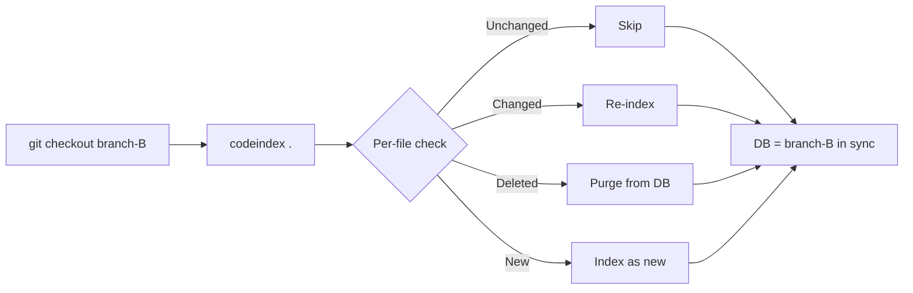
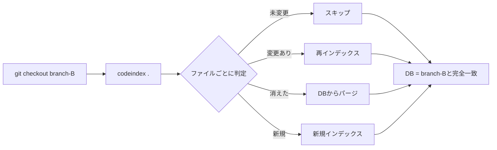

# CodeIndex

> **[日本語版はこちら / Japanese version](#codeindex日本語)**

[](https://github.com/Widthdom/CodeIndex/actions/workflows/dotnet.yml)
[](https://github.com/Widthdom/CodeIndex/actions/workflows/codeql.yml)
[](https://github.com/Widthdom/CodeIndex/actions/workflows/release.yml)


A CLI tool that indexes large codebases into a SQLite database, enabling AI to efficiently search and navigate code.

## Installation

```bash
# Build
dotnet build src/CodeIndex/CodeIndex.csproj -c Release

# Publish as a single binary
dotnet publish src/CodeIndex/CodeIndex.csproj -c Release -o ./publish

# Optional: add to PATH
# Linux / macOS
cp ./publish/CodeIndex /usr/local/bin/codeindex

# Windows (PowerShell — run as Administrator)
# Copy-Item .\publish\CodeIndex.exe C:\Tools\codeindex.exe
# Then add C:\Tools to your system PATH if not already there
```

## Usage

```bash
# Basic usage
codeindex <projectPath> [options]

# Options
#   --db <path>    Output database file path (default: codeindex.db)
#   --rebuild      Delete existing DB and rebuild from scratch
#   --verbose      Show verbose output

# Examples
codeindex /path/to/project
codeindex /path/to/project --db ./codeindex.db --rebuild
codeindex /path/to/project --verbose
```

## How it works

1. **Scan** — Recursively walks the project directory, filtering by known source file extensions and skipping common non-source directories (`node_modules`, `.git`, `build`, etc.)
2. **Index** — For each file, stores metadata (path, language, size, line count, checksum, modification time) and a snippet of the first 2000 characters
3. **Chunk** — Splits each file into 80-line chunks with 10-line overlap for granular full-text search
4. **Extract** — Uses regex-based extraction to identify symbols (functions, classes, imports) across multiple languages

Incremental mode (default) skips files that haven't changed since the last index.

## Why CodeIndex instead of grep?

On small projects, `grep` works fine. But as a codebase grows to tens of thousands of files, `grep` becomes a bottleneck — especially when an AI agent calls it repeatedly. CodeIndex solves this by **indexing once and querying instantly**.

### The problem with grep

`grep -r "keyword" .` performs a brute-force linear scan: it opens every file, reads every line, and checks for a match. Each search pays the full cost again.

| Factor | `grep -r` | CodeIndex (SQLite FTS5) |
|---|---|---|
| **Search algorithm** | Linear scan of every file, every time | B-tree index lookup + inverted index |
| **Repeated searches** | Same full cost each time | Near-instant after initial index |
| **Startup cost** | None | One-time indexing (incremental updates after) |
| **Structured queries** | Text matching only | Filter by language, path, symbol kind, line range |
| **Symbol awareness** | None — just raw text | Knows function/class/import names and locations |
| **AI token cost** | Returns raw lines — noisy, high token usage | Returns precise chunks with file path and line numbers |

### Database structure

CodeIndex builds a SQLite database with four main structures:

| Table | Columns |
|---|---|
| **files** | `id`, `path`, `lang`, `size`, `lines`, `checksum`, `modified` |
| **chunks** | `file_id`, `start_line`, `end_line`, `chunk_index`, `content` |
| **symbols** | `file_id`, `kind`, `name`, `line` |
| **fts_chunks** (FTS5 virtual table) | Inverted index over `chunks.content` — enables full-text search with `MATCH` syntax |

- **`files`** — One row per source file. Stores path, language, size, line count, SHA256 checksum, and modification time. Indexed on `path`, `lang`, and `modified`.
- **`chunks`** — Each file is split into 80-line segments with 10-line overlap. This gives search results with surrounding context, not isolated lines.
- **`symbols`** — Functions, classes, and imports extracted by regex. Queryable by `kind` and `name`.
- **`fts_chunks`** — An [FTS5](https://www.sqlite.org/fts5.html) virtual table that mirrors `chunks.content`. FTS5 builds an **inverted index** (a mapping from every token to the rows that contain it), so a `MATCH` query is an index lookup — not a scan.

### How the search works

When you run:
```sql
SELECT f.path, c.start_line, c.content
FROM fts_chunks fc
JOIN chunks c ON c.id = fc.rowid
JOIN files f ON f.id = c.file_id
WHERE fts_chunks MATCH 'handleRequest'
LIMIT 20;
```

1. FTS5 looks up `handleRequest` in its inverted index → gets a list of matching chunk `rowid`s in O(1)
2. Joins back to `chunks` to get the 80-line code block with start/end line numbers
3. Joins to `files` to get the file path and language

No files are opened. No directories are scanned. The entire search runs inside SQLite's optimized query engine.

### When to use which

| Scenario | Recommended tool |
|---|---|
| Quick one-off search in a small project | `grep` |
| Repeated searches across a large codebase | **CodeIndex** |
| AI agent performing multiple code lookups | **CodeIndex** |
| Finding all usages of a function by name | **CodeIndex** (`symbols` table) |
| Searching binary files or non-code content | `grep` |

## Git branch switching

The database does **not** store branch names. It always reflects the state of the working tree at the time of the last index run. This means:

- **You need to re-run CodeIndex after switching branches.** Simply run `codeindex <projectPath>` again. Because indexing is incremental, this is fast.
- **No branch name in queries.** You search the DB the same way regardless of which branch you are on. There is no need to add a branch filter to your `WHERE` clause.

What happens to each file during re-indexing after a branch switch:

| Situation | What CodeIndex does |
|---|---|
| File exists on both branches, **content unchanged** | Skipped (same `modified` timestamp) — instant |
| File exists on both branches, **content changed** | Re-indexed (old chunks/symbols deleted, new ones inserted) |
| File only on the **old branch** (deleted after checkout) | Purged from DB automatically |
| File only on the **new branch** (added after checkout) | Indexed as a new file |

In short, after `git checkout <branch> && codeindex .`, the database is fully consistent with the current branch. Files common to both branches that haven't changed incur almost no cost.



## Prerequisites: sqlite3 CLI

AI agents (Claude Code, etc.) need the `sqlite3` command to query the generated database.

| OS | Status |
|---|---|
| **macOS** | Pre-installed. No action needed. |
| **Linux** | Usually pre-installed. If not: `sudo apt install sqlite3` (Debian/Ubuntu) or `sudo dnf install sqlite3` (Fedora). |
| **Windows** | Not included by default. Install with one of the methods below. |

### Installing sqlite3 on Windows

**Option A: winget (recommended)**

Open PowerShell and run:
```powershell
winget install SQLite.SQLite
```

**Option B: scoop**

[Scoop](https://scoop.sh/) is a command-line package manager for Windows. If you don't have it yet, open PowerShell and install it first:
```powershell
Set-ExecutionPolicy -ExecutionPolicy RemoteSigned -Scope CurrentUser
Invoke-RestMethod -Uri https://get.scoop.sh | Invoke-Expression
```

Then install sqlite3:
```powershell
scoop install sqlite
```

**Option C: Manual download**
1. Go to https://www.sqlite.org/download.html
2. Download **sqlite-tools-win-x64-XXXXXXX.zip** (or win32 for 32-bit)
3. Extract to a folder (e.g. `C:\sqlite`)
4. Add that folder to your system PATH:
   ```powershell
   # Run as Administrator
   [Environment]::SetEnvironmentVariable("Path", $env:Path + ";C:\sqlite", "Machine")
   ```
5. Open a new terminal and verify: `sqlite3 --version`

## AI Integration

To let AI use the generated `codeindex.db`, place a `CLAUDE.md` file in your project root with the following content:

````markdown
# Code Search Rules

This project has a `codeindex.db` file.
When searching code, you **must** query this SQLite database.
Do not use `find`, `grep`, or `ls -R` to scan files directly.

## Prerequisites: sqlite3

To query the database, the `sqlite3` CLI must be available.

- **macOS**: Pre-installed. No action needed.
- **Linux**: Usually pre-installed. If not: `sudo apt install sqlite3` (Debian/Ubuntu) or `sudo dnf install sqlite3` (Fedora).
- **Windows**: Run `winget install SQLite.SQLite` in PowerShell, or `scoop install sqlite` if you use Scoop.

## Basic Queries

### Search by path
```sql
SELECT path, lang, lines, modified
FROM files
WHERE path LIKE '%keyword%'
ORDER BY modified DESC LIMIT 20;
```

### Full-text search in code
```sql
SELECT f.path, c.start_line, c.content
FROM fts_chunks fc
JOIN chunks c ON c.id = fc.rowid
JOIN files f ON f.id = c.file_id
WHERE fts_chunks MATCH 'keyword'
LIMIT 20;
```

### Search by function/class name
```sql
SELECT f.path, s.name, s.line
FROM symbols s
JOIN files f ON f.id = s.file_id
WHERE s.kind = 'function' AND s.name LIKE '%keyword%';
```
````

---

<a id="codeindex日本語"></a>
# CodeIndex（日本語）


大規模コードベースをSQLiteデータベースにインデックスするCLIツールです。AIがコードを効率的に検索・ナビゲートできるDBファイルを生成します。

## インストール

```bash
# ビルド
dotnet build src/CodeIndex/CodeIndex.csproj -c Release

# 単一バイナリとしてパブリッシュ
dotnet publish src/CodeIndex/CodeIndex.csproj -c Release -o ./publish

# 任意: PATHに追加
# Linux / macOS
cp ./publish/CodeIndex /usr/local/bin/codeindex

# Windows（PowerShell — 管理者として実行）
# Copy-Item .\publish\CodeIndex.exe C:\Tools\codeindex.exe
# C:\Tools がPATHに含まれていない場合は追加してください
```

## 使い方

```bash
# 基本的な使い方
codeindex <プロジェクトパス> [オプション]

# オプション
#   --db <パス>    出力するDBファイルのパス（デフォルト: codeindex.db）
#   --rebuild      既存DBを削除して再構築
#   --verbose      詳細ログを表示

# 例
codeindex /path/to/project
codeindex /path/to/project --db ./codeindex.db --rebuild
codeindex /path/to/project --verbose
```

## 動作の仕組み

1. **走査** — プロジェクトディレクトリを再帰的に走査し、既知のソースファイル拡張子でフィルタリング。`node_modules`、`.git`、`build`などの非ソースディレクトリはスキップ
2. **インデックス** — 各ファイルのメタデータ（パス、言語、サイズ、行数、チェックサム、更新日時）と先頭2000文字のスニペットを保存
3. **チャンク分割** — 各ファイルを80行ごとに10行の重複を持たせて分割し、きめ細かい全文検索を実現
4. **シンボル抽出** — 正規表現による簡易的なシンボル抽出（関数、クラス、インポート）を複数言語で実施

インクリメンタルモード（デフォルト）では、前回のインデックス以降に変更のないファイルをスキップします。

## なぜgrepではなくCodeIndexなのか？

小規模プロジェクトなら `grep` で十分です。しかしファイルが数万規模になると `grep` はボトルネックになります。特にAIエージェントが繰り返し検索を実行するケースで顕著です。CodeIndexは**一度インデックスを作れば即座に検索できる**ことでこの問題を解決します。

### grepの問題点

`grep -r "keyword" .` は力任せの線形スキャンです。毎回すべてのファイルを開き、すべての行を読み、マッチを確認します。検索のたびに同じフルコストがかかります。

| 観点 | `grep -r` | CodeIndex (SQLite FTS5) |
|---|---|---|
| **検索アルゴリズム** | 毎回すべてのファイルを線形スキャン | B-treeインデックス参照 + 転置インデックス |
| **繰り返し検索** | 毎回同じフルコスト | 初回インデックス後はほぼ即時 |
| **初期コスト** | なし | 一度だけのインデックス作成（以降はインクリメンタル更新） |
| **構造化クエリ** | テキストマッチのみ | 言語・パス・シンボル種別・行範囲でフィルタ可能 |
| **シンボル認識** | なし — 生テキストのみ | 関数・クラス・インポートの名前と位置を認識 |
| **AIトークンコスト** | 生の行を返す — ノイズが多くトークン消費大 | ファイルパスと行番号付きの的確なチャンクを返す |

### データベース構造

CodeIndexは4つの主要構造を持つSQLiteデータベースを構築します：

| テーブル | カラム |
|---|---|
| **files** | `id`, `path`, `lang`, `size`, `lines`, `checksum`, `modified` |
| **chunks** | `file_id`, `start_line`, `end_line`, `chunk_index`, `content` |
| **symbols** | `file_id`, `kind`, `name`, `line` |
| **fts_chunks** (FTS5仮想テーブル) | `chunks.content`に対する転置インデックス — `MATCH`構文による全文検索を実現 |

- **`files`** — ソースファイル1つにつき1行。パス、言語、サイズ、行数、SHA256チェックサム、更新日時を格納。`path`・`lang`・`modified`にインデックスあり。
- **`chunks`** — 各ファイルを80行単位・10行重複で分割。孤立した行ではなく、前後の文脈を含む検索結果を返せる。
- **`symbols`** — 正規表現で抽出した関数・クラス・インポート。`kind`と`name`で検索可能。
- **`fts_chunks`** — `chunks.content`をミラーする[FTS5](https://www.sqlite.org/fts5.html)仮想テーブル。FTS5は**転置インデックス**（各トークンからそれを含む行へのマッピング）を構築するため、`MATCH`クエリはスキャンではなくインデックス参照で完了する。

### 検索の仕組み

以下のクエリを実行すると：
```sql
SELECT f.path, c.start_line, c.content
FROM fts_chunks fc
JOIN chunks c ON c.id = fc.rowid
JOIN files f ON f.id = c.file_id
WHERE fts_chunks MATCH 'handleRequest'
LIMIT 20;
```

1. FTS5が転置インデックスから `handleRequest` を参照 → マッチするチャンクの`rowid`リストをO(1)で取得
2. `chunks`にJOINして80行のコードブロックと開始・終了行番号を取得
3. `files`にJOINしてファイルパスと言語を取得

ファイルは一切開かれません。ディレクトリのスキャンも不要です。検索全体がSQLiteの最適化されたクエリエンジン内で完結します。

### 使い分けの目安

| シナリオ | 推奨ツール |
|---|---|
| 小規模プロジェクトでの単発検索 | `grep` |
| 大規模コードベースでの繰り返し検索 | **CodeIndex** |
| AIエージェントによる複数回のコード探索 | **CodeIndex** |
| 関数名による全使用箇所の特定 | **CodeIndex**（`symbols`テーブル） |
| バイナリファイルや非コードの検索 | `grep` |

## Gitブランチ切り替え時の挙動

データベースにブランチ名は**保存されません**。DBは常に、最後にインデックスを実行した時点のワーキングツリーの状態を反映します。

- **ブランチ切り替え後はCodeIndexの再実行が必要です。** `codeindex <projectPath>` を再度実行してください。インクリメンタル処理のため高速です。
- **検索時にブランチ名の指定は不要です。** どのブランチにいても同じクエリで検索できます。`WHERE`句にブランチ名を含める必要はありません。

ブランチ切り替え後の再インデックスで、各ファイルに起こること:

| 状況 | CodeIndexの動作 |
|---|---|
| 両方のブランチに存在し、**内容が変わっていない** | スキップ（`modified`タイムスタンプが同一）— ほぼ即時 |
| 両方のブランチに存在し、**内容が変わっている** | 再インデックス（旧チャンク・シンボル削除後に新規挿入） |
| **旧ブランチにのみ**存在（checkout後に消えたファイル） | DBから自動パージ |
| **新ブランチにのみ**存在（checkout後に追加されたファイル） | 新規ファイルとしてインデックス |

つまり `git checkout <branch> && codeindex .` を実行すれば、データベースは現在のブランチと完全に整合します。両方のブランチに共通で変更のないファイルはほぼコストがかかりません。



## 前提条件: sqlite3 CLI

AIエージェント（Claude Code等）が生成されたデータベースを検索するには `sqlite3` コマンドが必要です。

| OS | 状況 |
|---|---|
| **macOS** | プリインストール済み。追加作業不要。 |
| **Linux** | 通常プリインストール済み。未導入の場合: `sudo apt install sqlite3`（Debian/Ubuntu）または `sudo dnf install sqlite3`（Fedora）。 |
| **Windows** | デフォルトでは未同梱。以下のいずれかの方法でインストール。 |

### Windowsでのsqlite3インストール方法

**方法A: winget（推奨）**

PowerShellを開いて以下を実行してください:
```powershell
winget install SQLite.SQLite
```

**方法B: scoop**

[Scoop](https://scoop.sh/)はWindows向けのコマンドラインパッケージマネージャです。未導入の場合は、まずPowerShellを開いてScoopをインストールしてください:
```powershell
Set-ExecutionPolicy -ExecutionPolicy RemoteSigned -Scope CurrentUser
Invoke-RestMethod -Uri https://get.scoop.sh | Invoke-Expression
```

その後、sqlite3をインストール:
```powershell
scoop install sqlite
```

**方法C: 手動ダウンロード**
1. https://www.sqlite.org/download.html にアクセス
2. **sqlite-tools-win-x64-XXXXXXX.zip**（32bitの場合はwin32版）をダウンロード
3. 任意のフォルダに展開（例: `C:\sqlite`）
4. そのフォルダをシステムPATHに追加:
   ```powershell
   # 管理者として実行
   [Environment]::SetEnvironmentVariable("Path", $env:Path + ";C:\sqlite", "Machine")
   ```
5. 新しいターミナルを開いて確認: `sqlite3 --version`

## AIとの連携

CodeIndexが生成した `codeindex.db` をAIに活用させるには、プロジェクトルートに `CLAUDE.md` を置き、以下の内容を記述してください。

````markdown
# コードベース検索ルール

このプロジェクトには `codeindex.db` があります。
コードを検索する際は **必ず** このDBをSQLiteで検索してください。
`find`, `grep`, `ls -R` などのファイル直接スキャンは禁止します。

## 前提条件: sqlite3

データベースを検索するには `sqlite3` CLIが必要です。

- **macOS**: プリインストール済み。追加作業不要。
- **Linux**: 通常プリインストール済み。未導入の場合: `sudo apt install sqlite3`（Debian/Ubuntu）または `sudo dnf install sqlite3`（Fedora）。
- **Windows**: PowerShellで `winget install SQLite.SQLite` を実行。またはScoopを使う場合は `scoop install sqlite`。

## 基本的な検索クエリ

### パスで探す
```sql
SELECT path, lang, lines, modified
FROM files
WHERE path LIKE '%キーワード%'
ORDER BY modified DESC LIMIT 20;
```

### コード内容を全文検索
```sql
SELECT f.path, c.start_line, c.content
FROM fts_chunks fc
JOIN chunks c ON c.id = fc.rowid
JOIN files f ON f.id = c.file_id
WHERE fts_chunks MATCH 'キーワード'
LIMIT 20;
```

### 関数・クラス名で探す
```sql
SELECT f.path, s.name, s.line
FROM symbols s
JOIN files f ON f.id = s.file_id
WHERE s.kind = 'function' AND s.name LIKE '%キーワード%';
```
````
