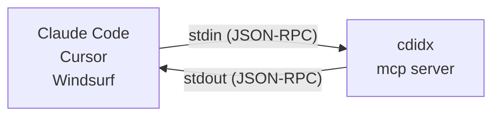

# cdidx

> **[日本語版はこちら / Japanese version](#cdidx日本語)**

[](https://github.com/Widthdom/CodeIndex/actions/workflows/dotnet.yml)
[](https://github.com/Widthdom/CodeIndex/actions/workflows/codeql.yml)
[](https://github.com/Widthdom/CodeIndex/actions/workflows/release.yml)


**The AI-native local code index that cuts token waste in terminal and MCP workflows.**

`cdidx` indexes a repository once, then serves full-text, symbol, and dependency queries from a local SQLite FTS5 database. Instead of making an AI agent rescan the same tree on every turn, you can reuse the local index and hand the model smaller, structured payloads.

```bash
cdidx .                          # Index current directory
cdidx search "authenticate"      # Full-text search
cdidx definition UserService     # Find symbol definitions
cdidx find "guard" --path src/Auth.cs
cdidx deps --path src/           # File-level dependency graph
cdidx mcp                        # Start MCP server for AI tools
```

46 languages supported. 24 MCP tools. Incremental updates. Zero config.

- **Docs**: [DEVELOPER_GUIDE.md](DEVELOPER_GUIDE.md) for architecture, AI response details, and release workflow
- **AI dev contract**: [SELF_IMPROVEMENT.md](SELF_IMPROVEMENT.md)
- **Testing**: [TESTING_GUIDE.md](TESTING_GUIDE.md)

## Why cdidx

Most code search tools optimize for either desktop UI workflows or one-off text scanning in a shell. `cdidx` is built for a different loop: local repositories that need to be searched repeatedly by both humans and AI agents.

- `CLI-first` — designed for terminal workflows, scripts, and automation.
- `AI-native` — `--json` output and MCP structured results are built in, not bolted on.
- `Token-efficient` — compact snippets, `map`, `inspect`, and path filters reduce repeated scans and round-trips.
- `Local-first` — SQLite database lives with the project in `.cdidx/`.
- `Incremental` — refresh only changed files with `--files` or `--commits`.

It is not an IDE replacement or desktop search app. It is a small local search runtime you can script, automate, and hand to AI tools.

Use `rg` when you want a zero-setup one-off scan. Use `cdidx` when the same repository will be searched again and again.

## cdidx vs rg

| | `rg` | `cdidx` |
|---|---|---|
| Best at | One-off text scans | Repeated local code search |
| Setup | None | One-time index build |
| Search model | Reads files every time | Queries a local SQLite FTS5 index |
| Output for automation | Plain text | Human-readable, JSON, and MCP |
| AI integration | Needs parsing | Structured by design |
| Token cost in AI loops | Re-sends broad repo context repeatedly | Reuses the index and fetches short, scoped results |
| Updates after edits | Re-run search | Refresh only changed files |

## 30-Second Quick Start

```bash
# One-liner install (no .NET required)
curl -fsSL https://raw.githubusercontent.com/Widthdom/CodeIndex/main/install.sh | bash
cdidx .
cdidx search "handleRequest"
```

That is the whole loop:

1. `cdidx .` builds or refreshes `.cdidx/codeindex.db`
2. `cdidx search ...` returns results from the local index
3. after edits, refresh with `cdidx . --files path/to/file.cs` or `cdidx . --commits HEAD`

## Installation

### Option A: One-liner install (no .NET required)

Works in containers, CI, and any Linux/macOS environment — no .NET SDK needed.

```bash
curl -fsSL https://raw.githubusercontent.com/Widthdom/CodeIndex/main/install.sh | bash
```

Install a specific version (fetches the installer from that tag to avoid version skew):

```bash
curl -fsSL https://raw.githubusercontent.com/Widthdom/CodeIndex/v1.5.0/install.sh | bash -s -- v1.5.0
```

Supported platforms: `linux-x64`, `linux-arm64`, `osx-arm64` (glibc-based Linux only; Alpine/musl is not supported). Installs to `~/.local/bin` by default (override with `CDIDX_INSTALL_DIR`).

Note: the self-contained binaries installed by `install.sh` are currently built with `PublishTrimmed=true`. Their CLI `--json` mode is not available yet; commands fail fast with exit code `4` and a dedicated hint instead of emitting machine-readable JSON. Use `cdidx mcp`, omit `--json`, or use the NuGet/global-tool build if you need structured CLI output today.

**Dockerfile example:**

```dockerfile
# Install cdidx into /usr/local/bin so it's on PATH immediately
RUN export CDIDX_INSTALL_DIR=/usr/local/bin \
    && curl -fsSL https://raw.githubusercontent.com/Widthdom/CodeIndex/main/install.sh | bash
```

### Option B: NuGet Global Tool

Requires [.NET 8.0 SDK](https://dotnet.microsoft.com/download/dotnet/8.0).

```bash
dotnet tool install -g cdidx
```

That's it. `cdidx` is now available as a command.

#### Upgrade

If you already have cdidx installed, update to the latest version:

```bash
dotnet tool update -g cdidx
```

### Option C: Build from source

Requires [.NET 8.0 SDK](https://dotnet.microsoft.com/download/dotnet/8.0).

```bash
dotnet build src/CodeIndex/CodeIndex.csproj -c Release
dotnet publish src/CodeIndex/CodeIndex.csproj -c Release -o ./publish
```

Then add the binary to your PATH:

**Linux:**

```bash
sudo cp ./publish/cdidx /usr/local/bin/cdidx
```

**macOS:**

```bash
sudo cp ./publish/cdidx /usr/local/bin/cdidx
```

If `/usr/local/bin` is not in your PATH (Apple Silicon default shell):

```bash
echo 'export PATH="/usr/local/bin:$PATH"' >> ~/.zprofile
source ~/.zprofile
```

**Windows:**

```powershell
# PowerShell (run as Administrator)
New-Item -ItemType Directory -Force -Path C:\Tools
Copy-Item .\publish\cdidx.exe C:\Tools\cdidx.exe

# Add to PATH permanently (current user)
$path = [Environment]::GetEnvironmentVariable('Path', 'User')
if ($path -notlike '*C:\Tools*') {
    [Environment]::SetEnvironmentVariable('Path', "$path;C:\Tools", 'User')
}
```

Restart your terminal after adding to PATH.

### Verify

```bash
cdidx --version
```

## Quick Start

### Index a project

```bash
cdidx ./myproject
cdidx ./myproject --rebuild     # full rebuild from scratch
cdidx ./myproject --verbose     # show per-file details
```

By default, `cdidx index` stores the database in `<projectPath>/.cdidx/codeindex.db`, even if you run the command from another directory.

Default output:

```
⠹ Scanning...
  Found 42 files

Indexing...
  ████████████████████░░░░░░░░░░░░  67.0%  [28/42]

Done.

  Files   : 42
  Chunks  : 318
  Symbols : 156
  Skipped : 28 (unchanged)
  Graph   : ready
  Issues  : ready
  Fold    : ready
  Elapsed : 00:00:02
```

Machine-readable output also reports the post-run readiness bits directly:

```bash
cdidx ./myproject --json
```

```json
{"status":"success","mode":"incremental","summary":{"files_total":42,"chunks_total":318,"symbols_total":156,"references_total":420,"files_scanned":42,"files_skipped":28,"files_purged":0,"errors":0},"graph_table_available":true,"issues_table_available":true,"fold_ready":true,"elapsed_ms":2012}
```

With `--verbose`, each file also shows a status tag so you can see exactly what happened:

```
  [OK  ] src/app.cs (12 chunks, 5 symbols)
  [SKIP] src/utils.cs
  [DEL ] src/old.cs
  [ERR ] src/bad.cs: <message>
```

> `[OK  ]` = indexed successfully, `[SKIP]` = unchanged / skipped, `[DEL ]` = deleted from DB (file removed from disk), `[ERR ]` = failed (verbose mode includes stack trace)

This is useful for debugging indexing issues or verifying which files were actually processed.

If you only need to upgrade an older `.cdidx/codeindex.db` to Unicode-aware `--exact`, you do not need a full rebuild:

```bash
cdidx backfill-fold
```

This recomputes `name_folded` / `*_folded` columns from the existing DB rows and stamps `fold_ready` without reparsing source files. The target must already be an existing CodeIndex DB; blank or missing paths are rejected instead of creating a new database.

### Search code

```bash
cdidx search "authenticate"              # full-text search
cdidx search "handleRequest" --lang go   # filter by language
cdidx search "TODO" --limit 50           # more results
cdidx search "auth*" --fts               # raw FTS5 syntax (prefix search)
cdidx search "Run();" --exact-substring  # case-sensitive exact substring, no FTS5
```

Output:

```
src/Auth/Login.cs:15-30
  public bool Authenticate(string user, string pass)
  {
      var hash = ComputeHash(pass);
      return _store.Verify(user, hash);
  ...

src/Auth/TokenService.cs:42-58
  public string GenerateToken(User user)
  {
      var claims = BuildClaims(user);
      return _jwt.CreateToken(claims);
  ...

(2 results)
```

Human-readable search output is centered around the first matching line when possible, instead of always showing the start of the chunk.

Use `--json` for machine-readable output (AI agents):

```json
{"path":"src/Auth/Login.cs","start_line":15,"end_line":30,"content":"public bool Authenticate(...)...","lang":"csharp","score":12.5}
{"path":"src/Auth/TokenService.cs","lang":"csharp","chunk_start_line":1,"chunk_end_line":80,"snippet_start_line":40,"snippet_end_line":47,"snippet":"if (claims.Count == 0)\\n    throw new InvalidOperationException();\\nreturn GenerateToken(claims);","match_lines":[42,47],"highlights":[{"line":47,"text":"return GenerateToken(claims);","terms":["GenerateToken"]}],"context_before":2,"context_after":3,"score":9.8}
```

### Search symbols (functions, classes, etc.)

```bash
cdidx symbols UserService              # find by name
cdidx symbols UserService OrderService AuthService   # multi-name OR (positional)
cdidx symbols --name UserService --name OrderService # multi-name OR (--name)
cdidx symbols Run --exact-name         # exact name match (no `RunAsync` / `RunImpact` expansion)
cdidx symbols --kind class             # all classes
cdidx symbols --kind function --lang python
```

Use `--exact-name` when you already have a precise candidate list (e.g. names returned from an earlier `search` / `inspect` / `map` call). Names are compared case-insensitively for equality instead of substring, so `Run` will not also pull in `RunAsync`, `RunImpact`, etc. `--exact-name` composes with `--name`, positional names, and all existing filters. The older `--exact` spelling still works on these commands for backward compatibility, but `--exact-name` avoids the semantic clash with `search`. The fold is NFKC + Unicode CaseFold: common non-ASCII pairs such as `Ä` / `ä`, fullwidth `Ｒｕｎ` / `Run`, ligatures, sharp-S (`Straße` / `STRASSE`), and Greek final sigma (`Σ` / `ς` / `σ`) now collapse correctly. Unicode CaseFold remains locale-invariant, so Turkish dotted `İ` still folds to `i\u0307` rather than plain `i`. DBs with stale fold metadata fall back to ASCII `COLLATE NOCASE` until the DB contains only current folded keys. Prefer `cdidx backfill-fold` to refresh stored folded keys without reparsing. A plain `cdidx index .` is also enough if the scan rewrites or purges every stale row; otherwise use `cdidx index . --rebuild`. Use `status --json` → `fold_ready` to detect which path is active.

Output:

```
class      UserService                              src/Services/UserService.cs:8-72
function   GetUserById                              src/Services/UserService.cs:24-41
function   CreateUser                               src/Services/UserService.cs:45-61
(3 symbols)
```

With `--json`, symbol results also include definition ranges, optional body ranges, signature text, container symbol, visibility, and return type when the language extractor can infer them:

```json
{"path":"src/Services/UserService.cs","lang":"csharp","kind":"function","name":"GetUserById","line":24,"start_line":24,"end_line":41,"body_start_line":26,"body_end_line":41,"signature":"public async Task<User> GetUserById(int id)","container_kind":"class","container_name":"UserService","visibility":"public","return_type":"Task<User>"}
```

`search`, `definition`, `references`, `callers`, `callees`, `symbols`, `files`, and `find` also share repeatable `--path <pattern>` (multiple values are OR'd together), repeatable `--exclude-path <pattern>`, and `--exclude-tests` filters. Search results prefer source files over tests and docs, and `search` boosts files whose symbol names or paths match the query exactly.

`search --json` and MCP `search` return compact match-centered snippets instead of whole chunks. Each result includes `chunk_start_line`, `chunk_end_line`, `snippet_start_line`, `snippet_end_line`, `snippet`, `match_lines`, `highlights`, `context_before`, and `context_after`. Use `--snippet-lines <n>` to shrink or widen the excerpt window (default: 8, max: 20).

### Resolve a definition

```bash
cdidx definition ResolveGitCommonDir
cdidx definition ResolveGitCommonDir --path src/CodeIndex/Cli --exclude-tests
cdidx definition ResolveGitCommonDir --body --json
```

`definition` uses indexed symbol ranges plus chunk reconstruction to return the actual declaration text, and optional body content when the language extractor can infer a body range.

### Inspect one symbol in one round-trip

```bash
cdidx inspect ResolveGitCommonDir --exclude-tests
cdidx inspect ResolveGitCommonDir --exclude-tests --json
```

`inspect` bundles the primary definition, nearby symbols from the same file, references, callers, callees, file metadata, workspace freshness metadata, and call-graph support metadata so AI clients can answer many symbol-oriented questions without chaining several separate commands. When a language is unsupported for `references` / `callers` / `callees`, `inspect --json` now says so explicitly instead of leaving AI clients to infer that from empty arrays.

### Find references, callers, and callees

```bash
cdidx references ResolveGitCommonDir --exclude-tests
cdidx callers ResolveGitCommonDir --exclude-tests --json
cdidx callees AddToGitExclude --exclude-tests
```

These commands use the indexed reference graph and are intended for languages where cdidx already extracts named symbols and call-like references: Python, JavaScript/TypeScript, C#, Go, Rust, Java, Kotlin, Ruby, C/C++, PHP, Swift, Dart, Scala, Elixir, Lua, and VB.NET (18 languages). F# uses space-separated call syntax so graph queries are not supported; use `search` instead. For docs, config, markup, or other unsupported languages, fall back to `search`.

When you pass `--lang` for an unsupported language, human-readable graph commands now say so explicitly, and MCP graph tools expose `graph_language`, `graph_supported`, and `graph_support_reason` alongside the empty result list.

### Outline a single file

```bash
cdidx outline src/CodeIndex/Cli/GitHelper.cs
cdidx outline src/CodeIndex/Cli/GitHelper.cs --json
```

Shows all symbols in a single file ordered by line, with kind, signature, visibility, and container nesting. Lets AI agents understand file structure in one call instead of reading the whole file or chaining `symbols` + `definition`.

### Reconstruct a file excerpt

```bash
cdidx excerpt src/CodeIndex/Cli/GitHelper.cs --start 19 --end 28
cdidx excerpt src/CodeIndex/Cli/GitHelper.cs --start 19 --end 28 --before 3 --after 3 --json
```

### Find a substring inside a known file

```bash
cdidx find "graph table" --path src/CodeIndex/Cli/QueryCommandRunner.cs
cdidx find "Graph Table" --path src/CodeIndex/Cli/QueryCommandRunner.cs --exact --before 1 --after 1 --json
```

`find` fills the gap between repo-wide `search` and line-number-based `excerpt`: when you already know the target file, it returns matching line numbers, columns, and short surrounding context from the indexed file without falling back to raw-text tools.

### List files

```bash
cdidx files                            # all indexed files
cdidx files --lang csharp              # only C# files
cdidx files --path src/Services --exclude-path Migrations
```

Output:

```
csharp          120 lines  src/Services/UserService.cs
csharp           85 lines  src/Controllers/UserController.cs
csharp           42 lines  src/Models/User.cs
(3 files)
```

### Check status

```bash
cdidx status
```

Output:

```
Files   : 42
Chunks  : 318
Symbols : 156
Refs    : 912
Languages:
  csharp         28
  python         10
  javascript      4
```

### Map the repo before searching

```bash
cdidx map --path src/ --exclude-tests
cdidx map --path src/ --exclude-tests --json
```

`map` is the fastest way to orient both a human and an AI agent before deeper queries. Use it to get languages, modules, hot files, and likely entrypoints, then narrow with `inspect`, `search`, or `definition`. For the full freshness and metadata contract of `status --json`, `map --json`, `inspect --json`, and MCP `analyze_symbol`, see [DEVELOPER_GUIDE.md](DEVELOPER_GUIDE.md).

## Options

| Option | Applies to | Description |
|---|---|---|
| `--db <path>` | All commands except `languages`; for `mcp`, only `--db` is supported | Database file path. `index` defaults to `<projectPath>/.cdidx/codeindex.db`; query commands default to `.cdidx/codeindex.db` in the current directory. Query commands without `--db` keep trusting that default `.cdidx/codeindex.db` sibling path, so moving or renaming the current repo does not leave stale workspace metadata behind. For explicit query DBs, workspace metadata such as `project_root`, `git_head`, and `git_is_dirty` comes from the persisted `indexed_project_root` stored in that DB when available. Legacy explicit DBs created before that metadata existed may return those fields as `null` / absent until you rerun `cdidx index <projectPath> --db <path>` or a scoped update that actually commits at least one file delete/update against the intended project, even if the explicit path itself looks like `.../.cdidx/codeindex.db`. |
| `--json` | All commands except `mcp` | JSON output (for AI/machine use) |
| `--dry-run` | `index` | Scan files and report what would change without writing to the database |
| `--limit <n>` | Query commands | Max results (default: 20; `map` uses it per section) |
| `--lang <lang>` | Query commands | Filter by language |
| `--path <pattern>` | `search`, `definition`, `references`, `callers`, `callees`, `symbols`, `files`, `find`, `map`, `inspect`, `validate` | Restrict results to paths containing this text. Repeatable; multiple values are OR'd together |
| `--exclude-path <pattern>` | `search`, `definition`, `references`, `callers`, `callees`, `symbols`, `files`, `find`, `map`, `inspect` | Exclude paths containing this text (repeatable) |
| `--exclude-tests` | `search`, `definition`, `references`, `callers`, `callees`, `symbols`, `files`, `find`, `map`, `inspect` | Exclude likely test files and prefer production code |
| `--snippet-lines <n>` | `search` | Search snippet length for human-readable output and JSON/MCP snippets (default: 8, max: 20) |
| `--max-line-width <n>` | `references`, `find`, `excerpt`, `inspect` | Clamp very long single-line reference/snippet/excerpt payloads around the relevant match (default: 512, max: 4096) |
| `--fts` | `search` | Use raw FTS5 query syntax instead of literal-safe quoting |
| `--exact` | `search`, `find`, `symbols`, `definition`, `references`, `callers`, `callees`, `inspect` | Backward-compatible shorthand. Prefer `--exact-substring` for `search`, keep `--exact` for `find`, and prefer `--exact-name` for symbol / graph commands plus `inspect`. CLI JSON and MCP `structuredContent` expose `exact_index_available` / `degraded_reason`; MCP also keeps the legacy camelCase aliases `exactIndexAvailable` / `degradedReason` for backward compatibility. |
| `--exact-substring` | `search` | Preferred explicit name for search exactness: case-sensitive exact substring (FTS5 bypassed). |
| `--exact-name` | `symbols`, `definition`, `references`, `callers`, `callees`, `inspect` | Preferred explicit name for symbol-name exactness: NFKC + Unicode CaseFold exact equality (`Ä` / `ä`, `Ｒｕｎ` / `Run`, ligatures, sharp-S, and Greek final sigma collapse). Unicode CaseFold remains locale-invariant, so Turkish dotted `İ` is still distinct from plain `i`. Falls back to ASCII `COLLATE NOCASE` while the DB still contains stale fold metadata; prefer `cdidx backfill-fold`, or use a plain `cdidx index .` if it rewrites or purges every stale row, otherwise `--rebuild`. `status --json` exposes `fold_ready` so AI clients can tell which path is active. When a read-only legacy DB is missing the fallback exact-match indexes, human-readable output warns and CLI JSON / MCP `structuredContent` expose degraded-state metadata. |
| `--kind <kind>` | `definition`, `references`, `callers`, `callees`, `symbols`, `hotspots`, `unused`, `validate` | Filter by symbol kind (function/class/struct/interface/enum/property/event/delegate/namespace/import; `validate` uses issue kinds such as `bom`) |
| `--body` | `definition`, `inspect` | Include reconstructed body content when the language extractor can infer the body range |
| `--count` | `search`, `definition`, `references`, `callers`, `callees`, `symbols`, `files`, `find`, `impact`, `unused`, `hotspots` | Return only the result count (with `--json`: a single count object; commands that expose file counts add `files`) |
| `--start <line>` | `excerpt` | Start line for excerpt reconstruction |
| `--end <line>` | `excerpt` | End line for excerpt reconstruction (defaults to `--start`) |
| `--before <n>` | `excerpt`, `find` | Include extra context lines before the requested excerpt or match |
| `--after <n>` | `excerpt`, `find` | Include extra context lines after the requested excerpt or match |
| `--focus-line <line>` | `excerpt` | Line inside the requested excerpt whose focused column should stay visible when `--max-line-width` clamps long single-line content; requires `--focus-column` |
| `--focus-column <n>` | `excerpt` | Column inside the focused line to keep centered when `--max-line-width` clamps long single-line content; must be within that line's length |
| `--focus-length <n>` | `excerpt` | Width of the focused span when `--max-line-width` clamps long single-line content (default: 1; requires `--focus-column`) |
| `--rebuild` | `index` | Delete existing DB and rebuild |
| `--verbose` | `index` | Show per-file status (`[OK  ]`/`[SKIP]`/`[DEL ]`/`[ERR ]`) |
| `--commits <id...>` | `index` | Update only files changed in specified commits. Prefer this after a normal commit because git history includes rename/delete paths. |
| `--files <path...>` | `index` | Update only the specified files. Safe for known in-place edits or new files; old rename/delete paths are not purged unless you also list them explicitly. |
| `--since <datetime>` | `search`, `definition`, `symbols`, `files` | Filter to files modified since this ISO 8601 timestamp |
| `--no-dedup` | `search` | Disable overlapping-chunk deduplication for raw results |
| `--reverse` | `deps` | Reverse lookup: show files that depend ON the matched path |
| `--top <n>` | Query commands | Alias for `--limit` |

If a string value itself begins with `--`, pass it as `--opt=<value>` rather than a separated value. For example, use `--path=--json-dir` or `--db=--tmp.db`.

### Exit codes

| Code | Meaning |
|---|---|
| `0` | Success |
| `1` | Usage error (invalid arguments) |
| `2` | Not found (no search results, missing directory) |
| `3` | Database error |
| `4` | Feature unavailable on this build (for example CLI `--json` on the trimmed self-contained release) |

### Debugging reader errors

If a query fails with a SQLite reader error such as `The data is NULL at ordinal N`, set `CDIDX_DEBUG=1` and rerun. The failing SQL, bound parameters, and the last-read row's columns will be printed to stderr so the offending record can be located. No-op when unset.

Text values (chunk `content`, `context`, paths, signatures, string parameters) are **redacted by default** — only the length and a short SHA256 prefix are emitted, so diagnostics can be pasted into issues without leaking indexed source code. Numeric columns, column names, NULL markers, and SQL text are shown as-is. To include raw text content in a local troubleshooting session, set `CDIDX_DEBUG=unsafe` instead (never paste this output publicly).

```bash
CDIDX_DEBUG=1 cdidx unused            # redacted text / テキスト伏字化
CDIDX_DEBUG=unsafe cdidx unused       # raw content, local only / 生テキスト、ローカルのみ
```

## How it works

cdidx scans your project directory, splits each source file into overlapping chunks, and stores everything in a SQLite database with FTS5 full-text search. Incremental mode (default) first purges database entries for files that no longer exist on disk, then checks each file's last-modified timestamp against the database — only files whose timestamp exactly matches are skipped, and any difference (newer or older) triggers re-indexing. Newly appeared files are indexed as new entries. This means re-indexing after a branch switch only processes the files that actually differ.

## Git integration

`cdidx index` automatically adds `.cdidx/` to `.git/info/exclude`. You don't need to edit `.gitignore`.

`.git/info/exclude` is a standard Git mechanism that works just like `.gitignore`. Many tools use `.git/info/exclude` or store data inside `.git/` to avoid polluting `.gitignore` — git-lfs, git-secret, git-crypt, git-annex, Husky, pre-commit, JetBrains IDEs, VS Code (GitLens), Eclipse, etc.

## Git branch switching

The database reflects the working tree at the time of the last index. After switching branches, simply re-run `cdidx .` — files that no longer exist on disk are purged from the database, newly appeared files are indexed, and existing files are re-indexed only when their timestamp differs. The update is proportional to the number of changed files, not the total project size.

| Situation | What happens |
|---|---|
| File unchanged across branches | Skipped (instant) |
| File content changed | Re-indexed |
| File deleted after checkout | Purged from DB |
| File added after checkout | Indexed as new |

## Supported languages

| Language | Extensions | Symbols |
|---|---|:---:|
| Python | `.py` | yes |
| JavaScript | `.js`, `.jsx` | yes |
| TypeScript | `.ts`, `.tsx` | yes |
| C# | `.cs` | yes |
| Go | `.go` | yes |
| Rust | `.rs` | yes |
| Java | `.java` | yes |
| Kotlin | `.kt` | yes |
| Ruby | `.rb` | yes |
| C | `.c`, `.h` | yes |
| C++ | `.cpp`, `.cc`, `.cxx`, `.hpp`, `.hxx` | yes |
| PHP | `.php` | yes |
| Swift | `.swift` | yes |
| Dart | `.dart` | yes |
| Scala | `.scala`, `.sc` | yes |
| Elixir | `.ex`, `.exs` | yes |
| Lua | `.lua` | yes |
| R | `.r`, `.R` | yes |
| Haskell | `.hs`, `.lhs` | yes |
| F# | `.fs`, `.fsx`, `.fsi` | yes |
| VB.NET | `.vb`, `.vbs` | yes |
| Razor/Blazor | `.cshtml`, `.razor` | yes (as C#) |
| Protobuf | `.proto` | yes |
| GraphQL | `.graphql`, `.gql` | yes |
| Gradle | `.gradle` | yes |
| Makefile | `Makefile` | yes |
| Dockerfile | `Dockerfile` | yes |
| Zig | `.zig` | yes |
| XAML | `.xaml`, `.axaml` | -- |
| MSBuild | `.csproj`, `.fsproj`, `.vbproj`, `.props`, `.targets` | -- |
| Shell | `.sh`, `.bash`, `.zsh`, `.fish` | -- |
| PowerShell | `.ps1` | yes |
| Batch | `.bat`, `.cmd` | -- |
| CMake | `.cmake`, `CMakeLists.txt` | -- |
| SQL | `.sql` | -- |
| Markdown | `.md` | -- |
| YAML | `.yaml`, `.yml` | -- |
| JSON | `.json` | -- |
| TOML | `.toml` | -- |
| HTML | `.html` | -- |
| CSS | `.css`, `.scss` | yes |
| Vue | `.vue` | -- |
| Svelte | `.svelte` | -- |
| Terraform | `.tf` | -- |

All languages are fully searchable via FTS5. Languages with **Symbols = yes** also support structured queries by function/class/import name.

## Prerequisites: sqlite3

AI agents that query the database directly via SQL need the `sqlite3` CLI.

| OS | Status |
|---|---|
| **macOS** | Pre-installed |
| **Linux** | Usually pre-installed. If not: `sudo apt install sqlite3` |
| **Windows** | `winget install SQLite.SQLite` or `scoop install sqlite` |

## AI Integration

cdidx helps AI tools by replacing repeated repo-wide scans with a reusable local index.

- `search --json` and MCP `search` return compact match-centered snippets instead of large file dumps, and `--snippet-lines` lets you cap payload size up front.
- `map`, `inspect`, `definition`, `deps`, and `impact` reduce multi-step repository exploration into fewer round-trips.
- `--path`, repeatable `--exclude-path`, and `--exclude-tests` keep results focused before you spend tokens on excerpts or follow-up prompts.
- `status --json`, `map --json`, and `inspect --json` expose freshness and git-state signals so an agent can decide whether the index is trustworthy.
- `unused --json` and MCP `unused_symbols` expose bucketed dead-code triage metadata plus graph-support signals, so machine clients can distinguish likely-private cleanup from public/config/reflection suspects and from unsupported-language empty pages.
- `cdidx mcp` gives Claude Code, Cursor, Windsurf, Copilot, and Codex a native MCP server instead of forcing them to scrape shell text.

For the full MCP tool list, JSON field contracts, exact-match metadata, and fallback behavior on legacy databases, see [DEVELOPER_GUIDE.md](DEVELOPER_GUIDE.md).

### Setup: Add to CLAUDE.md

To let AI agents use the generated index, place a `CLAUDE.md` in your project root (the template below is for **downstream projects** that adopt cdidx — contributors working on the cdidx repo itself should follow [CLAUDE.md](CLAUDE.md) in this repo, which routes execution through the locally built `dotnet ./src/CodeIndex/bin/Debug/net8.0/cdidx.dll` instead of a bare `cdidx` command):

````markdown
# Code Search Rules

This project uses **cdidx** for fast code search via a pre-built SQLite index (`.cdidx/codeindex.db`).
**Query this database** instead of using `find`, `grep`, or `ls -R`.

## Setup

First check if `cdidx` is available:

```bash
cdidx --version
```

**If not found**, install it:

```bash
# No .NET required — downloads a self-contained binary
curl -fsSL https://raw.githubusercontent.com/Widthdom/CodeIndex/main/install.sh | bash
```

Or, if .NET 8+ SDK is available:

```bash
dotnet tool install -g cdidx
```

**If already installed**, update to the latest version:

```bash
# Re-run the installer to upgrade
curl -fsSL https://raw.githubusercontent.com/Widthdom/CodeIndex/main/install.sh | bash
```

If install fails (no network, unsupported platform), skip to the **"Direct SQL queries"** section below — you can query `.cdidx/codeindex.db` directly with `sqlite3`, provided the database was already built. If neither `cdidx` nor `sqlite3` is available, use the Claude Code built-in `Grep` / `Glob` tools (or your harness's equivalent) — do not fall back to shell `rg` / `grep` / `find` or a global `cdidx` in a Claude Code session, since those may be blocked by a repo-tracked deny list and bypassing them can hide stale-binary bugs.

Before searching, update the index so results are accurate:

```bash
cdidx .   # incremental update (skips unchanged files)
```

## Keeping the index up to date (requires cdidx)

After editing files, update the database so search results stay accurate:

```bash
cdidx . --files path/to/changed_file.cs   # update specific files you modified
cdidx . --commits HEAD                     # update all files changed in the last commit
cdidx . --commits abc123                   # you can also pass a specific commit hash
cdidx .                                    # full incremental update (skips unchanged files)
```

**Rule: whenever you modify source files, run one of the above before your next search.**
If the checkout changed because of `git reset`, `git rebase`, `git commit --amend`, `git switch`, or `git merge`, prefer `cdidx .` so stale files are purged against the current worktree instead of only refreshing commit-local paths.

## Query strategy

- Start with `map` when you need a quick overview of languages, modules, and likely hot spots before issuing symbol or text queries.
- Check `status --json` when freshness matters. Use `indexed_at`, `latest_modified`, `git_head`, and `git_is_dirty` to decide whether you need to re-run `cdidx .` before trusting results. If you already started with `map --json`, treat `indexed_at` / `latest_modified` there as filter-scoped freshness and `workspace_indexed_at` / `workspace_latest_modified` as the whole-workspace view. For explicit `--db` queries, remember that `project_root` / `git_*` depend on the DB's persisted `indexed_project_root`; a legacy explicit DB may legitimately return those fields as `null` / absent until you rerun indexing against the intended project, or run a scoped update that actually commits a file delete/update, even if the explicit path itself looks like `.../.cdidx/codeindex.db`.
- Use `inspect` when you already have a candidate symbol name and want bundled definition/caller/callee/reference context in one round-trip. Add `--exact` to match leaf-command precision — `exact` is propagated into every bundled sub-query so `inspect Run --exact` will not drag in `RunAsync` / `RunImpact`. `inspect --json` also carries `workspace_indexed_at`, `workspace_latest_modified`, `project_root`, `git_head`, and `git_is_dirty` for trust decisions, but for legacy explicit DBs those workspace fields can stay `null` / absent until you rerun indexing against the intended project, or a scoped update actually rewrites/deletes at least one indexed file.
- Use `definition` when you need the declaration text for a named symbol, and add `--body` when the implementation body matters.
- Use `references`, `callers`, and `callees` for symbol-aware call graph questions in Python, JavaScript/TypeScript, C#, Go, Rust, Java, Kotlin, Ruby, C/C++, PHP, Swift, Dart, Scala, Elixir, Lua, and VB.NET (18 languages). F# uses space-separated call syntax so graph queries are not supported; use `search` instead. Add `--exact` when you already have a precise name (e.g. resolved from `symbols --exact` / `inspect`) so `references Run` no longer pulls in `RunAsync` / `RunImpact` / etc. — same for `callers` / `callees` / `definition`.
- Use `impact` for pre-edit ripple checks on callable symbols. When the query resolves, within the active `--lang` / `--path` / `--exclude-path` / `--exclude-tests` scope and graph-supported languages only, to a single class / struct / interface definition and no symbol-level callers exist, `impact` / MCP `impact_analysis` may return heuristic file-level dependency hints instead of a silent false negative; same-name non-callable siblings such as `namespace` or `import` definitions do not block that fallback, and pure non-callable queries return `non_callable_symbol_kind` guidance instead of an unexplained zero. To reduce noise, those hints are emitted only for files that both reference one of the target type's member names and also carry same-file structured type evidence in indexed symbol metadata such as signatures or return types, rather than raw comment/string text matches. That evidence path is Unicode-aware, so fullwidth/accented identifiers follow the same exact-match semantics as the rest of the impact resolver. The hints are still not authoritative because the current graph does not record the resolved target file/type for each call, but they are returned as normal successful output: `count` / `file_count` describe the visible returned set, while `confirmed_count` / `confirmed_file_count` stay at the symbol-level caller totals so clients can inspect `impact_mode`, `heuristic`, `hint_count`, and `truncated`. `impact --json --count` uses the same `*_count` field names as the full payload. When the scoped query resolves to multiple class-like definitions (for example partial classes or same-name definitions sharing one file), the zero-result payload explains that and suggests `deps --path <definition-path> --reverse` or a more specific member query.
- Use `symbols` for named code entities in symbol-aware languages (32 languages including Python, JavaScript/TypeScript, C#, Go, Rust, Java, Kotlin, Ruby, C/C++, PHP, Swift, Dart, Scala, F#, VB.NET, Elixir, Lua, R, Haskell, Shell, SQL, Terraform, Protobuf, GraphQL, Gradle, Makefile, Dockerfile, Zig, PowerShell, CSS/SCSS). Add `--exact` when you already have a precise candidate list (e.g. names from a prior `inspect` / `map` / `search` result) so `Run` no longer expands to `RunAsync` / `RunImpact` — pairs cleanly with repeated `--name`.
- Use `outline` to see the full symbol structure of a single file without reading its content.
- Use `search` for raw text, comments, strings, or languages without structured symbol extraction such as XAML, Markdown, YAML, JSON, TOML, HTML, Vue, Svelte.
- Add `--exclude-tests` unless you are explicitly investigating tests.
- Add `--path <text>` and repeatable `--exclude-path <text>` before broad searches so results stay inside the relevant module.
- Add `--snippet-lines <n>` to `search` when you need tighter JSON output before handing results to another model or tool.
- Use `files` to discover candidate paths, `find` to re-locate exact text inside known files, then `excerpt` to fetch only the needed lines instead of opening entire files.
- Use `deps` to understand file-level dependencies — which files reference symbols from other files. Add `--reverse` to find what depends on a given file (impact analysis).
- Use `unused` to find potentially dead code — symbols defined but never referenced (only meaningful for graph-supported languages). Results are bucketed so private/file-local candidates stay earlier than public/exported or config/reflection suspects, and returned pages use bounded overfetch plus cross-bucket diversification before `--limit` is applied so one noisy bucket is less likely to hide the rest without silently capping large `--limit` requests. The suspect bucket is reserved for public/exported properties that look config-bound or, for C#, have nearby serializer/ORM-style attributes. Unsupported `--lang` filters now return an empty page with `graph_supported=false` instead of fake unused hits. CLI JSON uses per-symbol `unused_bucket` / `unused_confidence` / `unused_reason`, MCP uses `unusedBucket` / `unusedConfidence` / `unusedReason`, and both include page-scoped `returned_bucket_counts`. Zero-result JSON pages keep the same schema (`count`, empty `symbols`, empty page counts, and graph trust metadata) instead of going silent, and `unused --json` returns that payload with exit code `0` so machine clients can consume it as a normal empty page. When `--lang` is specified, CLI JSON also includes `graph_supported` / `graph_support_reason` so AI clients can tell whether the language actually has indexed call-graph support.
- Use `hotspots` to find the most-referenced symbols — central, high-impact code that changes may affect widely.
- Use `files --since <datetime>` or `search --since <datetime>` to focus on recently modified code.
- Use `--dry-run` with `index` to preview what would be indexed without writing to the database.
- Use `--count` to get result counts before fetching full data (saves tokens for AI agents).
- If you encounter a bug, unexpected behavior, or think of a feature that would improve cdidx, file an issue at https://github.com/Widthdom/CodeIndex/issues describing what happened and the expected behavior.

## CLI (recommended if cdidx is available)

```bash
cdidx map --path src/ --exclude-tests --json
cdidx inspect "Authenticate" --exclude-tests
cdidx search "keyword" --path src/ --exclude-tests --snippet-lines 6
cdidx definition "ClassName" --path src/Services --body
cdidx callers "Authenticate" --lang csharp --exclude-tests
cdidx callees "HandleRequest" --path src/ --exclude-tests
cdidx symbols "ClassName" --lang csharp --exclude-tests
cdidx find "guard" --path src/app.py --after 2
cdidx excerpt src/app.py --start 10 --end 20
cdidx files --lang python --path src/
cdidx status --json
```

## Direct SQL queries (fallback if cdidx is unavailable)

The queries below require `sqlite3`. If it is not installed, suggest the user install it:
- **macOS**: pre-installed
- **Linux**: `sudo apt install sqlite3`
- **Windows**: `winget install SQLite.SQLite` or `scoop install sqlite`

### Full-text search
```sql
SELECT f.path, c.start_line, c.content
FROM fts_chunks fc
JOIN chunks c ON c.id = fc.rowid
JOIN files f ON f.id = c.file_id
WHERE fts_chunks MATCH 'keyword'
LIMIT 20;
```

### Search by function/class name
```sql
SELECT f.path, s.name, s.line
FROM symbols s
JOIN files f ON f.id = s.file_id
WHERE s.kind = 'function' AND s.name LIKE '%keyword%';
```

### Incremental updates for CI / hooks

Instead of re-indexing the entire project, AI agents can update only the files that changed:

```bash
# Update only files changed in specific commits
# Prefer this after a normal commit because git history also carries rename/delete paths
cdidx ./myproject --commits abc123 def456

# Update only specific files after known in-place edits or new-file additions
# Old rename/delete paths are not purged unless you also list them explicitly
cdidx ./myproject --files src/app.cs src/utils.cs
```

Prefer `--commits` for commit-driven automation. Use `--files` for editor/save hooks that only touch existing paths or add new files. After `git reset`, `git rebase`, `git commit --amend`, `git switch`, or `git merge`, prefer a full `cdidx ./myproject --json` refresh so repo-wide stale paths are purged against the current checkout.

These options make it practical to keep the index up-to-date in real time, even on large codebases, without pretending that every delta workflow purges stale paths equally.
````

### MCP Server (for Claude Code, Cursor, Windsurf, etc.)

cdidx includes a built-in **MCP (Model Context Protocol) server**. MCP is a standard protocol that lets AI coding tools communicate with external programs. When you run `cdidx mcp`, cdidx starts listening on stdin/stdout — your AI tool sends search requests as JSON, and cdidx returns results instantly from the pre-built index.

Tool results include structured JSON in `structuredContent` plus a short text summary in `content`, so AI tools can parse typed data without scraping large text blocks.



**Setup — add to your AI tool's config:**

Claude Code (`.claude/settings.json` or `.mcp.json`):

```json
{
  "mcpServers": {
    "cdidx": {
      "command": "cdidx",
      "args": ["mcp", "--db", ".cdidx/codeindex.db"]
    }
  }
}
```

Cursor (`.cursor/mcp.json`):

```json
{
  "mcpServers": {
    "cdidx": {
      "command": "cdidx",
      "args": ["mcp", "--db", ".cdidx/codeindex.db"]
    }
  }
}
```

Windsurf (`.windsurf/mcp.json`):

```json
{
  "mcpServers": {
    "cdidx": {
      "command": "cdidx",
      "args": ["mcp", "--db", ".cdidx/codeindex.db"]
    }
  }
}
```

GitHub Copilot (VS Code — `.vscode/mcp.json`):

```json
{
  "servers": {
    "cdidx": {
      "type": "stdio",
      "command": "cdidx",
      "args": ["mcp", "--db", ".cdidx/codeindex.db"]
    }
  }
}
```

OpenAI Codex CLI (`codex.json` or `~/.codex/config.json`):

```json
{
  "mcpServers": {
    "cdidx": {
      "command": "cdidx",
      "args": ["mcp", "--db", ".cdidx/codeindex.db"]
    }
  }
}
```

Once configured, the AI can directly call these tools:

| Tool | Description |
|---|---|
| `search` | Full-text search across code chunks |
| `definition` | Reconstruct a symbol declaration and optional body |
| `references` | Find indexed references for supported languages |
| `callers` | List callers for a named symbol in supported languages |
| `callees` | List callees for a named symbol in supported languages |
| `symbols` | Find functions, classes, interfaces, imports, and namespaces by name |
| `files` | List indexed files |
| `find_in_file` | Find literal substring matches inside known indexed files with line/column context |
| `excerpt` | Reconstruct a specific line range from indexed chunks |
| `map` | Summarize languages, modules, hotspots, and likely entrypoints |
| `analyze_symbol` | Bundle definition, nearby symbols, references, callers, callees, file metadata, workspace trust metadata, and graph support metadata |
| `outline` | Show all symbols in a single file with line numbers, signatures, and nesting |
| `status` | Database statistics |
| `deps` | File-level dependency edges from the reference graph |
| `impact_analysis` | Compute transitive callers of a symbol, with single-type fallback to heuristic file-level dependency hints and partial-definition hints |
| `unused_symbols` | Find symbols defined but never referenced, with confidence buckets for dead-code triage |
| `symbol_hotspots` | Find most-referenced symbols (high-impact code) |
| `batch_query` | Execute multiple queries in a single call (MCP only, max 10) |
| `validate` | Report encoding issues (U+FFFD, BOM, null bytes, mixed line endings) |
| `languages` | List all supported languages, file extensions, and capabilities |
| `ping` | Lightweight connection check |
| `index` | Index or re-index a project directory |
| `backfill_fold` | Upgrade folded-name keys in an existing DB without reparsing source files |
| `suggest_improvement` | Submit structured improvement suggestions or error reports |

No CLAUDE.md hacks or SQL templates needed — the AI interacts with cdidx natively.

If you only need to upgrade an older `.cdidx/codeindex.db` for Unicode `--exact`, or to repair fold metadata drift by regenerating folded keys without reparsing source files, run:

```bash
cdidx backfill-fold
```

This recomputes persisted `name_folded` / `*_folded` columns from existing DB rows and stamps `fold_ready` when verification succeeds. The target must already be an existing CodeIndex DB; blank or missing paths are rejected instead of creating a new database.

Graph-oriented MCP tools such as `references`, `callers`, and `callees` also return `graph_language`, `graph_supported`, and `graph_support_reason` when a language filter is provided, so clients can distinguish unsupported languages from genuine zero-hit queries.

All MCP tools include `annotations` (`readOnlyHint`, `destructiveHint`, `idempotentHint`, `openWorldHint`) so AI clients can auto-approve safe read-only queries without prompting the user.

### Why cdidx over grep/ripgrep for AI workflows?

| | `grep` / `rg` | `cdidx` |
|---|---|---|
| Output format | Plain text (needs parsing) | Structured JSON (`search`/`symbols`-style hits stream as JSON lines; summaries/counts and degraded zero-result graph responses use one object) |
| Search speed on large repos | Scans every file each time | Pre-built FTS5 index |
| Symbol awareness | None | Functions, classes, imports |
| Token footprint across repeated turns | Broad raw context | Short indexed snippets |
| Incremental update | N/A | `--commits`, `--files` |

### AI Feedback

cdidx includes a `suggest_improvement` MCP tool for AI agents that hit gaps or bugs. Suggestions are saved locally to `.cdidx/suggestions.json`, and are sent to GitHub only when the user explicitly provides `CDIDX_GITHUB_TOKEN`. Payload details and source-code leak guardrails are documented in the [Developer Guide](DEVELOPER_GUIDE.md#ai-feedback-implementation).

## Releasing a new version

> **Maintainers / forkers only** — the full release procedure now lives in [DEVELOPER_GUIDE.md#release-workflow](DEVELOPER_GUIDE.md#release-workflow). [MAINTAINERS.md](MAINTAINERS.md) is the maintainer index.

The short version: `version.json` is the single source of truth, and the maintainer checklist covers branch/PR triage, changelog promotion, tagging, and clean-install verification.

## More

- [Developer Guide](DEVELOPER_GUIDE.md) — Architecture, database schema, AI response contracts, release workflow, design decisions
- [Testing Guide](TESTING_GUIDE.md) — Test suite layout, helper utilities, cross-platform rules, and test maintenance conventions
- [Self-Improvement Loop](SELF_IMPROVEMENT.md) — Ready-to-use operating contract for iterative AI-driven cdidx improvements

---

<a id="cdidx日本語"></a>
# cdidx（日本語）


**ターミナルとMCPワークフローでAIのトークン浪費を減らす、AIネイティブなローカルコードインデックス。**

`cdidx` は、リポジトリを一度インデックスし、その後の全文検索・シンボル検索・依存関係検索をローカルの SQLite FTS5 DB から返します。AI エージェントに毎ターン同じツリーを読み直させる代わりに、小さく構造化された結果だけを渡せます。

```bash
cdidx .                          # カレントディレクトリをインデックス
cdidx search "authenticate"      # 全文検索
cdidx definition UserService     # シンボル定義を検索
cdidx find "guard" --path src/Auth.cs
cdidx deps --path src/           # ファイル間依存グラフ
cdidx mcp                        # AIツール向けMCPサーバー起動
```

46言語対応。24 MCPツール。インクリメンタル更新。設定不要。

- **ドキュメント**: [DEVELOPER_GUIDE.md](DEVELOPER_GUIDE.md) アーキテクチャ、AI応答の詳細、リリース手順
- **AI開発規約**: [SELF_IMPROVEMENT.md](SELF_IMPROVEMENT.md)
- **テストガイド**: [TESTING_GUIDE.md](TESTING_GUIDE.md)

## なぜ cdidx なのか

多くのコード検索ツールは、デスクトップUI中心のワークフローか、シェルでの単発テキスト検索のどちらかに最適化されています。`cdidx` が狙っているのは別のループです。ローカルリポジトリを、人間とAIの両方が何度も検索する前提で設計しています。

- `ターミナル中心` — ターミナル、スクリプト、自動化向けに設計。
- `AIネイティブ` — `--json` 出力と MCP の構造化結果を標準搭載。
- `省トークン` — コンパクトなスニペット、`map`、`inspect`、パス絞り込みで再走査と往復回数を減らす。
- `ローカル完結` — SQLite DB はプロジェクト内の `.cdidx/` に配置。
- `差分更新` — `--files` と `--commits` で変更分だけ更新。

IDEの置き換えやデスクトップ検索アプリではありません。スクリプト可能で、自動化できて、AIツールにそのまま渡せる小さなローカル検索ランタイムです。

単発で文字列を掘りたいなら `rg`、同じリポジトリを人間とAIの両方が何度も検索するなら `cdidx` が向いています。

## rg との違い

| | `rg` | `cdidx` |
|---|---|---|
| 得意な用途 | 単発のテキスト走査 | 繰り返し行うローカルコード検索 |
| 初期セットアップ | 不要 | 最初に一度インデックス作成 |
| 検索モデル | 毎回ファイルを読む | ローカルの SQLite FTS5 インデックスを検索 |
| 自動化向け出力 | プレーンテキスト | 人間向け出力、JSON、MCP |
| AI連携 | パースが必要 | 構造化前提 |
| AIループでのトークン消費 | 広い文脈を何度も送り直す | インデックスを再利用し、必要な結果だけ取る |
| 編集後の更新 | 再検索するだけ | 変更ファイルだけ更新できる |

## 30秒で試す

```bash
# .NET 不要のワンライナーインストール
curl -fsSL https://raw.githubusercontent.com/Widthdom/CodeIndex/main/install.sh | bash
cdidx .
cdidx search "handleRequest"
```

やることはこれだけです:

1. `cdidx .` で `.cdidx/codeindex.db` を作成または更新
2. `cdidx search ...` でローカルインデックスを検索
3. 編集後は `cdidx . --files path/to/file.cs` や `cdidx . --commits HEAD` で差分更新

## インストール

### 方法A: ワンライナーインストール（.NET 不要）

コンテナ、CI、Linux/macOS 環境で .NET SDK なしで使えます。

```bash
curl -fsSL https://raw.githubusercontent.com/Widthdom/CodeIndex/main/install.sh | bash
```

特定バージョンをインストール（バージョンスキューを防ぐため、そのタグからインストーラーを取得）:

```bash
curl -fsSL https://raw.githubusercontent.com/Widthdom/CodeIndex/v1.5.0/install.sh | bash -s -- v1.5.0
```

対応プラットフォーム: `linux-x64`, `linux-arm64`, `osx-arm64`（glibc ベースの Linux のみ。Alpine/musl は非対応）。デフォルトで `~/.local/bin` にインストール（`CDIDX_INSTALL_DIR` で変更可）。

注意: `install.sh` で入る自己完結バイナリは現状 `PublishTrimmed=true` でビルドされています。この配布物では CLI の `--json` はまだ使えず、機械可読 JSON の代わりに終了コード `4` と専用ヒントで即時失敗します。構造化出力が必要な場合は `cdidx mcp` を使うか、`--json` を外すか、NuGet グローバルツール版を使ってください。

**Dockerfile の例:**

```dockerfile
# /usr/local/bin にインストールして PATH に即反映
RUN export CDIDX_INSTALL_DIR=/usr/local/bin \
    && curl -fsSL https://raw.githubusercontent.com/Widthdom/CodeIndex/main/install.sh | bash
```

### 方法B: NuGet グローバルツール

[.NET 8.0 SDK](https://dotnet.microsoft.com/download/dotnet/8.0) が必要です。

```bash
dotnet tool install -g cdidx
```

これだけです。`cdidx` コマンドがすぐ使えます。

#### アップグレード

すでにインストール済みの場合、最新版に更新できます:

```bash
dotnet tool update -g cdidx
```

### 方法C: ソースからビルド

[.NET 8.0 SDK](https://dotnet.microsoft.com/download/dotnet/8.0) が必要です。

```bash
dotnet build src/CodeIndex/CodeIndex.csproj -c Release
dotnet publish src/CodeIndex/CodeIndex.csproj -c Release -o ./publish
```

ビルド後、バイナリをPATHに追加します:

**Linux:**

```bash
sudo cp ./publish/cdidx /usr/local/bin/cdidx
```

**macOS:**

```bash
sudo cp ./publish/cdidx /usr/local/bin/cdidx
```

`/usr/local/bin` がPATHに含まれていない場合（Apple Siliconのデフォルトシェル）:

```bash
echo 'export PATH="/usr/local/bin:$PATH"' >> ~/.zprofile
source ~/.zprofile
```

**Windows:**

```powershell
# PowerShell（管理者として実行）
New-Item -ItemType Directory -Force -Path C:\Tools
Copy-Item .\publish\cdidx.exe C:\Tools\cdidx.exe

# PATHに永続的に追加（現在のユーザー）
$path = [Environment]::GetEnvironmentVariable('Path', 'User')
if ($path -notlike '*C:\Tools*') {
    [Environment]::SetEnvironmentVariable('Path', "$path;C:\Tools", 'User')
}
```

PATH追加後はターミナルを再起動してください。

### 確認

```bash
cdidx --version
```

## クイックスタート

### プロジェクトをインデックス

```bash
cdidx ./myproject
cdidx ./myproject --rebuild     # 完全再構築
cdidx ./myproject --verbose     # ファイルごとの詳細表示
```

`cdidx index` は、別ディレクトリから実行しても、デフォルトでは `<projectPath>/.cdidx/codeindex.db` にDBを保存します。

デフォルト出力:

```
⠹ Scanning...
  Found 42 files

Indexing...
  ████████████████████░░░░░░░░░░░░  67.0%  [28/42]

Done.

  Files   : 42
  Chunks  : 318
  Symbols : 156
  Skipped : 28 (unchanged)
  Graph   : ready
  Issues  : ready
  Fold    : ready
  Elapsed : 00:00:02
```

機械向けの `--json` 出力でも、実行後の readiness bit がそのまま返ります:

```bash
cdidx ./myproject --json
```

```json
{"status":"success","mode":"incremental","summary":{"files_total":42,"chunks_total":318,"symbols_total":156,"references_total":420,"files_scanned":42,"files_skipped":28,"files_purged":0,"errors":0},"graph_table_available":true,"issues_table_available":true,"fold_ready":true,"elapsed_ms":2012}
```

`--verbose` を付けると、各ファイルにステータスタグも表示され、何が起きたか一目でわかります:

```
  [OK  ] src/app.cs (12 chunks, 5 symbols)
  [SKIP] src/utils.cs
  [DEL ] src/old.cs
  [ERR ] src/bad.cs: <message>
```

> `[OK  ]` = インデックス成功、`[SKIP]` = 未変更・スキップ、`[DEL ]` = DBから削除（ディスク上のファイルが消えた）、`[ERR ]` = 失敗（verboseではスタックトレースも表示）

インデックスの問題をデバッグしたり、どのファイルが実際に処理されたかを確認するのに便利です。

古い `.cdidx/codeindex.db` を Unicode-aware な `--exact` に上げたいだけなら、フル rebuild は不要です:

```bash
cdidx backfill-fold
```

これは既存 DB 行から `name_folded` / `*_folded` 列を再計算し、ソース再解析なしで `fold_ready` を stamp します。対象は既存の CodeIndex DB に限られ、空のDBや存在しないパスを指定しても新規作成せず拒否します。

### コード検索

```bash
cdidx search "authenticate"              # 全文検索
cdidx search "handleRequest" --lang go   # 言語でフィルタ
cdidx search "TODO" --limit 50           # 結果数を増やす
cdidx search "auth*" --fts               # 生のFTS5構文（前方一致検索）
cdidx search "Run();" --exact-substring  # 大文字小文字区別の完全部分一致、FTS5 なし
```

出力:

```
src/Auth/Login.cs:15-30
  public bool Authenticate(string user, string pass)
  {
      var hash = ComputeHash(pass);
      return _store.Verify(user, hash);
  ...

src/Auth/TokenService.cs:42-58
  public string GenerateToken(User user)
  {
      var claims = BuildClaims(user);
      return _jwt.CreateToken(claims);
  ...

(2 results)
```

人間向けの検索出力は、可能な限り最初の一致行を中心にスニペットを表示し、常にチャンク先頭だけを出すことはありません。

`--json` でAI/機械向け出力:

```json
{"path":"src/Auth/Login.cs","start_line":15,"end_line":30,"content":"public bool Authenticate(...)...","lang":"csharp","score":12.5}
{"path":"src/Auth/TokenService.cs","start_line":42,"end_line":58,"content":"public string GenerateToken(...)...","lang":"csharp","score":9.8}
```

### シンボル検索（関数、クラスなど）

```bash
cdidx symbols UserService              # 名前で検索
cdidx symbols UserService OrderService AuthService   # 複数名を OR 結合（positional）
cdidx symbols --name UserService --name OrderService # 複数名を OR 結合（--name）
cdidx symbols Run --exact-name         # 名前の完全一致（`RunAsync` / `RunImpact` に広がらない）
cdidx symbols --kind class             # すべてのクラス
cdidx symbols --kind function --lang python
```

`--exact-name` は、すでに解決済みの候補リスト（例: `search` / `inspect` / `map` の結果）を渡して正確にその行だけ取り返したいときに使う。部分一致ではなく大文字小文字を無視した完全一致で比較するため、`Run` を指定しても `RunAsync`、`RunImpact` 等には広がらない。`--exact-name` は `--name`、positional 名、他の全フィルタと組み合わせ可能。従来の `--exact` も後方互換で引き続き使えるが、`search` と意味がぶつからない `--exact-name` を推奨する。fold は NFKC 正規化 + Unicode CaseFold で、`Ä` / `ä`、全角 `Ｒｕｎ` / `Run`、合字、sharp-S（`Straße` / `STRASSE`）、Greek final sigma（`Σ` / `ς` / `σ`）などの非 ASCII 差分も正しく一致する。Unicode CaseFold は locale-invariant のため、トルコ語の dotted `İ` は依然 plain `i` ではなく `i\u0307` に fold される。stale な fold metadata を含む DB は、DB 内が current folded key のみになるまで ASCII `COLLATE NOCASE` に黙ってフォールバックする。stored folded key を再解析なしで更新したいなら `cdidx backfill-fold` を優先し、scan が stale row をすべて rewrite / purge できるなら通常の `cdidx index .` でも復帰できる。stale row が残る場合だけ `cdidx index . --rebuild` が必要。`status --json` の `fold_ready` で現在の経路を判定可能。

出力:

```
class      UserService                              src/Services/UserService.cs:8-72
function   GetUserById                              src/Services/UserService.cs:24-41
function   CreateUser                               src/Services/UserService.cs:45-61
(3 symbols)
```

`--json` を使うと、シンボル結果には定義範囲、判定できる場合の本体範囲、シグネチャ文字列、親シンボル、可視性、戻り値型も含まれます。

```json
{"path":"src/Services/UserService.cs","lang":"csharp","kind":"function","name":"GetUserById","line":24,"start_line":24,"end_line":41,"body_start_line":26,"body_end_line":41,"signature":"public async Task<User> GetUserById(int id)","container_kind":"class","container_name":"UserService","visibility":"public","return_type":"Task<User>"}
```

`search`、`definition`、`references`、`callers`、`callees`、`symbols`、`files` は共通で繰り返し指定できる `--path <pattern>`（複数値は OR で結合）、繰り返し指定できる `--exclude-path <pattern>`、`--exclude-tests` に対応しています。検索結果は tests や docs より source を優先し、`search` はシンボル名やパスがクエリと正確に一致するファイルを上に出します。

`search --json` と MCP の `search` は、チャンク全文ではなく一致中心の軽量スニペットを返します。各結果には `chunk_start_line`、`chunk_end_line`、`snippet_start_line`、`snippet_end_line`、`snippet`、`match_lines`、`highlights`、`context_before`、`context_after` が含まれます。抜粋の長さは `--snippet-lines <n>` で調整できます（デフォルト: 8、最大: 20）。

### 定義を引く

```bash
cdidx definition ResolveGitCommonDir
cdidx definition ResolveGitCommonDir --path src/CodeIndex/Cli --exclude-tests
cdidx definition ResolveGitCommonDir --body --json
```

`definition` は、インデックス済みシンボル範囲とチャンク再構成を使って実際の宣言テキストを返します。言語抽出器が本体範囲を推論できる場合は、`--body` で本体内容も返します。

### 1往復でシンボルを精査する

```bash
cdidx inspect ResolveGitCommonDir --exclude-tests
cdidx inspect ResolveGitCommonDir --exclude-tests --json
```

`inspect` は、主定義、同一ファイル内の近傍シンボル、参照、caller、callee、ファイルメタデータ、さらにワークスペース鮮度メタデータと call graph 対応メタデータをまとめて返すため、AIクライアントが複数コマンドを連鎖させずにシンボル調査を進められます。`references` / `callers` / `callees` が未対応言語で空になる場合も、`inspect --json` がその理由を明示します。

### 参照、callers、callees を調べる

```bash
cdidx references ResolveGitCommonDir --exclude-tests
cdidx callers ResolveGitCommonDir --exclude-tests --json
cdidx callees AddToGitExclude --exclude-tests
```

これらのコマンドはインデックス済み参照グラフを使います。対象は、cdidx が名前付きシンボルと call 相当の参照を抽出している言語、つまり Python、JavaScript/TypeScript、C#、Go、Rust、Java、Kotlin、Ruby、C/C++、PHP、Swift、Dart、Scala、Elixir、Lua、VB.NET です（18言語）。F# はスペース区切りの呼び出し構文のため graph クエリ非対応です。ドキュメント、設定ファイル、マークアップなどの未対応言語では `search` に戻してください。

未対応言語を `--lang` で指定した場合、人間向けの graph コマンドはその旨を明示し、MCP の graph ツールは空結果に加えて `graph_language`、`graph_supported`、`graph_support_reason` を返します。

### 1ファイルのアウトラインを見る

```bash
cdidx outline src/CodeIndex/Cli/GitHelper.cs
cdidx outline src/CodeIndex/Cli/GitHelper.cs --json
```

1ファイル内の全シンボルを行順に、種別・シグネチャ・可視性・コンテナネスト付きで表示します。ファイル全体を読んだり `symbols` + `definition` をチェーンしたりする代わりに、1回でファイル構造を把握できます。

### ファイル抜粋を再構成する

```bash
cdidx excerpt src/CodeIndex/Cli/GitHelper.cs --start 19 --end 28
cdidx excerpt src/CodeIndex/Cli/GitHelper.cs --start 19 --end 28 --before 3 --after 3 --json
```

### 既知ファイル内の部分文字列を探す

```bash
cdidx find "graph table" --path src/CodeIndex/Cli/QueryCommandRunner.cs
cdidx find "Graph Table" --path src/CodeIndex/Cli/QueryCommandRunner.cs --exact --before 1 --after 1 --json
```

`find` は、リポジトリ全体を対象にする `search` と、行番号が必要な `excerpt` の間を埋めるコマンドです。対象ファイルが既に分かっているときに、raw text ツールへ戻らずに、インデックス済みファイルから一致行番号・列番号・短い前後文脈を返します。

### ファイル一覧

```bash
cdidx files                            # 全インデックス済みファイル
cdidx files --lang csharp              # C#ファイルのみ
cdidx files --path src/Services --exclude-path Migrations
```

出力:

```
csharp          120 lines  src/Services/UserService.cs
csharp           85 lines  src/Controllers/UserController.cs
csharp           42 lines  src/Models/User.cs
(3 files)
```

### 状態確認

```bash
cdidx status
```

出力:

```
Files   : 42
Chunks  : 318
Symbols : 156
Refs    : 912
Languages:
  csharp         28
  python         10
  javascript      4
```

### 検索前にリポジトリ全体を俯瞰する

```bash
cdidx map --path src/ --exclude-tests
cdidx map --path src/ --exclude-tests --json
```

`map` は、人と AI のどちらにも最短で全体像を渡すための入口です。言語、モジュール、ホットなファイル、推定エントリポイントを把握したら、`inspect`、`search`、`definition` に進んでください。`status --json`、`map --json`、`inspect --json`、MCP `analyze_symbol` の詳細なメタデータ契約は [DEVELOPER_GUIDE.md](DEVELOPER_GUIDE.md) にまとめています。

## オプション一覧

| オプション | 対象 | 説明 |
|---|---|---|
| `--db <path>` | `languages` を除く全コマンド。`mcp` は `--db` のみ対応 | DBファイルパス。`index` のデフォルトは `<projectPath>/.cdidx/codeindex.db`、クエリ系コマンドのデフォルトはカレントディレクトリの `.cdidx/codeindex.db`。`--db` を付けない query は、その既定の `.cdidx/codeindex.db` sibling path を引き続き正とするため、カレント repo を move/rename しても古い workspace metadata を引きずらない。明示指定 query DB の `project_root`、`git_head`、`git_is_dirty` などの workspace metadata は、利用可能な場合はその DB に保存された `indexed_project_root` から解決される。保存前の古い explicit DB では、意図した project に対して `cdidx index <projectPath> --db <path>`、または少なくとも 1 件の file delete/update を実際に commit する scoped update を一度実行するまで、これらの項目が `null` / 未出力になることがあり、明示パス自体が `.../.cdidx/codeindex.db` でも同じ。 |
| `--json` | `mcp` を除く全コマンド | JSON出力（AI/機械向け） |
| `--dry-run` | `index` | DB に書き込まず、どの変更が発生するかだけを走査して報告 |
| `--limit <n>` | クエリ系 | 最大結果数（デフォルト: 20。`map` では各セクションごとの件数） |
| `--path <pattern>` | `search`, `definition`, `references`, `callers`, `callees`, `symbols`, `files`, `find`, `map`, `inspect`, `validate` | 指定文字列を含むパスに結果を絞る。繰り返し指定可（複数値は OR で結合） |
| `--exclude-path <pattern>` | `search`, `definition`, `references`, `callers`, `callees`, `symbols`, `files`, `find`, `map`, `inspect` | 指定文字列を含むパスを除外（繰り返し指定可） |
| `--exclude-tests` | `search`, `definition`, `references`, `callers`, `callees`, `symbols`, `files`, `find`, `map`, `inspect` | テストらしいパスを除外し、本番コードを優先 |
| `--snippet-lines <n>` | `search` | 人間向け出力と JSON/MCP スニペットの抜粋行数（デフォルト: 8、最大: 20） |
| `--max-line-width <n>` | `references`, `find`, `excerpt`, `inspect` | 極端に長い1行の参照文脈・スニペット・抜粋を、関連箇所の周辺だけに切り詰める（デフォルト: 512、最大: 4096） |
| `--fts` | `search` | リテラル安全な引用ではなく生のFTS5クエリ構文を使う |
| `--exact` | `search`, `find`, `symbols`, `definition`, `references`, `callers`, `callees`, `inspect` | 後方互換の短縮形。`search` では `--exact-substring`、`find` では `--exact` を使い、symbol / graph 系コマンドと `inspect` では `--exact-name` を推奨。CLI JSON と MCP `structuredContent` は `exact_index_available` / `degraded_reason` を返し、MCP では後方互換の camelCase alias も維持する。 |
| `--exact-substring` | `search` | `search` 用の推奨 explicit alias。大文字小文字を区別する完全部分一致（FTS5 バイパス）。 |
| `--exact-name` | `symbols`, `definition`, `references`, `callers`, `callees`, `inspect` | symbol-name exactness 用の推奨 explicit alias。NFKC + Unicode CaseFold による完全一致（`Ä` / `ä`、全角 `Ｒｕｎ` / `Run`、合字、sharp-S、Greek final sigma を畳み込む）。Unicode CaseFold は locale-invariant のため、トルコ語の dotted `İ` は plain `i` と同一視しない。DB に stale な fold metadata が残る間は ASCII `COLLATE NOCASE` に fallback するため、まず `cdidx backfill-fold`、または stale row を全置換できる通常の `cdidx index .`、それが無理なら `--rebuild` を使う（`status --json` の `fold_ready` で判定）。read-only な旧DBに fallback exact-match index が無い場合は、人間向け出力が WARN を表示し、CLI JSON と MCP `structuredContent` が縮退メタデータを返す。 |
| `--kind <kind>` | `definition`, `references`, `callers`, `callees`, `symbols`, `hotspots`, `unused`, `validate` | 種別でフィルタ（symbol 系は function/class/struct/interface/enum/property/event/delegate/namespace/import、`validate` は `bom` などの issue kind） |
| `--body` | `definition`, `inspect` | 言語抽出器が本体範囲を推論できる場合に本体内容も含める |
| `--count` | `search`, `definition`, `references`, `callers`, `callees`, `symbols`, `files`, `find`, `impact`, `unused`, `hotspots` | 結果のカウントだけを返す（`--json` 併用時は単一の count オブジェクト。files 件数を出すコマンドは `files` も返す） |
| `--start <line>` | `excerpt` | 抜粋再構成の開始行 |
| `--end <line>` | `excerpt` | 抜粋再構成の終了行（省略時は `--start` と同じ） |
| `--before <n>` | `excerpt`, `find` | 指定範囲または一致箇所の前に追加する文脈行数 |
| `--after <n>` | `excerpt`, `find` | 指定範囲または一致箇所の後に追加する文脈行数 |
| `--focus-line <line>` | `excerpt` | `--max-line-width` で長い1行を切り詰める際に、注目列を表示に残したい抜粋内の行。`--focus-column` 必須 |
| `--focus-column <n>` | `excerpt` | `--max-line-width` で長い1行を切り詰める際に、中央付近へ残したい列。対象行の長さ以内である必要があります |
| `--focus-length <n>` | `excerpt` | `--max-line-width` で長い1行を切り詰める際の注目範囲の幅（デフォルト: 1、`--focus-column` 必須） |
| `--rebuild` | `index` | 既存DBを削除して再構築 |
| `--verbose` | `index` | ファイルごとのステータス表示（`[OK  ]`/`[SKIP]`/`[DEL ]`/`[ERR ]`） |
| `--commits <id...>` | `index` | 指定コミットの変更ファイルのみ更新。通常のコミット後はこちらを推奨。rename/delete の旧パスも git 履歴から拾える。 |
| `--files <path...>` | `index` | 指定ファイルのみ更新。把握している in-place 編集や新規ファイル向け。rename/delete の旧パスは明示しない限り purge されない。 |
| `--since <datetime>` | `search`, `definition`, `symbols`, `files` | 指定タイムスタンプ以降に変更されたファイルのみ（ISO 8601） |
| `--no-dedup` | `search` | オーバーラップチャンク重複排除を無効化 |
| `--reverse` | `deps` | 逆引き: 指定パスに依存しているファイルを表示 |
| `--top <n>` | クエリ系 | `--limit` のエイリアス |

文字列の値自体が `--` で始まる場合は、分離形式ではなく `--opt=<value>` で渡してください。たとえば `--path=--json-dir` や `--db=--tmp.db` のように指定します。

### 終了コード

| コード | 意味 |
|---|---|
| `0` | 成功 |
| `1` | 引数エラー |
| `2` | 未検出（検索結果なし、ディレクトリ不在） |
| `3` | データベースエラー |
| `4` | この build では機能未提供（例: trim 済み自己完結リリース上の CLI `--json`） |

### reader エラーのデバッグ

`The data is NULL at ordinal N` のような SQLite reader エラーでクエリが失敗した場合は、`CDIDX_DEBUG=1` を設定して再実行してください。失敗した SQL、バインド済みパラメータ、直近に読み取った行のカラムが stderr に出力されます。未設定時は何もしません。

テキスト値（チャンクの `content`、`context`、パス、シグネチャ、文字列パラメータ）は**既定で伏字化**され、長さと SHA256 先頭のみを出力します。Issue に貼っても索引済みソースが漏れません。数値・カラム名・NULL マーカー・SQL 本文はそのまま出力されます。ローカルでの調査で生テキストが必要な場合は `CDIDX_DEBUG=unsafe` を指定してください（公開の場には貼らないこと）。

```bash
CDIDX_DEBUG=1 cdidx unused            # テキスト伏字化
CDIDX_DEBUG=unsafe cdidx unused       # 生テキスト、ローカルのみ
```

## 動作の仕組み

cdidxはプロジェクトディレクトリを走査し、各ソースファイルを重複を持つチャンクに分割し、FTS5全文検索付きのSQLiteデータベースに格納します。インクリメンタルモード（デフォルト）では各ファイルの最終更新タイムスタンプをDB内の値と比較し、完全一致するファイルのみスキップします。タイムスタンプが異なれば（新しくても古くても）再インデックスされるため、ブランチ切り替え後も正確にインデックスが更新されます。

## Git連携

`cdidx index` を実行すると、`.cdidx/` が自動で `.git/info/exclude` に追加されます。`.gitignore` を編集する必要はありません。

`.git/info/exclude` は `.gitignore` と同じ効果を持つ Git 標準の仕組みです。`.gitignore` を汚さないよう `.git/info/exclude` や `.git/` 配下を利用するツールは多数あります — git-lfs、git-secret、git-crypt、git-annex、Husky、pre-commit、JetBrains IDE、VS Code (GitLens)、Eclipse など。

## Gitブランチ切り替え

データベースはインデックス実行時のワーキングツリーを反映します。ブランチ切り替え後は `cdidx .` を再実行してください。ディスク上から消えたファイルはDBからパージされ、新たに現れたファイルはインデックスに追加され、既存ファイルはタイムスタンプが異なる場合のみ再インデックスされます。更新量はプロジェクト全体のサイズではなく変更ファイル数に比例します。

| 状況 | 動作 |
|---|---|
| ブランチ間でファイル未変更 | スキップ（即時） |
| ファイル内容が変更 | 再インデックス |
| checkout後にファイル削除 | DBからパージ |
| checkout後にファイル追加 | 新規インデックス |

## 対応言語

| 言語 | 拡張子 | シンボル |
|---|---|:---:|
| Python | `.py` | yes |
| JavaScript | `.js`, `.jsx` | yes |
| TypeScript | `.ts`, `.tsx` | yes |
| C# | `.cs` | yes |
| Go | `.go` | yes |
| Rust | `.rs` | yes |
| Java | `.java` | yes |
| Kotlin | `.kt` | yes |
| Ruby | `.rb` | yes |
| C | `.c`, `.h` | yes |
| C++ | `.cpp`, `.cc`, `.cxx`, `.hpp`, `.hxx` | yes |
| PHP | `.php` | yes |
| Swift | `.swift` | yes |
| Dart | `.dart` | yes |
| Scala | `.scala`, `.sc` | yes |
| Elixir | `.ex`, `.exs` | yes |
| Lua | `.lua` | yes |
| R | `.r`, `.R` | yes |
| Haskell | `.hs`, `.lhs` | yes |
| F# | `.fs`, `.fsx`, `.fsi` | yes |
| VB.NET | `.vb`, `.vbs` | yes |
| Razor/Blazor | `.cshtml`, `.razor` | yes (as C#) |
| Protobuf | `.proto` | yes |
| GraphQL | `.graphql`, `.gql` | yes |
| Gradle | `.gradle` | yes |
| Makefile | `Makefile` | yes |
| Dockerfile | `Dockerfile` | yes |
| Zig | `.zig` | yes |
| XAML | `.xaml`, `.axaml` | -- |
| MSBuild | `.csproj`, `.fsproj`, `.vbproj`, `.props`, `.targets` | -- |
| Shell | `.sh`, `.bash`, `.zsh`, `.fish` | -- |
| PowerShell | `.ps1` | yes |
| Batch | `.bat`, `.cmd` | -- |
| CMake | `.cmake`, `CMakeLists.txt` | -- |
| SQL | `.sql` | -- |
| Markdown | `.md` | -- |
| YAML | `.yaml`, `.yml` | -- |
| JSON | `.json` | -- |
| TOML | `.toml` | -- |
| HTML | `.html` | -- |
| CSS | `.css`, `.scss` | yes |
| Vue | `.vue` | -- |
| Svelte | `.svelte` | -- |
| Terraform | `.tf` | -- |

全言語がFTS5による全文検索に対応。**シンボル = yes** の言語は関数・クラス・インポート名での構造化検索にも対応しています。

## 前提条件: sqlite3

AIエージェントがDBを直接SQL検索する場合、`sqlite3` CLIが必要です。

| OS | 状況 |
|---|---|
| **macOS** | プリインストール済み |
| **Linux** | 通常プリインストール済み。未導入時: `sudo apt install sqlite3` |
| **Windows** | `winget install SQLite.SQLite` または `scoop install sqlite` |

## AIとの連携

cdidx が AI ワークフローで効く最大の理由は、毎ターン同じリポジトリを読み直さずに済むことです。

- `search --json` と MCP `search` は、大きなファイル断片ではなく一致中心のコンパクトなスニペットを返し、`--snippet-lines` でサイズも先に絞れます。
- `map`、`inspect`、`definition`、`deps`、`impact` を使うと、段階的な調査を少ない往復で進められます。
- `--path`、繰り返し指定できる `--exclude-path`、`--exclude-tests` により、抜粋取得前にノイズを減らせます。
- `status --json`、`map --json`、`inspect --json` は鮮度と Git 状態のシグナルを返すため、AI がインデックスを信用してよいか判断できます。
- `unused --json` と MCP `unused_symbols` は、bucket 化されたデッドコード候補と graph-support シグナルを返すため、private cleanup 候補と public/config/reflection suspect、未対応言語の空ページを機械的に区別できます。
- `cdidx mcp` を使えば、Claude Code、Cursor、Windsurf、Copilot、Codex からシェル出力を無理に解釈せずにネイティブ接続できます。

MCP ツール一覧、JSON フィールド契約、`--exact` まわりのメタデータ、旧 DB フォールバック時の挙動は [DEVELOPER_GUIDE.md](DEVELOPER_GUIDE.md) を参照してください。

### セットアップ: CLAUDE.mdに追加

AIエージェントにインデックスを活用させるには、プロジェクトルートに `CLAUDE.md` を配置してください（以下のテンプレートは **cdidx を導入する下流プロジェクト向け**です。cdidx 本体のリポジトリに貢献する場合は当 repo の [CLAUDE.md](CLAUDE.md) を参照してください。素の `cdidx` コマンドではなくローカルビルドの `dotnet ./src/CodeIndex/bin/Debug/net8.0/cdidx.dll` を経由する運用になっています）:

````markdown
# コードベース検索ルール

このプロジェクトは **cdidx** を使い、事前構築済みSQLiteインデックス（`.cdidx/codeindex.db`）で高速コード検索を行います。
コードを検索する際は `find`, `grep`, `ls -R` ではなく**このデータベースを検索**してください。

## セットアップ

まず `cdidx` が利用可能か確認してください:

```bash
cdidx --version
```

**見つからない場合**、インストールしてください:

```bash
# .NET 不要 — self-contained バイナリをダウンロード
curl -fsSL https://raw.githubusercontent.com/Widthdom/CodeIndex/main/install.sh | bash
```

または .NET 8+ SDK がある場合:

```bash
dotnet tool install -g cdidx
```

**すでにインストール済みの場合**、最新版に更新してください:

```bash
# インストーラーを再実行してアップグレード
curl -fsSL https://raw.githubusercontent.com/Widthdom/CodeIndex/main/install.sh | bash
```

インストールに失敗した場合（ネットワーク不通、未対応プラットフォーム等）は、データベースが構築済みであれば下記の **「直接SQLクエリ」** セクションで `sqlite3` から `.cdidx/codeindex.db` を直接検索できます。`cdidx` も `sqlite3` も利用できない場合は、Claude Code の組み込み `Grep` / `Glob` ツール（もしくは使用ハーネスの同等機能）を使ってください — Claude Code セッション内では shell の `rg` / `grep` / `find` やグローバル `cdidx` にフォールバックしないでください。これらはリポジトリ追跡の deny リストで塞がれている可能性があり、迂回すると古いバイナリ由来のバグを隠してしまうためです。

検索を始める前に、インデックスを最新化してください:

```bash
cdidx .   # インクリメンタル更新（未変更ファイルはスキップ）
```

## インデックスの最新化（cdidxが必要）

ファイルを編集したら、検索結果を正確に保つためにデータベースを更新してください:

```bash
cdidx . --files path/to/changed_file.cs   # 変更したファイルだけ更新
cdidx . --commits HEAD                     # 直前のコミットで変更されたファイルを更新
cdidx . --commits abc123                   # 特定のコミットハッシュも指定可能
cdidx .                                    # フルインクリメンタル更新（未変更ファイルはスキップ）
```

**ルール: ソースファイルを修正したら、次の検索の前に上記のいずれかを実行すること。**
`git reset`、`git rebase`、`git commit --amend`、`git switch`、`git merge` で checkout 自体が変わった後は、コミット単位の更新だけでなく stale file の掃除も必要になるため、`cdidx .` を優先してください。

## クエリ戦略

- まず全体像が欲しいときは `map` から始めて、言語、モジュール、主要ファイル、ホットスポットを把握する。
- 鮮度が重要な場合は `status --json` を先に見て、`indexed_at`、`latest_modified`、`git_head`、`git_is_dirty` を確認してから検索結果を信用するか判断する。すでに `map --json` を使っている場合は、その `indexed_at` / `latest_modified` は絞り込み結果に対する値、`workspace_indexed_at` / `workspace_latest_modified` はワークスペース全体に対する値として読む。explicit `--db` query の `project_root` / `git_*` は DB に保存済みの `indexed_project_root` に依存するため、古い explicit DB では intended project に対して indexing を再実行するか、実際に file delete/update を commit する scoped update を流すまで `null` / 未出力が正しい場合があり、明示パス自体が `.../.cdidx/codeindex.db` でも同じ。
- 候補シンボル名が決まっていて、定義・caller・callee・参照をまとめて欲しいときは `inspect` を使う。leaf コマンドと同じ precision にしたいときは `--exact` を付ける（bundle 内の全 sub-query に伝播するため、`inspect Run --exact` が `RunAsync` / `RunImpact` を巻き込むことはない）。`inspect --json` には `workspace_indexed_at`、`workspace_latest_modified`、`project_root`、`git_head`、`git_is_dirty` も含まれるため、信頼判断も同時に行えるが、legacy explicit DB では intended project に対して indexing を再実行するか、実際に file を更新/削除する scoped update が commit されるまでこれらの workspace 項目が `null` / 未出力になりうる。
- 名前付きシンボルの宣言を取りたいときは `definition` を使い、本体も必要なら `--body` を付ける。
- Python、JavaScript/TypeScript、C#、Go、Rust、Java、Kotlin、Ruby、C/C++、PHP、Swift、Dart、Scala の call graph 系調査では `references`、`callers`、`callees` を使う。名前がすでに確定している場合は `--exact` を付けると `Run` が `RunAsync` / `RunImpact` に広がらず、`definition` も同様に `--exact` をサポートする。
- 変更前の波及確認には `impact` を使う。active な `--lang` / `--path` / `--exclude-path` / `--exclude-tests` scope と graph-supported language の範囲で、query が単一の class / struct / interface 定義に解決され、symbol-level caller が無い場合は、`impact` / MCP `impact_analysis` が無言の 0 件ではなく heuristic な file-level dependency hint を返すことがある。同名の `namespace` や `import` など non-callable な sibling 定義はこの fallback を妨げず、pure import/namespace query は説明なしの 0 件ではなく `non_callable_symbol_kind` guidance を返す。ノイズを減らすため、hint は「対象型の member 名に一致する参照があり、かつ同じ file 内の indexed symbol metadata（signature や return type など）に対象型の構造化された痕跡がある」ファイルにだけ出し、コメントや文字列の生テキスト一致では昇格しない。この evidence 判定も Unicode-aware なので、全角やアクセント付き識別子でも exact-match と同じ意味論で扱う。ただし現行グラフは各 call の解決先 file/type を保持していないため、その hint は authoritative ではない。一方でこれらの hint も通常の成功出力として返るため、クライアント側では `impact_mode` / `heuristic` / `hint_count` / `truncated` を見て判定する。`count` / `file_count` は返した可視結果の件数を表し、`confirmed_count` / `confirmed_file_count` は symbol-level caller の確定件数を保持する。`impact --json --count` も full payload と同じ `*_count` フィールド名を使う。scoped query が partial class や同一ファイル内の同名 class など複数の class-like 定義に解決された場合は、0 件 payload にその旨と `deps --path <definition-path> --reverse` またはより具体的な member query を試すヒントが入る。
- Python、JavaScript/TypeScript、C#、Go、Rust、Java、Kotlin、Ruby、C/C++、PHP、Swift、Dart、Scala、F#、VB.NET、Elixir、Lua、R、Haskell、Zig、PowerShell、CSS/SCSS のようなシンボル抽出対応言語では、名前ベースの調査に `symbols` を使う。`inspect` / `map` / `search` 等で既に候補名が特定できている場合は `--exact` を付けると、`Run` が `RunAsync` / `RunImpact` に広がらず、渡した名前だけが返る（繰り返しの `--name` と併用可）。
- 1ファイルのシンボル構造をファイル内容を読まずに把握したいときは `outline` を使う。
- XAML、Markdown、YAML、JSON、TOML、HTML、Vue、Svelte のような構造化シンボル抽出が弱い言語や、コメント・文字列・生テキストを探す場合は `search` を使う。
- テストを明示的に調べるのでなければ、まず `--exclude-tests` を付ける。
- 広い検索を始める前に `--path <text>` と繰り返し指定できる `--exclude-path <text>` を使って対象モジュールに絞る。
- 別のモデルやツールへ渡す前提で検索JSONをさらに細くしたいときは、`search` に `--snippet-lines <n>` を付ける。
- 候補パスの把握には `files` を使い、既知ファイル内の再探索には `find`、必要行だけ読むときは `excerpt` を使ってファイル全体を開かない。
- `deps` でファイル間の依存関係を把握する。`--reverse` で指定ファイルに依存しているファイルを特定（影響分析）。
- `unused` で潜在的なデッドコードを検出する — 定義されているが一度も参照されていないシンボル（グラフ対応言語でのみ有効）。結果は bucket 化され、private/file-local な候補が public/exported や config/reflection suspect より前に維持される一方、返却ページは `--limit` 適用前に bounded overfetch と bucket 間の分散を行うため、ノイズの多い 1 bucket が他を隠しにくく、大きい `--limit` も暗黙に切り詰めない。suspect bucket は public/exported な property のうち、config バインドされていそうなもの、または C# で近傍に serializer/ORM 系 attribute があるもの向けに予約されている。未対応言語を `--lang` で指定した場合は偽の unused hit を返さず、`graph_supported=false` 付きの空ページを返す。CLI JSON ではシンボルごとに `unused_bucket` / `unused_confidence` / `unused_reason`、MCP では `unusedBucket` / `unusedConfidence` / `unusedReason` を返し、どちらも返却ページ単位の `returned_bucket_counts` を含む。ゼロ件でも JSON schema は同じで、`count`、空の `symbols`、空の page count、graph trust metadata を返し、`unused --json` はその payload を exit code `0` で返す。`--lang` 指定時の CLI JSON には `graph_supported` / `graph_support_reason` も入るため、その言語が本当に call graph 対応かを AI クライアントが判断できる。
- `hotspots` で最も参照されるシンボルを特定する — 変更が広範囲に影響する中心的なコード。
- `files --since <datetime>` や `search --since <datetime>` で最近変更されたコードに絞る。
- `index` の `--dry-run` でDBに書き込まずインデックス対象を事前確認。
- `--count` で結果数を先に確認し、全データ取得前にトークンを節約。
- cdidx のバグや予期しない動作を見つけた場合、または改善アイデアがある場合は、https://github.com/Widthdom/CodeIndex/issues に issue を作成し、発生した事象と期待する動作を記述してください。

## CLI（cdidxが利用可能な場合に推奨）

```bash
cdidx map --path src/ --exclude-tests --json
cdidx inspect "Authenticate" --exclude-tests
cdidx search "keyword" --path src/ --exclude-tests --snippet-lines 6
cdidx definition "ClassName" --path src/Services --body
cdidx callers "Authenticate" --lang csharp --exclude-tests
cdidx callees "HandleRequest" --path src/ --exclude-tests
cdidx symbols "ClassName" --lang csharp --exclude-tests
cdidx excerpt src/app.py --start 10 --end 20
cdidx files --lang python --path src/
cdidx status --json
```

## 直接SQLクエリ（cdidxが利用できない場合のフォールバック）

以下のクエリには `sqlite3` が必要です。未インストールの場合、ユーザーにインストールを提案してください:
- **macOS**: プリインストール済み
- **Linux**: `sudo apt install sqlite3`
- **Windows**: `winget install SQLite.SQLite` または `scoop install sqlite`

### 全文検索
```sql
SELECT f.path, c.start_line, c.content
FROM fts_chunks fc
JOIN chunks c ON c.id = fc.rowid
JOIN files f ON f.id = c.file_id
WHERE fts_chunks MATCH 'キーワード'
LIMIT 20;
```

### 関数・クラス名で検索
```sql
SELECT f.path, s.name, s.line
FROM symbols s
JOIN files f ON f.id = s.file_id
WHERE s.kind = 'function' AND s.name LIKE '%キーワード%';
```

### CI / フック向けインクリメンタル更新

プロジェクト全体を再インデックスする代わりに、変更のあったファイルだけを更新できます:

```bash
# 特定コミットの変更ファイルのみ更新
# 通常のコミット直後はこちらを優先。git 履歴に rename/delete path も含まれる
cdidx ./myproject --commits abc123 def456

# 特定ファイルのみ更新（in-place 編集や新規追加向け）
# rename/delete の旧 path は、明示しない限り purge されない
cdidx ./myproject --files src/app.cs src/utils.cs
```

コミット単位の自動化では `--commits` を優先してください。`--files` は既存 path の編集や新規ファイル追加だけを前提にした editor/save hook 向けです。`git reset`、`git rebase`、`git commit --amend`、`git switch`、`git merge` の後は、repo 全体の stale path を掃除するために `cdidx ./myproject --json` のフル更新を優先してください。

これらのオプションにより、大規模コードベースでもリアルタイムにインデックスを最新に保ちやすくなりますが、stale path を purge できる範囲は更新モードごとに異なります。
````

### MCP サーバー（Claude Code、Cursor、Windsurf 等に対応）

cdidxには**MCP（Model Context Protocol）サーバー**が組み込まれています。MCPは、AIコーディングツールが外部プログラムと通信するための標準プロトコルです。`cdidx mcp` を実行すると、cdidxがstdin/stdoutで待機し、AIツールからの検索リクエストをJSONで受け取り、構築済みインデックスから即座に結果を返します。

ツール結果は `structuredContent` に構造化JSON、`content` に短い要約テキストを返すため、AIツールは巨大なテキストをパースせずに型付きデータを扱えます。


**セットアップ — AIツールの設定ファイルに追加するだけ:**

Claude Code (`.claude/settings.json` または `.mcp.json`):

```json
{
  "mcpServers": {
    "cdidx": {
      "command": "cdidx",
      "args": ["mcp", "--db", ".cdidx/codeindex.db"]
    }
  }
}
```

Cursor (`.cursor/mcp.json`):

```json
{
  "mcpServers": {
    "cdidx": {
      "command": "cdidx",
      "args": ["mcp", "--db", ".cdidx/codeindex.db"]
    }
  }
}
```

Windsurf (`.windsurf/mcp.json`):

```json
{
  "mcpServers": {
    "cdidx": {
      "command": "cdidx",
      "args": ["mcp", "--db", ".cdidx/codeindex.db"]
    }
  }
}
```

GitHub Copilot (VS Code — `.vscode/mcp.json`):

```json
{
  "servers": {
    "cdidx": {
      "type": "stdio",
      "command": "cdidx",
      "args": ["mcp", "--db", ".cdidx/codeindex.db"]
    }
  }
}
```

OpenAI Codex CLI (`codex.json` または `~/.codex/config.json`):

```json
{
  "mcpServers": {
    "cdidx": {
      "command": "cdidx",
      "args": ["mcp", "--db", ".cdidx/codeindex.db"]
    }
  }
}
```

設定するだけで、AIが以下のツールを直接呼び出せます:

| ツール | 説明 |
|---|---|
| `search` | コードチャンクの全文検索 |
| `definition` | シンボルの宣言と必要なら本体を再構成して取得 |
| `references` | 対応言語でインデックス済み参照を検索 |
| `callers` | 対応言語で指定シンボルの caller を列挙 |
| `callees` | 対応言語で指定シンボルの callee を列挙 |
| `symbols` | 関数・クラス・インターフェース・import・namespace を名前で検索 |
| `files` | インデックス済みファイル一覧 |
| `find_in_file` | 既知のインデックス済みファイル内でリテラル部分文字列一致を行・列付きで検索 |
| `excerpt` | インデックス済みチャンクから特定行範囲を再構成 |
| `map` | 言語、モジュール、ホットスポット、推定エントリポイントを要約 |
| `analyze_symbol` | 定義、近傍シンボル、参照、caller、callee、ファイル情報、ワークスペース信頼メタデータ、graph 対応メタデータをまとめて返す |
| `outline` | 1ファイルの全シンボルを行番号・シグネチャ・ネスト構造付きで表示 |
| `status` | データベース統計情報 |
| `deps` | 参照グラフからファイル間依存エッジを表示 |
| `impact_analysis` | シンボルの推移的 caller を算出し、単一定義の型は heuristic な file-level dependency hint にフォールバックし、複数定義時はヒントも返す |
| `unused_symbols` | 定義されているが参照されていないシンボルを bucket 付きで検索（デッドコード検出向け） |
| `symbol_hotspots` | 最も参照されるシンボルを検索（影響の大きいコード） |
| `batch_query` | 複数クエリを1回で実行（MCP専用、最大10件） |
| `validate` | エンコーディング問題（U+FFFD、BOM、null バイト、改行混在）を報告 |
| `languages` | 対応言語一覧を拡張子・機能付きで表示 |
| `ping` | 軽量な接続確認 |
| `index` | プロジェクトのインデックス作成・更新 |
| `backfill_fold` | 既存 DB の folded-name key をソース再解析なしで更新 |
| `suggest_improvement` | 構造化された改善提案またはエラー報告を送信 |

CLAUDE.mdの設定やSQLテンプレートは不要 — AIがcdidxとネイティブに連携します。

古い `.cdidx/codeindex.db` を Unicode `--exact` 対応へ上げたいだけ、または fold metadata の drift を folded key 再生成だけで解消したいなら、ソース再解析なしで次を実行できます:

```bash
cdidx backfill-fold
```

これは既存 DB 行から `name_folded` / `*_folded` 列を再計算し、`fold_ready` を stamp する。対象は既存の CodeIndex DB に限られ、空のDBや存在しないパスを指定しても新規作成せず拒否する。

`references`、`callers`、`callees` などの graph 系 MCP ツールも、言語フィルタが指定されている場合は `graph_language`、`graph_supported`、`graph_support_reason` を返し、未対応言語と単なる 0 件ヒットを区別できるようにしています。

全 MCP ツールは `annotations`（`readOnlyHint`、`destructiveHint`、`idempotentHint`、`openWorldHint`）を含み、AIクライアントがユーザーへの確認なしに安全な読み取り専用クエリを自動承認できるようにしています。

### AIワークフローで grep/ripgrep より cdidx が優れる理由

| | `grep` / `rg` | `cdidx` |
|---|---|---|
| 出力形式 | プレーンテキスト（パース必要） | 構造化JSON（`search` / `symbols` 系のヒットは JSON ライン、summary/count と degraded な graph 0件は単一オブジェクト） |
| 大規模リポジトリでの検索速度 | 毎回全ファイルスキャン | 構築済みFTS5インデックス |
| シンボル認識 | なし | 関数、クラス、インポート |
| 繰り返し調査でのトークン量 | 生の広い文脈 | 短いインデックス済みスニペット |
| インクリメンタル更新 | N/A | `--commits`, `--files` |

### AIフィードバック

cdidx には、AI エージェントがギャップや不具合に気づいたときに使える `suggest_improvement` MCP ツールがあります。提案は `.cdidx/suggestions.json` にローカル保存され、`CDIDX_GITHUB_TOKEN` を明示設定した場合に限って GitHub へ送信されます。ペイロード詳細とソースコード漏えいガードは [DEVELOPER_GUIDE.md#ai-feedback-implementation](DEVELOPER_GUIDE.md#ai-feedback-implementation) にまとめています。

## 新バージョンのリリース

> **Maintainer・forker 向け** — 詳細なリリース手順は [DEVELOPER_GUIDE.md#release-workflow](DEVELOPER_GUIDE.md#release-workflow) にあります。[MAINTAINERS.md](MAINTAINERS.md) は maintainer 向け索引です。

要点だけ言うと、バージョンの真実は `version.json` に集約されており、メンテナ向けチェックリストには未マージ枝/PR のトリアージ、CHANGELOG 昇格、タグ付け、クリーンインストール検証まで含まれます。

## もっと詳しく

- [開発者ガイド](DEVELOPER_GUIDE.md) — アーキテクチャ、DBスキーマ、AI応答契約、リリース手順、設計判断
- [テストガイド](TESTING_GUIDE.md) — テストスイート構成、共有ヘルパー、クロスプラットフォーム注意点、保守ルール
- [自己改善ループ](SELF_IMPROVEMENT.md) — AIが cdidx 自身を継続改善するときの、そのまま使える運用契約
