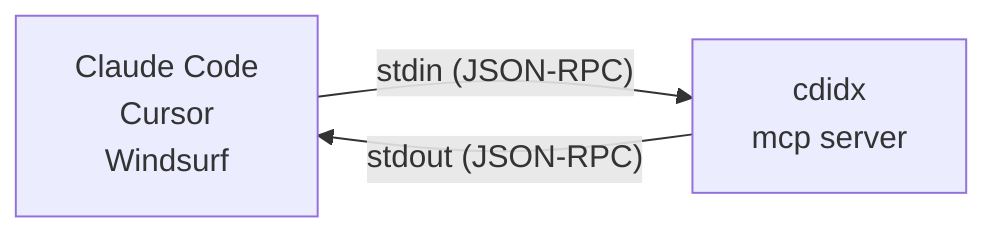

# cdidx User Guide

This is the detailed user documentation moved out of the concise
[README.md](README.md). It keeps the extended install notes, command examples,
AI/MCP setup, language list, and troubleshooting details.

> **[日本語版はこちら / Japanese version](#cdidx日本語)**

[](https://github.com/Widthdom/CodeIndex/actions/workflows/dotnet.yml)
[](https://github.com/Widthdom/CodeIndex/actions/workflows/codeql.yml)
[](https://github.com/Widthdom/CodeIndex/actions/workflows/release.yml)


**The AI-native local code index that cuts token waste in terminal and MCP workflows.**

`cdidx` indexes a repository once, then serves full-text, symbol, and dependency queries from a local SQLite FTS5 database. Instead of making an AI agent rescan the same tree on every turn, you can reuse the local index and hand the model smaller, structured payloads.

```bash
cdidx .                          # Index current directory
cdidx search "authenticate"      # Full-text search
cdidx definition UserService     # Find symbol definitions
cdidx find "guard" --path src/Auth.cs
cdidx deps --path src/           # File-level dependency graph
cdidx suggestions list           # Review local AI feedback history
cdidx mcp                        # Start MCP server for AI tools
```

78 languages supported. 24 MCP tools. Incremental updates. Zero config.

| Topic | Link |
|---|---|
| Docs | [DEVELOPER_GUIDE.md](DEVELOPER_GUIDE.md) for architecture, AI response details, and release workflow |
| AI dev contract | [SELF_IMPROVEMENT.md](SELF_IMPROVEMENT.md) |
| Testing | [TESTING_GUIDE.md](TESTING_GUIDE.md) |
| License | [FSL-1.1-ALv2](LICENSE); integration materials may be Apache-2.0 where marked |

## Why cdidx

Most code search tools optimize for either desktop UI workflows or one-off text scanning in a shell. `cdidx` is built for a different loop: local repositories that need to be searched repeatedly by both humans and AI agents.

- `CLI-first` — designed for terminal workflows, scripts, and automation.
- `AI-native` — `--json` output and MCP structured results are built in, not bolted on.
- `Token-efficient` — compact snippets, `map`, `inspect`, and path filters reduce repeated scans and round-trips.
- `Local-first` — SQLite database lives with the project in `.cdidx/`.
- `Incremental` — refresh only changed files with `--files` or `--commits`.

It is not an IDE replacement or desktop search app. It is a small local search runtime you can script, automate, and hand to AI tools.

Use `rg` when you want a zero-setup one-off scan. Use `cdidx` when the same repository will be searched again and again.

## License and Fair Source Use

CodeIndex and the official `cdidx` binaries are source-available under the
Functional Source License, Version 1.1, ALv2 Future License (`FSL-1.1-ALv2`),
unless a specific file or directory states another license.

In plain language:

- you may use CodeIndex for personal, commercial, internal, educational,
  research, and non-competing development work;
- you may use CodeIndex to search your own code and reduce AI token usage while
  building your products;
- AI agents, IDEs, editors, terminals, scripts, CI workflows, and MCP clients
  may invoke official CodeIndex releases through CLI, JSON output, or MCP;
- examples and integration materials are intended to be integration-friendly
  and may be Apache-2.0 where marked;
- you may not provide CodeIndex, a modified CodeIndex engine, or a derivative
  work of CodeIndex to third parties as a competing code indexing/search/
  retrieval product or service without a separate written agreement.

See:

- `LICENSE`
- `LICENSES/FSL-1.1-ALv2.txt`
- `LICENSES/Apache-2.0.txt`
- `COMMERCIAL_LICENSE.md`
- `INTEGRATION_POLICY.md`
- `TRADEMARKS.md`

CodeIndex is source-available / Fair Source-style software, not OSI-approved open source.

## cdidx vs rg

| | `rg` | `cdidx` |
|---|---|---|
| Best at | One-off text scans | Repeated local code search |
| Setup | None | One-time index build |
| Search model | Reads files every time | Queries a local SQLite FTS5 index |
| Output for automation | Plain text | Human-readable, JSON, and MCP |
| AI integration | Needs parsing | Structured by design |
| Token cost in AI loops | Re-sends broad repo context repeatedly | Reuses the index and fetches short, scoped results |
| Updates after edits | Re-run search | Refresh only changed files |

## cdidx vs VS Code workspace index

`cdidx` and VS Code's workspace index can complement each other, but they are optimized for different execution environments.

| | VS Code workspace index | `cdidx` |
|---|---|---|
| Primary environment | Inside VS Code + Copilot UX | Terminal, CI, scripts, and MCP clients |
| Ownership model | Editor-managed index lifecycle | User-managed local SQLite DB (`.cdidx/codeindex.db`) |
| Interface shape | Implicit editor context for chat/commands | Explicit CLI + MCP tools (`search`, `definition`, `references`, `deps`, `inspect`, etc.) |
| Automation and reproducibility | Strongest in interactive IDE sessions | Strongest in headless and repeatable workflows (agents, hooks, CI) |
| Editor dependency | Requires VS Code/Copilot context | Editor-agnostic (works with any editor, remote shell, or no editor) |
| Scope fit | "Make Copilot in VS Code smarter about this workspace" | "Provide a reusable local retrieval runtime for humans and AI agents" |

If your whole workflow lives in VS Code chat, the built-in workspace index may be enough.
If you need deterministic, scriptable retrieval outside an IDE (or across multiple AI tools), `cdidx` is the better boundary.

For implementation details (schema, indexing pipeline, MCP behavior), see [DEVELOPER_GUIDE.md](DEVELOPER_GUIDE.md).

## First Query Quick Start

```bash
# One-liner install (no .NET required; usually seconds)
curl -fsSL https://raw.githubusercontent.com/Widthdom/CodeIndex/main/install.sh | bash

# First index: ~30-60s on small repos; minutes or longer on 100k-file trees.
# Add --verbose to see each file status while it runs.
cdidx .
cdidx search "handleRequest"
```

That is the whole loop:

1. `cdidx .` builds or refreshes `.cdidx/codeindex.db`
2. `cdidx search ...` returns results from the local index
3. after edits, refresh with `cdidx . --files path/to/file.cs` or `cdidx . --commits HEAD`

During indexing, interactive terminals show `Scanning...`, `Indexing...`, and
a `67.0% [28/42]`-style progress line. If a large first index looks slow, rerun
with `cdidx . --verbose` to see `[OK  ]`, `[SKIP]`, `[DEL ]`, and `[ERR ]`
file statuses. Use incremental refreshes after the first run; see
[Options](#options) for `--files` and `--commits`.

## Keeping the index fresh

Install the optional git pre-commit hook when you want commits to refresh the
local index automatically:

```bash
cdidx hooks install
cdidx hooks status
cdidx hooks uninstall
```

The installed hook runs `cdidx index . --quiet` before the commit completes.
`--quiet` suppresses normal progress and success output for hook contexts while
still printing indexing errors to stderr and returning a non-zero exit code.
If a repository already has `.git/hooks/pre-commit`, `cdidx hooks install`
moves it to `.git/hooks/pre-commit.cdidx-chain` and calls it after the cdidx
refresh, preserving tools such as Husky, pre-commit, and lefthook. Use
`git commit --no-verify` when you intentionally need to skip all pre-commit
hooks.

For managed hook systems, add the same command as a step:

```yaml
# pre-commit / lefthook-style command
cdidx index . --quiet
```

A copyable standalone script is also available at
`samples/git-hooks/pre-commit`.

## CI integration

Use `cdidx status --check` when a script needs one command that verifies both
workspace freshness and readiness of query subsystems. On success, non-JSON
`--check` exits 0 and writes no stdout. On failure, it writes one diagnostic line
per failed check to stderr, such as `[stale] workspace_check ...` or
`[degraded] fold_ready=false ...`.

Exit codes for `status --check` are command-specific:

| Exit | Meaning |
|---|---|
| 0 | ok |
| 1 | stale workspace/index |
| 2 | degraded readiness |
| 3 | both stale and degraded |

For structured automation, use `cdidx status --check --json`. The JSON payload
includes the full status object plus `failed_checks`, an array of the checks that
made the command fail. To check only selected readiness areas, pass
`--check=fold,graph,hotspot,csharp`; `workspace`, `issues`, `sql`, and `newer`
are also accepted scopes.

## Command reference

Use this table when you need to discover the command surface quickly. The detailed
sections below show examples and option details for the most common workflows.

| Category | Command | What it does | Related MCP tool |
|---|---|---|---|
| Index | `index <projectPath>` / `cdidx <projectPath>` | Build or incrementally refresh `.cdidx/codeindex.db` | `index` |
| Index | `backfill-fold` | Upgrade Unicode folded-name metadata in an existing DB | `backfill_fold` |
| Index | `hooks` | Install, remove, or inspect the optional git pre-commit hook | -- |
| Search | `search` | Full-text search across indexed chunks | `search` |
| Search | `find` | Literal substring search inside one known indexed file | `find_in_file` |
| Search | `excerpt` | Reconstruct a focused line range from indexed chunks | `excerpt` |
| Navigation | `definition` | Resolve symbol definitions and optional bodies | `definition` |
| Navigation | `symbols` | Search extracted symbols by name, kind, language, and path | `symbols` |
| Navigation | `outline` | Show the symbol outline for one indexed file | `outline` |
| Navigation | `inspect` | Bundle definition, references, callers, callees, nearby symbols, and trust metadata | `analyze_symbol` |
| Repository map | `files` | List indexed files with language, size, and line counts | `files` |
| Repository map | `map` | Summarize languages, modules, hotspots, and likely entrypoints | `map` |
| Graph | `references` | Find indexed references for a symbol name | `references` |
| Graph | `callers` | Find callers of a symbol in graph-supported languages | `callers` |
| Graph | `callees` | Find callees used by a caller symbol | `callees` |
| Graph | `deps` | Show file-level dependency edges | `deps` |
| Analysis | `impact` | Traverse transitive callers from a resolved symbol | `impact_analysis` |
| Analysis | `unused` | Find symbols defined but not referenced, with confidence buckets | `unused_symbols` |
| Analysis | `hotspots` | Rank high-impact symbols or statements by reference volume | `symbol_hotspots` |
| Analysis | `validate` | Report encoding and line-ending issues in indexed files | `validate` |
| Status | `status` | Show DB statistics, freshness, and readiness metadata | `status` |
| Status | `languages` | List language extensions and symbol/graph capabilities | `languages` |
| Diagnostics | `db --integrity-check` | Run SQLite `PRAGMA integrity_check` against the DB | -- |
| Diagnostics | `report --output <path>` | Build a redacted bug-report bundle | -- |
| Feedback | `suggestions` | List, inspect, and export local suggestion history | -- |
| MCP | `mcp` | Start the MCP server for AI tools | server transport |
| Legal | `license` | Show the license and commercial-use summary | -- |

Stable since values are intentionally not repeated in this guide because the
release changelog is the source of truth for when each command first shipped.
Run `cdidx --help` for the full syntax line for every command.

## Documented defaults and drift guard

`cdidx --help` and the source constants are the canonical defaults. This guide
lists defaults only when they matter for decision-making, and those values should
be audited whenever the matching help text changes.

| Setting | Current default | Source of truth |
|---|---|---|
| Query result limit | `20` (`--limit`, alias `--top`) | CLI help and query runners |
| Search snippet lines | `8` (`--snippet-lines`, max `20`) | CLI help and search runner |
| Max line width | `512` (`--max-line-width`, `0` disables) | `LineWidthFormatter.DefaultMaxLineWidth` |
| Index max file size | `10MiB` unless `CDIDX_MAX_FILE_BYTES` is set | index runner help |
| Watch debounce | `500` ms (`--debounce`) | index watch runner |
| Status stale-after hint | `24h`, overridden by `--stale-after`, `CDIDX_STALE_AFTER`, or `.cdidxrc.json` | status runner |
| Color mode | `auto`, overridden by `--color`, `CLICOLOR_FORCE`, `NO_COLOR`, or `CLICOLOR=0` | `ConsoleUi` |
| ANSI palette | `basic` fallback, auto-upgraded from terminal hints unless overridden | `ConsoleUi` |
| Report log tail | `200` lines (`--log-lines`) | report runner help |

When a default changes, update the help text, this table, affected examples, and
the changelog fragment in the same PR so users are not asked to reconcile
conflicting instructions.

## Advanced analysis examples

### Validate indexed files

```bash
cdidx validate
cdidx validate --kind replacement-character --path src/
cdidx validate --json --path legacy/
```

`validate` reports indexed files that are likely to produce misleading snippets
or symbol names: U+FFFD replacement characters, UTF-16 BOMs, null bytes, mixed or
CR-only line endings, and likely non-UTF-8 content. Treat failures as source
encoding or repository hygiene work; after fixing files, rerun `cdidx index .`
and then `cdidx validate` again.

### Find potentially unused symbols

```bash
cdidx unused --lang csharp --exclude-tests
cdidx unused --kind function --path src/ --limit 50
cdidx unused --json --count
```

`unused` compares definitions with indexed references and groups results by
confidence. Public APIs, framework entrypoints, generated hooks, reflection, and
configuration-based usage can be false positives. C# `nameof(...)`, `typeof(...)`,
and direct reflection member-name literals such as `GetMethod("Foo")` are
indexed, but dynamically constructed names still require manual review.

### Rank hotspots

```bash
cdidx hotspots --lang csharp --exclude-tests
cdidx hotspots --group-by=file --json
cdidx hotspots --group-by-name --limit 30
```

`hotspots` ranks symbols, files, or statements by incoming reference volume so
you can find central code before refactoring. SQL scopes default to statement
grouping; non-SQL scopes default to symbol grouping. If `status --json` reports
`hotspot_family_ready: false`, duplicate-name grouping uses a conservative
fallback until you re-index with a current binary.

### Trace impact

```bash
cdidx impact Run --depth 2 --exclude-tests
cdidx impact Run --depth 0 --json
cdidx impact FolderDiffService --with-paths --json
```

`impact` resolves a symbol and walks transitive callers through call-graph edges.
`--depth 0` resolves without traversing, while `--with-paths` emits shortest call
chains for converging routes. Metadata-only edges such as attributes,
annotations, and type-position references are excluded from the symbol-level BFS
so metadata cycles do not inflate caller counts; single-type queries may still
return heuristic file-level dependency hints.

## Performance tuning for large repositories

Start by measuring before changing knobs:

```bash
cdidx status --check --json
cdidx index . --dry-run --verbose
cdidx index . --duration-format seconds
```

Use the smallest change that reduces the expensive part of your run.

| Knob | Default | When to tune | Trade-off |
|---|---|---|---|
| `.gitignore` / `.cdidxignore` | project rules | Generated, vendored, or build-output trees dominate scan time | Excluded files disappear from all search and graph results |
| `--files <path...>` | off | Editor/save hooks or known in-place edits | Does not purge old rename/delete paths unless listed |
| `--commits <id...>` | off | After normal commits | Requires git history but sees rename/delete paths |
| `--changed-between <old> <new>` | off | After branch switches when both refs are known | Only as accurate as the supplied refs |
| `--max-file-bytes <bytes>` / `CDIDX_MAX_FILE_BYTES` | `10MiB` | Legitimate large source files are skipped | Raising it can bloat the DB and slow snippet extraction |
| `--watch --debounce <ms>` | `500` ms | Keep an active worktree fresh during editing | Long-running process; incompatible with commit/file scoped refresh flags |
| `--snippet-lines` / `--max-line-width` | `8` / `512` | Query payloads are too large for AI context | Smaller snippets may hide nearby context |
| `--path`, `--exclude-path`, `--exclude-tests` | off | Queries or maps are noisy | Over-filtering can hide real matches |

For very large repos, index from the repository root once, exclude generated
trees early, then use scoped refreshes for daily work. If a branch switch,
rebase, reset, or merge makes freshness ambiguous, prefer a full `cdidx index .`
or `cdidx . --json` refresh so stale paths are purged.

## Installation

### Option A: One-liner install (no .NET required)

Works in containers, CI, and any Linux/macOS environment — no .NET SDK needed.
This includes AI cloud harnesses such as **Claude Code** and **OpenAI Codex**
containers when they can execute shell commands and reach the release assets.
For restricted-network cloud sessions, see
[CLOUD_BOOTSTRAP_PROMPT.md](CLOUD_BOOTSTRAP_PROMPT.md).
That guide also covers `CDIDX_GITHUB_BASE_URL` /
`CDIDX_GITHUB_API_BASE_URL` for mirror or proxy installs, plus the isolated
local-mirror self-test path. The self-test requires `python3` and permission
to listen on `127.0.0.1`; if the default port is busy, move it with
`CDIDX_LOCAL_MIRROR_PORT=18766`. When an install fails behind a corporate
proxy, `bash ./install.sh --doctor` prints the active proxy environment
(with any URL credentials redacted) and probes the installer's upstream URLs,
surfacing the canonical `CONNECT tunnel failed, response 403` guidance so
users get a single actionable next step without having to hand-roll
`curl -I` probes.

```bash
curl -fsSL https://raw.githubusercontent.com/Widthdom/CodeIndex/main/install.sh | bash
```

Install a specific version (fetches the installer from that tag to avoid version skew):

```bash
curl -fsSL https://raw.githubusercontent.com/Widthdom/CodeIndex/v1.5.0/install.sh | bash -s -- v1.5.0
```

If `cdidx` is already installed in a healthy state and you rerun the one-liner without a version, the installer still resolves the latest release tag first. If the installed version already matches the latest healthy release, it skips the download and exits 0; otherwise it upgrades to the newly resolved version. Broken `v0.0.0` installs or same-version installs missing required adjacent assets are treated as reinstall targets. Pass an explicit version when you want to force that exact version.

Supported platforms: `linux-x64`, `linux-arm64`, `osx-arm64` (glibc-based Linux only; Alpine/musl is not supported). Installs to `~/.local/bin` by default (override with `CDIDX_INSTALL_DIR`).

Note: the self-contained binaries installed by `install.sh` are trimmed self-contained releases. CLI `--json` is backed by source-generated serializers, so commands such as `cdidx status --json` work from the release binary. `cdidx mcp` remains available when you want structured responses through an MCP client instead of direct CLI JSON.

**Dockerfile example:**

```dockerfile
# Install cdidx into /usr/local/bin so it's on PATH immediately
RUN export CDIDX_INSTALL_DIR=/usr/local/bin \
    && curl -fsSL https://raw.githubusercontent.com/Widthdom/CodeIndex/main/install.sh | bash
```

### Option B: NuGet Global Tool

Requires [.NET 8.0 SDK](https://dotnet.microsoft.com/download/dotnet/8.0).

```bash
dotnet tool install -g cdidx
```

That's it. `cdidx` is now available as a command.

When `cdidx` is running as a distributed/non-development install, it also
appends stderr plus minimal lifecycle breadcrumbs to a per-user file so silent
hosts still leave traces. Local development runs from the repository's
`src/CodeIndex/bin/...` or `tests/.../bin/...` outputs are excluded by default.
Default locations are `%LOCALAPPDATA%\cdidx\logs\` on Windows,
`~/Library/Logs/cdidx/` on macOS, and `$XDG_STATE_HOME/cdidx/logs/` (or
`~/.local/state/cdidx/logs/`) on Linux. Logs rotate daily and keep the newest
30 files. Set `CDIDX_DISABLE_PERSISTENT_LOG=1` to opt out.

#### Upgrade

If you already have cdidx installed, update to the latest version:

```bash
dotnet tool update -g cdidx
```

### Option C: Build from source

Requires [.NET 8.0 SDK](https://dotnet.microsoft.com/download/dotnet/8.0).

```bash
dotnet build src/CodeIndex/CodeIndex.csproj -c Release
dotnet publish src/CodeIndex/CodeIndex.csproj -c Release -o ./publish
```

Then add the binary to your PATH:

**Linux:**

```bash
sudo cp ./publish/cdidx /usr/local/bin/cdidx
```

**macOS:**

```bash
sudo cp ./publish/cdidx /usr/local/bin/cdidx
```

If `/usr/local/bin` is not in your PATH (Apple Silicon default shell):

```bash
echo 'export PATH="/usr/local/bin:$PATH"' >> ~/.zprofile
source ~/.zprofile
```

**Windows:**

```powershell
# PowerShell (run as Administrator)
New-Item -ItemType Directory -Force -Path C:\Tools
Copy-Item .\publish\cdidx.exe C:\Tools\cdidx.exe

# Add to PATH permanently (current user)
$path = [Environment]::GetEnvironmentVariable('Path', 'User')
if ($path -notlike '*C:\Tools*') {
    [Environment]::SetEnvironmentVariable('Path', "$path;C:\Tools", 'User')
}
```

Restart your terminal after adding to PATH.

### Verify

```bash
cdidx --version
```

## Quick Start

### Index a project

```bash
cdidx ./myproject
cdidx ./myproject --rebuild     # full rebuild from scratch
cdidx ./myproject --verbose     # show per-file details
cdidx ./myproject --duration-format seconds  # show elapsed time as seconds
cdidx ./myproject --watch       # stay running and reindex on file changes
cdidx ./myproject --watch --debounce 200   # coalesce bursts within a 200 ms window
```

The first index does the expensive work once. Expect roughly 30-60 seconds on
small repositories, and minutes or longer on very large monorepos with around
100k files. Interactive terminals keep a live spinner and progress bar; use
`--verbose` when you want per-file status while waiting.

By default, `cdidx index` stores the database in `<projectPath>/.cdidx/codeindex.db`, even if you run the command from another directory.

`--watch` keeps the process alive after the initial scan and rebuilds the index incrementally as files are created, edited, renamed, or deleted. It uses `FileSystemWatcher` (FSEvents on macOS, inotify on Linux, ReadDirectoryChangesW on Windows), debounces bursts of events (`--debounce <ms>`, default 500 ms) into a single `--files` update, releases the per-DB index lock between batches so other `cdidx` commands can still query, and falls back to a full incremental rescan if the watcher buffer overflows. With `--json` it streams `status: "watching" / "updated" / "rescanned" / "overflow" / "stopped"` lifecycle events to stdout; otherwise it writes `[watch] …` summaries to stderr. Stop the loop with Ctrl+C (or SIGTERM); the final exit code is `0` for a clean stop. `--watch` cannot be combined with `--commits`, `--files`, or `--dry-run` — the loop already drives continuous incremental updates.

Indexing keeps the built-in skip lists (`node_modules`, `bin`, `obj`, lockfiles, etc.) and also honors user `.gitignore` plus optional `.cdidxignore` rules across full scans, `--files`, and `--commits` updates. On Windows, paths marked with the Hidden or System attribute are skipped before language detection so broad scans do not enter OS-owned caches such as `System Volume Information` or `$Recycle.Bin`; clear those attributes before indexing project-owned source files because ignore rules only exclude additional paths. When the project is inside Git, ignore matching follows the repository's `core.ignorecase` setting, even when the indexed project path is a subdirectory inside that repo; repo-root and other ancestor `.gitignore` files above that subdirectory still apply, and `--commits` resolves changed paths from the repository root before narrowing them back to the indexed project root. `**` only gets Git-style special handling in the documented path forms rather than as an unrestricted cross-directory wildcard. If an update refresh includes ignore-file changes, cdidx automatically falls back to a full scan so newly ignored files are purged safely. Invalid ignore lines are skipped with a warning instead of aborting the whole run, while unreadable ignore files fail closed for that directory scope so cdidx does not index with incomplete rules.

Default output:

```
⠹ Scanning...
  Found 42 files

⠋ Indexing...
⠙ Indexing...
  ████████████████████░░░░░░░░░░░░  67.0%  [28/42]

Done.

  Files    : 42
  Chunks   : 318
  Symbols  : 156
  Refs     : 1,024
  Updated  : 14
  Skipped  : 28 (unchanged)
  Graph    : ready
  Issues   : ready
  SQL graph: ready
  Hotspots : ready
  C# names : ready
  Fold     : ready
  Elapsed  : 2.4s
```

During long-running indexing on an interactive terminal, `Indexing...` stays live as a spinner instead of dropping to a fixed line until the next 50-file progress update. Warnings still print immediately, but the spinner resumes right after each warning so the run does not look frozen. When stdout is redirected (for example `cdidx . > out.txt`), cdidx prints a single `Indexing...` line to stdout, keeps warnings on stderr, and emits only line-based progress updates to stdout.

Human output formats elapsed index time with unit labels by default: milliseconds under 1 second, seconds under 1 minute, minutes/seconds under 1 hour, and hours/minutes/seconds after that. Use `--duration-format seconds` for decimal seconds or `--duration-format hms` for the legacy `HH:MM:SS` display. JSON output continues to expose raw `elapsed_ms` for machine consumers.

Machine-readable output also reports the post-run readiness bits directly:

```bash
cdidx ./myproject --json
```

```json
{"status":"success","mode":"incremental","summary":{"files_total":42,"chunks_total":318,"symbols_total":156,"references_total":1024,"files_scanned":42,"files_skipped":28,"files_purged":0,"warnings":0,"errors":0},"graph_table_available":true,"issues_table_available":true,"sql_graph_contract_ready":true,"hotspot_family_ready":true,"csharp_symbol_name_ready":true,"fold_ready":true,"elapsed_ms":2012}
```

With `--verbose`, each file also shows a status tag so you can see exactly what happened:

```
  [WARN] src/generated/min.js: line exceeded max display width
  [OK  ] src/app.cs (12 chunks, 5 symbols)
  [SKIP] src/utils.cs
  [DEL ] src/old.cs
  [ERR ] src/bad.cs: <message>
```

> `[OK  ]` = indexed successfully, `[SKIP]` = unchanged / skipped, `[DEL ]` = deleted from DB (file removed from disk), `[ERR ]` = failed (verbose mode includes stack trace)

Warnings are written to stderr. On an interactive terminal, the indexing spinner pauses long enough to print each warning cleanly, then resumes immediately.

This is useful for debugging indexing issues or verifying which files were actually processed.

If you only need to upgrade an older `.cdidx/codeindex.db` to Unicode-aware `--exact`, you do not need a full rebuild:

```bash
cdidx backfill-fold
```

This recomputes `name_folded` / `*_folded` columns from the existing DB rows and stamps `fold_ready` without reparsing source files. The target must already be an existing CodeIndex DB; blank or missing paths are rejected instead of creating a new database.

If you suspect the SQLite file itself is corrupted (queries crashing with a SQLite error, unexpected `database disk image is malformed` messages), you can probe it explicitly:

```bash
cdidx db --integrity-check                              # run PRAGMA integrity_check
cdidx db --integrity-check --db ./.cdidx/codeindex.db   # point at a specific DB
cdidx db --integrity-check --json                       # machine-readable result
```

This opens the database read-only, runs SQLite's `PRAGMA integrity_check`, and prints whether the file is `ok` or lists the failures. Exit codes are stable for scripting: `0` clean, `2` (NotFound) when the file does not exist, `3` (DatabaseError) when corruption is detected. SQLite does not offer a general-purpose repair primitive — if the check fails, recover by rebuilding with `cdidx index <projectPath> --rebuild`.

### Search code

```bash
cdidx search "authenticate"                             # full-text search
cdidx search "handleRequest" --lang go                  # filter by language
cdidx search "TODO" --limit 50                          # more results
cdidx search "auth*"                                    # trailing * on one token opts that token into FTS5 prefix matching
cdidx search "計算" --prefix                            # widen every token to a prefix phrase (CJK runs are one unicode61 token; opt in to reach `計算する`)
cdidx search "auth*" --fts                              # raw FTS5 syntax when you need operators like NEAR/OR
cdidx search "Run();" --exact-substring                 # case-sensitive exact substring, no FTS5
cdidx search "Foo.Bar" --lang csharp --exact-substring  # Java/Kotlin/C# exact search/find canonicalizes escaped source identifiers
cdidx search "--open-reports" --path README.md --count  # quoted literal that starts with --
cdidx search --query "--path" --path README.md          # search for an option-looking literal
```

Output:

```
src/Auth/Login.cs:15-30
  public bool Authenticate(string user, string pass)
  {
      var hash = ComputeHash(pass);
      return _store.Verify(user, hash);
  ...

src/Auth/TokenService.cs:42-58
  public string GenerateToken(User user)
  {
      var claims = BuildClaims(user);
      return _jwt.CreateToken(claims);
  ...

(2 results)
```

Human-readable search output is centered around the first matching line when possible, instead of always showing the start of the chunk. When a matching line is too long, the clamped snippet keeps the strongest match visible by default: a full-query match wins over individual tokens, and a tight cluster of multiple query tokens wins over a weaker incidental token farther left. Use `--snippet-focus=leftmost` for the legacy earliest-match behavior or `--snippet-focus=proximity` to favor dense multi-token clusters.

Use `--json` for machine-readable output (AI agents):

```json
{"path":"src/Auth/Login.cs","start_line":15,"end_line":30,"content":"public bool Authenticate(...)...","lang":"csharp","score":12.5}
{"path":"src/Auth/TokenService.cs","lang":"csharp","chunk_start_line":1,"chunk_end_line":80,"snippet_start_line":40,"snippet_end_line":47,"snippet":"if (claims.Count == 0)\\n    throw new InvalidOperationException();\\nreturn GenerateToken(claims);","match_lines":[42,47],"highlights":[{"line":47,"text":"return GenerateToken(claims);","terms":["GenerateToken"]}],"context_before":2,"context_after":3,"score":9.8}
```

Add `--json-envelope` to wrap the per-line stream into a single document with a `metadata` block (command, `cdidx_version`, `elapsed_ms`, `db_path`, `result_count`, `exit_code`, optional `query_normalized` / `indexed_at_head_sha`) and a `results` array. The flag implies `--json` and works on every query command (`search`, `definition`, `references`, `callers`, `callees`, `symbols`, `files`, `find`, `excerpt`, `map`, `inspect`, `outline`, `status`, `validate`, `languages`, `impact`, `deps`, `unused`, `hotspots`). The flat NDJSON / array output stays the default for one release; the envelope will become the default in the next major release, at which point the flat form will be opt-in via `--json-flat`.

Add `--profile` to any read command when debugging slow queries. It appends one JSON object after the normal result with `profile.phases` (`name`, `elapsed_ms`, `rows_scanned`), `profile.query_plan` (`EXPLAIN QUERY PLAN` rows), and `profile.queries` (the SQL text). Add `--slow-query-ms <n>` to log profiled SQL statements that meet the threshold to the persistent tool log.

### Search symbols (functions, classes, etc.)

```bash
cdidx symbols UserService                            # find by name
cdidx symbols UserService OrderService AuthService   # multi-name OR (positional)
cdidx symbols --name UserService --name OrderService # multi-name OR (--name)
cdidx symbols Run --exact-name                       # exact name match (no `RunAsync` / `RunImpact` expansion)
cdidx symbols 'operator +' --exact-name
cdidx symbols 'explicit operator Money' --exact-name
cdidx symbols Item --exact-name                      # C# indexer
cdidx symbols --kind class                           # all classes
cdidx symbols --kind function --lang python
```

Use `--exact-name` when you already have a precise candidate list (e.g. names returned from an earlier `search` / `inspect` / `map` call). Names are compared case-insensitively for equality instead of substring, so `Run` will not also pull in `RunAsync`, `RunImpact`, etc. `--exact-name` composes with `--name`, positional names, and all existing filters. The older `--exact` spelling still works on these commands for backward compatibility, but `--exact-name` avoids the semantic clash with `search`. For C#, pass the canonical extracted symbol name: operators are stored as `operator +` / `operator checked +`, conversion operators as `explicit operator Money` / `implicit operator decimal`, and indexers as `Item`. If your DB was created before the canonical C# operator/indexer rename landed, a normal `cdidx index .` rewrites unchanged C# rows once to upgrade them; `--rebuild` is not required for that change. `status --json` also exposes `csharp_symbol_name_ready` so you can verify that the canonical C# rename has been applied to the current DB. The fold is NFKC + Unicode CaseFold: common non-ASCII pairs such as `Ä` / `ä`, fullwidth `Ｒｕｎ` / `Run`, ligatures, sharp-S (`Straße` / `STRASSE`), and Greek final sigma (`Σ` / `ς` / `σ`) now collapse correctly. Unicode CaseFold remains locale-invariant, so Turkish dotted `İ` still folds to `i\u0307` rather than plain `i`. DBs with stale fold metadata fall back to ASCII `COLLATE NOCASE` until the DB contains only current folded keys. Prefer `cdidx backfill-fold` to refresh stored folded keys without reparsing. A plain `cdidx index .` is also enough if the scan rewrites or purges every stale row; otherwise use `cdidx index . --rebuild`. Use `status --json` → `fold_ready` to detect which path is active.

Output:

```
class      UserService                              src/Services/UserService.cs:8-72
function   GetUserById                              src/Services/UserService.cs:24-41
function   CreateUser                               src/Services/UserService.cs:45-61
(3 symbols)
```

With `--json`, symbol results also include definition ranges, optional body ranges, signature text, container symbol, visibility, and return type when the language extractor can infer them:

```json
{"path":"src/Services/UserService.cs","lang":"csharp","kind":"function","name":"GetUserById","line":24,"start_line":24,"end_line":41,"body_start_line":26,"body_end_line":41,"signature":"public async Task<User> GetUserById(int id)","container_kind":"class","container_name":"UserService","visibility":"public","return_type":"Task<User>"}
```

`search`, `definition`, `references`, `callers`, `callees`, `symbols`, `files`, and `find` also share repeatable `--path <glob>` glob-style path filters (multiple values are OR'd together), repeatable `--exclude-path <glob>`, and `--exclude-tests`. Use `*` and `?` to match path segments, and plain text still behaves like a substring filter when you do not include wildcards. Search results prefer source files over tests and docs, and `search` boosts files whose symbol names or paths match the query exactly.

`search --json` and MCP `search` return compact match-centered snippets instead of whole chunks. Each result includes `chunk_start_line`, `chunk_end_line`, `snippet_start_line`, `snippet_end_line`, `snippet`, `match_lines`, `highlights`, `context_before`, `context_after`, and `truncated_line_count`. Use `--snippet-lines <n>` to shrink or widen the excerpt window (default: 8, max: 20), and `--max-line-width <n>` to clamp each line around the strongest match when a minified / transpiled file would otherwise return a single huge line (default: 512, max: 4096; `0` disables clamping). `--snippet-focus <leftmost|quality|proximity>` controls that long-line focus; `quality` is the default, `leftmost` keeps the legacy earliest-match behavior, and `proximity` favors dense multi-token clusters. Clamped lines are marked with `...(+N)...` in the snippet and expose `highlights[].truncated` / `highlights[].original_line_length` in JSON / MCP output.

### Resolve a definition

```bash
cdidx definition ResolveGitCommonDir
cdidx definition ResolveGitCommonDir --path src/CodeIndex/Cli --exclude-tests
cdidx definition ResolveGitCommonDir --body --json
cdidx definition 'explicit operator Money' --exact-name
```

`definition` uses indexed symbol ranges plus chunk reconstruction to return the actual declaration text, and optional body content when the language extractor can infer a body range.

### Inspect one symbol in one round-trip

```bash
cdidx inspect ResolveGitCommonDir --exclude-tests
cdidx inspect ResolveGitCommonDir --exclude-tests --json
```

`inspect` bundles the primary definition, nearby symbols from the same file, references, callers, callees, file metadata, workspace freshness metadata, and call-graph support metadata so AI clients can answer many symbol-oriented questions without chaining several separate commands. When a language is unsupported for `references` / `callers` / `callees`, `inspect --json` now says so explicitly instead of leaving AI clients to infer that from empty arrays.

### Find references, callers, and callees

```bash
cdidx references ResolveGitCommonDir --exclude-tests
cdidx callers ResolveGitCommonDir --exclude-tests --json
cdidx callees AddToGitExclude --exclude-tests
```

These commands use the indexed reference graph. The canonical graph-supported language filters are reported by `cdidx languages`; in this release they are Assembly, Batch, C, COBOL, C++, C#, CSS, Dart, Dockerfile, Elixir, F#, Go, Gradle, Haskell, Java, JavaScript, Kotlin, Lua, Makefile, Perl, PHP, PowerShell, Protobuf, Python, R, Ruby, Rust, Scala, Shell, SQL, Svelte, Swift, Terraform, TypeScript, VB.NET, Vue, and Zig (37 filters). In JavaScript/TypeScript, graph extraction now also treats zero-argument constructor calls that omit `()` — for example `new Foo;`, `new Date;`, and `new Box<number>;` — as `instantiate` edges. Terraform also indexes dotted `var.*`, `local.*`, `module.*`, and `data.*` references, plus same-file resource-like `TYPE.NAME` references such as `aws_instance.web` and `depends_on = [aws_s3_bucket.foo]`. F# now indexes parenthesized, pipeline, and common space-separated application call sites such as `printfn "x"` and `List.map increment numbers`. Assembly indexes direct call and branch targets such as `call`, `jmp`, `j*`, `bl` / `blx`, `b`, `b.<cond>`, known conditional branch mnemonics, and `loop`-family mnemonics as graph references. Shell now indexes bare function calls in command syntax, so same-file function names remain visible in the graph. For docs, config, markup, or other unsupported languages, fall back to `search`.

When you pass `--lang` for an unsupported language, human-readable graph commands now say so explicitly, and MCP graph tools expose `graph_language`, `graph_supported`, and `graph_support_reason` alongside the empty result list.

`callers` and `callees` rank results by weighted structural importance by default: `instantiate` edges count as `3.0`, direct `call` edges as `1.0`, and event `subscribe` edges as `0.1`. This keeps factory or composition-root constructor use from being buried under noisy event subscriptions. Use `--rank-by count` to restore raw `reference_count` ordering, or `--rank-by kind` to group `instantiate`, `call`, then `subscribe` before count. JSON rows keep the raw `reference_count` and add `reference_kind_counts` plus `reference_weight_score` so consumers can re-rank without losing the source counts; MCP structured rows expose the same data as `referenceKindCounts` and `referenceWeightScore`.

### Outline a single file

```bash
cdidx outline src/CodeIndex/Cli/GitHelper.cs
cdidx outline src/CodeIndex/Cli/GitHelper.cs --json
```

Shows all symbols in a single file ordered deterministically by line, start column when available, kind, and name, with signature, visibility, and container nesting. Lets AI agents understand file structure in one call instead of reading the whole file or chaining `symbols` + `definition`.

### Reconstruct a file excerpt

```bash
cdidx excerpt src/CodeIndex/Cli/GitHelper.cs --start 19 --end 28
cdidx excerpt src/CodeIndex/Cli/GitHelper.cs --start 19 --end 28 --before 3 --after 3 --json
```

### Find a substring inside a known file

```bash
cdidx find "graph table" --path src/CodeIndex/Cli/QueryCommandRunner.cs
cdidx find "Graph Table" --path src/CodeIndex/Cli/QueryCommandRunner.cs --exact --before 1 --after 1 --json
```

`find` fills the gap between repo-wide `search` and line-number-based `excerpt`: when you already know the target file, it returns matching line numbers, columns, and short surrounding context from the indexed file without falling back to raw-text tools.

### List files

```bash
cdidx files                            # all indexed files
cdidx files --lang csharp              # only C# files
cdidx files --path src/Services --exclude-path Migrations
```

Output:

```
csharp          120 lines  src/Services/UserService.cs
csharp           85 lines  src/Controllers/UserController.cs
csharp           42 lines  src/Models/User.cs
(3 files)
```

### Check status

```bash
cdidx status
cdidx status --check --json
cdidx status --check --stale-after 30m
cdidx status --explain fold_ready
```

Output:

```
Files    : 42
Chunks   : 318
Symbols  : 156
Refs     : 912
Languages:
  csharp         28
  python         10
  javascript      4
```

`status --check` is the freshness gate. It:

- scans the current indexable files with the same `FileIndexer` path filters and ignore rules used for indexing;
- recomputes raw-byte SHA256 checksums and compares them with the DB's saved checksums;
- reports `index_matches_workspace` plus `workspace_check.changed_files`, `missing_files`, `outside_sparse_cone_files`, `unindexed_files`, `unverifiable_files`, `scan_errors`, and `head_changed` (with `indexed_head_commit` / `workspace_head_commit` when the worktree HEAD has moved since the last full scan). Indexed paths whose git index entry is flagged skip-worktree (sparse-checkout cone/non-cone, partial clone, or manual `git update-index --skip-worktree`) land in `outside_sparse_cone_files` and do not fail the freshness gate;
- exits `0` only when the DB exactly matches the current workspace. Stale indexes exit `5`.

`cdidx index <projectPath>` also detects the same HEAD movement on incremental runs: if the recorded HEAD differs from the workspace HEAD it emits a `head_changed` warning (also exposed as `head_changed`, `prior_indexed_head_commit`, `current_head_commit`, and `head_change_notice` in `--json` output). When a branch-switch workflow knows the previous and current refs, refresh with `cdidx index <projectPath> --changed-between <old-ref> <new-ref>` instead of rebuilding the whole project; it updates only files changed between the refs and includes rename/delete old paths for purging. Use a full `cdidx index <projectPath> --rebuild` or `cdidx <projectPath> --json` refresh when the refs are unavailable, after history-moving operations, or when you need a whole-checkout stale-path purge.

Run it at the start of AI-agent work to decide whether `.cdidx/codeindex.db` can be trusted without reindexing.

`status --json` also reports readiness and availability metadata:

- storage/index readiness: `fold_ready`, `fold_ready_reason`, `graph_table_available`, `issues_table_available`;
- SQL graph readiness: `sql_graph_contract_ready`, `sql_graph_contract_degraded_reason`;
- hotspot and C# metadata readiness: `hotspot_family_ready`, `hotspot_family_degraded_reason`, `csharp_symbol_name_ready`, `csharp_metadata_target_ready`;
- worktree HEAD freshness (#1508 / #1512): `indexed_head_commit` (the HEAD SHA captured at the last successful full-scan) and `worktree_head_changed` (`true` when the runtime HEAD differs — detects per-worktree `git switch` / `git worktree add` that silently invalidate the index);
- indexed-HEAD freshness (#1509): `indexed_head_sha`, `indexed_head_branch`, `indexed_head_timestamp`, and `commits_ahead_of_indexed_head` — the SHA / branch / ISO-8601 timestamp captured when the index was last written (full scan AND partial update, unlike `indexed_head_commit` which is full-scan only), plus the count of git commits reachable from the current `HEAD` that are not reachable from the indexed SHA. `commits_ahead_of_indexed_head` is `0` when the index is up to date, a positive integer when the workspace is ahead, and `null` when the indexed SHA is unknown or no longer an ancestor of the current `HEAD` (force-pushed or divergent history). All four fields are omitted on non-git workspaces or legacy DBs that pre-date the stamp.
- filesystem case-sensitivity (#1546): `path_case_sensitive` — `true` when the workspace volume treats `Foo.cs` and `foo.cs` as distinct files, `false` when case-insensitive. Stamped on every successful `cdidx index` (full scan AND partial update, plus MCP-driven indexes) from `core.ignorecase` + a live filesystem probe, replacing the prior OS-keyed heuristic. Use it to audit path-equality decisions on case-sensitive APFS, WSL NTFS / dev-drive, and ReFS mounts. Omitted on legacy DBs that pre-date the stamp.

Human `status` output includes a `Readiness:` section that translates these JSON field names into short labels such as `Unicode exact-name fold contract` and prints degraded reasons/remediation inline. Use `cdidx status --explain <field>` for the full description of one readiness field without opening the database; accepted field names are `graph_table_available`, `issues_table_available`, `sql_graph_contract_ready`, `hotspot_family_ready`, `csharp_symbol_name_ready`, `csharp_metadata_target_ready`, `fold_ready`, and `index_newer_than_reader`.

Use these fields as concrete remediation hints:

- `fold_ready=false`: `status --json` includes `degraded_reason`, `recommended_action`, and `alternative_action`. Prefer `cdidx backfill-fold`; use a full rebuild as the fallback. For read-only `file:` DB URIs such as `file:///...?...` or `file:codeindex.db?...`, the remediation path is normalized back to a writable filesystem path.
- `sql_graph_contract_ready=false`: rerun `cdidx index .` before trusting SQL `references` / `callers` / `deps` / `unused` / `hotspots`. The same readiness pair is mirrored by SQL-backed `inspect --json`, JSON graph/dependency output, and MCP graph/dependency tools.
- `hotspot_family_ready=false`: `hotspots` can still run, but duplicate-name families use a conservative fallback until `cdidx index .` restamps hotspot-family metadata.
- `csharp_symbol_name_ready=false`: rerun `cdidx index .` once to rewrite unchanged C# rows to the current canonical operator / conversion-operator / indexer names.
- `csharp_metadata_target_ready=false`: `deps` / `impact` metadata-attribute edges fall back to a signature-shape heuristic; rerun `cdidx index .` once so the authoritative resolver stamps whether each C# class is attribute-derived.

`reference_lines` stores each reference body once per file/line, so new indexes are smaller than the legacy schema. If an existing `.cdidx/codeindex.db` is already bloated, `VACUUM` cannot remove old duplicate rows; rebuild with `cdidx . --rebuild` to reclaim the space.

Without `--check`, the `status` summary freshness indicator is based on stored `indexed_at` and `latest_modified` timestamps, not elapsed wall-clock time. A clean workspace with `indexed_at >= latest_modified` should read as fresh even if the index itself is older than a few minutes.

### Map the repo before searching

```bash
cdidx map --path src/ --exclude-tests
cdidx map --path src/ --exclude-tests --json
```

`map` is the fastest way to orient both a human and an AI agent before deeper queries. Use it to get languages, modules, hot files, and likely entrypoints, then narrow with `inspect`, `search`, or `definition`. For the full freshness and metadata contract of `status --json`, `map --json`, `inspect --json`, and MCP `analyze_symbol`, see [DEVELOPER_GUIDE.md](DEVELOPER_GUIDE.md).

### Build a bug-report bundle

```bash
cdidx report --output report.tgz
cdidx report --output report.tgz --json
```

`cdidx report --output <path>` packages a redacted `.tar.gz` you can attach to a GitHub issue. The bundle includes the cdidx version, .NET runtime, OS / process architecture, and a `schema.txt` listing each SQLite table with its row count (no user content). It also tails the recent cdidx lifecycle log (`stderr-yyyyMMdd.log`), with `cwd=` and `args=` lines replaced by `[redacted]` so working-directory paths and literal query strings never leave your machine.

| Flag | Default | Effect |
|---|---|---|
| `--output <path>` / `-o <path>` | (required) | Destination `.tar.gz`. The directory is created if missing. |
| `--db <path>` | `.cdidx/codeindex.db` | Override the database whose schema is summarized. If absent, `schema.txt` records that no DB was found. |
| `--log-lines <n>` | `200` | How many trailing lifecycle-log lines to include (`0` disables the tail). |
| `--no-log` | | Skip the lifecycle log entirely. |
| `--include-args` | | Keep literal `cwd=` and `args=` values in the log tail (opt-in; share only with trusted recipients). |
| `--json` | | Print a stable summary envelope (`output_path`, `version`, `files`, `schema_tables`, `log_lines_included`, `log_included`, `db_included`, `db_path`) instead of the human-friendly output. |

## Options

| Option | Applies to | Description |
|---|---|---|
| `--db <path>` | All commands except `languages`; for `mcp`, only `--db` is supported | Database file path. `index` defaults to `<projectPath>/.cdidx/codeindex.db`; query commands default to `.cdidx/codeindex.db` in the current directory. Query commands without `--db` keep trusting that default `.cdidx/codeindex.db` sibling path, so moving or renaming the current repo does not leave stale workspace metadata behind. For explicit query DBs, workspace metadata such as `project_root`, `git_head`, and `git_is_dirty` comes from the persisted `indexed_project_root` stored in that DB when available. Legacy explicit DBs created before that metadata existed may return those fields as `null` / absent until you rerun `cdidx index <projectPath> --db <path>` or a scoped update that actually commits at least one file delete/update against the intended project, even if the explicit path itself looks like `.../.cdidx/codeindex.db`. |
| `--json` | All commands except `mcp` | JSON output (for AI/machine use) |
| `--status <all\|submitted\|unsubmitted>` | `suggestions` | Filter local suggestion history by GitHub submission state. |
| `--language <lang>` / `--lang <lang>` | `suggestions` | Filter local suggestion history by recorded target language. |
| `--category <category>` | `suggestions` | Filter local suggestion history by suggestion category. |
| `--agent <name>` | `suggestions` | Filter local suggestion history by recorded agent/tool name when present. |
| `--format <json\|markdown>` | `suggestions export` | Choose export format. JSON is the default; markdown is intended for human triage. |
| `--check` | `status` | Verify that `.cdidx/codeindex.db` exactly matches the current indexable workspace by comparing DB file paths/checksums against a fresh filesystem scan. Matching indexes exit `0`; stale indexes exit `5`. |
| `--dry-run` | `index` | Scan files and report what would change without writing to the database |
| `--limit <n>` | Query commands | Max results (default: 20, max: 10000; `map` uses it per section) |
| `--lang <lang>` | Query commands | Filter by language (case-insensitive; `--lang Python` is treated as `--lang python`). Common aliases such as `c#`, `cs`, `kt`, and `kts` are also accepted. Unknown values emit an `Available: <languages>` hint on zero-result responses in human-readable output. |
| `--path <glob>` | `search`, `definition`, `references`, `callers`, `callees`, `symbols`, `files`, `find`, `map`, `inspect`, `validate` | Restrict results to glob-style path patterns. `*` and `?` are wildcards. Repeatable; multiple values are OR'd together |
| `--query <query>` | `search`, `definition`, `references`, `callers`, `callees`, `symbols`, `files`, `find`, `inspect`, `impact` | Pass a query literal explicitly, useful when the query starts with `-`. Query commands except `find` also accept `-- <query>` as a one-token query escape while continuing to parse later options. |
| `--exclude-path <glob>` | `search`, `definition`, `references`, `callers`, `callees`, `symbols`, `files`, `find`, `map`, `inspect` | Exclude glob-style path patterns. `*` and `?` are wildcards (repeatable) |
| `--exclude-tests` | `search`, `definition`, `references`, `callers`, `callees`, `symbols`, `files`, `find`, `map`, `inspect` | Exclude likely test files and prefer production code |
| `--snippet-lines <n>` | `search` | Search snippet length for human-readable output and JSON/MCP snippets (default: 8, max: 20) |
| `--snippet-focus <leftmost\|quality\|proximity>` | `search` | Choose how long search-result lines pick the visible focus when clamped. `quality` (default) prefers full-query matches and strong tokens; `proximity` favors dense multi-token clusters; `leftmost` keeps legacy earliest-match behavior. |
| `--max-line-width <n>` | `search`, `references`, `find`, `excerpt`, `inspect` | Clamp very long single-line snippet/reference/excerpt payloads around the relevant match (`0` disables clamping; default: 512, max: 4096) |
| `--fts` | `search` | Use raw FTS5 query syntax; malformed input is reported as a usage error with a hint |
| `--exact` | `search`, `find`, `symbols`, `definition`, `references`, `callers`, `callees`, `inspect` | Backward-compatible shorthand. Prefer `--exact-substring` for `search`, keep `--exact` for `find`, and prefer `--exact-name` for symbol / graph commands plus `inspect`. Pass at most one of `--exact`, `--exact-substring`, `--exact-name`; combining two or more is rejected with `Error: pass only one of --exact, --exact-substring, --exact-name.`. CLI JSON and MCP `structuredContent` expose `exact_index_available` / `degraded_reason`; MCP also keeps the legacy camelCase aliases `exactIndexAvailable` / `degradedReason` for backward compatibility. |
| `--exact-substring` | `search` | Preferred explicit name for search exactness: case-sensitive exact substring (FTS5 bypassed). |
| `--prefix` | `search` | Opt into FTS5 prefix-phrase expansion for every token in the query. Without this flag the literal-safe path quotes each token as a strict FTS5 phrase, so a bare `search 計算` only matches the token `計算` and not `計算する` (unicode61 keeps adjacent CJK codepoints as one token). Appending `*` to a single token (`search 計算*`) opts in for that token only; `--prefix` opts in for the whole query. Cannot be combined with `--exact` / `--exact-substring` (those bypass FTS5 entirely). |
| `--exact-name` | `symbols`, `definition`, `references`, `callers`, `callees`, `inspect` | Preferred explicit name for symbol-name exactness: NFKC + Unicode CaseFold exact equality (`Ä` / `ä`, `Ｒｕｎ` / `Run`, ligatures, sharp-S, and Greek final sigma collapse). Unicode CaseFold remains locale-invariant, so Turkish dotted `İ` is still distinct from plain `i`. For C#, pass the canonical extracted name (`operator +`, `operator checked +`, `explicit operator Money`, `implicit operator decimal`, `Item`) rather than source keywords like `this` / `explicit`. Falls back to ASCII `COLLATE NOCASE` while the DB still contains stale fold metadata; prefer `cdidx backfill-fold`, or use a plain `cdidx index .` if it rewrites or purges every stale row, otherwise `--rebuild`. `status --json` exposes `fold_ready` and `csharp_symbol_name_ready` so AI clients can tell which path is active. When a read-only legacy DB is missing the fallback exact-match indexes, human-readable output warns and CLI JSON / MCP `structuredContent` expose degraded-state metadata. |
| `--kind <kind>` | `definition`, `references`, `callers`, `callees`, `symbols`, `hotspots`, `unused`, `validate` | Filter by kind (case-insensitive; `--kind FUNCTION` is treated as `--kind function`). `definition` / `symbols` / `hotspots` / `unused` use symbol kinds (`function`, `class`, `struct`, `interface`, `enum`, `property`, `event`, `delegate`, `namespace`, `import`); `references` accepts all indexed reference kinds (`call`, `instantiate`, `subscribe`, `attribute`, `annotation`, `type_reference`); `callers` / `callees` accept only the call-graph kinds (`call`, `instantiate`, `subscribe`) and reject non-call-graph kinds (`--kind attribute` / `--kind annotation` / `--kind type_reference`) with a usage error — metadata rows are attributed to the enclosing body-range symbol rather than the annotated target, and `type_reference` rows are compile-time type-position edges (declaration types, generic constraints, `is`/`as`/`instanceof`, XML-doc `cref`) rather than runtime calls, so `callers` / `callees` cannot answer either correctly; use `references --kind attribute` / `references --kind annotation` / `references --kind type_reference` instead. `references` defaults to every indexed reference kind so metadata usages remain visible, while `callers` / `callees` / `hotspots` / `impact` default to the call-graph kinds only (`call`, `instantiate`, `subscribe`) and exclude metadata edges (`attribute`, `annotation`, `type_reference`). Identical constructor `call` + `instantiate` rows at one physical site still collapse; `validate` uses issue kinds such as `bom` |
| `--rank-by <weighted\|count\|kind>` | `callers`, `callees` | Choose the caller/callee ranking model. `weighted` is the default and scores `instantiate=3.0`, `call=1.0`, `subscribe=0.1`; `count` sorts by raw `reference_count`; `kind` groups by reference kind first, then count. |
| `--body` | `definition`, `inspect` | Include reconstructed body content when the language extractor can infer the body range |
| `--count` | `search`, `definition`, `references`, `callers`, `callees`, `symbols`, `files`, `find`, `impact`, `unused`, `hotspots` | Return only counts. `search` / `definition` / `references` / `callers` / `callees` / `symbols` / `files` / `find` / `unused` ignore `--limit` and return authoritative totals; `impact` and `hotspots` still report the visible page count and may truncate with `--limit` (with `--json`: a single count object; commands that expose file counts add `files`) |
| `--group-by <symbol\|file\|statement>` | `hotspots` | Choose the hotspot grouping unit. The default is `symbol` for non-SQL scopes and `statement` for `--lang sql`, preserving SQL's statement-oriented grouping; JSON includes `grouped_by` so mixed-language callers can verify the active unit. `file` rolls symbol hotspot volume up to target files. |
| `--group-by-name` | `hotspots` | Collapse rows that share the same `(name, kind)` across files into one representative result while preserving `definition_sites` / `paths` metadata in JSON. Hotspot ordering uses a weighted invocation score (`call` / `instantiate` = 1.0, `subscribe` = 0.3) while still showing the raw reference count; metadata-only edges such as `attribute`, `annotation`, and `type_reference` remain excluded from default hotspots. |
| `--with-paths` | `impact` | Emit a `paths` array on each caller listing the shortest call chains `[resolvedRoot, intermediate..., callerName]`. Same-depth diamond convergence (e.g. `A → B → foo` and `A → C → foo`) surfaces both routes that the default dedup collapses. Per-row cap (10) keeps JSON payloads bounded; `paths_truncated` signals overflow. Off by default; default behavior is unchanged. |
| `--start <line>` | `excerpt` | Start line for excerpt reconstruction (max: 10000000) |
| `--end <line>` | `excerpt` | End line for excerpt reconstruction (defaults to `--start`; max: 10000000) |
| `--before <n>` | `excerpt`, `find` | Include extra context lines before the requested excerpt or match (max: 1000) |
| `--after <n>` | `excerpt`, `find` | Include extra context lines after the requested excerpt or match (max: 1000) |
| `--focus-line <line>` | `excerpt` | Line inside the requested excerpt whose focused column should stay visible when `--max-line-width` clamps long single-line content; requires `--focus-column` (max: 10000000) |
| `--focus-column <n>` | `excerpt` | Column inside the focused line to keep centered when `--max-line-width` clamps long single-line content; must be within that line's length (max: 100000) |
| `--focus-length <n>` | `excerpt` | Width of the focused span when `--max-line-width` clamps long single-line content (default: 1, max: 100000; requires `--focus-column`) |
| `--rebuild` | `index` | Delete existing DB and rebuild |
| `--verbose` | `index` | Show per-file status (`[OK  ]`/`[SKIP]`/`[DEL ]`/`[ERR ]`) |
| `--commits <id...>` | `index` | Update only files changed in specified commits. Prefer this after a normal commit because git history includes rename/delete paths. |
| `--changed-between <old-ref> <new-ref>` | `index` | Update only files changed between two git refs. Useful after branch switches when tooling knows the previous and current refs; rename old and new paths are both considered. |
| `--files <path...>` | `index` | Update only the specified files. Safe for known in-place edits or new files; old rename/delete paths are not purged unless you also list them explicitly. |
| `--force` | `index` | Bypass the per-database index lock. Only use when you are sure no other `cdidx index` is active against the same DB; concurrent runs may corrupt the schema. |
| `--duration-format <auto\|seconds\|hms>` | `index` | Choose human elapsed-time display for index summaries. `auto` (default) uses unit labels; `seconds` emits decimal seconds; `hms` keeps `HH:MM:SS`. JSON always keeps raw `elapsed_ms`. |
| `--max-file-bytes <bytes>` | `index` | Override the per-file indexing limit for this run. Defaults to 10MiB, or `CDIDX_MAX_FILE_BYTES` when set. Values accept raw bytes or `K` / `M` / `G` suffixes such as `50M`. |
| `--watch` | `index` | After the initial scan completes, stay running and reindex incrementally as files change (FileSystemWatcher / inotify / FSEvents). Rejects `--commits`, `--changed-between`, `--files`, and `--dry-run` because the loop already drives continuous incremental updates. |
| `--debounce <ms>` | `index` (watch only) | Coalesce bursts of file events into a single update after `<ms>` of quiet (non-negative integer; default: 500). Invalid values emit a warning and are ignored. |
| `--since <datetime>` | `search`, `definition`, `symbols`, `files` | Filter to files modified since this ISO 8601 timestamp. Offsetless values (e.g. `2024-01-01T00:00:00`) are treated as UTC so the same flag resolves to the same instant in every timezone; append `Z` or an explicit offset (`+09:00`) to be explicit. |
| `--no-dedup` | `search` | Disable overlapping-chunk deduplication for raw results |
| `--reverse` | `deps` | Reverse lookup: show files that depend ON the matched path |
| `--top <n>` | Query commands | Alias for `--limit` |
| `--color <when>` | All commands | Control ANSI color output. Accepts `auto` (default), `always`, or `never`. Precedence: `--color` flag > `CLICOLOR_FORCE` > `NO_COLOR` > `CLICOLOR=0` > terminal capability auto-detect. Auto mode treats redirected stdout and StringWriter-style test capture as non-ANSI; on Windows it also accepts ConPTY/Windows Terminal virtual-terminal support and terminal hints such as `WT_SESSION`, `WT_PROFILE_ID`, `TERM_PROGRAM`, or non-`dumb` `TERM`. Use `--color=always` to keep colored kind labels through a pager such as `cdidx symbols Foo \| less -R`; use `--color=never` (or `NO_COLOR=1`) to suppress ANSI even on a TTY. |
| `--palette <name>` | All commands | Choose the ANSI palette used when color output is enabled. Accepts `basic` (8-color SGR 30–37, the default fallback for minimal SSH/CI terminals), `256` (256-color `\x1b[38;5;Nm`), or `truecolor` (24-bit RGB `\x1b[38;2;R;G;Bm`). Precedence: `--palette` flag > `CDIDX_COLOR_PALETTE` env var > `COLORTERM` / `TERM` auto-detect. The basic palette avoids `\x1b[90m` (bright-black / dim), which is unreadable on many minimal terminals. |
| `--metrics <path>` | All commands (and MCP tool calls) | Append one JSONL metrics record per CLI command / MCP tool call to `<path>`. The `CDIDX_METRICS=<path>` environment variable provides the same destination as a fallback when the flag is not passed. Best-effort: any IO failure (missing directory, read-only mount, etc.) is swallowed silently and never breaks the underlying command. |

If a query itself begins with `-`, pass it as `--query <query>` or `-- <query>`. If an option value itself begins with `--`, pass it as `--opt=<value>` rather than a separated value, for example `--path=--json-dir` or `--db=--tmp.db`.

### Exit codes

| Code | Meaning |
|---|---|
| `0` | Success |
| `1` | Usage error (invalid arguments) |
| `2` | Not found (no search results, missing directory) |
| `3` | Database error |
| `4` | Feature unavailable on this build (for example CLI `--json` on a manually trimmed custom build) |
| `5` | Stale index (`status --check` found DB/workspace differences) |

### Error codes

For scripts and AI agents that need to classify failures without substring-matching the human prose, every CLI error carries a stable machine-readable code. Human stderr prefixes the code in brackets (`Error [E001_DB_NOT_FOUND]: database not found at …`) and CLI `--json` envelopes add an optional `error_code` field (omitted when not applicable, so existing JSON consumers see no schema break). MCP tool errors today surface as `isError: true` text content without a structured `error_code` field, and the bracketed CLI constant is not guaranteed to appear in the MCP message text — see [Troubleshooting](#troubleshooting) for the documented MCP message per failure mode that MCP clients should match. Codes never get renamed or reused once published — retired codes simply stop being emitted.

| Code | When emitted |
|---|---|
| `E001_DB_NOT_FOUND` | `--db` path (or default `.cdidx/codeindex.db`) does not exist |
| `E002_DB_LOCKED` | SQLite reported `BUSY`/`LOCKED`, or `cdidx index` could not acquire its per-database file lock |
| `E003_SCHEMA_TOO_NEW` | Reserved for hard read failures on an index written by a newer cdidx (today the same condition is surfaced softly via `status --json index_newer_than_reader: true`) |
| `E004_DB_NOT_WRITABLE` | `--db` points at a read-only target but the command requires write access |
| `E005_DB_INTEGRITY_FAILED` | `cdidx db --integrity-check` saw `PRAGMA integrity_check` return diagnostic rows |
| `E006_FTS_QUERY_SYNTAX` | A raw `--fts` query string failed to parse |
| `E007_TEMP_STORE_EXHAUSTED` | SQLite returned `SQLITE_FULL` (typically temp-store exhausted while planning a heavy query) |
| `E008_DB_ERROR` | Generic SQLite error fallback (no more specific code matched) |
| `E009_FEATURE_UNAVAILABLE` | Requested feature is unavailable in this build (e.g. `--json` on a manually trimmed custom build) |
| `E010_USAGE_ERROR` | Argument parse error, conflicting flags, or unknown subcommand |
| `E011_DIRECTORY_NOT_FOUND` | Project / target directory passed to `cdidx index` does not exist |

### Debugging reader errors

If a query fails with a SQLite reader error such as `The data is NULL at ordinal N`, set `CDIDX_DEBUG=1` and rerun. The failing SQL, bound parameters, and the last-read row's columns will be printed to stderr so the offending record can be located. No-op when unset.

  Text values (chunk `content`, `context`, paths, signatures, string parameters) are **redacted by default** — only the length and a short SHA256 prefix are emitted, so diagnostics can be pasted into issues without leaking indexed source code. Numeric columns, column names, NULL markers, and SQL text are shown as-is. To include raw text content in a local troubleshooting session, set `CDIDX_DEBUG=unsafe` **and** pass `--debug-unsafe` on the command line — env-var-only `unsafe` is downgraded to redacted with a one-shot warning so a stale `CDIDX_DEBUG=unsafe` in a shell profile or CI environment cannot quietly leak indexed source content. Never paste raw-mode output publicly.

  Reference line text is now stored once per file/line in `reference_lines`, so fresh indexes stay smaller than the legacy schema that duplicated the same `context` text on every `symbol_references` row. If an existing `.cdidx/codeindex.db` has already grown large, re-run `cdidx . --rebuild` to reclaim the space; `VACUUM` alone will not remove the old duplicated rows from a pre-migration database.

  ```bash
  CDIDX_DEBUG=1 cdidx unused                              # redacted text / テキスト伏字化
  CDIDX_DEBUG=unsafe cdidx --debug-unsafe unused          # raw content, local only / 生テキスト、ローカルのみ
  CDIDX_DEBUG=unsafe cdidx mcp --debug-unsafe             # MCP server, raw content allowed / MCP サーバーで生テキストを許可
  ```

  MCP tool errors that fall through to the catch-all (e.g. unexpected SQLite exceptions) now reach the JSON-RPC client as `Error executing <tool> (<ExceptionType>). See cdidx server stderr for details.` instead of echoing `ex.Message`, because the underlying exception text can quote bound parameters or matched indexed content. Detailed messages remain on the MCP server's stderr for local debugging.

### Color output

`cdidx` colorizes symbol-kind labels with ANSI escapes only when stdout is an interactive terminal. The standard `NO_COLOR` (https://no-color.org), `CLICOLOR`, and `CLICOLOR_FORCE` environment variables override that decision so CI logs and scripts stay clean:

| Variable | Value | Effect |
|---|---|---|
| `CLICOLOR_FORCE` | any non-empty value other than `0` | Force ANSI color on, even when stdout is not a TTY |
| `NO_COLOR` | any non-empty value | Disable ANSI color regardless of TTY status |
| `CLICOLOR` | `0` | Disable ANSI color regardless of TTY status |
| (none of the above) | — | Fall back to the default TTY check |

`CLICOLOR_FORCE` has the highest precedence, then `NO_COLOR`, then `CLICOLOR=0`. An empty `NO_COLOR` (e.g. `NO_COLOR=` exported with no value) is ignored, matching the no-color.org specification.

#### Palette selection

When color is enabled, `cdidx` picks an ANSI palette so the same kind labels stay readable on minimal SSH/CI terminals and on truecolor-capable terminals alike. The `--palette` flag and `CDIDX_COLOR_PALETTE` environment variable override auto-detection:

| Source | Value | Effect |
|---|---|---|
| `--palette` flag | `basic` \| `8` \| `16` \| `ansi` | Force the 8-color SGR palette (30–37); avoids `\x1b[90m` (bright-black / dim), which is unreadable on many minimal SSH/CI terminals |
| `--palette` flag | `256` \| `color256` \| `8bit` | Force the 256-color palette (`\x1b[38;5;Nm`) |
| `--palette` flag | `truecolor` \| `24bit` \| `rgb` | Force the 24-bit RGB palette (`\x1b[38;2;R;G;Bm`) |
| `CDIDX_COLOR_PALETTE` env var | same value set as above | Same as `--palette` when the flag is not passed |
| `COLORTERM` env var | `truecolor` \| `24bit` | Auto-detect truecolor |
| `TERM` env var | contains `256color` | Auto-detect 256-color |
| (none of the above) | — | Fall back to the basic 8-color palette |

Precedence: `--palette` flag > `CDIDX_COLOR_PALETTE` > `COLORTERM` / `TERM` auto-detect. `NO_COLOR` / `--color=never` consistently suppress ANSI escapes across every palette, so opting out of color always wins over palette selection.

### Message language (CDIDX_LANG)

`cdidx`'s user-facing messages are bilingual (English / 日本語). Set `CDIDX_LANG` to control which language the catalog renders:

| Value | Effect |
|---|---|
| `en` / `en-us` / `english` | Force English only |
| `ja` / `jp` / `ja-jp` / `japanese` | Force Japanese only |
| `both` / `bilingual` / `en+ja` / `ja+en` | Print both languages, English first |
| (unset / unknown) | Auto-detect: `ja-*` cultures (via `CultureInfo.CurrentUICulture`) → Japanese; otherwise English |

Currently only the `cdidx --sushi` / `--coffee` / `--ramen` / `--wine` / `--beer` / `--matcha` / `--whisky` easter-egg banners go through the catalog. Existing bilingual help, error, and progress strings are migrated incrementally; until each is moved into the catalog, `CDIDX_LANG` has no effect on them.

### Metrics emission

Pass `--metrics <path>` (or set `CDIDX_METRICS=<path>` in the environment) to make `cdidx` append one JSON-lines record per CLI command and per MCP tool call. The flag wins over the environment variable when both are present. The destination file is opened in append mode, so multiple cdidx invocations writing to the same path interleave cleanly. Emission is best-effort: any IO failure (missing directory, unwritable mount, etc.) is swallowed silently and never breaks the underlying command.

Each record is a single JSON object on its own line with these fields:

| Field | Type | Meaning |
|---|---|---|
| `timestamp` | string (ISO 8601 with offset) | When the command / tool call started |
| `tool` | string | CLI subcommand (`search`, `index`, …) or MCP tool name |
| `source` | string | `cli` for CLI invocations, `mcp` for MCP tool calls |
| `elapsed_ms` | number | Wall-clock duration in milliseconds (3 decimal places) |
| `exit_code` | number | CLI exit code; `0` for successful MCP tool calls, `1` for tool calls that threw |
| `language` | string (optional) | `--lang` / `language` argument, when present and known |
| `bytes_read` | number (optional) | Reserved for future per-call IO accounting |
| `bytes_written` | number (optional) | Reserved for future per-call IO accounting |
| `wal_checkpoint_ms` | number (optional) | Reserved for future WAL checkpoint timing |
| `files_indexed` | number (optional) | Reserved for future per-index file counts |
| `error` | string (optional) | Short error category, when the command failed in a way worth tagging |

Optional fields are omitted from the JSON when null so future consumers can grow new columns without breaking older parsers. The file is local-only and uses the relaxed JSON encoder so timestamps stay human-readable in `tail` / `grep` workflows.

Example output:

```jsonl
{"timestamp":"2026-05-16T09:00:01.1234567+00:00","tool":"search","source":"cli","elapsed_ms":221.574,"exit_code":0,"language":"csharp"}
{"timestamp":"2026-05-16T09:00:02.4567890+00:00","tool":"definition","source":"mcp","elapsed_ms":18.402,"exit_code":0}
```

### MCP audit log

`cdidx mcp` can opt in to a per-tool-call audit log so compliance reviewers can answer *"who called which tool with what shape of arguments and when did it fail?"* without re-running the index. Audit emission is off by default; pass `--audit-log <path>` to the `cdidx mcp` invocation to enable it. The destination file is opened append-only and rotated through `<path>.1` and `<path>.2` when the active file exceeds the configured size cap, dropping the oldest slot rather than spilling further.

| Flag | Default | Effect |
|---|---|---|
| `--audit-log <path>` | (off) | Enable audit emission and write JSONL records to `<path>`. The parent directory is created if missing. |
| `--audit-log-include-values` | off | Echo the full argument payload into each record. Requires `--audit-log`. Off by default because `query` / `name` arguments may contain literal source snippets or secret-shaped strings. |
| `--audit-log-max-bytes <n>` | `52428800` (50 MiB) | Size threshold (bytes) at which the active log rotates. Must be ≥ 4096. |

Each record is a single JSON object on its own line with these fields:

| Field | Type | Meaning |
|---|---|---|
| `timestamp` | string (ISO 8601 with offset) | When the tool call started |
| `tool` | string | MCP tool name (`search`, `definition`, …) or `(missing)` for malformed `tools/call` |
| `caller` | string (optional) | `initialize.clientInfo.name` from the connected MCP client |
| `caller_version` | string (optional) | `initialize.clientInfo.version` from the connected MCP client |
| `request_id` | string (optional) | JSON-encoded JSON-RPC request id, when present |
| `arg_keys` | string[] | Ordered list of argument names supplied to the tool |
| `arg_lengths` | object | Per-argument length sketch — string→char count, array→element count, object→key count, scalar→0 |
| `arg_values` | object (optional) | Full argument payload. Present only when `--audit-log-include-values` is enabled |
| `result_count` | number (optional) | `structuredContent.count` or `structuredContent.results.length` for successful calls; omitted otherwise |
| `elapsed_ms` | number | Wall-clock duration in milliseconds (3 decimal places) |
| `error_code` | number | `0` on success, `1` for MCP tool errors (`isError: true`), or the verbatim JSON-RPC error code (e.g. `-32602`) |
| `error` | string (optional) | Short error category (`jsonrpc_error`, `tool_error`, `missing_tool_name`, `rate_limited`, or sanitized exception type name) |

Emission is best-effort: any IO failure (read-only mount, deleted target, etc.) is swallowed silently and never breaks the underlying tool call.

Example output:

```jsonl
{"timestamp":"2026-05-16T09:00:01.1234567+00:00","tool":"search","caller":"claude-code","caller_version":"1.4.2","request_id":"7","arg_keys":["query","limit"],"arg_lengths":{"query":12,"limit":0},"result_count":4,"elapsed_ms":18.402,"error_code":0}
{"timestamp":"2026-05-16T09:00:02.4567890+00:00","tool":"(missing)","arg_keys":[],"arg_lengths":{},"elapsed_ms":0.412,"error_code":-32602,"error":"missing_tool_name"}
```

### MCP rate limiting

`cdidx mcp` ships an opt-in token-bucket rate limiter keyed by `(tool, caller)` so a misbehaving client cannot exhaust CPU or memory by spamming MCP tool calls (e.g. `batch_query` carrying multiple `search --limit 200`). It is disabled by default so single-user stdio sessions are unaffected.

| Environment variable | Meaning |
|---|---|
| `CDIDX_MCP_RATE_LIMIT_RPS` | Refill rate in tokens per second. Required to enable rate limiting; values that are missing, non-numeric, zero, negative, or non-finite (`Infinity`, `NaN`) leave the limiter disabled and emit a one-line warning on `stderr`. |
| `CDIDX_MCP_RATE_LIMIT_BURST` | Bucket capacity (maximum burst). Optional. Defaults to `max(rps, 1)`. Invalid or non-finite values fall back to the default and emit a warning while leaving `rps` honored. |

Caller identity is captured from the `clientInfo.name` (and `version` when present) of the MCP `initialize` request. Tool calls received before `initialize` are billed against an anonymous `"unknown"` bucket so an unidentified client cannot bypass the limiter. The captured caller is sticky for the lifetime of the session — once a named identity has been recorded, subsequent `initialize` calls under a different name are ignored (with a one-line `stderr` warning) so a long-lived stdio or networked session cannot reset its bucket mid-flight by re-identifying.

Over-quota tool calls receive a structured JSON-RPC `-32000` error:

```jsonc
{
  "jsonrpc": "2.0",
  "id": 42,
  "error": {
    "code": -32000,
    "message": "Rate limit exceeded for tool 'search' (retry after 250 ms).",
    "data": {
      "error_category": "rate_limited",
      "tool": "search",
      "caller": "claude-code/1.2.3",
      "retry_after_ms": 250
    }
  }
}
```

Inside `batch_query`, each inner slot is also checked against the inner tool's bucket. Over-quota slots surface `error_category: "rate_limited"` and `retry_after_ms` directly in the per-slot result without failing the rest of the batch.

### Project-local configuration file (`.cdidxrc.json`)

You can check a `.cdidxrc.json` file into a repository to set per-project defaults instead of relying on shell-profile or CI env vars (#1571). On startup `cdidx` walks upward from the current working directory looking for the first `.cdidxrc.json`, validates its schema, and materializes recognized keys as process environment variables — so every existing env-var consumer picks them up without further changes.

Precedence is **CLI flag > environment variable > config file > built-in default**. A config-file value is applied only when the matching env var is not already set in the process, so a value the user already exported in the shell or CI always wins. A malformed file (invalid JSON, unknown key, wrong type) is a hard error: cdidx exits `1` with the file path and the offending field; set `CDIDX_DISABLE_CONFIG_FILE=1` to bypass the file entirely.

Secrets are intentionally **not** loadable from the file: `CDIDX_GITHUB_TOKEN`, `CDIDX_MCP_AUTH_TOKEN`, and `CDIDX_MCP_HTTP_TOKEN` are env-only so tokens never get checked into version control.

Supported schema (snake_case keys; every key is optional):

```jsonc
{
  "$schema": "https://github.com/Widthdom/CodeIndex",
  "debug": "1",                          // → CDIDX_DEBUG
  "metrics_path": "./.cdidx/metrics.jsonl", // → CDIDX_METRICS
  "disable_persistent_log": true,        // → CDIDX_DISABLE_PERSISTENT_LOG=1
  "global_tool_log_dir": "./.cdidx/logs", // → CDIDX_GLOBAL_TOOL_LOG_DIR
  "stale_after": "2h",                   // → CDIDX_STALE_AFTER
  "mcp": {
    "tools": {
      "allow": ["search", "definition", "references"], // → CDIDX_MCP_TOOLS_ALLOW
      "deny":  ["index", "backfill_fold"]              // → CDIDX_MCP_TOOLS_DENY
    },
    "rate_limit": {
      "rps":   5,  // → CDIDX_MCP_RATE_LIMIT_RPS
      "burst": 10  // → CDIDX_MCP_RATE_LIMIT_BURST
    }
  }
}
```

JSON5-style line comments (`//`) and trailing commas are accepted so the file stays human-editable. The optional `$schema` key is ignored at runtime; it is honored only so editors that recognize JSON Schema references can offer completion. Setting `disable_persistent_log` to `false` is a no-op (absence already means "logging enabled") — only `true` exports `CDIDX_DISABLE_PERSISTENT_LOG=1`. `stale_after` uses the same compact duration format as `status --check --stale-after`: `30m`, `2h`, or `7d`.

## How it works

cdidx scans your project directory, applies the built-in skip lists plus user `.gitignore` / `.cdidxignore` rules, skips Windows Hidden/System paths before language detection, splits each remaining source file into overlapping chunks, and stores everything in a SQLite database with FTS5 full-text search. Incremental mode (default) first purges database entries for files that no longer exist on disk, then checks each file's last-modified timestamp against the database — only files whose timestamp exactly matches are skipped, and any difference (newer or older) triggers re-indexing. Newly appeared files are indexed as new entries. The same path filter is reused for scoped `--files` / `--commits` refreshes, commit-based refreshes automatically switch to a full scan when ignore files changed, and Git-managed workspaces follow the repository's `core.ignorecase` setting when evaluating ignore rules. This means re-indexing after a branch switch only processes the files that actually differ unless ignore rules themselves changed.

## Git integration

`cdidx index` automatically adds `.cdidx/` to `.git/info/exclude`. You don't need to edit `.gitignore` just to hide the local index, and user-authored `.gitignore` rules are honored during scanning and scoped updates. If you want cdidx-only exclusions without changing Git behavior, add a `.cdidxignore` file.

`.git/info/exclude` is a standard Git mechanism that works just like `.gitignore`. Many tools use `.git/info/exclude` or store data inside `.git/` to avoid polluting `.gitignore` — git-lfs, git-secret, git-crypt, git-annex, Husky, pre-commit, JetBrains IDEs, VS Code (GitLens), Eclipse, etc.

## Git branch switching

The database reflects the working tree at the time of the last index. After switching branches, run `cdidx status --check --json` first. If it exits `0` with `index_matches_workspace: true`, keep using the existing DB. Otherwise re-run `cdidx .` — files that no longer exist on disk are purged from the database, newly appeared files are indexed, and existing files are re-indexed only when their timestamp differs. The update is proportional to the number of changed files, not the total project size.

| Situation | What happens |
|---|---|
| File unchanged across branches | Skipped (instant) |
| File content changed | Re-indexed |
| File deleted after checkout | Purged from DB |
| File added after checkout | Indexed as new |

## Supported languages

All indexed languages are searchable through FTS5. Rows with **Symbols = yes** also support structured queries by function, class, import, or language-specific symbol name.

| Language | Extensions | Symbols |
|---|---|:---:|
| Python | `.py`, `.pyi`, `.pyw`, `BUILD`, `BUILD.bazel`, `WORKSPACE`, `WORKSPACE.bazel` (Bazel Starlark) | yes |
| Cython | `.pyx`, `.pxd` | -- |
| JavaScript | `.js`, `.jsx`, `.cjs`, `.mjs` | yes |
| TypeScript | `.ts`, `.tsx`, `.cts`, `.mts` | yes |
| C# | `.cs` | yes |
| Go | `.go` | yes |
| Rust | `.rs` | yes |
| Java | `.java` | yes |
| Kotlin | `.kt`, `.kts` | yes |
| Ruby | `.rb`, `.rake`, `.gemspec`, `.podspec`, `Gemfile`, `Rakefile`, `Podfile`, `Guardfile`, `Capfile`, `Vagrantfile` | yes |
| C | `.c`, `.h` | yes |
| C++ | `.cpp`, `.cc`, `.cxx`, `.hh`, `.hpp`, `.hxx` | yes |
| PHP | `.php` | yes |
| Swift | `.swift` | yes |
| Dart | `.dart` | yes |
| Scala | `.scala`, `.sc` | yes |
| Elixir | `.ex`, `.exs` | yes |
| Lua | `.lua` | yes |
| Groovy | `.groovy`, `.gvy`, `.gy`, `.gsh` | -- |
| Crystal | `.cr` | -- |
| Clojure | `.clj`, `.cljs`, `.cljc`, `.edn` | -- |
| D | `.d` | -- |
| Erlang | `.erl`, `.hrl` | -- |
| Julia | `.jl` | -- |
| Nim | `.nim`, `.nims` | -- |
| OCaml | `.ml`, `.mli` | -- |
| Perl | `.pl`, `.pm`, `.t`, `.pod` | -- |
| Solidity | `.sol` | -- |
| Tcl | `.tcl`, `.tk` | -- |
| R | `.r`, `.R` | yes |
| Haskell | `.hs`, `.lhs` | yes |
| F# | `.fs`, `.fsx`, `.fsi` | yes |
| VB.NET | `.vb`, `.vbs` | yes |
| Razor/Blazor | `.cshtml`, `.razor` | yes (C#) |
| Protobuf | `.proto` | yes |
| GraphQL | `.graphql`, `.gql` | yes |
| Gradle | `.gradle` | yes |
| Makefile | `Makefile`, `GNUmakefile`, `Makefile.<suffix>`, `GNUmakefile.<suffix>`, `.mk` | yes |
| Dockerfile | `Dockerfile`, `Containerfile`, `Dockerfile.<suffix>`, `Containerfile.<suffix>` | yes |
| Assembly | `.s`, `.S`, `.asm`, `.nasm` | yes |
| CUDA | `.cu`, `.cuh` | -- |
| GLSL | `.glsl`, `.vert`, `.frag` | -- |
| HLSL | `.hlsl` | -- |
| WGSL | `.wgsl` | -- |
| Metal | `.metal` | -- |
| Verilog | `.v` | -- |
| SystemVerilog | `.sv`, `.svh` | -- |
| VHDL | `.vhd`, `.vhdl` | -- |
| Common Lisp | `.lisp`, `.lsp`, `.cl` | yes |
| Racket | `.rkt` | yes |
| Pascal | `.pas`, `.pp`, `.dpr` | -- |
| Ada | `.ada`, `.adb`, `.ads` | -- |
| Fortran | `.f`, `.f77`, `.f90`, `.f95`, `.f03`, `.f08`, `.for`, `.ftn` | -- |
| Raku | `.raku`, `.rakumod`, `.rakutest` | -- |
| Perl test | `.t` | -- |
| Zig | `.zig` | yes |
| XAML | `.xaml`, `.axaml` | -- |
| MSBuild | `.csproj`, `.fsproj`, `.vbproj`, `.props`, `.targets` | -- |
| Shell | `.sh`, `.bash`, `.zsh`, `.fish` | partial |
| PowerShell | `.ps1`, `.psm1`, `.psd1` | yes |
| Batch | `.bat`, `.cmd` | yes |
| CMake | `.cmake`, `CMakeLists.txt` | -- |
| SQL | `.sql`, `.pgsql`, `.tsql`, `.plsql`, `.pks`, `.pkb`, `.pls`, `.plb`, `.psql` | yes |
| Markdown | `.md` | yes |
| YAML | `.yaml`, `.yml` | -- |
| JSON | `.json` | -- |
| TOML | `.toml` | -- |
| HTML | `.html`, `.htm`, `.xhtml`, `.shtml` | yes |
| CSS | `.css`, `.scss`, `.less`, `.pcss` | yes |
| Sass (indented) | `.sass` | -- |
| Stylus | `.styl` | -- |
| Vue | `.vue` | -- |
| Svelte | `.svelte` | -- |
| Terraform | `.tf` | -- |

**Symbol notes**

- C/C++ headers: `.h` stays on the C path unless the file has clear C++ markers such as `namespace`, `template`, `using`, `class`, or `std::`; those headers are promoted to `cpp` at index time.
- SQL: query-time `--lang tsql` is accepted as a SQL alias, and T-SQL aggregate, assembly, and XML schema collection declarations are searchable.
- R: function assignments, S4/R6 class declarations, validity/generic/method declarations, inherit vectors, public/private/active methods, and `library` / `require` imports are indexed.
- Markdown and CSS: Markdown heading and local-anchor symbols are indexed; CSS variables, placeholders, and `@extend` references are indexed.
- Dockerfile, Assembly, Common Lisp, and Racket: `ARG` build args, labels/PROC/MACRO blocks, package/module forms, definitions, classes/structs, requires, and provides are surfaced as symbols where applicable.
- Shell, PowerShell, and Batch: command-style function calls, functions/filters, classes/enums, imports, labels, `goto` / `call` targets, and inline control-flow forms are indexed where the language supports them.
- C# and Java: modern C# partial members remain visible to `symbols`, `definition`, and `outline`; Java sealed `permits` lists are recorded as `type_reference` graph edges.
- JavaScript/TypeScript exports: barrel re-exports, local and string-literal export aliases, exported variables, default exports, destructured exports, and CommonJS named/default exports are indexed as exported symbols.
- React hooks: JavaScript/TypeScript functions whose names follow `use[A-Z]...` are indexed as `hook` symbols, and calls to `useFoo()` / built-in hooks such as `useState()` are recorded as `consumes_hook` references for hook-composition graph queries.
- JavaScript/TypeScript imports: static imports, dynamic imports, CommonJS `require` / `require.resolve`, `import.meta.resolve`, `new URL(..., import.meta.url)`, `importScripts`, service-worker registrations, worklet loads, and worker constructors add `import` symbols when the specifier is static.
- Node module layouts: `.cjs` / `.mjs` are JavaScript; `.cts` / `.mts`, including `.d.cts` / `.d.mts`, are TypeScript.
- Extensionless scripts: files with recognized shebangs are indexed for shell (`sh`, `bash`, `zsh`, `fish`, `dash`, `ksh`, `ash`), Python, Ruby, Node.js, PHP, Lua, and PowerShell.

### Language extraction matrix

Use `cdidx languages --json` as the live capability probe. This matrix explains
the common extraction behavior so users know when to trust structured commands
and when to fall back to `search`.

| Language family | Symbols | References / graph | Notes and example query |
|---|---|---|---|
| C# / Razor / Blazor | namespaces, types, members, properties, imports | calls, constructors, events, attributes, annotations, type references, metadata edges | Modern partial members and metadata targets are indexed. `cdidx inspect Run --lang csharp --exact-name` |
| Java / Kotlin / Scala | packages/imports, classes/interfaces, methods, properties | calls, constructors, annotations, type references | Kotlin inline lambda body modeling is limited; verify with `references` before relying on deep call chains. |
| JavaScript / TypeScript / Vue / Svelte | functions, classes, exports, imports, variables | calls, constructors, static/dynamic imports, workers, service workers | Dynamic property calls and computed module specifiers are best-effort. `cdidx references render --lang typescript` |
| Python / Ruby / PHP / Perl / R | functions, classes/modules, imports where supported | calls, constructors, decorators/annotations where supported | Dynamic dispatch and metaprogramming may require `search`. PHPDoc/static import patterns are indexed when statically visible. |
| C / C++ / Objective-C / Swift / Rust / Go / Zig | functions, types, methods, imports/modules | calls, constructors, macro invocations where supported, type references | C++ templates/macros and Rust macro expansion are not evaluated; Rust macro invocations are still reference edges. |
| Shell / PowerShell / Batch / Makefile / Gradle | functions, labels, tasks, imports where applicable | command-style calls and control-flow targets | Runtime command construction is not resolved. |
| SQL / Terraform / Dockerfile | statements/resources/stages/labels | table/resource/stage references, Dockerfile stage dependencies, Terraform dotted refs | SQL hotspot grouping defaults to statements; Dockerfile `COPY --from=<stage>` follows named stages. |
| Markdown / HTML / CSS / GraphQL / Protobuf | headings, anchors, selectors, schema types/messages where supported | local anchors, CSS extends/variables, schema references where supported | Use `search` for prose and generated markup. |
| Other indexed text formats | file/chunk search only unless `languages` reports symbols | no graph unless `languages` reports support | `cdidx search "literal" --lang yaml` is the reliable fallback. |

The graph commands surface `graph_supported` / `graph_support_reason` in JSON and
MCP outputs when a language filter is provided. An empty unsupported-language
graph result is not the same as "no callers"; check the metadata before making a
cleanup decision.

## Prerequisites: sqlite3

AI agents that query the database directly via SQL need the `sqlite3` CLI.

| OS | Status |
|---|---|
| **macOS** | Pre-installed |
| **Linux** | Usually pre-installed. If not: `sudo apt install sqlite3` |
| **Windows** | `winget install SQLite.SQLite` or `scoop install sqlite` |

## Output formats

Human-facing output formats file sizes with binary units (`KiB`, `MiB`, `GiB`, ...), so large repositories and `map` / `files` listings are easier to scan. Use `--bytes` on `files` or `map` when you need raw byte counts in the text output for shell pipelines. JSON output (`--json`) always keeps size fields as raw integer bytes for machine consumers.

## AI Integration

cdidx helps AI tools by replacing repeated repo-wide scans with a reusable local index.

- `search --json` and MCP `search` return compact match-centered snippets instead of large file dumps, and `--snippet-lines` lets you cap payload size up front.
- `map`, `inspect`, `definition`, `deps`, and `impact` reduce multi-step repository exploration into fewer round-trips.
- `--path`, repeatable `--exclude-path`, and `--exclude-tests` keep results focused before you spend tokens on excerpts or follow-up prompts.
- `status --json`, `map --json`, and `inspect --json` expose freshness and git-state signals so an agent can decide whether the index is trustworthy.
- `unused --json` and MCP `unused_symbols` expose bucketed dead-code triage metadata plus graph-support signals, so machine clients can distinguish likely-private cleanup from public/config/reflection suspects and from unsupported-language empty pages.
- `cdidx mcp` gives Claude Code, Cursor, Windsurf, Copilot, and Codex a native MCP server instead of forcing them to scrape shell text.

For the full MCP tool list, JSON field contracts, exact-match metadata, and fallback behavior on legacy databases, see [DEVELOPER_GUIDE.md](DEVELOPER_GUIDE.md).

### Setup: Add AI agent search rules

To let AI coding agents use the generated index, add the following search rules to the repo-local instruction file your tool reads, such as `CLAUDE.md`, `AGENTS.md`, or another agent guide. The template is for **downstream projects** that adopt cdidx. Contributors working on the cdidx repo itself should follow this repo's agent entry points because they route execution through the locally built `dotnet ./src/CodeIndex/bin/Debug/net8.0/cdidx.dll` instead of a bare `cdidx` command.

~~~markdown
# Code Search Rules

This project uses **cdidx** for fast code search via a pre-built SQLite index (`.cdidx/codeindex.db`).
**Query this database** instead of using `find`, `grep`, `rg`, or `ls -R`.

## Setup

First check if `cdidx` is available:

```bash
cdidx --version
```

**If not found**, install it:

```bash
# No .NET required — downloads a self-contained binary
curl -fsSL https://raw.githubusercontent.com/Widthdom/CodeIndex/main/install.sh | bash
```

Or, if .NET 8+ SDK is available:

```bash
dotnet tool install -g cdidx
```

When `cdidx` is running as a distributed/non-development install, it also
appends stderr plus minimal lifecycle breadcrumbs to a per-user file so silent
hosts still leave traces. Local development runs from the repository's
`src/CodeIndex/bin/...` or `tests/.../bin/...` outputs are excluded by default.
Default locations are `%LOCALAPPDATA%\cdidx\logs\` on Windows,
`~/Library/Logs/cdidx/` on macOS, and `$XDG_STATE_HOME/cdidx/logs/` (or
`~/.local/state/cdidx/logs/`) on Linux. Logs rotate daily and keep the newest
30 files. Set `CDIDX_DISABLE_PERSISTENT_LOG=1` to opt out.

**If already installed**, reinstall or switch to a specific version explicitly:

```bash
# Reinstall or switch versions explicitly
curl -fsSL https://raw.githubusercontent.com/Widthdom/CodeIndex/vX.Y.Z/install.sh | bash -s -- vX.Y.Z
```

Re-running the no-argument one-liner still targets the latest release: the installer resolves the latest tag first, then skips the download only when the current healthy install already matches that latest version. Broken `v0.0.0` installs or same-version installs missing required adjacent assets are treated as reinstall targets. Use the explicit-version form when you want to force that exact version.

If install fails (no network, unsupported platform), skip to the **"Direct SQL queries"** section below — you can query `.cdidx/codeindex.db` directly with `sqlite3`, provided the database was already built. If neither `cdidx` nor `sqlite3` is available, use the Claude Code built-in `Grep` / `Glob` tools (or your harness's equivalent) — do not fall back to shell `rg` / `grep` / `find` or a global `cdidx` in a Claude Code session, since those may be blocked by a repo-tracked deny list and bypassing them can hide stale-binary bugs.

Before searching, check whether the index already matches the workspace:

```bash
cdidx status --check --json
cdidx status --check --stale-after 30m
```

If it exits `0` with `index_matches_workspace: true`, skip reindexing. Otherwise update the index so results are accurate:

```bash
cdidx .   # incremental update (skips unchanged files)
```

`status --check` uses a 24-hour index-age threshold by default when explaining stale-index hints. Override it per invocation with `--stale-after <duration>` (`30m`, `2h`, `7d`), for a process or CI job with `CDIDX_STALE_AFTER`, or per repository with `.cdidxrc.json` (`"stale_after": "2h"`). The effective threshold is shown in human output and as `stale_after_seconds` in JSON.

## Keeping the index up to date (requires cdidx)

After editing files, update the database so search results stay accurate:

```bash
cdidx . --files path/to/changed_file.cs   # update specific files you modified
cdidx . --commits HEAD                     # update all files changed in the last commit
cdidx . --commits abc123                   # you can also pass a specific commit hash
cdidx .                                    # full incremental update (skips unchanged files)
```

**Rule: whenever you modify source files, run `cdidx status --check --json` before your next search; if it reports a mismatch, run one of the update commands above.**
If the checkout changed because of `git reset`, `git rebase`, `git commit --amend`, `git switch`, or `git merge`, prefer `cdidx .` so stale files are purged against the current worktree instead of only refreshing commit-local paths.

## Query strategy

- Start by checking freshness with `status --check --json` when search correctness matters. If the index does not match the workspace, run `cdidx .` before trusting symbol or graph results. Use `map` / `map --json` for a quick overview of languages, modules, likely entrypoints, and high-activity areas.
- Use `languages` as the source of truth for canonical `--lang` values and current symbol / graph support. Avoid relying on memorized per-language extraction details in prompts or agent instructions; support changes over time and the CLI reports `graph_supported`, `graph_support_reason`, and related trust metadata where it matters.
- When you have a likely symbol name, run `symbols` first to resolve candidates. Add `--exact-name` once the intended symbol is known. Use `outline` for a single file's structure and `inspect` when you want bundled definition, reference, caller, and callee context in one request.
- Use `definition --body` for implementation text, then `references`, `callers`, `callees`, or `impact` for graph questions in supported languages. Prefer `--exact` after a candidate has been resolved so names such as `Run` do not expand to `RunAsync` or `RunImpact`. Treat graph fallback and degraded metadata as guidance about confidence, not as decoration.
- Use `search` for raw text, comments, strings, option names, generated code, or languages where the current `languages` output says structured graph support is unavailable. Use `--exact-substring` for punctuation-heavy literals and `--fts` only when you intentionally want raw FTS5 syntax such as `NEAR` or `OR`.
- Scope broad searches early with `--path <text>`, repeatable `--exclude-path <text>`, and `--exclude-tests` unless tests are the target. For noisy generated, minified, or transpiled files, reduce payload size with `--snippet-lines <n>` and `--max-line-width <n>`.
- Use `files` to discover candidate paths, `find` to re-locate exact text within known files, and `excerpt` to fetch only the needed lines instead of opening entire files.
- Use `deps --reverse` for file-level impact, `impact` for callable symbol ripple checks, `unused` for potentially dead definitions, and `hotspots` for central symbols. These commands are only as strong as the current graph support and freshness metadata, so keep `languages` and `status --check --json` in the loop.
- `unused` treats indexed references as authoritative suppression signals. C# `nameof(...)`, `typeof(...)`, and direct reflection member-name literals such as `GetMethod("Foo")` or literal concatenations like `GetProperty("Display" + "Name")` are indexed, but dynamically constructed reflection names may still require manual review.
- Use `files --since <datetime>` or `search --since <datetime>` to focus on recent changes, `index --dry-run` to preview index scope, and `--count` to size result sets before fetching full payloads.
- If you encounter a bug, unexpected behavior, or an improvement idea, file an issue at https://github.com/Widthdom/CodeIndex/issues with the observed behavior, expected behavior, and the command you ran.

## CLI (recommended if cdidx is available)

```bash
cdidx status --check --json
cdidx map --path src/ --exclude-tests --json
cdidx inspect "Authenticate" --lang csharp --exact --exclude-tests
cdidx symbols --lang csharp --name Authenticate --exact-name
cdidx definition "Authenticate" --lang csharp --exact --body
cdidx search "keyword" --path src/ --exclude-tests --snippet-lines 6 --max-line-width 160
cdidx search "Run();" --exact-substring --path src/
cdidx callers "Authenticate" --lang csharp --exact --exclude-tests
cdidx impact "Authenticate" --lang csharp --exact --exclude-tests --json
cdidx deps --path src/Services/AuthService.cs --reverse --json
cdidx hotspots --lang csharp --limit 20 --json
cdidx unused --lang csharp --exclude-tests --json
cdidx find "guard" --path src/app.py --after 2
cdidx excerpt src/app.py --start 10 --end 20
cdidx outline src/app.py --json
cdidx languages --json
```

## Direct SQL queries (fallback if cdidx is unavailable)

The queries below require `sqlite3`. Treat this as a basic fallback for raw text / symbol inspection only; prefer `cdidx` for call graph queries, freshness metadata, exact-name semantics, scoped snippets, `impact`, `unused`, and `hotspots`. If `sqlite3` is not installed, suggest the user install it:
- **macOS**: pre-installed
- **Linux**: `sudo apt install sqlite3`
- **Windows**: `winget install SQLite.SQLite` or `scoop install sqlite`

### Full-text search
```sql
SELECT f.path, c.start_line, c.content
FROM fts_chunks fc
JOIN chunks c ON c.id = fc.rowid
JOIN files f ON f.id = c.file_id
WHERE fts_chunks MATCH 'keyword'
LIMIT 20;
```

### Search by function/class name
```sql
SELECT f.path, s.name, s.line
FROM symbols s
JOIN files f ON f.id = s.file_id
WHERE s.kind = 'function' AND s.name LIKE '%keyword%';
```

### Incremental updates for CI / hooks

Instead of re-indexing the entire project, AI agents can update only the files that changed:

```bash
# Update only files changed in specific commits
# Prefer this after a normal commit because git history also carries rename/delete paths
cdidx ./myproject --commits abc123 def456

# Update only files changed between two refs, useful after a branch switch
# Rename old and new paths are both considered
cdidx ./myproject --changed-between main feature

# Update only specific files after known in-place edits or new-file additions
# Old rename/delete paths are not purged unless you also list them explicitly
cdidx ./myproject --files src/app.cs src/utils.cs
```

Prefer `--commits` for commit-driven automation and `--changed-between <old-ref> <new-ref>` when a branch-switch workflow can provide the before/after refs. Use `--files` for editor/save hooks that only touch existing paths or add new files. After `git reset`, `git rebase`, `git commit --amend`, or `git merge`, prefer a full `cdidx ./myproject --json` refresh so repo-wide stale paths are purged against the current checkout.

These options make it practical to keep the index up-to-date in real time, even on large codebases, without pretending that every delta workflow purges stale paths equally.
~~~

### MCP Server (for Claude Code, Cursor, Windsurf, etc.)

cdidx includes a built-in **MCP (Model Context Protocol) server**. MCP is a standard protocol that lets AI coding tools communicate with external programs. When you run `cdidx mcp`, cdidx starts listening on stdin/stdout — your AI tool sends search requests as JSON, and cdidx returns results instantly from the pre-built index.

Tool results include structured JSON in `structuredContent` plus a short text summary in `content`, so AI tools can parse typed data without scraping large text blocks.



**Setup — add to your AI tool's config:**

Claude Code (`.claude/settings.json` or `.mcp.json`):

```json
{
  "mcpServers": {
    "cdidx": {
      "command": "cdidx",
      "args": ["mcp", "--db", ".cdidx/codeindex.db"]
    }
  }
}
```

Cursor (`.cursor/mcp.json`):

```json
{
  "mcpServers": {
    "cdidx": {
      "command": "cdidx",
      "args": ["mcp", "--db", ".cdidx/codeindex.db"]
    }
  }
}
```

Windsurf (`.windsurf/mcp.json`):

```json
{
  "mcpServers": {
    "cdidx": {
      "command": "cdidx",
      "args": ["mcp", "--db", ".cdidx/codeindex.db"]
    }
  }
}
```

GitHub Copilot (VS Code — `.vscode/mcp.json`):

```json
{
  "servers": {
    "cdidx": {
      "type": "stdio",
      "command": "cdidx",
      "args": ["mcp", "--db", ".cdidx/codeindex.db"]
    }
  }
}
```

OpenAI Codex CLI (`codex.json` or `~/.codex/config.json`):

```json
{
  "mcpServers": {
    "cdidx": {
      "command": "cdidx",
      "args": ["mcp", "--db", ".cdidx/codeindex.db"]
    }
  }
}
```

Once configured, the AI can directly call these tools:

| Tool | Description |
|---|---|
| `search` | Full-text search across code chunks |
| `definition` | Reconstruct a symbol declaration and optional body |
| `references` | Find indexed references for supported languages; identical constructor `call` + `instantiate` rows collapse by default |
| `callers` | List callers for a named symbol in supported languages; `kind` filters by reference kind. The default keeps invocation-like kinds visible (`call`, `instantiate`, `subscribe`) while hiding metadata edges (`attribute`, `annotation`) and compile-time `type_reference` rows (e.g. `nameof(X)` / `typeof(T)`). Human-readable output prints the grouped reference-kind tag at the start of each row, joining multiple distinct kinds with `+` (for example `call+subscribe`) when one container mixes kinds, so terminals can distinguish `call` from `instantiate` / `subscribe` / mixed without `--json`. The reference-kind column widens dynamically to fit the longest label in the batch. The MCP response keeps the scalar `referenceKind` (back-compat with existing consumers; it reports the preferred summary kind `instantiate` > `subscribe` > `MIN(call)`) and adds a sorted `referenceKinds` array plus `hasMixedReferenceKinds` so consumers that need the full picture can avoid trusting a single collapsed label. `callers` is not a reliable path to metadata — an attribute / annotation row is attributed to the enclosing body-range symbol (the class for a member declaration) or drops entirely when the target is file-level (`[assembly: ...]`, where `containerName` is `null`). Use `references` with `kind: "attribute"` / `kind: "annotation"` for metadata enumeration. Identical constructor `call` + `instantiate` rows at one physical site collapse. |
| `callees` | List callees for a named symbol in supported languages; the default keeps invocation-like kinds visible (`call`, `instantiate`, `subscribe`) while hiding metadata edges (`attribute`, `annotation`) and compile-time `type_reference` rows. MCP responses also include the sorted `referenceKinds` array and `hasMixedReferenceKinds` alongside the scalar `referenceKind`, since callee rows stay split per kind but still surface the mixed-kind contract for AI clients. Identical constructor `call` + `instantiate` rows at one physical site collapse. |
| `symbols` | Find functions, classes, interfaces, imports, and namespaces by name |
| `files` | List indexed files |
| `find_in_file` | Find literal substring matches inside known indexed files with line/column context |
| `excerpt` | Reconstruct a specific line range from indexed chunks |
| `map` | Summarize languages, modules, hotspots, and likely entrypoints |
| `analyze_symbol` | Bundle definition, nearby symbols, references, callers, callees, file metadata, workspace trust metadata, and graph support metadata. Bundled `callers` / `callees` rows carry the same `referenceKind` (preferred summary, back-compat) plus `referenceKinds` (sorted distinct) and `hasMixedReferenceKinds` fields as the standalone tools, so mixed `call` + `subscribe` containers stay visible in the bundle. |
| `outline` | Show all symbols in a single file ordered by line, start column, kind, and name, with signatures and container-depth nesting |
| `status` | Database statistics |
| `deps` | File-level dependency edges from the reference graph |
| `impact_analysis` | Compute transitive callers of a symbol (inclusive `maxDepth`: `maxDepth: N` returns callers at depth 1..N — a chain A→B→C→D queried against D with `maxDepth: 2` yields C at depth 1 and B at depth 2). The symbol-level BFS walks only call-graph kinds (`call`, `instantiate`, `subscribe`) and excludes metadata-only edges (`attribute`, `annotation`, `type_reference`) so metadata cycles do not inflate caller counts. Use `maxDepth: 0` to resolve the symbol only, or rely on single-type fallback to heuristic file-level dependency hints and partial-definition hints; those file hints may include metadata edges. Pass `withPaths: true` to also receive a `paths` array per caller (shortest chains `[resolvedRoot, intermediate..., callerName]`; diamond convergence surfaces every route, capped per row with a `paths_truncated` overflow flag). |
| `unused_symbols` | Find symbols defined but never referenced, with confidence buckets for dead-code triage |
| `symbol_hotspots` | Find high-impact hotspots. `groupBy` supports `symbol`, `file`, and `statement`; SQL scopes default to statement grouping while non-SQL scopes default to symbol grouping. |
| `batch_query` | Execute multiple queries in a single call (MCP only, max 10). The response now includes a top-level `metadata` object with `total_elapsed_ms`, `success_count`, and `failure_count`, and every entry in `results` carries `elapsed_ms` plus a compact `args_summary` so callers can spot partial failures and slow inner queries without re-issuing them. |
| `validate` | Report encoding issues (U+FFFD, BOM, null bytes, mixed/CR-only line endings, UTF-16 BOM detection, likely non-UTF8 encodings) |
| `languages` | List all supported languages, file extensions, and capabilities |
| `ping` | Lightweight connection check |
| `index` | Index or re-index a project directory |
| `backfill_fold` | Upgrade folded-name keys in an existing DB without reparsing source files |
| `suggest_improvement` | Submit structured improvement suggestions or error reports |

No CLAUDE.md hacks or SQL templates needed — the AI interacts with cdidx natively.

If you only need to upgrade an older `.cdidx/codeindex.db` for Unicode `--exact`, or to repair fold metadata drift by regenerating folded keys without reparsing source files, run:

```bash
cdidx backfill-fold
```

This recomputes persisted `name_folded` / `*_folded` columns from existing DB rows and stamps `fold_ready` when verification succeeds. The target must already be an existing CodeIndex DB; blank or missing paths are rejected instead of creating a new database.

Graph-oriented MCP tools such as `references`, `callers`, and `callees` also return `graph_language`, `graph_supported`, and `graph_support_reason` when a language filter is provided, so clients can distinguish unsupported languages from genuine zero-hit queries.

All MCP tools include `annotations` (`readOnlyHint`, `destructiveHint`, `idempotentHint`, `openWorldHint`) so AI clients can auto-approve safe read-only queries without prompting the user.

#### Optional HTTP transport

By default `cdidx mcp` speaks JSON-RPC over stdin/stdout, which is what every config example above uses. AI clients that prefer to keep one warm server running across many requests — instead of paying subprocess-spawn cost per call — can switch the transport to HTTP:

```bash
cdidx mcp --transport http                              # binds to 127.0.0.1:38080 by default
cdidx mcp --transport http --http-listen 127.0.0.1:9000 # custom loopback port
CDIDX_MCP_HTTP_TOKEN=s3cret cdidx mcp \
  --transport http --http-listen 0.0.0.0:9000          # LAN bind; bearer token is mandatory
```

Each HTTP `POST /` carries one JSON-RPC frame in the request body, the matching response is returned in the same HTTP body (`200 OK`, `application/json`), and notifications return `204 No Content`. Non-POST verbs return `405 Method Not Allowed` with `Allow: POST`. The server is single-session — one in-flight request at a time — so the request/response ordering invariant the stdio loop relies on still holds end-to-end.

Security defaults:

- The listener binds to a loopback address (`127.0.0.1`) by default, and the wildcard hosts `+` / `*` are rejected outright.
- Binding to a non-loopback host (e.g. `0.0.0.0:9000`) is refused unless you set `CDIDX_MCP_HTTP_TOKEN` to a shared secret; when set, every request must carry `Authorization: Bearer <token>` or the listener returns `401 Unauthorized` with `WWW-Authenticate: Bearer realm="cdidx-mcp"`.
- The configured token's SHA-256 digest is precomputed at start-up; per-request authentication only hashes the supplied input and compares against the stored digest in constant time, so neither the configured token's length nor its bytes leak through timing.

The stdio transport stays byte-for-byte unchanged, so existing client configs keep working without modification.

#### Optional MCP authentication: `CDIDX_MCP_AUTH_TOKEN`

`CDIDX_MCP_HTTP_TOKEN` above guards the HTTP transport at the `Authorization: Bearer ...` header. For an additional JSON-RPC-level auth gate that works on **any** transport (including stdio), `cdidx mcp` also recognises `CDIDX_MCP_AUTH_TOKEN` (#1559).

The default `cdidx mcp` server is **permissive** — the OS-enforced stdio process boundary already gates access, and every existing client setup above (Claude Code, Cursor, Windsurf, Copilot, Codex) keeps working unchanged. When `CDIDX_MCP_AUTH_TOKEN` is unset (or whitespace-only), the server accepts every request and tags it with the shared `stdio` / `local` caller identity.

If you expose `cdidx mcp` over a less-trusted channel (a forwarded socket, a sandbox bridge, a shared CI runner), set `CDIDX_MCP_AUTH_TOKEN` to a non-whitespace secret. The server then requires every responded JSON-RPC request (`initialize`, `tools/list`, `tools/call`, `ping`) to include the same token at `params.auth.token`. The expected token is stored as a SHA-256 digest and the presented token is hashed to the same length before `CryptographicOperations.FixedTimeEquals`, so missing / wrong-length / wrong-value guesses share one constant-time path and neither token length nor bytes leak through timing. Mismatches return a uniform JSON-RPC `-32001 "Unauthorized"` — the wire body never distinguishes "missing token" from "wrong token", so the response cannot be used as a token-existence oracle (#1530). The detailed failure reason is written to `cdidx mcp` stderr for local diagnostics, with `method` sanitized to strip control characters so a malicious request body cannot forge log lines. Notifications (`notifications/initialized`, `notifications/cancelled`) skip the gate because they have no `id` and cannot signal an error code.

This is a defensive primitive for custom MCP clients you control and for the networked transports that will reuse the same `McpCallerIdentity` shape (audit log #1562). Stdio clients that do not inject `params.auth.token` will be rejected once the variable is set, so leave it unset unless you actively want to enforce token authentication.

#### Restricting which MCP tools a deployment exposes

For read-only deployments or sessions that only need a narrow tool surface, two environment variables control which tools `cdidx mcp` advertises and dispatches (#1561):

- `CDIDX_MCP_TOOLS_ALLOW=<comma-separated names>` — strict allowlist. Only the named tools appear in `tools/list` and are callable via `tools/call`. Example: `CDIDX_MCP_TOOLS_ALLOW=search,references,callers` exposes only those three.
- `CDIDX_MCP_TOOLS_DENY=<comma-separated names>` — remove individual tools from the default-all-enabled set. Example: `CDIDX_MCP_TOOLS_DENY=index,backfill_fold,suggest_improvement` hides the write-side tools on a read-only mount.

When both are set, the allowlist wins. `tools/list` only advertises enabled tools, and the `initialize` instructions string no longer recommends tools the gate disabled. A top-level `tools/call` on a disabled known tool returns the structured JSON-RPC error `-32601 Tool not enabled: <name>`. `batch_query` continues to succeed at the envelope, but each disabled-tool slot carries a `code: -32601` field alongside the `error` string so clients can branch on the code instead of substring-matching prose. Unknown names (typos) still surface as `-32602 Unknown tool`, so operator-disabled tools are distinguishable from missing tools. Names are compared case-insensitively. The default is **all tools enabled**, so existing deployments are unaffected unless an operator sets one of these variables.

### Why cdidx over grep/ripgrep for AI workflows?

| | `grep` / `rg` | `cdidx` |
|---|---|---|
| Output format | Plain text (needs parsing) | Structured JSON (`search`/`symbols`-style hits stream as JSON lines; summaries/counts and degraded zero-result graph responses use one object) |
| Search speed on large repos | Scans every file each time | Pre-built FTS5 index |
| Symbol awareness | None | Functions, classes, imports |
| Token footprint across repeated turns | Broad raw context | Short indexed snippets |
| Incremental update | N/A | `--commits`, `--files` |

### AI Feedback

cdidx includes a `suggest_improvement` MCP tool for AI agents that hit gaps or bugs. Suggestions are saved locally beside the selected DB (`.cdidx/suggestions-codeindex.json` by default), and are sent to GitHub only when the user explicitly provides `CDIDX_GITHUB_TOKEN`. Local records include lifecycle metadata: `draft`, `submitted_pending_triage`, `open_in_upstream`, `resolved_in_upstream`, `wont_fix`, `duplicate`, or `superseded`, plus upstream issue URL/number fields when known. New records also store attribution metadata: the MCP `initialize.clientInfo` name/version when available, an opaque cdidx session id, the cdidx version that recorded the suggestion, and optional natural-language `toolInvocationContext` supplied by the caller. Payload details and source-code leak guardrails are documented in the [Developer Guide](DEVELOPER_GUIDE.md#ai-feedback-implementation).

Use `cdidx suggestions list` to review recorded suggestions, `cdidx suggestions show <id>` to inspect one entry, and `cdidx suggestions export --format markdown` to share a filtered triage bundle with a team. The command reads the suggestion store beside the selected DB (`.cdidx/suggestions-codeindex.json` by default), supports filters such as `--status`, `--language`, `--category`, `--since`, and `--agent`, and prints JSON with `--json` for scripts.

Suggestion history readers can query the local store by lifecycle status, created-at threshold, category, language, or stored-order pages. These query APIs stream records from disk so tools that only need a narrow slice do not have to deserialize the whole suggestions file first.

## Troubleshooting

This section catalogs the failure modes you are most likely to hit while running `cdidx` and the concrete recovery steps for each one. Most coded CLI errors carry a stable code from the `E001`–`E011` taxonomy: human stderr prefixes the constant in brackets (for example `Error [E002_DB_LOCKED]: ...`) and the CLI `--json` envelope adds an optional `error_code` field. The canonical taxonomy lives in [Error codes](#error-codes) under `## Options` above; entries below that have a stable CLI error code tag it in the heading so CLI scripts can branch on it without parsing prose. Other entries cover warning, status-field, or verbose scan-message conditions that do not carry an `error_code` — those document the exact symptom string or `status --json` field to watch instead. MCP tool errors today surface as `isError: true` text content with no structured `error_code` field, and the bracketed CLI constant is not guaranteed to appear in the MCP message text (the E001 entry below is one such case). Until MCP exposes a structured error field, MCP clients should match the documented MCP message text where an entry records one (only the entries below that explicitly describe an MCP symptom), and otherwise rely on the CLI / `status --json` / `--verbose` symptom the entry documents.

### Common failure modes

1. **Database not found** (`E001_DB_NOT_FOUND`)
   - Symptom: CLI exits non-zero with `Error [E001_DB_NOT_FOUND]: ...`. MCP tools return `isError: true` with the message `Database not found: <path>. Run 'cdidx index <projectPath>' first.`.
   - Cause: no `.cdidx/codeindex.db` under the project root, the `--db` URI is unreachable, or the working directory is not the indexed project.
   - Recovery: run `cdidx index <projectPath>` from the project root, or pass `--db <path>` to point at an existing DB. For machine-readable detection, `cdidx db --integrity-check` exits `2` when the file is missing.

2. **Index is stale after edits**
   - Symptom: search returns lines that no longer exist, or new files are missing from results.
   - Cause: files changed since the last index run. `cdidx` does not watch the filesystem; updates are explicit.
   - Recovery: `cdidx status --check --json` reports drift (non-zero exit when DB / worktree disagree). Re-index with `cdidx index .` for a full pass, `cdidx index . --files <path>` for a single file, or `cdidx index . --commits <range>` for a Git range. Use `--rebuild` only when the schema itself looks wrong.

3. **Database is locked or busy** (`E002_DB_LOCKED`)
   - Symptom: `Error [E002_DB_LOCKED]: SQLite reported the database is locked or busy: ...`, or `cdidx index` aborts with a lock-file conflict.
   - Cause: another `cdidx` process (or another reader holding a long write transaction) is using the same DB. SQLite returned `SQLITE_BUSY (5)` / `SQLITE_LOCKED (6)`, or the per-database file lock could not be acquired.
   - Recovery: wait for the other process to finish, then retry. Internal retry with backoff is already applied for transient `BUSY` — sustained `E002_DB_LOCKED` means a real holder, not a flake. `cdidx index <projectPath> --force` bypasses the file lock but risks DB corruption; reserve it for environments where you know the prior holder is dead.

4. **Database is not writable** (`E004_DB_NOT_WRITABLE`)
   - Symptom: `Error [E004_DB_NOT_WRITABLE]: ...` on `cdidx index`, often paired with SQLite `CANTOPEN(14)` on read-only filesystems (e.g. read-only bind mounts, container layers).
   - Cause: the DB path is on a read-only filesystem, or filesystem permissions block writes by the current user. WAL mode requires write access even for some read paths.
   - Recovery: relocate the DB with `--db <writable-path>`, fix filesystem permissions, or remount writable. Read-only queries against a writable mount work normally.

5. **Database disk image malformed / integrity failure** (`E005_DB_INTEGRITY_FAILED`)
   - Symptom: queries crash with `database disk image is malformed`, or `cdidx db --integrity-check` exits `3` and lists `PRAGMA integrity_check` failures with `Error [E005_DB_INTEGRITY_FAILED]: ...`.
   - Cause: the SQLite file was corrupted — typical sources are abrupt host shutdown, killed `cdidx index` while writing, antivirus quarantine, or filesystem-level corruption.
   - Recovery: SQLite does not provide a general-purpose repair primitive. Rebuild from source: `cdidx index <projectPath> --rebuild`. The probe `cdidx db --integrity-check --json` is read-only and safe to run repeatedly.

6. **Disk full / temp store exhausted** (`E007_TEMP_STORE_EXHAUSTED`)
   - Symptom: `Error [E007_TEMP_STORE_EXHAUSTED]: ...` during a heavy query or WAL checkpoint, mapping to SQLite `SQLITE_FULL (13)`.
   - Cause: the volume holding `.cdidx/` (or `$TMPDIR`, depending on SQLite's temp-store policy) ran out of space — most often during a WAL checkpoint or while materializing a large intermediate result.
   - Recovery: free disk space on the DB volume and on `$TMPDIR`, then retry. For chronic pressure on small volumes, move `.cdidx/` to a larger disk via `--db <path>`, or split heavy queries with `--limit` / `--path` filters.

7. **Index written by a newer cdidx than this binary supports** (`E003_SCHEMA_TOO_NEW`, currently soft)
   - Symptom: `cdidx status --json` reports `index_newer_than_reader: true` (queries may still run but with degraded readiness flags). `Error [E003_SCHEMA_TOO_NEW]: ...` is reserved for a future hard open-time failure and is not emitted today.
   - Cause: the on-disk index was written by a newer `cdidx` version with a schema this binary cannot fully interpret.
   - Recovery: upgrade the local `cdidx` binary, or rebuild the index with the current binary: `cdidx index <projectPath> --rebuild`. Do not hand-edit `version.json` or the DB.

8. **Stale fold metadata after Unicode policy upgrade**
   - Symptom: `cdidx status --json` reports `fold_ready: false` with a `fold_ready_reason`, and `--exact` / Unicode-aware lookups behave inconsistently.
   - Cause: an older `.cdidx/codeindex.db` predates the NFKC + Unicode CaseFold contract, so `*_folded` columns are missing or partial.
   - Recovery: run `cdidx backfill-fold` (or `cdidx backfill-fold --db <path>`). This recomputes folded columns and stamps `fold_ready` in-place without reparsing source files — far cheaper than `--rebuild`. Blank or missing DB paths are rejected.

9. **FTS query syntax error** (`E006_FTS_QUERY_SYNTAX`)
   - Symptom: `Error [E006_FTS_QUERY_SYNTAX]: ...` when running `cdidx search ... --fts`.
   - Cause: the raw FTS5 string failed to parse — usually unbalanced quotes, an unsupported operator combo, or a trailing `NEAR/OR`.
   - Recovery: drop `--fts` to use the default tokenizer, or fix the FTS5 expression. For prefix matching of a single token, prefer trailing `*` (e.g. `auth*`) without `--fts`.

10. **Files indexed with replacement characters (non-UTF-8 input)**
    - Symptom: `cdidx index --verbose` shows `[OK]` lines but the warning `<path>: contains invalid UTF-8 bytes (replaced with U+FFFD)` is recorded. `cdidx validate` later reports `Likely non-UTF8 encoding (N U+FFFD over M chars, X.X%); source may be SHIFT_JIS, GBK, ISO-8859-1, or UTF-16 without BOM` for the same files.
    - Cause: the file is encoded in something other than UTF-8 (UTF-16 LE/BE files with BOM are decoded losslessly). To preserve indexability `cdidx` falls back to UTF-8 with replacement, but symbol names and snippets are corrupted at the offending bytes.
    - Recovery: re-save the file as UTF-8 (or add a UTF-16 BOM if you must keep UTF-16) and re-index — a normal `cdidx index .` will pick up the fixed file. Run `cdidx validate` to enumerate every affected file in one pass.

11. **Files skipped: permission denied mid-scan**
    - Symptom: `Could not scan directory due to permissions.` or `Could not probe file for indexability/language.` in `--verbose` output; the file is absent from search results.
    - Cause: the indexing process lacks read permission on the directory or file — common with system directories, other users' homes, or files locked by an editor.
    - Recovery: fix file/directory permissions, or exclude the path via `.cdidxignore`. The index keeps running across the rest of the tree; no rebuild is required after permissions are fixed — a normal `cdidx index .` will pick up the now-readable files.

12. **File rejected: too large**
    - Symptom: `--verbose` shows `[ERR ] <path>: File too large (N MiB > M MiB limit). Override with --max-file-bytes <bytes> or CDIDX_MAX_FILE_BYTES=<bytes> when this source file is intentionally indexable.` (the file becomes part of the run's `errors` count), and the file does not appear in search.
    - Cause: the file exceeds the configured per-file size limit. Indexing huge generated files would waste tokens and bloat the DB.
    - Recovery: shrink or split the file, add it to `.cdidxignore`, or raise the limit with `cdidx index . --max-file-bytes 50M` / `CDIDX_MAX_FILE_BYTES=50M` when the file is legitimate source. Generated artifacts should generally be gitignored too. Note that any `[ERR ]` files in a run leave readiness flags unstamped, so resolve oversize entries before depending on `graph_table_available` / `issues_table_available` results.

13. **Feature unavailable on trimmed / AOT build** (`E009_FEATURE_UNAVAILABLE`)
    - Symptom: `Error [E009_FEATURE_UNAVAILABLE]: ...` when invoking flags such as `--json` on a build that lacks the required code paths.
    - Cause: the binary was produced with trimming or AOT settings that stripped the requested feature.
    - Recovery: use the standard published build, or rebuild without aggressive trimming. Check `cdidx --version` and the release notes for the feature matrix.

14. **Argument or usage error** (`E010_USAGE_ERROR`)
    - Symptom: `Error [E010_USAGE_ERROR]: ...` with a brief explanation of the offending flag combination, unknown subcommand, or missing argument.
    - Cause: conflicting flags (e.g. `--fts` with `--exact-substring`), an unknown option, or a literal starting with `--` mistaken for a flag.
    - Recovery: consult `cdidx <subcommand> --help`. For literals that begin with `--`, pass them via `--query "--path"` or quote them after `--`.

15. **Project directory missing** (`E011_DIRECTORY_NOT_FOUND`)
    - Symptom: `Error [E011_DIRECTORY_NOT_FOUND]: ...` with the requested path.
    - Cause: the project / target directory does not exist on disk, or the path was typed for a different host.
    - Recovery: pass an existing absolute path. `cdidx` does not create the project directory on your behalf.

For the full error-code reference, see [Error codes](#error-codes) under `## Options`.

## Releasing a new version

> **Maintainers / authorized operators only** — the full release procedure now lives in [DEVELOPER_GUIDE.md#release-workflow](DEVELOPER_GUIDE.md#release-workflow). [MAINTAINERS.md](MAINTAINERS.md) is the maintainer index.

The short version: `version.json` is the single source of truth, and the maintainer checklist covers branch/PR triage, changelog promotion, tagging, and clean-install verification.

## More

- [Developer Guide](DEVELOPER_GUIDE.md) — Architecture, database schema, AI response contracts, release workflow, design decisions
- [Testing Guide](TESTING_GUIDE.md) — Test suite layout, helper utilities, cross-platform rules, and test maintenance conventions
- [Self-Improvement Loop](SELF_IMPROVEMENT.md) — Ready-to-use operating contract for iterative AI-driven cdidx improvements

---

<a id="cdidx日本語"></a>
# cdidx（日本語）


**ターミナルとMCPワークフローでAIのトークン浪費を減らす、AIネイティブなローカルコードインデックス。**

`cdidx` は、リポジトリを一度インデックスし、その後の全文検索・シンボル検索・依存関係検索をローカルの SQLite FTS5 DB から返します。AI エージェントに毎ターン同じツリーを読み直させる代わりに、小さく構造化された結果だけを渡せます。

```bash
cdidx .                          # カレントディレクトリをインデックス
cdidx search "authenticate"      # 全文検索
cdidx definition UserService     # シンボル定義を検索
cdidx find "guard" --path src/Auth.cs
cdidx deps --path src/           # ファイル間依存グラフ
cdidx suggestions list           # ローカルのAIフィードバック履歴を確認
cdidx mcp                        # AIツール向けMCPサーバー起動
```

78言語対応。24 MCPツール。インクリメンタル更新。設定不要。

| 項目 | リンク |
|---|---|
| ドキュメント | [DEVELOPER_GUIDE.md](DEVELOPER_GUIDE.md#開発者ガイド) アーキテクチャ、AI応答の詳細、リリース手順 |
| AI開発規約 | [SELF_IMPROVEMENT.md](SELF_IMPROVEMENT.md#自己改善ループ) |
| テストガイド | [TESTING_GUIDE.md](TESTING_GUIDE.md#テストガイド) |
| ライセンス | [FSL-1.1-ALv2](LICENSE)。統合向け資料は明示されていれば Apache-2.0 です |

## なぜ cdidx なのか

多くのコード検索ツールは、デスクトップUI中心のワークフローか、シェルでの単発テキスト検索のどちらかに最適化されています。`cdidx` が狙っているのは別のループです。ローカルリポジトリを、人間とAIの両方が何度も検索する前提で設計しています。

- `ターミナル中心` — ターミナル、スクリプト、自動化向けに設計。
- `AIネイティブ` — `--json` 出力と MCP の構造化結果を標準搭載。
- `省トークン` — コンパクトなスニペット、`map`、`inspect`、パス絞り込みで再走査と往復回数を減らす。
- `ローカル完結` — SQLite DB はプロジェクト内の `.cdidx/` に配置。
- `差分更新` — `--files` と `--commits` で変更分だけ更新。

IDEの置き換えやデスクトップ検索アプリではありません。スクリプト可能で、自動化できて、AIツールにそのまま渡せる小さなローカル検索ランタイムです。

単発で文字列を掘りたいなら `rg`、同じリポジトリを人間とAIの両方が何度も検索するなら `cdidx` が向いています。

## ライセンスと Fair Source の扱い

このリポジトリの CodeIndex と公式 `cdidx` バイナリは、特定のファイルや
ディレクトリに別ライセンスの明示がない限り、Functional Source License,
Version 1.1, ALv2 Future License (`FSL-1.1-ALv2`) の source-available
ソフトウェアです。

平たく言うと:

- 個人、商用、社内、教育、研究、そして非競合の開発作業に使えます;
- 自分が管理するコードを検索し、製品開発中の AI token 消費を減らせます;
- AI エージェント、IDE、エディタ、ターミナル、スクリプト、CI、MCP client は
  CLI、JSON 出力、または MCP 経由で公式リリースを呼び出せます;
- 例や統合向け資料は統合しやすいことを意図しており、明示があるものは
  Apache-2.0 です;
- CodeIndex、改変版 CodeIndex engine、または派生物を、第三者向けの競合する
  code indexing / search / retrieval 製品またはサービスとして提供するには、
  別途の書面契約が必要です。

参照:

- `LICENSE`
- `LICENSES/FSL-1.1-ALv2.txt`
- `LICENSES/Apache-2.0.txt`
- `COMMERCIAL_LICENSE.md`
- `INTEGRATION_POLICY.md`
- `TRADEMARKS.md`

CodeIndex は source-available / Fair Source-style software であり、OSI-approved open source ではありません。

## rg との違い

| | `rg` | `cdidx` |
|---|---|---|
| 得意な用途 | 単発のテキスト走査 | 繰り返し行うローカルコード検索 |
| 初期セットアップ | 不要 | 最初に一度インデックス作成 |
| 検索モデル | 毎回ファイルを読む | ローカルの SQLite FTS5 インデックスを検索 |
| 自動化向け出力 | プレーンテキスト | 人間向け出力、JSON、MCP |
| AI連携 | パースが必要 | 構造化前提 |
| AIループでのトークン消費 | 広い文脈を何度も送り直す | インデックスを再利用し、必要な結果だけ取る |
| 編集後の更新 | 再検索するだけ | 変更ファイルだけ更新できる |

## VS Code workspace index との違い

`cdidx` と VS Code の workspace index は併用できますが、最適化されている実行環境が異なります。

| | VS Code workspace index | `cdidx` |
|---|---|---|
| 主な実行環境 | VS Code + Copilot のUI内 | ターミナル、CI、スクリプト、MCPクライアント |
| インデックス管理 | エディタ側がライフサイクルを管理 | ユーザー管理のローカルSQLite DB（`.cdidx/codeindex.db`） |
| インターフェース | チャット/コマンド向けの暗黙コンテキスト | 明示的なCLI + MCPツール（`search`、`definition`、`references`、`deps`、`inspect` など） |
| 自動化・再現性 | 対話的なIDEセッションで強い | ヘッドレスで再現可能な運用（エージェント、hook、CI）で強い |
| エディタ依存性 | VS Code/Copilot前提 | エディタ非依存（任意エディタ、リモートシェル、IDEなしでも動作） |
| 向いている問題設定 | 「VS Code内のCopilot体験を賢くする」 | 「人間とAIエージェントが再利用するローカル検索ランタイムを提供する」 |

ワークフローが VS Code チャット中心なら、組み込みの workspace index だけで十分な場合があります。
一方で、IDE外・複数AIツール間でも使える、決定論的でスクリプト可能な検索境界が必要なら `cdidx` が向いています。

実装の詳細（スキーマ、索引パイプライン、MCP挙動）は [DEVELOPER_GUIDE.md](DEVELOPER_GUIDE.md#開発者ガイド) を参照してください。

## 最初の検索を試す

```bash
# .NET 不要のワンライナーインストール（通常は数秒）
curl -fsSL https://raw.githubusercontent.com/Widthdom/CodeIndex/main/install.sh | bash

# 初回 index は小規模 repo で約30-60秒、100kファイル級では数分以上かかることがあります。
# 実行中のファイル別ステータスを見たい場合は --verbose を付けてください。
cdidx .
cdidx search "handleRequest"
```

やることはこれだけです:

1. `cdidx .` で `.cdidx/codeindex.db` を作成または更新
2. `cdidx search ...` でローカルインデックスを検索
3. 編集後は `cdidx . --files path/to/file.cs` や `cdidx . --commits HEAD` で差分更新

インデックス中、interactive terminal では `Scanning...`、`Indexing...`、
`67.0% [28/42]` のような進捗行が表示されます。大きな初回 index が遅く見える
場合は `cdidx . --verbose` で再実行すると、`[OK  ]`、`[SKIP]`、`[DEL ]`、`[ERR ]`
のファイル別ステータスを確認できます。初回以降は差分更新を使ってください。
`--files` と `--commits` は [オプション一覧](#オプション一覧) を参照してください。

## インデックスを最新に保つ

コミット時にローカルインデックスを自動で更新したい場合は、任意の git
pre-commit hook をインストールします:

```bash
cdidx hooks install
cdidx hooks status
cdidx hooks uninstall
```

インストールされた hook はコミット完了前に `cdidx index . --quiet` を実行します。
`--quiet` は hook 環境向けに通常の進捗・成功出力を抑制しつつ、indexing エラーは
引き続き stderr に出力し、非ゼロの終了コードを返します。リポジトリに既存の
`.git/hooks/pre-commit` がある場合、`cdidx hooks install` はそれを
`.git/hooks/pre-commit.cdidx-chain` に移動し、cdidx の更新後に呼び出すため、
Husky、pre-commit、lefthook などのツールも維持されます。すべての pre-commit
hook を意図的にスキップする必要があるときは `git commit --no-verify` を使って
ください。

マネージドな hook システムでは、同じコマンドをステップとして追加します:

```yaml
# pre-commit / lefthook 形式のコマンド
cdidx index . --quiet
```

コピーして使えるスタンドアロンスクリプトも `samples/git-hooks/pre-commit` に
用意しています。

## CI 連携

スクリプトから workspace の鮮度と query subsystem の readiness を一度に確認したい場合は
`cdidx status --check` を使います。成功時、非 JSON の `--check` は exit 0 で stdout に
何も出力しません。失敗時は `[stale] workspace_check ...` や
`[degraded] fold_ready=false ...` のように、失敗した check ごとに stderr へ 1 行出力します。

`status --check` の exit code はこのコマンド専用です:

| Exit | 意味 |
|---|---|
| 0 | ok |
| 1 | workspace / index が stale |
| 2 | readiness が degraded |
| 3 | stale と degraded の両方 |

構造化された自動化では `cdidx status --check --json` を使ってください。JSON には
完全な status object に加えて、失敗原因の配列 `failed_checks` が含まれます。
特定の readiness だけを確認する場合は `--check=fold,graph,hotspot,csharp` を指定できます。
`workspace`、`issues`、`sql`、`newer` も scope として受け付けます。

## コマンドリファレンス

コマンド全体を素早く把握したい場合はこの表を使ってください。詳細な例と option は
後続の各セクションにあります。

| カテゴリ | コマンド | できること | 関連 MCP ツール |
|---|---|---|---|
| Index | `index <projectPath>` / `cdidx <projectPath>` | `.cdidx/codeindex.db` を作成または差分更新 | `index` |
| Index | `backfill-fold` | 既存 DB の Unicode folded-name metadata を更新 | `backfill_fold` |
| Index | `hooks` | 任意の git pre-commit hook を install / remove / inspect | -- |
| Search | `search` | indexed chunk の全文検索 | `search` |
| Search | `find` | 既知の indexed file 内で literal substring 検索 | `find_in_file` |
| Search | `excerpt` | indexed chunk から指定行範囲を復元 | `excerpt` |
| Navigation | `definition` | symbol definition と任意の body を解決 | `definition` |
| Navigation | `symbols` | name / kind / language / path で symbol を検索 | `symbols` |
| Navigation | `outline` | 1 ファイルの symbol outline を表示 | `outline` |
| Navigation | `inspect` | definition / references / callers / callees / nearby symbols / trust metadata をまとめて取得 | `analyze_symbol` |
| Repository map | `files` | indexed files を language / size / lines 付きで一覧 | `files` |
| Repository map | `map` | languages / modules / hotspots / likely entrypoints を要約 | `map` |
| Graph | `references` | symbol name の indexed references を検索 | `references` |
| Graph | `callers` | graph-supported language で symbol の callers を検索 | `callers` |
| Graph | `callees` | caller symbol が使う callees を検索 | `callees` |
| Graph | `deps` | file-level dependency edges を表示 | `deps` |
| Analysis | `impact` | 解決した symbol から transitive callers を探索 | `impact_analysis` |
| Analysis | `unused` | 参照されていない可能性がある symbols を confidence bucket 付きで表示 | `unused_symbols` |
| Analysis | `hotspots` | reference volume で high-impact symbols/statements を ranking | `symbol_hotspots` |
| Analysis | `validate` | indexed files の encoding / line-ending 問題を報告 | `validate` |
| Status | `status` | DB stats、freshness、readiness metadata を表示 | `status` |
| Status | `languages` | language extensions と symbol/graph capabilities を一覧 | `languages` |
| Diagnostics | `db --integrity-check` | DB に対して SQLite `PRAGMA integrity_check` を実行 | -- |
| Diagnostics | `report --output <path>` | redact 済み bug-report bundle を作成 | -- |
| Feedback | `suggestions` | local suggestion history を list / inspect / export | -- |
| MCP | `mcp` | AI tools 向け MCP server を起動 | server transport |
| Legal | `license` | license と commercial-use summary を表示 | -- |

Stable since の値はこのガイドでは重複管理しません。各コマンドがいつ入ったかは
release changelog を source of truth とします。完全な syntax line は `cdidx --help`
を参照してください。

## 既定値と drift 防止

`cdidx --help` と source constants が canonical な既定値です。このガイドでは、
意思決定に影響する既定値だけを記載し、対応する help text を変えた場合はここも
同時に audit してください。

| 設定 | 現在の既定値 | Source of truth |
|---|---|---|
| Query result limit | `20`（`--limit`、alias `--top`） | CLI help と query runners |
| Search snippet lines | `8`（`--snippet-lines`、最大 `20`） | CLI help と search runner |
| Max line width | `512`（`--max-line-width`、`0` で無効） | `LineWidthFormatter.DefaultMaxLineWidth` |
| Index max file size | `CDIDX_MAX_FILE_BYTES` 未設定時は `10MiB` | index runner help |
| Watch debounce | `500` ms（`--debounce`） | index watch runner |
| Status stale-after hint | `24h`。`--stale-after` / `CDIDX_STALE_AFTER` / `.cdidxrc.json` で上書き | status runner |
| Color mode | `auto`。`--color` / `CLICOLOR_FORCE` / `NO_COLOR` / `CLICOLOR=0` で上書き | `ConsoleUi` |
| ANSI palette | `basic` fallback。terminal hints で自動昇格、または明示上書き | `ConsoleUi` |
| Report log tail | `200` lines（`--log-lines`） | report runner help |

既定値を変更するときは、help text、この表、影響する examples、changelog fragment を
同じ PR で更新してください。

## 高度な analysis 例

### Indexed files を validate する

```bash
cdidx validate
cdidx validate --kind replacement-character --path src/
cdidx validate --json --path legacy/
```

`validate` は、snippet や symbol name を誤らせやすい indexed file を報告します。
対象は U+FFFD replacement character、UTF-16 BOM、null byte、mixed / CR-only line
ending、likely non-UTF-8 content などです。失敗は source encoding または repository
hygiene の問題として扱い、修正後に `cdidx index .`、続いて `cdidx validate` を再実行してください。

### 未使用の可能性がある symbols を探す

```bash
cdidx unused --lang csharp --exclude-tests
cdidx unused --kind function --path src/ --limit 50
cdidx unused --json --count
```

`unused` は definitions と indexed references を比較し、confidence ごとに結果を
分類します。Public API、framework entrypoint、generated hook、reflection、config
経由の使用は false positive になりえます。C# の `nameof(...)`、`typeof(...)`、
`GetMethod("Foo")` のような直接的な reflection member-name literal は indexed されますが、
動的に組み立てられる名前は手動確認が必要です。

### Hotspots を ranking する

```bash
cdidx hotspots --lang csharp --exclude-tests
cdidx hotspots --group-by=file --json
cdidx hotspots --group-by-name --limit 30
```

`hotspots` は incoming reference volume で symbols / files / statements を ranking し、
refactor 前に中心的なコードを見つけます。SQL scope は既定で statement grouping、
非 SQL scope は symbol grouping です。`status --json` が `hotspot_family_ready: false`
を返す場合、current binary で再 index するまで duplicate-name grouping は保守的な
fallback になります。

### Impact を追跡する

```bash
cdidx impact Run --depth 2 --exclude-tests
cdidx impact Run --depth 0 --json
cdidx impact FolderDiffService --with-paths --json
```

`impact` は symbol を解決し、call-graph edges を通じて transitive callers を探索します。
`--depth 0` は traversal せず resolve のみ行い、`--with-paths` は収束する経路の shortest
call chains を出力します。Attributes、annotations、type-position references のような
metadata-only edges は symbol-level BFS から除外されるため、metadata cycle で caller
count が膨らむことはありません。ただし single-type query では heuristic file-level
dependency hints が返る場合があります。

## 大規模リポジトリの performance tuning

knob を変える前に、まず測定してください。

```bash
cdidx status --check --json
cdidx index . --dry-run --verbose
cdidx index . --duration-format seconds
```

実行時間を支配している部分を減らす最小の変更から始めます。

| Knob | 既定値 | いつ調整するか | Trade-off |
|---|---|---|---|
| `.gitignore` / `.cdidxignore` | project rules | generated / vendored / build output が scan time を支配している | 除外した file は search / graph から消える |
| `--files <path...>` | off | editor/save hook や既知の in-place edit | rename/delete 旧 path は明示しない限り purge されない |
| `--commits <id...>` | off | 通常の commit 後 | git history が必要だが rename/delete paths も扱える |
| `--changed-between <old> <new>` | off | branch switch 後に両 ref が分かる | 渡した ref の正確さに依存 |
| `--max-file-bytes <bytes>` / `CDIDX_MAX_FILE_BYTES` | `10MiB` | 正当な大きい source file が skip される | DB が大きくなり snippet extraction も遅くなりうる |
| `--watch --debounce <ms>` | `500` ms | 編集中の worktree を live に保つ | long-running process。commit/file scoped refresh flags とは併用不可 |
| `--snippet-lines` / `--max-line-width` | `8` / `512` | AI context に対して query payload が大きすぎる | 小さくしすぎると周辺文脈が見えない |
| `--path`, `--exclude-path`, `--exclude-tests` | off | query / map が noisy | 絞り込みすぎると実 match を隠す |

非常に大きい repo では、repo root で一度 index し、generated tree を早めに除外し、
日々の作業は scoped refresh を使ってください。branch switch、rebase、reset、merge で
freshness が曖昧になった場合は、stale paths を purge できるように full `cdidx index .`
または `cdidx . --json` refresh を優先します。

## インストール

### 方法A: ワンライナーインストール（.NET 不要）

コンテナ、CI、Linux/macOS 環境で .NET SDK なしで使えます。
これは **Claude Code** や **OpenAI Codex** のクラウド実行環境
（シェル実行とリリース取得が可能な場合）も含みます。ネットワーク制約のある
クラウドセッション向け手順は
[CLOUD_BOOTSTRAP_PROMPT.md](CLOUD_BOOTSTRAP_PROMPT.md#日本語) を参照してください。
同ガイドには、mirror / proxy install 用の
`CDIDX_GITHUB_BASE_URL` / `CDIDX_GITHUB_API_BASE_URL`、隔離された
local-mirror self-test の使い方、そして `python3` と `127.0.0.1` への
listen 権限が必要なことも書いてあります。既定ポートが埋まっている場合は
`CDIDX_LOCAL_MIRROR_PORT=18766` で変更できます。企業 proxy 経由で
インストールが失敗するときは `bash ./install.sh --doctor` を使うと、
有効な proxy 環境変数（URL 中の資格情報は redact 済み）を表示し、
installer が叩く upstream URL を probe して、`CONNECT tunnel failed,
response 403` 用の定型ガイダンスまで自動で出力します。`curl -I` を
手打ちしなくても、次の一手がひと目で分かります。

```bash
curl -fsSL https://raw.githubusercontent.com/Widthdom/CodeIndex/main/install.sh | bash
```

特定バージョンをインストール（バージョンスキューを防ぐため、そのタグからインストーラーを取得）:

```bash
curl -fsSL https://raw.githubusercontent.com/Widthdom/CodeIndex/v1.5.0/install.sh | bash -s -- v1.5.0
```

健全な `cdidx` が既に入っている状態でバージョン指定なしのワンライナーを再実行しても、installer はまず latest release tag を解決します。現在の install がその最新健全版と一致している場合だけ download を skip して 0 終了し、一致していなければ新しい版へ更新します。壊れた `v0.0.0` install や、同版でも必須隣接資産が欠けた install は再インストール対象として扱われます。特定の版を強制したい場合は、明示的にバージョンを指定してください。

対応プラットフォーム: `linux-x64`, `linux-arm64`, `osx-arm64`（glibc ベースの Linux のみ。Alpine/musl は非対応）。デフォルトで `~/.local/bin` にインストール（`CDIDX_INSTALL_DIR` で変更可）。

注意: `install.sh` で入る自己完結バイナリは trim せずに publish されるため、CLI の `--json` は NuGet グローバルツール版と同じように使えます。MCP クライアント経由の構造化レスポンスが必要な場合は、引き続き `cdidx mcp` も利用できます。

**Dockerfile の例:**

```dockerfile
# /usr/local/bin にインストールして PATH に即反映
RUN export CDIDX_INSTALL_DIR=/usr/local/bin \
    && curl -fsSL https://raw.githubusercontent.com/Widthdom/CodeIndex/main/install.sh | bash
```

### 方法B: NuGet グローバルツール

[.NET 8.0 SDK](https://dotnet.microsoft.com/download/dotnet/8.0) が必要です。

```bash
dotnet tool install -g cdidx
```

これだけです。`cdidx` コマンドがすぐ使えます。

#### アップグレード

すでにインストール済みの場合、最新版に更新できます:

```bash
dotnet tool update -g cdidx
```

### 方法C: ソースからビルド

[.NET 8.0 SDK](https://dotnet.microsoft.com/download/dotnet/8.0) が必要です。

```bash
dotnet build src/CodeIndex/CodeIndex.csproj -c Release
dotnet publish src/CodeIndex/CodeIndex.csproj -c Release -o ./publish
```

ビルド後、バイナリをPATHに追加します:

**Linux:**

```bash
sudo cp ./publish/cdidx /usr/local/bin/cdidx
```

**macOS:**

```bash
sudo cp ./publish/cdidx /usr/local/bin/cdidx
```

`/usr/local/bin` がPATHに含まれていない場合（Apple Siliconのデフォルトシェル）:

```bash
echo 'export PATH="/usr/local/bin:$PATH"' >> ~/.zprofile
source ~/.zprofile
```

**Windows:**

```powershell
# PowerShell（管理者として実行）
New-Item -ItemType Directory -Force -Path C:\Tools
Copy-Item .\publish\cdidx.exe C:\Tools\cdidx.exe

# PATHに永続的に追加（現在のユーザー）
$path = [Environment]::GetEnvironmentVariable('Path', 'User')
if ($path -notlike '*C:\Tools*') {
    [Environment]::SetEnvironmentVariable('Path', "$path;C:\Tools", 'User')
}
```

PATH追加後はターミナルを再起動してください。

### 確認

```bash
cdidx --version
```

## クイックスタート

### プロジェクトをインデックス

```bash
cdidx ./myproject
cdidx ./myproject --rebuild     # 完全再構築
cdidx ./myproject --verbose     # ファイルごとの詳細表示
cdidx ./myproject --duration-format seconds  # 経過時間を秒で表示
cdidx ./myproject --watch       # 初回スキャン後も常駐して変更を反映
cdidx ./myproject --watch --debounce 200   # 200 ms のデバウンス窓でまとめて反映
```

初回 index は重い処理を一度だけ実行します。小規模リポジトリでは約30-60秒、
100kファイル級の大規模 monorepo では数分以上かかることがあります。
interactive terminal では spinner と progress bar が動き続けます。待っている間に
ファイル別ステータスを確認したい場合は `--verbose` を使ってください。

`cdidx index` は、別ディレクトリから実行しても、デフォルトでは `<projectPath>/.cdidx/codeindex.db` にDBを保存します。

`--watch` を付けると初回スキャン後もプロセスが残り、`FileSystemWatcher`（macOS は FSEvents、Linux は inotify、Windows は ReadDirectoryChangesW）でファイルの作成・編集・リネーム・削除を検知して差分更新を繰り返します。`--debounce <ms>`（既定 500 ms）の窓内で発生したイベントは 1 つの `--files` 更新にまとめられ、バッチ間ではデータベースごとの index lock を解放するため別の `cdidx` コマンドからの問い合わせも可能です。Watcher バッファがオーバーフローした場合は変更を黙って捨てる代わりにフル差分再走査へフォールバックします。`--json` 時は `status: "watching" / "updated" / "rescanned" / "overflow" / "stopped"` のライフサイクルイベントを stdout に流し、そうでなければ `[watch] …` の要約を stderr に出力します。Ctrl+C（または SIGTERM）で正常に停止し、終了コードは正常停止で `0` です。`--watch` は連続的な差分更新を内蔵しているため `--commits` / `--files` / `--dry-run` と併用できません。

デフォルト出力:

```
⠹ Scanning...
  Found 42 files

⠋ Indexing...
⠙ Indexing...
  ████████████████████░░░░░░░░░░░░  67.0%  [28/42]

Done.

  Files   : 42
  Chunks  : 318
  Symbols : 156
  Refs    : 1,024
  Updated : 14
  Skipped : 28 (unchanged)
  Graph   : ready
  Issues  : ready
  SQL graph: ready
  Hotspots: ready
  C# names: ready
  Fold    : ready
  Elapsed : 2.4s
```

対話ターミナルで長時間インデックスするときも、`Indexing...` は次の 50 ファイル更新まで固定文字列に落ちず、スピナーとして動き続けます。警告はその場で表示されますが、各警告の直後にスピナーが再開するため、処理が止まったようには見えません。stdout をリダイレクトしている場合（例: `cdidx . > out.txt`）は、stdout には `Indexing...` を 1 回だけ出し、警告は stderr に分離したまま、stdout には行単位の進捗だけを出します。

human 出力の index 経過時間は既定で単位付きになります。1 秒未満はミリ秒、1 分未満は秒、1 時間未満は分/秒、それ以上は時/分/秒です。`--duration-format seconds` で小数秒、`--duration-format hms` で従来の `HH:MM:SS` 表示にできます。JSON 出力は機械向けに raw の `elapsed_ms` を維持します。

機械向けの `--json` 出力でも、実行後の readiness bit がそのまま返ります:

```bash
cdidx ./myproject --json
```

```json
{"status":"success","mode":"incremental","summary":{"files_total":42,"chunks_total":318,"symbols_total":156,"references_total":1024,"files_scanned":42,"files_skipped":28,"files_purged":0,"warnings":0,"errors":0},"graph_table_available":true,"issues_table_available":true,"sql_graph_contract_ready":true,"hotspot_family_ready":true,"csharp_symbol_name_ready":true,"fold_ready":true,"elapsed_ms":2012}
```

`--verbose` を付けると、各ファイルにステータスタグも表示され、何が起きたか一目でわかります:

```
  [WARN] src/generated/min.js: 表示幅を超える長い行を検出
  [OK  ] src/app.cs (12 chunks, 5 symbols)
  [SKIP] src/utils.cs
  [DEL ] src/old.cs
  [ERR ] src/bad.cs: <message>
```

> `[OK  ]` = インデックス成功、`[SKIP]` = 未変更・スキップ、`[DEL ]` = DBから削除（ディスク上のファイルが消えた）、`[ERR ]` = 失敗（verboseではスタックトレースも表示）

警告は stderr に出ます。対話ターミナルでは、警告をきれいに表示するために一瞬だけスピナーを止め、表示後すぐに再開します。

インデックスの問題をデバッグしたり、どのファイルが実際に処理されたかを確認するのに便利です。

既定では `cdidx index` は DB を `<projectPath>/.cdidx/codeindex.db` に置きます。組み込みのスキップ対象 (`node_modules`、`bin`、`obj`、lockfile など) は常に除外され、さらにユーザーの `.gitignore` と任意の `.cdidxignore` もフルスキャン、`--files`、`--commits` の更新経路すべてで尊重されます。Windows では Hidden または System 属性が付いたパスを言語検出前にスキップするため、広い範囲を走査しても `System Volume Information` や `$Recycle.Bin` のような OS 管理 cache には入りません。プロジェクト所有のソースを索引したい場合は、ignore ルールでは再包含できないため先にそれらの属性を外してください。Git 管理下では ignore の大文字小文字判定は OS 名ではなくリポジトリの `core.ignorecase` に従い、repo 配下の subdirectory を project root にした場合でも同じ設定を引き継ぎます。さらに、その subdirectory より上位にある repo-root などの `.gitignore` も有効で、`--commits` の changed path も一度リポジトリルート基準で解決してから project root 配下へ絞り込みます。`**` も無制限のクロスディレクトリ wildcard ではなく Git の path-form globstar でのみ特別扱いされます。`--commits` 実行中に ignore ファイル自体が変わっていた場合は、新しく無視対象になったファイルを安全にパージするため自動でフルスキャンへフォールバックします。不正な ignore 行は警告してスキップし、index 全体は中断しません。逆に ignore ファイル自体が読めない場合は、そのディレクトリ範囲を fail-closed で扱い、不完全なルールのまま index しません。

古い `.cdidx/codeindex.db` を Unicode-aware な `--exact` に上げたいだけなら、フル rebuild は不要です:

```bash
cdidx backfill-fold
```

これは既存 DB 行から `name_folded` / `*_folded` 列を再計算し、ソース再解析なしで `fold_ready` を stamp します。対象は既存の CodeIndex DB に限られ、空のDBや存在しないパスを指定しても新規作成せず拒否します。

SQLite ファイル自体が破損していると疑われる場合（クエリが SQLite エラーで落ちる、`database disk image is malformed` といったメッセージが出る等）には、整合性を明示的に確認できます:

```bash
cdidx db --integrity-check                              # PRAGMA integrity_check を実行
cdidx db --integrity-check --db ./.cdidx/codeindex.db   # 特定 DB を指定
cdidx db --integrity-check --json                       # 機械可読な結果
```

DB を read-only で開いて SQLite の `PRAGMA integrity_check` を実行し、`ok` か、検出された破損行の一覧を出力します。終了コードは安定しており、`0` = 健全、`2` (NotFound) = ファイル無し、`3` (DatabaseError) = 破損検出です。SQLite には汎用的な修復プリミティブが無いため、チェックが失敗した場合は `cdidx index <projectPath> --rebuild` で再構築するのが推奨復旧手段です。

### コード検索

```bash
cdidx search "authenticate"                             # 全文検索
cdidx search "handleRequest" --lang go                  # 言語でフィルタ
cdidx search "TODO" --limit 50                          # 結果数を増やす
cdidx search "auth*"                                    # 末尾の * はそのトークンだけを FTS5 prefix phrase にする shorthand
cdidx search "計算" --prefix                            # クエリ全体を prefix phrase 化（CJK は unicode61 が連続コードポイントを 1 トークン扱いするため、`計算する` に届かせるには opt-in）
cdidx search "auth*" --fts                              # 生のFTS5構文。NEAR / OR などの演算子が必要なときだけ使う
cdidx search "Run();" --exact-substring                 # 大文字小文字区別の完全部分一致、FTS5 なし
cdidx search "Foo.Bar" --lang csharp --exact-substring  # Java/Kotlin/C# の exact 検索 / find は escaped source identifier を正規化する
cdidx search "--open-reports" --path README.md --count  # `--` で始まる引用済みリテラル
cdidx search --query "--path" --path README.md          # オプションに見えるリテラルを検索
```

出力:

```
src/Auth/Login.cs:15-30
  public bool Authenticate(string user, string pass)
  {
      var hash = ComputeHash(pass);
      return _store.Verify(user, hash);
  ...

src/Auth/TokenService.cs:42-58
  public string GenerateToken(User user)
  {
      var claims = BuildClaims(user);
      return _jwt.CreateToken(claims);
  ...

(2 results)
```

人間向けの検索出力は、可能な限り最初の一致行を中心にスニペットを表示し、常にチャンク先頭だけを出すことはありません。一致行が長すぎて切り詰められる場合、デフォルトではスニペットは最も強い一致を残します。全文クエリ一致は個別トークンより優先され、複数のクエリトークンが近接している箇所は左側にある弱い偶発トークンより優先されます。従来の最左一致に戻すには `--snippet-focus=leftmost`、近接した複数トークンをさらに優先するには `--snippet-focus=proximity` を使います。

`--json` でAI/機械向け出力:

```json
{"path":"src/Auth/Login.cs","start_line":15,"end_line":30,"content":"public bool Authenticate(...)...","lang":"csharp","score":12.5}
{"path":"src/Auth/TokenService.cs","start_line":42,"end_line":58,"content":"public string GenerateToken(...)...","lang":"csharp","score":9.8}
```

### シンボル検索（関数、クラスなど）

```bash
cdidx symbols UserService                            # 名前で検索
cdidx symbols UserService OrderService AuthService   # 複数名を OR 結合（positional）
cdidx symbols --name UserService --name OrderService # 複数名を OR 結合（--name）
cdidx symbols Run --exact-name                       # 名前の完全一致（`RunAsync` / `RunImpact` に広がらない）
cdidx symbols 'operator +' --exact-name
cdidx symbols 'explicit operator Money' --exact-name
cdidx symbols Item --exact-name                      # C# インデクサ
cdidx symbols --kind class                           # すべてのクラス
cdidx symbols --kind function --lang python
```

`--exact-name` は、すでに解決済みの候補リスト（例: `search` / `inspect` / `map` の結果）を渡して正確にその行だけ取り返したいときに使う。部分一致ではなく大文字小文字を無視した完全一致で比較するため、`Run` を指定しても `RunAsync`、`RunImpact` 等には広がらない。`--exact-name` は `--name`、positional 名、他の全フィルタと組み合わせ可能。従来の `--exact` も後方互換で引き続き使えるが、`search` と意味がぶつからない `--exact-name` を推奨する。C# では抽出済みの canonical symbol name を渡す必要があり、演算子は `operator +` / `operator checked +`、変換演算子は `explicit operator Money` / `implicit operator decimal`、インデクサは `Item` で引く。canonical な C# operator/indexer 名へ変わる前に作った DB でも、通常の `cdidx index .` を 1 回流せば unchanged な C# 行を自動で再抽出して更新するため、この変更だけのために `--rebuild` は不要。upgrade 済みかどうかは `status --json` の `csharp_symbol_name_ready` で判定できる。fold は NFKC 正規化 + Unicode CaseFold で、`Ä` / `ä`、全角 `Ｒｕｎ` / `Run`、合字、sharp-S（`Straße` / `STRASSE`）、Greek final sigma（`Σ` / `ς` / `σ`）などの非 ASCII 差分も正しく一致する。Unicode CaseFold は locale-invariant のため、トルコ語の dotted `İ` は依然 plain `i` ではなく `i\u0307` に fold される。stale な fold metadata を含む DB は、DB 内が current folded key のみになるまで ASCII `COLLATE NOCASE` に黙ってフォールバックする。stored folded key を再解析なしで更新したいなら `cdidx backfill-fold` を優先し、scan が stale row をすべて rewrite / purge できるなら通常の `cdidx index .` でも復帰できる。stale row が残る場合だけ `cdidx index . --rebuild` が必要。`status --json` の `fold_ready` で現在の経路を判定可能。

出力:

```
class      UserService                              src/Services/UserService.cs:8-72
function   GetUserById                              src/Services/UserService.cs:24-41
function   CreateUser                               src/Services/UserService.cs:45-61
(3 symbols)
```

`--json` を使うと、シンボル結果には定義範囲、判定できる場合の本体範囲、シグネチャ文字列、親シンボル、可視性、戻り値型も含まれます。

```json
{"path":"src/Services/UserService.cs","lang":"csharp","kind":"function","name":"GetUserById","line":24,"start_line":24,"end_line":41,"body_start_line":26,"body_end_line":41,"signature":"public async Task<User> GetUserById(int id)","container_kind":"class","container_name":"UserService","visibility":"public","return_type":"Task<User>"}
```

`search`、`definition`、`references`、`callers`、`callees`、`symbols`、`files` は共通で繰り返し指定できる `--path <glob>` の glob 形式パスフィルタ（複数値は OR で結合）、繰り返し指定できる `--exclude-path <glob>`、`--exclude-tests` に対応しています。`*` と `?` でパスパターンを指定でき、ワイルドカードを含めない場合は従来どおり部分文字列として扱われます。検索結果は tests や docs より source を優先し、`search` はシンボル名やパスがクエリと正確に一致するファイルを上に出します。

`search --json` と MCP の `search` は、チャンク全文ではなく一致中心の軽量スニペットを返します。各結果には `chunk_start_line`、`chunk_end_line`、`snippet_start_line`、`snippet_end_line`、`snippet`、`match_lines`、`highlights`、`context_before`、`context_after`、`truncated_line_count` が含まれます。抜粋の長さは `--snippet-lines <n>` で調整でき（デフォルト: 8、最大: 20）、minified / transpiled で 1 行が極端に長いファイルでは `--max-line-width <n>` を使って各行を最も強い一致周辺へクランプできます（`0` でクランプ解除、デフォルト: 512、最大: 4096）。長い行の焦点は `--snippet-focus <leftmost|quality|proximity>` で制御でき、`quality` がデフォルト、`leftmost` は従来の最左一致、`proximity` は近接した複数トークンを優先します。クランプされた行はスニペット内に `...(+N)...` マーカーが入り、JSON / MCP 出力では `highlights[].truncated` / `highlights[].original_line_length` でも検出できます。

### 定義を引く

```bash
cdidx definition ResolveGitCommonDir
cdidx definition ResolveGitCommonDir --path src/CodeIndex/Cli --exclude-tests
cdidx definition ResolveGitCommonDir --body --json
cdidx definition 'explicit operator Money' --exact-name
```

`definition` は、インデックス済みシンボル範囲とチャンク再構成を使って実際の宣言テキストを返します。言語抽出器が本体範囲を推論できる場合は、`--body` で本体内容も返します。

### 1往復でシンボルを精査する

```bash
cdidx inspect ResolveGitCommonDir --exclude-tests
cdidx inspect ResolveGitCommonDir --exclude-tests --json
```

`inspect` は、主定義、同一ファイル内の近傍シンボル、参照、caller、callee、ファイルメタデータ、さらにワークスペース鮮度メタデータと call graph 対応メタデータをまとめて返すため、AIクライアントが複数コマンドを連鎖させずにシンボル調査を進められます。`references` / `callers` / `callees` が未対応言語で空になる場合も、`inspect --json` がその理由を明示します。

### 参照、callers、callees を調べる

```bash
cdidx references ResolveGitCommonDir --exclude-tests
cdidx callers ResolveGitCommonDir --exclude-tests --json
cdidx callees AddToGitExclude --exclude-tests
```

これらのコマンドはインデックス済み参照グラフを使います。canonical な graph 対応言語フィルタは `cdidx languages` が返します。このリリースでは Assembly、Batch、C、COBOL、C++、C#、CSS、Dart、Dockerfile、Elixir、F#、Go、Gradle、Haskell、Java、JavaScript、Kotlin、Lua、Makefile、Perl、PHP、PowerShell、Protobuf、Python、R、Ruby、Rust、Scala、Shell、SQL、Svelte、Swift、Terraform、TypeScript、VB.NET、Vue、Zig の 37 フィルタです。JavaScript/TypeScript では `()` を省略した zero-arg コンストラクタ呼び出し、たとえば `new Foo;`、`new Date;`、`new Box<number>;` も `instantiate` edge として扱います。Terraform では `var.*`、`local.*`、`module.*`、`data.*` の dotted 参照に加えて、`aws_instance.web` や `depends_on = [aws_s3_bucket.foo]` のような同一ファイル内の resource-like `TYPE.NAME` 参照も索引されます。F# は親付き呼び出し、pipeline 呼び出し、空白区切り application の common な形も graph で拾えるようになりました。Assembly は `call`、`jmp`、`j*`、`bl` / `blx`、`b`、`b.<cond>`、既知の条件分岐 mnemonic、`loop` 系 mnemonic などの直接 call/branch ターゲットを graph 参照として索引します。Shell は command syntax の bare function call を索引するため、同一ファイル内の関数名も graph で見えるようになります。ドキュメント、設定ファイル、マークアップなどの未対応言語では `search` に戻してください。

未対応言語を `--lang` で指定した場合、人間向けの graph コマンドはその旨を明示し、MCP の graph ツールは空結果に加えて `graph_language`、`graph_supported`、`graph_support_reason` を返します。

`callers` と `callees` は既定で構造的重要度の weighted 順に並びます。`instantiate` は `3.0`、直接 `call` は `1.0`、event `subscribe` は `0.1` として数えるため、factory や composition root の constructor 利用が大量の event subscription に埋もれにくくなります。従来どおり生の `reference_count` で並べたい場合は `--rank-by count`、reference kind を優先して `instantiate`、`call`、`subscribe` の順でまとめたい場合は `--rank-by kind` を使ってください。JSON の各行は生の `reference_count` を維持し、`reference_kind_counts` と `reference_weight_score` も追加で返します。MCP structured row では同じ情報を `referenceKindCounts` と `referenceWeightScore` として返すため、consumer 側で再ランキングできます。

### 1ファイルのアウトラインを見る

```bash
cdidx outline src/CodeIndex/Cli/GitHelper.cs
cdidx outline src/CodeIndex/Cli/GitHelper.cs --json
```

1ファイル内の全シンボルを行、利用可能な場合は開始列、種別、名前の決定的な順序で、シグネチャ・可視性・コンテナ深さに応じたネスト付きで表示します。ファイル全体を読んだり `symbols` + `definition` をチェーンしたりする代わりに、1回でファイル構造を把握できます。

### ファイル抜粋を再構成する

```bash
cdidx excerpt src/CodeIndex/Cli/GitHelper.cs --start 19 --end 28
cdidx excerpt src/CodeIndex/Cli/GitHelper.cs --start 19 --end 28 --before 3 --after 3 --json
```

### 既知ファイル内の部分文字列を探す

```bash
cdidx find "graph table" --path src/CodeIndex/Cli/QueryCommandRunner.cs
cdidx find "Graph Table" --path src/CodeIndex/Cli/QueryCommandRunner.cs --exact --before 1 --after 1 --json
```

`find` は、リポジトリ全体を対象にする `search` と、行番号が必要な `excerpt` の間を埋めるコマンドです。対象ファイルが既に分かっているときに、raw text ツールへ戻らずに、インデックス済みファイルから一致行番号・列番号・短い前後文脈を返します。

### ファイル一覧

```bash
cdidx files                            # 全インデックス済みファイル
cdidx files --lang csharp              # C#ファイルのみ
cdidx files --path src/Services --exclude-path Migrations
```

出力:

```
csharp          120 lines  src/Services/UserService.cs
csharp           85 lines  src/Controllers/UserController.cs
csharp           42 lines  src/Models/User.cs
(3 files)
```

### 状態確認

```bash
cdidx status
cdidx status --check --json
cdidx status --explain fold_ready
```

出力:

```
Files   : 42
Chunks  : 318
Symbols : 156
Refs    : 912
Languages:
  csharp         28
  python         10
  javascript      4
```

`status --check` は鮮度確認の入口です。次を実行します。

- indexing と同じ `FileIndexer` の path filter / ignore rule で、現在 index 対象になるファイルを走査します。
- raw bytes の SHA256 を再計算し、DB に保存された checksum と比較します。
- `index_matches_workspace` と `workspace_check.changed_files`、`missing_files`、`outside_sparse_cone_files`、`unindexed_files`、`unverifiable_files`、`scan_errors`、`head_changed` を返します（前回 full scan 時から worktree の HEAD が動いている場合は `indexed_head_commit` と `workspace_head_commit` も併記します）。git index で skip-worktree ビットが立っているパス (sparse-checkout cone/non-cone、partial clone、`git update-index --skip-worktree`) は `outside_sparse_cone_files` に分類され、freshness の判定を失敗させません。
- DB が現在の workspace と完全一致するときだけ終了コード `0`、stale な index では終了コード `5` です。

`status --check` は既定で 24 時間の index-age しきい値を使って stale-index hint を説明します。呼び出しごとに `--stale-after <duration>`（`30m` / `2h` / `7d`）、プロセスや CI 単位で `CDIDX_STALE_AFTER`、リポジトリ単位で `.cdidxrc.json` の `"stale_after": "2h"` により上書きできます。有効なしきい値は human 出力に表示され、JSON では `stale_after_seconds` として返ります。

`cdidx index <projectPath>` も incremental 実行時に同じ HEAD 変化を検知します。記録済み HEAD と worktree の HEAD が異なる場合は `head_changed` 警告を表示し、`--json` 出力には `head_changed`、`prior_indexed_head_commit`、`current_head_commit`、`head_change_notice` を含めます。ブランチ切り替え workflow が切り替え前後の ref を持っているなら、プロジェクト全体を再構築せず `cdidx index <projectPath> --changed-between <old-ref> <new-ref>` で更新してください。2つの ref 間で変更されたファイルだけを更新し、rename/delete の旧 path も purge 対象に含めます。ref が分からない場合、履歴を動かす操作の後、または checkout 全体の stale path purge が必要な場合は、`cdidx index <projectPath> --rebuild` または `cdidx <projectPath> --json` の full refresh を使います。

AI agent の作業開始時はこれを先に実行し、`.cdidx/codeindex.db` を再構築せず信頼できるか判断してください。

`status --json` は readiness / availability metadata も返します。

- storage / index: `fold_ready`、`fold_ready_reason`、`graph_table_available`、`issues_table_available`
- SQL graph: `sql_graph_contract_ready`、`sql_graph_contract_degraded_reason`
- hotspot metadata: `hotspot_family_ready`、`hotspot_family_degraded_reason`
- C# metadata: `csharp_symbol_name_ready`、`csharp_metadata_target_ready`
- worktree HEAD: `indexed_head_commit`（直近 full-scan 成功時点で保存した HEAD コミット。#1508）、`worktree_head_changed`（現在の HEAD と差分がある場合 `true`。`git worktree add` / worktree 内の `git switch` 検出に使う。`#1512`）
- indexed HEAD 鮮度 (#1509): `indexed_head_sha`、`indexed_head_branch`、`indexed_head_timestamp`、`commits_ahead_of_indexed_head` — index 書き込み時 (full scan / partial update 問わず) の SHA / branch / ISO-8601 タイムスタンプと、現在の `HEAD` から到達可能で indexed SHA から到達不能な commit 数。index が最新なら `0`、ワークスペースが先行していれば正の整数、indexed SHA が未知または現 `HEAD` の祖先ではなくなった（force-push / divergent history）場合は `null` です。非 git ワークスペースや stamp 以前の legacy DB ではこれら 4 フィールドは省略されます。`indexed_head_commit` (#1508/#1512) と異なり、partial update でも更新されるため cross-session のドリフトを常に正確に反映します。
- ファイルシステムの大小区別 (#1546): `path_case_sensitive` — ワークスペースの FS が `Foo.cs` と `foo.cs` を別ファイルとして扱うなら `true`、case-insensitive なら `false`。`core.ignorecase` と実 FS プローブを使って `cdidx index` の成功時 (full scan / partial update / MCP 経由 index) に毎回 stamp され、これまでの OS 系列だけに依存したヒューリスティックを置き換えます。case-sensitive APFS、WSL NTFS / dev-drive、ReFS マウントでのパス突き合わせ判定を監査するために使ってください。stamp 以前の legacy DB では省略されます。

人間向け `status` 出力には `Readiness:` セクションがあり、これらの JSON field 名を `Unicode exact-name fold contract` のような短いラベルに翻訳し、degraded reason と対処を同じ場所に表示します。`cdidx status --explain <field>` を使うと DB を開かずに 1 つの readiness field の詳細説明を確認できます。指定できる field は `graph_table_available`、`issues_table_available`、`sql_graph_contract_ready`、`hotspot_family_ready`、`csharp_symbol_name_ready`、`csharp_metadata_target_ready`、`fold_ready`、`index_newer_than_reader` です。

各 flag の対処は機械的に判断できます。

- `fold_ready=false`: `degraded_reason`、`recommended_action`、`alternative_action` に従い、まず `cdidx backfill-fold`、必要なら full rebuild を実行します。read-only `file:` DB URI の場合も、対処用 path は writable な filesystem path に正規化されます。
- `sql_graph_contract_ready=false`: unchanged な SQL 行が古い graph contract のまま残っている可能性があります。SQL の `references` / `callers` / `deps` / `unused` / `hotspots` を信頼する前に `cdidx index .` を再実行してください。
- `hotspot_family_ready=false`: `hotspots` は使えますが、duplicate-name family は保守的 fallback に縮退しうるため、`cdidx index .` で hotspot-family metadata を restamp してください。
- `csharp_symbol_name_ready=false`: `cdidx index .` を 1 回実行し、unchanged な C# 行を現在の canonical operator / conversion operator / indexer 名へ書き換えてください。
- `csharp_metadata_target_ready=false`: `deps` / `impact` の metadata attribute edge 判定がヒューリスティックへフォールバックします。`cdidx index .` を 1 回実行し、各 C# class が attribute 派生かどうかを authoritative resolver で永続化してください。

参照本文は `reference_lines` に file/line ごと 1 回だけ保存されるため、新規 index は legacy schema より小さくなります。既存の `.cdidx/codeindex.db` が肥大化している場合は、`VACUUM` だけでは古い重複行を消せないので、`cdidx . --rebuild` で再構築して空き領域を回収してください。

`--check` なしの `status` summary の鮮度判定は、ビルドからの経過時間ではなく、保存された `indexed_at` と `latest_modified` の比較で決まります。`indexed_at >= latest_modified` かつ workspace が clean なら、index 自体が数分以上前でも fresh と表示されます。

### 検索前にリポジトリ全体を俯瞰する

```bash
cdidx map --path src/ --exclude-tests
cdidx map --path src/ --exclude-tests --json
```

`map` は、人と AI のどちらにも最短で全体像を渡すための入口です。言語、モジュール、ホットなファイル、推定エントリポイントを把握したら、`inspect`、`search`、`definition` に進んでください。`status --json`、`map --json`、`inspect --json`、MCP `analyze_symbol` の詳細なメタデータ契約は [DEVELOPER_GUIDE.md](DEVELOPER_GUIDE.md#開発者ガイド) にまとめています。

### バグ報告用バンドルを作る

```bash
cdidx report --output report.tgz
cdidx report --output report.tgz --json
```

`cdidx report --output <path>` は GitHub Issue に添付できる匿名化済み `.tar.gz` を生成します。バンドルには cdidx のバージョン、.NET ランタイム、OS / プロセスアーキテクチャ、各 SQLite テーブル名と整数の行数のみを記録した `schema.txt`（ユーザコンテンツは含まれません）が入ります。さらに直近のライフサイクルログ（`stderr-yyyyMMdd.log`）の末尾も含まれますが、`cwd=` と `args=` 行は `[redacted]` に置換されるため、作業ディレクトリのパスや具体的なクエリ文字列が端末から外に出ることはありません。

| フラグ | 既定値 | 効果 |
|---|---|---|
| `--output <path>` / `-o <path>` | （必須） | 出力先 `.tar.gz`。親ディレクトリが無ければ作成します。 |
| `--db <path>` | `.cdidx/codeindex.db` | スキーマ要約対象の DB を上書きします。存在しなければ `schema.txt` に「DB が見つからなかった」旨が記録されます。 |
| `--log-lines <n>` | `200` | ライフサイクルログ末尾を何行含めるか（`0` で末尾を含めません）。 |
| `--no-log` | | ライフサイクルログを完全に省略します。 |
| `--include-args` | | ログ末尾の `cwd=` / `args=` 値を伏字化せずそのまま含めます（信頼できる相手にだけ使用してください）。 |
| `--json` | | 人間向け出力の代わりに、安定したサマリ JSON（`output_path` / `version` / `files` / `schema_tables` / `log_lines_included` / `log_included` / `db_included` / `db_path`）を出力します。 |

## オプション一覧

| オプション | 対象 | 説明 |
|---|---|---|
| `--db <path>` | `languages` を除く全コマンド。`mcp` は `--db` のみ対応 | DBファイルパス。`index` のデフォルトは `<projectPath>/.cdidx/codeindex.db`、クエリ系コマンドのデフォルトはカレントディレクトリの `.cdidx/codeindex.db`。`--db` を付けない query は、その既定の `.cdidx/codeindex.db` sibling path を引き続き正とするため、カレント repo を move/rename しても古い workspace metadata を引きずらない。明示指定 query DB の `project_root`、`git_head`、`git_is_dirty` などの workspace metadata は、利用可能な場合はその DB に保存された `indexed_project_root` から解決される。保存前の古い explicit DB では、意図した project に対して `cdidx index <projectPath> --db <path>`、または少なくとも 1 件の file delete/update を実際に commit する scoped update を一度実行するまで、これらの項目が `null` / 未出力になることがあり、明示パス自体が `.../.cdidx/codeindex.db` でも同じ。 |
| `--json` | `mcp` を除く全コマンド | JSON出力（AI/機械向け） |
| `--status <all\|submitted\|unsubmitted>` | `suggestions` | ローカル提案履歴を GitHub 送信状態で絞り込みます。 |
| `--language <lang>` / `--lang <lang>` | `suggestions` | ローカル提案履歴を記録済み対象言語で絞り込みます。 |
| `--category <category>` | `suggestions` | ローカル提案履歴を提案カテゴリで絞り込みます。 |
| `--agent <name>` | `suggestions` | 記録されている場合、ローカル提案履歴をエージェント / ツール名で絞り込みます。 |
| `--format <json\|markdown>` | `suggestions export` | エクスポート形式を選びます。既定は JSON、markdown は人間の triage 共有向けです。 |
| `--check` | `status` | DB のファイル path/checksum と現在の index 対象 workspace を比較し、`.cdidx/codeindex.db` が完全一致するか確認。完全一致なら終了コード `0`、stale なら `5` |
| `--dry-run` | `index` | DB に書き込まず、どの変更が発生するかだけを走査して報告 |
| `--limit <n>` | クエリ系 | 最大結果数（デフォルト: 20、最大: 10000。`map` では各セクションごとの件数） |
| `--path <glob>` | `search`, `definition`, `references`, `callers`, `callees`, `symbols`, `files`, `find`, `map`, `inspect`, `validate` | glob 形式のパスパターンで結果を絞る。`*` と `?` がワイルドカード。繰り返し指定可（複数値は OR で結合） |
| `--exclude-path <glob>` | `search`, `definition`, `references`, `callers`, `callees`, `symbols`, `files`, `find`, `map`, `inspect` | glob 形式のパスパターンを除外する。`*` と `?` がワイルドカード。繰り返し指定可 |
| `--query <query>` | `search`, `definition`, `references`, `callers`, `callees`, `symbols`, `files`, `find`, `inspect`, `impact` | クエリを明示的なリテラルとして渡す。クエリが `-` で始まる場合に有用。`find` 以外のクエリ系コマンドでは `-- <query>` も1トークンのクエリエスケープとして受け付け、その後のオプション解析を続ける。 |
| `--exclude-path <glob>` | `search`, `definition`, `references`, `callers`, `callees`, `symbols`, `files`, `find`, `map`, `inspect` | glob 形式のパスパターンを除外する。`*` と `?` がワイルドカード。繰り返し指定可 |
| `--exclude-tests` | `search`, `definition`, `references`, `callers`, `callees`, `symbols`, `files`, `find`, `map`, `inspect` | テストらしいパスを除外し、本番コードを優先 |
| `--snippet-lines <n>` | `search` | 人間向け出力と JSON/MCP スニペットの抜粋行数（デフォルト: 8、最大: 20） |
| `--snippet-focus <leftmost\|quality\|proximity>` | `search` | 長い検索結果行をクランプするときの焦点選択。`quality`（デフォルト）は全文一致や強いトークンを優先し、`proximity` は近接した複数トークンを優先し、`leftmost` は従来の最左一致を使う。 |
| `--max-line-width <n>` | `search`, `references`, `find`, `excerpt`, `inspect` | 極端に長い1行のスニペット・参照文脈・抜粋を、関連箇所の周辺だけに切り詰める（`0` でクランプ解除、デフォルト: 512、最大: 4096） |
| `--fts` | `search` | リテラル安全な引用ではなく生のFTS5クエリ構文を使う |
| `--max-line-width <n>` | `search`, `references`, `find`, `excerpt`, `inspect` | 極端に長い1行のスニペット・参照文脈・抜粋を、関連箇所の周辺だけに切り詰める（`0` でクランプ解除、デフォルト: 512、最大: 4096） |
| `--fts` | `search` | リテラル安全な引用ではなく生のFTS5クエリ構文を使う。壊れた入力はヒント付きの使用エラーになる |
| `--exact` | `search`, `find`, `symbols`, `definition`, `references`, `callers`, `callees`, `inspect` | 後方互換の短縮形。`search` では `--exact-substring`、`find` では `--exact` を使い、symbol / graph 系コマンドと `inspect` では `--exact-name` を推奨。CLI JSON と MCP `structuredContent` は `exact_index_available` / `degraded_reason` を返し、MCP では後方互換の camelCase alias も維持する。 |
| `--exact-substring` | `search` | `search` 用の推奨 explicit alias。大文字小文字を区別する完全部分一致（FTS5 バイパス）。 |
| `--prefix` | `search` | クエリの全トークンを FTS5 prefix phrase に昇格させる opt-in。フラグなしでは literal-safe 経路が各トークンを strict な FTS5 phrase として引用するため、素の `search 計算` は `計算` トークンにのみマッチし `計算する` は拾わない（unicode61 が連続 CJK コードポイントを 1 トークン扱いする仕様）。トークン末尾に `*` を付ける（`search 計算*`）とそのトークンだけが prefix phrase になる shorthand、`--prefix` はクエリ全体に適用する。`--exact` / `--exact-substring` と併用不可（exact は FTS5 を経由しないため）。 |
| `--exact-name` | `symbols`, `definition`, `references`, `callers`, `callees`, `inspect` | symbol-name exactness 用の推奨 explicit alias。NFKC + Unicode CaseFold による完全一致（`Ä` / `ä`、全角 `Ｒｕｎ` / `Run`、合字、sharp-S、Greek final sigma を畳み込む）。Unicode CaseFold は locale-invariant のため、トルコ語の dotted `İ` は plain `i` と同一視しない。C# では `this` / `explicit` のような source keyword ではなく、抽出済みの canonical name（`operator +`、`operator checked +`、`explicit operator Money`、`implicit operator decimal`、`Item`）を渡す。DB に stale な fold metadata が残る間は ASCII `COLLATE NOCASE` に fallback するため、まず `cdidx backfill-fold`、または stale row を全置換できる通常の `cdidx index .`、それが無理なら `--rebuild` を使う（`status --json` の `fold_ready` と `csharp_symbol_name_ready` で判定）。read-only な旧DBに fallback exact-match index が無い場合は、人間向け出力が WARN を表示し、CLI JSON と MCP `structuredContent` が縮退メタデータを返す。 |
| `--lang <lang>` | クエリ系 | 言語でフィルタ（大文字小文字を区別しない。`--lang Python` は `--lang python` と同じ扱い）。`c#`、`cs`、`kt`、`kts` のような一般的な別名も受け付ける。未知の値を指定すると、人間向け出力の 0 件応答に `Available: <言語一覧>` ヒントが付く。 |
| `--kind <kind>` | `definition`, `references`, `callers`, `callees`, `symbols`, `hotspots`, `unused`, `validate` | 種別でフィルタ（大文字小文字を区別しない。`--kind FUNCTION` は `--kind function` と同じ扱い）。`definition` / `symbols` / `hotspots` / `unused` は symbol kind（`function`、`class`、`struct`、`interface`、`enum`、`property`、`event`、`delegate`、`namespace`、`import`）、`references` は全ての reference kind（`call`、`instantiate`、`subscribe`、`attribute`、`annotation`、`type_reference`）を受け付ける。`callers` / `callees` は call-graph 種別のみ（`call`、`instantiate`、`subscribe`）を受け付け、非 call-graph 種別（`--kind attribute` / `--kind annotation` / `--kind type_reference`）は usage error で拒否する — metadata 行は注釈対象そのものではなく body-range 上の外側シンボルに帰属し、`type_reference` は宣言型・generic 制約・`is`/`as`/`instanceof`・XML-doc `cref` といった compile-time な型位置エッジであり実行時呼び出しではないため、`callers` / `callees` はいずれの kind にも正しく答えられない。metadata / 型位置参照の列挙は `references --kind attribute` / `references --kind annotation` / `references --kind type_reference` を使う。`references` の既定は全 reference kind を表示して metadata 参照も見えるままにするが、`callers` / `callees` / `hotspots` / `impact` の既定は call-graph kind（`call`、`instantiate`、`subscribe`）のみで、`attribute` / `annotation` / `type_reference` のような metadata edge は除外する。同じ物理位置にある constructor の `call` + `instantiate` 重複行は引き続き集約する。`validate` は `bom` などの issue kind を使う |
| `--body` | `definition`, `inspect` | 言語抽出器が本体範囲を推論できる場合に本体内容も含める |
| `--count` | `search`, `definition`, `references`, `callers`, `callees`, `symbols`, `files`, `find`, `impact`, `unused`, `hotspots` | 件数だけを返す。`search` / `definition` / `references` / `callers` / `callees` / `symbols` / `files` / `find` / `unused` は `--limit` を無視した総件数を返し、`impact` と `hotspots` は visible page count のままで `--limit` によって切り詰められることがある（`--json` 併用時は単一の count オブジェクト。files 件数を出すコマンドは `files` も返す） |
| `--group-by <symbol\|file\|statement>` | `hotspots` | hotspot の集計単位を選ぶ。既定は非 SQL scope では `symbol`、`--lang sql` では既存の statement-oriented grouping を保つため `statement`。JSON には `grouped_by` が入り、mixed-language 呼び出しでも現在の単位を確認できる。`file` は symbol hotspot の参照量を対象ファイル単位にまとめる。 |
| `--group-by-name` | `hotspots` | ファイルをまたいで同じ `(name, kind)` を共有する行を代表1件に集約し、JSON では `definition_sites` / `paths` metadata を保持したまま返す。hotspot の順位付けは重み付き invocation score（`call` / `instantiate` = 1.0、`subscribe` = 0.3）を使い、生の reference count も引き続き表示する。`attribute` / `annotation` / `type_reference` のような metadata-only edge は既定の hotspots から除外されたまま。 |
| `--with-paths` | `impact` | 各 caller に `paths` 配列を付け、`[resolvedRoot, 中間..., callerName]` の順で最短呼び出し経路を列挙する。同 depth で複数経路が収束するダイヤモンド（例: `A → B → foo` と `A → C → foo`）でも、既定 dedup で潰れる経路をすべて表示する。1 行あたりの保持上限は 10 経路で、超過時は `paths_truncated` を `true` にする。既定では出力しないため、フラグ未指定時の挙動は変更しない。 |
| `--start <line>` | `excerpt` | 抜粋再構成の開始行（最大: 10000000） |
| `--end <line>` | `excerpt` | 抜粋再構成の終了行（省略時は `--start` と同じ、最大: 10000000） |
| `--before <n>` | `excerpt`, `find` | 指定範囲または一致箇所の前に追加する文脈行数（最大: 1000） |
| `--after <n>` | `excerpt`, `find` | 指定範囲または一致箇所の後に追加する文脈行数（最大: 1000） |
| `--focus-line <line>` | `excerpt` | `--max-line-width` で長い1行を切り詰める際に、注目列を表示に残したい抜粋内の行。`--focus-column` 必須（最大: 10000000） |
| `--focus-column <n>` | `excerpt` | `--max-line-width` で長い1行を切り詰める際に、中央付近へ残したい列。対象行の長さ以内である必要があります（最大: 100000） |
| `--focus-length <n>` | `excerpt` | `--max-line-width` で長い1行を切り詰める際の注目範囲の幅（デフォルト: 1、最大: 100000、`--focus-column` 必須） |
| `--rebuild` | `index` | 既存DBを削除して再構築 |
| `--verbose` | `index` | ファイルごとのステータス表示（`[OK  ]`/`[SKIP]`/`[DEL ]`/`[ERR ]`） |
| `--commits <id...>` | `index` | 指定コミットの変更ファイルのみ更新。通常のコミット後はこちらを推奨。rename/delete の旧パスも git 履歴から拾える。 |
| `--changed-between <old-ref> <new-ref>` | `index` | 2つの git ref 間で変更されたファイルのみ更新。ブランチ切り替え前後の ref が分かる workflow 向け。rename の旧パスと新パスを両方考慮する。 |
| `--files <path...>` | `index` | 指定ファイルのみ更新。把握している in-place 編集や新規ファイル向け。rename/delete の旧パスは明示しない限り purge されない。 |
| `--force` | `index` | 同一 DB に対する index ロックを bypass する。他の `cdidx index` が走っていないと確信できる場合のみ使う。並行実行は schema を破壊し得る。 |
| `--duration-format <auto\|seconds\|hms>` | `index` | index summary の human 経過時間表示を選ぶ。`auto`（既定）は単位付き、`seconds` は小数秒、`hms` は `HH:MM:SS` を維持。JSON は常に raw の `elapsed_ms` を返す。 |
| `--max-file-bytes <bytes>` | `index` | この実行で使うファイル単位の索引サイズ上限を上書きする。既定は 10MiB、または `CDIDX_MAX_FILE_BYTES` 設定値。値は raw byte 数、または `50M` のような `K` / `M` / `G` 接尾辞を受け付ける。 |
| `--watch` | `index` | 初回スキャン完了後もプロセスを残し、ファイル変更を検知して差分更新を繰り返す（FileSystemWatcher / inotify / FSEvents）。連続的な差分更新を内蔵しているため `--commits` / `--changed-between` / `--files` / `--dry-run` との併用は拒否する。 |
| `--debounce <ms>` | `index`（`--watch` 専用） | 一連のイベントを `<ms>` の静止後に 1 つの更新へ集約する（0 以上の整数。既定: 500）。不正な値は警告を出して無視する。 |
| `--since <datetime>` | `search`, `definition`, `symbols`, `files` | 指定タイムスタンプ以降に変更されたファイルのみ（ISO 8601）。オフセットなしの値（例: `2024-01-01T00:00:00`）は UTC として解釈されるため、どのタイムゾーンから呼び出しても同じ UTC 時点になります。明示したい場合は末尾に `Z` または `+09:00` 等のオフセットを付与してください。 |
| `--no-dedup` | `search` | オーバーラップチャンク重複排除を無効化 |
| `--reverse` | `deps` | 逆引き: 指定パスに依存しているファイルを表示 |
| `--top <n>` | クエリ系 | `--limit` のエイリアス |
| `--color <when>` | 全コマンド | ANSI カラー出力の制御。`auto`（既定）、`always`、`never` を受け付ける。優先順位: `--color` フラグ > `CLICOLOR_FORCE` > `NO_COLOR` > `CLICOLOR=0` > 端末能力の自動判定。auto では redirected stdout と StringWriter 風のテスト capture を非 ANSI とみなし、Windows では ConPTY / Windows Terminal の virtual-terminal 対応と `WT_SESSION`、`WT_PROFILE_ID`、`TERM_PROGRAM`、非 `dumb` の `TERM` などの端末ヒントも見る。`cdidx symbols Foo \| less -R` のような pager pipe でも色を維持したい場合は `--color=always`、TTY 上でも ANSI を抑止したい場合は `--color=never`（または `NO_COLOR=1`）を指定する。 |
| `--palette <name>` | 全コマンド | カラー出力が有効なときに用いる ANSI パレットを選択する。`basic`（標準8色 SGR 30–37、最小 SSH/CI 端末向けの既定フォールバック）、`256`（256色 `\x1b[38;5;Nm`）、`truecolor`（24ビット RGB `\x1b[38;2;R;G;Bm`）を受け付ける。優先順位: `--palette` フラグ > `CDIDX_COLOR_PALETTE` 環境変数 > `COLORTERM` / `TERM` 自動判定。`basic` パレットは最小端末で読みにくい `\x1b[90m`（暗灰 / dim）を避ける。 |
| `--metrics <path>` | 全コマンド（および MCP ツール呼び出し） | CLI コマンド / MCP ツール呼び出し 1 回ごとに JSONL レコードを 1 行ずつ `<path>` に追記する。フラグ未指定時のフォールバックとして `CDIDX_METRICS=<path>` 環境変数でも同じ出力先を指定できる。Best-effort のため、ディレクトリが無い・read-only マウント等の IO 失敗は黙って握り潰し、本体コマンドを壊さない。 |

クエリ自体が `-` で始まる場合は `--query <query>` または `-- <query>` で渡してください。オプション値自体が `--` で始まる場合は、分離形式ではなく `--opt=<value>` で渡します。たとえば `--path=--json-dir` や `--db=--tmp.db` のように指定します。

### 終了コード

| コード | 意味 |
|---|---|
| `0` | 成功 |
| `1` | 引数エラー |
| `2` | 未検出（検索結果なし、ディレクトリ不在） |
| `3` | データベースエラー |
| `4` | この build では機能未提供（例: trim 済み自己完結リリース上の CLI `--json`） |
| `5` | stale index（`status --check` が DB / workspace の差分を検出） |

### エラーコード

スクリプトや AI エージェントが人間向け文言の部分一致なしで失敗を分類できるよう、CLI のエラーには安定した機械可読コードが付与されます。人間向け stderr ではコードを角括弧で前置し（`Error [E001_DB_NOT_FOUND]: database not found at …`）、CLI `--json` エンベロープには任意フィールド `error_code` を追加します（該当しない場合は省略されるので、既存 JSON 利用者にスキーマ破壊なし）。MCP ツールエラーは現状 `isError: true` のテキストコンテンツとして返り、構造化された `error_code` フィールドを持たず、本文に CLI 側の角括弧付き定数が必ず含まれる保証もありません。MCP クライアントが照合すべき各失敗モードの MCP メッセージ本文は [トラブルシューティング](#トラブルシューティング) を参照してください。一度公開したコードは renaming / 使い回しをせず、廃止する場合も新規 emission を止めるだけです。

| コード | 発行条件 |
|---|---|
| `E001_DB_NOT_FOUND` | `--db` で指定した（または既定の `.cdidx/codeindex.db`）パスが存在しない |
| `E002_DB_LOCKED` | SQLite が `BUSY`/`LOCKED` を返した、または `cdidx index` が DB 単位のファイルロックを取得できなかった |
| `E003_SCHEMA_TOO_NEW` | 新しい cdidx が書いたインデックスを古い cdidx が読めず hard fail した場合に予約（現状は `status --json` の `index_newer_than_reader: true` でソフト表示） |
| `E004_DB_NOT_WRITABLE` | `--db` が read-only を指しているが、コマンドが書き込みを要求 |
| `E005_DB_INTEGRITY_FAILED` | `cdidx db --integrity-check` で `PRAGMA integrity_check` が検出行を返した |
| `E006_FTS_QUERY_SYNTAX` | 生 `--fts` クエリ文字列のパースに失敗 |
| `E007_TEMP_STORE_EXHAUSTED` | SQLite が `SQLITE_FULL` を返した（重いクエリの planning 中に temp-store 枯渇など） |
| `E008_DB_ERROR` | 上記以外の一般的な SQLite エラー（フォールバック） |
| `E009_FEATURE_UNAVAILABLE` | この build では機能が提供されていない（例: 手動 trim ビルドでの `--json`） |
| `E010_USAGE_ERROR` | 引数のパースエラー、フラグの競合、未知のサブコマンド |
| `E011_DIRECTORY_NOT_FOUND` | `cdidx index` に渡したプロジェクト / 対象ディレクトリが存在しない |

### reader エラーのデバッグ

`The data is NULL at ordinal N` のような SQLite reader エラーでクエリが失敗した場合は、`CDIDX_DEBUG=1` を設定して再実行してください。失敗した SQL、バインド済みパラメータ、直近に読み取った行のカラムが stderr に出力されます。未設定時は何もしません。

テキスト値（チャンクの `content`、`context`、パス、シグネチャ、文字列パラメータ）は**既定で伏字化**され、長さと SHA256 先頭のみを出力します。Issue に貼っても索引済みソースが漏れません。数値・カラム名・NULL マーカー・SQL 本文はそのまま出力されます。ローカルでの調査で生テキストが必要な場合は `CDIDX_DEBUG=unsafe` を指定し、**併せて `--debug-unsafe` をコマンドラインで渡してください**。環境変数だけで `unsafe` を指定しても redacted にフォールバックし stderr に一度だけ警告が出るため、シェルプロファイルや CI に `CDIDX_DEBUG=unsafe` が残っていても索引済みソースが静かに漏れることはありません。生テキスト出力は公開の場には貼らないでください。

```bash
CDIDX_DEBUG=1 cdidx unused                              # テキスト伏字化
CDIDX_DEBUG=unsafe cdidx --debug-unsafe unused          # 生テキスト、ローカルのみ
CDIDX_DEBUG=unsafe cdidx mcp --debug-unsafe             # MCP サーバーで生テキストを許可
```

MCP ツールで catch-all まで突き抜けた例外（想定外の SQLite 例外など）は、JSON-RPC クライアントへ `Error executing <tool> (<ExceptionType>). See cdidx server stderr for details.` として返るようになりました。`ex.Message` をそのまま返すと、SQLite 例外が引用するバインド値や索引内容のフラグメントが MCP トランスクリプト経由で漏れる恐れがあるためです。詳細メッセージは引き続きサーバー側 stderr に残るのでローカルデバッグに使えます。

### カラー出力

`cdidx` はシンボル種別ラベルに ANSI エスケープを付けますが、これは stdout がインタラクティブな端末の場合のみです。CI ログやスクリプトが ANSI で汚れないよう、標準的な `NO_COLOR`（https://no-color.org）、`CLICOLOR`、`CLICOLOR_FORCE` の環境変数で挙動を上書きできます。

| 変数 | 値 | 効果 |
|---|---|---|
| `CLICOLOR_FORCE` | `0` 以外の非空値 | TTY でなくても ANSI カラーを強制 ON |
| `NO_COLOR` | 任意の非空値 | TTY 判定に関わらず ANSI カラーを無効化 |
| `CLICOLOR` | `0` | TTY 判定に関わらず ANSI カラーを無効化 |
| 上記いずれも未設定 | — | 既定の TTY 判定にフォールバック |

優先順位は `CLICOLOR_FORCE` → `NO_COLOR` → `CLICOLOR=0` の順です。値が空の `NO_COLOR`（例: `NO_COLOR=` のみ export）は no-color.org の仕様に従い無視されます。

#### パレット選択

カラー出力が有効なとき、`cdidx` は最小 SSH/CI 端末でも truecolor 対応端末でも同じシンボル種別ラベルが読みやすくなる ANSI パレットを選択します。`--palette` フラグおよび `CDIDX_COLOR_PALETTE` 環境変数で自動判定を上書きできます:

| 設定元 | 値 | 動作 |
|---|---|---|
| `--palette` フラグ | `basic` \| `8` \| `16` \| `ansi` | 標準8色 SGR (30–37) を強制。最小 SSH/CI 端末で読みにくい `\x1b[90m`（暗灰 / dim）を避ける |
| `--palette` フラグ | `256` \| `color256` \| `8bit` | 256色パレット (`\x1b[38;5;Nm`) を強制 |
| `--palette` フラグ | `truecolor` \| `24bit` \| `rgb` | 24ビット RGB パレット (`\x1b[38;2;R;G;Bm`) を強制 |
| `CDIDX_COLOR_PALETTE` 環境変数 | 上記と同じ値 | フラグが未指定のときに `--palette` と同じ意味で適用 |
| `COLORTERM` 環境変数 | `truecolor` \| `24bit` | truecolor として自動判定 |
| `TERM` 環境変数 | `256color` を含む | 256色として自動判定 |
| 上記いずれも無し | — | 標準8色 (basic) にフォールバック |

優先順位は `--palette` フラグ → `CDIDX_COLOR_PALETTE` → `COLORTERM` / `TERM` 自動判定の順です。`NO_COLOR` / `--color=never` はパレット選択に関わらず ANSI エスケープを抑止し、色をオフにする選択が常に優先されます。

### 表示言語 (CDIDX_LANG)

`cdidx` のユーザー向けメッセージは英語と日本語のバイリンガルです。`CDIDX_LANG` でカタログ描画時の表示言語を切り替えできます。

| 値 | 効果 |
|---|---|
| `en` / `en-us` / `english` | 英語のみを表示 |
| `ja` / `jp` / `ja-jp` / `japanese` | 日本語のみを表示 |
| `both` / `bilingual` / `en+ja` / `ja+en` | 英語 → 日本語の順で両方を表示 |
| （未設定 / 不正値） | 自動判定: `CultureInfo.CurrentUICulture` が `ja-*` なら日本語、それ以外は英語 |

現時点でカタログ経由になっているのは `cdidx --sushi` / `--coffee` / `--ramen` / `--wine` / `--beer` / `--matcha` / `--whisky` のイースターエッグ表示のみです。ヘルプ・エラー・進捗などの既存バイリンガル文字列は段階的に移行する方針で、未移行部分には `CDIDX_LANG` は効きません。

### メトリクス出力

`--metrics <path>` を渡す（または環境変数 `CDIDX_METRICS=<path>` を設定する）と、`cdidx` は CLI コマンド 1 回・MCP ツール呼び出し 1 回ごとに 1 行の JSON レコードを指定パスへ追記します。両方指定されている場合はフラグが優先されます。出力先は append モードで開かれるため、複数の cdidx 実行が同じファイルへ書いてもきれいにインターリーブされます。出力は best-effort で、ディレクトリ不在・書き込み不可マウントなどの IO 失敗は黙って握り潰し、本体コマンドを壊しません。

各レコードは独立した行に 1 つの JSON オブジェクトとして書き出され、フィールドは次の通りです。

| フィールド | 型 | 意味 |
|---|---|---|
| `timestamp` | string（オフセット付き ISO 8601） | コマンド / ツール呼び出しの開始時刻 |
| `tool` | string | CLI サブコマンド（`search`、`index` …）または MCP ツール名 |
| `source` | string | CLI 呼び出しは `cli`、MCP ツール呼び出しは `mcp` |
| `elapsed_ms` | number | ウォールクロック経過ミリ秒（小数 3 桁） |
| `exit_code` | number | CLI 終了コード。MCP は成功時 `0`、ツール内で例外が出た場合 `1` |
| `language` | string（任意） | `--lang` / `language` 引数が指定され言語が判定できた場合に付与 |
| `bytes_read` | number（任意） | 将来の per-call IO 計測用に予約 |
| `bytes_written` | number（任意） | 将来の per-call IO 計測用に予約 |
| `wal_checkpoint_ms` | number（任意） | 将来の WAL チェックポイント時間計測用に予約 |
| `files_indexed` | number（任意） | 将来の index 当たり処理ファイル数用に予約 |
| `error` | string（任意） | タグ付けに値する失敗時の短いエラーカテゴリ |

任意フィールドは値が null のとき JSON から省略されるため、後でフィールドを追加しても古いパーサを壊しません。ファイルはローカル専用で、`tail` / `grep` ワークフローでも timestamp が人間可読のまま残るよう relaxed エンコーダを使用します。

出力例:

```jsonl
{"timestamp":"2026-05-16T09:00:01.1234567+00:00","tool":"search","source":"cli","elapsed_ms":221.574,"exit_code":0,"language":"csharp"}
{"timestamp":"2026-05-16T09:00:02.4567890+00:00","tool":"definition","source":"mcp","elapsed_ms":18.402,"exit_code":0}
```

### MCP 監査ログ

`cdidx mcp` に `--audit-log <path>` を渡すと、ツール呼び出しごとに 1 レコードの JSONL 監査ログを出力できます。「誰が・どんな引数形で・いつ呼び出して失敗したか」を後追いするためのコンプライアンス用途を想定しており、既定では無効です。出力先は append 専用で開かれ、サイズ上限を超えると `<path>.1` → `<path>.2` の順にローテーションされ、最古スロットは破棄されます（`<path>.3` 以降は決して残りません）。

| フラグ | 既定 | 効果 |
|---|---|---|
| `--audit-log <path>` | (無効) | 監査出力を有効化し `<path>` に JSONL を書き出す。親ディレクトリは無ければ自動作成 |
| `--audit-log-include-values` | off | 引数の値をレコードに含める。`--audit-log` 必須。既定で off なのは `query` / `name` 引数にソース片や secret 風の文字列が入りうるため |
| `--audit-log-max-bytes <n>` | `52428800` (50 MiB) | ローテーションの閾値（バイト）。最小値は 4096 |

各レコードは独立した行に 1 つの JSON オブジェクトとして書き出され、フィールドは次の通りです。

| フィールド | 型 | 意味 |
|---|---|---|
| `timestamp` | string（オフセット付き ISO 8601） | ツール呼び出しの開始時刻 |
| `tool` | string | MCP ツール名（`search`、`definition` …）。`tools/call` が壊れていた場合は `(missing)` |
| `caller` | string（任意） | 接続中クライアントの `initialize.clientInfo.name` |
| `caller_version` | string（任意） | 接続中クライアントの `initialize.clientInfo.version` |
| `request_id` | string（任意） | JSON-RPC リクエスト id を JSON エンコードしたもの |
| `arg_keys` | string[] | ツールへ渡された引数名の順序付きリスト |
| `arg_lengths` | object | 引数ごとの長さ概算（文字列→文字数、配列→要素数、オブジェクト→キー数、スカラ→0） |
| `arg_values` | object（任意） | 引数本体。`--audit-log-include-values` 指定時のみ付与 |
| `result_count` | number（任意） | 成功時の `structuredContent.count` または `structuredContent.results.length`。それ以外は省略 |
| `elapsed_ms` | number | ウォールクロック経過ミリ秒（小数 3 桁） |
| `error_code` | number | 成功=`0`、MCP ツールエラー（`isError: true`）=`1`、JSON-RPC エラー=そのコード（例: `-32000` のレート制限、`-32602` の引数エラー） |
| `error` | string（任意） | エラー種別の短いタグ（`rate_limited`、`jsonrpc_error`、`tool_error`、`missing_tool_name`、またはサニタイズ済み例外型名） |

出力は best-effort で、ディレクトリ不在・読み取り専用マウント・対象ファイル削除などの IO 失敗は黙って握り潰し、本体ツール呼び出しを壊しません。レート制限超過（後述）で拒否された呼び出しも `error_code: -32000` / `error: "rate_limited"` で監査されるため、削減量を後から検証できます。

出力例:

```jsonl
{"timestamp":"2026-05-16T09:00:01.1234567+00:00","tool":"search","caller":"claude-code","caller_version":"1.4.2","request_id":"7","arg_keys":["query","limit"],"arg_lengths":{"query":12,"limit":0},"result_count":4,"elapsed_ms":18.402,"error_code":0}
{"timestamp":"2026-05-16T09:00:02.4567890+00:00","tool":"(missing)","arg_keys":[],"arg_lengths":{},"elapsed_ms":0.412,"error_code":-32602,"error":"missing_tool_name"}
```

### MCP レート制限

`cdidx mcp` には `(tool, caller)` をキーとする opt-in のトークンバケット型レート制限があり、`batch_query` に複数の `search --limit 200` を詰めて CPU/メモリを枯渇させるような誤動作クライアントを抑止できます。既定では無効で stdio 単一ユーザーには影響しません。

| 環境変数 | 意味 |
|---|---|
| `CDIDX_MCP_RATE_LIMIT_RPS` | 1 秒あたりのトークン補充レート。レート制限を有効化するために必須。未設定・非数値・0 以下・非有限値（`Infinity`/`NaN`）の場合は無効のまま、1 行の警告を `stderr` に出力します。 |
| `CDIDX_MCP_RATE_LIMIT_BURST` | バケット容量（最大バースト）。任意。既定は `max(rps, 1)`。不正値・非有限値は既定にフォールバックし警告を出力。`rps` はそのまま尊重されます。 |

呼び出し元 ID は MCP `initialize` リクエストの `clientInfo.name`（および `version` があれば併記）から取得します。`initialize` 前に届いたツール呼び出しは匿名 `"unknown"` バケットで計量され、未識別クライアントによる制限回避を防ぎます。取得済みの caller はセッション中 sticky で、名前付き ID が一度記録されると以降の別名 `initialize` は無視され（`stderr` に 1 行警告）、長期 stdio / 通信セッションが途中で再 initialize してバケットをリセットする経路を塞ぎます。

超過したツール呼び出しには構造化された JSON-RPC `-32000` エラーを返します:

```jsonc
{
  "jsonrpc": "2.0",
  "id": 42,
  "error": {
    "code": -32000,
    "message": "Rate limit exceeded for tool 'search' (retry after 250 ms).",
    "data": {
      "error_category": "rate_limited",
      "tool": "search",
      "caller": "claude-code/1.2.3",
      "retry_after_ms": 250
    }
  }
}
```

`batch_query` の内側スロットも各内側ツールのバケットで判定されます。超過したスロットはバッチ全体を失敗させずに、スロット結果に `error_category: "rate_limited"` と `retry_after_ms` を含めて返します。

### プロジェクト固有の設定ファイル (`.cdidxrc.json`)

シェルプロファイルや CI の環境変数に頼らず、プロジェクトごとの既定値を `.cdidxrc.json` ファイルとしてリポジトリにチェックインできます (#1571)。`cdidx` は起動時にカレントディレクトリから上方向に最初の `.cdidxrc.json` を探索し、スキーマを検証してから既知のキーをプロセス環境変数として注入します。これにより、既存の環境変数コンシューマはコード変更なしに同じ値を受け取れます。

優先順位は **CLI フラグ > 環境変数 > 設定ファイル > 組み込み既定値** です。設定ファイル由来の値は、対応する環境変数がプロセスで未設定の場合にのみ適用されるため、シェルや CI で既に export されている値が常に優先されます。不正なファイル（無効な JSON、未知のキー、型違い）は hard error として扱われ、cdidx はファイルパスと該当フィールドを示して終了コード `1` で終了します。完全にバイパスしたい場合は `CDIDX_DISABLE_CONFIG_FILE=1` を設定してください。

シークレットは意図的に**ファイルから読み込めません**。`CDIDX_GITHUB_TOKEN` / `CDIDX_MCP_AUTH_TOKEN` / `CDIDX_MCP_HTTP_TOKEN` は環境変数専用としており、トークンがバージョン管理に混入するのを防ぎます。

対応スキーマ（snake_case、すべて任意）:

```jsonc
{
  "$schema": "https://github.com/Widthdom/CodeIndex",
  "debug": "1",                          // → CDIDX_DEBUG
  "metrics_path": "./.cdidx/metrics.jsonl", // → CDIDX_METRICS
  "disable_persistent_log": true,        // → CDIDX_DISABLE_PERSISTENT_LOG=1
  "global_tool_log_dir": "./.cdidx/logs", // → CDIDX_GLOBAL_TOOL_LOG_DIR
  "stale_after": "2h",                   // → CDIDX_STALE_AFTER
  "mcp": {
    "tools": {
      "allow": ["search", "definition", "references"], // → CDIDX_MCP_TOOLS_ALLOW
      "deny":  ["index", "backfill_fold"]              // → CDIDX_MCP_TOOLS_DENY
    },
    "rate_limit": {
      "rps":   5,  // → CDIDX_MCP_RATE_LIMIT_RPS
      "burst": 10  // → CDIDX_MCP_RATE_LIMIT_BURST
    }
  }
}
```

人手で編集しやすいよう JSON5 形式の行コメント（`//`）と末尾カンマを許容します。任意の `$schema` キーはランタイムでは無視され、JSON Schema 参照をサポートするエディタが補完を提供するためだけに認識されます。`disable_persistent_log` を `false` に設定しても何も起きません（不在のままで "ログ有効" が既定）— `true` の場合のみ `CDIDX_DISABLE_PERSISTENT_LOG=1` を export します。`stale_after` は `status --check --stale-after` と同じ compact duration 形式（`30m` / `2h` / `7d`）です。

## 動作の仕組み

cdidxはプロジェクトディレクトリを走査し、組み込みのスキップ対象とユーザーの `.gitignore` / `.cdidxignore` を適用し、Windows の Hidden/System パスを言語検出前にスキップしたうえで、各ソースファイルを重複を持つチャンクに分割し、FTS5全文検索付きのSQLiteデータベースに格納します。インクリメンタルモード（デフォルト）では各ファイルの最終更新タイムスタンプをDB内の値と比較し、完全一致するファイルのみスキップします。タイムスタンプが異なれば（新しくても古くても）再インデックスされるため、ブランチ切り替え後も正確にインデックスが更新されます。`--files` / `--commits` の部分更新も同じパスフィルタを再利用し、commit 側で ignore ファイルが変わったときは自動でフルスキャンへ切り替わります。Git 管理下の ignore 判定は OS 固定ではなく `core.ignorecase` を参照し、`**` も Git の path-form globstar だけを特別扱いするため、差分更新でも Git と同じ範囲で ignore されます。つまり ignore ルール自体が変わらない限り、差分再インデックスは実際に変わったファイルだけに比例します。

## Git連携

`cdidx index` を実行すると、`.cdidx/` が自動で `.git/info/exclude` に追加されます。ローカル index を隠すために `.gitignore` を編集する必要はなく、ユーザーが書いた `.gitignore` ルールは走査時と部分更新時の両方で尊重されます。Git の挙動は変えずに cdidx だけ除外したい場合は `.cdidxignore` を使ってください。

`.git/info/exclude` は `.gitignore` と同じ効果を持つ Git 標準の仕組みです。`.gitignore` を汚さないよう `.git/info/exclude` や `.git/` 配下を利用するツールは多数あります — git-lfs、git-secret、git-crypt、git-annex、Husky、pre-commit、JetBrains IDE、VS Code (GitLens)、Eclipse など。

## Gitブランチ切り替え

データベースはインデックス実行時のワーキングツリーを反映します。ブランチ切り替え後はまず `cdidx status --check --json` を実行してください。終了コード `0` かつ `index_matches_workspace: true` なら既存 DB をそのまま使えます。それ以外なら `cdidx .` を再実行してください。ディスク上から消えたファイルはDBからパージされ、新たに現れたファイルはインデックスに追加され、既存ファイルはタイムスタンプが異なる場合のみ再インデックスされます。更新量はプロジェクト全体のサイズではなく変更ファイル数に比例します。

| 状況 | 動作 |
|---|---|
| ブランチ間でファイル未変更 | スキップ（即時） |
| ファイル内容が変更 | 再インデックス |
| checkout後にファイル削除 | DBからパージ |
| checkout後にファイル追加 | 新規インデックス |

## 対応言語

全言語が FTS5 全文検索に対応しています。**シンボル = yes** の行は、関数・クラス・import 名などの構造化検索にも対応します。

| 言語 | 拡張子 | シンボル |
|---|---|:---:|
| Python | `.py`, `.pyi`, `.pyw`, `BUILD`, `BUILD.bazel`, `WORKSPACE`, `WORKSPACE.bazel`（Bazel Starlark） | yes |
| Cython | `.pyx`, `.pxd` | -- |
| JavaScript | `.js`, `.jsx`, `.cjs`, `.mjs` | yes |
| TypeScript | `.ts`, `.tsx`, `.cts`, `.mts` | yes |
| C# | `.cs` | yes |
| Go | `.go` | yes |
| Rust | `.rs` | yes |
| Java | `.java` | yes |
| Kotlin | `.kt`, `.kts` | yes |
| Ruby | `.rb`, `.rake`, `.gemspec`, `.podspec`, `Gemfile`, `Rakefile`, `Podfile`, `Guardfile`, `Capfile`, `Vagrantfile` | yes |
| C | `.c`, `.h` | yes |
| C++ | `.cpp`, `.cc`, `.cxx`, `.hh`, `.hpp`, `.hxx` | yes |
| PHP | `.php` | yes |
| Swift | `.swift` | yes |
| Dart | `.dart` | yes |
| Scala | `.scala`, `.sc` | yes |
| Elixir | `.ex`, `.exs` | yes |
| Lua | `.lua` | yes |
| Groovy | `.groovy`, `.gvy`, `.gy`, `.gsh` | -- |
| Crystal | `.cr` | -- |
| Clojure | `.clj`, `.cljs`, `.cljc`, `.edn` | -- |
| D | `.d` | -- |
| Erlang | `.erl`, `.hrl` | -- |
| Julia | `.jl` | -- |
| Nim | `.nim`, `.nims` | -- |
| OCaml | `.ml`, `.mli` | -- |
| Perl | `.pl`, `.pm`, `.t`, `.pod` | -- |
| Solidity | `.sol` | -- |
| Tcl | `.tcl`, `.tk` | -- |
| R | `.r`, `.R` | yes |
| Haskell | `.hs`, `.lhs` | yes |
| F# | `.fs`, `.fsx`, `.fsi` | yes |
| VB.NET | `.vb`, `.vbs` | yes |
| Razor/Blazor | `.cshtml`, `.razor` | yes (C#) |
| Protobuf | `.proto` | yes |
| GraphQL | `.graphql`, `.gql` | yes |
| Gradle | `.gradle` | yes |
| Makefile | `Makefile`, `GNUmakefile`, `Makefile.<suffix>`, `GNUmakefile.<suffix>`, `.mk` | yes |
| Dockerfile | `Dockerfile`, `Containerfile`, `Dockerfile.<suffix>`, `Containerfile.<suffix>` | yes |
| Assembly | `.s`, `.S`, `.asm`, `.nasm` | yes |
| CUDA | `.cu`, `.cuh` | -- |
| GLSL | `.glsl`, `.vert`, `.frag` | -- |
| HLSL | `.hlsl` | -- |
| WGSL | `.wgsl` | -- |
| Metal | `.metal` | -- |
| Verilog | `.v` | -- |
| SystemVerilog | `.sv`, `.svh` | -- |
| VHDL | `.vhd`, `.vhdl` | -- |
| Common Lisp | `.lisp`, `.lsp`, `.cl` | yes |
| Racket | `.rkt` | yes |
| Pascal | `.pas`, `.pp`, `.dpr` | -- |
| Ada | `.ada`, `.adb`, `.ads` | -- |
| Fortran | `.f`, `.f77`, `.f90`, `.f95`, `.f03`, `.f08`, `.for`, `.ftn` | -- |
| Raku | `.raku`, `.rakumod`, `.rakutest` | -- |
| Perl test | `.t` | -- |
| Zig | `.zig` | yes |
| XAML | `.xaml`, `.axaml` | -- |
| MSBuild | `.csproj`, `.fsproj`, `.vbproj`, `.props`, `.targets` | -- |
| Shell | `.sh`, `.bash`, `.zsh`, `.fish` | partial |
| PowerShell | `.ps1`, `.psm1`, `.psd1` | yes |
| Batch | `.bat`, `.cmd` | yes |
| CMake | `.cmake`, `CMakeLists.txt` | -- |
| SQL | `.sql`, `.pgsql`, `.tsql`, `.plsql`, `.pks`, `.pkb`, `.pls`, `.plb`, `.psql` | yes |
| Markdown | `.md` | yes |
| YAML | `.yaml`, `.yml` | -- |
| JSON | `.json` | -- |
| TOML | `.toml` | -- |
| HTML | `.html`, `.htm`, `.xhtml`, `.shtml` | yes |
| CSS | `.css`, `.scss`, `.less`, `.pcss` | yes |
| Sass（インデント構文） | `.sass` | -- |
| Stylus | `.styl` | -- |
| Vue | `.vue` | -- |
| Svelte | `.svelte` | -- |
| Terraform | `.tf` | -- |

**シンボル抽出メモ**

- C/C++ ヘッダー: `.h` は既定では C として扱います。`namespace`、`template`、`using`、`class`、`std::` などの明確な C++ マーカーがある場合だけ、index 時に `cpp` へ昇格します。
- SQL: クエリ時の `--lang tsql` は SQL の別名です。T-SQL の aggregate、assembly、XML schema collection 宣言も検索対象です。
- R: 関数代入、S4/R6 class 宣言、validity/generic/method 宣言、inherit vector、public/private/active method、`library` / `require` import を索引します。
- Markdown と CSS: Markdown の heading / local anchor、CSS の variable、placeholder、`@extend` をシンボルとして扱います。
- Dockerfile、Assembly、Common Lisp、Racket: `ARG` build arg、label、PROC/MACRO、package/module form、definition、class/struct、require/provide を必要に応じて表面化します。
- Shell、PowerShell、Batch: command-style function call、function/filter、class/enum、import、label、`goto` / `call` target、inline control-flow を言語仕様に合わせて索引します。
- C# と Java: C# の近年の partial member は `symbols`、`definition`、`outline` から見えます。Java の sealed `permits` list は `type_reference` graph edge として記録します。
- JavaScript/TypeScript export: barrel re-export、local / string-literal export alias、exported variable、default export、destructured export、CommonJS named/default export を exported symbol として索引します。
- React hooks: JavaScript/TypeScript で `use[A-Z]...` の命名規則に従う関数は `hook` シンボルとして索引し、`useFoo()` や `useState()` などの hook 呼び出しは hook composition graph 用の `consumes_hook` 参照として記録します。
- JavaScript/TypeScript import: static import、dynamic import、CommonJS `require` / `require.resolve`、`import.meta.resolve`、`new URL(..., import.meta.url)`、`importScripts`、Service Worker registration、worklet load、worker constructor は、specifier が静的なら `import` シンボルを追加します。
- Node モジュール構成: `.cjs` / `.mjs` は JavaScript、`.cts` / `.mts`（`.d.cts` / `.d.mts` を含む）は TypeScript として扱います。
- 拡張子なしスクリプト: 先頭行の shebang が shell (`sh`, `bash`, `zsh`, `fish`, `dash`, `ksh`, `ash`)、Python、Ruby、Node.js、PHP、Lua、PowerShell として認識できれば index 対象です。

### 言語別 extraction matrix

現在の capability は `cdidx languages --json` を live probe として確認してください。
この matrix は、構造化 command を信頼できる場面と `search` に戻るべき場面を判断するための概要です。

| 言語ファミリ | Symbols | References / graph | メモと例 |
|---|---|---|---|
| C# / Razor / Blazor | namespace、type、member、property、import | call、constructor、event、attribute、annotation、type reference、metadata edge | modern partial member と metadata target を索引します。`cdidx inspect Run --lang csharp --exact-name` |
| Java / Kotlin / Scala | package/import、class/interface、method、property | call、constructor、annotation、type reference | Kotlin inline lambda body の modeling は限定的です。深い call chain を信頼する前に `references` で確認してください。 |
| JavaScript / TypeScript / Vue / Svelte | function、class、export、import、variable | call、constructor、static/dynamic import、worker、service worker | dynamic property call と computed module specifier は best-effort です。`cdidx references render --lang typescript` |
| Python / Ruby / PHP / Perl / R | function、class/module、対応言語の import | call、constructor、対応言語の decorator/annotation | dynamic dispatch と metaprogramming は `search` が必要な場合があります。PHPDoc/static import pattern は静的に見える範囲で索引されます。 |
| C / C++ / Objective-C / Swift / Rust / Go / Zig | function、type、method、import/module | call、constructor、対応言語の macro invocation、type reference | C++ template/macro と Rust macro expansion は評価しません。Rust macro invocation 自体は reference edge です。 |
| Shell / PowerShell / Batch / Makefile / Gradle | function、label、task、対応言語の import | command-style call と control-flow target | runtime で組み立てられる command は解決しません。 |
| SQL / Terraform / Dockerfile | statement/resource/stage/label | table/resource/stage reference、Dockerfile stage dependency、Terraform dotted refs | SQL hotspot grouping は既定で statement、Dockerfile `COPY --from=<stage>` は named stage を追跡します。 |
| Markdown / HTML / CSS / GraphQL / Protobuf | heading、anchor、selector、対応 schema type/message | local anchor、CSS extend/variable、対応 schema reference | prose や generated markup には `search` を使ってください。 |
| その他の indexed text format | `languages` が symbol 対応を示す場合を除き file/chunk search のみ | `languages` が graph 対応を示す場合を除きなし | `cdidx search "literal" --lang yaml` が信頼できる fallback です。 |

Language filter を指定した graph commands は、JSON / MCP 出力に
`graph_supported` / `graph_support_reason` を含めます。Unsupported language の空結果は
「caller がない」とは別物です。cleanup 判断の前に metadata を確認してください。

## 前提条件: sqlite3

AIエージェントがDBを直接SQL検索する場合、`sqlite3` CLIが必要です。

| OS | 状況 |
|---|---|
| **macOS** | プリインストール済み |
| **Linux** | 通常プリインストール済み。未導入時: `sudo apt install sqlite3` |
| **Windows** | `winget install SQLite.SQLite` または `scoop install sqlite` |

## 出力形式

人間向けの出力では、ファイルサイズを2進単位（`KiB`、`MiB`、`GiB` など）で表示します。大きなリポジトリや `map` / `files` の一覧を読み取りやすくするためです。テキスト出力をシェルパイプラインで扱うなど、生のバイト数が必要な場合は `files` または `map` に `--bytes` を指定してください。JSON 出力（`--json`）では、機械処理向けに size フィールドを常に raw integer bytes のまま返します。

遅い検索を調べる場合は、read 系コマンドに `--profile` を追加してください。通常結果の後に `profile.phases`（`name`、`elapsed_ms`、`rows_scanned`）、`profile.query_plan`（`EXPLAIN QUERY PLAN` 行）、`profile.queries`（SQL text）を含む JSON オブジェクトを 1 行追加します。`--slow-query-ms <n>` を併用すると、閾値以上の profiled SQL を persistent tool log に記録します。

## AIとの連携

cdidx が AI ワークフローで効く最大の理由は、毎ターン同じリポジトリを読み直さずに済むことです。

- `search --json` と MCP `search` は、大きなファイル断片ではなく一致中心のコンパクトなスニペットを返し、`--snippet-lines` でサイズも先に絞れます。
- `map`、`inspect`、`definition`、`deps`、`impact` を使うと、段階的な調査を少ない往復で進められます。
- `--path`、繰り返し指定できる `--exclude-path`、`--exclude-tests` により、抜粋取得前にノイズを減らせます。
- `status --json`、`map --json`、`inspect --json` は鮮度と Git 状態のシグナルを返すため、AI がインデックスを信用してよいか判断できます。
- `unused --json` と MCP `unused_symbols` は、bucket 化されたデッドコード候補と graph-support シグナルを返すため、private cleanup 候補と public/config/reflection suspect、未対応言語の空ページを機械的に区別できます。
- `cdidx mcp` を使えば、Claude Code、Cursor、Windsurf、Copilot、Codex からシェル出力を無理に解釈せずにネイティブ接続できます。

MCP ツール一覧、JSON フィールド契約、`--exact` まわりのメタデータ、旧 DB フォールバック時の挙動は [DEVELOPER_GUIDE.md](DEVELOPER_GUIDE.md#開発者ガイド) を参照してください。

### セットアップ: AIエージェント向け検索ルールを追加

AI コーディングエージェントにインデックスを活用させるには、`CLAUDE.md`、`AGENTS.md`、その他のエージェントガイドなど、利用中のツールが読むリポジトリローカルの指示ファイルに次の検索ルールを追加してください。以下のテンプレートは **cdidx を導入する下流プロジェクト向け**です。cdidx 本体のリポジトリに貢献する場合は、この repo のエージェント用エントリポイントに従ってください。素の `cdidx` コマンドではなくローカルビルドの `dotnet ./src/CodeIndex/bin/Debug/net8.0/cdidx.dll` を経由する運用になっています。

~~~markdown
# コードベース検索ルール

このプロジェクトは **cdidx** を使い、事前構築済みSQLiteインデックス（`.cdidx/codeindex.db`）で高速コード検索を行います。
コードを検索する際は `find`, `grep`, `rg`, `ls -R` ではなく**このデータベースを検索**してください。

## セットアップ

まず `cdidx` が利用可能か確認してください:

```bash
cdidx --version
```

**見つからない場合**、インストールしてください:

```bash
# .NET 不要 — self-contained バイナリをダウンロード
curl -fsSL https://raw.githubusercontent.com/Widthdom/CodeIndex/main/install.sh | bash
```

または .NET 8+ SDK がある場合:

```bash
dotnet tool install -g cdidx
```

**すでにインストール済みの場合**、再インストールやバージョン切り替えは明示バージョン指定で行ってください:

```bash
# 明示バージョンで再インストールまたは切り替え
curl -fsSL https://raw.githubusercontent.com/Widthdom/CodeIndex/vX.Y.Z/install.sh | bash -s -- vX.Y.Z
```

引数なしワンライナーの再実行も、常に latest release を対象にします。installer はまず最新 tag を解決し、現在の健全 install がその最新版と一致している場合だけ download を skip して 0 終了します。壊れた `v0.0.0` 状態や、同版でも必須隣接資産が欠けている場合は再インストール対象です。特定の版を強制したいときは、上の明示バージョン形式を使ってください。

インストールに失敗した場合（ネットワーク不通、未対応プラットフォーム等）は、データベースが構築済みであれば下記の **「直接SQLクエリ」** セクションで `sqlite3` から `.cdidx/codeindex.db` を直接検索できます。`cdidx` も `sqlite3` も利用できない場合は、Claude Code の組み込み `Grep` / `Glob` ツール（もしくは使用ハーネスの同等機能）を使ってください — Claude Code セッション内では shell の `rg` / `grep` / `find` やグローバル `cdidx` にフォールバックしないでください。これらはリポジトリ追跡の deny リストで塞がれている可能性があり、迂回すると古いバイナリ由来のバグを隠してしまうためです。

検索を始める前に、インデックスが現在の workspace と一致しているか確認してください:

```bash
cdidx status --check --json
```

終了コード `0` かつ `index_matches_workspace: true` なら再インデックス不要です。それ以外ならインデックスを最新化してください:

```bash
cdidx .   # インクリメンタル更新（未変更ファイルはスキップ）
```

## インデックスの最新化（cdidx が必要）

ファイルを編集したら、検索結果を正確に保つためにデータベースを更新してください:

```bash
cdidx . --files path/to/changed_file.cs   # 変更したファイルだけ更新
cdidx . --commits HEAD                     # 直前のコミットで変更されたファイルを更新
cdidx . --commits abc123                   # 特定のコミットハッシュも指定可能
cdidx .                                    # フルインクリメンタル更新（未変更ファイルはスキップ）
```

**ルール: ソースファイルを修正したら、次の検索の前に `cdidx status --check --json` を実行し、差分が報告された場合は上記のいずれかを実行すること。**
`git reset`、`git rebase`、`git commit --amend`、`git switch`、`git merge` で checkout 自体が変わった後は、コミット単位の更新だけでなく stale file の掃除も必要になるため、`cdidx .` を優先してください。

commit ごとに自動更新したい場合は、任意の git pre-commit hook を使えます:

```bash
cdidx hooks install
cdidx hooks status
cdidx hooks uninstall
```

インストールされた hook は commit 完了前に `cdidx index . --quiet` を実行します。
`--quiet` は hook 向けに通常の進捗と成功出力を抑制しますが、indexing error は
stderr に出し、失敗時は非ゼロ終了します。既存の `.git/hooks/pre-commit` がある
場合、`cdidx hooks install` はそれを `.git/hooks/pre-commit.cdidx-chain` に退避し、
cdidx の更新後に呼び出します。Husky、pre-commit、lefthook などの managed hook
system では、同じ `cdidx index . --quiet` を step として追加してください。意図的に
すべての pre-commit hook を飛ばしたいときは `git commit --no-verify` を使います。
手動コピー用の script は `samples/git-hooks/pre-commit` にあります。

## クエリ戦略

- 検索結果の正しさが重要な場合は、まず `status --check --json` で鮮度を確認する。インデックスが workspace と一致していなければ、symbol / graph 結果を信頼する前に `cdidx .` を実行する。全体像の把握には `map` / `map --json` を使い、言語、モジュール、entrypoint 候補、活動量の高い領域を先に見る。
- `--lang` に渡す正式名と現在の symbol / graph 対応状況は `languages` を正とする。プロンプトやエージェント向け手順に言語別抽出仕様を細かく固定しない。対応範囲は更新されるため、必要な場所では CLI が返す `graph_supported`、`graph_support_reason`、関連する trust metadata を読む。
- 候補シンボル名がある場合は、まず `symbols` で候補を固める。対象が決まったら `--exact-name` を付ける。1ファイルの構造だけ見たいときは `outline`、定義・参照・caller・callee のまとまった文脈が欲しいときは `inspect` を使う。
- 実装本文が必要なら `definition --body` を使い、その後に graph 対応言語では `references`、`callers`、`callees`、`impact` を使う。候補が解決済みなら `--exact` を付け、`Run` が `RunAsync` や `RunImpact` に広がらないようにする。graph fallback や degraded metadata は信頼度の情報として扱う。
- 生テキスト、コメント、文字列、オプション名、生成コード、または現在の `languages` 出力で構造化 graph 対応がない言語には `search` を使う。記号を多く含む literal には `--exact-substring`、`NEAR` や `OR` などの FTS5 構文を意図して使う場合だけ `--fts` を使う。
- 広い検索は早い段階で `--path <text>`、繰り返し指定できる `--exclude-path <text>`、テストが目的でない場合の `--exclude-tests` で絞る。生成・minified・transpiled などノイズの大きいファイルでは `--snippet-lines <n>` と `--max-line-width <n>` で payload を小さくする。
- 候補パスの把握には `files`、既知ファイル内の再探索には `find`、必要行だけ読むときは `excerpt` を使い、ファイル全体を開かない。
- ファイル単位の影響確認には `deps --reverse`、callable symbol の波及確認には `impact`、潜在的な未使用定義には `unused`、中心的なシンボルの把握には `hotspots` を使う。これらは現在の graph 対応とインデックス鮮度に依存するため、`languages` と `status --check --json` を併用する。
- `unused` はインデックス済み参照を抑制シグナルとして扱う。C# の `nameof(...)`、`typeof(...)`、`GetMethod("Foo")` のような直接の reflection member-name literal や `GetProperty("Display" + "Name")` のような literal 連結は index されるが、動的に組み立てられる reflection 名は引き続き手動確認が必要になることがある。
- 最近の変更に絞るときは `files --since <datetime>` または `search --since <datetime>`、インデックス対象の事前確認には `index --dry-run`、大きな結果を取る前の見積もりには `--count` を使う。
- cdidx のバグ、予期しない動作、改善アイデアを見つけた場合は、https://github.com/Widthdom/CodeIndex/issues に、実際の挙動、期待する挙動、実行したコマンドを書いて issue を作成してください。

## CLI（cdidxが利用可能な場合に推奨）

```bash
cdidx status --check --json
cdidx map --path src/ --exclude-tests --json
cdidx inspect "Authenticate" --lang csharp --exact --exclude-tests
cdidx symbols --lang csharp --name Authenticate --exact-name
cdidx definition "Authenticate" --lang csharp --exact --body
cdidx search "keyword" --path src/ --exclude-tests --snippet-lines 6 --max-line-width 160
cdidx search "Run();" --exact-substring --path src/
cdidx callers "Authenticate" --lang csharp --exact --exclude-tests
cdidx impact "Authenticate" --lang csharp --exact --exclude-tests --json
cdidx deps --path src/Services/AuthService.cs --reverse --json
cdidx hotspots --lang csharp --limit 20 --json
cdidx unused --lang csharp --exclude-tests --json
cdidx find "guard" --path src/app.py --after 2
cdidx excerpt src/app.py --start 10 --end 20
cdidx outline src/app.py --json
cdidx languages --json
```

## 直接SQLクエリ（cdidxが利用できない場合のフォールバック）

以下のクエリには `sqlite3` が必要です。これは raw text / symbol を最低限覗くためのフォールバックであり、call graph、freshness metadata、exact-name semantics、scoped snippet、`impact`、`unused`、`hotspots` には `cdidx` を優先してください。未インストールの場合、ユーザーにインストールを提案してください:
- **macOS**: プリインストール済み
- **Linux**: `sudo apt install sqlite3`
- **Windows**: `winget install SQLite.SQLite` または `scoop install sqlite`

### 全文検索
```sql
SELECT f.path, c.start_line, c.content
FROM fts_chunks fc
JOIN chunks c ON c.id = fc.rowid
JOIN files f ON f.id = c.file_id
WHERE fts_chunks MATCH 'キーワード'
LIMIT 20;
```

### 関数・クラス名で検索
```sql
SELECT f.path, s.name, s.line
FROM symbols s
JOIN files f ON f.id = s.file_id
WHERE s.kind = 'function' AND s.name LIKE '%キーワード%';
```

### CI / フック向けインクリメンタル更新

プロジェクト全体を再インデックスする代わりに、変更のあったファイルだけを更新できます:

```bash
# 特定コミットの変更ファイルのみ更新
# 通常のコミット直後はこちらを優先。git 履歴に rename/delete path も含まれる
cdidx ./myproject --commits abc123 def456

# 2つのref間の変更ファイルのみ更新（ブランチ切り替え後に便利）
# rename の旧 path と新 path の両方を考慮する
cdidx ./myproject --changed-between main feature

# 特定ファイルのみ更新（in-place 編集や新規追加向け）
# rename/delete の旧 path は、明示しない限り purge されない
cdidx ./myproject --files src/app.cs src/utils.cs
```

コミット単位の自動化では `--commits` を優先し、ブランチ切り替え workflow が前後の ref を持っている場合は `--changed-between <old-ref> <new-ref>` を使えます。`--files` は既存 path の編集や新規ファイル追加だけを前提にした editor/save hook 向けです。`git reset`、`git rebase`、`git commit --amend`、`git merge` の後は、repo 全体の stale path を掃除するために `cdidx ./myproject --json` のフル更新を優先してください。

これらのオプションにより、大規模コードベースでもリアルタイムにインデックスを最新に保ちやすくなりますが、stale path を purge できる範囲は更新モードごとに異なります。
~~~

### MCP サーバー（Claude Code、Cursor、Windsurf 等に対応）

cdidxには**MCP（Model Context Protocol）サーバー**が組み込まれています。MCPは、AIコーディングツールが外部プログラムと通信するための標準プロトコルです。`cdidx mcp` を実行すると、cdidxがstdin/stdoutで待機し、AIツールからの検索リクエストをJSONで受け取り、構築済みインデックスから即座に結果を返します。

ツール結果は `structuredContent` に構造化JSON、`content` に短い要約テキストを返すため、AIツールは巨大なテキストをパースせずに型付きデータを扱えます。


**セットアップ — AIツールの設定ファイルに追加するだけ:**

Claude Code (`.claude/settings.json` または `.mcp.json`):

```json
{
  "mcpServers": {
    "cdidx": {
      "command": "cdidx",
      "args": ["mcp", "--db", ".cdidx/codeindex.db"]
    }
  }
}
```

Cursor (`.cursor/mcp.json`):

```json
{
  "mcpServers": {
    "cdidx": {
      "command": "cdidx",
      "args": ["mcp", "--db", ".cdidx/codeindex.db"]
    }
  }
}
```

Windsurf (`.windsurf/mcp.json`):

```json
{
  "mcpServers": {
    "cdidx": {
      "command": "cdidx",
      "args": ["mcp", "--db", ".cdidx/codeindex.db"]
    }
  }
}
```

GitHub Copilot (VS Code — `.vscode/mcp.json`):

```json
{
  "servers": {
    "cdidx": {
      "type": "stdio",
      "command": "cdidx",
      "args": ["mcp", "--db", ".cdidx/codeindex.db"]
    }
  }
}
```

OpenAI Codex CLI (`codex.json` または `~/.codex/config.json`):

```json
{
  "mcpServers": {
    "cdidx": {
      "command": "cdidx",
      "args": ["mcp", "--db", ".cdidx/codeindex.db"]
    }
  }
}
```

設定するだけで、AIが以下のツールを直接呼び出せます:

| ツール | 説明 |
|---|---|
| `search` | コードチャンクの全文検索 |
| `definition` | シンボルの宣言と必要なら本体を再構成して取得 |
| `references` | 対応言語でインデックス済み参照を検索。constructor site の `call` + `instantiate` 重複は既定で集約 |
| `callers` | 対応言語で指定シンボルの caller を列挙。`kind` は reference kind を指し、既定では invocation 系の kind（`call`、`instantiate`、`subscribe`）のみを表示して `attribute` / `annotation` のような metadata edge とコンパイル時の `type_reference`（`nameof(X)` / `typeof(T)` 等）は除外する。人間向け出力では各行の先頭に reference kind タグを表示し、1 つの container で複数 kind が混在する場合は `call+subscribe` のように `+` で連結して示すため、`--json` を付けなくても `call` / `instantiate` / `subscribe` / mixed を見分けられる。reference-kind 列の幅はバッチ内の最長ラベルに合わせて動的に広がる。MCP レスポンスは後方互換のため scalar な `referenceKind`（preferred 順 `instantiate` > `subscribe` > `MIN(call)` の要約 kind）を残しつつ、ソート済みの `referenceKinds` 配列と `hasMixedReferenceKinds` も追加したので、全 kind が必要な consumer は要約ラベルに騙されずに済む。metadata 行の container は注釈対象そのものではなく body-range 上の外側シンボル（メンバ宣言ならクラス）に設定され、`[assembly: ...]` のようなファイルレベル target では `containerName` が `null` になって `callers` 結果から脱落する。C# の `[...]` 属性や Java 系 `@Annotation(...)` を列挙したいときは `references --kind attribute|annotation` / MCP `references` を使う。同じ物理位置にある constructor の `call` + `instantiate` 重複は集約する。 |
| `callees` | 対応言語で指定シンボルの callee を列挙。既定は invocation 系の kind（`call`、`instantiate`、`subscribe`）のみで、`attribute` / `annotation` のような metadata edge とコンパイル時の `type_reference` は除外する。MCP レスポンスには scalar な `referenceKind` に加えて、ソート済みの `referenceKinds` 配列と `hasMixedReferenceKinds` も含める。callee 側は kind 単位で行が分かれるが、AI クライアントが caller 側と同じ mixed-kind 契約を扱えるようにするため。同じ物理位置にある constructor の `call` + `instantiate` 重複は集約する。 |
| `symbols` | 関数・クラス・インターフェース・import・namespace を名前で検索 |
| `files` | インデックス済みファイル一覧 |
| `find_in_file` | 既知のインデックス済みファイル内でリテラル部分文字列一致を行・列付きで検索 |
| `excerpt` | インデックス済みチャンクから特定行範囲を再構成 |
| `map` | 言語、モジュール、ホットスポット、推定エントリポイントを要約 |
| `analyze_symbol` | 定義、近傍シンボル、参照、caller、callee、ファイル情報、ワークスペース信頼メタデータ、graph 対応メタデータをまとめて返す。バンドルされた `callers` / `callees` 行にも単独の `callers` / `callees` と同じ `referenceKind`（後方互換の優先サマリー種別）、`referenceKinds`（distinct kind の昇順配列）、`hasMixedReferenceKinds` が付くため、`call` + `subscribe` が混在する container も要約 1 ラベルに潰れず見える。 |
| `outline` | 1ファイルの全シンボルを行、開始列、種別、名前の順序で、シグネチャとコンテナ深さに応じたネスト付きで表示 |
| `status` | データベース統計情報 |
| `deps` | 参照グラフからファイル間依存エッジを表示 |
| `impact_analysis` | シンボルの推移的 caller を算出（`maxDepth` は inclusive で、`maxDepth: N` 指定時は depth 1〜N の caller を返す。例: A→B→C→D のチェーンで D を `maxDepth: 2` 検索すると C(depth=1) と B(depth=2) が返る）。symbol-level BFS は call graph 種別（`call`、`instantiate`、`subscribe`）のみを辿り、metadata-only edge（`attribute`、`annotation`、`type_reference`）を除外するため、metadata cycle で caller 件数が膨らまない。`maxDepth: 0` で symbol 解決のみを行い、単一定義の型は heuristic な file-level dependency hint にフォールバックし、複数定義時はヒントも返す。この file hint は metadata edge を含み得る。`withPaths: true` を渡すと、各 caller に最短経路 `[resolvedRoot, 中間..., callerName]` の `paths` 配列が付き、ダイヤモンド収束時もすべての経路を返す（1 行あたりの保持上限を超えると `paths_truncated` で通知） |
| `unused_symbols` | 定義されているが参照されていないシンボルを bucket 付きで検索（デッドコード検出向け） |
| `symbol_hotspots` | 影響の大きい hotspot を検索。`groupBy` は `symbol` / `file` / `statement` を指定でき、SQL scope は statement grouping、非 SQL scope は symbol grouping が既定。 |
| `batch_query` | 複数クエリを1回で実行（MCP専用、最大10件）。レスポンスにはトップレベル `metadata`（`total_elapsed_ms` / `success_count` / `failure_count`）と各 `results` エントリの `elapsed_ms` / `args_summary` が含まれ、部分失敗や遅い内部クエリを再実行せず把握できます。 |
| `validate` | エンコーディング問題（U+FFFD、BOM、null バイト、改行混在 / CR-only 行末、UTF-16 BOM 検出、UTF-8 以外と推定されるエンコーディング）を報告 |
| `languages` | 対応言語一覧を拡張子・機能付きで表示 |
| `ping` | 軽量な接続確認 |
| `index` | プロジェクトのインデックス作成・更新 |
| `backfill_fold` | 既存 DB の folded-name key をソース再解析なしで更新 |
| `suggest_improvement` | 構造化された改善提案またはエラー報告を送信 |

CLAUDE.mdの設定やSQLテンプレートは不要 — AIがcdidxとネイティブに連携します。

古い `.cdidx/codeindex.db` を Unicode `--exact` 対応へ上げたいだけ、または fold metadata の drift を folded key 再生成だけで解消したいなら、ソース再解析なしで次を実行できます:

```bash
cdidx backfill-fold
```

これは既存 DB 行から `name_folded` / `*_folded` 列を再計算し、`fold_ready` を stamp する。対象は既存の CodeIndex DB に限られ、空のDBや存在しないパスを指定しても新規作成せず拒否する。

`references`、`callers`、`callees` などの graph 系 MCP ツールも、言語フィルタが指定されている場合は `graph_language`、`graph_supported`、`graph_support_reason` を返し、未対応言語と単なる 0 件ヒットを区別できるようにしています。

全 MCP ツールは `annotations`（`readOnlyHint`、`destructiveHint`、`idempotentHint`、`openWorldHint`）を含み、AIクライアントがユーザーへの確認なしに安全な読み取り専用クエリを自動承認できるようにしています。

#### オプションの HTTP トランスポート

既定では `cdidx mcp` は stdin/stdout 上で JSON-RPC を扱います（上の設定例はすべて stdio 前提）。AI クライアント側で「1 本のサーバーを温めたまま複数リクエストを捌きたい」「呼び出しごとにサブプロセスを起動したくない」というユースケースでは、トランスポートを HTTP に切り替えられます:

```bash
cdidx mcp --transport http                              # 既定で 127.0.0.1:38080 にバインド
cdidx mcp --transport http --http-listen 127.0.0.1:9000 # ポートだけ変更
CDIDX_MCP_HTTP_TOKEN=s3cret cdidx mcp \
  --transport http --http-listen 0.0.0.0:9000          # LAN 公開時は bearer token が必須
```

HTTP の `POST /` 1 件が JSON-RPC フレーム 1 件に対応し、応答は同じ HTTP レスポンスのボディに `200 OK` / `application/json` で返ります。通知は `204 No Content`、POST 以外は `405 Method Not Allowed`（`Allow: POST` 付き）です。サーバーはシングルセッション（同時に処理するリクエストは 1 件）なので、stdio ループが依存する「リクエスト 1 件 → レスポンス 1 件」の順序不変条件は HTTP でも保たれます。

セキュリティ既定:

- listener は既定で loopback アドレス（`127.0.0.1`）のみに bind し、ワイルドカード `+` / `*` は最初から拒否します。
- 非 loopback ホスト（例: `0.0.0.0:9000`）に bind するには `CDIDX_MCP_HTTP_TOKEN` で共有秘密を指定する必要があります。指定時はすべてのリクエストに `Authorization: Bearer <token>` ヘッダーが必要で、欠落・不一致は `401 Unauthorized`（`WWW-Authenticate: Bearer realm="cdidx-mcp"` 付き）です。
- 設定トークンの SHA-256 digest はサーバー起動時に一度だけ計算してメモリ保持し、リクエスト毎の認証では受信トークンのみハッシュ計算して FixedTimeEquals で比較します。設定トークン側はリクエスト毎にハッシュしないため、長さやバイト列が timing から漏れません。

stdio トランスポートはバイト単位で挙動が変わらないため、既存クライアント設定はそのまま動作します。

#### MCP 認証（任意）: `CDIDX_MCP_AUTH_TOKEN`

上記の `CDIDX_MCP_HTTP_TOKEN` は HTTP トランスポートの `Authorization: Bearer ...` ヘッダーを守るためのものです。これに加えて、**どのトランスポート（stdio 含む）でも有効** な JSON-RPC レベルの認証ゲートとして、`cdidx mcp` は `CDIDX_MCP_AUTH_TOKEN` も認識します (#1559)。

既定の `cdidx mcp` サーバーは **permissive** です — OS のプロセス境界が stdio へのアクセスを既に絞っているため、上記の Claude Code / Cursor / Windsurf / Copilot / Codex の設定はそのまま動作します。`CDIDX_MCP_AUTH_TOKEN` を未設定（または空白のみ）にしておくと、サーバーは全リクエストを受理し、共有の `stdio` / `local` 呼び出し元アイデンティティを付与します。

`cdidx mcp` を信頼度の低いチャネル（転送ソケット、サンドボックスブリッジ、共有 CI ランナーなど）に露出する場合は、`CDIDX_MCP_AUTH_TOKEN` に空白以外の秘密値を設定してください。設定すると、サーバーは応答が必要な全 JSON-RPC リクエスト（`initialize`、`tools/list`、`tools/call`、`ping`）に対し、`params.auth.token` が同じトークンと一致することを要求します。期待トークンは SHA-256 ダイジェストとして保持し、提示トークンも同じ長さにハッシュしてから `CryptographicOperations.FixedTimeEquals` で比較するため、「未提示／長さ違い／値違い」を 1 つの定数時間パスに集約し、トークン長やバイト列が timing から漏れません。不一致は統一された JSON-RPC `-32001 "Unauthorized"` を返します。ワイヤ本文では「未提示」と「不一致」を区別しないため、応答を用いたトークン存在判定オラクル攻撃を防ぎます（#1530）。失敗詳細はローカル診断用に `cdidx mcp` の stderr に出力されますが、`method` は制御文字を除去するサニタイズを通すため、悪意あるリクエスト本文によるログ偽造を防ぎます。通知（`notifications/initialized`、`notifications/cancelled`）はゲートをスキップします — `id` を持たずエラーコードも返せないためです。

これは defense-in-depth の基盤であり、自分で制御する MCP クライアントや、同じ `McpCallerIdentity` を再利用するネットワーク transport（監査ログ #1562）で活用するためのものです。stdio クライアントが `params.auth.token` を注入しない場合、変数を設定した時点で拒否されるので、token 認証を能動的に強制したい場合以外は未設定のまま残してください。

#### デプロイ単位で公開する MCP ツールを制限する

読み取り専用デプロイや、狭いツールセットしか必要としないセッション向けに、`cdidx mcp` が広告／dispatch するツールを 2 つの環境変数で制御できます (#1561)。

- `CDIDX_MCP_TOOLS_ALLOW=<カンマ区切り名>` — 厳格な allowlist。指定したツールのみが `tools/list` に現れ、`tools/call` から呼び出せます。例: `CDIDX_MCP_TOOLS_ALLOW=search,references,callers` でその 3 つだけを公開。
- `CDIDX_MCP_TOOLS_DENY=<カンマ区切り名>` — 既定の全有効集合から個別ツールを除外。例: `CDIDX_MCP_TOOLS_DENY=index,backfill_fold,suggest_improvement` で read-only マウント上の書き込み系ツールを非表示にします。

両方指定された場合は allowlist が優先されます。`tools/list` は有効ツールのみ広告し、`initialize` の instructions 文字列も無効化されたツールを推奨しなくなります。トップレベル `tools/call` で無効化された既知ツールを呼び出した場合は、構造化された JSON-RPC エラー `-32601 Tool not enabled: <name>` を返します。`batch_query` 自体は引き続きエンベロープとして成功しますが、無効化ツールの各 slot に `code: -32601` フィールドが `error` 文字列と並んで載るため、クライアントは prose の部分一致ではなく code で分岐できます。typo などサーバーに元から無い名前は引き続き `-32602 Unknown tool` を返すため、オペレータによる無効化と typo を区別できます。比較は大小文字無視。既定は **全ツール有効** なので、オペレータがこれらの変数を設定しない限り既存デプロイへの影響はありません。

### AIワークフローで grep/ripgrep より cdidx が優れる理由

| | `grep` / `rg` | `cdidx` |
|---|---|---|
| 出力形式 | プレーンテキスト（パース必要） | 構造化JSON（`search` / `symbols` 系のヒットは JSON ライン、summary/count と degraded な graph 0件は単一オブジェクト） |
| 大規模リポジトリでの検索速度 | 毎回全ファイルスキャン | 構築済みFTS5インデックス |
| シンボル認識 | なし | 関数、クラス、インポート |
| 繰り返し調査でのトークン量 | 生の広い文脈 | 短いインデックス済みスニペット |
| インクリメンタル更新 | N/A | `--commits`, `--files` |

### AIフィードバック

cdidx には、AI エージェントがギャップや不具合に気づいたときに使える `suggest_improvement` MCP ツールがあります。提案は選択した DB の隣（既定は `.cdidx/suggestions-codeindex.json`）にローカル保存され、`CDIDX_GITHUB_TOKEN` を明示設定した場合に限って GitHub へ送信されます。ローカルレコードには lifecycle metadata として `draft`、`submitted_pending_triage`、`open_in_upstream`、`resolved_in_upstream`、`wont_fix`、`duplicate`、`superseded` と、判明している upstream issue URL/番号が保存されます。新規レコードには attribution metadata も保存されます。取得可能な場合は MCP `initialize.clientInfo` の name/version、不透明な cdidx セッション ID、提案を記録した cdidx バージョン、呼び出し元が任意で渡す自然言語の `toolInvocationContext` が含まれます。ペイロード詳細とソースコード漏えいガードは [DEVELOPER_GUIDE.md#aiフィードバックの実装](DEVELOPER_GUIDE.md#aiフィードバックの実装) にまとめています。

記録済みの提案は `cdidx suggestions list` で確認し、`cdidx suggestions show <id>` で1件を詳細表示し、`cdidx suggestions export --format markdown` でチーム triage 用に共有できます。このコマンドは選択した DB の隣にある提案ストア（既定は `.cdidx/suggestions-codeindex.json`）を読み、`--status`、`--language`、`--category`、`--since`、`--agent` で絞り込めます。スクリプト向けには `--json` を使います。

提案履歴を読む側は、ライフサイクル状態、作成日時のしきい値、カテゴリ、言語、保存順ページでローカルストアを絞り込めます。これらのクエリ API はディスクからレコードをストリーミングするため、必要な範囲が小さいツールでも suggestions ファイル全体を先にデシリアライズする必要がありません。

## トラブルシューティング

`cdidx` を使っているときに遭遇しやすい代表的な失敗モードと、その具体的な復旧手順をまとめています。コード付きの CLI エラーには `E001`〜`E011` の安定コードが付与され、人間向け stderr では定数を角括弧でくるんで（例: `Error [E002_DB_LOCKED]: ...`）、CLI `--json` の envelope では任意フィールド `error_code` として付加されます。正準な分類表は上の `## オプション一覧` 内 [エラーコード](#エラーコード) にあるので、安定 CLI エラーコードを持つ項目では見出しで併記し、CLI スクリプトが文面 grep 不要で分岐できるようにしています。コードを持たない警告・ステータスフィールド・`--verbose` スキャン診断などの項目では、代わりに監視対象となる具体的なメッセージ文字列や `status --json` フィールドを記載しています。MCP ツールエラーは現状 `isError: true` のテキストコンテンツとして返り、構造化された `error_code` フィールドは持ちません。また、MCP メッセージ本文に CLI 側の角括弧付き定数が必ず含まれる保証もありません（下記 E001 の項目がその一例です）。MCP 側に構造化フィールドが追加されるまで、MCP クライアントは MCP の症状を明示記載している該当項目では記録済みの MCP メッセージ本文と照合し、それ以外の項目では各項目に記載した CLI / `status --json` / `--verbose` の症状を参照してください。

### よくある失敗モード

1. **データベースが見つからない**（`E001_DB_NOT_FOUND`）
   - 症状: CLI が `Error [E001_DB_NOT_FOUND]: ...` で非ゼロ終了する。MCP ツールは `isError: true` で `Database not found: <path>. Run 'cdidx index <projectPath>' first.` を返す。
   - 原因: プロジェクトルート配下に `.cdidx/codeindex.db` が無い、`--db` の URI が開けない、もしくはインデックス対象とは別ディレクトリから実行している。
   - 復旧: プロジェクトルートで `cdidx index <projectPath>` を実行する、または既存 DB を `--db <path>` で指定する。スクリプトからは `cdidx db --integrity-check` の exit `2` で「ファイルが無い」を検出できる。

2. **編集後にインデックスが古い**
   - 症状: 既に消えた行が検索結果に出る、または新規ファイルがヒットしない。
   - 原因: 最後のインデックス実行以降にファイルが変わった。`cdidx` はファイルシステムを監視しておらず、更新は明示的に行う必要がある。
   - 復旧: まず `cdidx status --check --json` でドリフトを確認（DB とワークツリーが食い違うと exit 非ゼロ）。再インデックスは `cdidx index .`（全体）、`cdidx index . --files <path>`（単一ファイル）、`cdidx index . --commits <range>`（Git レンジ）。スキーマ自体が壊れていそうなときだけ `--rebuild` を使う。

3. **データベースがロック中 / ビジー**（`E002_DB_LOCKED`）
   - 症状: `Error [E002_DB_LOCKED]: SQLite reported the database is locked or busy: ...`、もしくは `cdidx index` がロックファイルの衝突で中断する。
   - 原因: 同じ DB を別の `cdidx` プロセス（または長い書き込みトランザクションを保持する別のリーダー）が使っている。SQLite が `SQLITE_BUSY (5)` / `SQLITE_LOCKED (6)` を返したか、データベース単位のファイルロックが取得できなかった。
   - 復旧: もう一方が終わるのを待ってからリトライする。一時的な `BUSY` には内部でバックオフ付きリトライ済みなので、`E002_DB_LOCKED` が継続して出る場合は実際にロック保持者がいるサイン。`cdidx index <projectPath> --force` はファイルロックを無視するが DB 破損のリスクがあるため、直前の保持プロセスが確実に死んでいる環境でだけ使う。

4. **データベースが書き込み不可**（`E004_DB_NOT_WRITABLE`）
   - 症状: `cdidx index` が `Error [E004_DB_NOT_WRITABLE]: ...` で失敗。読み取り専用ファイルシステム（read-only バインドマウント、コンテナレイヤー等）では SQLite の `CANTOPEN(14)` を併発する。
   - 原因: DB パスが読み取り専用ファイルシステム上にある、または現在のユーザーで書き込み権限が無い。WAL モードは一部の読み取り経路でも書き込みを要求する。
   - 復旧: `--db <writable-path>` で書き込み可能なパスへ移す、権限を直す、または書き込み可能で再マウントする。書き込み可能なマウントへの読み取りクエリは通常どおり動く。

5. **DB ファイルが破損 / 整合性チェック失敗**（`E005_DB_INTEGRITY_FAILED`）
   - 症状: クエリが `database disk image is malformed` で落ちる、または `cdidx db --integrity-check` が `Error [E005_DB_INTEGRITY_FAILED]: ...` を表示し exit `3` で `PRAGMA integrity_check` の失敗行を列挙する。
   - 原因: SQLite ファイルが破損している。代表的な要因はホストの強制シャットダウン、書き込み途中の `cdidx index` の kill、アンチウイルスによる隔離、ファイルシステム自体の破損。
   - 復旧: SQLite には汎用の修復プリミティブが無い。`cdidx index <projectPath> --rebuild` でソースから作り直す。`cdidx db --integrity-check --json` は読み取り専用で何度実行しても安全。

6. **ディスク満杯 / 一時ストア枯渇**（`E007_TEMP_STORE_EXHAUSTED`）
   - 症状: 重いクエリや WAL チェックポイント中に `Error [E007_TEMP_STORE_EXHAUSTED]: ...` が出る（SQLite `SQLITE_FULL (13)` に対応）。
   - 原因: `.cdidx/` のあるボリューム（または SQLite の temp-store ポリシー次第で `$TMPDIR`）の空き領域が枯渇した。WAL チェックポイント中や大きな中間結果の materialize 中によく起きる。
   - 復旧: DB ボリュームと `$TMPDIR` の空きを確保してからリトライする。小さなボリュームで慢性的に逼迫する場合は `--db <path>` で `.cdidx/` を大きなディスクへ移す、または `--limit` / `--path` で重いクエリを分割する。

7. **このバイナリが解釈できない新しい cdidx で書かれたインデックス**（`E003_SCHEMA_TOO_NEW`、現状はソフト表示）
   - 症状: `cdidx status --json` が `index_newer_than_reader: true` を返す（クエリは縮退付きで実行される）。`Error [E003_SCHEMA_TOO_NEW]: ...` は将来の hard open 失敗向けの予約で、現状は emission されない。
   - 原因: ディスク上のインデックスが、このバイナリが完全には解釈できない新しい `cdidx` で書かれている。
   - 復旧: ローカルの `cdidx` バイナリを更新するか、現行バイナリで `cdidx index <projectPath> --rebuild` してインデックスを作り直す。`version.json` や DB を手で書き換えないこと。

8. **Unicode ポリシー更新後の fold メタデータが古い**
   - 症状: `cdidx status --json` が `fold_ready: false` と `fold_ready_reason` を返し、`--exact` や Unicode-aware なルックアップの挙動が安定しない。
   - 原因: NFKC + Unicode CaseFold 契約より前に作られた `.cdidx/codeindex.db` で、`*_folded` カラムが欠落または部分的になっている。
   - 復旧: `cdidx backfill-fold`（または `cdidx backfill-fold --db <path>`）を実行する。ソースを再パースせずに folded カラムを再計算して `fold_ready` を更新するため、`--rebuild` よりずっと安い。空 / 存在しない DB パスは拒否される。

9. **FTS クエリ構文エラー**（`E006_FTS_QUERY_SYNTAX`）
   - 症状: `cdidx search ... --fts` で `Error [E006_FTS_QUERY_SYNTAX]: ...` が出る。
   - 原因: 生の FTS5 文字列のパースに失敗した。引用符の不整合、サポートされない演算子の組み合わせ、末尾の `NEAR/OR` などが多い。
   - 復旧: `--fts` を外してデフォルトトークナイザを使うか、FTS5 表現を直す。単一トークンのプレフィックスマッチなら `--fts` を使わずに `auth*` のような末尾 `*` で十分。

10. **置換文字付きで索引化される（非 UTF-8 入力）**
    - 症状: `cdidx index --verbose` の出力は `[OK]` だが、`<path>: contains invalid UTF-8 bytes (replaced with U+FFFD)` という警告が記録される。あとで `cdidx validate` を実行すると同じファイルに対し `Likely non-UTF8 encoding (N U+FFFD over M chars, X.X%); source may be SHIFT_JIS, GBK, ISO-8859-1, or UTF-16 without BOM` を報告する。
    - 原因: ファイルが UTF-8 ではない（BOM 付き UTF-16 LE/BE は損失なく decode される）。索引化を継続するために `cdidx` は U+FFFD への置換付き UTF-8 にフォールバックするが、該当バイト位置のシンボル名やスニペットは壊れる。
    - 復旧: ファイルを UTF-8 で保存し直す（UTF-16 を維持する場合は BOM を付ける）と、通常の `cdidx index .` で取り込まれる。`cdidx validate` を使えば対象ファイルを一括で列挙できる。

11. **ファイルがスキップされる: 走査中に権限エラー**
    - 症状: `--verbose` 出力に `Could not scan directory due to permissions.` や `Could not probe file for indexability/language.` が出て、当該ファイルが検索結果に現れない。
    - 原因: インデックスプロセスがディレクトリ／ファイルの読み取り権限を持っていない。システムディレクトリ、他ユーザーのホーム、エディタが排他保持しているファイルなどで起きやすい。
    - 復旧: ファイル／ディレクトリ権限を直すか、`.cdidxignore` で除外する。インデックスはツリーの他の部分は走査を続けるので、権限修正後は通常の `cdidx index .` で取り込まれ、`--rebuild` は不要。

12. **ファイルが拒否される: サイズ超過**
    - 症状: `--verbose` が `[ERR ] <path>: File too large (N MB > M MB limit)` を表示し（このファイルは run の `errors` カウントに加算される）、検索には現れない。
    - 原因: ファイルが設定された 1 ファイルあたりサイズ上限を超えている。巨大な生成ファイルを索引化するとトークンを浪費し DB が肥大化する。
    - 復旧: ファイルを縮小／分割する、`.cdidxignore` に追加する、または拒否を受け入れる。生成物は基本的に `.gitignore` 対象でもあるはず。なお run に `[ERR ]` が 1 件でもあると readiness フラグは未 stamp のままになるため、`graph_table_available` / `issues_table_available` を信頼したい場合はサイズ超過エントリを先に解決すること。

13. **トリム / AOT ビルドで機能が無い**（`E009_FEATURE_UNAVAILABLE`）
    - 症状: `--json` などのフラグで `Error [E009_FEATURE_UNAVAILABLE]: ...` が出る。
    - 原因: trimming / AOT の設定で必要なコードパスが落とされたバイナリ。
    - 復旧: 公式の通常ビルドを使う、または積極的なトリムなしで再ビルドする。`cdidx --version` と各リリースの機能マトリクスを確認すること。

14. **引数 / 利用エラー**（`E010_USAGE_ERROR`）
    - 症状: `Error [E010_USAGE_ERROR]: ...` で衝突したフラグ、未知のサブコマンド、または不足引数の短い説明が出る。
    - 原因: 競合するフラグ（例: `--fts` と `--exact-substring`）、未知のオプション、または `--` で始まるリテラルをフラグと誤認した。
    - 復旧: `cdidx <subcommand> --help` を確認する。`--` で始まるリテラルは `--query "--path"` のように渡すか、`--` の後にクォートして渡す。

15. **プロジェクトディレクトリが存在しない**（`E011_DIRECTORY_NOT_FOUND`）
    - 症状: 指定パスを伴う `Error [E011_DIRECTORY_NOT_FOUND]: ...`。
    - 原因: プロジェクト／対象ディレクトリがディスク上に無い、または別ホスト用のパスを打っている。
    - 復旧: 実在する絶対パスを渡す。`cdidx` は対象ディレクトリを勝手に作らない。

エラーコードの正準なリファレンスは `## オプション一覧` 内の [エラーコード](#エラーコード) を参照してください。

## 新バージョンのリリース

> **Maintainer・認可オペレーター向け** — 詳細なリリース手順は [DEVELOPER_GUIDE.md#リリース手順](DEVELOPER_GUIDE.md#リリース手順) にあります。[MAINTAINERS.md](MAINTAINERS.md#maintainer-と認可オペレーター向け) は maintainer 向け索引です。

要点だけ言うと、バージョンの真実は `version.json` に集約されており、メンテナ向けチェックリストには未マージ枝/PR のトリアージ、CHANGELOG 昇格、タグ付け、クリーンインストール検証まで含まれます。

## もっと詳しく

- [開発者ガイド](DEVELOPER_GUIDE.md#開発者ガイド) — アーキテクチャ、DBスキーマ、AI応答契約、リリース手順、設計判断
- [テストガイド](TESTING_GUIDE.md#テストガイド) — テストスイート構成、共有ヘルパー、クロスプラットフォーム注意点、保守ルール
- [自己改善ループ](SELF_IMPROVEMENT.md#自己改善ループ) — AIが cdidx 自身を継続改善するときの、そのまま使える運用契約
