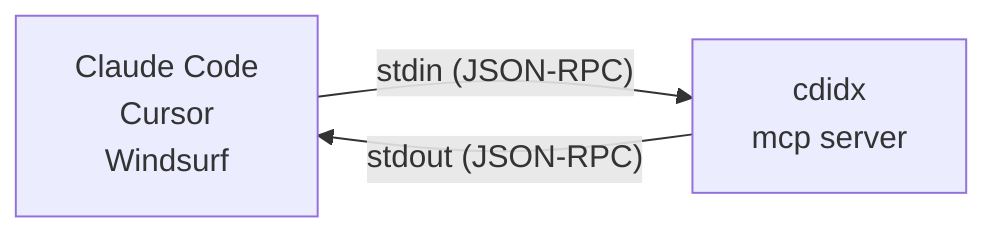

# cdidx User Guide

This is the detailed user documentation moved out of the concise
[README.md](README.md). It keeps the extended install notes, command examples,
AI/MCP setup, language list, and troubleshooting details.

> **[日本語版はこちら / Japanese version](#cdidx日本語)**

[](https://github.com/Widthdom/CodeIndex/actions/workflows/dotnet.yml)
[](https://github.com/Widthdom/CodeIndex/actions/workflows/codeql.yml)
[](https://github.com/Widthdom/CodeIndex/actions/workflows/release.yml)


**The AI-native local code index that cuts token waste in terminal and MCP workflows.**

`cdidx` indexes a repository once, then serves full-text, symbol, and dependency queries from a local SQLite FTS5 database. Instead of making an AI agent rescan the same tree on every turn, you can reuse the local index and hand the model smaller, structured payloads.

```bash
cdidx .                          # Index current directory
cdidx search "authenticate"      # Full-text search
cdidx definition UserService     # Find symbol definitions
cdidx find "guard" --path src/Auth.cs
cdidx deps --path src/           # File-level dependency graph
cdidx mcp                        # Start MCP server for AI tools
```

78 languages supported. 24 MCP tools. Incremental updates. Zero config.

| Topic | Link |
|---|---|
| Docs | [DEVELOPER_GUIDE.md](DEVELOPER_GUIDE.md) for architecture, AI response details, and release workflow |
| AI dev contract | [SELF_IMPROVEMENT.md](SELF_IMPROVEMENT.md) |
| Testing | [TESTING_GUIDE.md](TESTING_GUIDE.md) |
| License | [FSL-1.1-ALv2](LICENSE); integration materials may be Apache-2.0 where marked |

## Why cdidx

Most code search tools optimize for either desktop UI workflows or one-off text scanning in a shell. `cdidx` is built for a different loop: local repositories that need to be searched repeatedly by both humans and AI agents.

- `CLI-first` — designed for terminal workflows, scripts, and automation.
- `AI-native` — `--json` output and MCP structured results are built in, not bolted on.
- `Token-efficient` — compact snippets, `map`, `inspect`, and path filters reduce repeated scans and round-trips.
- `Local-first` — SQLite database lives with the project in `.cdidx/`.
- `Incremental` — refresh only changed files with `--files` or `--commits`.

It is not an IDE replacement or desktop search app. It is a small local search runtime you can script, automate, and hand to AI tools.

Use `rg` when you want a zero-setup one-off scan. Use `cdidx` when the same repository will be searched again and again.

## License and Fair Source Use

CodeIndex and the official `cdidx` binaries are source-available under the
Functional Source License, Version 1.1, ALv2 Future License (`FSL-1.1-ALv2`),
unless a specific file or directory states another license.

In plain language:

- you may use CodeIndex for personal, commercial, internal, educational,
  research, and non-competing development work;
- you may use CodeIndex to search your own code and reduce AI token usage while
  building your products;
- AI agents, IDEs, editors, terminals, scripts, CI workflows, and MCP clients
  may invoke official CodeIndex releases through CLI, JSON output, or MCP;
- examples and integration materials are intended to be integration-friendly
  and may be Apache-2.0 where marked;
- you may not provide CodeIndex, a modified CodeIndex engine, or a derivative
  work of CodeIndex to third parties as a competing code indexing/search/
  retrieval product or service without a separate written agreement.

See:

- `LICENSE`
- `LICENSES/FSL-1.1-ALv2.txt`
- `LICENSES/Apache-2.0.txt`
- `COMMERCIAL_LICENSE.md`
- `INTEGRATION_POLICY.md`
- `TRADEMARKS.md`

CodeIndex is source-available / Fair Source-style software, not OSI-approved open source.

## cdidx vs rg

| | `rg` | `cdidx` |
|---|---|---|
| Best at | One-off text scans | Repeated local code search |
| Setup | None | One-time index build |
| Search model | Reads files every time | Queries a local SQLite FTS5 index |
| Output for automation | Plain text | Human-readable, JSON, and MCP |
| AI integration | Needs parsing | Structured by design |
| Token cost in AI loops | Re-sends broad repo context repeatedly | Reuses the index and fetches short, scoped results |
| Updates after edits | Re-run search | Refresh only changed files |

## cdidx vs VS Code workspace index

`cdidx` and VS Code's workspace index can complement each other, but they are optimized for different execution environments.

| | VS Code workspace index | `cdidx` |
|---|---|---|
| Primary environment | Inside VS Code + Copilot UX | Terminal, CI, scripts, and MCP clients |
| Ownership model | Editor-managed index lifecycle | User-managed local SQLite DB (`.cdidx/codeindex.db`) |
| Interface shape | Implicit editor context for chat/commands | Explicit CLI + MCP tools (`search`, `definition`, `references`, `deps`, `inspect`, etc.) |
| Automation and reproducibility | Strongest in interactive IDE sessions | Strongest in headless and repeatable workflows (agents, hooks, CI) |
| Editor dependency | Requires VS Code/Copilot context | Editor-agnostic (works with any editor, remote shell, or no editor) |
| Scope fit | "Make Copilot in VS Code smarter about this workspace" | "Provide a reusable local retrieval runtime for humans and AI agents" |

If your whole workflow lives in VS Code chat, the built-in workspace index may be enough.
If you need deterministic, scriptable retrieval outside an IDE (or across multiple AI tools), `cdidx` is the better boundary.

For implementation details (schema, indexing pipeline, MCP behavior), see [DEVELOPER_GUIDE.md](DEVELOPER_GUIDE.md).

## 30-Second Quick Start

```bash
# One-liner install (no .NET required)
curl -fsSL https://raw.githubusercontent.com/Widthdom/CodeIndex/main/install.sh | bash
cdidx .
cdidx search "handleRequest"
```

That is the whole loop:

1. `cdidx .` builds or refreshes `.cdidx/codeindex.db`
2. `cdidx search ...` returns results from the local index
3. after edits, refresh with `cdidx . --files path/to/file.cs` or `cdidx . --commits HEAD`

## Installation

### Option A: One-liner install (no .NET required)

Works in containers, CI, and any Linux/macOS environment — no .NET SDK needed.
This includes AI cloud harnesses such as **Claude Code** and **OpenAI Codex**
containers when they can execute shell commands and reach the release assets.
For restricted-network cloud sessions, see
[CLOUD_BOOTSTRAP_PROMPT.md](CLOUD_BOOTSTRAP_PROMPT.md).
That guide also covers `CDIDX_GITHUB_BASE_URL` /
`CDIDX_GITHUB_API_BASE_URL` for mirror or proxy installs, plus the isolated
local-mirror self-test path. The self-test requires `python3` and permission
to listen on `127.0.0.1`; if the default port is busy, move it with
`CDIDX_LOCAL_MIRROR_PORT=18766`. When an install fails behind a corporate
proxy, `bash ./install.sh --doctor` prints the active proxy environment
(with any URL credentials redacted) and probes the installer's upstream URLs,
surfacing the canonical `CONNECT tunnel failed, response 403` guidance so
users get a single actionable next step without having to hand-roll
`curl -I` probes.

```bash
curl -fsSL https://raw.githubusercontent.com/Widthdom/CodeIndex/main/install.sh | bash
```

Install a specific version (fetches the installer from that tag to avoid version skew):

```bash
curl -fsSL https://raw.githubusercontent.com/Widthdom/CodeIndex/v1.5.0/install.sh | bash -s -- v1.5.0
```

If `cdidx` is already installed in a healthy state and you rerun the one-liner without a version, the installer still resolves the latest release tag first. If the installed version already matches the latest healthy release, it skips the download and exits 0; otherwise it upgrades to the newly resolved version. Broken `v0.0.0` installs or same-version installs missing required adjacent assets are treated as reinstall targets. Pass an explicit version when you want to force that exact version.

Supported platforms: `linux-x64`, `linux-arm64`, `osx-arm64` (glibc-based Linux only; Alpine/musl is not supported). Installs to `~/.local/bin` by default (override with `CDIDX_INSTALL_DIR`).

Note: the self-contained binaries installed by `install.sh` are trimmed self-contained releases. CLI `--json` is backed by source-generated serializers, so commands such as `cdidx status --json` work from the release binary. `cdidx mcp` remains available when you want structured responses through an MCP client instead of direct CLI JSON.

**Dockerfile example:**

```dockerfile
# Install cdidx into /usr/local/bin so it's on PATH immediately
RUN export CDIDX_INSTALL_DIR=/usr/local/bin \
    && curl -fsSL https://raw.githubusercontent.com/Widthdom/CodeIndex/main/install.sh | bash
```

### Option B: NuGet Global Tool

Requires [.NET 8.0 SDK](https://dotnet.microsoft.com/download/dotnet/8.0).

```bash
dotnet tool install -g cdidx
```

That's it. `cdidx` is now available as a command.

When `cdidx` is running as a distributed/non-development install, it also
appends stderr plus minimal lifecycle breadcrumbs to a per-user file so silent
hosts still leave traces. Local development runs from the repository's
`src/CodeIndex/bin/...` or `tests/.../bin/...` outputs are excluded by default.
Default locations are `%LOCALAPPDATA%\cdidx\logs\` on Windows,
`~/Library/Logs/cdidx/` on macOS, and `$XDG_STATE_HOME/cdidx/logs/` (or
`~/.local/state/cdidx/logs/`) on Linux. Logs rotate daily and keep the newest
30 files. Set `CDIDX_DISABLE_PERSISTENT_LOG=1` to opt out.

#### Upgrade

If you already have cdidx installed, update to the latest version:

```bash
dotnet tool update -g cdidx
```

### Option C: Build from source

Requires [.NET 8.0 SDK](https://dotnet.microsoft.com/download/dotnet/8.0).

```bash
dotnet build src/CodeIndex/CodeIndex.csproj -c Release
dotnet publish src/CodeIndex/CodeIndex.csproj -c Release -o ./publish
```

Then add the binary to your PATH:

**Linux:**

```bash
sudo cp ./publish/cdidx /usr/local/bin/cdidx
```

**macOS:**

```bash
sudo cp ./publish/cdidx /usr/local/bin/cdidx
```

If `/usr/local/bin` is not in your PATH (Apple Silicon default shell):

```bash
echo 'export PATH="/usr/local/bin:$PATH"' >> ~/.zprofile
source ~/.zprofile
```

**Windows:**

```powershell
# PowerShell (run as Administrator)
New-Item -ItemType Directory -Force -Path C:\Tools
Copy-Item .\publish\cdidx.exe C:\Tools\cdidx.exe

# Add to PATH permanently (current user)
$path = [Environment]::GetEnvironmentVariable('Path', 'User')
if ($path -notlike '*C:\Tools*') {
    [Environment]::SetEnvironmentVariable('Path', "$path;C:\Tools", 'User')
}
```

Restart your terminal after adding to PATH.

### Verify

```bash
cdidx --version
```

## Quick Start

### Index a project

```bash
cdidx ./myproject
cdidx ./myproject --rebuild     # full rebuild from scratch
cdidx ./myproject --verbose     # show per-file details
```

By default, `cdidx index` stores the database in `<projectPath>/.cdidx/codeindex.db`, even if you run the command from another directory.
Indexing keeps the built-in skip lists (`node_modules`, `bin`, `obj`, lockfiles, etc.) and also honors user `.gitignore` plus optional `.cdidxignore` rules across full scans, `--files`, and `--commits` updates. When the project is inside Git, ignore matching follows the repository's `core.ignorecase` setting, even when the indexed project path is a subdirectory inside that repo; repo-root and other ancestor `.gitignore` files above that subdirectory still apply, and `--commits` resolves changed paths from the repository root before narrowing them back to the indexed project root. `**` only gets Git-style special handling in the documented path forms rather than as an unrestricted cross-directory wildcard. If an update refresh includes ignore-file changes, cdidx automatically falls back to a full scan so newly ignored files are purged safely. Invalid ignore lines are skipped with a warning instead of aborting the whole run, while unreadable ignore files fail closed for that directory scope so cdidx does not index with incomplete rules.

Default output:

```
⠹ Scanning...
  Found 42 files

⠋ Indexing...
⠙ Indexing...
  ████████████████████░░░░░░░░░░░░  67.0%  [28/42]

Done.

  Files    : 42
  Chunks   : 318
  Symbols  : 156
  Refs     : 1,024
  Updated  : 14
  Skipped  : 28 (unchanged)
  Graph    : ready
  Issues   : ready
  SQL graph: ready
  Hotspots : ready
  C# names : ready
  Fold     : ready
  Elapsed  : 00:00:02
```

During long-running indexing on an interactive terminal, `Indexing...` stays live as a spinner instead of dropping to a fixed line until the next 50-file progress update. Warnings still print immediately, but the spinner resumes right after each warning so the run does not look frozen. When stdout is redirected (for example `cdidx . > out.txt`), cdidx prints a single `Indexing...` line to stdout, keeps warnings on stderr, and emits only line-based progress updates to stdout.

Machine-readable output also reports the post-run readiness bits directly:

```bash
cdidx ./myproject --json
```

```json
{"status":"success","mode":"incremental","summary":{"files_total":42,"chunks_total":318,"symbols_total":156,"references_total":1024,"files_scanned":42,"files_skipped":28,"files_purged":0,"warnings":0,"errors":0},"graph_table_available":true,"issues_table_available":true,"sql_graph_contract_ready":true,"hotspot_family_ready":true,"csharp_symbol_name_ready":true,"fold_ready":true,"elapsed_ms":2012}
```

With `--verbose`, each file also shows a status tag so you can see exactly what happened:

```
  [WARN] src/generated/min.js: line exceeded max display width
  [OK  ] src/app.cs (12 chunks, 5 symbols)
  [SKIP] src/utils.cs
  [DEL ] src/old.cs
  [ERR ] src/bad.cs: <message>
```

> `[OK  ]` = indexed successfully, `[SKIP]` = unchanged / skipped, `[DEL ]` = deleted from DB (file removed from disk), `[ERR ]` = failed (verbose mode includes stack trace)

Warnings are written to stderr. On an interactive terminal, the indexing spinner pauses long enough to print each warning cleanly, then resumes immediately.

This is useful for debugging indexing issues or verifying which files were actually processed.

If you only need to upgrade an older `.cdidx/codeindex.db` to Unicode-aware `--exact`, you do not need a full rebuild:

```bash
cdidx backfill-fold
```

This recomputes `name_folded` / `*_folded` columns from the existing DB rows and stamps `fold_ready` without reparsing source files. The target must already be an existing CodeIndex DB; blank or missing paths are rejected instead of creating a new database.

### Search code

```bash
cdidx search "authenticate"                             # full-text search
cdidx search "handleRequest" --lang go                  # filter by language
cdidx search "TODO" --limit 50                          # more results
cdidx search "auth*"                                    # trailing * acts as a prefix shorthand
cdidx search "auth*" --fts                              # raw FTS5 syntax when you need operators like NEAR/OR
cdidx search "Run();" --exact-substring                 # case-sensitive exact substring, no FTS5
cdidx search "Foo.Bar" --lang csharp --exact-substring  # Java/Kotlin/C# exact search/find canonicalizes escaped source identifiers
cdidx search "--open-reports" --path README.md --count  # quoted literal that starts with --
cdidx search --query "--path" --path README.md          # search for an option-looking literal
```

Output:

```
src/Auth/Login.cs:15-30
  public bool Authenticate(string user, string pass)
  {
      var hash = ComputeHash(pass);
      return _store.Verify(user, hash);
  ...

src/Auth/TokenService.cs:42-58
  public string GenerateToken(User user)
  {
      var claims = BuildClaims(user);
      return _jwt.CreateToken(claims);
  ...

(2 results)
```

Human-readable search output is centered around the first matching line when possible, instead of always showing the start of the chunk.

Use `--json` for machine-readable output (AI agents):

```json
{"path":"src/Auth/Login.cs","start_line":15,"end_line":30,"content":"public bool Authenticate(...)...","lang":"csharp","score":12.5}
{"path":"src/Auth/TokenService.cs","lang":"csharp","chunk_start_line":1,"chunk_end_line":80,"snippet_start_line":40,"snippet_end_line":47,"snippet":"if (claims.Count == 0)\\n    throw new InvalidOperationException();\\nreturn GenerateToken(claims);","match_lines":[42,47],"highlights":[{"line":47,"text":"return GenerateToken(claims);","terms":["GenerateToken"]}],"context_before":2,"context_after":3,"score":9.8}
```

### Search symbols (functions, classes, etc.)

```bash
cdidx symbols UserService                            # find by name
cdidx symbols UserService OrderService AuthService   # multi-name OR (positional)
cdidx symbols --name UserService --name OrderService # multi-name OR (--name)
cdidx symbols Run --exact-name                       # exact name match (no `RunAsync` / `RunImpact` expansion)
cdidx symbols 'operator +' --exact-name
cdidx symbols 'explicit operator Money' --exact-name
cdidx symbols Item --exact-name                      # C# indexer
cdidx symbols --kind class                           # all classes
cdidx symbols --kind function --lang python
```

Use `--exact-name` when you already have a precise candidate list (e.g. names returned from an earlier `search` / `inspect` / `map` call). Names are compared case-insensitively for equality instead of substring, so `Run` will not also pull in `RunAsync`, `RunImpact`, etc. `--exact-name` composes with `--name`, positional names, and all existing filters. The older `--exact` spelling still works on these commands for backward compatibility, but `--exact-name` avoids the semantic clash with `search`. For C#, pass the canonical extracted symbol name: operators are stored as `operator +` / `operator checked +`, conversion operators as `explicit operator Money` / `implicit operator decimal`, and indexers as `Item`. If your DB was created before the canonical C# operator/indexer rename landed, a normal `cdidx index .` rewrites unchanged C# rows once to upgrade them; `--rebuild` is not required for that change. `status --json` also exposes `csharp_symbol_name_ready` so you can verify that the canonical C# rename has been applied to the current DB. The fold is NFKC + Unicode CaseFold: common non-ASCII pairs such as `Ä` / `ä`, fullwidth `Ｒｕｎ` / `Run`, ligatures, sharp-S (`Straße` / `STRASSE`), and Greek final sigma (`Σ` / `ς` / `σ`) now collapse correctly. Unicode CaseFold remains locale-invariant, so Turkish dotted `İ` still folds to `i\u0307` rather than plain `i`. DBs with stale fold metadata fall back to ASCII `COLLATE NOCASE` until the DB contains only current folded keys. Prefer `cdidx backfill-fold` to refresh stored folded keys without reparsing. A plain `cdidx index .` is also enough if the scan rewrites or purges every stale row; otherwise use `cdidx index . --rebuild`. Use `status --json` → `fold_ready` to detect which path is active.

Output:

```
class      UserService                              src/Services/UserService.cs:8-72
function   GetUserById                              src/Services/UserService.cs:24-41
function   CreateUser                               src/Services/UserService.cs:45-61
(3 symbols)
```

With `--json`, symbol results also include definition ranges, optional body ranges, signature text, container symbol, visibility, and return type when the language extractor can infer them:

```json
{"path":"src/Services/UserService.cs","lang":"csharp","kind":"function","name":"GetUserById","line":24,"start_line":24,"end_line":41,"body_start_line":26,"body_end_line":41,"signature":"public async Task<User> GetUserById(int id)","container_kind":"class","container_name":"UserService","visibility":"public","return_type":"Task<User>"}
```

`search`, `definition`, `references`, `callers`, `callees`, `symbols`, `files`, and `find` also share repeatable `--path <glob>` glob-style path filters (multiple values are OR'd together), repeatable `--exclude-path <glob>`, and `--exclude-tests`. Use `*` and `?` to match path segments, and plain text still behaves like a substring filter when you do not include wildcards. Search results prefer source files over tests and docs, and `search` boosts files whose symbol names or paths match the query exactly.

`search --json` and MCP `search` return compact match-centered snippets instead of whole chunks. Each result includes `chunk_start_line`, `chunk_end_line`, `snippet_start_line`, `snippet_end_line`, `snippet`, `match_lines`, `highlights`, `context_before`, `context_after`, and `truncated_line_count`. Use `--snippet-lines <n>` to shrink or widen the excerpt window (default: 8, max: 20), and `--max-line-width <n>` to clamp each line around the first match when a minified / transpiled file would otherwise return a single huge line (default: 512, max: 4096; `0` disables clamping). Clamped lines are marked with `...(+N)...` in the snippet and expose `highlights[].truncated` / `highlights[].original_line_length` in JSON / MCP output.

### Resolve a definition

```bash
cdidx definition ResolveGitCommonDir
cdidx definition ResolveGitCommonDir --path src/CodeIndex/Cli --exclude-tests
cdidx definition ResolveGitCommonDir --body --json
cdidx definition 'explicit operator Money' --exact-name
```

`definition` uses indexed symbol ranges plus chunk reconstruction to return the actual declaration text, and optional body content when the language extractor can infer a body range.

### Inspect one symbol in one round-trip

```bash
cdidx inspect ResolveGitCommonDir --exclude-tests
cdidx inspect ResolveGitCommonDir --exclude-tests --json
```

`inspect` bundles the primary definition, nearby symbols from the same file, references, callers, callees, file metadata, workspace freshness metadata, and call-graph support metadata so AI clients can answer many symbol-oriented questions without chaining several separate commands. When a language is unsupported for `references` / `callers` / `callees`, `inspect --json` now says so explicitly instead of leaving AI clients to infer that from empty arrays.

### Find references, callers, and callees

```bash
cdidx references ResolveGitCommonDir --exclude-tests
cdidx callers ResolveGitCommonDir --exclude-tests --json
cdidx callees AddToGitExclude --exclude-tests
```

These commands use the indexed reference graph. The canonical graph-supported language filters are reported by `cdidx languages`; in this release they are Assembly, Batch, C, COBOL, C++, C#, CSS, Dart, Dockerfile, Elixir, F#, Go, Gradle, Haskell, Java, JavaScript, Kotlin, Lua, Makefile, Perl, PHP, PowerShell, Protobuf, Python, R, Ruby, Rust, Scala, Shell, SQL, Svelte, Swift, Terraform, TypeScript, VB.NET, Vue, and Zig (37 filters). In JavaScript/TypeScript, graph extraction now also treats zero-argument constructor calls that omit `()` — for example `new Foo;`, `new Date;`, and `new Box<number>;` — as `instantiate` edges. Terraform also indexes dotted `var.*`, `local.*`, `module.*`, and `data.*` references, plus same-file resource-like `TYPE.NAME` references such as `aws_instance.web` and `depends_on = [aws_s3_bucket.foo]`. F# now indexes parenthesized, pipeline, and common space-separated application call sites such as `printfn "x"` and `List.map increment numbers`. Assembly indexes direct call and branch targets such as `call`, `jmp`, `j*`, `bl` / `blx`, `b`, `b.<cond>`, known conditional branch mnemonics, and `loop`-family mnemonics as graph references. Shell now indexes bare function calls in command syntax, so same-file function names remain visible in the graph. For docs, config, markup, or other unsupported languages, fall back to `search`.

When you pass `--lang` for an unsupported language, human-readable graph commands now say so explicitly, and MCP graph tools expose `graph_language`, `graph_supported`, and `graph_support_reason` alongside the empty result list.

### Outline a single file

```bash
cdidx outline src/CodeIndex/Cli/GitHelper.cs
cdidx outline src/CodeIndex/Cli/GitHelper.cs --json
```

Shows all symbols in a single file ordered by line, with kind, signature, visibility, and container nesting. Lets AI agents understand file structure in one call instead of reading the whole file or chaining `symbols` + `definition`.

### Reconstruct a file excerpt

```bash
cdidx excerpt src/CodeIndex/Cli/GitHelper.cs --start 19 --end 28
cdidx excerpt src/CodeIndex/Cli/GitHelper.cs --start 19 --end 28 --before 3 --after 3 --json
```

### Find a substring inside a known file

```bash
cdidx find "graph table" --path src/CodeIndex/Cli/QueryCommandRunner.cs
cdidx find "Graph Table" --path src/CodeIndex/Cli/QueryCommandRunner.cs --exact --before 1 --after 1 --json
```

`find` fills the gap between repo-wide `search` and line-number-based `excerpt`: when you already know the target file, it returns matching line numbers, columns, and short surrounding context from the indexed file without falling back to raw-text tools.

### List files

```bash
cdidx files                            # all indexed files
cdidx files --lang csharp              # only C# files
cdidx files --path src/Services --exclude-path Migrations
```

Output:

```
csharp          120 lines  src/Services/UserService.cs
csharp           85 lines  src/Controllers/UserController.cs
csharp           42 lines  src/Models/User.cs
(3 files)
```

### Check status

```bash
cdidx status
cdidx status --check --json
```

Output:

```
Files    : 42
Chunks   : 318
Symbols  : 156
Refs     : 912
Languages:
  csharp         28
  python         10
  javascript      4
```

`status --check` is the freshness gate. It:

- scans the current indexable files with the same `FileIndexer` path filters and ignore rules used for indexing;
- recomputes raw-byte SHA256 checksums and compares them with the DB's saved checksums;
- reports `index_matches_workspace` plus `workspace_check.changed_files`, `missing_files`, `unindexed_files`, `unverifiable_files`, and `scan_errors`;
- exits `0` only when the DB exactly matches the current workspace. Stale indexes exit `5`.

Run it at the start of AI-agent work to decide whether `.cdidx/codeindex.db` can be trusted without reindexing.

`status --json` also reports readiness and availability metadata:

- storage/index readiness: `fold_ready`, `fold_ready_reason`, `graph_table_available`, `issues_table_available`;
- SQL graph readiness: `sql_graph_contract_ready`, `sql_graph_contract_degraded_reason`;
- hotspot and C# metadata readiness: `hotspot_family_ready`, `hotspot_family_degraded_reason`, `csharp_symbol_name_ready`, `csharp_metadata_target_ready`.

Use these fields as concrete remediation hints:

- `fold_ready=false`: `status --json` includes `degraded_reason`, `recommended_action`, and `alternative_action`. Prefer `cdidx backfill-fold`; use a full rebuild as the fallback. For read-only `file:` DB URIs such as `file:///...?...` or `file:codeindex.db?...`, the remediation path is normalized back to a writable filesystem path.
- `sql_graph_contract_ready=false`: rerun `cdidx index .` before trusting SQL `references` / `callers` / `deps` / `unused` / `hotspots`. The same readiness pair is mirrored by SQL-backed `inspect --json`, JSON graph/dependency output, and MCP graph/dependency tools.
- `hotspot_family_ready=false`: `hotspots` can still run, but duplicate-name families use a conservative fallback until `cdidx index .` restamps hotspot-family metadata.
- `csharp_symbol_name_ready=false`: rerun `cdidx index .` once to rewrite unchanged C# rows to the current canonical operator / conversion-operator / indexer names.
- `csharp_metadata_target_ready=false`: `deps` / `impact` metadata-attribute edges fall back to a signature-shape heuristic; rerun `cdidx index .` once so the authoritative resolver stamps whether each C# class is attribute-derived.

`reference_lines` stores each reference body once per file/line, so new indexes are smaller than the legacy schema. If an existing `.cdidx/codeindex.db` is already bloated, `VACUUM` cannot remove old duplicate rows; rebuild with `cdidx . --rebuild` to reclaim the space.

Without `--check`, the `status` summary freshness indicator is based on stored `indexed_at` and `latest_modified` timestamps, not elapsed wall-clock time. A clean workspace with `indexed_at >= latest_modified` should read as fresh even if the index itself is older than a few minutes.

### Map the repo before searching

```bash
cdidx map --path src/ --exclude-tests
cdidx map --path src/ --exclude-tests --json
```

`map` is the fastest way to orient both a human and an AI agent before deeper queries. Use it to get languages, modules, hot files, and likely entrypoints, then narrow with `inspect`, `search`, or `definition`. For the full freshness and metadata contract of `status --json`, `map --json`, `inspect --json`, and MCP `analyze_symbol`, see [DEVELOPER_GUIDE.md](DEVELOPER_GUIDE.md).

## Options

| Option | Applies to | Description |
|---|---|---|
| `--db <path>` | All commands except `languages`; for `mcp`, only `--db` is supported | Database file path. `index` defaults to `<projectPath>/.cdidx/codeindex.db`; query commands default to `.cdidx/codeindex.db` in the current directory. Query commands without `--db` keep trusting that default `.cdidx/codeindex.db` sibling path, so moving or renaming the current repo does not leave stale workspace metadata behind. For explicit query DBs, workspace metadata such as `project_root`, `git_head`, and `git_is_dirty` comes from the persisted `indexed_project_root` stored in that DB when available. Legacy explicit DBs created before that metadata existed may return those fields as `null` / absent until you rerun `cdidx index <projectPath> --db <path>` or a scoped update that actually commits at least one file delete/update against the intended project, even if the explicit path itself looks like `.../.cdidx/codeindex.db`. |
| `--json` | All commands except `mcp` | JSON output (for AI/machine use) |
| `--check` | `status` | Verify that `.cdidx/codeindex.db` exactly matches the current indexable workspace by comparing DB file paths/checksums against a fresh filesystem scan. Matching indexes exit `0`; stale indexes exit `5`. |
| `--dry-run` | `index` | Scan files and report what would change without writing to the database |
| `--limit <n>` | Query commands | Max results (default: 20, max: 10000; `map` uses it per section) |
| `--lang <lang>` | Query commands | Filter by language (case-insensitive; `--lang Python` is treated as `--lang python`). Common aliases such as `c#`, `cs`, `kt`, and `kts` are also accepted. Unknown values emit an `Available: <languages>` hint on zero-result responses in human-readable output. |
| `--path <glob>` | `search`, `definition`, `references`, `callers`, `callees`, `symbols`, `files`, `find`, `map`, `inspect`, `validate` | Restrict results to glob-style path patterns. `*` and `?` are wildcards. Repeatable; multiple values are OR'd together |
| `--query <query>` | `search`, `definition`, `references`, `callers`, `callees`, `symbols`, `files`, `find`, `inspect`, `impact` | Pass a query literal explicitly, useful when the query starts with `-`. Query commands except `find` also accept `-- <query>` as a one-token query escape while continuing to parse later options. |
| `--exclude-path <glob>` | `search`, `definition`, `references`, `callers`, `callees`, `symbols`, `files`, `find`, `map`, `inspect` | Exclude glob-style path patterns. `*` and `?` are wildcards (repeatable) |
| `--exclude-tests` | `search`, `definition`, `references`, `callers`, `callees`, `symbols`, `files`, `find`, `map`, `inspect` | Exclude likely test files and prefer production code |
| `--snippet-lines <n>` | `search` | Search snippet length for human-readable output and JSON/MCP snippets (default: 8, max: 20) |
| `--max-line-width <n>` | `search`, `references`, `find`, `excerpt`, `inspect` | Clamp very long single-line snippet/reference/excerpt payloads around the relevant match (`0` disables clamping; default: 512, max: 4096) |
| `--fts` | `search` | Use raw FTS5 query syntax; malformed input is reported as a usage error with a hint |
| `--exact` | `search`, `find`, `symbols`, `definition`, `references`, `callers`, `callees`, `inspect` | Backward-compatible shorthand. Prefer `--exact-substring` for `search`, keep `--exact` for `find`, and prefer `--exact-name` for symbol / graph commands plus `inspect`. Pass at most one of `--exact`, `--exact-substring`, `--exact-name`; combining two or more is rejected with `Error: pass only one of --exact, --exact-substring, --exact-name.`. CLI JSON and MCP `structuredContent` expose `exact_index_available` / `degraded_reason`; MCP also keeps the legacy camelCase aliases `exactIndexAvailable` / `degradedReason` for backward compatibility. |
| `--exact-substring` | `search` | Preferred explicit name for search exactness: case-sensitive exact substring (FTS5 bypassed). |
| `--exact-name` | `symbols`, `definition`, `references`, `callers`, `callees`, `inspect` | Preferred explicit name for symbol-name exactness: NFKC + Unicode CaseFold exact equality (`Ä` / `ä`, `Ｒｕｎ` / `Run`, ligatures, sharp-S, and Greek final sigma collapse). Unicode CaseFold remains locale-invariant, so Turkish dotted `İ` is still distinct from plain `i`. For C#, pass the canonical extracted name (`operator +`, `operator checked +`, `explicit operator Money`, `implicit operator decimal`, `Item`) rather than source keywords like `this` / `explicit`. Falls back to ASCII `COLLATE NOCASE` while the DB still contains stale fold metadata; prefer `cdidx backfill-fold`, or use a plain `cdidx index .` if it rewrites or purges every stale row, otherwise `--rebuild`. `status --json` exposes `fold_ready` and `csharp_symbol_name_ready` so AI clients can tell which path is active. When a read-only legacy DB is missing the fallback exact-match indexes, human-readable output warns and CLI JSON / MCP `structuredContent` expose degraded-state metadata. |
| `--kind <kind>` | `definition`, `references`, `callers`, `callees`, `symbols`, `hotspots`, `unused`, `validate` | Filter by kind (case-insensitive; `--kind FUNCTION` is treated as `--kind function`). `definition` / `symbols` / `hotspots` / `unused` use symbol kinds (`function`, `class`, `struct`, `interface`, `enum`, `property`, `event`, `delegate`, `namespace`, `import`); `references` accepts all indexed reference kinds (`call`, `instantiate`, `subscribe`, `attribute`, `annotation`, `type_reference`); `callers` / `callees` accept only the call-graph kinds (`call`, `instantiate`, `subscribe`) and reject non-call-graph kinds (`--kind attribute` / `--kind annotation` / `--kind type_reference`) with a usage error — metadata rows are attributed to the enclosing body-range symbol rather than the annotated target, and `type_reference` rows are compile-time type-position edges (declaration types, generic constraints, `is`/`as`/`instanceof`, XML-doc `cref`) rather than runtime calls, so `callers` / `callees` cannot answer either correctly; use `references --kind attribute` / `references --kind annotation` / `references --kind type_reference` instead. `references` defaults to every indexed reference kind so metadata usages remain visible, while `callers` / `callees` / `hotspots` / `impact` default to the call-graph kinds only (`call`, `instantiate`, `subscribe`) and exclude metadata edges (`attribute`, `annotation`, `type_reference`). Identical constructor `call` + `instantiate` rows at one physical site still collapse; `validate` uses issue kinds such as `bom` |
| `--body` | `definition`, `inspect` | Include reconstructed body content when the language extractor can infer the body range |
| `--count` | `search`, `definition`, `references`, `callers`, `callees`, `symbols`, `files`, `find`, `impact`, `unused`, `hotspots` | Return only counts. `search` / `definition` / `references` / `callers` / `callees` / `symbols` / `files` / `find` / `unused` ignore `--limit` and return authoritative totals; `impact` and `hotspots` still report the visible page count and may truncate with `--limit` (with `--json`: a single count object; commands that expose file counts add `files`) |
| `--group-by-name` | `hotspots` | Collapse rows that share the same `(name, kind)` across files into one representative result while preserving `definition_sites` / `paths` metadata in JSON |
| `--start <line>` | `excerpt` | Start line for excerpt reconstruction (max: 10000000) |
| `--end <line>` | `excerpt` | End line for excerpt reconstruction (defaults to `--start`; max: 10000000) |
| `--before <n>` | `excerpt`, `find` | Include extra context lines before the requested excerpt or match (max: 1000) |
| `--after <n>` | `excerpt`, `find` | Include extra context lines after the requested excerpt or match (max: 1000) |
| `--focus-line <line>` | `excerpt` | Line inside the requested excerpt whose focused column should stay visible when `--max-line-width` clamps long single-line content; requires `--focus-column` (max: 10000000) |
| `--focus-column <n>` | `excerpt` | Column inside the focused line to keep centered when `--max-line-width` clamps long single-line content; must be within that line's length (max: 100000) |
| `--focus-length <n>` | `excerpt` | Width of the focused span when `--max-line-width` clamps long single-line content (default: 1, max: 100000; requires `--focus-column`) |
| `--rebuild` | `index` | Delete existing DB and rebuild |
| `--verbose` | `index` | Show per-file status (`[OK  ]`/`[SKIP]`/`[DEL ]`/`[ERR ]`) |
| `--commits <id...>` | `index` | Update only files changed in specified commits. Prefer this after a normal commit because git history includes rename/delete paths. |
| `--files <path...>` | `index` | Update only the specified files. Safe for known in-place edits or new files; old rename/delete paths are not purged unless you also list them explicitly. |
| `--since <datetime>` | `search`, `definition`, `symbols`, `files` | Filter to files modified since this ISO 8601 timestamp |
| `--no-dedup` | `search` | Disable overlapping-chunk deduplication for raw results |
| `--reverse` | `deps` | Reverse lookup: show files that depend ON the matched path |
| `--top <n>` | Query commands | Alias for `--limit` |

If a query itself begins with `-`, pass it as `--query <query>` or `-- <query>`. If an option value itself begins with `--`, pass it as `--opt=<value>` rather than a separated value, for example `--path=--json-dir` or `--db=--tmp.db`.

### Exit codes

| Code | Meaning |
|---|---|
| `0` | Success |
| `1` | Usage error (invalid arguments) |
| `2` | Not found (no search results, missing directory) |
| `3` | Database error |
| `4` | Feature unavailable on this build (for example CLI `--json` on a manually trimmed custom build) |
| `5` | Stale index (`status --check` found DB/workspace differences) |

### Debugging reader errors

If a query fails with a SQLite reader error such as `The data is NULL at ordinal N`, set `CDIDX_DEBUG=1` and rerun. The failing SQL, bound parameters, and the last-read row's columns will be printed to stderr so the offending record can be located. No-op when unset.

  Text values (chunk `content`, `context`, paths, signatures, string parameters) are **redacted by default** — only the length and a short SHA256 prefix are emitted, so diagnostics can be pasted into issues without leaking indexed source code. Numeric columns, column names, NULL markers, and SQL text are shown as-is. To include raw text content in a local troubleshooting session, set `CDIDX_DEBUG=unsafe` instead (never paste this output publicly).

  Reference line text is now stored once per file/line in `reference_lines`, so fresh indexes stay smaller than the legacy schema that duplicated the same `context` text on every `symbol_references` row. If an existing `.cdidx/codeindex.db` has already grown large, re-run `cdidx . --rebuild` to reclaim the space; `VACUUM` alone will not remove the old duplicated rows from a pre-migration database.

  ```bash
  CDIDX_DEBUG=1 cdidx unused            # redacted text / テキスト伏字化
  CDIDX_DEBUG=unsafe cdidx unused       # raw content, local only / 生テキスト、ローカルのみ
  ```

## How it works

cdidx scans your project directory, applies the built-in skip lists plus user `.gitignore` / `.cdidxignore` rules, splits each remaining source file into overlapping chunks, and stores everything in a SQLite database with FTS5 full-text search. Incremental mode (default) first purges database entries for files that no longer exist on disk, then checks each file's last-modified timestamp against the database — only files whose timestamp exactly matches are skipped, and any difference (newer or older) triggers re-indexing. Newly appeared files are indexed as new entries. The same path filter is reused for scoped `--files` / `--commits` refreshes, commit-based refreshes automatically switch to a full scan when ignore files changed, and Git-managed workspaces follow the repository's `core.ignorecase` setting when evaluating ignore rules. This means re-indexing after a branch switch only processes the files that actually differ unless ignore rules themselves changed.

## Git integration

`cdidx index` automatically adds `.cdidx/` to `.git/info/exclude`. You don't need to edit `.gitignore` just to hide the local index, and user-authored `.gitignore` rules are honored during scanning and scoped updates. If you want cdidx-only exclusions without changing Git behavior, add a `.cdidxignore` file.

`.git/info/exclude` is a standard Git mechanism that works just like `.gitignore`. Many tools use `.git/info/exclude` or store data inside `.git/` to avoid polluting `.gitignore` — git-lfs, git-secret, git-crypt, git-annex, Husky, pre-commit, JetBrains IDEs, VS Code (GitLens), Eclipse, etc.

## Git branch switching

The database reflects the working tree at the time of the last index. After switching branches, run `cdidx status --check --json` first. If it exits `0` with `index_matches_workspace: true`, keep using the existing DB. Otherwise re-run `cdidx .` — files that no longer exist on disk are purged from the database, newly appeared files are indexed, and existing files are re-indexed only when their timestamp differs. The update is proportional to the number of changed files, not the total project size.

| Situation | What happens |
|---|---|
| File unchanged across branches | Skipped (instant) |
| File content changed | Re-indexed |
| File deleted after checkout | Purged from DB |
| File added after checkout | Indexed as new |

## Supported languages

All indexed languages are searchable through FTS5. Rows with **Symbols = yes** also support structured queries by function, class, import, or language-specific symbol name.

| Language | Extensions | Symbols |
|---|---|:---:|
| Python | `.py`, `.pyi`, `.pyw`, `BUILD`, `BUILD.bazel`, `WORKSPACE`, `WORKSPACE.bazel` (Bazel Starlark) | yes |
| Cython | `.pyx`, `.pxd` | -- |
| JavaScript | `.js`, `.jsx`, `.cjs`, `.mjs` | yes |
| TypeScript | `.ts`, `.tsx`, `.cts`, `.mts` | yes |
| C# | `.cs` | yes |
| Go | `.go` | yes |
| Rust | `.rs` | yes |
| Java | `.java` | yes |
| Kotlin | `.kt`, `.kts` | yes |
| Ruby | `.rb`, `.rake`, `.gemspec`, `.podspec`, `Gemfile`, `Rakefile`, `Podfile`, `Guardfile`, `Capfile`, `Vagrantfile` | yes |
| C | `.c`, `.h` | yes |
| C++ | `.cpp`, `.cc`, `.cxx`, `.hh`, `.hpp`, `.hxx` | yes |
| PHP | `.php` | yes |
| Swift | `.swift` | yes |
| Dart | `.dart` | yes |
| Scala | `.scala`, `.sc` | yes |
| Elixir | `.ex`, `.exs` | yes |
| Lua | `.lua` | yes |
| Groovy | `.groovy`, `.gvy`, `.gy`, `.gsh` | -- |
| Crystal | `.cr` | -- |
| Clojure | `.clj`, `.cljs`, `.cljc`, `.edn` | -- |
| D | `.d` | -- |
| Erlang | `.erl`, `.hrl` | -- |
| Julia | `.jl` | -- |
| Nim | `.nim`, `.nims` | -- |
| OCaml | `.ml`, `.mli` | -- |
| Perl | `.pl`, `.pm`, `.t`, `.pod` | -- |
| Solidity | `.sol` | -- |
| Tcl | `.tcl`, `.tk` | -- |
| R | `.r`, `.R` | yes |
| Haskell | `.hs`, `.lhs` | yes |
| F# | `.fs`, `.fsx`, `.fsi` | yes |
| VB.NET | `.vb`, `.vbs` | yes |
| Razor/Blazor | `.cshtml`, `.razor` | yes (C#) |
| Protobuf | `.proto` | yes |
| GraphQL | `.graphql`, `.gql` | yes |
| Gradle | `.gradle` | yes |
| Makefile | `Makefile`, `GNUmakefile`, `Makefile.<suffix>`, `GNUmakefile.<suffix>`, `.mk` | yes |
| Dockerfile | `Dockerfile`, `Containerfile`, `Dockerfile.<suffix>`, `Containerfile.<suffix>` | yes |
| Assembly | `.s`, `.S`, `.asm`, `.nasm` | yes |
| CUDA | `.cu`, `.cuh` | -- |
| GLSL | `.glsl`, `.vert`, `.frag` | -- |
| HLSL | `.hlsl` | -- |
| WGSL | `.wgsl` | -- |
| Metal | `.metal` | -- |
| Verilog | `.v` | -- |
| SystemVerilog | `.sv`, `.svh` | -- |
| VHDL | `.vhd`, `.vhdl` | -- |
| Common Lisp | `.lisp`, `.lsp`, `.cl` | yes |
| Racket | `.rkt` | yes |
| Pascal | `.pas`, `.pp`, `.dpr` | -- |
| Ada | `.ada`, `.adb`, `.ads` | -- |
| Fortran | `.f`, `.f77`, `.f90`, `.f95`, `.f03`, `.f08`, `.for`, `.ftn` | -- |
| Raku | `.raku`, `.rakumod`, `.rakutest` | -- |
| Perl test | `.t` | -- |
| Zig | `.zig` | yes |
| XAML | `.xaml`, `.axaml` | -- |
| MSBuild | `.csproj`, `.fsproj`, `.vbproj`, `.props`, `.targets` | -- |
| Shell | `.sh`, `.bash`, `.zsh`, `.fish` | partial |
| PowerShell | `.ps1`, `.psm1`, `.psd1` | yes |
| Batch | `.bat`, `.cmd` | yes |
| CMake | `.cmake`, `CMakeLists.txt` | -- |
| SQL | `.sql`, `.pgsql`, `.tsql`, `.plsql`, `.pks`, `.pkb`, `.pls`, `.plb`, `.psql` | yes |
| Markdown | `.md` | yes |
| YAML | `.yaml`, `.yml` | -- |
| JSON | `.json` | -- |
| TOML | `.toml` | -- |
| HTML | `.html`, `.htm`, `.xhtml`, `.shtml` | yes |
| CSS | `.css`, `.scss`, `.less`, `.pcss` | yes |
| Sass (indented) | `.sass` | -- |
| Stylus | `.styl` | -- |
| Vue | `.vue` | -- |
| Svelte | `.svelte` | -- |
| Terraform | `.tf` | -- |

**Symbol notes**

- C/C++ headers: `.h` stays on the C path unless the file has clear C++ markers such as `namespace`, `template`, `using`, `class`, or `std::`; those headers are promoted to `cpp` at index time.
- SQL: query-time `--lang tsql` is accepted as a SQL alias, and T-SQL aggregate, assembly, and XML schema collection declarations are searchable.
- R: function assignments, S4/R6 class declarations, validity/generic/method declarations, inherit vectors, public/private/active methods, and `library` / `require` imports are indexed.
- Markdown and CSS: Markdown heading and local-anchor symbols are indexed; CSS variables, placeholders, and `@extend` references are indexed.
- Dockerfile, Assembly, Common Lisp, and Racket: `ARG` build args, labels/PROC/MACRO blocks, package/module forms, definitions, classes/structs, requires, and provides are surfaced as symbols where applicable.
- Shell, PowerShell, and Batch: command-style function calls, functions/filters, classes/enums, imports, labels, `goto` / `call` targets, and inline control-flow forms are indexed where the language supports them.
- C# and Java: modern C# partial members remain visible to `symbols`, `definition`, and `outline`; Java sealed `permits` lists are recorded as `type_reference` graph edges.
- JavaScript/TypeScript exports: barrel re-exports, local and string-literal export aliases, exported variables, default exports, destructured exports, and CommonJS named/default exports are indexed as exported symbols.
- JavaScript/TypeScript imports: static imports, dynamic imports, CommonJS `require` / `require.resolve`, `import.meta.resolve`, `new URL(..., import.meta.url)`, `importScripts`, service-worker registrations, worklet loads, and worker constructors add `import` symbols when the specifier is static.
- Node module layouts: `.cjs` / `.mjs` are JavaScript; `.cts` / `.mts`, including `.d.cts` / `.d.mts`, are TypeScript.
- Extensionless scripts: files with recognized shebangs are indexed for shell (`sh`, `bash`, `zsh`, `fish`, `dash`, `ksh`, `ash`), Python, Ruby, Node.js, PHP, Lua, and PowerShell.

## Prerequisites: sqlite3

AI agents that query the database directly via SQL need the `sqlite3` CLI.

| OS | Status |
|---|---|
| **macOS** | Pre-installed |
| **Linux** | Usually pre-installed. If not: `sudo apt install sqlite3` |
| **Windows** | `winget install SQLite.SQLite` or `scoop install sqlite` |

## AI Integration

cdidx helps AI tools by replacing repeated repo-wide scans with a reusable local index.

- `search --json` and MCP `search` return compact match-centered snippets instead of large file dumps, and `--snippet-lines` lets you cap payload size up front.
- `map`, `inspect`, `definition`, `deps`, and `impact` reduce multi-step repository exploration into fewer round-trips.
- `--path`, repeatable `--exclude-path`, and `--exclude-tests` keep results focused before you spend tokens on excerpts or follow-up prompts.
- `status --json`, `map --json`, and `inspect --json` expose freshness and git-state signals so an agent can decide whether the index is trustworthy.
- `unused --json` and MCP `unused_symbols` expose bucketed dead-code triage metadata plus graph-support signals, so machine clients can distinguish likely-private cleanup from public/config/reflection suspects and from unsupported-language empty pages.
- `cdidx mcp` gives Claude Code, Cursor, Windsurf, Copilot, and Codex a native MCP server instead of forcing them to scrape shell text.

For the full MCP tool list, JSON field contracts, exact-match metadata, and fallback behavior on legacy databases, see [DEVELOPER_GUIDE.md](DEVELOPER_GUIDE.md).

### Setup: Add AI agent search rules

To let AI coding agents use the generated index, add the following search rules to the repo-local instruction file your tool reads, such as `CLAUDE.md`, `AGENTS.md`, or another agent guide. The template is for **downstream projects** that adopt cdidx. Contributors working on the cdidx repo itself should follow this repo's agent entry points because they route execution through the locally built `dotnet ./src/CodeIndex/bin/Debug/net8.0/cdidx.dll` instead of a bare `cdidx` command.

~~~markdown
# Code Search Rules

This project uses **cdidx** for fast code search via a pre-built SQLite index (`.cdidx/codeindex.db`).
**Query this database** instead of using `find`, `grep`, `rg`, or `ls -R`.

## Setup

First check if `cdidx` is available:

```bash
cdidx --version
```

**If not found**, install it:

```bash
# No .NET required — downloads a self-contained binary
curl -fsSL https://raw.githubusercontent.com/Widthdom/CodeIndex/main/install.sh | bash
```

Or, if .NET 8+ SDK is available:

```bash
dotnet tool install -g cdidx
```

When `cdidx` is running as a distributed/non-development install, it also
appends stderr plus minimal lifecycle breadcrumbs to a per-user file so silent
hosts still leave traces. Local development runs from the repository's
`src/CodeIndex/bin/...` or `tests/.../bin/...` outputs are excluded by default.
Default locations are `%LOCALAPPDATA%\cdidx\logs\` on Windows,
`~/Library/Logs/cdidx/` on macOS, and `$XDG_STATE_HOME/cdidx/logs/` (or
`~/.local/state/cdidx/logs/`) on Linux. Logs rotate daily and keep the newest
30 files. Set `CDIDX_DISABLE_PERSISTENT_LOG=1` to opt out.

**If already installed**, reinstall or switch to a specific version explicitly:

```bash
# Reinstall or switch versions explicitly
curl -fsSL https://raw.githubusercontent.com/Widthdom/CodeIndex/vX.Y.Z/install.sh | bash -s -- vX.Y.Z
```

Re-running the no-argument one-liner still targets the latest release: the installer resolves the latest tag first, then skips the download only when the current healthy install already matches that latest version. Broken `v0.0.0` installs or same-version installs missing required adjacent assets are treated as reinstall targets. Use the explicit-version form when you want to force that exact version.

If install fails (no network, unsupported platform), skip to the **"Direct SQL queries"** section below — you can query `.cdidx/codeindex.db` directly with `sqlite3`, provided the database was already built. If neither `cdidx` nor `sqlite3` is available, use the Claude Code built-in `Grep` / `Glob` tools (or your harness's equivalent) — do not fall back to shell `rg` / `grep` / `find` or a global `cdidx` in a Claude Code session, since those may be blocked by a repo-tracked deny list and bypassing them can hide stale-binary bugs.

Before searching, check whether the index already matches the workspace:

```bash
cdidx status --check --json
```

If it exits `0` with `index_matches_workspace: true`, skip reindexing. Otherwise update the index so results are accurate:

```bash
cdidx .   # incremental update (skips unchanged files)
```

## Keeping the index up to date (requires cdidx)

After editing files, update the database so search results stay accurate:

```bash
cdidx . --files path/to/changed_file.cs   # update specific files you modified
cdidx . --commits HEAD                     # update all files changed in the last commit
cdidx . --commits abc123                   # you can also pass a specific commit hash
cdidx .                                    # full incremental update (skips unchanged files)
```

**Rule: whenever you modify source files, run `cdidx status --check --json` before your next search; if it reports a mismatch, run one of the update commands above.**
If the checkout changed because of `git reset`, `git rebase`, `git commit --amend`, `git switch`, or `git merge`, prefer `cdidx .` so stale files are purged against the current worktree instead of only refreshing commit-local paths.

## Query strategy

- Start by checking freshness with `status --check --json` when search correctness matters. If the index does not match the workspace, run `cdidx .` before trusting symbol or graph results. Use `map` / `map --json` for a quick overview of languages, modules, likely entrypoints, and high-activity areas.
- Use `languages` as the source of truth for canonical `--lang` values and current symbol / graph support. Avoid relying on memorized per-language extraction details in prompts or agent instructions; support changes over time and the CLI reports `graph_supported`, `graph_support_reason`, and related trust metadata where it matters.
- When you have a likely symbol name, run `symbols` first to resolve candidates. Add `--exact-name` once the intended symbol is known. Use `outline` for a single file's structure and `inspect` when you want bundled definition, reference, caller, and callee context in one request.
- Use `definition --body` for implementation text, then `references`, `callers`, `callees`, or `impact` for graph questions in supported languages. Prefer `--exact` after a candidate has been resolved so names such as `Run` do not expand to `RunAsync` or `RunImpact`. Treat graph fallback and degraded metadata as guidance about confidence, not as decoration.
- Use `search` for raw text, comments, strings, option names, generated code, or languages where the current `languages` output says structured graph support is unavailable. Use `--exact-substring` for punctuation-heavy literals and `--fts` only when you intentionally want raw FTS5 syntax such as `NEAR` or `OR`.
- Scope broad searches early with `--path <text>`, repeatable `--exclude-path <text>`, and `--exclude-tests` unless tests are the target. For noisy generated, minified, or transpiled files, reduce payload size with `--snippet-lines <n>` and `--max-line-width <n>`.
- Use `files` to discover candidate paths, `find` to re-locate exact text within known files, and `excerpt` to fetch only the needed lines instead of opening entire files.
- Use `deps --reverse` for file-level impact, `impact` for callable symbol ripple checks, `unused` for potentially dead definitions, and `hotspots` for central symbols. These commands are only as strong as the current graph support and freshness metadata, so keep `languages` and `status --check --json` in the loop.
- Use `files --since <datetime>` or `search --since <datetime>` to focus on recent changes, `index --dry-run` to preview index scope, and `--count` to size result sets before fetching full payloads.
- If you encounter a bug, unexpected behavior, or an improvement idea, file an issue at https://github.com/Widthdom/CodeIndex/issues with the observed behavior, expected behavior, and the command you ran.

## CLI (recommended if cdidx is available)

```bash
cdidx status --check --json
cdidx map --path src/ --exclude-tests --json
cdidx inspect "Authenticate" --lang csharp --exact --exclude-tests
cdidx symbols --lang csharp --name Authenticate --exact-name
cdidx definition "Authenticate" --lang csharp --exact --body
cdidx search "keyword" --path src/ --exclude-tests --snippet-lines 6 --max-line-width 160
cdidx search "Run();" --exact-substring --path src/
cdidx callers "Authenticate" --lang csharp --exact --exclude-tests
cdidx impact "Authenticate" --lang csharp --exact --exclude-tests --json
cdidx deps --path src/Services/AuthService.cs --reverse --json
cdidx hotspots --lang csharp --limit 20 --json
cdidx unused --lang csharp --exclude-tests --json
cdidx find "guard" --path src/app.py --after 2
cdidx excerpt src/app.py --start 10 --end 20
cdidx outline src/app.py --json
cdidx languages --json
```

## Direct SQL queries (fallback if cdidx is unavailable)

The queries below require `sqlite3`. Treat this as a basic fallback for raw text / symbol inspection only; prefer `cdidx` for call graph queries, freshness metadata, exact-name semantics, scoped snippets, `impact`, `unused`, and `hotspots`. If `sqlite3` is not installed, suggest the user install it:
- **macOS**: pre-installed
- **Linux**: `sudo apt install sqlite3`
- **Windows**: `winget install SQLite.SQLite` or `scoop install sqlite`

### Full-text search
```sql
SELECT f.path, c.start_line, c.content
FROM fts_chunks fc
JOIN chunks c ON c.id = fc.rowid
JOIN files f ON f.id = c.file_id
WHERE fts_chunks MATCH 'keyword'
LIMIT 20;
```

### Search by function/class name
```sql
SELECT f.path, s.name, s.line
FROM symbols s
JOIN files f ON f.id = s.file_id
WHERE s.kind = 'function' AND s.name LIKE '%keyword%';
```

### Incremental updates for CI / hooks

Instead of re-indexing the entire project, AI agents can update only the files that changed:

```bash
# Update only files changed in specific commits
# Prefer this after a normal commit because git history also carries rename/delete paths
cdidx ./myproject --commits abc123 def456

# Update only specific files after known in-place edits or new-file additions
# Old rename/delete paths are not purged unless you also list them explicitly
cdidx ./myproject --files src/app.cs src/utils.cs
```

Prefer `--commits` for commit-driven automation. Use `--files` for editor/save hooks that only touch existing paths or add new files. After `git reset`, `git rebase`, `git commit --amend`, `git switch`, or `git merge`, prefer a full `cdidx ./myproject --json` refresh so repo-wide stale paths are purged against the current checkout.

These options make it practical to keep the index up-to-date in real time, even on large codebases, without pretending that every delta workflow purges stale paths equally.
~~~

### MCP Server (for Claude Code, Cursor, Windsurf, etc.)

cdidx includes a built-in **MCP (Model Context Protocol) server**. MCP is a standard protocol that lets AI coding tools communicate with external programs. When you run `cdidx mcp`, cdidx starts listening on stdin/stdout — your AI tool sends search requests as JSON, and cdidx returns results instantly from the pre-built index.

Tool results include structured JSON in `structuredContent` plus a short text summary in `content`, so AI tools can parse typed data without scraping large text blocks.



**Setup — add to your AI tool's config:**

Claude Code (`.claude/settings.json` or `.mcp.json`):

```json
{
  "mcpServers": {
    "cdidx": {
      "command": "cdidx",
      "args": ["mcp", "--db", ".cdidx/codeindex.db"]
    }
  }
}
```

Cursor (`.cursor/mcp.json`):

```json
{
  "mcpServers": {
    "cdidx": {
      "command": "cdidx",
      "args": ["mcp", "--db", ".cdidx/codeindex.db"]
    }
  }
}
```

Windsurf (`.windsurf/mcp.json`):

```json
{
  "mcpServers": {
    "cdidx": {
      "command": "cdidx",
      "args": ["mcp", "--db", ".cdidx/codeindex.db"]
    }
  }
}
```

GitHub Copilot (VS Code — `.vscode/mcp.json`):

```json
{
  "servers": {
    "cdidx": {
      "type": "stdio",
      "command": "cdidx",
      "args": ["mcp", "--db", ".cdidx/codeindex.db"]
    }
  }
}
```

OpenAI Codex CLI (`codex.json` or `~/.codex/config.json`):

```json
{
  "mcpServers": {
    "cdidx": {
      "command": "cdidx",
      "args": ["mcp", "--db", ".cdidx/codeindex.db"]
    }
  }
}
```

Once configured, the AI can directly call these tools:

| Tool | Description |
|---|---|
| `search` | Full-text search across code chunks |
| `definition` | Reconstruct a symbol declaration and optional body |
| `references` | Find indexed references for supported languages; identical constructor `call` + `instantiate` rows collapse by default |
| `callers` | List callers for a named symbol in supported languages; `kind` filters by reference kind. The default keeps invocation-like kinds visible (`call`, `instantiate`, `subscribe`) while hiding metadata edges (`attribute`, `annotation`) and compile-time `type_reference` rows (e.g. `nameof(X)` / `typeof(T)`). Human-readable output prints the grouped reference-kind tag at the start of each row, joining multiple distinct kinds with `+` (for example `call+subscribe`) when one container mixes kinds, so terminals can distinguish `call` from `instantiate` / `subscribe` / mixed without `--json`. The reference-kind column widens dynamically to fit the longest label in the batch. The MCP response keeps the scalar `referenceKind` (back-compat with existing consumers; it reports the preferred summary kind `instantiate` > `subscribe` > `MIN(call)`) and adds a sorted `referenceKinds` array plus `hasMixedReferenceKinds` so consumers that need the full picture can avoid trusting a single collapsed label. `callers` is not a reliable path to metadata — an attribute / annotation row is attributed to the enclosing body-range symbol (the class for a member declaration) or drops entirely when the target is file-level (`[assembly: ...]`, where `containerName` is `null`). Use `references` with `kind: "attribute"` / `kind: "annotation"` for metadata enumeration. Identical constructor `call` + `instantiate` rows at one physical site collapse. |
| `callees` | List callees for a named symbol in supported languages; the default keeps invocation-like kinds visible (`call`, `instantiate`, `subscribe`) while hiding metadata edges (`attribute`, `annotation`) and compile-time `type_reference` rows. MCP responses also include the sorted `referenceKinds` array and `hasMixedReferenceKinds` alongside the scalar `referenceKind`, since callee rows stay split per kind but still surface the mixed-kind contract for AI clients. Identical constructor `call` + `instantiate` rows at one physical site collapse. |
| `symbols` | Find functions, classes, interfaces, imports, and namespaces by name |
| `files` | List indexed files |
| `find_in_file` | Find literal substring matches inside known indexed files with line/column context |
| `excerpt` | Reconstruct a specific line range from indexed chunks |
| `map` | Summarize languages, modules, hotspots, and likely entrypoints |
| `analyze_symbol` | Bundle definition, nearby symbols, references, callers, callees, file metadata, workspace trust metadata, and graph support metadata. Bundled `callers` / `callees` rows carry the same `referenceKind` (preferred summary, back-compat) plus `referenceKinds` (sorted distinct) and `hasMixedReferenceKinds` fields as the standalone tools, so mixed `call` + `subscribe` containers stay visible in the bundle. |
| `outline` | Show all symbols in a single file with line numbers, signatures, and container-depth nesting |
| `status` | Database statistics |
| `deps` | File-level dependency edges from the reference graph |
| `impact_analysis` | Compute transitive callers of a symbol (inclusive `maxDepth`: `maxDepth: N` returns callers at depth 1..N — a chain A→B→C→D queried against D with `maxDepth: 2` yields C at depth 1 and B at depth 2); use `maxDepth: 0` to resolve the symbol only, or rely on single-type fallback to heuristic file-level dependency hints and partial-definition hints |
| `unused_symbols` | Find symbols defined but never referenced, with confidence buckets for dead-code triage |
| `symbol_hotspots` | Find high-impact symbols; unique names use codebase-wide counts, duplicate-name families fall back conservatively |
| `batch_query` | Execute multiple queries in a single call (MCP only, max 10) |
| `validate` | Report encoding issues (U+FFFD, BOM, null bytes, mixed line endings) |
| `languages` | List all supported languages, file extensions, and capabilities |
| `ping` | Lightweight connection check |
| `index` | Index or re-index a project directory |
| `backfill_fold` | Upgrade folded-name keys in an existing DB without reparsing source files |
| `suggest_improvement` | Submit structured improvement suggestions or error reports |

No CLAUDE.md hacks or SQL templates needed — the AI interacts with cdidx natively.

If you only need to upgrade an older `.cdidx/codeindex.db` for Unicode `--exact`, or to repair fold metadata drift by regenerating folded keys without reparsing source files, run:

```bash
cdidx backfill-fold
```

This recomputes persisted `name_folded` / `*_folded` columns from existing DB rows and stamps `fold_ready` when verification succeeds. The target must already be an existing CodeIndex DB; blank or missing paths are rejected instead of creating a new database.

Graph-oriented MCP tools such as `references`, `callers`, and `callees` also return `graph_language`, `graph_supported`, and `graph_support_reason` when a language filter is provided, so clients can distinguish unsupported languages from genuine zero-hit queries.

All MCP tools include `annotations` (`readOnlyHint`, `destructiveHint`, `idempotentHint`, `openWorldHint`) so AI clients can auto-approve safe read-only queries without prompting the user.

### Why cdidx over grep/ripgrep for AI workflows?

| | `grep` / `rg` | `cdidx` |
|---|---|---|
| Output format | Plain text (needs parsing) | Structured JSON (`search`/`symbols`-style hits stream as JSON lines; summaries/counts and degraded zero-result graph responses use one object) |
| Search speed on large repos | Scans every file each time | Pre-built FTS5 index |
| Symbol awareness | None | Functions, classes, imports |
| Token footprint across repeated turns | Broad raw context | Short indexed snippets |
| Incremental update | N/A | `--commits`, `--files` |

### AI Feedback

cdidx includes a `suggest_improvement` MCP tool for AI agents that hit gaps or bugs. Suggestions are saved locally to `.cdidx/suggestions.json`, and are sent to GitHub only when the user explicitly provides `CDIDX_GITHUB_TOKEN`. Payload details and source-code leak guardrails are documented in the [Developer Guide](DEVELOPER_GUIDE.md#ai-feedback-implementation).

## Releasing a new version

> **Maintainers / authorized operators only** — the full release procedure now lives in [DEVELOPER_GUIDE.md#release-workflow](DEVELOPER_GUIDE.md#release-workflow). [MAINTAINERS.md](MAINTAINERS.md) is the maintainer index.

The short version: `version.json` is the single source of truth, and the maintainer checklist covers branch/PR triage, changelog promotion, tagging, and clean-install verification.

## More

- [Developer Guide](DEVELOPER_GUIDE.md) — Architecture, database schema, AI response contracts, release workflow, design decisions
- [Testing Guide](TESTING_GUIDE.md) — Test suite layout, helper utilities, cross-platform rules, and test maintenance conventions
- [Self-Improvement Loop](SELF_IMPROVEMENT.md) — Ready-to-use operating contract for iterative AI-driven cdidx improvements

---

<a id="cdidx日本語"></a>
# cdidx（日本語）


**ターミナルとMCPワークフローでAIのトークン浪費を減らす、AIネイティブなローカルコードインデックス。**

`cdidx` は、リポジトリを一度インデックスし、その後の全文検索・シンボル検索・依存関係検索をローカルの SQLite FTS5 DB から返します。AI エージェントに毎ターン同じツリーを読み直させる代わりに、小さく構造化された結果だけを渡せます。

```bash
cdidx .                          # カレントディレクトリをインデックス
cdidx search "authenticate"      # 全文検索
cdidx definition UserService     # シンボル定義を検索
cdidx find "guard" --path src/Auth.cs
cdidx deps --path src/           # ファイル間依存グラフ
cdidx mcp                        # AIツール向けMCPサーバー起動
```

78言語対応。24 MCPツール。インクリメンタル更新。設定不要。

| 項目 | リンク |
|---|---|
| ドキュメント | [DEVELOPER_GUIDE.md](DEVELOPER_GUIDE.md#開発者ガイド) アーキテクチャ、AI応答の詳細、リリース手順 |
| AI開発規約 | [SELF_IMPROVEMENT.md](SELF_IMPROVEMENT.md#自己改善ループ) |
| テストガイド | [TESTING_GUIDE.md](TESTING_GUIDE.md#テストガイド) |
| ライセンス | [FSL-1.1-ALv2](LICENSE)。統合向け資料は明示されていれば Apache-2.0 です |

## なぜ cdidx なのか

多くのコード検索ツールは、デスクトップUI中心のワークフローか、シェルでの単発テキスト検索のどちらかに最適化されています。`cdidx` が狙っているのは別のループです。ローカルリポジトリを、人間とAIの両方が何度も検索する前提で設計しています。

- `ターミナル中心` — ターミナル、スクリプト、自動化向けに設計。
- `AIネイティブ` — `--json` 出力と MCP の構造化結果を標準搭載。
- `省トークン` — コンパクトなスニペット、`map`、`inspect`、パス絞り込みで再走査と往復回数を減らす。
- `ローカル完結` — SQLite DB はプロジェクト内の `.cdidx/` に配置。
- `差分更新` — `--files` と `--commits` で変更分だけ更新。

IDEの置き換えやデスクトップ検索アプリではありません。スクリプト可能で、自動化できて、AIツールにそのまま渡せる小さなローカル検索ランタイムです。

単発で文字列を掘りたいなら `rg`、同じリポジトリを人間とAIの両方が何度も検索するなら `cdidx` が向いています。

## ライセンスと Fair Source の扱い

このリポジトリの CodeIndex と公式 `cdidx` バイナリは、特定のファイルや
ディレクトリに別ライセンスの明示がない限り、Functional Source License,
Version 1.1, ALv2 Future License (`FSL-1.1-ALv2`) の source-available
ソフトウェアです。

平たく言うと:

- 個人、商用、社内、教育、研究、そして非競合の開発作業に使えます;
- 自分が管理するコードを検索し、製品開発中の AI token 消費を減らせます;
- AI エージェント、IDE、エディタ、ターミナル、スクリプト、CI、MCP client は
  CLI、JSON 出力、または MCP 経由で公式リリースを呼び出せます;
- 例や統合向け資料は統合しやすいことを意図しており、明示があるものは
  Apache-2.0 です;
- CodeIndex、改変版 CodeIndex engine、または派生物を、第三者向けの競合する
  code indexing / search / retrieval 製品またはサービスとして提供するには、
  別途の書面契約が必要です。

参照:

- `LICENSE`
- `LICENSES/FSL-1.1-ALv2.txt`
- `LICENSES/Apache-2.0.txt`
- `COMMERCIAL_LICENSE.md`
- `INTEGRATION_POLICY.md`
- `TRADEMARKS.md`

CodeIndex は source-available / Fair Source-style software であり、OSI-approved open source ではありません。

## rg との違い

| | `rg` | `cdidx` |
|---|---|---|
| 得意な用途 | 単発のテキスト走査 | 繰り返し行うローカルコード検索 |
| 初期セットアップ | 不要 | 最初に一度インデックス作成 |
| 検索モデル | 毎回ファイルを読む | ローカルの SQLite FTS5 インデックスを検索 |
| 自動化向け出力 | プレーンテキスト | 人間向け出力、JSON、MCP |
| AI連携 | パースが必要 | 構造化前提 |
| AIループでのトークン消費 | 広い文脈を何度も送り直す | インデックスを再利用し、必要な結果だけ取る |
| 編集後の更新 | 再検索するだけ | 変更ファイルだけ更新できる |

## VS Code workspace index との違い

`cdidx` と VS Code の workspace index は併用できますが、最適化されている実行環境が異なります。

| | VS Code workspace index | `cdidx` |
|---|---|---|
| 主な実行環境 | VS Code + Copilot のUI内 | ターミナル、CI、スクリプト、MCPクライアント |
| インデックス管理 | エディタ側がライフサイクルを管理 | ユーザー管理のローカルSQLite DB（`.cdidx/codeindex.db`） |
| インターフェース | チャット/コマンド向けの暗黙コンテキスト | 明示的なCLI + MCPツール（`search`、`definition`、`references`、`deps`、`inspect` など） |
| 自動化・再現性 | 対話的なIDEセッションで強い | ヘッドレスで再現可能な運用（エージェント、hook、CI）で強い |
| エディタ依存性 | VS Code/Copilot前提 | エディタ非依存（任意エディタ、リモートシェル、IDEなしでも動作） |
| 向いている問題設定 | 「VS Code内のCopilot体験を賢くする」 | 「人間とAIエージェントが再利用するローカル検索ランタイムを提供する」 |

ワークフローが VS Code チャット中心なら、組み込みの workspace index だけで十分な場合があります。
一方で、IDE外・複数AIツール間でも使える、決定論的でスクリプト可能な検索境界が必要なら `cdidx` が向いています。

実装の詳細（スキーマ、索引パイプライン、MCP挙動）は [DEVELOPER_GUIDE.md](DEVELOPER_GUIDE.md#開発者ガイド) を参照してください。

## 30秒で試す

```bash
# .NET 不要のワンライナーインストール
curl -fsSL https://raw.githubusercontent.com/Widthdom/CodeIndex/main/install.sh | bash
cdidx .
cdidx search "handleRequest"
```

やることはこれだけです:

1. `cdidx .` で `.cdidx/codeindex.db` を作成または更新
2. `cdidx search ...` でローカルインデックスを検索
3. 編集後は `cdidx . --files path/to/file.cs` や `cdidx . --commits HEAD` で差分更新

## インストール

### 方法A: ワンライナーインストール（.NET 不要）

コンテナ、CI、Linux/macOS 環境で .NET SDK なしで使えます。
これは **Claude Code** や **OpenAI Codex** のクラウド実行環境
（シェル実行とリリース取得が可能な場合）も含みます。ネットワーク制約のある
クラウドセッション向け手順は
[CLOUD_BOOTSTRAP_PROMPT.md](CLOUD_BOOTSTRAP_PROMPT.md#日本語) を参照してください。
同ガイドには、mirror / proxy install 用の
`CDIDX_GITHUB_BASE_URL` / `CDIDX_GITHUB_API_BASE_URL`、隔離された
local-mirror self-test の使い方、そして `python3` と `127.0.0.1` への
listen 権限が必要なことも書いてあります。既定ポートが埋まっている場合は
`CDIDX_LOCAL_MIRROR_PORT=18766` で変更できます。企業 proxy 経由で
インストールが失敗するときは `bash ./install.sh --doctor` を使うと、
有効な proxy 環境変数（URL 中の資格情報は redact 済み）を表示し、
installer が叩く upstream URL を probe して、`CONNECT tunnel failed,
response 403` 用の定型ガイダンスまで自動で出力します。`curl -I` を
手打ちしなくても、次の一手がひと目で分かります。

```bash
curl -fsSL https://raw.githubusercontent.com/Widthdom/CodeIndex/main/install.sh | bash
```

特定バージョンをインストール（バージョンスキューを防ぐため、そのタグからインストーラーを取得）:

```bash
curl -fsSL https://raw.githubusercontent.com/Widthdom/CodeIndex/v1.5.0/install.sh | bash -s -- v1.5.0
```

健全な `cdidx` が既に入っている状態でバージョン指定なしのワンライナーを再実行しても、installer はまず latest release tag を解決します。現在の install がその最新健全版と一致している場合だけ download を skip して 0 終了し、一致していなければ新しい版へ更新します。壊れた `v0.0.0` install や、同版でも必須隣接資産が欠けた install は再インストール対象として扱われます。特定の版を強制したい場合は、明示的にバージョンを指定してください。

対応プラットフォーム: `linux-x64`, `linux-arm64`, `osx-arm64`（glibc ベースの Linux のみ。Alpine/musl は非対応）。デフォルトで `~/.local/bin` にインストール（`CDIDX_INSTALL_DIR` で変更可）。

注意: `install.sh` で入る自己完結バイナリは trim せずに publish されるため、CLI の `--json` は NuGet グローバルツール版と同じように使えます。MCP クライアント経由の構造化レスポンスが必要な場合は、引き続き `cdidx mcp` も利用できます。

**Dockerfile の例:**

```dockerfile
# /usr/local/bin にインストールして PATH に即反映
RUN export CDIDX_INSTALL_DIR=/usr/local/bin \
    && curl -fsSL https://raw.githubusercontent.com/Widthdom/CodeIndex/main/install.sh | bash
```

### 方法B: NuGet グローバルツール

[.NET 8.0 SDK](https://dotnet.microsoft.com/download/dotnet/8.0) が必要です。

```bash
dotnet tool install -g cdidx
```

これだけです。`cdidx` コマンドがすぐ使えます。

#### アップグレード

すでにインストール済みの場合、最新版に更新できます:

```bash
dotnet tool update -g cdidx
```

### 方法C: ソースからビルド

[.NET 8.0 SDK](https://dotnet.microsoft.com/download/dotnet/8.0) が必要です。

```bash
dotnet build src/CodeIndex/CodeIndex.csproj -c Release
dotnet publish src/CodeIndex/CodeIndex.csproj -c Release -o ./publish
```

ビルド後、バイナリをPATHに追加します:

**Linux:**

```bash
sudo cp ./publish/cdidx /usr/local/bin/cdidx
```

**macOS:**

```bash
sudo cp ./publish/cdidx /usr/local/bin/cdidx
```

`/usr/local/bin` がPATHに含まれていない場合（Apple Siliconのデフォルトシェル）:

```bash
echo 'export PATH="/usr/local/bin:$PATH"' >> ~/.zprofile
source ~/.zprofile
```

**Windows:**

```powershell
# PowerShell（管理者として実行）
New-Item -ItemType Directory -Force -Path C:\Tools
Copy-Item .\publish\cdidx.exe C:\Tools\cdidx.exe

# PATHに永続的に追加（現在のユーザー）
$path = [Environment]::GetEnvironmentVariable('Path', 'User')
if ($path -notlike '*C:\Tools*') {
    [Environment]::SetEnvironmentVariable('Path', "$path;C:\Tools", 'User')
}
```

PATH追加後はターミナルを再起動してください。

### 確認

```bash
cdidx --version
```

## クイックスタート

### プロジェクトをインデックス

```bash
cdidx ./myproject
cdidx ./myproject --rebuild     # 完全再構築
cdidx ./myproject --verbose     # ファイルごとの詳細表示
```

`cdidx index` は、別ディレクトリから実行しても、デフォルトでは `<projectPath>/.cdidx/codeindex.db` にDBを保存します。

デフォルト出力:

```
⠹ Scanning...
  Found 42 files

⠋ Indexing...
⠙ Indexing...
  ████████████████████░░░░░░░░░░░░  67.0%  [28/42]

Done.

  Files   : 42
  Chunks  : 318
  Symbols : 156
  Refs    : 1,024
  Updated : 14
  Skipped : 28 (unchanged)
  Graph   : ready
  Issues  : ready
  SQL graph: ready
  Hotspots: ready
  C# names: ready
  Fold    : ready
  Elapsed : 00:00:02
```

対話ターミナルで長時間インデックスするときも、`Indexing...` は次の 50 ファイル更新まで固定文字列に落ちず、スピナーとして動き続けます。警告はその場で表示されますが、各警告の直後にスピナーが再開するため、処理が止まったようには見えません。stdout をリダイレクトしている場合（例: `cdidx . > out.txt`）は、stdout には `Indexing...` を 1 回だけ出し、警告は stderr に分離したまま、stdout には行単位の進捗だけを出します。

機械向けの `--json` 出力でも、実行後の readiness bit がそのまま返ります:

```bash
cdidx ./myproject --json
```

```json
{"status":"success","mode":"incremental","summary":{"files_total":42,"chunks_total":318,"symbols_total":156,"references_total":1024,"files_scanned":42,"files_skipped":28,"files_purged":0,"warnings":0,"errors":0},"graph_table_available":true,"issues_table_available":true,"sql_graph_contract_ready":true,"hotspot_family_ready":true,"csharp_symbol_name_ready":true,"fold_ready":true,"elapsed_ms":2012}
```

`--verbose` を付けると、各ファイルにステータスタグも表示され、何が起きたか一目でわかります:

```
  [WARN] src/generated/min.js: 表示幅を超える長い行を検出
  [OK  ] src/app.cs (12 chunks, 5 symbols)
  [SKIP] src/utils.cs
  [DEL ] src/old.cs
  [ERR ] src/bad.cs: <message>
```

> `[OK  ]` = インデックス成功、`[SKIP]` = 未変更・スキップ、`[DEL ]` = DBから削除（ディスク上のファイルが消えた）、`[ERR ]` = 失敗（verboseではスタックトレースも表示）

警告は stderr に出ます。対話ターミナルでは、警告をきれいに表示するために一瞬だけスピナーを止め、表示後すぐに再開します。

インデックスの問題をデバッグしたり、どのファイルが実際に処理されたかを確認するのに便利です。

既定では `cdidx index` は DB を `<projectPath>/.cdidx/codeindex.db` に置きます。組み込みのスキップ対象 (`node_modules`、`bin`、`obj`、lockfile など) は常に除外され、さらにユーザーの `.gitignore` と任意の `.cdidxignore` もフルスキャン、`--files`、`--commits` の更新経路すべてで尊重されます。Git 管理下では ignore の大文字小文字判定は OS 名ではなくリポジトリの `core.ignorecase` に従い、repo 配下の subdirectory を project root にした場合でも同じ設定を引き継ぎます。さらに、その subdirectory より上位にある repo-root などの `.gitignore` も有効で、`--commits` の changed path も一度リポジトリルート基準で解決してから project root 配下へ絞り込みます。`**` も無制限のクロスディレクトリ wildcard ではなく Git の path-form globstar でのみ特別扱いされます。`--commits` 実行中に ignore ファイル自体が変わっていた場合は、新しく無視対象になったファイルを安全にパージするため自動でフルスキャンへフォールバックします。不正な ignore 行は警告してスキップし、index 全体は中断しません。逆に ignore ファイル自体が読めない場合は、そのディレクトリ範囲を fail-closed で扱い、不完全なルールのまま index しません。

古い `.cdidx/codeindex.db` を Unicode-aware な `--exact` に上げたいだけなら、フル rebuild は不要です:

```bash
cdidx backfill-fold
```

これは既存 DB 行から `name_folded` / `*_folded` 列を再計算し、ソース再解析なしで `fold_ready` を stamp します。対象は既存の CodeIndex DB に限られ、空のDBや存在しないパスを指定しても新規作成せず拒否します。

### コード検索

```bash
cdidx search "authenticate"                             # 全文検索
cdidx search "handleRequest" --lang go                  # 言語でフィルタ
cdidx search "TODO" --limit 50                          # 結果数を増やす
cdidx search "auth*"                                    # 末尾の * は prefix 検索の shorthand
cdidx search "auth*" --fts                              # 生のFTS5構文。NEAR / OR などの演算子が必要なときだけ使う
cdidx search "Run();" --exact-substring                 # 大文字小文字区別の完全部分一致、FTS5 なし
cdidx search "Foo.Bar" --lang csharp --exact-substring  # Java/Kotlin/C# の exact 検索 / find は escaped source identifier を正規化する
cdidx search "--open-reports" --path README.md --count  # `--` で始まる引用済みリテラル
cdidx search --query "--path" --path README.md          # オプションに見えるリテラルを検索
```

出力:

```
src/Auth/Login.cs:15-30
  public bool Authenticate(string user, string pass)
  {
      var hash = ComputeHash(pass);
      return _store.Verify(user, hash);
  ...

src/Auth/TokenService.cs:42-58
  public string GenerateToken(User user)
  {
      var claims = BuildClaims(user);
      return _jwt.CreateToken(claims);
  ...

(2 results)
```

人間向けの検索出力は、可能な限り最初の一致行を中心にスニペットを表示し、常にチャンク先頭だけを出すことはありません。

`--json` でAI/機械向け出力:

```json
{"path":"src/Auth/Login.cs","start_line":15,"end_line":30,"content":"public bool Authenticate(...)...","lang":"csharp","score":12.5}
{"path":"src/Auth/TokenService.cs","start_line":42,"end_line":58,"content":"public string GenerateToken(...)...","lang":"csharp","score":9.8}
```

### シンボル検索（関数、クラスなど）

```bash
cdidx symbols UserService                            # 名前で検索
cdidx symbols UserService OrderService AuthService   # 複数名を OR 結合（positional）
cdidx symbols --name UserService --name OrderService # 複数名を OR 結合（--name）
cdidx symbols Run --exact-name                       # 名前の完全一致（`RunAsync` / `RunImpact` に広がらない）
cdidx symbols 'operator +' --exact-name
cdidx symbols 'explicit operator Money' --exact-name
cdidx symbols Item --exact-name                      # C# インデクサ
cdidx symbols --kind class                           # すべてのクラス
cdidx symbols --kind function --lang python
```

`--exact-name` は、すでに解決済みの候補リスト（例: `search` / `inspect` / `map` の結果）を渡して正確にその行だけ取り返したいときに使う。部分一致ではなく大文字小文字を無視した完全一致で比較するため、`Run` を指定しても `RunAsync`、`RunImpact` 等には広がらない。`--exact-name` は `--name`、positional 名、他の全フィルタと組み合わせ可能。従来の `--exact` も後方互換で引き続き使えるが、`search` と意味がぶつからない `--exact-name` を推奨する。C# では抽出済みの canonical symbol name を渡す必要があり、演算子は `operator +` / `operator checked +`、変換演算子は `explicit operator Money` / `implicit operator decimal`、インデクサは `Item` で引く。canonical な C# operator/indexer 名へ変わる前に作った DB でも、通常の `cdidx index .` を 1 回流せば unchanged な C# 行を自動で再抽出して更新するため、この変更だけのために `--rebuild` は不要。upgrade 済みかどうかは `status --json` の `csharp_symbol_name_ready` で判定できる。fold は NFKC 正規化 + Unicode CaseFold で、`Ä` / `ä`、全角 `Ｒｕｎ` / `Run`、合字、sharp-S（`Straße` / `STRASSE`）、Greek final sigma（`Σ` / `ς` / `σ`）などの非 ASCII 差分も正しく一致する。Unicode CaseFold は locale-invariant のため、トルコ語の dotted `İ` は依然 plain `i` ではなく `i\u0307` に fold される。stale な fold metadata を含む DB は、DB 内が current folded key のみになるまで ASCII `COLLATE NOCASE` に黙ってフォールバックする。stored folded key を再解析なしで更新したいなら `cdidx backfill-fold` を優先し、scan が stale row をすべて rewrite / purge できるなら通常の `cdidx index .` でも復帰できる。stale row が残る場合だけ `cdidx index . --rebuild` が必要。`status --json` の `fold_ready` で現在の経路を判定可能。

出力:

```
class      UserService                              src/Services/UserService.cs:8-72
function   GetUserById                              src/Services/UserService.cs:24-41
function   CreateUser                               src/Services/UserService.cs:45-61
(3 symbols)
```

`--json` を使うと、シンボル結果には定義範囲、判定できる場合の本体範囲、シグネチャ文字列、親シンボル、可視性、戻り値型も含まれます。

```json
{"path":"src/Services/UserService.cs","lang":"csharp","kind":"function","name":"GetUserById","line":24,"start_line":24,"end_line":41,"body_start_line":26,"body_end_line":41,"signature":"public async Task<User> GetUserById(int id)","container_kind":"class","container_name":"UserService","visibility":"public","return_type":"Task<User>"}
```

`search`、`definition`、`references`、`callers`、`callees`、`symbols`、`files` は共通で繰り返し指定できる `--path <glob>` の glob 形式パスフィルタ（複数値は OR で結合）、繰り返し指定できる `--exclude-path <glob>`、`--exclude-tests` に対応しています。`*` と `?` でパスパターンを指定でき、ワイルドカードを含めない場合は従来どおり部分文字列として扱われます。検索結果は tests や docs より source を優先し、`search` はシンボル名やパスがクエリと正確に一致するファイルを上に出します。

`search --json` と MCP の `search` は、チャンク全文ではなく一致中心の軽量スニペットを返します。各結果には `chunk_start_line`、`chunk_end_line`、`snippet_start_line`、`snippet_end_line`、`snippet`、`match_lines`、`highlights`、`context_before`、`context_after`、`truncated_line_count` が含まれます。抜粋の長さは `--snippet-lines <n>` で調整でき（デフォルト: 8、最大: 20）、minified / transpiled で 1 行が極端に長いファイルでは `--max-line-width <n>` を使って各行を最初の一致トークン周辺へクランプできます（`0` でクランプ解除、デフォルト: 512、最大: 4096）。クランプされた行はスニペット内に `...(+N)...` マーカーが入り、JSON / MCP 出力では `highlights[].truncated` / `highlights[].original_line_length` でも検出できます。

### 定義を引く

```bash
cdidx definition ResolveGitCommonDir
cdidx definition ResolveGitCommonDir --path src/CodeIndex/Cli --exclude-tests
cdidx definition ResolveGitCommonDir --body --json
cdidx definition 'explicit operator Money' --exact-name
```

`definition` は、インデックス済みシンボル範囲とチャンク再構成を使って実際の宣言テキストを返します。言語抽出器が本体範囲を推論できる場合は、`--body` で本体内容も返します。

### 1往復でシンボルを精査する

```bash
cdidx inspect ResolveGitCommonDir --exclude-tests
cdidx inspect ResolveGitCommonDir --exclude-tests --json
```

`inspect` は、主定義、同一ファイル内の近傍シンボル、参照、caller、callee、ファイルメタデータ、さらにワークスペース鮮度メタデータと call graph 対応メタデータをまとめて返すため、AIクライアントが複数コマンドを連鎖させずにシンボル調査を進められます。`references` / `callers` / `callees` が未対応言語で空になる場合も、`inspect --json` がその理由を明示します。

### 参照、callers、callees を調べる

```bash
cdidx references ResolveGitCommonDir --exclude-tests
cdidx callers ResolveGitCommonDir --exclude-tests --json
cdidx callees AddToGitExclude --exclude-tests
```

これらのコマンドはインデックス済み参照グラフを使います。canonical な graph 対応言語フィルタは `cdidx languages` が返します。このリリースでは Assembly、Batch、C、COBOL、C++、C#、CSS、Dart、Dockerfile、Elixir、F#、Go、Gradle、Haskell、Java、JavaScript、Kotlin、Lua、Makefile、Perl、PHP、PowerShell、Protobuf、Python、R、Ruby、Rust、Scala、Shell、SQL、Svelte、Swift、Terraform、TypeScript、VB.NET、Vue、Zig の 37 フィルタです。JavaScript/TypeScript では `()` を省略した zero-arg コンストラクタ呼び出し、たとえば `new Foo;`、`new Date;`、`new Box<number>;` も `instantiate` edge として扱います。Terraform では `var.*`、`local.*`、`module.*`、`data.*` の dotted 参照に加えて、`aws_instance.web` や `depends_on = [aws_s3_bucket.foo]` のような同一ファイル内の resource-like `TYPE.NAME` 参照も索引されます。F# は親付き呼び出し、pipeline 呼び出し、空白区切り application の common な形も graph で拾えるようになりました。Assembly は `call`、`jmp`、`j*`、`bl` / `blx`、`b`、`b.<cond>`、既知の条件分岐 mnemonic、`loop` 系 mnemonic などの直接 call/branch ターゲットを graph 参照として索引します。Shell は command syntax の bare function call を索引するため、同一ファイル内の関数名も graph で見えるようになります。ドキュメント、設定ファイル、マークアップなどの未対応言語では `search` に戻してください。

未対応言語を `--lang` で指定した場合、人間向けの graph コマンドはその旨を明示し、MCP の graph ツールは空結果に加えて `graph_language`、`graph_supported`、`graph_support_reason` を返します。

### 1ファイルのアウトラインを見る

```bash
cdidx outline src/CodeIndex/Cli/GitHelper.cs
cdidx outline src/CodeIndex/Cli/GitHelper.cs --json
```

1ファイル内の全シンボルを行順に、種別・シグネチャ・可視性・コンテナ深さに応じたネスト付きで表示します。ファイル全体を読んだり `symbols` + `definition` をチェーンしたりする代わりに、1回でファイル構造を把握できます。

### ファイル抜粋を再構成する

```bash
cdidx excerpt src/CodeIndex/Cli/GitHelper.cs --start 19 --end 28
cdidx excerpt src/CodeIndex/Cli/GitHelper.cs --start 19 --end 28 --before 3 --after 3 --json
```

### 既知ファイル内の部分文字列を探す

```bash
cdidx find "graph table" --path src/CodeIndex/Cli/QueryCommandRunner.cs
cdidx find "Graph Table" --path src/CodeIndex/Cli/QueryCommandRunner.cs --exact --before 1 --after 1 --json
```

`find` は、リポジトリ全体を対象にする `search` と、行番号が必要な `excerpt` の間を埋めるコマンドです。対象ファイルが既に分かっているときに、raw text ツールへ戻らずに、インデックス済みファイルから一致行番号・列番号・短い前後文脈を返します。

### ファイル一覧

```bash
cdidx files                            # 全インデックス済みファイル
cdidx files --lang csharp              # C#ファイルのみ
cdidx files --path src/Services --exclude-path Migrations
```

出力:

```
csharp          120 lines  src/Services/UserService.cs
csharp           85 lines  src/Controllers/UserController.cs
csharp           42 lines  src/Models/User.cs
(3 files)
```

### 状態確認

```bash
cdidx status
cdidx status --check --json
```

出力:

```
Files   : 42
Chunks  : 318
Symbols : 156
Refs    : 912
Languages:
  csharp         28
  python         10
  javascript      4
```

`status --check` は鮮度確認の入口です。次を実行します。

- indexing と同じ `FileIndexer` の path filter / ignore rule で、現在 index 対象になるファイルを走査します。
- raw bytes の SHA256 を再計算し、DB に保存された checksum と比較します。
- `index_matches_workspace` と `workspace_check.changed_files`、`missing_files`、`unindexed_files`、`unverifiable_files`、`scan_errors` を返します。
- DB が現在の workspace と完全一致するときだけ終了コード `0`、stale な index では終了コード `5` です。

AI agent の作業開始時はこれを先に実行し、`.cdidx/codeindex.db` を再構築せず信頼できるか判断してください。

`status --json` は readiness / availability metadata も返します。

- storage / index: `fold_ready`、`fold_ready_reason`、`graph_table_available`、`issues_table_available`
- SQL graph: `sql_graph_contract_ready`、`sql_graph_contract_degraded_reason`
- hotspot metadata: `hotspot_family_ready`、`hotspot_family_degraded_reason`
- C# metadata: `csharp_symbol_name_ready`、`csharp_metadata_target_ready`

各 flag の対処は機械的に判断できます。

- `fold_ready=false`: `degraded_reason`、`recommended_action`、`alternative_action` に従い、まず `cdidx backfill-fold`、必要なら full rebuild を実行します。read-only `file:` DB URI の場合も、対処用 path は writable な filesystem path に正規化されます。
- `sql_graph_contract_ready=false`: unchanged な SQL 行が古い graph contract のまま残っている可能性があります。SQL の `references` / `callers` / `deps` / `unused` / `hotspots` を信頼する前に `cdidx index .` を再実行してください。
- `hotspot_family_ready=false`: `hotspots` は使えますが、duplicate-name family は保守的 fallback に縮退しうるため、`cdidx index .` で hotspot-family metadata を restamp してください。
- `csharp_symbol_name_ready=false`: `cdidx index .` を 1 回実行し、unchanged な C# 行を現在の canonical operator / conversion operator / indexer 名へ書き換えてください。
- `csharp_metadata_target_ready=false`: `deps` / `impact` の metadata attribute edge 判定がヒューリスティックへフォールバックします。`cdidx index .` を 1 回実行し、各 C# class が attribute 派生かどうかを authoritative resolver で永続化してください。

参照本文は `reference_lines` に file/line ごと 1 回だけ保存されるため、新規 index は legacy schema より小さくなります。既存の `.cdidx/codeindex.db` が肥大化している場合は、`VACUUM` だけでは古い重複行を消せないので、`cdidx . --rebuild` で再構築して空き領域を回収してください。

`--check` なしの `status` summary の鮮度判定は、ビルドからの経過時間ではなく、保存された `indexed_at` と `latest_modified` の比較で決まります。`indexed_at >= latest_modified` かつ workspace が clean なら、index 自体が数分以上前でも fresh と表示されます。

### 検索前にリポジトリ全体を俯瞰する

```bash
cdidx map --path src/ --exclude-tests
cdidx map --path src/ --exclude-tests --json
```

`map` は、人と AI のどちらにも最短で全体像を渡すための入口です。言語、モジュール、ホットなファイル、推定エントリポイントを把握したら、`inspect`、`search`、`definition` に進んでください。`status --json`、`map --json`、`inspect --json`、MCP `analyze_symbol` の詳細なメタデータ契約は [DEVELOPER_GUIDE.md](DEVELOPER_GUIDE.md#開発者ガイド) にまとめています。

## オプション一覧

| オプション | 対象 | 説明 |
|---|---|---|
| `--db <path>` | `languages` を除く全コマンド。`mcp` は `--db` のみ対応 | DBファイルパス。`index` のデフォルトは `<projectPath>/.cdidx/codeindex.db`、クエリ系コマンドのデフォルトはカレントディレクトリの `.cdidx/codeindex.db`。`--db` を付けない query は、その既定の `.cdidx/codeindex.db` sibling path を引き続き正とするため、カレント repo を move/rename しても古い workspace metadata を引きずらない。明示指定 query DB の `project_root`、`git_head`、`git_is_dirty` などの workspace metadata は、利用可能な場合はその DB に保存された `indexed_project_root` から解決される。保存前の古い explicit DB では、意図した project に対して `cdidx index <projectPath> --db <path>`、または少なくとも 1 件の file delete/update を実際に commit する scoped update を一度実行するまで、これらの項目が `null` / 未出力になることがあり、明示パス自体が `.../.cdidx/codeindex.db` でも同じ。 |
| `--json` | `mcp` を除く全コマンド | JSON出力（AI/機械向け） |
| `--check` | `status` | DB のファイル path/checksum と現在の index 対象 workspace を比較し、`.cdidx/codeindex.db` が完全一致するか確認。完全一致なら終了コード `0`、stale なら `5` |
| `--dry-run` | `index` | DB に書き込まず、どの変更が発生するかだけを走査して報告 |
| `--limit <n>` | クエリ系 | 最大結果数（デフォルト: 20、最大: 10000。`map` では各セクションごとの件数） |
| `--path <glob>` | `search`, `definition`, `references`, `callers`, `callees`, `symbols`, `files`, `find`, `map`, `inspect`, `validate` | glob 形式のパスパターンで結果を絞る。`*` と `?` がワイルドカード。繰り返し指定可（複数値は OR で結合） |
| `--exclude-path <glob>` | `search`, `definition`, `references`, `callers`, `callees`, `symbols`, `files`, `find`, `map`, `inspect` | glob 形式のパスパターンを除外する。`*` と `?` がワイルドカード。繰り返し指定可 |
| `--query <query>` | `search`, `definition`, `references`, `callers`, `callees`, `symbols`, `files`, `find`, `inspect`, `impact` | クエリを明示的なリテラルとして渡す。クエリが `-` で始まる場合に有用。`find` 以外のクエリ系コマンドでは `-- <query>` も1トークンのクエリエスケープとして受け付け、その後のオプション解析を続ける。 |
| `--exclude-path <glob>` | `search`, `definition`, `references`, `callers`, `callees`, `symbols`, `files`, `find`, `map`, `inspect` | glob 形式のパスパターンを除外する。`*` と `?` がワイルドカード。繰り返し指定可 |
| `--exclude-tests` | `search`, `definition`, `references`, `callers`, `callees`, `symbols`, `files`, `find`, `map`, `inspect` | テストらしいパスを除外し、本番コードを優先 |
| `--snippet-lines <n>` | `search` | 人間向け出力と JSON/MCP スニペットの抜粋行数（デフォルト: 8、最大: 20） |
| `--max-line-width <n>` | `search`, `references`, `find`, `excerpt`, `inspect` | 極端に長い1行のスニペット・参照文脈・抜粋を、関連箇所の周辺だけに切り詰める（`0` でクランプ解除、デフォルト: 512、最大: 4096） |
| `--fts` | `search` | リテラル安全な引用ではなく生のFTS5クエリ構文を使う |
| `--max-line-width <n>` | `search`, `references`, `find`, `excerpt`, `inspect` | 極端に長い1行のスニペット・参照文脈・抜粋を、関連箇所の周辺だけに切り詰める（`0` でクランプ解除、デフォルト: 512、最大: 4096） |
| `--fts` | `search` | リテラル安全な引用ではなく生のFTS5クエリ構文を使う。壊れた入力はヒント付きの使用エラーになる |
| `--exact` | `search`, `find`, `symbols`, `definition`, `references`, `callers`, `callees`, `inspect` | 後方互換の短縮形。`search` では `--exact-substring`、`find` では `--exact` を使い、symbol / graph 系コマンドと `inspect` では `--exact-name` を推奨。CLI JSON と MCP `structuredContent` は `exact_index_available` / `degraded_reason` を返し、MCP では後方互換の camelCase alias も維持する。 |
| `--exact-substring` | `search` | `search` 用の推奨 explicit alias。大文字小文字を区別する完全部分一致（FTS5 バイパス）。 |
| `--exact-name` | `symbols`, `definition`, `references`, `callers`, `callees`, `inspect` | symbol-name exactness 用の推奨 explicit alias。NFKC + Unicode CaseFold による完全一致（`Ä` / `ä`、全角 `Ｒｕｎ` / `Run`、合字、sharp-S、Greek final sigma を畳み込む）。Unicode CaseFold は locale-invariant のため、トルコ語の dotted `İ` は plain `i` と同一視しない。C# では `this` / `explicit` のような source keyword ではなく、抽出済みの canonical name（`operator +`、`operator checked +`、`explicit operator Money`、`implicit operator decimal`、`Item`）を渡す。DB に stale な fold metadata が残る間は ASCII `COLLATE NOCASE` に fallback するため、まず `cdidx backfill-fold`、または stale row を全置換できる通常の `cdidx index .`、それが無理なら `--rebuild` を使う（`status --json` の `fold_ready` と `csharp_symbol_name_ready` で判定）。read-only な旧DBに fallback exact-match index が無い場合は、人間向け出力が WARN を表示し、CLI JSON と MCP `structuredContent` が縮退メタデータを返す。 |
| `--lang <lang>` | クエリ系 | 言語でフィルタ（大文字小文字を区別しない。`--lang Python` は `--lang python` と同じ扱い）。`c#`、`cs`、`kt`、`kts` のような一般的な別名も受け付ける。未知の値を指定すると、人間向け出力の 0 件応答に `Available: <言語一覧>` ヒントが付く。 |
| `--kind <kind>` | `definition`, `references`, `callers`, `callees`, `symbols`, `hotspots`, `unused`, `validate` | 種別でフィルタ（大文字小文字を区別しない。`--kind FUNCTION` は `--kind function` と同じ扱い）。`definition` / `symbols` / `hotspots` / `unused` は symbol kind（`function`、`class`、`struct`、`interface`、`enum`、`property`、`event`、`delegate`、`namespace`、`import`）、`references` は全ての reference kind（`call`、`instantiate`、`subscribe`、`attribute`、`annotation`、`type_reference`）を受け付ける。`callers` / `callees` は call-graph 種別のみ（`call`、`instantiate`、`subscribe`）を受け付け、非 call-graph 種別（`--kind attribute` / `--kind annotation` / `--kind type_reference`）は usage error で拒否する — metadata 行は注釈対象そのものではなく body-range 上の外側シンボルに帰属し、`type_reference` は宣言型・generic 制約・`is`/`as`/`instanceof`・XML-doc `cref` といった compile-time な型位置エッジであり実行時呼び出しではないため、`callers` / `callees` はいずれの kind にも正しく答えられない。metadata / 型位置参照の列挙は `references --kind attribute` / `references --kind annotation` / `references --kind type_reference` を使う。`references` の既定は全 reference kind を表示して metadata 参照も見えるままにするが、`callers` / `callees` / `hotspots` / `impact` の既定は call-graph kind（`call`、`instantiate`、`subscribe`）のみで、`attribute` / `annotation` / `type_reference` のような metadata edge は除外する。同じ物理位置にある constructor の `call` + `instantiate` 重複行は引き続き集約する。`validate` は `bom` などの issue kind を使う |
| `--body` | `definition`, `inspect` | 言語抽出器が本体範囲を推論できる場合に本体内容も含める |
| `--count` | `search`, `definition`, `references`, `callers`, `callees`, `symbols`, `files`, `find`, `impact`, `unused`, `hotspots` | 件数だけを返す。`search` / `definition` / `references` / `callers` / `callees` / `symbols` / `files` / `find` / `unused` は `--limit` を無視した総件数を返し、`impact` と `hotspots` は visible page count のままで `--limit` によって切り詰められることがある（`--json` 併用時は単一の count オブジェクト。files 件数を出すコマンドは `files` も返す） |
| `--group-by-name` | `hotspots` | ファイルをまたいで同じ `(name, kind)` を共有する行を代表1件に集約し、JSON では `definition_sites` / `paths` metadata を保持したまま返す |
| `--start <line>` | `excerpt` | 抜粋再構成の開始行（最大: 10000000） |
| `--end <line>` | `excerpt` | 抜粋再構成の終了行（省略時は `--start` と同じ、最大: 10000000） |
| `--before <n>` | `excerpt`, `find` | 指定範囲または一致箇所の前に追加する文脈行数（最大: 1000） |
| `--after <n>` | `excerpt`, `find` | 指定範囲または一致箇所の後に追加する文脈行数（最大: 1000） |
| `--focus-line <line>` | `excerpt` | `--max-line-width` で長い1行を切り詰める際に、注目列を表示に残したい抜粋内の行。`--focus-column` 必須（最大: 10000000） |
| `--focus-column <n>` | `excerpt` | `--max-line-width` で長い1行を切り詰める際に、中央付近へ残したい列。対象行の長さ以内である必要があります（最大: 100000） |
| `--focus-length <n>` | `excerpt` | `--max-line-width` で長い1行を切り詰める際の注目範囲の幅（デフォルト: 1、最大: 100000、`--focus-column` 必須） |
| `--rebuild` | `index` | 既存DBを削除して再構築 |
| `--verbose` | `index` | ファイルごとのステータス表示（`[OK  ]`/`[SKIP]`/`[DEL ]`/`[ERR ]`） |
| `--commits <id...>` | `index` | 指定コミットの変更ファイルのみ更新。通常のコミット後はこちらを推奨。rename/delete の旧パスも git 履歴から拾える。 |
| `--files <path...>` | `index` | 指定ファイルのみ更新。把握している in-place 編集や新規ファイル向け。rename/delete の旧パスは明示しない限り purge されない。 |
| `--since <datetime>` | `search`, `definition`, `symbols`, `files` | 指定タイムスタンプ以降に変更されたファイルのみ（ISO 8601） |
| `--no-dedup` | `search` | オーバーラップチャンク重複排除を無効化 |
| `--reverse` | `deps` | 逆引き: 指定パスに依存しているファイルを表示 |
| `--top <n>` | クエリ系 | `--limit` のエイリアス |

クエリ自体が `-` で始まる場合は `--query <query>` または `-- <query>` で渡してください。オプション値自体が `--` で始まる場合は、分離形式ではなく `--opt=<value>` で渡します。たとえば `--path=--json-dir` や `--db=--tmp.db` のように指定します。

### 終了コード

| コード | 意味 |
|---|---|
| `0` | 成功 |
| `1` | 引数エラー |
| `2` | 未検出（検索結果なし、ディレクトリ不在） |
| `3` | データベースエラー |
| `4` | この build では機能未提供（例: trim 済み自己完結リリース上の CLI `--json`） |
| `5` | stale index（`status --check` が DB / workspace の差分を検出） |

### reader エラーのデバッグ

`The data is NULL at ordinal N` のような SQLite reader エラーでクエリが失敗した場合は、`CDIDX_DEBUG=1` を設定して再実行してください。失敗した SQL、バインド済みパラメータ、直近に読み取った行のカラムが stderr に出力されます。未設定時は何もしません。

テキスト値（チャンクの `content`、`context`、パス、シグネチャ、文字列パラメータ）は**既定で伏字化**され、長さと SHA256 先頭のみを出力します。Issue に貼っても索引済みソースが漏れません。数値・カラム名・NULL マーカー・SQL 本文はそのまま出力されます。ローカルでの調査で生テキストが必要な場合は `CDIDX_DEBUG=unsafe` を指定してください（公開の場には貼らないこと）。

```bash
CDIDX_DEBUG=1 cdidx unused            # テキスト伏字化
CDIDX_DEBUG=unsafe cdidx unused       # 生テキスト、ローカルのみ
```

## 動作の仕組み

cdidxはプロジェクトディレクトリを走査し、組み込みのスキップ対象とユーザーの `.gitignore` / `.cdidxignore` を適用したうえで、各ソースファイルを重複を持つチャンクに分割し、FTS5全文検索付きのSQLiteデータベースに格納します。インクリメンタルモード（デフォルト）では各ファイルの最終更新タイムスタンプをDB内の値と比較し、完全一致するファイルのみスキップします。タイムスタンプが異なれば（新しくても古くても）再インデックスされるため、ブランチ切り替え後も正確にインデックスが更新されます。`--files` / `--commits` の部分更新も同じパスフィルタを再利用し、commit 側で ignore ファイルが変わったときは自動でフルスキャンへ切り替わります。Git 管理下の ignore 判定は OS 固定ではなく `core.ignorecase` を参照し、`**` も Git の path-form globstar だけを特別扱いするため、差分更新でも Git と同じ範囲で ignore されます。つまり ignore ルール自体が変わらない限り、差分再インデックスは実際に変わったファイルだけに比例します。

## Git連携

`cdidx index` を実行すると、`.cdidx/` が自動で `.git/info/exclude` に追加されます。ローカル index を隠すために `.gitignore` を編集する必要はなく、ユーザーが書いた `.gitignore` ルールは走査時と部分更新時の両方で尊重されます。Git の挙動は変えずに cdidx だけ除外したい場合は `.cdidxignore` を使ってください。

`.git/info/exclude` は `.gitignore` と同じ効果を持つ Git 標準の仕組みです。`.gitignore` を汚さないよう `.git/info/exclude` や `.git/` 配下を利用するツールは多数あります — git-lfs、git-secret、git-crypt、git-annex、Husky、pre-commit、JetBrains IDE、VS Code (GitLens)、Eclipse など。

## Gitブランチ切り替え

データベースはインデックス実行時のワーキングツリーを反映します。ブランチ切り替え後はまず `cdidx status --check --json` を実行してください。終了コード `0` かつ `index_matches_workspace: true` なら既存 DB をそのまま使えます。それ以外なら `cdidx .` を再実行してください。ディスク上から消えたファイルはDBからパージされ、新たに現れたファイルはインデックスに追加され、既存ファイルはタイムスタンプが異なる場合のみ再インデックスされます。更新量はプロジェクト全体のサイズではなく変更ファイル数に比例します。

| 状況 | 動作 |
|---|---|
| ブランチ間でファイル未変更 | スキップ（即時） |
| ファイル内容が変更 | 再インデックス |
| checkout後にファイル削除 | DBからパージ |
| checkout後にファイル追加 | 新規インデックス |

## 対応言語

全言語が FTS5 全文検索に対応しています。**シンボル = yes** の行は、関数・クラス・import 名などの構造化検索にも対応します。

| 言語 | 拡張子 | シンボル |
|---|---|:---:|
| Python | `.py`, `.pyi`, `.pyw`, `BUILD`, `BUILD.bazel`, `WORKSPACE`, `WORKSPACE.bazel`（Bazel Starlark） | yes |
| Cython | `.pyx`, `.pxd` | -- |
| JavaScript | `.js`, `.jsx`, `.cjs`, `.mjs` | yes |
| TypeScript | `.ts`, `.tsx`, `.cts`, `.mts` | yes |
| C# | `.cs` | yes |
| Go | `.go` | yes |
| Rust | `.rs` | yes |
| Java | `.java` | yes |
| Kotlin | `.kt`, `.kts` | yes |
| Ruby | `.rb`, `.rake`, `.gemspec`, `.podspec`, `Gemfile`, `Rakefile`, `Podfile`, `Guardfile`, `Capfile`, `Vagrantfile` | yes |
| C | `.c`, `.h` | yes |
| C++ | `.cpp`, `.cc`, `.cxx`, `.hh`, `.hpp`, `.hxx` | yes |
| PHP | `.php` | yes |
| Swift | `.swift` | yes |
| Dart | `.dart` | yes |
| Scala | `.scala`, `.sc` | yes |
| Elixir | `.ex`, `.exs` | yes |
| Lua | `.lua` | yes |
| Groovy | `.groovy`, `.gvy`, `.gy`, `.gsh` | -- |
| Crystal | `.cr` | -- |
| Clojure | `.clj`, `.cljs`, `.cljc`, `.edn` | -- |
| D | `.d` | -- |
| Erlang | `.erl`, `.hrl` | -- |
| Julia | `.jl` | -- |
| Nim | `.nim`, `.nims` | -- |
| OCaml | `.ml`, `.mli` | -- |
| Perl | `.pl`, `.pm`, `.t`, `.pod` | -- |
| Solidity | `.sol` | -- |
| Tcl | `.tcl`, `.tk` | -- |
| R | `.r`, `.R` | yes |
| Haskell | `.hs`, `.lhs` | yes |
| F# | `.fs`, `.fsx`, `.fsi` | yes |
| VB.NET | `.vb`, `.vbs` | yes |
| Razor/Blazor | `.cshtml`, `.razor` | yes (C#) |
| Protobuf | `.proto` | yes |
| GraphQL | `.graphql`, `.gql` | yes |
| Gradle | `.gradle` | yes |
| Makefile | `Makefile`, `GNUmakefile`, `Makefile.<suffix>`, `GNUmakefile.<suffix>`, `.mk` | yes |
| Dockerfile | `Dockerfile`, `Containerfile`, `Dockerfile.<suffix>`, `Containerfile.<suffix>` | yes |
| Assembly | `.s`, `.S`, `.asm`, `.nasm` | yes |
| CUDA | `.cu`, `.cuh` | -- |
| GLSL | `.glsl`, `.vert`, `.frag` | -- |
| HLSL | `.hlsl` | -- |
| WGSL | `.wgsl` | -- |
| Metal | `.metal` | -- |
| Verilog | `.v` | -- |
| SystemVerilog | `.sv`, `.svh` | -- |
| VHDL | `.vhd`, `.vhdl` | -- |
| Common Lisp | `.lisp`, `.lsp`, `.cl` | yes |
| Racket | `.rkt` | yes |
| Pascal | `.pas`, `.pp`, `.dpr` | -- |
| Ada | `.ada`, `.adb`, `.ads` | -- |
| Fortran | `.f`, `.f77`, `.f90`, `.f95`, `.f03`, `.f08`, `.for`, `.ftn` | -- |
| Raku | `.raku`, `.rakumod`, `.rakutest` | -- |
| Perl test | `.t` | -- |
| Zig | `.zig` | yes |
| XAML | `.xaml`, `.axaml` | -- |
| MSBuild | `.csproj`, `.fsproj`, `.vbproj`, `.props`, `.targets` | -- |
| Shell | `.sh`, `.bash`, `.zsh`, `.fish` | partial |
| PowerShell | `.ps1`, `.psm1`, `.psd1` | yes |
| Batch | `.bat`, `.cmd` | yes |
| CMake | `.cmake`, `CMakeLists.txt` | -- |
| SQL | `.sql`, `.pgsql`, `.tsql`, `.plsql`, `.pks`, `.pkb`, `.pls`, `.plb`, `.psql` | yes |
| Markdown | `.md` | yes |
| YAML | `.yaml`, `.yml` | -- |
| JSON | `.json` | -- |
| TOML | `.toml` | -- |
| HTML | `.html`, `.htm`, `.xhtml`, `.shtml` | yes |
| CSS | `.css`, `.scss`, `.less`, `.pcss` | yes |
| Sass（インデント構文） | `.sass` | -- |
| Stylus | `.styl` | -- |
| Vue | `.vue` | -- |
| Svelte | `.svelte` | -- |
| Terraform | `.tf` | -- |

**シンボル抽出メモ**

- C/C++ ヘッダー: `.h` は既定では C として扱います。`namespace`、`template`、`using`、`class`、`std::` などの明確な C++ マーカーがある場合だけ、index 時に `cpp` へ昇格します。
- SQL: クエリ時の `--lang tsql` は SQL の別名です。T-SQL の aggregate、assembly、XML schema collection 宣言も検索対象です。
- R: 関数代入、S4/R6 class 宣言、validity/generic/method 宣言、inherit vector、public/private/active method、`library` / `require` import を索引します。
- Markdown と CSS: Markdown の heading / local anchor、CSS の variable、placeholder、`@extend` をシンボルとして扱います。
- Dockerfile、Assembly、Common Lisp、Racket: `ARG` build arg、label、PROC/MACRO、package/module form、definition、class/struct、require/provide を必要に応じて表面化します。
- Shell、PowerShell、Batch: command-style function call、function/filter、class/enum、import、label、`goto` / `call` target、inline control-flow を言語仕様に合わせて索引します。
- C# と Java: C# の近年の partial member は `symbols`、`definition`、`outline` から見えます。Java の sealed `permits` list は `type_reference` graph edge として記録します。
- JavaScript/TypeScript export: barrel re-export、local / string-literal export alias、exported variable、default export、destructured export、CommonJS named/default export を exported symbol として索引します。
- JavaScript/TypeScript import: static import、dynamic import、CommonJS `require` / `require.resolve`、`import.meta.resolve`、`new URL(..., import.meta.url)`、`importScripts`、Service Worker registration、worklet load、worker constructor は、specifier が静的なら `import` シンボルを追加します。
- Node モジュール構成: `.cjs` / `.mjs` は JavaScript、`.cts` / `.mts`（`.d.cts` / `.d.mts` を含む）は TypeScript として扱います。
- 拡張子なしスクリプト: 先頭行の shebang が shell (`sh`, `bash`, `zsh`, `fish`, `dash`, `ksh`, `ash`)、Python、Ruby、Node.js、PHP、Lua、PowerShell として認識できれば index 対象です。

## 前提条件: sqlite3

AIエージェントがDBを直接SQL検索する場合、`sqlite3` CLIが必要です。

| OS | 状況 |
|---|---|
| **macOS** | プリインストール済み |
| **Linux** | 通常プリインストール済み。未導入時: `sudo apt install sqlite3` |
| **Windows** | `winget install SQLite.SQLite` または `scoop install sqlite` |

## AIとの連携

cdidx が AI ワークフローで効く最大の理由は、毎ターン同じリポジトリを読み直さずに済むことです。

- `search --json` と MCP `search` は、大きなファイル断片ではなく一致中心のコンパクトなスニペットを返し、`--snippet-lines` でサイズも先に絞れます。
- `map`、`inspect`、`definition`、`deps`、`impact` を使うと、段階的な調査を少ない往復で進められます。
- `--path`、繰り返し指定できる `--exclude-path`、`--exclude-tests` により、抜粋取得前にノイズを減らせます。
- `status --json`、`map --json`、`inspect --json` は鮮度と Git 状態のシグナルを返すため、AI がインデックスを信用してよいか判断できます。
- `unused --json` と MCP `unused_symbols` は、bucket 化されたデッドコード候補と graph-support シグナルを返すため、private cleanup 候補と public/config/reflection suspect、未対応言語の空ページを機械的に区別できます。
- `cdidx mcp` を使えば、Claude Code、Cursor、Windsurf、Copilot、Codex からシェル出力を無理に解釈せずにネイティブ接続できます。

MCP ツール一覧、JSON フィールド契約、`--exact` まわりのメタデータ、旧 DB フォールバック時の挙動は [DEVELOPER_GUIDE.md](DEVELOPER_GUIDE.md#開発者ガイド) を参照してください。

### セットアップ: AIエージェント向け検索ルールを追加

AI コーディングエージェントにインデックスを活用させるには、`CLAUDE.md`、`AGENTS.md`、その他のエージェントガイドなど、利用中のツールが読むリポジトリローカルの指示ファイルに次の検索ルールを追加してください。以下のテンプレートは **cdidx を導入する下流プロジェクト向け**です。cdidx 本体のリポジトリに貢献する場合は、この repo のエージェント用エントリポイントに従ってください。素の `cdidx` コマンドではなくローカルビルドの `dotnet ./src/CodeIndex/bin/Debug/net8.0/cdidx.dll` を経由する運用になっています。

~~~markdown
# コードベース検索ルール

このプロジェクトは **cdidx** を使い、事前構築済みSQLiteインデックス（`.cdidx/codeindex.db`）で高速コード検索を行います。
コードを検索する際は `find`, `grep`, `rg`, `ls -R` ではなく**このデータベースを検索**してください。

## セットアップ

まず `cdidx` が利用可能か確認してください:

```bash
cdidx --version
```

**見つからない場合**、インストールしてください:

```bash
# .NET 不要 — self-contained バイナリをダウンロード
curl -fsSL https://raw.githubusercontent.com/Widthdom/CodeIndex/main/install.sh | bash
```

または .NET 8+ SDK がある場合:

```bash
dotnet tool install -g cdidx
```

**すでにインストール済みの場合**、再インストールやバージョン切り替えは明示バージョン指定で行ってください:

```bash
# 明示バージョンで再インストールまたは切り替え
curl -fsSL https://raw.githubusercontent.com/Widthdom/CodeIndex/vX.Y.Z/install.sh | bash -s -- vX.Y.Z
```

引数なしワンライナーの再実行も、常に latest release を対象にします。installer はまず最新 tag を解決し、現在の健全 install がその最新版と一致している場合だけ download を skip して 0 終了します。壊れた `v0.0.0` 状態や、同版でも必須隣接資産が欠けている場合は再インストール対象です。特定の版を強制したいときは、上の明示バージョン形式を使ってください。

インストールに失敗した場合（ネットワーク不通、未対応プラットフォーム等）は、データベースが構築済みであれば下記の **「直接SQLクエリ」** セクションで `sqlite3` から `.cdidx/codeindex.db` を直接検索できます。`cdidx` も `sqlite3` も利用できない場合は、Claude Code の組み込み `Grep` / `Glob` ツール（もしくは使用ハーネスの同等機能）を使ってください — Claude Code セッション内では shell の `rg` / `grep` / `find` やグローバル `cdidx` にフォールバックしないでください。これらはリポジトリ追跡の deny リストで塞がれている可能性があり、迂回すると古いバイナリ由来のバグを隠してしまうためです。

検索を始める前に、インデックスが現在の workspace と一致しているか確認してください:

```bash
cdidx status --check --json
```

終了コード `0` かつ `index_matches_workspace: true` なら再インデックス不要です。それ以外ならインデックスを最新化してください:

```bash
cdidx .   # インクリメンタル更新（未変更ファイルはスキップ）
```

## インデックスの最新化（cdidx が必要）

ファイルを編集したら、検索結果を正確に保つためにデータベースを更新してください:

```bash
cdidx . --files path/to/changed_file.cs   # 変更したファイルだけ更新
cdidx . --commits HEAD                     # 直前のコミットで変更されたファイルを更新
cdidx . --commits abc123                   # 特定のコミットハッシュも指定可能
cdidx .                                    # フルインクリメンタル更新（未変更ファイルはスキップ）
```

**ルール: ソースファイルを修正したら、次の検索の前に `cdidx status --check --json` を実行し、差分が報告された場合は上記のいずれかを実行すること。**
`git reset`、`git rebase`、`git commit --amend`、`git switch`、`git merge` で checkout 自体が変わった後は、コミット単位の更新だけでなく stale file の掃除も必要になるため、`cdidx .` を優先してください。

## クエリ戦略

- 検索結果の正しさが重要な場合は、まず `status --check --json` で鮮度を確認する。インデックスが workspace と一致していなければ、symbol / graph 結果を信頼する前に `cdidx .` を実行する。全体像の把握には `map` / `map --json` を使い、言語、モジュール、entrypoint 候補、活動量の高い領域を先に見る。
- `--lang` に渡す正式名と現在の symbol / graph 対応状況は `languages` を正とする。プロンプトやエージェント向け手順に言語別抽出仕様を細かく固定しない。対応範囲は更新されるため、必要な場所では CLI が返す `graph_supported`、`graph_support_reason`、関連する trust metadata を読む。
- 候補シンボル名がある場合は、まず `symbols` で候補を固める。対象が決まったら `--exact-name` を付ける。1ファイルの構造だけ見たいときは `outline`、定義・参照・caller・callee のまとまった文脈が欲しいときは `inspect` を使う。
- 実装本文が必要なら `definition --body` を使い、その後に graph 対応言語では `references`、`callers`、`callees`、`impact` を使う。候補が解決済みなら `--exact` を付け、`Run` が `RunAsync` や `RunImpact` に広がらないようにする。graph fallback や degraded metadata は信頼度の情報として扱う。
- 生テキスト、コメント、文字列、オプション名、生成コード、または現在の `languages` 出力で構造化 graph 対応がない言語には `search` を使う。記号を多く含む literal には `--exact-substring`、`NEAR` や `OR` などの FTS5 構文を意図して使う場合だけ `--fts` を使う。
- 広い検索は早い段階で `--path <text>`、繰り返し指定できる `--exclude-path <text>`、テストが目的でない場合の `--exclude-tests` で絞る。生成・minified・transpiled などノイズの大きいファイルでは `--snippet-lines <n>` と `--max-line-width <n>` で payload を小さくする。
- 候補パスの把握には `files`、既知ファイル内の再探索には `find`、必要行だけ読むときは `excerpt` を使い、ファイル全体を開かない。
- ファイル単位の影響確認には `deps --reverse`、callable symbol の波及確認には `impact`、潜在的な未使用定義には `unused`、中心的なシンボルの把握には `hotspots` を使う。これらは現在の graph 対応とインデックス鮮度に依存するため、`languages` と `status --check --json` を併用する。
- 最近の変更に絞るときは `files --since <datetime>` または `search --since <datetime>`、インデックス対象の事前確認には `index --dry-run`、大きな結果を取る前の見積もりには `--count` を使う。
- cdidx のバグ、予期しない動作、改善アイデアを見つけた場合は、https://github.com/Widthdom/CodeIndex/issues に、実際の挙動、期待する挙動、実行したコマンドを書いて issue を作成してください。

## CLI（cdidxが利用可能な場合に推奨）

```bash
cdidx status --check --json
cdidx map --path src/ --exclude-tests --json
cdidx inspect "Authenticate" --lang csharp --exact --exclude-tests
cdidx symbols --lang csharp --name Authenticate --exact-name
cdidx definition "Authenticate" --lang csharp --exact --body
cdidx search "keyword" --path src/ --exclude-tests --snippet-lines 6 --max-line-width 160
cdidx search "Run();" --exact-substring --path src/
cdidx callers "Authenticate" --lang csharp --exact --exclude-tests
cdidx impact "Authenticate" --lang csharp --exact --exclude-tests --json
cdidx deps --path src/Services/AuthService.cs --reverse --json
cdidx hotspots --lang csharp --limit 20 --json
cdidx unused --lang csharp --exclude-tests --json
cdidx find "guard" --path src/app.py --after 2
cdidx excerpt src/app.py --start 10 --end 20
cdidx outline src/app.py --json
cdidx languages --json
```

## 直接SQLクエリ（cdidxが利用できない場合のフォールバック）

以下のクエリには `sqlite3` が必要です。これは raw text / symbol を最低限覗くためのフォールバックであり、call graph、freshness metadata、exact-name semantics、scoped snippet、`impact`、`unused`、`hotspots` には `cdidx` を優先してください。未インストールの場合、ユーザーにインストールを提案してください:
- **macOS**: プリインストール済み
- **Linux**: `sudo apt install sqlite3`
- **Windows**: `winget install SQLite.SQLite` または `scoop install sqlite`

### 全文検索
```sql
SELECT f.path, c.start_line, c.content
FROM fts_chunks fc
JOIN chunks c ON c.id = fc.rowid
JOIN files f ON f.id = c.file_id
WHERE fts_chunks MATCH 'キーワード'
LIMIT 20;
```

### 関数・クラス名で検索
```sql
SELECT f.path, s.name, s.line
FROM symbols s
JOIN files f ON f.id = s.file_id
WHERE s.kind = 'function' AND s.name LIKE '%キーワード%';
```

### CI / フック向けインクリメンタル更新

プロジェクト全体を再インデックスする代わりに、変更のあったファイルだけを更新できます:

```bash
# 特定コミットの変更ファイルのみ更新
# 通常のコミット直後はこちらを優先。git 履歴に rename/delete path も含まれる
cdidx ./myproject --commits abc123 def456

# 特定ファイルのみ更新（in-place 編集や新規追加向け）
# rename/delete の旧 path は、明示しない限り purge されない
cdidx ./myproject --files src/app.cs src/utils.cs
```

コミット単位の自動化では `--commits` を優先してください。`--files` は既存 path の編集や新規ファイル追加だけを前提にした editor/save hook 向けです。`git reset`、`git rebase`、`git commit --amend`、`git switch`、`git merge` の後は、repo 全体の stale path を掃除するために `cdidx ./myproject --json` のフル更新を優先してください。

これらのオプションにより、大規模コードベースでもリアルタイムにインデックスを最新に保ちやすくなりますが、stale path を purge できる範囲は更新モードごとに異なります。
~~~

### MCP サーバー（Claude Code、Cursor、Windsurf 等に対応）

cdidxには**MCP（Model Context Protocol）サーバー**が組み込まれています。MCPは、AIコーディングツールが外部プログラムと通信するための標準プロトコルです。`cdidx mcp` を実行すると、cdidxがstdin/stdoutで待機し、AIツールからの検索リクエストをJSONで受け取り、構築済みインデックスから即座に結果を返します。

ツール結果は `structuredContent` に構造化JSON、`content` に短い要約テキストを返すため、AIツールは巨大なテキストをパースせずに型付きデータを扱えます。


**セットアップ — AIツールの設定ファイルに追加するだけ:**

Claude Code (`.claude/settings.json` または `.mcp.json`):

```json
{
  "mcpServers": {
    "cdidx": {
      "command": "cdidx",
      "args": ["mcp", "--db", ".cdidx/codeindex.db"]
    }
  }
}
```

Cursor (`.cursor/mcp.json`):

```json
{
  "mcpServers": {
    "cdidx": {
      "command": "cdidx",
      "args": ["mcp", "--db", ".cdidx/codeindex.db"]
    }
  }
}
```

Windsurf (`.windsurf/mcp.json`):

```json
{
  "mcpServers": {
    "cdidx": {
      "command": "cdidx",
      "args": ["mcp", "--db", ".cdidx/codeindex.db"]
    }
  }
}
```

GitHub Copilot (VS Code — `.vscode/mcp.json`):

```json
{
  "servers": {
    "cdidx": {
      "type": "stdio",
      "command": "cdidx",
      "args": ["mcp", "--db", ".cdidx/codeindex.db"]
    }
  }
}
```

OpenAI Codex CLI (`codex.json` または `~/.codex/config.json`):

```json
{
  "mcpServers": {
    "cdidx": {
      "command": "cdidx",
      "args": ["mcp", "--db", ".cdidx/codeindex.db"]
    }
  }
}
```

設定するだけで、AIが以下のツールを直接呼び出せます:

| ツール | 説明 |
|---|---|
| `search` | コードチャンクの全文検索 |
| `definition` | シンボルの宣言と必要なら本体を再構成して取得 |
| `references` | 対応言語でインデックス済み参照を検索。constructor site の `call` + `instantiate` 重複は既定で集約 |
| `callers` | 対応言語で指定シンボルの caller を列挙。`kind` は reference kind を指し、既定では invocation 系の kind（`call`、`instantiate`、`subscribe`）のみを表示して `attribute` / `annotation` のような metadata edge とコンパイル時の `type_reference`（`nameof(X)` / `typeof(T)` 等）は除外する。人間向け出力では各行の先頭に reference kind タグを表示し、1 つの container で複数 kind が混在する場合は `call+subscribe` のように `+` で連結して示すため、`--json` を付けなくても `call` / `instantiate` / `subscribe` / mixed を見分けられる。reference-kind 列の幅はバッチ内の最長ラベルに合わせて動的に広がる。MCP レスポンスは後方互換のため scalar な `referenceKind`（preferred 順 `instantiate` > `subscribe` > `MIN(call)` の要約 kind）を残しつつ、ソート済みの `referenceKinds` 配列と `hasMixedReferenceKinds` も追加したので、全 kind が必要な consumer は要約ラベルに騙されずに済む。metadata 行の container は注釈対象そのものではなく body-range 上の外側シンボル（メンバ宣言ならクラス）に設定され、`[assembly: ...]` のようなファイルレベル target では `containerName` が `null` になって `callers` 結果から脱落する。C# の `[...]` 属性や Java 系 `@Annotation(...)` を列挙したいときは `references --kind attribute|annotation` / MCP `references` を使う。同じ物理位置にある constructor の `call` + `instantiate` 重複は集約する。 |
| `callees` | 対応言語で指定シンボルの callee を列挙。既定は invocation 系の kind（`call`、`instantiate`、`subscribe`）のみで、`attribute` / `annotation` のような metadata edge とコンパイル時の `type_reference` は除外する。MCP レスポンスには scalar な `referenceKind` に加えて、ソート済みの `referenceKinds` 配列と `hasMixedReferenceKinds` も含める。callee 側は kind 単位で行が分かれるが、AI クライアントが caller 側と同じ mixed-kind 契約を扱えるようにするため。同じ物理位置にある constructor の `call` + `instantiate` 重複は集約する。 |
| `symbols` | 関数・クラス・インターフェース・import・namespace を名前で検索 |
| `files` | インデックス済みファイル一覧 |
| `find_in_file` | 既知のインデックス済みファイル内でリテラル部分文字列一致を行・列付きで検索 |
| `excerpt` | インデックス済みチャンクから特定行範囲を再構成 |
| `map` | 言語、モジュール、ホットスポット、推定エントリポイントを要約 |
| `analyze_symbol` | 定義、近傍シンボル、参照、caller、callee、ファイル情報、ワークスペース信頼メタデータ、graph 対応メタデータをまとめて返す。バンドルされた `callers` / `callees` 行にも単独の `callers` / `callees` と同じ `referenceKind`（後方互換の優先サマリー種別）、`referenceKinds`（distinct kind の昇順配列）、`hasMixedReferenceKinds` が付くため、`call` + `subscribe` が混在する container も要約 1 ラベルに潰れず見える。 |
| `outline` | 1ファイルの全シンボルを行番号・シグネチャ・コンテナ深さに応じたネスト付きで表示 |
| `status` | データベース統計情報 |
| `deps` | 参照グラフからファイル間依存エッジを表示 |
| `impact_analysis` | シンボルの推移的 caller を算出（`maxDepth` は inclusive で、`maxDepth: N` 指定時は depth 1〜N の caller を返す。例: A→B→C→D のチェーンで D を `maxDepth: 2` 検索すると C(depth=1) と B(depth=2) が返る）。`maxDepth: 0` で symbol 解決のみを行い、単一定義の型は heuristic な file-level dependency hint にフォールバックし、複数定義時はヒントも返す |
| `unused_symbols` | 定義されているが参照されていないシンボルを bucket 付きで検索（デッドコード検出向け） |
| `symbol_hotspots` | 影響の大きいシンボルを検索。一意名は codebase 全体件数、同名ファミリーは保守的に縮退 |
| `batch_query` | 複数クエリを1回で実行（MCP専用、最大10件） |
| `validate` | エンコーディング問題（U+FFFD、BOM、null バイト、改行混在）を報告 |
| `languages` | 対応言語一覧を拡張子・機能付きで表示 |
| `ping` | 軽量な接続確認 |
| `index` | プロジェクトのインデックス作成・更新 |
| `backfill_fold` | 既存 DB の folded-name key をソース再解析なしで更新 |
| `suggest_improvement` | 構造化された改善提案またはエラー報告を送信 |

CLAUDE.mdの設定やSQLテンプレートは不要 — AIがcdidxとネイティブに連携します。

古い `.cdidx/codeindex.db` を Unicode `--exact` 対応へ上げたいだけ、または fold metadata の drift を folded key 再生成だけで解消したいなら、ソース再解析なしで次を実行できます:

```bash
cdidx backfill-fold
```

これは既存 DB 行から `name_folded` / `*_folded` 列を再計算し、`fold_ready` を stamp する。対象は既存の CodeIndex DB に限られ、空のDBや存在しないパスを指定しても新規作成せず拒否する。

`references`、`callers`、`callees` などの graph 系 MCP ツールも、言語フィルタが指定されている場合は `graph_language`、`graph_supported`、`graph_support_reason` を返し、未対応言語と単なる 0 件ヒットを区別できるようにしています。

全 MCP ツールは `annotations`（`readOnlyHint`、`destructiveHint`、`idempotentHint`、`openWorldHint`）を含み、AIクライアントがユーザーへの確認なしに安全な読み取り専用クエリを自動承認できるようにしています。

### AIワークフローで grep/ripgrep より cdidx が優れる理由

| | `grep` / `rg` | `cdidx` |
|---|---|---|
| 出力形式 | プレーンテキスト（パース必要） | 構造化JSON（`search` / `symbols` 系のヒットは JSON ライン、summary/count と degraded な graph 0件は単一オブジェクト） |
| 大規模リポジトリでの検索速度 | 毎回全ファイルスキャン | 構築済みFTS5インデックス |
| シンボル認識 | なし | 関数、クラス、インポート |
| 繰り返し調査でのトークン量 | 生の広い文脈 | 短いインデックス済みスニペット |
| インクリメンタル更新 | N/A | `--commits`, `--files` |

### AIフィードバック

cdidx には、AI エージェントがギャップや不具合に気づいたときに使える `suggest_improvement` MCP ツールがあります。提案は `.cdidx/suggestions.json` にローカル保存され、`CDIDX_GITHUB_TOKEN` を明示設定した場合に限って GitHub へ送信されます。ペイロード詳細とソースコード漏えいガードは [DEVELOPER_GUIDE.md#aiフィードバックの実装](DEVELOPER_GUIDE.md#aiフィードバックの実装) にまとめています。

## 新バージョンのリリース

> **Maintainer・認可オペレーター向け** — 詳細なリリース手順は [DEVELOPER_GUIDE.md#リリース手順](DEVELOPER_GUIDE.md#リリース手順) にあります。[MAINTAINERS.md](MAINTAINERS.md#maintainer-と認可オペレーター向け) は maintainer 向け索引です。

要点だけ言うと、バージョンの真実は `version.json` に集約されており、メンテナ向けチェックリストには未マージ枝/PR のトリアージ、CHANGELOG 昇格、タグ付け、クリーンインストール検証まで含まれます。

## もっと詳しく

- [開発者ガイド](DEVELOPER_GUIDE.md#開発者ガイド) — アーキテクチャ、DBスキーマ、AI応答契約、リリース手順、設計判断
- [テストガイド](TESTING_GUIDE.md#テストガイド) — テストスイート構成、共有ヘルパー、クロスプラットフォーム注意点、保守ルール
- [自己改善ループ](SELF_IMPROVEMENT.md#自己改善ループ) — AIが cdidx 自身を継続改善するときの、そのまま使える運用契約
